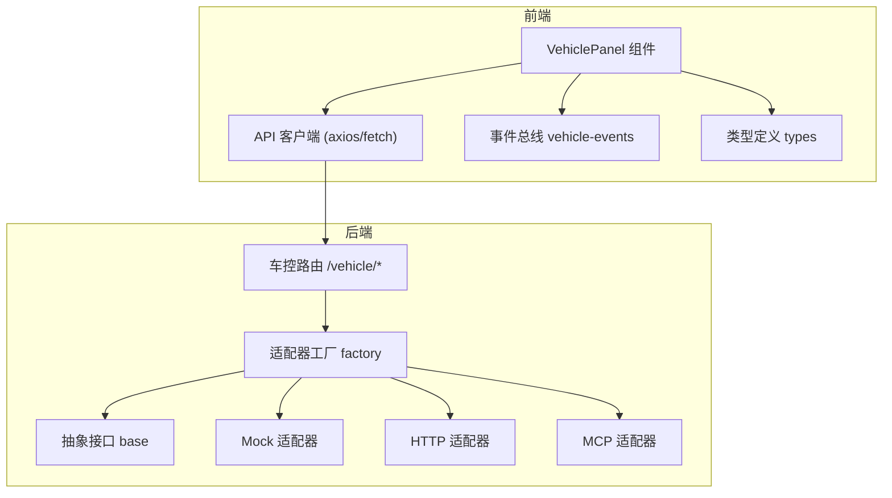
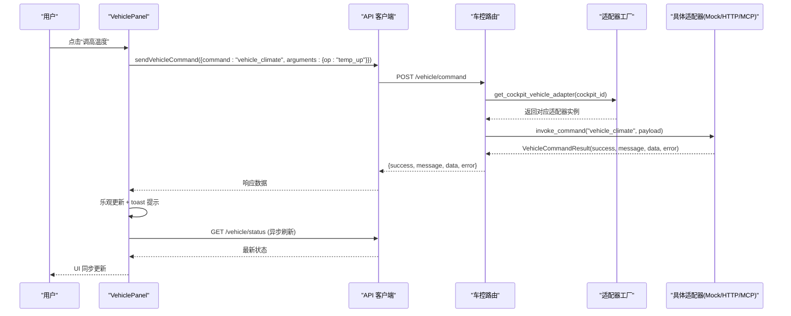
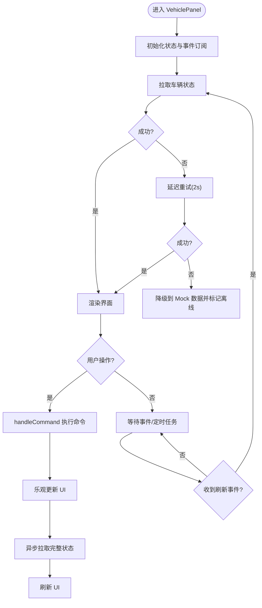
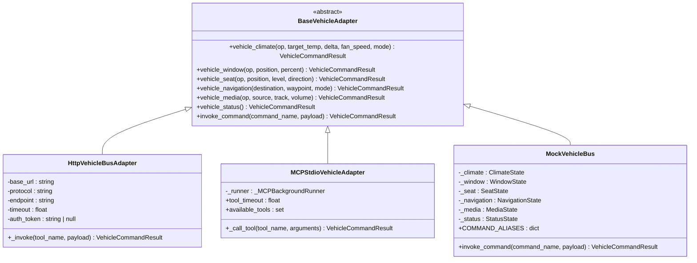
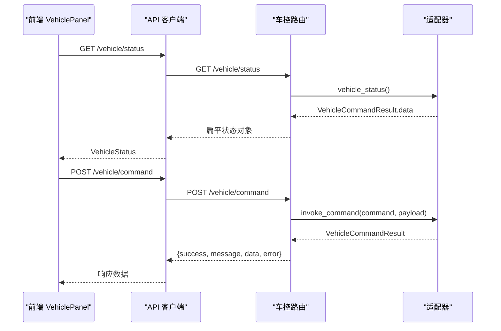
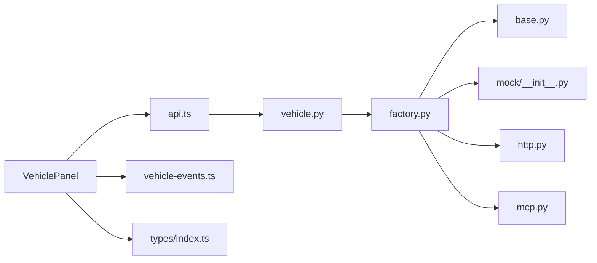

# 车辆面板组件

<cite>
**本文引用的文件**   
- [frontend_design/src/components/vehicle/vehicle-panel.tsx](file://frontend_design/src/components/vehicle/vehicle-panel.tsx)
- [frontend_design/src/lib/api.ts](file://frontend_design/src/lib/api.ts)
- [frontend_design/src/lib/vehicle-events.ts](file://frontend_design/src/lib/vehicle-events.ts)
- [frontend_design/src/types/index.ts](file://frontend_design/src/types/index.ts)
- [backend_design/nexus/api/routes/vehicle.py](file://backend_design/nexus/api/routes/vehicle.py)
- [backend_design/nexus/vehicle/base.py](file://backend_design/nexus/vehicle/base.py)
- [backend_design/nexus/vehicle/factory.py](file://backend_design/nexus/vehicle/factory.py)
- [backend_design/nexus/vehicle/http.py](file://backend_design/nexus/vehicle/http.py)
- [backend_design/nexus/vehicle/mcp.py](file://backend_design/nexus/vehicle/mcp.py)
- [backend_design/nexus/vehicle/mock/__init__.py](file://backend_design/nexus/vehicle/mock/__init__.py)
</cite>

## 目录
1. [简介](#简介)
2. [项目结构](#项目结构)
3. [核心组件](#核心组件)
4. [架构总览](#架构总览)
5. [详细组件分析](#详细组件分析)
6. [依赖关系分析](#依赖关系分析)
7. [性能考虑](#性能考虑)
8. [故障排查指南](#故障排查指南)
9. [结论](#结论)
10. [附录：集成与使用示例](#附录集成与使用示例)

## 简介
本技术文档围绕 NexusCockpit 的车辆面板组件（VehiclePanel）展开，系统性阐述其功能实现、状态管理、与车控系统的集成方式（Mock/HTTP/MCP）、命令执行流程、状态更新机制、错误处理策略以及与聊天窗口的联动刷新。同时提供性能优化建议与完整的集成使用指引，帮助开发者快速理解并扩展该组件。

## 项目结构
前端侧：
- 车辆面板 UI 与交互逻辑位于 vehicle-panel.tsx，负责空调、座椅、媒体、导航、车窗控制及车辆状态展示。
- API 客户端封装在 api.ts，统一处理认证、座舱隔离、错误重试与流式请求等。
- 事件总线 vehicle-events.ts 用于语音助手触发车控后的 UI 刷新通知。
- 类型定义集中在 types/index.ts，包含 VehicleStatus、VehicleCommand 等关键数据结构。

后端侧：
- 车控路由 vehicle.py 暴露 /vehicle/command 与 /vehicle/status 接口，支持多座舱隔离。
- 车控适配层 base.py 定义统一抽象接口；factory.py 根据配置选择 Mock/HTTP/MCP 适配器。
- http.py 通过 HTTP/REST 调用真实车控服务；mcp.py 通过 MCP SDK 标准输入输出通信；mock/__init__.py 提供模拟数据与状态管理。

**图表来源** 
- [frontend_design/src/components/vehicle/vehicle-panel.tsx](file://frontend_design/src/components/vehicle/vehicle-panel.tsx)
- [frontend_design/src/lib/api.ts](file://frontend_design/src/lib/api.ts)
- [frontend_design/src/lib/vehicle-events.ts](file://frontend_design/src/lib/vehicle-events.ts)
- [frontend_design/src/types/index.ts](file://frontend_design/src/types/index.ts)
- [backend_design/nexus/api/routes/vehicle.py](file://backend_design/nexus/api/routes/vehicle.py)
- [backend_design/nexus/vehicle/factory.py](file://backend_design/nexus/vehicle/factory.py)
- [backend_design/nexus/vehicle/base.py](file://backend_design/nexus/vehicle/base.py)
- [backend_design/nexus/vehicle/http.py](file://backend_design/nexus/vehicle/http.py)
- [backend_design/nexus/vehicle/mcp.py](file://backend_design/nexus/vehicle/mcp.py)
- [backend_design/nexus/vehicle/mock/__init__.py](file://backend_design/nexus/vehicle/mock/__init__.py)

**章节来源**
- [frontend_design/src/components/vehicle/vehicle-panel.tsx](file://frontend_design/src/components/vehicle/vehicle-panel.tsx)
- [frontend_design/src/lib/api.ts](file://frontend_design/src/lib/api.ts)
- [frontend_design/src/lib/vehicle-events.ts](file://frontend_design/src/lib/vehicle-events.ts)
- [frontend_design/src/types/index.ts](file://frontend_design/src/types/index.ts)
- [backend_design/nexus/api/routes/vehicle.py](file://backend_design/nexus/api/routes/vehicle.py)
- [backend_design/nexus/vehicle/factory.py](file://backend_design/nexus/vehicle/factory.py)
- [backend_design/nexus/vehicle/base.py](file://backend_design/nexus/vehicle/base.py)
- [backend_design/nexus/vehicle/http.py](file://backend_design/nexus/vehicle/http.py)
- [backend_design/nexus/vehicle/mcp.py](file://backend_design/nexus/vehicle/mcp.py)
- [backend_design/nexus/vehicle/mock/__init__.py](file://backend_design/nexus/vehicle/mock/__init__.py)

## 核心组件
- VehiclePanel 组件
  - 功能模块：空调控制（温度/模式/风量）、座椅控制（加热/按摩）、媒体播放（播放列表/音量/模式）、导航（目的地设置/取消）、车窗控制（单窗/全开全关）、车辆状态概览（油量/电量/续航/胎压）。
  - 数据来源：初始化拉取完整状态；用户操作发送指令后异步刷新；语音助手触发刷新；后端不可用时降级到 Mock 数据。
  - 多座舱支持：每个座舱独立状态，切换时重新拉取。

- API 客户端
  - 自动附加 JWT Token 与座舱 ID 头；401 自动刷新并重试；超时控制；流式请求支持。

- 事件总线
  - 语音助手或文字输入触发车控后，通过 emitVehicleRefresh 通知 VehiclePanel 刷新状态。

- 类型定义
  - VehicleStatus、VehicleCommand、TrackInfo 等，确保前后端数据结构一致。

**章节来源**
- [frontend_design/src/components/vehicle/vehicle-panel.tsx](file://frontend_design/src/components/vehicle/vehicle-panel.tsx)
- [frontend_design/src/lib/api.ts](file://frontend_design/src/lib/api.ts)
- [frontend_design/src/lib/vehicle-events.ts](file://frontend_design/src/lib/vehicle-events.ts)
- [frontend_design/src/types/index.ts](file://frontend_design/src/types/index.ts)

## 架构总览
VehiclePanel 通过 API 客户端与后端车控路由交互，后端根据配置选择具体适配器（Mock/HTTP/MCP），所有适配器遵循统一抽象接口，保证技能层与上层无需关心底层通信细节。

**图表来源** 
- [frontend_design/src/components/vehicle/vehicle-panel.tsx](file://frontend_design/src/components/vehicle/vehicle-panel.tsx)
- [frontend_design/src/lib/api.ts](file://frontend_design/src/lib/api.ts)
- [backend_design/nexus/api/routes/vehicle.py](file://backend_design/nexus/api/routes/vehicle.py)
- [backend_design/nexus/vehicle/factory.py](file://backend_design/nexus/vehicle/factory.py)
- [backend_design/nexus/vehicle/base.py](file://backend_design/nexus/vehicle/base.py)
- [backend_design/nexus/vehicle/http.py](file://backend_design/nexus/vehicle/http.py)
- [backend_design/nexus/vehicle/mcp.py](file://backend_design/nexus/vehicle/mcp.py)
- [backend_design/nexus/vehicle/mock/__init__.py](file://backend_design/nexus/vehicle/mock/__init__.py)

## 详细组件分析

### VehiclePanel 组件分析
- 状态管理
  - 本地状态：status（车辆状态）、offline（离线标志）、navInput（导航输入）、executingCmds（正在执行的命令集合）。
  - 音频同步：通过 mediaKey 深度比较避免不必要的音频重启，并与全局 audio-store 同步播放状态。
  - GPS 定位：定时获取坐标并更新后端位置缓存，随后刷新状态。

- 命令执行流程
  - handleCommand：标记命令执行中 → 发送命令 → 乐观更新 → 异步拉取完整状态 → 释放按钮状态 → Toast 反馈。
  - isCmdLoading：基于 command_args 组合生成唯一 key，支持多命令并行不阻塞。

- 错误处理与降级
  - fetchStatus：首次失败延迟重试（覆盖 Token 刷新窗口），仍失败则降级为 Mock 数据并显示离线提示。
  - 网络异常与业务失败分别给出不同 Toast 描述。

- 与聊天窗口联动
  - 订阅 onVehicleRefresh 事件，语音助手触发车控后延迟 500ms 拉取状态，确保后端处理完成。

**图表来源** 
- [frontend_design/src/components/vehicle/vehicle-panel.tsx](file://frontend_design/src/components/vehicle/vehicle-panel.tsx)
- [frontend_design/src/lib/vehicle-events.ts](file://frontend_design/src/lib/vehicle-events.ts)

**章节来源**
- [frontend_design/src/components/vehicle/vehicle-panel.tsx](file://frontend_design/src/components/vehicle/vehicle-panel.tsx)
- [frontend_design/src/lib/vehicle-events.ts](file://frontend_design/src/lib/vehicle-events.ts)

### 车控适配器与工厂分析
- 抽象接口 BaseVehicleAdapter
  - 定义空调、车窗、座椅、导航、媒体、状态查询与通用命令调用方法，所有适配器必须实现。

- 工厂 Factory
  - 根据环境变量 VEHICLE_ADAPTER 选择 Mock/HTTP/MCP 适配器；支持每座舱独立实例（Mock）或无状态复用（HTTP/MCP）。

- HTTP 适配器
  - 通过 HTTP/REST 调用真实车控服务，支持 JSON-RPC 与自定义协议，统一解析响应为 VehicleCommandResult。

- MCP 适配器
  - 通过 MCP SDK 的 stdio 通信，后台线程运行异步事件循环，桥接同步接口；支持工具白名单校验。

- Mock 适配器
  - Facade 门面模式，内部委托到各状态子模块（气候、车窗、座椅、导航、媒体、车况），提供完整状态聚合与别名映射。

**图表来源** 
- [backend_design/nexus/vehicle/base.py](file://backend_design/nexus/vehicle/base.py)
- [backend_design/nexus/vehicle/http.py](file://backend_design/nexus/vehicle/http.py)
- [backend_design/nexus/vehicle/mcp.py](file://backend_design/nexus/vehicle/mcp.py)
- [backend_design/nexus/vehicle/mock/__init__.py](file://backend_design/nexus/vehicle/mock/__init__.py)

**章节来源**
- [backend_design/nexus/vehicle/base.py](file://backend_design/nexus/vehicle/base.py)
- [backend_design/nexus/vehicle/factory.py](file://backend_design/nexus/vehicle/factory.py)
- [backend_design/nexus/vehicle/http.py](file://backend_design/nexus/vehicle/http.py)
- [backend_design/nexus/vehicle/mcp.py](file://backend_design/nexus/vehicle/mcp.py)
- [backend_design/nexus/vehicle/mock/__init__.py](file://backend_design/nexus/vehicle/mock/__init__.py)

### 路由与接口分析
- /vehicle/command：直接执行车控命令，绕过 Agent 工作流，需要 JWT 认证，支持多座舱隔离。
- /vehicle/status：获取车辆当前状态，返回扁平结构与前端 VehicleStatus 类型匹配。
- /vehicle/location：更新当前位置（GPS 坐标），存储到适配器导航状态，供后续逆地理编码使用。

**图表来源** 
- [frontend_design/src/lib/api.ts](file://frontend_design/src/lib/api.ts)
- [backend_design/nexus/api/routes/vehicle.py](file://backend_design/nexus/api/routes/vehicle.py)

**章节来源**
- [frontend_design/src/lib/api.ts](file://frontend_design/src/lib/api.ts)
- [backend_design/nexus/api/routes/vehicle.py](file://backend_design/nexus/api/routes/vehicle.py)

## 依赖关系分析
- 前端依赖
  - VehiclePanel 依赖 API 客户端进行状态拉取与命令发送，依赖事件总线接收刷新通知，依赖类型定义确保数据结构一致。
- 后端依赖
  - 车控路由依赖适配器工厂选择具体适配器，适配器实现依赖各自通信方式（HTTP/MCP/Mock）。
- 外部依赖
  - JWT 认证、座舱隔离头 X-Cockpit-Id、浏览器 Geolocation API、MCP SDK（stdio 通信）。

**图表来源** 
- [frontend_design/src/components/vehicle/vehicle-panel.tsx](file://frontend_design/src/components/vehicle/vehicle-panel.tsx)
- [frontend_design/src/lib/api.ts](file://frontend_design/src/lib/api.ts)
- [frontend_design/src/lib/vehicle-events.ts](file://frontend_design/src/lib/vehicle-events.ts)
- [frontend_design/src/types/index.ts](file://frontend_design/src/types/index.ts)
- [backend_design/nexus/api/routes/vehicle.py](file://backend_design/nexus/api/routes/vehicle.py)
- [backend_design/nexus/vehicle/factory.py](file://backend_design/nexus/vehicle/factory.py)
- [backend_design/nexus/vehicle/base.py](file://backend_design/nexus/vehicle/base.py)
- [backend_design/nexus/vehicle/http.py](file://backend_design/nexus/vehicle/http.py)
- [backend_design/nexus/vehicle/mcp.py](file://backend_design/nexus/vehicle/mcp.py)
- [backend_design/nexus/vehicle/mock/__init__.py](file://backend_design/nexus/vehicle/mock/__init__.py)

**章节来源**
- [frontend_design/src/components/vehicle/vehicle-panel.tsx](file://frontend_design/src/components/vehicle/vehicle-panel.tsx)
- [frontend_design/src/lib/api.ts](file://frontend_design/src/lib/api.ts)
- [frontend_design/src/lib/vehicle-events.ts](file://frontend_design/src/lib/vehicle-events.ts)
- [frontend_design/src/types/index.ts](file://frontend_design/src/types/index.ts)
- [backend_design/nexus/api/routes/vehicle.py](file://backend_design/nexus/api/routes/vehicle.py)
- [backend_design/nexus/vehicle/factory.py](file://backend_design/nexus/vehicle/factory.py)
- [backend_design/nexus/vehicle/base.py](file://backend_design/nexus/vehicle/base.py)
- [backend_design/nexus/vehicle/http.py](file://backend_design/nexus/vehicle/http.py)
- [backend_design/nexus/vehicle/mcp.py](file://backend_design/nexus/vehicle/mcp.py)
- [backend_design/nexus/vehicle/mock/__init__.py](file://backend_design/nexus/vehicle/mock/__init__.py)

## 性能考虑
- 状态去重与批量更新
  - 通过 mediaKey 深度比较避免不必要的音频重启，减少重复渲染。
  - 命令执行后先乐观更新，再异步拉取完整状态，降低 UI 阻塞。
- 内存管理
  - 组件卸载时清理事件订阅与定时器，避免内存泄漏。
  - GPS 轮询频率降低至 5 分钟，仅刷新坐标缓存。
- 网络优化
  - 401 自动刷新 Token 并重试，减少用户感知失败。
  - 首次失败延迟重试，覆盖 Token 刷新时序窗口，避免误判离线。
- 并发控制
  - 基于 command_args 的唯一 key 支持多命令并行，互不阻塞。

[本节为通用性能指导，不直接分析具体文件]

## 故障排查指南
- 常见问题
  - 无法连接后端：检查网络连接与 API_BASE 配置，确认后端服务启动。
  - 401 未授权：确认 JWT Token 是否有效，必要时手动刷新或重新登录。
  - 车控命令失败：查看后端日志与适配器返回的错误信息，确认命令名称与参数是否正确。
  - 离线模式：当后端不可用时自动降级到 Mock 数据，检查网络恢复后是否自动切回在线模式。

- 调试建议
  - 使用浏览器开发者工具查看网络请求与响应。
  - 在后端日志中搜索 VehicleError 与适配器相关错误信息。
  - 通过事件总线 emitVehicleRefresh 手动触发刷新，验证 UI 同步逻辑。

**章节来源**
- [frontend_design/src/lib/api.ts](file://frontend_design/src/lib/api.ts)
- [backend_design/nexus/api/routes/vehicle.py](file://backend_design/nexus/api/routes/vehicle.py)
- [backend_design/nexus/vehicle/http.py](file://backend_design/nexus/vehicle/http.py)
- [backend_design/nexus/vehicle/mcp.py](file://backend_design/nexus/vehicle/mcp.py)
- [backend_design/nexus/vehicle/mock/__init__.py](file://backend_design/nexus/vehicle/mock/__init__.py)

## 结论
VehiclePanel 组件通过清晰的状态管理与事件驱动机制，实现了与车控系统的无缝集成。Mock/HTTP/MCP 三种适配器模式提供了灵活的部署选项，满足开发测试与生产环境的不同需求。结合性能优化策略与完善的错误处理，组件具备良好的用户体验与可维护性。

[本节为总结性内容，不直接分析具体文件]

## 附录：集成与使用示例
- 配置选项
  - 环境变量 VEHICLE_ADAPTER 选择适配器类型（mock/http/mcp-stdio）。
  - HTTP 模式需配置 base_url、protocol、endpoint、timeout、auth_token。
  - MCP 模式需配置 mcp_command、mcp_args、mcp_workdir、tool_timeout。

- 事件处理
  - 使用 onVehicleRefresh 订阅刷新事件，在语音助手触发车控后自动更新 UI。
  - 通过 emitVehicleRefresh 主动触发刷新，适用于其他场景的状态同步。

- 自定义扩展点
  - 新增车控命令：在适配器中实现对应方法，并在 VehiclePanel 中添加 UI 交互。
  - 扩展状态字段：在 VehicleStatus 类型中定义新字段，并在适配器中返回相应数据。

- 代码示例路径
  - 组件入口与状态管理：[frontend_design/src/components/vehicle/vehicle-panel.tsx](file://frontend_design/src/components/vehicle/vehicle-panel.tsx)
  - API 客户端与认证：[frontend_design/src/lib/api.ts](file://frontend_design/src/lib/api.ts)
  - 事件总线与联动：[frontend_design/src/lib/vehicle-events.ts](file://frontend_design/src/lib/vehicle-events.ts)
  - 类型定义：[frontend_design/src/types/index.ts](file://frontend_design/src/types/index.ts)
  - 后端路由与适配器：[backend_design/nexus/api/routes/vehicle.py](file://backend_design/nexus/api/routes/vehicle.py), [backend_design/nexus/vehicle/factory.py](file://backend_design/nexus/vehicle/factory.py)

**章节来源**
- [frontend_design/src/components/vehicle/vehicle-panel.tsx](file://frontend_design/src/components/vehicle/vehicle-panel.tsx)
- [frontend_design/src/lib/api.ts](file://frontend_design/src/lib/api.ts)
- [frontend_design/src/lib/vehicle-events.ts](file://frontend_design/src/lib/vehicle-events.ts)
- [frontend_design/src/types/index.ts](file://frontend_design/src/types/index.ts)
- [backend_design/nexus/api/routes/vehicle.py](file://backend_design/nexus/api/routes/vehicle.py)
- [backend_design/nexus/vehicle/factory.py](file://backend_design/nexus/vehicle/factory.py)