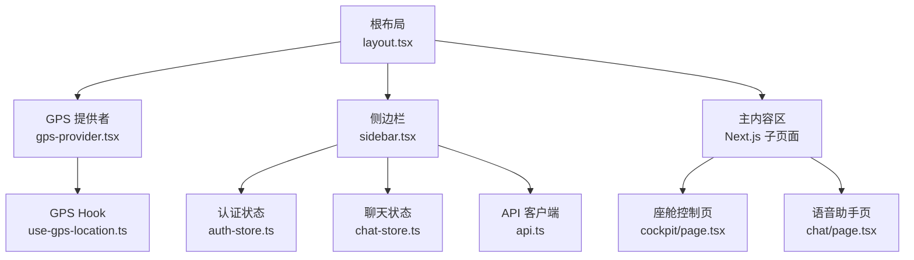
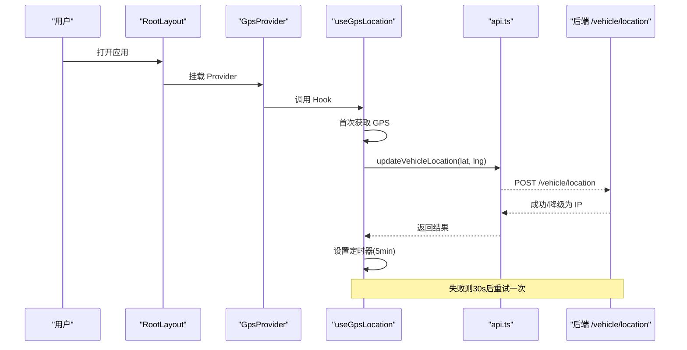
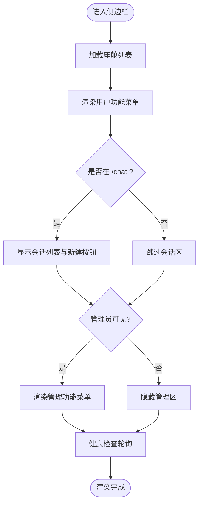
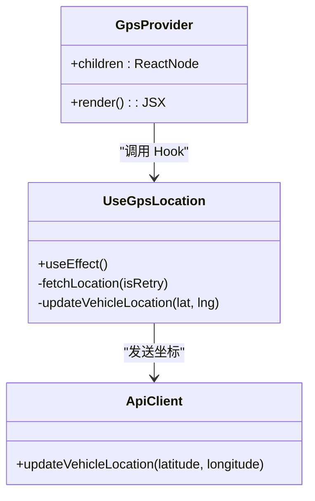
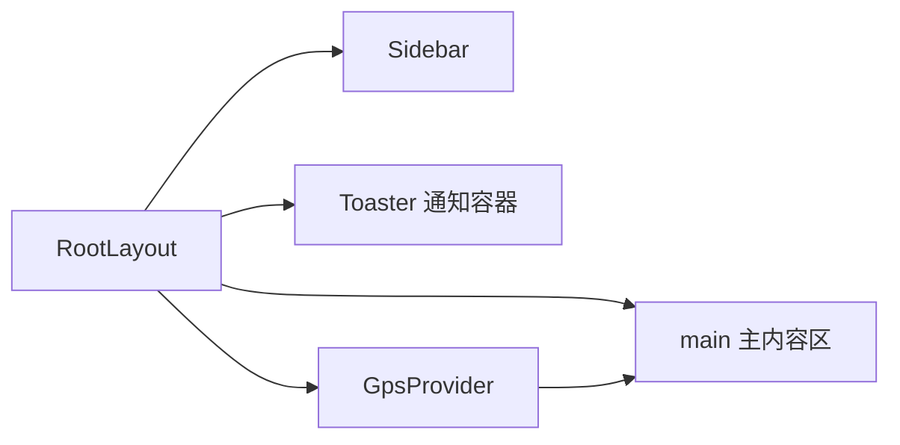
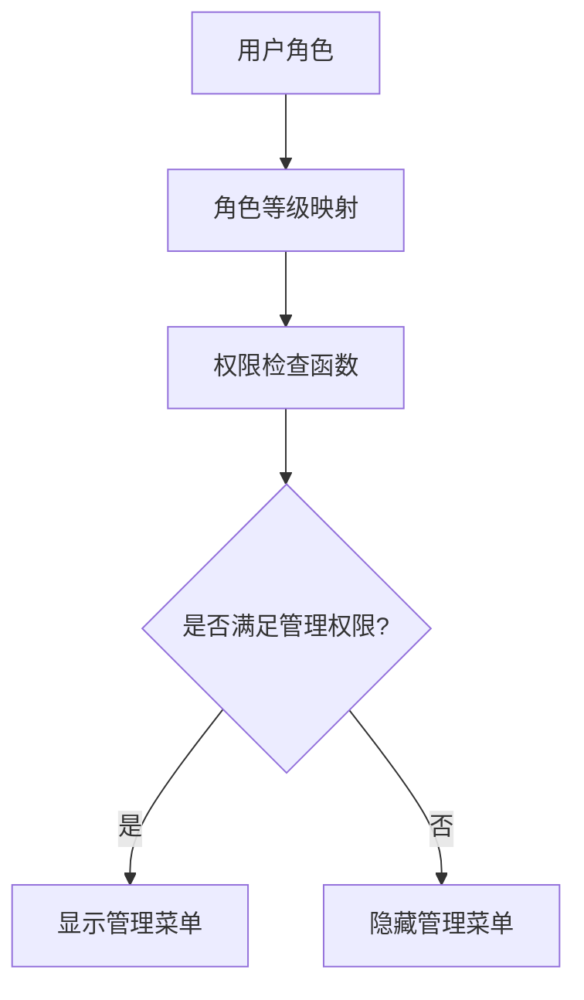
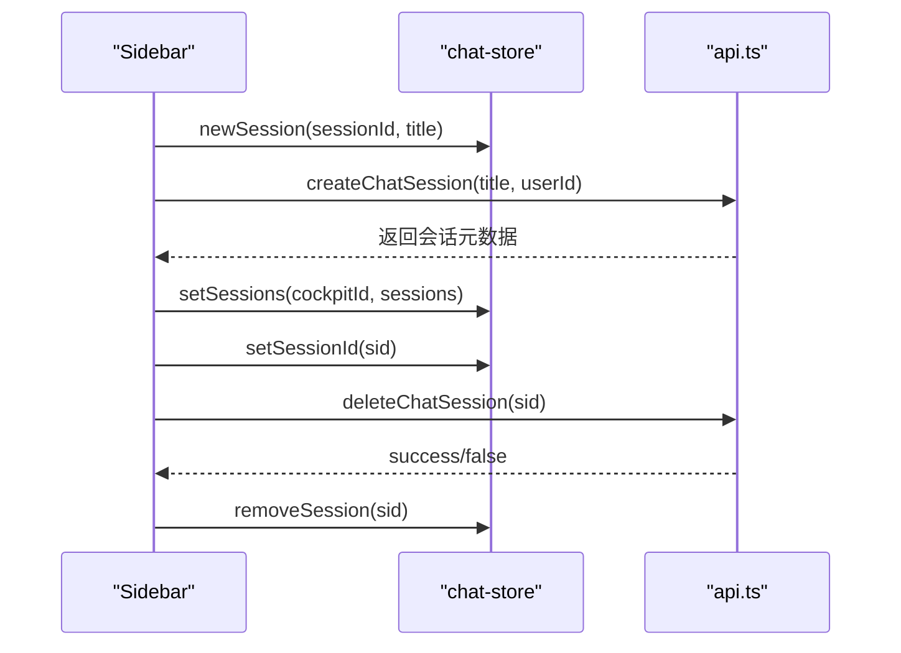
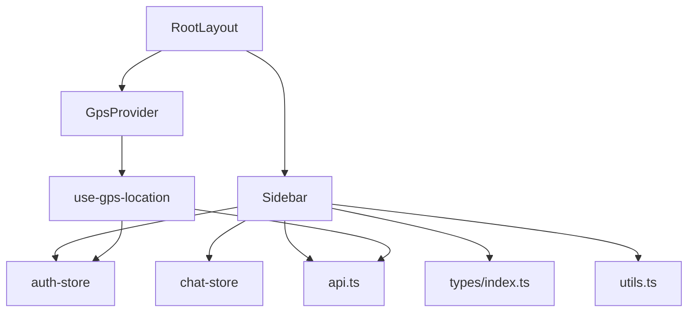

# 布局组件

<cite>
**本文引用的文件**   
- [sidebar.tsx](file://frontend_design/src/components/layout/sidebar.tsx)
- [gps-provider.tsx](file://frontend_design/src/components/layout/gps-provider.tsx)
- [layout.tsx](file://frontend_design/src/app/layout.tsx)
- [use-gps-location.ts](file://frontend_design/src/hooks/use-gps-location.ts)
- [auth-store.ts](file://frontend_design/src/stores/auth-store.ts)
- [chat-store.ts](file://frontend_design/src/stores/chat-store.ts)
- [api.ts](file://frontend_design/src/lib/api.ts)
- [types/index.ts](file://frontend_design/src/types/index.ts)
- [utils.ts](file://frontend_design/src/lib/utils.ts)
- [globals.css](file://frontend_design/src/app/globals.css)
- [cockpit/page.tsx](file://frontend_design/src/app/cockpit/page.tsx)
- [chat/page.tsx](file://frontend_design/src/app/chat/page.tsx)
</cite>

## 目录
1. [简介](#简介)
2. [项目结构](#项目结构)
3. [核心组件](#核心组件)
4. [架构总览](#架构总览)
5. [详细组件分析](#详细组件分析)
6. [依赖关系分析](#依赖关系分析)
7. [性能考量](#性能考量)
8. [故障排查指南](#故障排查指南)
9. [结论](#结论)
10. [附录：扩展与示例](#附录扩展与示例)

## 简介
本技术文档聚焦 NexusCockpit 前端布局组件，重点解析侧边栏导航组件与 GPS 定位提供器的设计与实现。内容涵盖：
- 侧边栏的动态菜单生成、路由集成、用户权限控制（RBAC）与响应式适配策略
- GPS 提供器的位置服务集成、状态管理与错误处理
- 布局嵌套结构与内容区域管理
- 移动端适配思路与最佳实践
- 扩展侧边栏功能、新增导航项与自定义布局行为的实操指引

## 项目结构
NexusCockpit 采用 Next.js App Router，根布局负责全局 UI 骨架与能力注入；侧边栏作为固定导航区，主内容区承载页面级组件；GPS 定位通过透明 Provider 在根层启动并持续更新。

**图示来源** 
- [layout.tsx:1-55](file://frontend_design/src/app/layout.tsx#L1-L55)
- [gps-provider.tsx:1-21](file://frontend_design/src/components/layout/gps-provider.tsx#L1-L21)
- [sidebar.tsx:1-430](file://frontend_design/src/components/layout/sidebar.tsx#L1-L430)
- [use-gps-location.ts:1-119](file://frontend_design/src/hooks/use-gps-location.ts#L1-L119)
- [auth-store.ts:1-228](file://frontend_design/src/stores/auth-store.ts#L1-L228)
- [chat-store.ts:1-311](file://frontend_design/src/stores/chat-store.ts#L1-L311)
- [api.ts:1-786](file://frontend_design/src/lib/api.ts#L1-L786)
- [cockpit/page.tsx:1-41](file://frontend_design/src/app/cockpit/page.tsx#L1-L41)
- [chat/page.tsx:1-22](file://frontend_design/src/app/chat/page.tsx#L1-L22)

**章节来源**
- [layout.tsx:1-55](file://frontend_design/src/app/layout.tsx#L1-L55)
- [globals.css:1-74](file://frontend_design/src/app/globals.css#L1-L74)

## 核心组件
- 侧边栏 Sidebar：动态渲染用户与管理菜单、会话列表、座舱切换器、系统健康状态与用户信息。
- GPS 提供者 GpsProvider：在根布局挂载，调用 useGpsLocation Hook 启动定位轮询，不渲染 UI。
- 根布局 RootLayout：组合 Sidebar、GpsProvider、主内容区与全局 Toast。
- 认证与聊天状态：auth-store 提供 RBAC 角色与座舱上下文；chat-store 维护多会话与消息历史。
- API 客户端：统一封装请求拦截、Token 自动刷新、流式 SSE 读取与业务接口。

**章节来源**
- [sidebar.tsx:1-430](file://frontend_design/src/components/layout/sidebar.tsx#L1-L430)
- [gps-provider.tsx:1-21](file://frontend_design/src/components/layout/gps-provider.tsx#L1-L21)
- [layout.tsx:1-55](file://frontend_design/src/app/layout.tsx#L1-L55)
- [auth-store.ts:1-228](file://frontend_design/src/stores/auth-store.ts#L1-L228)
- [chat-store.ts:1-311](file://frontend_design/src/stores/chat-store.ts#L1-L311)
- [api.ts:1-786](file://frontend_design/src/lib/api.ts#L1-L786)

## 架构总览
侧边栏通过 Next.js 路由进行导航，结合 auth-store 的 RBAC 决定展示“座舱功能”和“管理功能”。GPS 定位在应用启动时即开始，每 5 分钟上报一次坐标到后端，失败时自动重试一次。

**图示来源** 
- [layout.tsx:1-55](file://frontend_design/src/app/layout.tsx#L1-L55)
- [gps-provider.tsx:1-21](file://frontend_design/src/components/layout/gps-provider.tsx#L1-L21)
- [use-gps-location.ts:1-119](file://frontend_design/src/hooks/use-gps-location.ts#L1-L119)
- [api.ts:372-376](file://frontend_design/src/lib/api.ts#L372-L376)

## 详细组件分析

### 侧边栏 Sidebar
- 动态菜单生成：基于 userNavItems 与 adminNavItems 数组渲染，按当前路径高亮激活项。
- 路由集成：使用 next/navigation 的 usePathname 与 useRouter 完成导航与激活态判断。
- 权限控制：通过 canViewDataPlatform/canViewMiddleware/canAccessSettings 判定是否显示管理区。
- 座舱切换：下拉选择 cockpitId，同步至 auth-store 与 chat-store，影响后续数据隔离。
- 会话管理：仅在 /chat 页面显示新建对话、会话列表、切换与删除；支持临时会话回退。
- 健康状态：定时调用 getHealth，底部状态栏展示 healthy/degraded/offline。
- 用户信息与退出：展示 userId，支持调用 apiLogout 与 auth-store logout。

**图示来源** 
- [sidebar.tsx:54-74](file://frontend_design/src/components/layout/sidebar.tsx#L54-L74)
- [sidebar.tsx:218-227](file://frontend_design/src/components/layout/sidebar.tsx#L218-L227)
- [sidebar.tsx:94-129](file://frontend_design/src/components/layout/sidebar.tsx#L94-L129)
- [sidebar.tsx:131-150](file://frontend_design/src/components/layout/sidebar.tsx#L131-L150)
- [sidebar.tsx:152-208](file://frontend_design/src/components/layout/sidebar.tsx#L152-L208)
- [sidebar.tsx:233-427](file://frontend_design/src/components/layout/sidebar.tsx#L233-L427)

**章节来源**
- [sidebar.tsx:1-430](file://frontend_design/src/components/layout/sidebar.tsx#L1-L430)
- [auth-store.ts:199-227](file://frontend_design/src/stores/auth-store.ts#L199-L227)
- [chat-store.ts:77-311](file://frontend_design/src/stores/chat-store.ts#L77-L311)
- [api.ts:382-386](file://frontend_design/src/lib/api.ts#L382-L386)

### GPS 定位提供器与 Hook
- GpsProvider：透明组件，仅调用 useGpsLocation 以启动定位，不渲染额外 UI。
- useGpsLocation：
  - 使用 navigator.geolocation.getCurrentPosition 获取坐标
  - 成功后调用 updateVehicleLocation 将坐标发送至后端
  - 失败时打印详细错误描述，并在首次失败后 30 秒自动重试一次
  - 每 5 分钟轮询一次，降低逆地理编码 API 调用量
  - 使用 cockpitIdRef 保持最新座舱上下文，避免 effect 重建

**图示来源** 
- [gps-provider.tsx:1-21](file://frontend_design/src/components/layout/gps-provider.tsx#L1-L21)
- [use-gps-location.ts:1-119](file://frontend_design/src/hooks/use-gps-location.ts#L1-L119)
- [api.ts:372-376](file://frontend_design/src/lib/api.ts#L372-L376)

**章节来源**
- [gps-provider.tsx:1-21](file://frontend_design/src/components/layout/gps-provider.tsx#L1-L21)
- [use-gps-location.ts:1-119](file://frontend_design/src/hooks/use-gps-location.ts#L1-L119)
- [api.ts:372-376](file://frontend_design/src/lib/api.ts#L372-L376)

### 根布局与内容区域管理
- RootLayout 定义 HTML 骨架、全局样式、Sidebar、主内容区与 Toaster。
- 主内容区通过 ml-64 留出侧边栏宽度，确保内容不被遮挡。
- GpsProvider 包裹整个应用，保证所有页面共享 GPS 状态。

**图示来源** 
- [layout.tsx:1-55](file://frontend_design/src/app/layout.tsx#L1-L55)

**章节来源**
- [layout.tsx:1-55](file://frontend_design/src/app/layout.tsx#L1-L55)
- [globals.css:1-74](file://frontend_design/src/app/globals.css#L1-L74)

### 权限控制与 RBAC
- 角色层级：super_admin > cockpit_admin > cockpit_user > cockpit_viewer
- 工具函数：hasRole、canViewDataPlatform、canViewMiddleware、canAccessSettings
- 侧边栏根据角色决定是否渲染管理功能区

**图示来源** 
- [auth-store.ts:191-227](file://frontend_design/src/stores/auth-store.ts#L191-L227)
- [sidebar.tsx:218-219](file://frontend_design/src/components/layout/sidebar.tsx#L218-L219)

**章节来源**
- [auth-store.ts:1-228](file://frontend_design/src/stores/auth-store.ts#L1-L228)
- [sidebar.tsx:218-219](file://frontend_design/src/components/layout/sidebar.tsx#L218-L219)

### 会话管理与多座舱隔离
- chat-store 使用 Zustand 持久化，按 cockpitId:sessionId 键存储消息与会话元数据
- 侧边栏在 /chat 页面显示会话列表，支持新建、切换、删除
- 删除逻辑兼容后端不可达时的临时会话清理

**图示来源** 
- [chat-store.ts:77-311](file://frontend_design/src/stores/chat-store.ts#L77-L311)
- [sidebar.tsx:152-208](file://frontend_design/src/components/layout/sidebar.tsx#L152-L208)
- [api.ts:686-701](file://frontend_design/src/lib/api.ts#L686-L701)

**章节来源**
- [chat-store.ts:1-311](file://frontend_design/src/stores/chat-store.ts#L1-L311)
- [sidebar.tsx:131-208](file://frontend_design/src/components/layout/sidebar.tsx#L131-L208)
- [api.ts:686-701](file://frontend_design/src/lib/api.ts#L686-L701)

### 移动端适配策略
- 侧边栏固定宽度 16rem（256px），主内容区通过 margin-left 避让
- 使用 Tailwind CSS 变量与类名实现暗色主题与玻璃效果
- 滚动条样式自定义，提升视觉一致性
- 建议在移动端通过媒体查询或条件渲染折叠侧边栏（按需扩展）

**章节来源**
- [globals.css:1-74](file://frontend_design/src/app/globals.css#L1-L74)
- [layout.tsx:36-52](file://frontend_design/src/app/layout.tsx#L36-L52)

## 依赖关系分析
- Sidebar 依赖：next/navigation、auth-store、chat-store、api.ts、类型定义与工具函数
- GpsProvider 依赖：use-gps-location Hook
- use-gps-location 依赖：api.ts 的 updateVehicleLocation、auth-store 的 cockpitId
- RootLayout 依赖：Sidebar、GpsProvider、Toaster、全局样式

**图示来源** 
- [sidebar.tsx:1-430](file://frontend_design/src/components/layout/sidebar.tsx#L1-L430)
- [gps-provider.tsx:1-21](file://frontend_design/src/components/layout/gps-provider.tsx#L1-L21)
- [use-gps-location.ts:1-119](file://frontend_design/src/hooks/use-gps-location.ts#L1-L119)
- [auth-store.ts:1-228](file://frontend_design/src/stores/auth-store.ts#L1-L228)
- [chat-store.ts:1-311](file://frontend_design/src/stores/chat-store.ts#L1-L311)
- [api.ts:1-786](file://frontend_design/src/lib/api.ts#L1-L786)
- [types/index.ts:1-277](file://frontend_design/src/types/index.ts#L1-L277)
- [utils.ts:1-56](file://frontend_design/src/lib/utils.ts#L1-L56)
- [layout.tsx:1-55](file://frontend_design/src/app/layout.tsx#L1-L55)

**章节来源**
- [sidebar.tsx:1-430](file://frontend_design/src/components/layout/sidebar.tsx#L1-L430)
- [gps-provider.tsx:1-21](file://frontend_design/src/components/layout/gps-provider.tsx#L1-L21)
- [use-gps-location.ts:1-119](file://frontend_design/src/hooks/use-gps-location.ts#L1-L119)
- [auth-store.ts:1-228](file://frontend_design/src/stores/auth-store.ts#L1-L228)
- [chat-store.ts:1-311](file://frontend_design/src/stores/chat-store.ts#L1-L311)
- [api.ts:1-786](file://frontend_design/src/lib/api.ts#L1-L786)
- [types/index.ts:1-277](file://frontend_design/src/types/index.ts#L1-L277)
- [utils.ts:1-56](file://frontend_design/src/lib/utils.ts#L1-L56)
- [layout.tsx:1-55](file://frontend_design/src/app/layout.tsx#L1-L55)

## 性能考量
- GPS 轮询频率设置为 5 分钟，减少网络与后端压力
- 首次失败自动重试一次，避免频繁重试造成资源浪费
- 侧边栏健康检查间隔 30 秒，静默失败不影响用户体验
- 聊天状态持久化到 localStorage，减少重复加载
- API 客户端统一超时与错误处理，避免悬挂请求

[本节为通用指导，无需特定文件引用]

## 故障排查指南
- GPS 定位失败：
  - 检查浏览器定位权限与设备 GPS 开关
  - 查看控制台日志中的错误码描述（权限拒绝、不可用、超时）
  - 确认 30 秒后是否触发重试
- 会话删除异常：
  - 若后端返回 success=false，检查 message 字段提示
  - 网络不可达时，前端仍会清理本地状态，避免“幽灵会话”
- Token 过期：
  - API 客户端会在 401 时自动刷新并重试一次
  - 确认 ensureAuthToken 与 refreshToken 流程正常执行

**章节来源**
- [use-gps-location.ts:72-98](file://frontend_design/src/hooks/use-gps-location.ts#L72-L98)
- [sidebar.tsx:173-208](file://frontend_design/src/components/layout/sidebar.tsx#L173-L208)
- [api.ts:152-175](file://frontend_design/src/lib/api.ts#L152-L175)

## 结论
NexusCockpit 的布局组件通过清晰的职责划分与模块化设计，实现了灵活的侧边栏导航与稳定的 GPS 定位能力。侧边栏结合 RBAC 与多座舱隔离，提供了良好的可扩展性与用户体验；GPS 提供器在保证精度的同时兼顾了性能与容错。整体架构易于扩展与维护，适合车载场景下的多角色、多租户需求。

[本节为总结性内容，无需特定文件引用]

## 附录：扩展与示例
- 扩展侧边栏功能：
  - 在 userNavItems 或 adminNavItems 中添加新菜单项（href、label、icon）
  - 如需新增权限控制，可在 auth-store 中补充 hasRole 或 canXxx 函数
- 添加新的导航项：
  - 在 sidebar.tsx 的菜单数组中追加对象，确保 href 与路由一致
  - 使用 isItemActive 判断激活态，保持交互一致性
- 自定义布局行为：
  - 在 RootLayout 中调整 main 的边距或添加响应式断点
  - 在 globals.css 中扩展主题变量或新增样式类
- 修改 GPS 行为：
  - 调整 use-gps-location 中的轮询间隔与重试策略
  - 在 api.ts 中扩展 updateVehicleLocation 的参数或错误处理

**章节来源**
- [sidebar.tsx:54-74](file://frontend_design/src/components/layout/sidebar.tsx#L54-L74)
- [auth-store.ts:199-227](file://frontend_design/src/stores/auth-store.ts#L199-L227)
- [layout.tsx:36-52](file://frontend_design/src/app/layout.tsx#L36-L52)
- [globals.css:1-74](file://frontend_design/src/app/globals.css#L1-L74)
- [use-gps-location.ts:106-118](file://frontend_design/src/hooks/use-gps-location.ts#L106-L118)
- [api.ts:372-376](file://frontend_design/src/lib/api.ts#L372-L376)