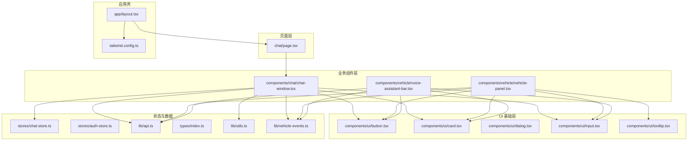
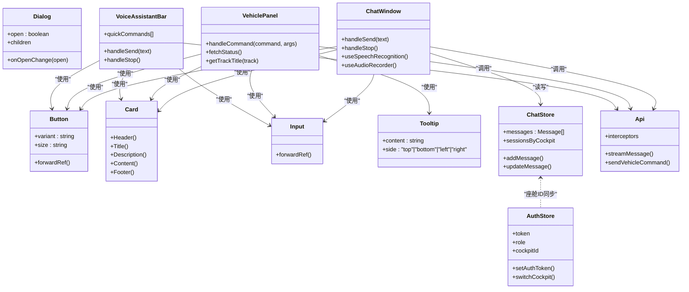
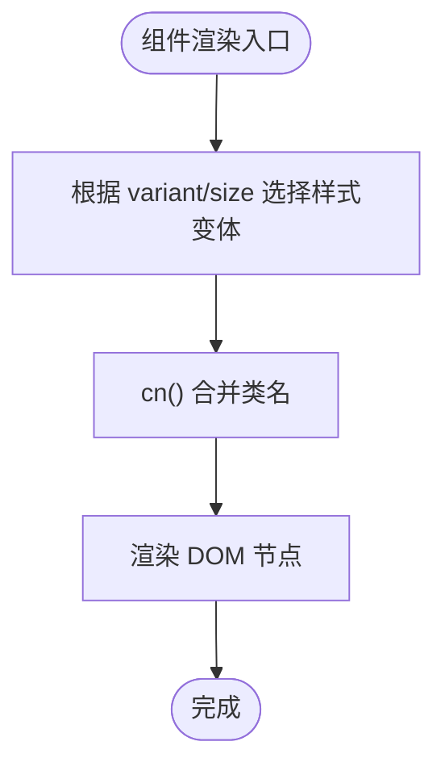
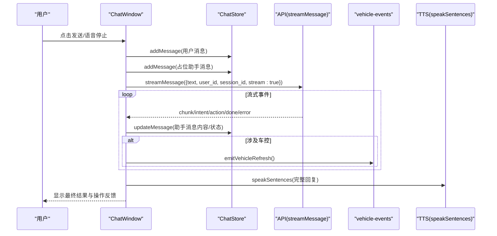
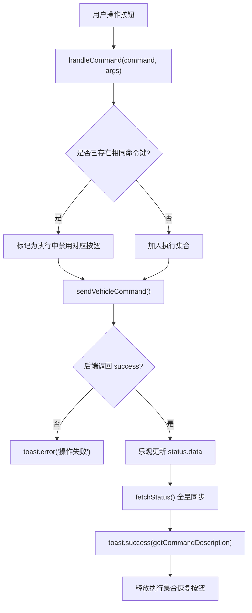
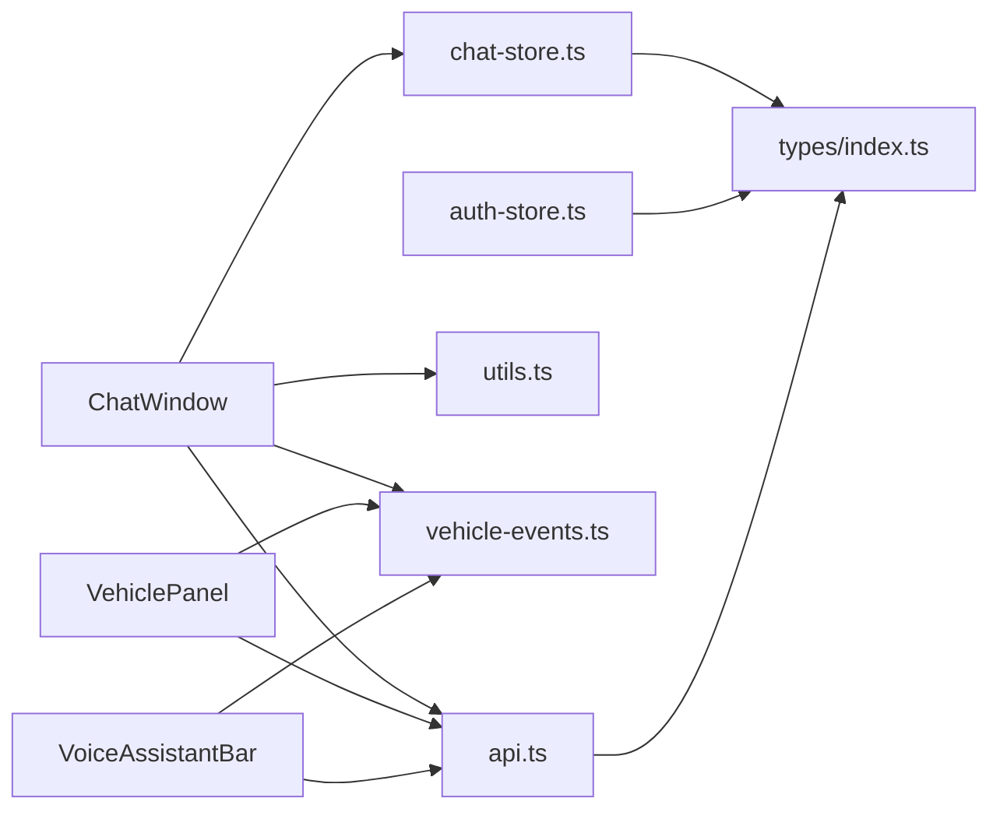

# 组件体系结构

<cite>
**本文引用的文件**   
- [layout.tsx](file://frontend_design/src/app/layout.tsx)
- [button.tsx](file://frontend_design/src/components/ui/button.tsx)
- [card.tsx](file://frontend_design/src/components/ui/card.tsx)
- [dialog.tsx](file://frontend_design/src/components/ui/dialog.tsx)
- [input.tsx](file://frontend_design/src/components/ui/input.tsx)
- [tooltip.tsx](file://frontend_design/src/components/ui/tooltip.tsx)
- [chat-window.tsx](file://frontend_design/src/components/chat/chat-window.tsx)
- [vehicle-panel.tsx](file://frontend_design/src/components/vehicle/vehicle-panel.tsx)
- [voice-assistant-bar.tsx](file://frontend_design/src/components/vehicle/voice-assistant-bar.tsx)
- [chat-store.ts](file://frontend_design/src/stores/chat-store.ts)
- [auth-store.ts](file://frontend_design/src/stores/auth-store.ts)
- [api.ts](file://frontend_design/src/lib/api.ts)
- [utils.ts](file://frontend_design/src/lib/utils.ts)
- [vehicle-events.ts](file://frontend_design/src/lib/vehicle-events.ts)
- [index.ts](file://frontend_design/src/types/index.ts)
- [page.tsx](file://frontend_design/src/app/chat/page.tsx)
- [tailwind.config.ts](file://frontend_design/tailwind.config.ts)
</cite>

## 目录
1. [简介](#简介)
2. [项目结构](#项目结构)
3. [核心组件](#核心组件)
4. [架构总览](#架构总览)
5. [详细组件分析](#详细组件分析)
6. [依赖关系分析](#依赖关系分析)
7. [性能考量](#性能考量)
8. [故障排查指南](#故障排查指南)
9. [结论](#结论)
10. [附录](#附录)

## 简介
本技术文档围绕 NexusCockpit 前端组件系统，系统化阐述三层组件架构：UI 基础组件、业务组件与页面组件的分层设计原则；深入说明 Props 接口设计、事件处理机制与状态管理；解释响应式设计与主题定制的实现方式；并提供组件复用策略、组合模式与性能优化技巧。同时给出实际代码示例路径，帮助开发者快速创建可复用的 UI 组件与业务组件。

## 项目结构
NexusCockpit 的前端采用 Next.js App Router，组件按职责分层组织：
- UI 基础组件：位于 components/ui，提供按钮、卡片、对话框、输入框、提示等原子化控件
- 业务组件：位于 components/chat 与 components/vehicle，封装聊天窗口、车辆面板、语音助手栏等业务能力
- 页面组件：位于 app 路由下，如 chat/page.tsx，负责页面级布局与组装
- 状态管理：stores 目录使用 Zustand 管理聊天与认证状态
- API 客户端：lib/api.ts 统一封装 HTTP 请求、流式 SSE、鉴权与错误处理
- 类型定义：types/index.ts 集中管理跨模块共享的类型
- 工具函数：lib/utils.ts 提供类名合并、时间格式化等通用方法
- 样式与主题：tailwind.config.ts 扩展颜色、圆角、动画等主题变量

**图表来源** 
- [layout.tsx:1-55](file://frontend_design/src/app/layout.tsx#L1-L55)
- [page.tsx:1-22](file://frontend_design/src/app/chat/page.tsx#L1-L22)
- [chat-window.tsx:1-652](file://frontend_design/src/components/chat/chat-window.tsx#L1-L652)
- [vehicle-panel.tsx:1-886](file://frontend_design/src/components/vehicle/vehicle-panel.tsx#L1-L886)
- [voice-assistant-bar.tsx:1-430](file://frontend_design/src/components/vehicle/voice-assistant-bar.tsx#L1-L430)
- [button.tsx:1-55](file://frontend_design/src/components/ui/button.tsx#L1-L55)
- [card.tsx:1-92](file://frontend_design/src/components/ui/card.tsx#L1-L92)
- [dialog.tsx:1-59](file://frontend_design/src/components/ui/dialog.tsx#L1-L59)
- [input.tsx:1-26](file://frontend_design/src/components/ui/input.tsx#L1-L26)
- [tooltip.tsx:1-65](file://frontend_design/src/components/ui/tooltip.tsx#L1-L65)
- [chat-store.ts:1-311](file://frontend_design/src/stores/chat-store.ts#L1-L311)
- [auth-store.ts:1-228](file://frontend_design/src/stores/auth-store.ts#L1-L228)
- [api.ts:1-200](file://frontend_design/src/lib/api.ts#L1-L200)
- [utils.ts:1-56](file://frontend_design/src/lib/utils.ts#L1-L56)
- [vehicle-events.ts:1-34](file://frontend_design/src/lib/vehicle-events.ts#L1-L34)
- [index.ts:1-277](file://frontend_design/src/types/index.ts#L1-L277)
- [tailwind.config.ts:1-55](file://frontend_design/tailwind.config.ts#L1-L55)

**章节来源**
- [layout.tsx:1-55](file://frontend_design/src/app/layout.tsx#L1-L55)
- [page.tsx:1-22](file://frontend_design/src/app/chat/page.tsx#L1-L22)

## 核心组件
- UI 基础组件（Button、Card、Dialog、Input、Tooltip）
  - 通过 React.forwardRef 暴露 ref，支持透传原生属性
  - 使用 class-variance-authority 或 Tailwind 类名组合实现变体与尺寸控制
  - 通过 cn() 工具函数合并类名并解决冲突
- 业务组件（ChatWindow、VehiclePanel、VoiceAssistantBar）
  - 封装复杂交互逻辑：SSE 流式消息、车控命令、TTS 播放、ASR 录音
  - 通过 Zustand store 与全局事件总线进行跨组件通信
  - 具备降级策略与错误处理：离线 Mock、非流式回退、Toast 提示
- 页面组件（chat/page.tsx）
  - 作为容器，仅负责标题与布局，将具体功能委托给业务组件

**章节来源**
- [button.tsx:1-55](file://frontend_design/src/components/ui/button.tsx#L1-L55)
- [card.tsx:1-92](file://frontend_design/src/components/ui/card.tsx#L1-L92)
- [dialog.tsx:1-59](file://frontend_design/src/components/ui/dialog.tsx#L1-L59)
- [input.tsx:1-26](file://frontend_design/src/components/ui/input.tsx#L1-L26)
- [tooltip.tsx:1-65](file://frontend_design/src/components/ui/tooltip.tsx#L1-L65)
- [chat-window.tsx:1-652](file://frontend_design/src/components/chat/chat-window.tsx#L1-L652)
- [vehicle-panel.tsx:1-886](file://frontend_design/src/components/vehicle/vehicle-panel.tsx#L1-L886)
- [voice-assistant-bar.tsx:1-430](file://frontend_design/src/components/vehicle/voice-assistant-bar.tsx#L1-L430)
- [page.tsx:1-22](file://frontend_design/src/app/chat/page.tsx#L1-L22)

## 架构总览
NexusCockpit 的组件架构遵循“页面层 → 业务组件层 → UI 基础层”的分层设计：
- 页面层：Next.js 路由页面，负责元数据与整体布局
- 业务组件层：承载领域逻辑，聚合多个 UI 基础组件，调用 API 与状态管理
- UI 基础层：无业务语义的纯展示与交互控件，强调可复用性与主题一致性

**图表来源** 
- [button.tsx:1-55](file://frontend_design/src/components/ui/button.tsx#L1-L55)
- [card.tsx:1-92](file://frontend_design/src/components/ui/card.tsx#L1-L92)
- [dialog.tsx:1-59](file://frontend_design/src/components/ui/dialog.tsx#L1-L59)
- [input.tsx:1-26](file://frontend_design/src/components/ui/input.tsx#L1-L26)
- [tooltip.tsx:1-65](file://frontend_design/src/components/ui/tooltip.tsx#L1-L65)
- [chat-window.tsx:1-652](file://frontend_design/src/components/chat/chat-window.tsx#L1-L652)
- [vehicle-panel.tsx:1-886](file://frontend_design/src/components/vehicle/vehicle-panel.tsx#L1-L886)
- [voice-assistant-bar.tsx:1-430](file://frontend_design/src/components/vehicle/voice-assistant-bar.tsx#L1-L430)
- [chat-store.ts:1-311](file://frontend_design/src/stores/chat-store.ts#L1-L311)
- [auth-store.ts:1-228](file://frontend_design/src/stores/auth-store.ts#L1-L228)
- [api.ts:1-200](file://frontend_design/src/lib/api.ts#L1-L200)

## 详细组件分析

### UI 基础组件设计
- Button
  - 使用 cva 定义变体（default、secondary、ghost、destructive、outline）与尺寸（sm、md、lg、icon）
  - 通过 forwardRef 透传 ref 与 HTMLAttributes，保证无障碍与测试友好
- Card
  - 拆分子组件 Header、Title、Description、Content、Footer，便于组合
  - 使用 cn() 合并类名，保持主题一致
- Dialog
  - 受控 open/onOpenChange，内部包含关闭按钮与遮罩
- Input
  - 标准输入控件，聚焦态 ring 样式与禁用态样式统一
- Tooltip
  - 纯 CSS 实现，支持四个方向，轻量无依赖

**图表来源** 
- [button.tsx:1-55](file://frontend_design/src/components/ui/button.tsx#L1-L55)
- [card.tsx:1-92](file://frontend_design/src/components/ui/card.tsx#L1-L92)
- [dialog.tsx:1-59](file://frontend_design/src/components/ui/dialog.tsx#L1-L59)
- [input.tsx:1-26](file://frontend_design/src/components/ui/input.tsx#L1-L26)
- [tooltip.tsx:1-65](file://frontend_design/src/components/ui/tooltip.tsx#L1-L65)
- [utils.ts:1-56](file://frontend_design/src/lib/utils.ts#L1-L56)

**章节来源**
- [button.tsx:1-55](file://frontend_design/src/components/ui/button.tsx#L1-L55)
- [card.tsx:1-92](file://frontend_design/src/components/ui/card.tsx#L1-L92)
- [dialog.tsx:1-59](file://frontend_design/src/components/ui/dialog.tsx#L1-L59)
- [input.tsx:1-26](file://frontend_design/src/components/ui/input.tsx#L1-L26)
- [tooltip.tsx:1-65](file://frontend_design/src/components/ui/tooltip.tsx#L1-L65)

### 业务组件：聊天窗口（ChatWindow）
- 功能要点
  - 文本输入 + Web Speech API 实时转写 + 本地 ASR 录音上传识别
  - SSE 流式接收 AI 回复，节流更新 UI，失败自动降级为非流式请求
  - 多会话管理（新建/切换/加载历史），与 auth-store 座舱 ID 同步
  - 车控指令联动刷新（intent/action 匹配后触发 vehicle-events）
  - TTS 分句朗读，支持暂停生成与错误提示
- 关键流程（发送消息）

**图表来源** 
- [chat-window.tsx:1-652](file://frontend_design/src/components/chat/chat-window.tsx#L1-L652)
- [chat-store.ts:1-311](file://frontend_design/src/stores/chat-store.ts#L1-L311)
- [api.ts:1-200](file://frontend_design/src/lib/api.ts#L1-L200)
- [vehicle-events.ts:1-34](file://frontend_design/src/lib/vehicle-events.ts#L1-L34)

**章节来源**
- [chat-window.tsx:1-652](file://frontend_design/src/components/chat/chat-window.tsx#L1-L652)
- [chat-store.ts:1-311](file://frontend_design/src/stores/chat-store.ts#L1-L311)
- [api.ts:1-200](file://frontend_design/src/lib/api.ts#L1-L200)
- [vehicle-events.ts:1-34](file://frontend_design/src/lib/vehicle-events.ts#L1-L34)

### 业务组件：车辆面板（VehiclePanel）
- 功能要点
  - 空调、座椅、媒体、导航、车窗、车辆状态概览
  - 首次拉取失败延迟重试，失败则降级到 Mock 数据（离线模式）
  - 乐观更新：命令成功后先利用返回 data 更新 UI，再异步全量同步
  - 媒体状态变化时同步到全局 audio-store，避免中断正在播放的音乐
  - GPS 定位更新后刷新状态，订阅 vehicle-events 刷新
- 命令执行流程图

**图表来源** 
- [vehicle-panel.tsx:1-886](file://frontend_design/src/components/vehicle/vehicle-panel.tsx#L1-L886)
- [api.ts:1-200](file://frontend_design/src/lib/api.ts#L1-L200)

**章节来源**
- [vehicle-panel.tsx:1-886](file://frontend_design/src/components/vehicle/vehicle-panel.tsx#L1-L886)
- [api.ts:1-200](file://frontend_design/src/lib/api.ts#L1-L200)

### 业务组件：语音助手栏（VoiceAssistantBar）
- 功能要点
  - 集成在车控面板顶部的快捷输入区，支持浏览器语音识别与本地 ASR
  - 流式回复展示与 rAF 节流，避免高频重渲染
  - 快捷指令一键发送，TTS 朗读与车控联动刷新
- 与 ChatWindow 的差异
  - 更轻量，专注于顶部快捷交互，不维护多会话历史
  - 使用 useRef 缓存流式内容并通过 requestAnimationFrame 节流更新

**章节来源**
- [voice-assistant-bar.tsx:1-430](file://frontend_design/src/components/vehicle/voice-assistant-bar.tsx#L1-L430)

### 页面组件：聊天页（chat/page.tsx）
- 作为页面容器，展示标题与描述，并将具体聊天功能委托给 ChatWindow

**章节来源**
- [page.tsx:1-22](file://frontend_design/src/app/chat/page.tsx#L1-L22)

## 依赖关系分析
- 组件耦合与内聚
  - UI 基础组件低耦合、高内聚，仅依赖 utils.ts 的 cn()
  - 业务组件依赖 stores、api、utils、vehicle-events，职责清晰
- 直接依赖
  - ChatWindow/VoiceAssistantBar 依赖 api.ts 的流式与非流式接口
  - VehiclePanel 依赖 api.ts 的车控接口与 vehicle-events 事件总线
- 外部依赖
  - axios 用于 HTTP 请求，原生 fetch 用于 SSE
  - zustand 用于状态持久化与订阅
  - tailwindcss 用于样式与主题

**图表来源** 
- [chat-window.tsx:1-652](file://frontend_design/src/components/chat/chat-window.tsx#L1-L652)
- [vehicle-panel.tsx:1-886](file://frontend_design/src/components/vehicle/vehicle-panel.tsx#L1-L886)
- [voice-assistant-bar.tsx:1-430](file://frontend_design/src/components/vehicle/voice-assistant-bar.tsx#L1-L430)
- [chat-store.ts:1-311](file://frontend_design/src/stores/chat-store.ts#L1-L311)
- [auth-store.ts:1-228](file://frontend_design/src/stores/auth-store.ts#L1-L228)
- [api.ts:1-200](file://frontend_design/src/lib/api.ts#L1-L200)
- [utils.ts:1-56](file://frontend_design/src/lib/utils.ts#L1-L56)
- [vehicle-events.ts:1-34](file://frontend_design/src/lib/vehicle-events.ts#L1-L34)
- [index.ts:1-277](file://frontend_design/src/types/index.ts#L1-L277)

**章节来源**
- [chat-window.tsx:1-652](file://frontend_design/src/components/chat/chat-window.tsx#L1-L652)
- [vehicle-panel.tsx:1-886](file://frontend_design/src/components/vehicle/vehicle-panel.tsx#L1-L886)
- [voice-assistant-bar.tsx:1-430](file://frontend_design/src/components/vehicle/voice-assistant-bar.tsx#L1-L430)
- [chat-store.ts:1-311](file://frontend_design/src/stores/chat-store.ts#L1-L311)
- [auth-store.ts:1-228](file://frontend_design/src/stores/auth-store.ts#L1-L228)
- [api.ts:1-200](file://frontend_design/src/lib/api.ts#L1-L200)
- [utils.ts:1-56](file://frontend_design/src/lib/utils.ts#L1-L56)
- [vehicle-events.ts:1-34](file://frontend_design/src/lib/vehicle-events.ts#L1-L34)
- [index.ts:1-277](file://frontend_design/src/types/index.ts#L1-L277)

## 性能考量
- 流式渲染优化
  - ChatWindow 使用 setTimeout 节流（每 50ms 一次）而非 rAF，确保组件卸载后仍可更新 store
  - VoiceAssistantBar 使用 rAF 节流更新 assistantReply，减少频繁重渲染
- 请求取消与降级
  - AbortController 取消旧请求，避免资源浪费
  - SSE 失败时自动降级为非流式请求，提升可用性
- 状态更新优化
  - VehiclePanel 使用 JSON.stringify 比较媒体关键状态，避免不必要的音频重启
  - 乐观更新先反映 UI，再异步全量同步，提升交互响应性
- 存储与持久化
  - ChatStore 使用 persist 中间件持久化 messagesByKey、sessionsByCockpit 等，避免重复加载

[本节为通用指导，无需特定文件引用]

## 故障排查指南
- 常见问题与定位
  - 语音识别不可用：检查浏览器兼容性（Web Speech API），查看 use-speech-recognition 的错误提示
  - 流式请求失败：检查网络与后端状态，观察 StreamError 的状态码（401/404/501）
  - 车控命令无效：确认 offline 标志与 Mock 数据，检查 toast 描述与后端返回 success
  - Token 过期：观察 api.ts 的 401 拦截器与 refreshToken 流程
- 调试建议
  - 使用控制台日志与 Toast 提示定位问题
  - 检查 localStorage 中的 token 与 cockpitId 是否正确
  - 验证 vehicle-events 事件是否被正确订阅与触发

**章节来源**
- [api.ts:1-200](file://frontend_design/src/lib/api.ts#L1-L200)
- [auth-store.ts:1-228](file://frontend_design/src/stores/auth-store.ts#L1-L228)
- [vehicle-panel.tsx:1-886](file://frontend_design/src/components/vehicle/vehicle-panel.tsx#L1-L886)
- [chat-window.tsx:1-652](file://frontend_design/src/components/chat/chat-window.tsx#L1-L652)

## 结论
NexusCockpit 的组件体系通过清晰的三层架构与良好的状态管理、事件总线与降级策略，实现了高内聚、低耦合的可复用组件库。UI 基础组件专注样式与交互，业务组件封装领域逻辑，页面组件负责布局与装配。结合响应式设计与主题定制，开发者可以快速构建一致的界面体验。建议在新增组件时遵循现有模式，优先使用 UI 基础组件组合，并通过 stores 与 events 进行跨组件通信，确保性能与可维护性。

[本节为总结性内容，无需特定文件引用]

## 附录
- 响应式设计与主题定制
  - 使用 Tailwind 的 CSS 变量（background、primary、accent 等）实现主题切换
  - tailwind.config.ts 扩展颜色、圆角、动画，统一视觉风格
- 组件复用策略与组合模式
  - 优先使用 Card/Header/Content/Footer 组合不同业务场景
  - Button 通过 variant/size 控制外观，减少重复样式
- 实际代码示例路径
  - 创建可复用 UI 组件：参考 button.tsx 与 card.tsx 的 forwardRef 与 cva/cn 用法
  - 创建业务组件：参考 chat-window.tsx 的 SSE 流式处理与 store 操作
  - 事件驱动刷新：参考 vehicle-events.ts 的 emit/on 模式

**章节来源**
- [tailwind.config.ts:1-55](file://frontend_design/tailwind.config.ts#L1-L55)
- [button.tsx:1-55](file://frontend_design/src/components/ui/button.tsx#L1-L55)
- [card.tsx:1-92](file://frontend_design/src/components/ui/card.tsx#L1-L92)
- [chat-window.tsx:1-652](file://frontend_design/src/components/chat/chat-window.tsx#L1-L652)
- [vehicle-events.ts:1-34](file://frontend_design/src/lib/vehicle-events.ts#L1-L34)