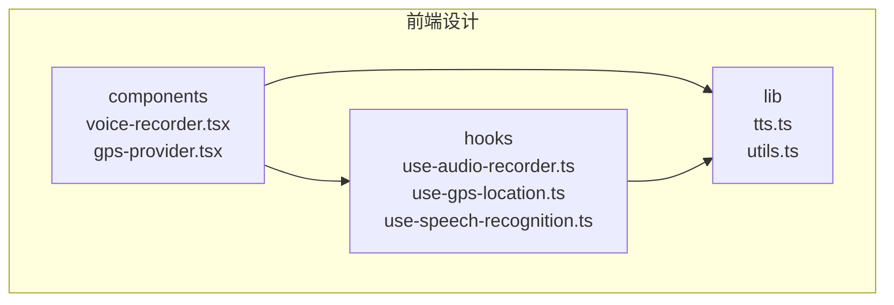
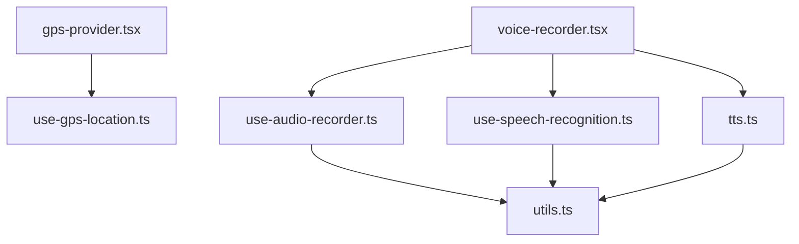
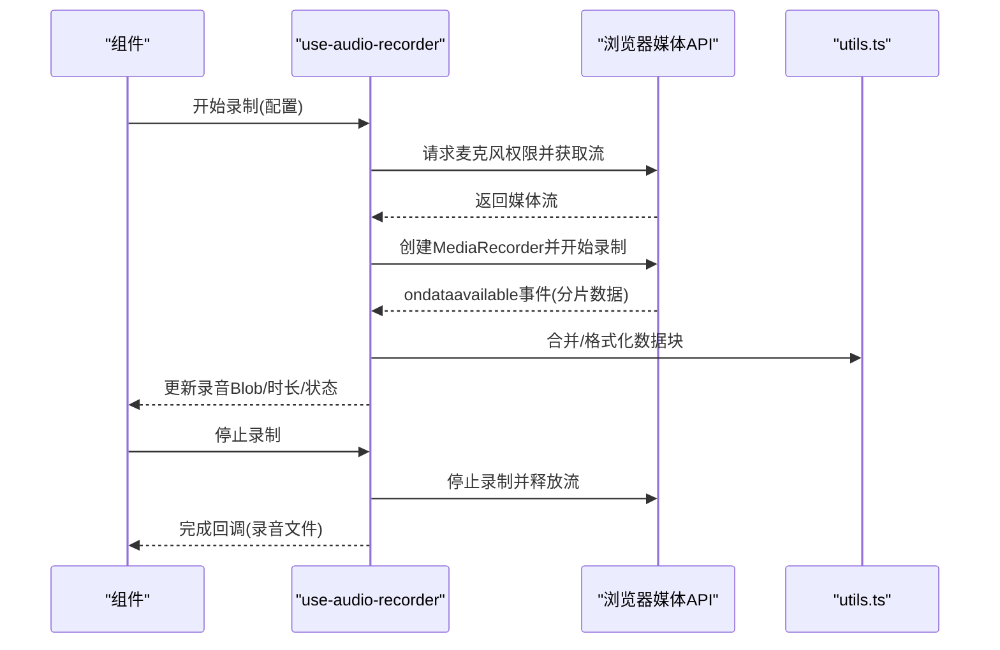
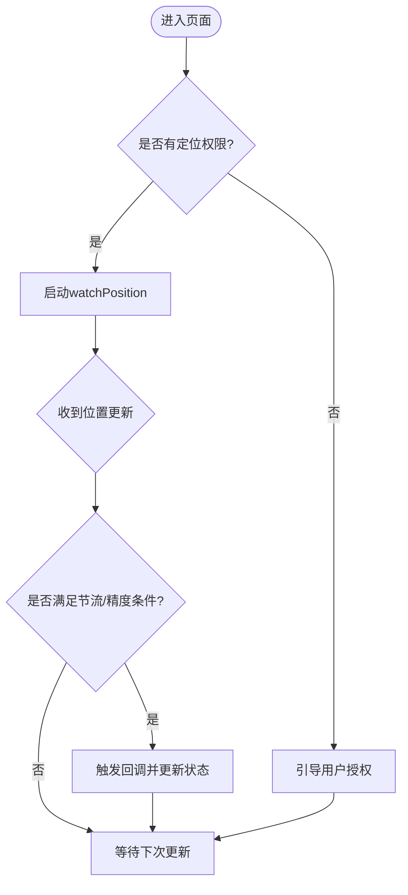
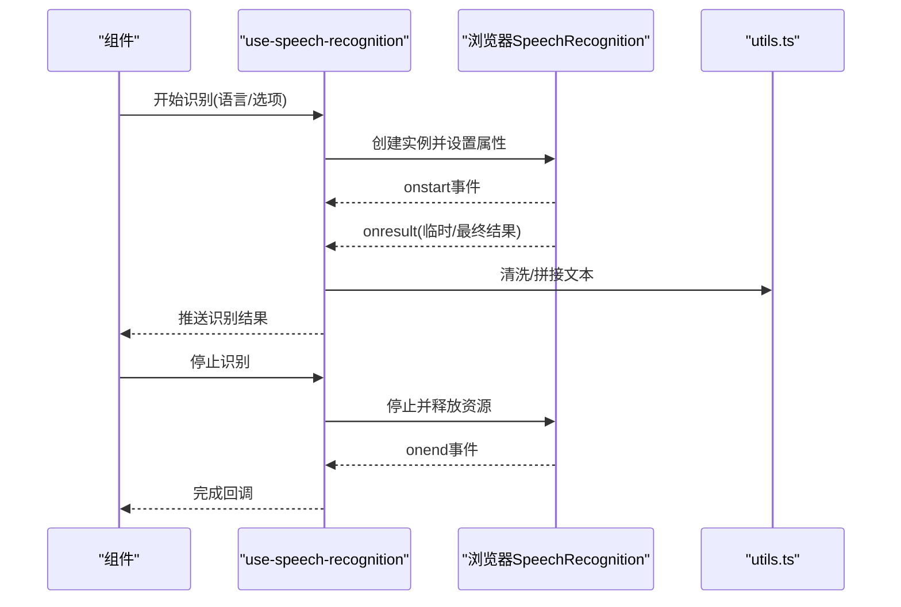
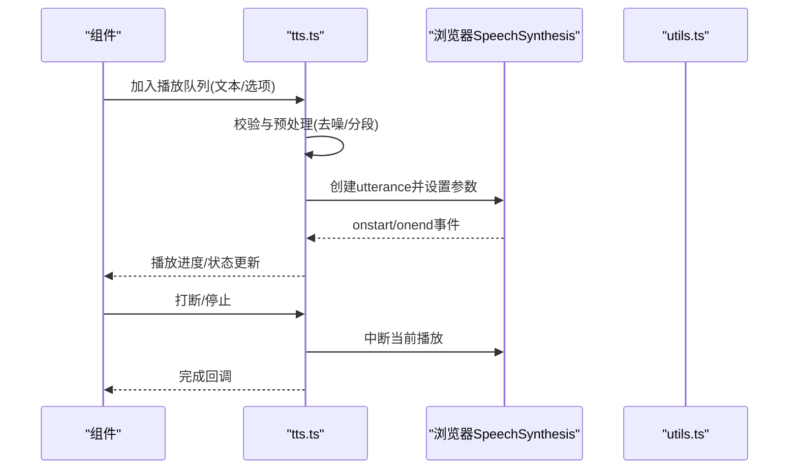
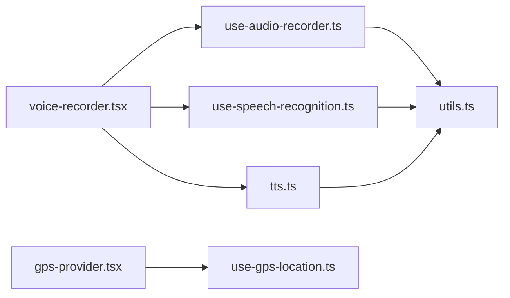

# Hooks和工具函数

<cite>
**本文引用的文件**   
- [frontend_design/src/hooks/use-audio-recorder.ts](file://frontend_design/src/hooks/use-audio-recorder.ts)
- [frontend_design/src/hooks/use-gps-location.ts](file://frontend_design/src/hooks/use-gps-location.ts)
- [frontend_design/src/hooks/use-speech-recognition.ts](file://frontend_design/src/hooks/use-speech-recognition.ts)
- [frontend_design/src/hooks/index.ts](file://frontend_design/src/hooks/index.ts)
- [frontend_design/src/lib/tts.ts](file://frontend_design/src/lib/tts.ts)
- [frontend_design/src/lib/utils.ts](file://frontend_design/src/lib/utils.ts)
- [frontend_design/src/components/voice-recorder.tsx](file://frontend_design/src/components/voice-recorder.tsx)
- [frontend_design/src/components/layout/gps-provider.tsx](file://frontend_design/src/components/layout/gps-provider.tsx)
</cite>

## 目录
1. [简介](#简介)
2. [项目结构](#项目结构)
3. [核心组件](#核心组件)
4. [架构总览](#架构总览)
5. [详细组件分析](#详细组件分析)
6. [依赖关系分析](#依赖关系分析)
7. [性能与内存管理](#性能与内存管理)
8. [故障排查指南](#故障排查指南)
9. [结论](#结论)
10. [附录：使用示例与最佳实践](#附录使用示例与最佳实践)

## 简介
本文件聚焦前端Hooks与工具函数的设计与实现，覆盖以下关键能力：
- 自定义Hooks：音频录制use-audio-recorder、地理位置use-gps-location、语音识别use-speech-recognition
- 工具函数：数据处理、格式转换、验证规则等通用能力
- TTS文本转语音集成与播放控制
- 音频处理底层实现与浏览器兼容性策略
- 使用示例与最佳实践
- 性能优化与内存管理注意事项

## 项目结构
与本文相关的代码主要位于前端设计目录的hooks、lib与components子目录中。整体组织方式采用“功能域+分层”的模式：
- hooks：封装浏览器API与复杂状态逻辑，提供React友好的接口
- lib：无副作用或低副作用的工具函数与模块（如TTS、通用工具）
- components：基于hooks构建的可复用UI组件

图表来源
- [frontend_design/src/hooks/use-audio-recorder.ts](file://frontend_design/src/hooks/use-audio-recorder.ts)
- [frontend_design/src/hooks/use-gps-location.ts](file://frontend_design/src/hooks/use-gps-location.ts)
- [frontend_design/src/hooks/use-speech-recognition.ts](file://frontend_design/src/hooks/use-speech-recognition.ts)
- [frontend_design/src/lib/tts.ts](file://frontend_design/src/lib/tts.ts)
- [frontend_design/src/lib/utils.ts](file://frontend_design/src/lib/utils.ts)
- [frontend_design/src/components/voice-recorder.tsx](file://frontend_design/src/components/voice-recorder.tsx)
- [frontend_design/src/components/layout/gps-provider.tsx](file://frontend_design/src/components/layout/gps-provider.tsx)

章节来源
- [frontend_design/src/hooks/index.ts](file://frontend_design/src/hooks/index.ts)

## 核心组件
本节概述各Hook的职责与对外暴露的能力，便于快速理解其用途与边界。

- use-audio-recorder
  - 职责：封装MediaRecorder相关能力，提供开始/停止录制、暂停/恢复、实时流监听、录音时长统计、错误处理与权限提示
  - 典型状态：是否正在录制、是否已暂停、录音Blob、采样率/比特率配置、错误信息
  - 兼容性与降级：检测浏览器支持、回退到较低采样率、在不可用时给出友好提示
  - 资源管理：在卸载时释放媒体流与定时器，避免内存泄漏

- use-gps-location
  - 职责：封装Geolocation API，提供位置订阅、精度阈值过滤、定位失败重试、权限引导
  - 典型状态：经纬度、海拔、速度、精度、更新时间戳、错误信息
  - 性能策略：节流更新频率、按需开启高精度模式、空闲时关闭监听

- use-speech-recognition
  - 职责：封装Web Speech Recognition，提供连续识别、语言切换、结果回调、中断与清理
  - 典型状态：是否识别中、最终/临时结果、置信度、错误码
  - 兼容性与降级：检测SpeechRecognition可用性、回退到后端ASR方案、用户授权提示

- TTS（lib/tts.ts）
  - 职责：文本转语音合成与播放控制，包括队列播放、打断、音量/语速/音调设置、事件回调
  - 典型状态：当前播放项、队列长度、播放进度、错误信息
  - 兼容性：优先使用浏览器原生SpeechSynthesis，必要时回退到服务端TTS

- 工具函数（lib/utils.ts）
  - 职责：通用数据处理、格式转换、校验规则、防抖/节流、类型判断等
  - 特点：纯函数为主，易于测试与复用

章节来源
- [frontend_design/src/hooks/use-audio-recorder.ts](file://frontend_design/src/hooks/use-audio-recorder.ts)
- [frontend_design/src/hooks/use-gps-location.ts](file://frontend_design/src/hooks/use-gps-location.ts)
- [frontend_design/src/hooks/use-speech-recognition.ts](file://frontend_design/src/hooks/use-speech-recognition.ts)
- [frontend_design/src/lib/tts.ts](file://frontend_design/src/lib/tts.ts)
- [frontend_design/src/lib/utils.ts](file://frontend_design/src/lib/utils.ts)

## 架构总览
下图展示了从组件到Hook再到工具/TTS的调用关系与数据流向。

图表来源
- [frontend_design/src/components/voice-recorder.tsx](file://frontend_design/src/components/voice-recorder.tsx)
- [frontend_design/src/hooks/use-audio-recorder.ts](file://frontend_design/src/hooks/use-audio-recorder.ts)
- [frontend_design/src/hooks/use-gps-location.ts](file://frontend_design/src/hooks/use-gps-location.ts)
- [frontend_design/src/hooks/use-speech-recognition.ts](file://frontend_design/src/hooks/use-speech-recognition.ts)
- [frontend_design/src/lib/tts.ts](file://frontend_design/src/lib/tts.ts)
- [frontend_design/src/lib/utils.ts](file://frontend_design/src/lib/utils.ts)

## 详细组件分析

### use-audio-recorder 音频录制Hook
- 设计要点
  - 生命周期管理：初始化时请求麦克风权限并创建媒体流；停止时释放流与定时器；组件卸载时确保清理
  - 状态机：idle -> recording -> paused -> stopped，并提供相应的事件回调
  - 错误处理：捕获权限拒绝、设备不可用、编码不支持等异常，向上抛出可消费的错误对象
  - 兼容性：检测MediaRecorder与AudioContext可用性，自动降级参数或提示升级浏览器
- 关键流程（序列图）

图表来源
- [frontend_design/src/hooks/use-audio-recorder.ts](file://frontend_design/src/hooks/use-audio-recorder.ts)
- [frontend_design/src/lib/utils.ts](file://frontend_design/src/lib/utils.ts)

章节来源
- [frontend_design/src/hooks/use-audio-recorder.ts](file://frontend_design/src/hooks/use-audio-recorder.ts)

### use-gps-location 地理位置Hook
- 设计要点
  - 订阅式更新：通过watchPosition持续接收位置变化，按精度阈值与时间间隔进行节流
  - 错误与权限：统一处理PERMISSION_DENIED、POSITION_UNAVAILABLE、TIMEOUT等错误，并提供重试与引导
  - 高精度模式：根据场景动态启用highAccuracy，平衡精度与功耗
- 关键流程（流程图）

图表来源
- [frontend_design/src/hooks/use-gps-location.ts](file://frontend_design/src/hooks/use-gps-location.ts)

章节来源
- [frontend_design/src/hooks/use-gps-location.ts](file://frontend_design/src/hooks/use-gps-location.ts)

### use-speech-recognition 语音识别Hook
- 设计要点
  - 连续识别：支持onresult累积结果，区分临时与最终结果
  - 语言与格式：支持多语言切换、标点与大小写规范化
  - 中断与清理：在停止或组件卸载时正确终止识别会话，避免后台占用
- 关键流程（序列图）

图表来源
- [frontend_design/src/hooks/use-speech-recognition.ts](file://frontend_design/src/hooks/use-speech-recognition.ts)
- [frontend_design/src/lib/utils.ts](file://frontend_design/src/lib/utils.ts)

章节来源
- [frontend_design/src/hooks/use-speech-recognition.ts](file://frontend_design/src/hooks/use-speech-recognition.ts)

### TTS 文本转语音集成与播放控制
- 设计要点
  - 播放队列：支持顺序播放、打断当前播放、插入高优先级语音
  - 参数控制：语速、音调、音量、静音开关
  - 事件回调：开始、结束、错误、中断
  - 兼容性：优先使用浏览器SpeechSynthesis，不可用时回退到服务端TTS
- 关键流程（序列图）

图表来源
- [frontend_design/src/lib/tts.ts](file://frontend_design/src/lib/tts.ts)
- [frontend_design/src/lib/utils.ts](file://frontend_design/src/lib/utils.ts)

章节来源
- [frontend_design/src/lib/tts.ts](file://frontend_design/src/lib/tts.ts)

### 工具函数分类与组织（lib/utils.ts）
- 数据处理
  - 数组/对象操作：去重、扁平化、分组、排序
  - 字符串处理：裁剪、清洗、正则替换、安全转义
- 格式转换
  - 时间/日期：本地化格式化、时区转换、相对时间
  - 数值：千分位、百分比、单位换算
  - 音频/视频：时长解析、大小估算、MIME推断
- 验证规则
  - 表单字段：必填、长度、范围、正则匹配
  - 业务规则：URL/邮箱/手机号/车牌号等
- 通用能力
  - 防抖/节流：高频事件优化
  - 类型判断：isString/isNumber/isArray等
  - 日志与调试：结构化输出、环境开关

章节来源
- [frontend_design/src/lib/utils.ts](file://frontend_design/src/lib/utils.ts)

### 组件集成示例（voice-recorder.tsx 与 gps-provider.tsx）
- voice-recorder.tsx
  - 组合use-audio-recorder与use-speech-recognition，提供录制、识别、回放一体化体验
  - 将录制结果与识别结果联动，驱动TTS播放或消息发送
- gps-provider.tsx
  - 基于use-gps-location提供全局位置上下文，供地图、导航、车辆面板等消费

章节来源
- [frontend_design/src/components/voice-recorder.tsx](file://frontend_design/src/components/voice-recorder.tsx)
- [frontend_design/src/components/layout/gps-provider.tsx](file://frontend_design/src/components/layout/gps-provider.tsx)

## 依赖关系分析
- 组件层
  - voice-recorder.tsx 依赖 use-audio-recorder.ts、use-speech-recognition.ts、tts.ts
  - gps-provider.tsx 依赖 use-gps-location.ts
- Hook层
  - use-audio-recorder.ts 依赖 utils.ts（数据合并/格式化）
  - use-speech-recognition.ts 依赖 utils.ts（文本清洗/规范化）
  - use-gps-location.ts 独立于工具层，但可与utils.ts配合做节流/精度计算
- 工具层
  - tts.ts 依赖 utils.ts（文本预处理/分段）
  - utils.ts 为纯函数库，被多处复用

图表来源
- [frontend_design/src/components/voice-recorder.tsx](file://frontend_design/src/components/voice-recorder.tsx)
- [frontend_design/src/hooks/use-audio-recorder.ts](file://frontend_design/src/hooks/use-audio-recorder.ts)
- [frontend_design/src/hooks/use-speech-recognition.ts](file://frontend_design/src/hooks/use-speech-recognition.ts)
- [frontend_design/src/hooks/use-gps-location.ts](file://frontend_design/src/hooks/use-gps-location.ts)
- [frontend_design/src/lib/tts.ts](file://frontend_design/src/lib/tts.ts)
- [frontend_design/src/lib/utils.ts](file://frontend_design/src/lib/utils.ts)

章节来源
- [frontend_design/src/hooks/index.ts](file://frontend_design/src/hooks/index.ts)

## 性能与内存管理
- 音频录制
  - 合理设置采样率与比特率，避免过大体积影响网络传输与存储
  - 分片上传与增量处理，降低峰值内存占用
  - 及时释放MediaStream与定时器，防止内存泄漏
- 地理位置
  - 使用watchPosition时结合节流与精度阈值，减少频繁更新带来的CPU与电量消耗
  - 在高耗电场景下关闭高精度模式
- 语音识别
  - 限制单次识别时长，长语音拆分为多次短识别
  - 及时停止并释放识别器，避免后台占用
- TTS播放
  - 队列长度限制与优先级策略，避免过多任务堆积
  - 打断机制与缓存已生成音频片段，减少重复合成
- 工具函数
  - 优先使用不可变数据结构与浅比较，减少不必要的重渲染
  - 对大对象进行惰性计算与缓存

[本节为通用指导，不直接分析具体文件]

## 故障排查指南
- 权限问题
  - 麦克风/摄像头/定位权限被拒绝：检查浏览器地址栏权限提示，引导用户重新授权
  - 常见错误码：PERMISSION_DENIED、MEDIA_ERR_ABORTED、GEOLOCATION_POSITION_UNAVAILABLE
- 兼容性问题
  - MediaRecorder/SpeechRecognition不可用：检测API可用性并回退到服务端方案
  - 不同浏览器的默认行为差异：统一封装并在控制台输出诊断信息
- 资源泄漏
  - 组件卸载后仍在运行：确认所有事件监听、定时器、媒体流均已清理
- 性能问题
  - 界面卡顿：检查高频事件是否做了节流/防抖，避免主线程阻塞
  - 内存增长：监控Blob/ArrayBuffer大小，及时释放不再使用的引用

章节来源
- [frontend_design/src/hooks/use-audio-recorder.ts](file://frontend_design/src/hooks/use-audio-recorder.ts)
- [frontend_design/src/hooks/use-gps-location.ts](file://frontend_design/src/hooks/use-gps-location.ts)
- [frontend_design/src/hooks/use-speech-recognition.ts](file://frontend_design/src/hooks/use-speech-recognition.ts)
- [frontend_design/src/lib/tts.ts](file://frontend_design/src/lib/tts.ts)

## 结论
通过将浏览器原生能力封装为React Hooks，并结合工具函数与TTS模块，本项目实现了稳定、可复用的音视频与定位能力。合理的状态机设计、完善的错误处理与兼容性策略，以及严格的资源管理，共同保障了用户体验与系统稳定性。后续可在多端适配、离线能力与更细粒度的性能监控方面继续演进。

[本节为总结性内容，不直接分析具体文件]

## 附录：使用示例与最佳实践
- 音频录制
  - 在需要录制的组件中引入use-audio-recorder，绑定开始/停止按钮
  - 使用ondataavailable回调实时更新录音时长与波形预览
  - 停止后通过Blob下载或上传至服务器
- 地理位置
  - 在页面级Provider中使用use-gps-location，向子树提供位置上下文
  - 地图组件订阅位置变化，结合节流与精度阈值平滑移动
- 语音识别
  - 在语音交互入口使用use-speech-recognition，展示临时/最终结果
  - 识别完成后触发TTS播报或消息发送
- TTS播放
  - 使用tts.ts提供的队列方法加入待播文本，支持打断与音量调节
  - 在用户离开页面或切换路由时主动清空队列，避免后台播放
- 工具函数
  - 统一使用utils.ts中的校验与格式化函数，保证输入一致性与输出可读性
  - 对耗时操作使用防抖/节流，提升交互流畅度

章节来源
- [frontend_design/src/components/voice-recorder.tsx](file://frontend_design/src/components/voice-recorder.tsx)
- [frontend_design/src/components/layout/gps-provider.tsx](file://frontend_design/src/components/layout/gps-provider.tsx)
- [frontend_design/src/hooks/use-audio-recorder.ts](file://frontend_design/src/hooks/use-audio-recorder.ts)
- [frontend_design/src/hooks/use-gps-location.ts](file://frontend_design/src/hooks/use-gps-location.ts)
- [frontend_design/src/hooks/use-speech-recognition.ts](file://frontend_design/src/hooks/use-speech-recognition.ts)
- [frontend_design/src/lib/tts.ts](file://frontend_design/src/lib/tts.ts)
- [frontend_design/src/lib/utils.ts](file://frontend_design/src/lib/utils.ts)