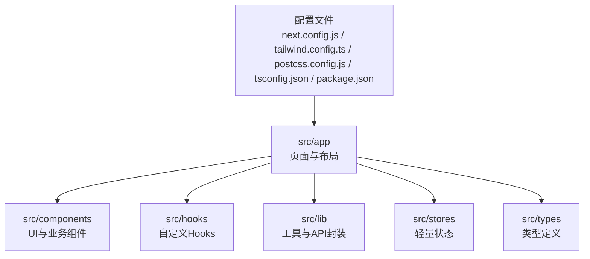
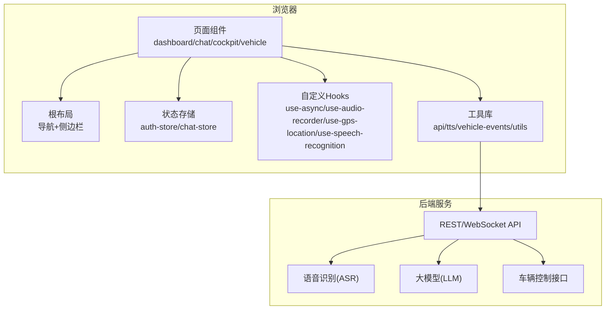
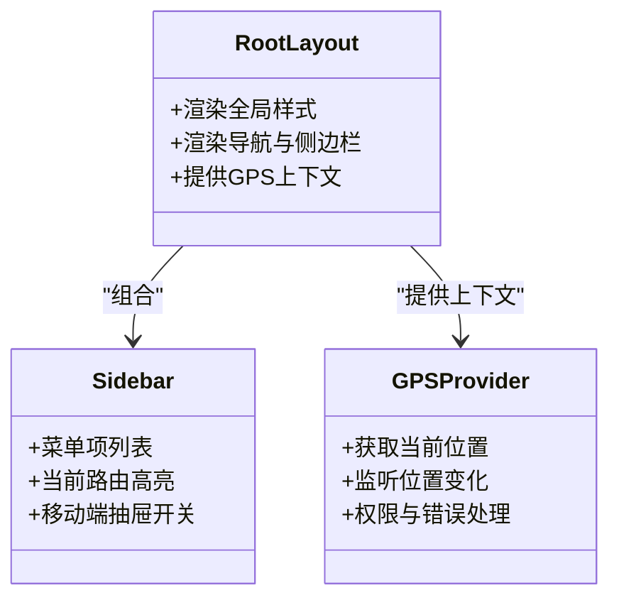
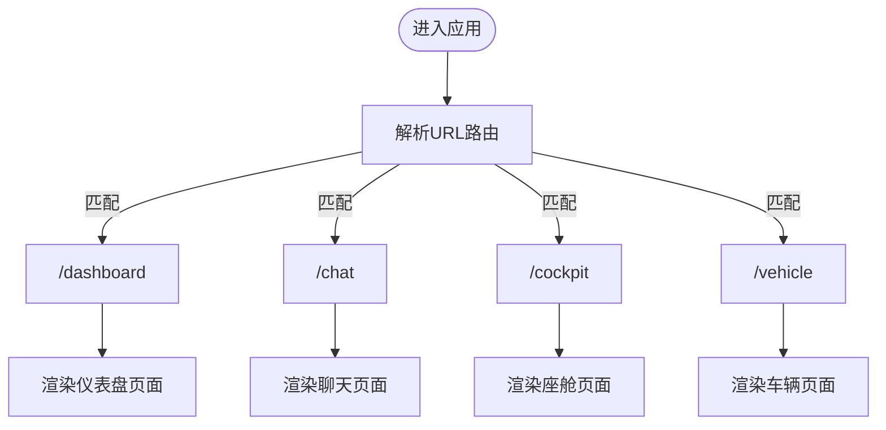
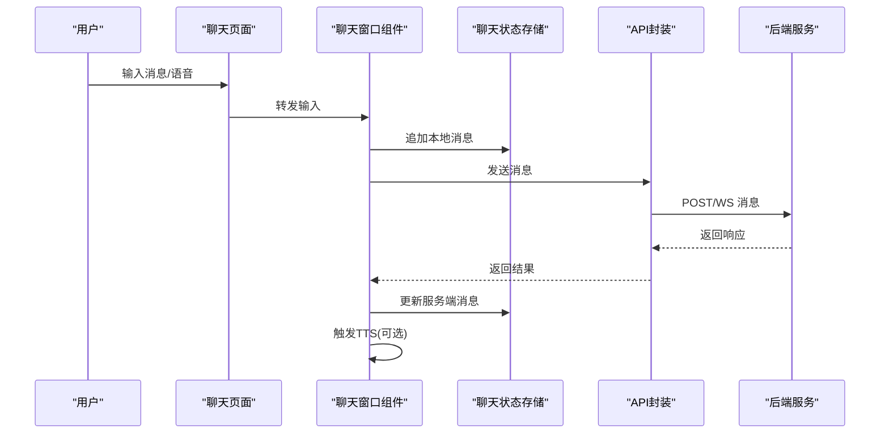
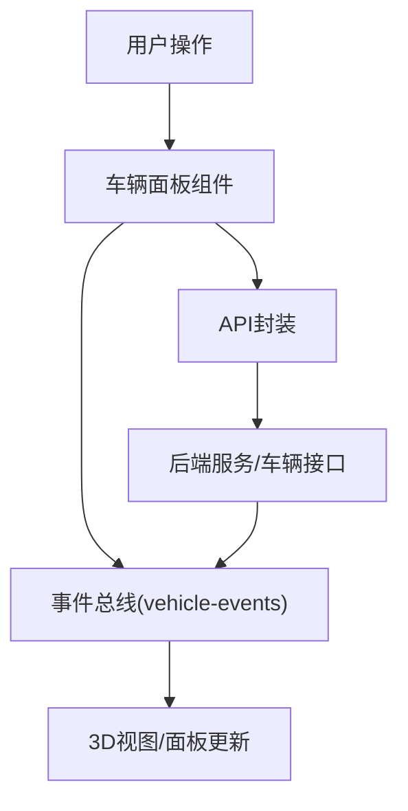
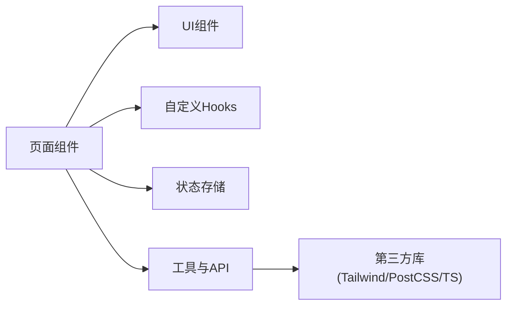

# Next.js应用架构

<cite>
**本文引用的文件**   
- [frontend_design/src/app/layout.tsx](file://frontend_design/src/app/layout.tsx)
- [frontend_design/src/app/page.tsx](file://frontend_design/src/app/page.tsx)
- [frontend_design/src/app/globals.css](file://frontend_design/src/app/globals.css)
- [frontend_design/src/app/dashboard/page.tsx](file://frontend_design/src/app/dashboard/page.tsx)
- [frontend_design/src/app/chat/page.tsx](file://frontend_design/src/app/chat/page.tsx)
- [frontend_design/src/app/cockpit/page.tsx](file://frontend_design/src/app/cockpit/page.tsx)
- [frontend_design/src/app/vehicle/page.tsx](file://frontend_design/src/app/vehicle/page.tsx)
- [frontend_design/src/components/layout/sidebar.tsx](file://frontend_design/src/components/layout/sidebar.tsx)
- [frontend_design/src/components/layout/gps-provider.tsx](file://frontend_design/src/components/layout/gps-provider.tsx)
- [frontend_design/src/components/ui/button.tsx](file://frontend_design/src/components/ui/button.tsx)
- [frontend_design/src/components/ui/card.tsx](file://frontend_design/src/components/ui/card.tsx)
- [frontend_design/src/components/ui/dialog.tsx](file://frontend_design/src/components/ui/dialog.tsx)
- [frontend_design/src/components/ui/input.tsx](file://frontend_design/src/components/ui/input.tsx)
- [frontend_design/src/components/ui/password-change-dialog.tsx](file://frontend_design/src/components/ui/password-change-dialog.tsx)
- [frontend_design/src/components/voice-recorder.tsx](file://frontend_design/src/components/voice-recorder.tsx)
- [frontend_design/src/components/chat/chat-window.tsx](file://frontend_design/src/components/chat/chat-window.tsx)
- [frontend_design/src/components/vehicle/vehicle-3d.tsx](file://frontend_design/src/components/vehicle/vehicle-3d.tsx)
- [frontend_design/src/components/vehicle/vehicle-panel.tsx](file://frontend_design/src/components/vehicle/vehicle-panel.tsx)
- [frontend_design/src/components/vehicle/voice-assistant-bar.tsx](file://frontend_design/src/components/vehicle/voice-assistant-bar.tsx)
- [frontend_design/src/hooks/index.ts](file://frontend_design/src/hooks/index.ts)
- [frontend_design/src/hooks/use-async.ts](file://frontend_design/src/hooks/use-async.ts)
- [frontend_design/src/hooks/use-audio-recorder.ts](file://frontend_design/src/hooks/use-audio-recorder.ts)
- [frontend_design/src/hooks/use-gps-location.ts](file://frontend_design/src/hooks/use-gps-location.ts)
- [frontend_design/src/hooks/use-speech-recognition.ts](file://frontend_design/src/hooks/use-speech-recognition.ts)
- [frontend_design/src/lib/api.ts](file://frontend_design/src/lib/api.ts)
- [frontend_design/src/lib/tts.ts](file://frontend_design/src/lib/tts.ts)
- [frontend_design/src/lib/utils.ts](file://frontend_design/src/lib/utils.ts)
- [frontend_design/src/lib/vehicle-events.ts](file://frontend_design/src/lib/vehicle-events.ts)
- [frontend_design/src/stores/auth-store.ts](file://frontend_design/src/stores/auth-store.ts)
- [frontend_design/src/stores/chat-store.ts](file://frontend_design/src/stores/chat-store.ts)
- [frontend_design/src/types/index.ts](file://frontend_design/src/types/index.ts)
- [frontend_design/next.config.js](file://frontend_design/next.config.js)
- [frontend_design/package.json](file://frontend_design/package.json)
- [frontend_design/tailwind.config.ts](file://frontend_design/tailwind.config.ts)
- [frontend_design/postcss.config.js](file://frontend_design/postcss.config.js)
- [frontend_design/tsconfig.json](file://frontend_design/tsconfig.json)
</cite>

## 目录
1. [简介](#简介)
2. [项目结构](#项目结构)
3. [核心组件](#核心组件)
4. [架构总览](#架构总览)
5. [详细组件分析](#详细组件分析)
6. [依赖分析](#依赖分析)
7. [性能考虑](#性能考虑)
8. [故障排查指南](#故障排查指南)
9. [结论](#结论)
10. [附录](#附录)

## 简介
本文件面向Next.js前端工程，系统化梳理其整体架构与实现策略。重点覆盖：
- 页面路由组织、目录结构与文件命名规范
- layout.tsx布局组件设计（全局样式、导航栏、侧边栏）
- app目录下核心页面（dashboard、chat、cockpit、vehicle）的功能划分
- Next.js配置与环境变量、构建优化与部署要点
- 页面间导航与数据传递最佳实践
- 响应式设计与移动端适配策略

## 项目结构
前端位于 frontend_design 目录，采用App Router组织页面与布局。关键目录与职责如下：
- src/app：基于路由的页面与根布局，包含全局样式与入口页
- src/components：可复用UI与业务组件，按功能域拆分（ui、layout、chat、vehicle等）
- src/hooks：自定义React Hooks（异步、录音、GPS、语音识别等）
- src/lib：通用工具与API封装（网络请求、TTS、事件总线等）
- src/stores：轻量状态管理（认证、聊天会话）
- src/types：TypeScript类型定义
- 配置文件：next.config.js、tailwind.config.ts、postcss.config.js、tsconfig.json、package.json

图表来源
- [frontend_design/src/app/layout.tsx](file://frontend_design/src/app/layout.tsx)
- [frontend_design/src/app/page.tsx](file://frontend_design/src/app/page.tsx)
- [frontend_design/next.config.js](file://frontend_design/next.config.js)
- [frontend_design/tailwind.config.ts](file://frontend_design/tailwind.config.ts)
- [frontend_design/postcss.config.js](file://frontend_design/postcss.config.js)
- [frontend_design/tsconfig.json](file://frontend_design/tsconfig.json)
- [frontend_design/package.json](file://frontend_design/package.json)

章节来源
- [frontend_design/src/app/layout.tsx](file://frontend_design/src/app/layout.tsx)
- [frontend_design/src/app/page.tsx](file://frontend_design/src/app/page.tsx)
- [frontend_design/next.config.js](file://frontend_design/next.config.js)
- [frontend_design/tailwind.config.ts](file://frontend_design/tailwind.config.ts)
- [frontend_design/postcss.config.js](file://frontend_design/postcss.config.js)
- [frontend_design/tsconfig.json](file://frontend_design/tsconfig.json)
- [frontend_design/package.json](file://frontend_design/package.json)

## 核心组件
- 布局层
  - 根布局：负责全局样式注入、导航与侧边栏容器、主题与基础交互
  - 侧边栏：提供主要页面导航入口，支持折叠与移动端抽屉模式
  - GPS上下文：为需要位置信息的页面提供统一的数据源
- UI层
  - 基础控件：按钮、卡片、对话框、输入框、密码修改弹窗等
- 业务组件
  - 聊天窗口：消息列表、输入区、发送逻辑
  - 车辆面板与3D视图：车辆状态展示与交互
  - 语音助手条：快捷语音交互入口
  - 语音录制器：录音控制与上传
- 数据与状态
  - API封装：统一的HTTP调用、错误处理与重试策略
  - TTS封装：文本转语音播放流程
  - 事件总线：车辆事件订阅与分发
  - 状态存储：认证与会话、聊天会话状态
- 自定义Hooks
  - 异步请求、音频录制、GPS定位、语音识别等

章节来源
- [frontend_design/src/components/layout/sidebar.tsx](file://frontend_design/src/components/layout/sidebar.tsx)
- [frontend_design/src/components/layout/gps-provider.tsx](file://frontend_design/src/components/layout/gps-provider.tsx)
- [frontend_design/src/components/ui/button.tsx](file://frontend_design/src/components/ui/button.tsx)
- [frontend_design/src/components/ui/card.tsx](file://frontend_design/src/components/ui/card.tsx)
- [frontend_design/src/components/ui/dialog.tsx](file://frontend_design/src/components/ui/dialog.tsx)
- [frontend_design/src/components/ui/input.tsx](file://frontend_design/src/components/ui/input.tsx)
- [frontend_design/src/components/ui/password-change-dialog.tsx](file://frontend_design/src/components/ui/password-change-dialog.tsx)
- [frontend_design/src/components/chat/chat-window.tsx](file://frontend_design/src/components/chat/chat-window.tsx)
- [frontend_design/src/components/vehicle/vehicle-3d.tsx](file://frontend_design/src/components/vehicle/vehicle-3d.tsx)
- [frontend_design/src/components/vehicle/vehicle-panel.tsx](file://frontend_design/src/components/vehicle/vehicle-panel.tsx)
- [frontend_design/src/components/vehicle/voice-assistant-bar.tsx](file://frontend_design/src/components/vehicle/voice-assistant-bar.tsx)
- [frontend_design/src/components/voice-recorder.tsx](file://frontend_design/src/components/voice-recorder.tsx)
- [frontend_design/src/lib/api.ts](file://frontend_design/src/lib/api.ts)
- [frontend_design/src/lib/tts.ts](file://frontend_design/src/lib/tts.ts)
- [frontend_design/src/lib/vehicle-events.ts](file://frontend_design/src/lib/vehicle-events.ts)
- [frontend_design/src/stores/auth-store.ts](file://frontend_design/src/stores/auth-store.ts)
- [frontend_design/src/stores/chat-store.ts](file://frontend_design/src/stores/chat-store.ts)
- [frontend_design/src/hooks/use-async.ts](file://frontend_design/src/hooks/use-async.ts)
- [frontend_design/src/hooks/use-audio-recorder.ts](file://frontend_design/src/hooks/use-audio-recorder.ts)
- [frontend_design/src/hooks/use-gps-location.ts](file://frontend_design/src/hooks/use-gps-location.ts)
- [frontend_design/src/hooks/use-speech-recognition.ts](file://frontend_design/src/hooks/use-speech-recognition.ts)

## 架构总览
下图展示了从浏览器到后端的关键交互路径，以及前端内部模块协作关系。

图表来源
- [frontend_design/src/app/layout.tsx](file://frontend_design/src/app/layout.tsx)
- [frontend_design/src/app/dashboard/page.tsx](file://frontend_design/src/app/dashboard/page.tsx)
- [frontend_design/src/app/chat/page.tsx](file://frontend_design/src/app/chat/page.tsx)
- [frontend_design/src/app/cockpit/page.tsx](file://frontend_design/src/app/cockpit/page.tsx)
- [frontend_design/src/app/vehicle/page.tsx](file://frontend_design/src/app/vehicle/page.tsx)
- [frontend_design/src/lib/api.ts](file://frontend_design/src/lib/api.ts)
- [frontend_design/src/stores/auth-store.ts](file://frontend_design/src/stores/auth-store.ts)
- [frontend_design/src/stores/chat-store.ts](file://frontend_design/src/stores/chat-store.ts)
- [frontend_design/src/hooks/use-async.ts](file://frontend_design/src/hooks/use-async.ts)
- [frontend_design/src/hooks/use-audio-recorder.ts](file://frontend_design/src/hooks/use-audio-recorder.ts)
- [frontend_design/src/hooks/use-gps-location.ts](file://frontend_design/src/hooks/use-gps-location.ts)
- [frontend_design/src/hooks/use-speech-recognition.ts](file://frontend_design/src/hooks/use-speech-recognition.ts)

## 详细组件分析

### 布局与导航（layout.tsx、sidebar.tsx、gps-provider.tsx）
- 根布局职责
  - 注入全局样式与字体
  - 渲染导航栏与侧边栏容器
  - 提供GPS上下文供子树使用
  - 统一错误边界与加载态
- 侧边栏职责
  - 列出主要页面入口（仪表盘、聊天、座舱、车辆等）
  - 根据当前路由高亮选中项
  - 移动端以抽屉形式展开/收起
- GPS提供者
  - 封装浏览器定位API或外部定位服务
  - 暴露当前位置与更新回调
  - 在权限拒绝或不可用时降级提示

图表来源
- [frontend_design/src/app/layout.tsx](file://frontend_design/src/app/layout.tsx)
- [frontend_design/src/components/layout/sidebar.tsx](file://frontend_design/src/components/layout/sidebar.tsx)
- [frontend_design/src/components/layout/gps-provider.tsx](file://frontend_design/src/components/layout/gps-provider.tsx)

章节来源
- [frontend_design/src/app/layout.tsx](file://frontend_design/src/app/layout.tsx)
- [frontend_design/src/components/layout/sidebar.tsx](file://frontend_design/src/components/layout/sidebar.tsx)
- [frontend_design/src/components/layout/gps-provider.tsx](file://frontend_design/src/components/layout/gps-provider.tsx)

### 页面组织与路由（app目录）
- 路由约定
  - 每个页面目录对应一个路由路径，如 dashboard、chat、cockpit、vehicle
  - 入口文件统一命名为 page.tsx
- 页面职责
  - dashboard：概览数据聚合、关键指标卡片、快捷入口
  - chat：对话界面，集成消息流、语音输入与TTS输出
  - cockpit：座舱综合信息面板，结合地图、车辆状态与告警
  - vehicle：车辆详情与控制面板，含3D可视化与操作反馈
- 导航与跳转
  - 使用框架内置导航能力进行客户端跳转
  - 通过查询参数与URL片段传递轻量数据
  - 复杂状态交由状态存储或上下文管理

图表来源
- [frontend_design/src/app/dashboard/page.tsx](file://frontend_design/src/app/dashboard/page.tsx)
- [frontend_design/src/app/chat/page.tsx](file://frontend_design/src/app/chat/page.tsx)
- [frontend_design/src/app/cockpit/page.tsx](file://frontend_design/src/app/cockpit/page.tsx)
- [frontend_design/src/app/vehicle/page.tsx](file://frontend_design/src/app/vehicle/page.tsx)

章节来源
- [frontend_design/src/app/dashboard/page.tsx](file://frontend_design/src/app/dashboard/page.tsx)
- [frontend_design/src/app/chat/page.tsx](file://frontend_design/src/app/chat/page.tsx)
- [frontend_design/src/app/cockpit/page.tsx](file://frontend_design/src/app/cockpit/page.tsx)
- [frontend_design/src/app/vehicle/page.tsx](file://frontend_design/src/app/vehicle/page.tsx)

### 聊天功能（chat页面与chat-window组件）
- 数据流
  - 用户输入触发发送动作
  - 调用API封装发送消息并接收流式或非流式响应
  - 将新消息追加至聊天状态
  - 可选触发TTS播报
- 交互细节
  - 支持语音输入（录音Hook）
  - 自动滚动到底部
  - 错误重试与失败提示

图表来源
- [frontend_design/src/app/chat/page.tsx](file://frontend_design/src/app/chat/page.tsx)
- [frontend_design/src/components/chat/chat-window.tsx](file://frontend_design/src/components/chat/chat-window.tsx)
- [frontend_design/src/stores/chat-store.ts](file://frontend_design/src/stores/chat-store.ts)
- [frontend_design/src/lib/api.ts](file://frontend_design/src/lib/api.ts)
- [frontend_design/src/lib/tts.ts](file://frontend_design/src/lib/tts.ts)
- [frontend_design/src/hooks/use-audio-recorder.ts](file://frontend_design/src/hooks/use-audio-recorder.ts)

章节来源
- [frontend_design/src/app/chat/page.tsx](file://frontend_design/src/app/chat/page.tsx)
- [frontend_design/src/components/chat/chat-window.tsx](file://frontend_design/src/components/chat/chat-window.tsx)
- [frontend_design/src/stores/chat-store.ts](file://frontend_design/src/stores/chat-store.ts)
- [frontend_design/src/lib/api.ts](file://frontend_design/src/lib/api.ts)
- [frontend_design/src/lib/tts.ts](file://frontend_design/src/lib/tts.ts)
- [frontend_design/src/hooks/use-audio-recorder.ts](file://frontend_design/src/hooks/use-audio-recorder.ts)

### 车辆功能（vehicle页面与vehicle-*组件）
- 功能划分
  - vehicle-3d：3D车辆模型展示与交互
  - vehicle-panel：车辆状态面板（空调、座椅、车窗等）
  - voice-assistant-bar：语音助手快捷入口
- 事件驱动
  - 通过事件总线订阅车辆状态变更
  - 实时更新UI与3D场景
- 控制链路
  - 用户操作 -> 调用API -> 下发指令到车辆接口 -> 返回执行结果

图表来源
- [frontend_design/src/app/vehicle/page.tsx](file://frontend_design/src/app/vehicle/page.tsx)
- [frontend_design/src/components/vehicle/vehicle-3d.tsx](file://frontend_design/src/components/vehicle/vehicle-3d.tsx)
- [frontend_design/src/components/vehicle/vehicle-panel.tsx](file://frontend_design/src/components/vehicle/vehicle-panel.tsx)
- [frontend_design/src/components/vehicle/voice-assistant-bar.tsx](file://frontend_design/src/components/vehicle/voice-assistant-bar.tsx)
- [frontend_design/src/lib/vehicle-events.ts](file://frontend_design/src/lib/vehicle-events.ts)
- [frontend_design/src/lib/api.ts](file://frontend_design/src/lib/api.ts)

章节来源
- [frontend_design/src/app/vehicle/page.tsx](file://frontend_design/src/app/vehicle/page.tsx)
- [frontend_design/src/components/vehicle/vehicle-3d.tsx](file://frontend_design/src/components/vehicle/vehicle-3d.tsx)
- [frontend_design/src/components/vehicle/vehicle-panel.tsx](file://frontend_design/src/components/vehicle/vehicle-panel.tsx)
- [frontend_design/src/components/vehicle/voice-assistant-bar.tsx](file://frontend_design/src/components/vehicle/voice-assistant-bar.tsx)
- [frontend_design/src/lib/vehicle-events.ts](file://frontend_design/src/lib/vehicle-events.ts)
- [frontend_design/src/lib/api.ts](file://frontend_design/src/lib/api.ts)

### 认证与会话（auth-store）
- 职责
  - 维护登录态、用户信息与过期时间
  - 提供登录、登出、刷新令牌等方法
  - 与API封装配合，自动附加鉴权头
- 安全建议
  - 敏感信息避免持久化明文
  - 合理设置Token有效期与刷新策略

章节来源
- [frontend_design/src/stores/auth-store.ts](file://frontend_design/src/stores/auth-store.ts)
- [frontend_design/src/lib/api.ts](file://frontend_design/src/lib/api.ts)

### 自定义Hooks与工具库
- use-async：统一异步请求状态管理（loading、error、data）
- use-audio-recorder：录音采集、格式转换与上传
- use-gps-location：地理位置获取与权限处理
- use-speech-recognition：语音转文本
- lib/api：统一请求封装、拦截器、错误处理
- lib/tts：文本转语音播放控制
- lib/vehicle-events：车辆事件发布/订阅
- lib/utils：通用工具函数

章节来源
- [frontend_design/src/hooks/use-async.ts](file://frontend_design/src/hooks/use-async.ts)
- [frontend_design/src/hooks/use-audio-recorder.ts](file://frontend_design/src/hooks/use-audio-recorder.ts)
- [frontend_design/src/hooks/use-gps-location.ts](file://frontend_design/src/hooks/use-gps-location.ts)
- [frontend_design/src/hooks/use-speech-recognition.ts](file://frontend_design/src/hooks/use-speech-recognition.ts)
- [frontend_design/src/lib/api.ts](file://frontend_design/src/lib/api.ts)
- [frontend_design/src/lib/tts.ts](file://frontend_design/src/lib/tts.ts)
- [frontend_design/src/lib/vehicle-events.ts](file://frontend_design/src/lib/vehicle-events.ts)
- [frontend_design/src/lib/utils.ts](file://frontend_design/src/lib/utils.ts)

## 依赖分析
- 组件耦合
  - 页面组件依赖布局与UI组件，尽量保持低耦合
  - 业务组件通过事件总线与API解耦后端
- 外部依赖
  - Tailwind CSS用于原子化样式
  - PostCSS作为CSS处理管线
  - TypeScript保证类型安全
- 构建与运行
  - next.config.js集中配置构建行为
  - package.json声明脚本与依赖版本

图表来源
- [frontend_design/package.json](file://frontend_design/package.json)
- [frontend_design/next.config.js](file://frontend_design/next.config.js)
- [frontend_design/tailwind.config.ts](file://frontend_design/tailwind.config.ts)
- [frontend_design/postcss.config.js](file://frontend_design/postcss.config.js)
- [frontend_design/tsconfig.json](file://frontend_design/tsconfig.json)

章节来源
- [frontend_design/package.json](file://frontend_design/package.json)
- [frontend_design/next.config.js](file://frontend_design/next.config.js)
- [frontend_design/tailwind.config.ts](file://frontend_design/tailwind.config.ts)
- [frontend_design/postcss.config.js](file://frontend_design/postcss.config.js)
- [frontend_design/tsconfig.json](file://frontend_design/tsconfig.json)

## 性能考虑
- 代码分割与懒加载
  - 页面级按需加载，减少首屏体积
  - 大型组件（如3D视图）延迟初始化
- 资源优化
  - 图片与媒体资源压缩与缓存
  - 静态资源CDN加速
- 网络优化
  - 请求合并与去抖节流
  - 错误重试与超时控制
- 渲染优化
  - 避免不必要的重渲染，合理使用状态提升与选择器
  - 长列表虚拟化与分页加载

[本节为通用指导，不直接分析具体文件]

## 故障排查指南
- 常见问题定位
  - 网络请求失败：检查API封装的错误处理与重试策略
  - 语音相关异常：确认麦克风权限、编码格式与后端ASR可用性
  - 定位异常：处理权限拒绝与无信号场景的降级
  - 状态不同步：核对状态存储更新时机与副作用清理
- 调试建议
  - 启用开发日志与错误上报
  - 对关键流程增加埋点与耗时统计
  - 使用浏览器开发者工具进行断点与网络抓包

章节来源
- [frontend_design/src/lib/api.ts](file://frontend_design/src/lib/api.ts)
- [frontend_design/src/hooks/use-audio-recorder.ts](file://frontend_design/src/hooks/use-audio-recorder.ts)
- [frontend_design/src/hooks/use-gps-location.ts](file://frontend_design/src/hooks/use-gps-location.ts)
- [frontend_design/src/stores/auth-store.ts](file://frontend_design/src/stores/auth-store.ts)
- [frontend_design/src/stores/chat-store.ts](file://frontend_design/src/stores/chat-store.ts)

## 结论
本项目采用Next.js App Router与模块化组件体系，围绕布局、页面、状态与工具库形成清晰分层。通过事件总线与API封装实现前后端解耦，结合Tailwind与自定义Hooks提升开发效率与用户体验。建议在后续迭代中持续完善错误处理、性能监控与可观测性，确保系统稳定与可维护性。

[本节为总结性内容，不直接分析具体文件]

## 附录

### 页面间导航与数据传递最佳实践
- 路由导航
  - 使用框架内置导航进行客户端跳转，避免整页刷新
- 参数传递
  - 简单数据使用URL查询参数与片段标识
  - 复杂状态使用状态存储或上下文共享
- 生命周期
  - 在页面卸载时清理副作用（定时器、事件监听、WebSocket连接）
- 错误与回退
  - 对导航目标不存在或权限不足进行友好提示与回退

章节来源
- [frontend_design/src/app/layout.tsx](file://frontend_design/src/app/layout.tsx)
- [frontend_design/src/app/dashboard/page.tsx](file://frontend_design/src/app/dashboard/page.tsx)
- [frontend_design/src/app/chat/page.tsx](file://frontend_design/src/app/chat/page.tsx)
- [frontend_design/src/app/cockpit/page.tsx](file://frontend_design/src/app/cockpit/page.tsx)
- [frontend_design/src/app/vehicle/page.tsx](file://frontend_design/src/app/vehicle/page.tsx)

### 响应式设计与移动端适配策略
- 栅格与断点
  - 基于Tailwind断点实现多尺寸适配
- 布局调整
  - 小屏幕下侧边栏切换为抽屉模式
  - 重要操作区域优先置于拇指可达范围
- 交互优化
  - 触摸友好的点击区域与反馈
  - 键盘与无障碍支持
- 性能与体验
  - 按需加载大图与媒体资源
  - 避免阻塞主线程的重计算

章节来源
- [frontend_design/src/components/layout/sidebar.tsx](file://frontend_design/src/components/layout/sidebar.tsx)
- [frontend_design/tailwind.config.ts](file://frontend_design/tailwind.config.ts)
- [frontend_design/src/app/globals.css](file://frontend_design/src/app/globals.css)

### Next.js配置与环境变量、构建优化与部署
- 环境变量
  - 区分开发与生产环境，避免硬编码敏感信息
- 构建优化
  - 开启Tree Shaking与代码分割
  - 静态资源预取与缓存策略
- 部署配置
  - 反向代理与HTTPS证书管理
  - 健康检查与灰度发布

章节来源
- [frontend_design/next.config.js](file://frontend_design/next.config.js)
- [frontend_design/package.json](file://frontend_design/package.json)
- [frontend_design/tailwind.config.ts](file://frontend_design/tailwind.config.ts)
- [frontend_design/postcss.config.js](file://frontend_design/postcss.config.js)
- [frontend_design/tsconfig.json](file://frontend_design/tsconfig.json)