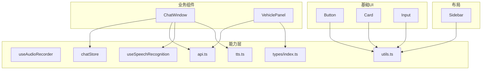
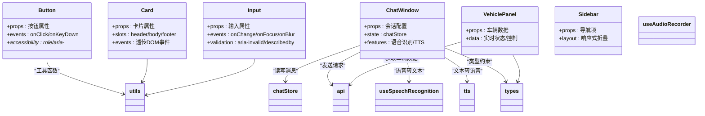
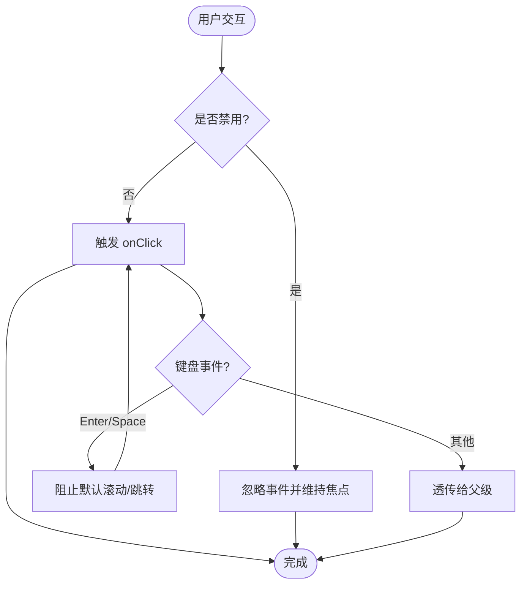
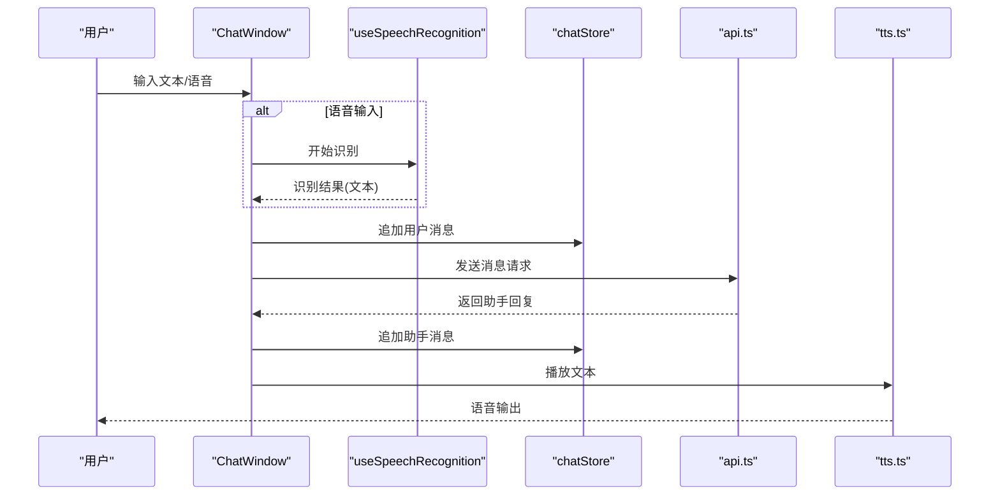
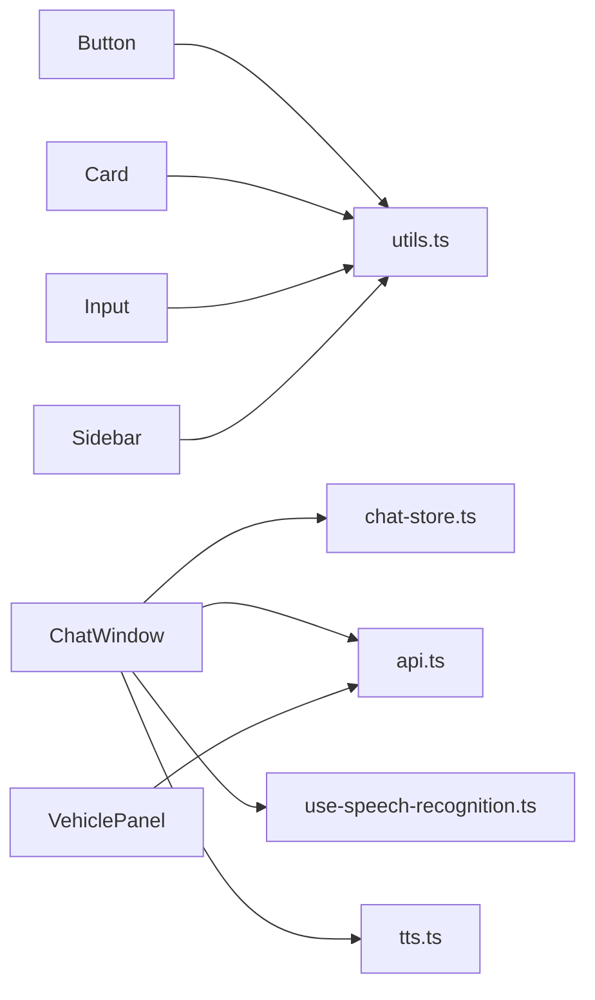

# UI组件库

<cite>
**本文引用的文件**   
- [frontend_design/src/components/ui/button.tsx](file://frontend_design/src/components/ui/button.tsx)
- [frontend_design/src/components/ui/card.tsx](file://frontend_design/src/components/ui/card.tsx)
- [frontend_design/src/components/ui/input.tsx](file://frontend_design/src/components/ui/input.tsx)
- [frontend_design/src/components/chat/chat-window.tsx](file://frontend_design/src/components/chat/chat-window.tsx)
- [frontend_design/src/components/vehicle/vehicle-panel.tsx](file://frontend_design/src/components/vehicle/vehicle-panel.tsx)
- [frontend_design/src/components/layout/sidebar.tsx](file://frontend_design/src/components/layout/sidebar.tsx)
- [frontend_design/src/hooks/use-audio-recorder.ts](file://frontend_design/src/hooks/use-audio-recorder.ts)
- [frontend_design/src/hooks/use-speech-recognition.ts](file://frontend_design/src/hooks/use-speech-recognition.ts)
- [frontend_design/src/stores/chat-store.ts](file://frontend_design/src/stores/chat-store.ts)
- [frontend_design/src/lib/api.ts](file://frontend_design/src/lib/api.ts)
- [frontend_design/src/lib/tts.ts](file://frontend_design/src/lib/tts.ts)
- [frontend_design/src/lib/utils.ts](file://frontend_design/src/lib/utils.ts)
- [frontend_design/src/types/index.ts](file://frontend_design/src/types/index.ts)
- [frontend_design/tailwind.config.ts](file://frontend_design/tailwind.config.ts)
- [frontend_design/package.json](file://frontend_design/package.json)
</cite>

## 目录
1. [简介](#简介)
2. [项目结构](#项目结构)
3. [核心组件](#核心组件)
4. [架构总览](#架构总览)
5. [详细组件分析](#详细组件分析)
6. [依赖分析](#依赖分析)
7. [性能考虑](#性能考虑)
8. [故障排查指南](#故障排查指南)
9. [结论](#结论)
10. [附录](#附录)

## 简介
本文件为 NexusCockpit 前端 UI 组件库的权威文档，聚焦于基础 UI 组件、业务组件与布局组件的设计与实现。内容涵盖：
- 组件 Props 接口、事件处理、样式定制与主题支持
- 组件复用模式、组合使用方式与扩展机制
- 响应式设计、可访问性支持与跨浏览器兼容性
- 组件开发规范、测试策略与文档生成方法

目标读者包括前端开发者、UI/UX 工程师以及需要集成或二次开发的团队成员。

## 项目结构
前端采用 Next.js + TypeScript + Tailwind CSS 技术栈，组件按“功能域”组织：
- 基础 UI 组件：button、card、input
- 业务组件：chat-window（聊天窗口）、vehicle-panel（车辆面板）
- 布局组件：sidebar（侧边栏）
- 通用能力：hooks（录音、语音识别）、stores（状态管理）、lib（API、TTS、工具函数）、types（类型定义）

图表来源
- [frontend_design/src/components/ui/button.tsx](file://frontend_design/src/components/ui/button.tsx)
- [frontend_design/src/components/ui/card.tsx](file://frontend_design/src/components/ui/card.tsx)
- [frontend_design/src/components/ui/input.tsx](file://frontend_design/src/components/ui/input.tsx)
- [frontend_design/src/components/chat/chat-window.tsx](file://frontend_design/src/components/chat/chat-window.tsx)
- [frontend_design/src/components/vehicle/vehicle-panel.tsx](file://frontend_design/src/components/vehicle/vehicle-panel.tsx)
- [frontend_design/src/components/layout/sidebar.tsx](file://frontend_design/src/components/layout/sidebar.tsx)
- [frontend_design/src/hooks/use-audio-recorder.ts](file://frontend_design/src/hooks/use-audio-recorder.ts)
- [frontend_design/src/hooks/use-speech-recognition.ts](file://frontend_design/src/hooks/use-speech-recognition.ts)
- [frontend_design/src/stores/chat-store.ts](file://frontend_design/src/stores/chat-store.ts)
- [frontend_design/src/lib/api.ts](file://frontend_design/src/lib/api.ts)
- [frontend_design/src/lib/tts.ts](file://frontend_design/src/lib/tts.ts)
- [frontend_design/src/lib/utils.ts](file://frontend_design/src/lib/utils.ts)
- [frontend_design/src/types/index.ts](file://frontend_design/src/types/index.ts)

章节来源
- [frontend_design/package.json](file://frontend_design/package.json)
- [frontend_design/tailwind.config.ts](file://frontend_design/tailwind.config.ts)

## 核心组件
本节概述基础 UI 组件的职责边界与通用约定，便于后续深入分析与扩展。

- Button（按钮）
  - 职责：提供统一的交互入口，承载点击事件、加载态、禁用态等
  - 关键特性：尺寸变体、颜色语义、图标插槽、键盘可达性
  - 样式：基于 Tailwind 原子类，支持主题色与状态色
  - 事件：onClick、onKeyDown、onPointerDown 等
  - 无障碍：role、aria-*、tabIndex 等属性透传

- Card（卡片）
  - 职责：信息容器，用于聚合标题、正文、操作区
  - 关键特性：阴影、圆角、内边距、分割线、头部/主体/尾部区域
  - 样式：通过 Tailwind 组合类实现一致视觉层级
  - 事件：透传原生 DOM 事件

- Input（输入框）
  - 职责：文本输入控件，支持受控与非受控模式
  - 关键特性：占位符、只读、禁用、错误提示、前缀/后缀
  - 事件：onChange、onFocus、onBlur、onKeyDown
  - 无障碍：label 关联、aria-invalid、aria-describedby

章节来源
- [frontend_design/src/components/ui/button.tsx](file://frontend_design/src/components/ui/button.tsx)
- [frontend_design/src/components/ui/card.tsx](file://frontend_design/src/components/ui/card.tsx)
- [frontend_design/src/components/ui/input.tsx](file://frontend_design/src/components/ui/input.tsx)

## 架构总览
UI 组件库遵循“基础组件 -> 业务组件 -> 页面”的分层设计，并通过 hooks、stores、lib 提供横切能力。

图表来源
- [frontend_design/src/components/ui/button.tsx](file://frontend_design/src/components/ui/button.tsx)
- [frontend_design/src/components/ui/card.tsx](file://frontend_design/src/components/ui/card.tsx)
- [frontend_design/src/components/ui/input.tsx](file://frontend_design/src/components/ui/input.tsx)
- [frontend_design/src/components/chat/chat-window.tsx](file://frontend_design/src/components/chat/chat-window.tsx)
- [frontend_design/src/components/vehicle/vehicle-panel.tsx](file://frontend_design/src/components/vehicle/vehicle-panel.tsx)
- [frontend_design/src/components/layout/sidebar.tsx](file://frontend_design/src/components/layout/sidebar.tsx)
- [frontend_design/src/hooks/use-audio-recorder.ts](file://frontend_design/src/hooks/use-audio-recorder.ts)
- [frontend_design/src/hooks/use-speech-recognition.ts](file://frontend_design/src/hooks/use-speech-recognition.ts)
- [frontend_design/src/stores/chat-store.ts](file://frontend_design/src/stores/chat-store.ts)
- [frontend_design/src/lib/api.ts](file://frontend_design/src/lib/api.ts)
- [frontend_design/src/lib/tts.ts](file://frontend_design/src/lib/tts.ts)
- [frontend_design/src/lib/utils.ts](file://frontend_design/src/lib/utils.ts)
- [frontend_design/src/types/index.ts](file://frontend_design/src/types/index.ts)

## 详细组件分析

### 基础组件：Button
- 设计要点
  - 统一尺寸与色彩语义，支持主/次/危险等变体
  - 支持图标前置/后置插槽，保持视觉一致性
  - 键盘可达性与焦点管理，确保无障碍体验
- Props 约定
  - 基础：variant、size、disabled、loading、icon、children
  - 事件：onClick、onKeyDown、onPointerDown
  - 无障碍：aria-label、aria-describedby、role
- 样式与主题
  - 基于 Tailwind 原子类，通过配置变量映射主题色
  - 支持 hover/focus/disabled/loading 状态样式
- 事件处理
  - 阻止默认行为与冒泡的策略
  - 与表单组件联动时的提交拦截
- 可访问性
  - 正确的语义标签与 ARIA 属性
  - 焦点可见性与屏幕阅读器友好文案

图表来源
- [frontend_design/src/components/ui/button.tsx](file://frontend_design/src/components/ui/button.tsx)
- [frontend_design/src/lib/utils.ts](file://frontend_design/src/lib/utils.ts)

章节来源
- [frontend_design/src/components/ui/button.tsx](file://frontend_design/src/components/ui/button.tsx)
- [frontend_design/src/lib/utils.ts](file://frontend_design/src/lib/utils.ts)

### 基础组件：Card
- 设计要点
  - 作为信息容器，提供一致的间距、边框与阴影
  - 支持头部/主体/尾部区域划分，便于组合
- Props 约定
  - 基础：title、description、actions、padding、shadow、rounded
  - 事件：透传 DOM 事件
- 样式与主题
  - 通过 Tailwind 组合类实现不同密度与层级
  - 支持暗色模式下的对比度调整
- 组合模式
  - 与 Button、Input 等基础组件组合，形成表单卡片、统计卡片等

章节来源
- [frontend_design/src/components/ui/card.tsx](file://frontend_design/src/components/ui/card.tsx)
- [frontend_design/src/lib/utils.ts](file://frontend_design/src/lib/utils.ts)

### 基础组件：Input
- 设计要点
  - 受控与非受控双模式，统一 value/onChange 契约
  - 错误态与辅助说明，提升可用性
- Props 约定
  - 基础：value、defaultValue、placeholder、disabled、readOnly
  - 校验：error、helperText、aria-invalid、aria-describedby
  - 事件：onChange、onFocus、onBlur、onKeyDown
- 样式与主题
  - 聚焦态高亮、错误态红色边框、禁用态灰化
- 可访问性
  - label 关联、错误提示朗读、Tab 顺序合理

章节来源
- [frontend_design/src/components/ui/input.tsx](file://frontend_design/src/components/ui/input.tsx)
- [frontend_design/src/lib/utils.ts](file://frontend_design/src/lib/utils.ts)

### 业务组件：ChatWindow（聊天窗口）
- 设计要点
  - 消息列表渲染、自动滚动到底部、时间戳显示
  - 支持文本输入、语音输入、TTS 播放
  - 与后端 API 通信，维护会话状态
- 关键流程（序列图）

图表来源
- [frontend_design/src/components/chat/chat-window.tsx](file://frontend_design/src/components/chat/chat-window.tsx)
- [frontend_design/src/hooks/use-speech-recognition.ts](file://frontend_design/src/hooks/use-speech-recognition.ts)
- [frontend_design/src/stores/chat-store.ts](file://frontend_design/src/stores/chat-store.ts)
- [frontend_design/src/lib/api.ts](file://frontend_design/src/lib/api.ts)
- [frontend_design/src/lib/tts.ts](file://frontend_design/src/lib/tts.ts)

- 事件与状态
  - 事件：onSend、onClear、onPlay、onPause
  - 状态：messages、loading、error、isPlaying
- 样式与主题
  - 气泡样式、头像、时间戳对齐
  - 暗色模式适配
- 可访问性
  - 消息列表的 live region、ARIA 角色与描述
  - 语音播放控件的可达性

章节来源
- [frontend_design/src/components/chat/chat-window.tsx](file://frontend_design/src/components/chat/chat-window.tsx)
- [frontend_design/src/hooks/use-speech-recognition.ts](file://frontend_design/src/hooks/use-speech-recognition.ts)
- [frontend_design/src/stores/chat-store.ts](file://frontend_design/src/stores/chat-store.ts)
- [frontend_design/src/lib/api.ts](file://frontend_design/src/lib/api.ts)
- [frontend_design/src/lib/tts.ts](file://frontend_design/src/lib/tts.ts)

### 业务组件：VehiclePanel（车辆面板）
- 设计要点
  - 展示车辆状态（电量、胎压、空调等），并提供快捷控制
  - 与后端 API 同步数据，支持实时更新
- 数据流
  - 初始化拉取数据 -> 定时轮询/WebSocket 更新 -> 局部重渲染
- 事件与回调
  - onControlAction、onRefresh、onError
- 样式与主题
  - 指标卡片、开关控件、进度条
  - 状态色（正常/警告/异常）
- 可访问性
  - 控件的 aria-pressed、aria-valuenow/min/max
  - 错误提示与帮助文本

章节来源
- [frontend_design/src/components/vehicle/vehicle-panel.tsx](file://frontend_design/src/components/vehicle/vehicle-panel.tsx)
- [frontend_design/src/lib/api.ts](file://frontend_design/src/lib/api.ts)
- [frontend_design/src/types/index.ts](file://frontend_design/src/types/index.ts)

### 布局组件：Sidebar（侧边栏）
- 设计要点
  - 导航菜单、路由高亮、折叠/展开
  - 移动端抽屉式呈现
- 响应式
  - 断点切换：桌面端常驻、移动端抽屉
- 事件与状态
  - onToggle、activeItem、collapsed
- 样式与主题
  - 背景、分隔线、悬停效果
  - 与全局主题一致

章节来源
- [frontend_design/src/components/layout/sidebar.tsx](file://frontend_design/src/components/layout/sidebar.tsx)
- [frontend_design/src/lib/utils.ts](file://frontend_design/src/lib/utils.ts)

## 依赖分析
- 组件间耦合
  - 业务组件依赖基础组件与能力层（hooks、stores、lib）
  - 基础组件尽量无外部业务依赖，仅依赖工具函数与主题配置
- 外部依赖
  - Tailwind CSS：样式系统
  - Next.js：路由与构建
  - 第三方库（如语音识别、音频播放）由 hooks 封装隔离
- 潜在循环依赖
  - 避免组件直接相互引用，必要时通过 props 或 context 解耦

图表来源
- [frontend_design/src/components/ui/button.tsx](file://frontend_design/src/components/ui/button.tsx)
- [frontend_design/src/components/ui/card.tsx](file://frontend_design/src/components/ui/card.tsx)
- [frontend_design/src/components/ui/input.tsx](file://frontend_design/src/components/ui/input.tsx)
- [frontend_design/src/components/chat/chat-window.tsx](file://frontend_design/src/components/chat/chat-window.tsx)
- [frontend_design/src/components/vehicle/vehicle-panel.tsx](file://frontend_design/src/components/vehicle/vehicle-panel.tsx)
- [frontend_design/src/components/layout/sidebar.tsx](file://frontend_design/src/components/layout/sidebar.tsx)
- [frontend_design/src/hooks/use-speech-recognition.ts](file://frontend_design/src/hooks/use-speech-recognition.ts)
- [frontend_design/src/stores/chat-store.ts](file://frontend_design/src/stores/chat-store.ts)
- [frontend_design/src/lib/api.ts](file://frontend_design/src/lib/api.ts)
- [frontend_design/src/lib/tts.ts](file://frontend_design/src/lib/tts.ts)
- [frontend_design/src/lib/utils.ts](file://frontend_design/src/lib/utils.ts)

章节来源
- [frontend_design/package.json](file://frontend_design/package.json)
- [frontend_design/tailwind.config.ts](file://frontend_design/tailwind.config.ts)

## 性能考虑
- 渲染优化
  - 合理使用 React.memo、useMemo、useCallback 减少不必要的重渲染
  - 长列表虚拟滚动（如消息过多时）
- 网络请求
  - 防抖/节流、请求去重、缓存策略
  - 错误重试与降级
- 媒体资源
  - 语音录制与播放的流式处理，避免阻塞主线程
  - 按需加载与懒加载图片/模型
- 主题与样式
  - 最小化 Tailwind 类名体积，启用 PurgeCSS
  - 避免在高频路径中动态计算样式

[本节为通用指导，不直接分析具体文件]

## 故障排查指南
- 常见问题
  - 语音识别不可用：检查浏览器权限与麦克风设备
  - TTS 播放失败：检查音频格式与浏览器兼容
  - 消息未更新：确认 store 状态变更与订阅是否正确
  - 样式错乱：检查 Tailwind 配置与类名冲突
- 调试建议
  - 使用浏览器开发者工具的 Network、Console、Performance 面板
  - 对关键 hook 添加日志与埋点
  - 对异步流程增加超时与错误码处理

章节来源
- [frontend_design/src/hooks/use-audio-recorder.ts](file://frontend_design/src/hooks/use-audio-recorder.ts)
- [frontend_design/src/hooks/use-speech-recognition.ts](file://frontend_design/src/hooks/use-speech-recognition.ts)
- [frontend_design/src/lib/tts.ts](file://frontend_design/src/lib/tts.ts)
- [frontend_design/src/stores/chat-store.ts](file://frontend_design/src/stores/chat-store.ts)

## 结论
本组件库以基础 UI 组件为核心，向上支撑业务组件与布局组件，通过 hooks、stores、lib 提供横切能力。遵循一致的 Props 约定、事件处理与无障碍标准，结合 Tailwind 主题体系，可实现快速迭代与良好用户体验。建议在后续版本中持续完善单元测试与可视化回归，进一步提升稳定性与可维护性。

[本节为总结性内容，不直接分析具体文件]

## 附录

### 组件开发规范
- 命名与文件组织
  - 组件文件以小驼峰命名，放在对应功能域目录下
  - 类型定义集中存放于 types/index.ts
- Props 设计
  - 明确必填/可选、默认值与类型约束
  - 事件回调命名清晰，参数稳定
- 样式与主题
  - 优先使用 Tailwind 原子类，复杂样式抽取为组合类
  - 主题色通过配置文件统一管理
- 可访问性
  - 语义化标签、ARIA 属性、键盘可达性
  - 错误提示与帮助文本可读

章节来源
- [frontend_design/src/types/index.ts](file://frontend_design/src/types/index.ts)
- [frontend_design/tailwind.config.ts](file://frontend_design/tailwind.config.ts)

### 测试策略
- 单元与集成测试
  - 基础组件：快照测试、交互测试（点击、键盘）
  - 业务组件：模拟 API 响应、验证状态流转
- 端到端测试
  - 关键用户流程（发送消息、语音输入、车辆控制）
- 可访问性测试
  - 自动化扫描与人工复核

[本节为通用指导，不直接分析具体文件]

### 文档生成方法
- 组件文档
  - 使用 Storybook 或类似工具生成交互式文档
  - 导出 Props 类型与示例用法
- 自动化
  - 从代码注释与类型注解提取元数据
  - CI 中集成文档构建与发布

[本节为通用指导，不直接分析具体文件]