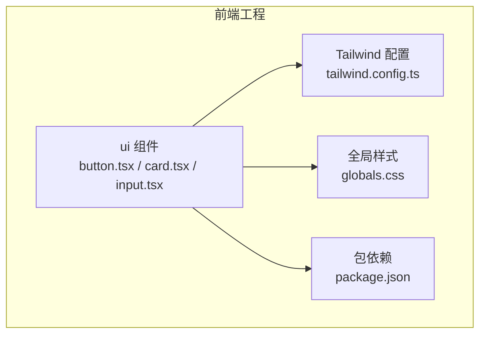
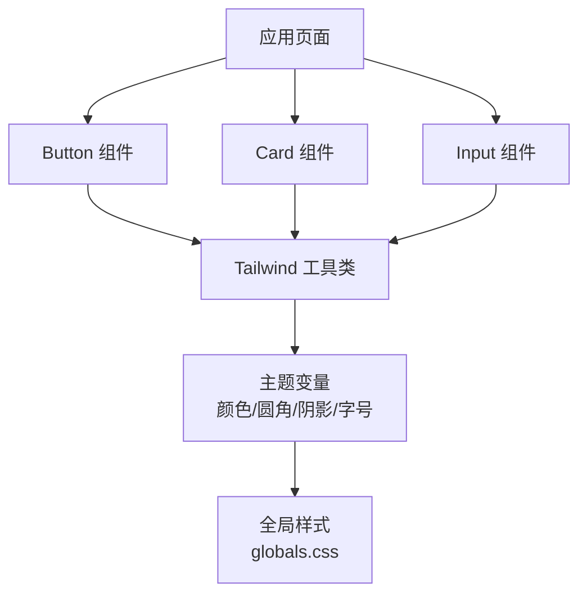
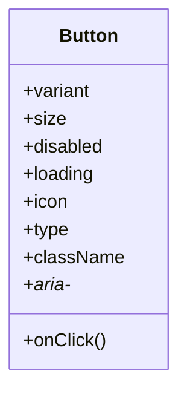
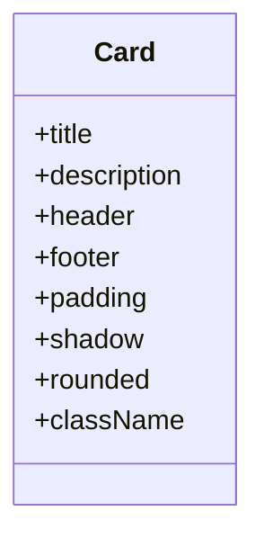
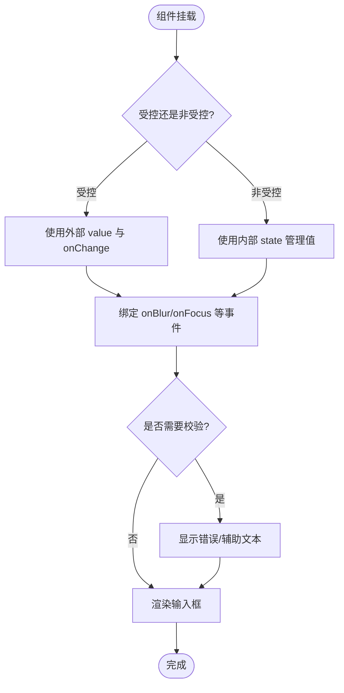
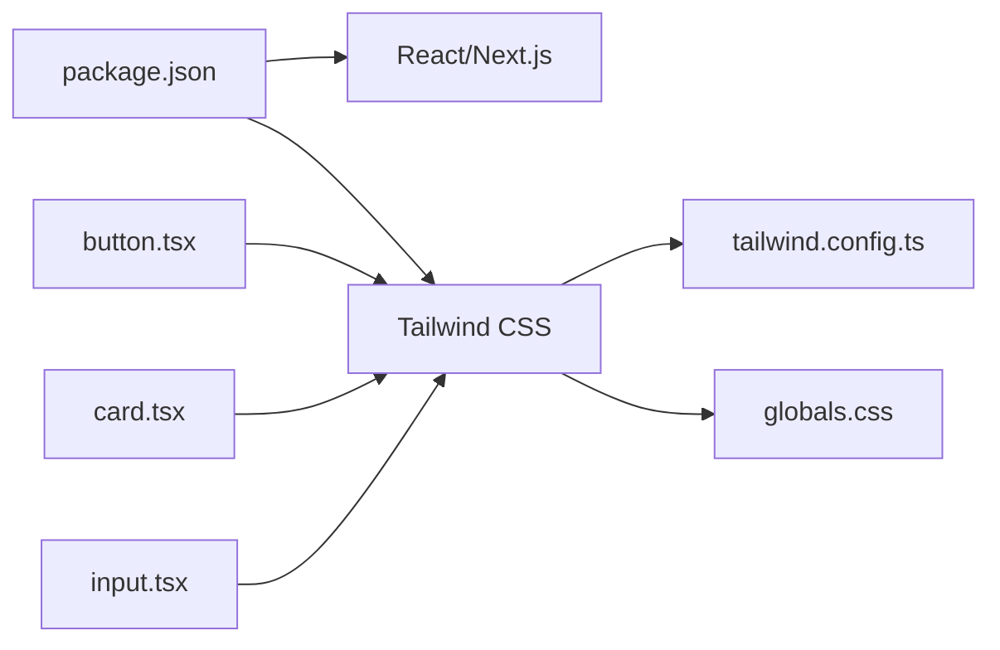

# 基础UI组件

<cite>
**本文引用的文件**   
- [frontend_design/src/components/ui/button.tsx](file://frontend_design/src/components/ui/button.tsx)
- [frontend_design/src/components/ui/card.tsx](file://frontend_design/src/components/ui/card.tsx)
- [frontend_design/src/components/ui/input.tsx](file://frontend_design/src/components/ui/input.tsx)
- [frontend_design/tailwind.config.ts](file://frontend_design/tailwind.config.ts)
- [frontend_design/src/app/globals.css](file://frontend_design/src/app/globals.css)
- [frontend_design/package.json](file://frontend_design/package.json)
</cite>

## 目录
1. [简介](#简介)
2. [项目结构](#项目结构)
3. [核心组件](#核心组件)
4. [架构总览](#架构总览)
5. [详细组件分析](#详细组件分析)
6. [依赖分析](#依赖分析)
7. [性能考虑](#性能考虑)
8. [故障排查指南](#故障排查指南)
9. [结论](#结论)
10. [附录](#附录)

## 简介
本章节面向NexusCockpit前端的基础UI组件，聚焦按钮（Button）、卡片（Card）、输入框（Input）三个原子级组件。文档将系统阐述其设计目标、Props接口约定、事件处理机制、样式与主题定制方式、可访问性与响应式策略、跨浏览器兼容性要点，以及扩展与自定义样式的最佳实践。目标是帮助开发者快速上手并稳定复用这些基础能力。

## 项目结构
基础UI组件位于前端工程中的统一目录，遵循“按功能域组织”的规范：
- 组件实现：frontend_design/src/components/ui/
- 全局样式与主题变量：frontend_design/src/app/globals.css
- Tailwind配置：frontend_design/tailwind.config.ts
- 依赖声明：frontend_design/package.json

图表来源
- [frontend_design/src/components/ui/button.tsx](file://frontend_design/src/components/ui/button.tsx)
- [frontend_design/src/components/ui/card.tsx](file://frontend_design/src/components/ui/card.tsx)
- [frontend_design/src/components/ui/input.tsx](file://frontend_design/src/components/ui/input.tsx)
- [frontend_design/tailwind.config.ts](file://frontend_design/tailwind.config.ts)
- [frontend_design/src/app/globals.css](file://frontend_design/src/app/globals.css)
- [frontend_design/package.json](file://frontend_design/package.json)

章节来源
- [frontend_design/src/components/ui/button.tsx](file://frontend_design/src/components/ui/button.tsx)
- [frontend_design/src/components/ui/card.tsx](file://frontend_design/src/components/ui/card.tsx)
- [frontend_design/src/components/ui/input.tsx](file://frontend_design/src/components/ui/input.tsx)
- [frontend_design/tailwind.config.ts](file://frontend_design/tailwind.config.ts)
- [frontend_design/src/app/globals.css](file://frontend_design/src/app/globals.css)
- [frontend_design/package.json](file://frontend_design/package.json)

## 核心组件
本节概述三个基础组件的职责边界与通用约定：
- Button：承载交互动作，支持多种视觉变体与尺寸，提供禁用态与加载态，具备键盘可达性与语义化标签。
- Card：作为内容容器，提供圆角、阴影、内边距等一致的视觉风格，便于组合其他内容。
- Input：标准表单输入控件，支持受控与非受控模式、占位符、只读、禁用、大小与对齐等属性，具备焦点与验证反馈。

章节来源
- [frontend_design/src/components/ui/button.tsx](file://frontend_design/src/components/ui/button.tsx)
- [frontend_design/src/components/ui/card.tsx](file://frontend_design/src/components/ui/card.tsx)
- [frontend_design/src/components/ui/input.tsx](file://frontend_design/src/components/ui/input.tsx)

## 架构总览
基础UI组件采用“轻量封装 + 样式系统驱动”的架构：
- 组件层：React函数组件，仅暴露稳定的Props与事件回调，不耦合业务逻辑。
- 样式层：以Tailwind Utility类为主，辅以CSS变量与全局样式进行主题化。
- 主题层：通过CSS变量与Tailwind配置集中管理颜色、圆角、阴影、字号等设计令牌。
- 可访问性：使用原生HTML语义元素与ARIA属性，确保屏幕阅读器与键盘导航体验。

图表来源
- [frontend_design/src/components/ui/button.tsx](file://frontend_design/src/components/ui/button.tsx)
- [frontend_design/src/components/ui/card.tsx](file://frontend_design/src/components/ui/card.tsx)
- [frontend_design/src/components/ui/input.tsx](file://frontend_design/src/components/ui/input.tsx)
- [frontend_design/tailwind.config.ts](file://frontend_design/tailwind.config.ts)
- [frontend_design/src/app/globals.css](file://frontend_design/src/app/globals.css)

## 详细组件分析

### 按钮组件（Button）
- 设计目标
  - 统一的点击入口，提供清晰的主次层级与状态反馈。
  - 良好的键盘可达性与语义化表达。
- Props接口（建议）
  - variant: 视觉变体（如 primary/secondary/outline/danger 等）
  - size: 尺寸（sm/md/lg）
  - disabled: 是否禁用
  - loading: 是否显示加载指示
  - icon: 图标节点或名称
  - onClick: 点击回调
  - type: 原生类型（button/submit/reset）
  - className: 自定义类名覆盖
  - aria-*: 无障碍增强属性
- 事件处理机制
  - 点击事件冒泡控制与阻止默认行为（当type为submit时）。
  - 在loading或disabled状态下屏蔽重复触发。
- 样式与主题
  - 通过Tailwind类组合实现不同variant与size。
  - 颜色、圆角、阴影由主题变量与Tailwind配置统一管理。
- 可访问性
  - 使用button语义元素，正确设置aria-disabled、aria-busy、aria-label等。
  - 键盘Tab/Enter/Space可达。
- 响应式与兼容
  - 基于Tailwind断点实现小屏紧凑布局。
  - 兼容主流浏览器对CSS变量与Tailwind编译产物。
- 使用示例（路径）
  - [按钮基本用法示例](file://frontend_design/src/components/ui/button.tsx)
- 最佳实践
  - 避免在按钮内嵌套复杂交互；长文本需换行与截断策略。
  - 异步操作配合loading状态，防止重复提交。
- 性能优化
  - 使用React.memo包裹以减少重渲染。
  - 图标与样式按需加载，避免大体积资源阻塞。

图表来源
- [frontend_design/src/components/ui/button.tsx](file://frontend_design/src/components/ui/button.tsx)

章节来源
- [frontend_design/src/components/ui/button.tsx](file://frontend_design/src/components/ui/button.tsx)
- [frontend_design/tailwind.config.ts](file://frontend_design/tailwind.config.ts)
- [frontend_design/src/app/globals.css](file://frontend_design/src/app/globals.css)

### 卡片组件（Card）
- 设计目标
  - 提供一致的内容容器，强调层次与信息分组。
- Props接口（建议）
  - title: 标题文本或节点
  - description: 描述文本或节点
  - header/footer: 头部/尾部插槽
  - padding: 内边距档位
  - shadow: 阴影强度
  - rounded: 圆角档位
  - className: 自定义类名覆盖
- 事件处理机制
  - 通常无内置事件，如需点击可将外层包装为可交互元素并在上层处理。
- 样式与主题
  - 背景色、边框、阴影、圆角由主题变量与Tailwind配置控制。
- 可访问性
  - 使用article或section语义，必要时添加role与aria-labelledby关联标题。
- 响应式与兼容
  - 在小屏幕上自动调整内边距与间距，保持可读性。
- 使用示例（路径）
  - [卡片基本用法示例](file://frontend_design/src/components/ui/card.tsx)
- 最佳实践
  - 卡片内部信息密度适中，避免过多嵌套导致布局抖动。
  - 标题与描述分离，便于主题与国际化扩展。
- 性能优化
  - 列表渲染时使用key稳定标识，减少不必要的重排。

图表来源
- [frontend_design/src/components/ui/card.tsx](file://frontend_design/src/components/ui/card.tsx)

章节来源
- [frontend_design/src/components/ui/card.tsx](file://frontend_design/src/components/ui/card.tsx)
- [frontend_design/tailwind.config.ts](file://frontend_design/tailwind.config.ts)
- [frontend_design/src/app/globals.css](file://frontend_design/src/app/globals.css)

### 输入框组件（Input）
- 设计目标
  - 标准化文本输入，兼顾易用性与可扩展性。
- Props接口（建议）
  - value: 受控值
  - defaultValue: 非受控初始值
  - onChange: 值变化回调
  - placeholder: 占位符
  - disabled: 是否禁用
  - readOnly: 是否只读
  - type: 输入类型（text/password/email等）
  - size: 尺寸（sm/md/lg）
  - align: 文本对齐（left/center/right）
  - error/helperText: 错误提示与辅助文本
  - className: 自定义类名覆盖
  - ref: 透传DOM引用
- 事件处理机制
  - 受控模式下由父组件维护value与onChange。
  - 非受控模式下内部维护本地状态。
  - 支持onBlur/onFocus用于校验与提示展示。
- 样式与主题
  - 边框、焦点环、错误态颜色由主题变量与Tailwind配置统一。
- 可访问性
  - 使用label与aria-describedby关联提示文本。
  - 错误态设置aria-invalid与aria-errormessage。
- 响应式与兼容
  - 移动端适配输入高度与字体大小，提升触控体验。
- 使用示例（路径）
  - [输入框基本用法示例](file://frontend_design/src/components/ui/input.tsx)
- 最佳实践
  - 始终提供label或aria-label，保证可访问性。
  - 对敏感输入使用password类型并限制长度。
- 性能优化
  - 防抖onChange以避免频繁更新。
  - 大型表单中拆分状态，减少整表重渲染。

图表来源
- [frontend_design/src/components/ui/input.tsx](file://frontend_design/src/components/ui/input.tsx)

章节来源
- [frontend_design/src/components/ui/input.tsx](file://frontend_design/src/components/ui/input.tsx)
- [frontend_design/tailwind.config.ts](file://frontend_design/tailwind.config.ts)
- [frontend_design/src/app/globals.css](file://frontend_design/src/app/globals.css)

## 依赖分析
- 运行时依赖
  - React/Next.js：组件运行环境与渲染框架。
  - Tailwind CSS：样式系统与主题变量载体。
- 构建期依赖
  - PostCSS/Tailwind CLI：样式编译与优化。
- 组件间依赖
  - 三者均依赖Tailwind配置与全局样式，彼此解耦，便于独立演进。

图表来源
- [frontend_design/package.json](file://frontend_design/package.json)
- [frontend_design/tailwind.config.ts](file://frontend_design/tailwind.config.ts)
- [frontend_design/src/app/globals.css](file://frontend_design/src/app/globals.css)
- [frontend_design/src/components/ui/button.tsx](file://frontend_design/src/components/ui/button.tsx)
- [frontend_design/src/components/ui/card.tsx](file://frontend_design/src/components/ui/card.tsx)
- [frontend_design/src/components/ui/input.tsx](file://frontend_design/src/components/ui/input.tsx)

章节来源
- [frontend_design/package.json](file://frontend_design/package.json)
- [frontend_design/tailwind.config.ts](file://frontend_design/tailwind.config.ts)
- [frontend_design/src/app/globals.css](file://frontend_design/src/app/globals.css)

## 性能考虑
- 组件层面
  - 使用React.memo缓存Button/Card/Input，避免父组件重渲染导致的子组件无效更新。
  - 对高频事件（如Input onChange）做防抖/节流，降低状态更新频率。
- 样式层面
  - 尽量使用Tailwind工具类，减少自定义CSS复杂度，利于Tree-shaking与增量编译。
  - 将主题变量集中在CSS变量与Tailwind配置中，避免多处硬编码。
- 渲染层面
  - 列表中使用稳定key，避免重排。
  - 大图或复杂图标懒加载，减少首屏压力。

[本节为通用指导，无需源码引用]

## 故障排查指南
- 样式未生效
  - 检查Tailwind配置是否正确引入与扫描路径。
  - 确认全局样式文件被Next.js正确加载。
- 主题不一致
  - 核对CSS变量命名与Tailwind配置映射关系。
  - 检查是否存在局部覆盖导致优先级问题。
- 可访问性问题
  - 确认按钮/输入框具有正确的语义标签与ARIA属性。
  - 使用浏览器无障碍检测工具验证焦点顺序与屏幕阅读器输出。
- 事件异常
  - 在loading/disabled状态下确认事件拦截逻辑。
  - 受控Input需确保value与onChange成对出现且类型一致。

章节来源
- [frontend_design/tailwind.config.ts](file://frontend_design/tailwind.config.ts)
- [frontend_design/src/app/globals.css](file://frontend_design/src/app/globals.css)
- [frontend_design/src/components/ui/button.tsx](file://frontend_design/src/components/ui/button.tsx)
- [frontend_design/src/components/ui/input.tsx](file://frontend_design/src/components/ui/input.tsx)

## 结论
Button、Card、Input作为NexusCockpit的基础UI构件，围绕“稳定接口、样式驱动、可访问优先”的原则进行设计与实现。通过Tailwind与CSS变量的主题体系，组件具备良好的可定制性与一致性。结合本文的最佳实践与性能建议，可在保证用户体验的同时提升开发效率与可维护性。

[本节为总结性内容，无需源码引用]

## 附录
- 扩展方法
  - 新增变体：在Tailwind配置中扩展颜色/尺寸/阴影等设计令牌，并在组件中映射到对应类名。
  - 插槽扩展：为Card增加header/footer插槽，提升组合灵活性。
  - 主题切换：通过根节点data-theme切换CSS变量，实现明暗主题。
- 自定义样式指南
  - 优先使用Tailwind工具类；仅在必要时扩展CSS变量。
  - 避免直接覆盖组件内部类名，建议使用className透传与组合策略。
  - 保持语义化与可访问性，确保键盘与屏幕阅读器可用。

[本节为概念性指导，无需源码引用]