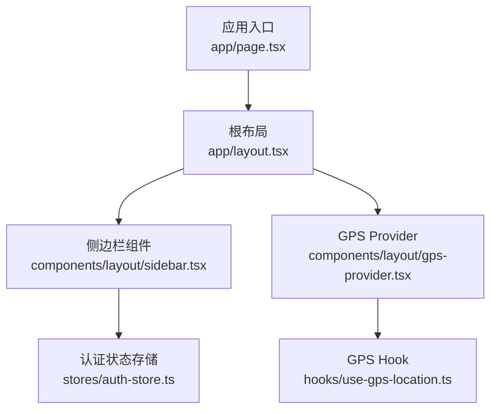
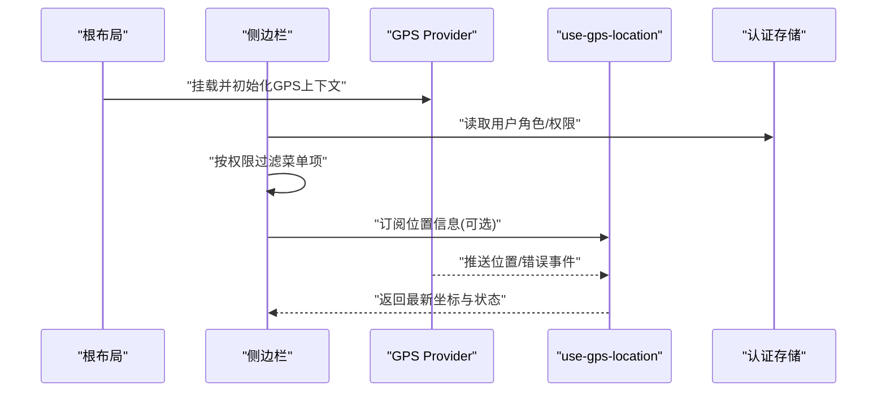
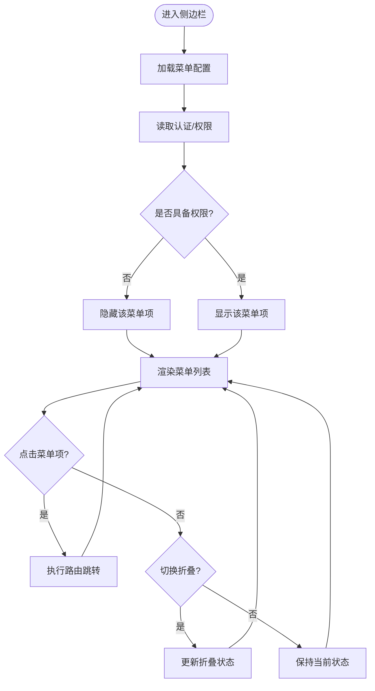
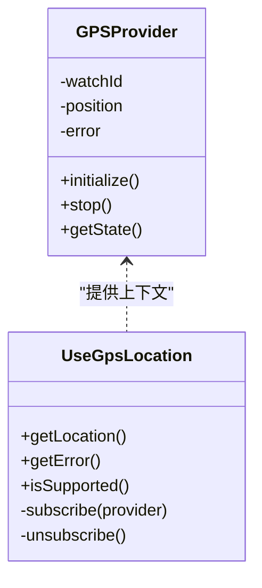
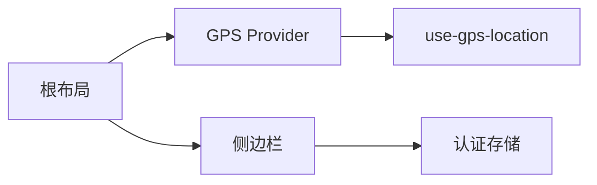

# 布局组件

<cite>
**本文引用的文件**   
- [layout.tsx](file://frontend_design/src/app/layout.tsx)
- [sidebar.tsx](file://frontend_design/src/components/layout/sidebar.tsx)
- [gps-provider.tsx](file://frontend_design/src/components/layout/gps-provider.tsx)
- [use-gps-location.ts](file://frontend_design/src/hooks/use-gps-location.ts)
- [auth-store.ts](file://frontend_design/src/stores/auth-store.ts)
- [page.tsx](file://frontend_design/src/app/page.tsx)
</cite>

## 目录
1. [简介](#简介)
2. [项目结构](#项目结构)
3. [核心组件](#核心组件)
4. [架构总览](#架构总览)
5. [详细组件分析](#详细组件分析)
6. [依赖关系分析](#依赖关系分析)
7. [性能考虑](#性能考虑)
8. [故障排查指南](#故障排查指南)
9. [结论](#结论)
10. [附录](#附录)

## 简介
本章节聚焦于NexusCockpit前端应用中的布局组件，重点围绕侧边栏（Sidebar）与GPS定位提供者（GPSProvider）的设计与实现。文档将解释：
- 布局组件的结构组织、导航逻辑、状态管理与响应式设计
- 侧边栏的菜单结构、折叠展开逻辑、权限控制与路由集成
- GPS定位服务的初始化、位置更新监听与错误处理
- 布局组件的定制方法、主题适配与多语言支持方案

## 项目结构
前端采用Next.js App Router组织页面与布局。根布局负责全局样式与基础框架，页面级布局通过组合侧边栏与内容区域形成整体界面。GPS能力以Provider形式注入，供子树消费。

图表来源
- [layout.tsx:1-200](file://frontend_design/src/app/layout.tsx#L1-L200)
- [sidebar.tsx:1-200](file://frontend_design/src/components/layout/sidebar.tsx#L1-L200)
- [gps-provider.tsx:1-200](file://frontend_design/src/components/layout/gps-provider.tsx#L1-L200)
- [use-gps-location.ts:1-200](file://frontend_design/src/hooks/use-gps-location.ts#L1-L200)
- [auth-store.ts:1-200](file://frontend_design/src/stores/auth-store.ts#L1-L200)
- [page.tsx:1-200](file://frontend_design/src/app/page.tsx#L1-L200)

章节来源
- [layout.tsx:1-200](file://frontend_design/src/app/layout.tsx#L1-L200)
- [page.tsx:1-200](file://frontend_design/src/app/page.tsx#L1-L200)

## 核心组件
- 根布局（layout.tsx）
  - 职责：提供全局HTML/Body骨架、字体与样式、挂载GPS Provider、承载侧边栏与主内容区
  - 关键点：在顶层包裹GPS Provider，确保子树可访问定位能力；根据屏幕尺寸切换侧边栏显示策略
- 侧边栏（sidebar.tsx）
  - 职责：渲染导航菜单、处理折叠/展开、按权限过滤菜单项、与路由联动高亮当前页
  - 关键点：基于认证状态与菜单配置进行权限控制；移动端默认收起，桌面端可固定或悬浮
- GPS Provider（gps-provider.tsx）
  - 职责：封装浏览器Geolocation API，维护当前位置与错误状态，向子树暴露统一接口
  - 关键点：惰性初始化、防抖更新、错误提示与降级策略
- GPS Hook（use-gps-location.ts）
  - 职责：为任意组件提供订阅式位置数据与错误信息
  - 关键点：自动清理watcher、避免内存泄漏、兼容不支持的定位环境

章节来源
- [layout.tsx:1-200](file://frontend_design/src/app/layout.tsx#L1-L200)
- [sidebar.tsx:1-200](file://frontend_design/src/components/layout/sidebar.tsx#L1-L200)
- [gps-provider.tsx:1-200](file://frontend_design/src/components/layout/gps-provider.tsx#L1-L200)
- [use-gps-location.ts:1-200](file://frontend_design/src/hooks/use-gps-location.ts#L1-L200)

## 架构总览
下图展示布局层与定位能力的交互关系：根布局挂载GPS Provider，侧边栏与业务页面均可通过Hook获取位置信息；侧边栏同时读取认证状态以决定可见菜单项。

图表来源
- [layout.tsx:1-200](file://frontend_design/src/app/layout.tsx#L1-L200)
- [sidebar.tsx:1-200](file://frontend_design/src/components/layout/sidebar.tsx#L1-L200)
- [gps-provider.tsx:1-200](file://frontend_design/src/components/layout/gps-provider.tsx#L1-L200)
- [use-gps-location.ts:1-200](file://frontend_design/src/hooks/use-gps-location.ts#L1-L200)
- [auth-store.ts:1-200](file://frontend_design/src/stores/auth-store.ts#L1-L200)

## 详细组件分析

### 侧边栏组件（Sidebar）
- 结构与职责
  - 菜单数据源：集中定义菜单项、图标、路径与权限标识
  - 折叠状态：受控于外部状态或本地持久化，支持移动端手势/按钮切换
  - 权限控制：结合认证存储，动态过滤不可见菜单
  - 路由集成：根据当前URL高亮选中项，点击后执行导航
- 关键流程
  - 初始化：加载菜单配置与用户权限，计算可见菜单集合
  - 交互：点击菜单项触发路由跳转；长按或按钮切换折叠
  - 响应式：小屏下隐藏面板并提供抽屉式展开；大屏下常驻显示
- 扩展点
  - 新增菜单：在菜单配置中追加条目并声明所需权限
  - 主题适配：通过CSS变量或Tailwind类名覆盖背景、文字与分隔线颜色
  - 国际化：使用i18n键值替换菜单文案，避免硬编码文本

图表来源
- [sidebar.tsx:1-200](file://frontend_design/src/components/layout/sidebar.tsx#L1-L200)
- [auth-store.ts:1-200](file://frontend_design/src/stores/auth-store.ts#L1-L200)

章节来源
- [sidebar.tsx:1-200](file://frontend_design/src/components/layout/sidebar.tsx#L1-L200)
- [auth-store.ts:1-200](file://frontend_design/src/stores/auth-store.ts#L1-L200)

### GPS定位提供者（GPSProvider）
- 设计与职责
  - 初始化：在Provider内部启动定位服务，仅在需要时请求权限
  - 状态管理：维护经纬度、精度、更新时间戳与错误码
  - 生命周期：组件卸载时停止监听，避免内存泄漏
  - 错误处理：捕获权限拒绝、超时、不可用等异常，向上抛出或回退到默认值
- 与Hook的关系
  - Provider暴露上下文，use-gps-location Hook订阅变化并返回最新数据
  - Hook内部做防抖与节流，减少频繁重渲染
- 降级策略
  - 在不支持Geolocation的环境返回空位置与错误提示
  - 允许上层组件传入默认坐标用于离线场景

图表来源
- [gps-provider.tsx:1-200](file://frontend_design/src/components/layout/gps-provider.tsx#L1-L200)
- [use-gps-location.ts:1-200](file://frontend_design/src/hooks/use-gps-location.ts#L1-L200)

章节来源
- [gps-provider.tsx:1-200](file://frontend_design/src/components/layout/gps-provider.tsx#L1-L200)
- [use-gps-location.ts:1-200](file://frontend_design/src/hooks/use-gps-location.ts#L1-L200)

### 根布局（Layout）
- 职责
  - 挂载GPS Provider，使全应用可用
  - 组织侧边栏与主内容区，处理响应式断点
  - 提供全局样式与主题变量入口
- 关键点
  - 在SSR环境下安全跳过定位初始化
  - 根据设备类型调整侧边栏行为（抽屉/常驻）

章节来源
- [layout.tsx:1-200](file://frontend_design/src/app/layout.tsx#L1-L200)

## 依赖关系分析
- 组件耦合
  - 根布局对GPS Provider强依赖，对侧边栏弱依赖（可通过插槽替换）
  - 侧边栏依赖认证存储与路由库，不直接依赖GPS
  - GPS Provider仅依赖浏览器API与React上下文
- 外部依赖
  - 浏览器Geolocation API
  - Next.js路由（App Router）
  - 状态管理（认证存储）

图表来源
- [layout.tsx:1-200](file://frontend_design/src/app/layout.tsx#L1-L200)
- [sidebar.tsx:1-200](file://frontend_design/src/components/layout/sidebar.tsx#L1-L200)
- [gps-provider.tsx:1-200](file://frontend_design/src/components/layout/gps-provider.tsx#L1-L200)
- [use-gps-location.ts:1-200](file://frontend_design/src/hooks/use-gps-location.ts#L1-L200)
- [auth-store.ts:1-200](file://frontend_design/src/stores/auth-store.ts#L1-L200)

章节来源
- [layout.tsx:1-200](file://frontend_design/src/app/layout.tsx#L1-L200)
- [sidebar.tsx:1-200](file://frontend_design/src/components/layout/sidebar.tsx#L1-L200)
- [gps-provider.tsx:1-200](file://frontend_design/src/components/layout/gps-provider.tsx#L1-L200)
- [use-gps-location.ts:1-200](file://frontend_design/src/hooks/use-gps-location.ts#L1-L200)
- [auth-store.ts:1-200](file://frontend_design/src/stores/auth-store.ts#L1-L200)

## 性能考虑
- 定位更新频率
  - 使用防抖/节流降低高频回调导致的重渲染
  - 按需开启高精度模式，普通场景使用低精度
- 内存管理
  - 组件卸载时及时清除watcher与事件监听
  - 避免在闭包中持有大对象引用
- 渲染优化
  - 将位置数据拆分到独立Context，减少无关组件重渲染
  - 使用memo化组件包裹静态菜单项
- 首屏体验
  - 延迟初始化GPS，优先渲染UI骨架
  - 在SSR阶段跳过定位相关逻辑

[本节为通用指导，无需代码来源]

## 故障排查指南
- 常见问题
  - 定位权限被拒绝：检查浏览器设置与HTTPS要求；提供降级坐标与提示
  - 定位不可用：检测navigator.geolocation是否存在；在非浏览器环境返回空值
  - 频繁重渲染：确认Hook内防抖与依赖数组是否正确
  - 内存泄漏：确认useEffect清理函数是否调用clearWatch
- 调试建议
  - 在Provider中打印错误码与时间戳
  - 在Hook中记录订阅次数与取消时机
  - 使用浏览器开发者工具监控地理定位事件

章节来源
- [gps-provider.tsx:1-200](file://frontend_design/src/components/layout/gps-provider.tsx#L1-L200)
- [use-gps-location.ts:1-200](file://frontend_design/src/hooks/use-gps-location.ts#L1-L200)

## 结论
布局组件通过清晰的层次划分与职责分离，实现了可扩展的导航与稳定的定位能力。侧边栏在权限控制与路由集成方面具备良好的扩展性，GPS Provider提供了健壮的定位服务与错误处理。遵循本文的定制与优化建议，可在不同主题与多语言环境下快速落地。

[本节为总结性内容，无需代码来源]

## 附录
- 定制侧边栏
  - 新增菜单项：在菜单配置中添加条目并声明权限标识
  - 自定义样式：通过CSS变量或Tailwind类覆盖主题色与间距
  - 国际化：使用i18n键值替换所有可见文案
- 定制GPS Provider
  - 默认坐标：在初始化参数中传入默认经纬度
  - 更新间隔：调整防抖时间与定位精度
  - 错误上报：接入日志系统收集错误码与堆栈
- 响应式断点
  - 小屏：侧边栏以抽屉形式呈现，默认收起
  - 大屏：侧边栏常驻显示，可手动折叠

[本节为概念性说明，无需代码来源]