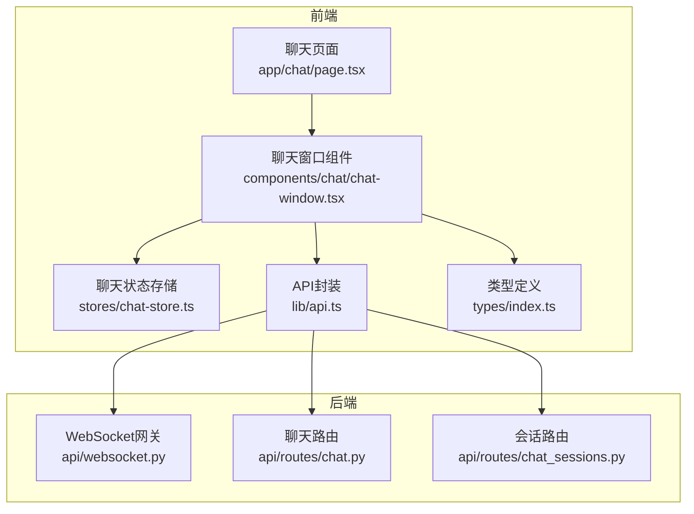
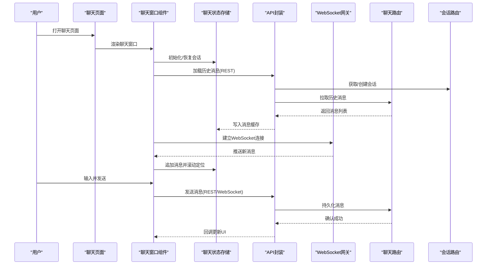
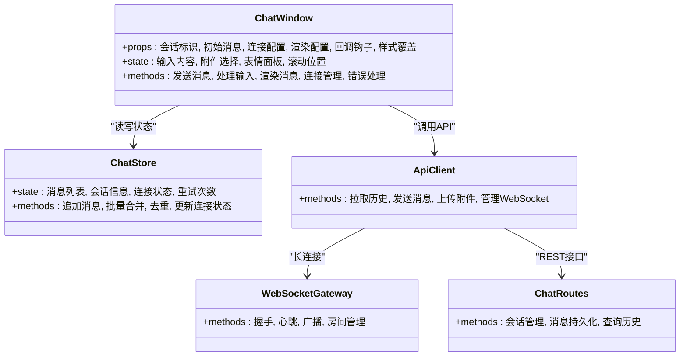
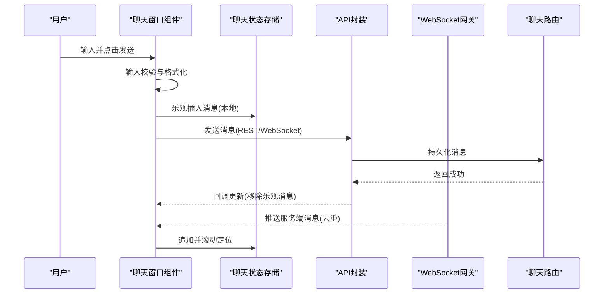
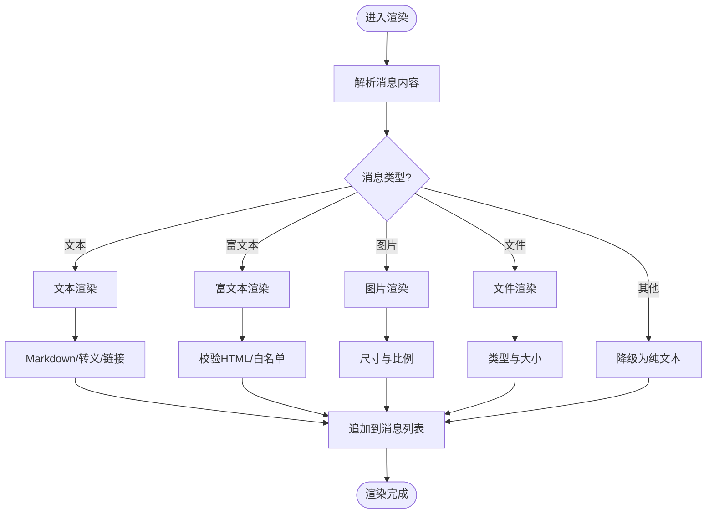
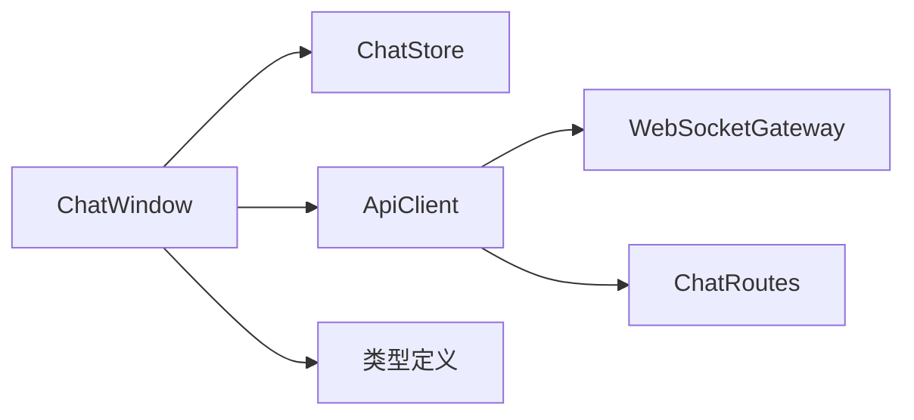

# 聊天组件

<cite>
**本文引用的文件**   
- [chat-window.tsx](file://frontend_design/src/components/chat/chat-window.tsx)
- [page.tsx](file://frontend_design/src/app/chat/page.tsx)
- [api.ts](file://frontend_design/src/lib/api.ts)
- [chat-store.ts](file://frontend_design/src/stores/chat-store.ts)
- [index.ts](file://frontend_design/src/types/index.ts)
- [websocket.ts](file://backend_design/nexus/api/websocket.py)
- [chat.py](file://backend_design/nexus/api/routes/chat.py)
- [chat_sessions.py](file://backend_design/nexus/api/routes/chat_sessions.py)
</cite>

## 目录
1. [简介](#简介)
2. [项目结构](#项目结构)
3. [核心组件](#核心组件)
4. [架构总览](#架构总览)
5. [详细组件分析](#详细组件分析)
6. [依赖关系分析](#依赖关系分析)
7. [性能考虑](#性能考虑)
8. [故障排查指南](#故障排查指南)
9. [结论](#结论)
10. [附录](#附录)

## 简介
本文件面向NexusCockpit前端的聊天窗口组件（ChatWindow），系统性阐述其设计与实现，包括消息显示、用户输入处理、实时通信集成、状态管理、WebSocket连接与错误处理机制。同时覆盖消息格式化、表情符号支持、文件上传等功能的实现细节，解释前端与后端API的交互方式、消息持久化与会话管理，并提供组件定制选项、样式覆盖方法与性能优化策略，帮助开发者快速理解并高效扩展该组件。

## 项目结构
聊天功能涉及前后端多个模块：
- 前端
  - 页面入口：位于应用路由下的聊天页面，负责挂载聊天窗口组件并传入必要配置。
  - 聊天窗口组件：实现消息渲染、输入框、发送逻辑、附件与表情、滚动与虚拟列表等。
  - 状态存储：集中管理会话、消息列表、连接状态等全局状态。
  - API封装：统一HTTP请求与WebSocket连接管理。
  - 类型定义：为消息、会话、事件等提供TS类型约束。
- 后端
  - WebSocket网关：维护长连接、广播与房间管理。
  - 聊天路由：提供历史消息加载、消息发送、会话管理等REST接口。
  - 会话路由：提供会话创建、切换、删除等操作。

图表来源
- [page.tsx:1-200](file://frontend_design/src/app/chat/page.tsx#L1-L200)
- [chat-window.tsx:1-400](file://frontend_design/src/components/chat/chat-window.tsx#L1-L400)
- [chat-store.ts:1-200](file://frontend_design/src/stores/chat-store.ts#L1-L200)
- [api.ts:1-200](file://frontend_design/src/lib/api.ts#L1-L200)
- [websocket.ts:1-200](file://backend_design/nexus/api/websocket.py#L1-L200)
- [chat.py:1-200](file://backend_design/nexus/api/routes/chat.py#L1-L200)
- [chat_sessions.py:1-200](file://backend_design/nexus/api/routes/chat_sessions.py#L1-L200)

章节来源
- [page.tsx:1-200](file://frontend_design/src/app/chat/page.tsx#L1-L200)
- [chat-window.tsx:1-400](file://frontend_design/src/components/chat/chat-window.tsx#L1-L400)
- [chat-store.ts:1-200](file://frontend_design/src/stores/chat-store.ts#L1-L200)
- [api.ts:1-200](file://frontend_design/src/lib/api.ts#L1-L200)
- [index.ts:1-200](file://frontend_design/src/types/index.ts#L1-L200)
- [websocket.ts:1-200](file://backend_design/nexus/api/websocket.py#L1-L200)
- [chat.py:1-200](file://backend_design/nexus/api/routes/chat.py#L1-L200)
- [chat_sessions.py:1-200](file://backend_design/nexus/api/routes/chat_sessions.py#L1-L200)

## 核心组件
- 聊天窗口组件（ChatWindow）
  - 职责：消息展示、输入处理、发送/接收、附件与表情、滚动定位、错误提示、主题与样式覆盖。
  - 关键能力：
    - 消息渲染：文本、代码块、图片、链接、富文本片段；支持Markdown或自定义渲染器。
    - 输入处理：键盘事件、粘贴、IME组合、防抖与节流、自动聚焦。
    - 实时通信：基于WebSocket的事件订阅与重连策略。
    - 状态管理：与聊天状态存储协作，保持消息列表、会话上下文、连接状态一致。
    - 错误处理：网络异常、服务端错误、断线重连、降级策略。
- 聊天状态存储（chat-store）
  - 职责：集中管理当前会话ID、消息队列、未读计数、连接状态、重试次数等。
  - 特点：响应式更新、批量合并消息、去重与幂等处理。
- API封装（api.ts）
  - 职责：封装HTTP调用与WebSocket生命周期管理，提供统一的错误码映射与重试策略。
- 类型定义（types/index.ts）
  - 职责：定义消息、会话、事件、附件、表情等数据结构，确保前后端契约一致。

章节来源
- [chat-window.tsx:1-400](file://frontend_design/src/components/chat/chat-window.tsx#L1-L400)
- [chat-store.ts:1-200](file://frontend_design/src/stores/chat-store.ts#L1-L200)
- [api.ts:1-200](file://frontend_design/src/lib/api.ts#L1-L200)
- [index.ts:1-200](file://frontend_design/src/types/index.ts#L1-L200)

## 架构总览
聊天系统采用“前端组件 + 状态存储 + API封装”与“后端WebSocket网关 + REST路由”的分层架构。前端通过API封装发起HTTP请求获取历史消息与元数据，并通过WebSocket进行实时消息收发；后端根据会话上下文路由到相应处理器，完成业务逻辑与持久化。

图表来源
- [page.tsx:1-200](file://frontend_design/src/app/chat/page.tsx#L1-L200)
- [chat-window.tsx:1-400](file://frontend_design/src/components/chat/chat-window.tsx#L1-L400)
- [chat-store.ts:1-200](file://frontend_design/src/stores/chat-store.ts#L1-L200)
- [api.ts:1-200](file://frontend_design/src/lib/api.ts#L1-L200)
- [websocket.ts:1-200](file://backend_design/nexus/api/websocket.py#L1-L200)
- [chat.py:1-200](file://backend_design/nexus/api/routes/chat.py#L1-L200)
- [chat_sessions.py:1-200](file://backend_design/nexus/api/routes/chat_sessions.py#L1-L200)

## 详细组件分析

### ChatWindow 组件设计
- Props接口
  - 会话标识：用于区分不同对话上下文。
  - 初始消息：可选的历史消息预填充。
  - 连接配置：WebSocket地址、心跳间隔、重连策略。
  - 渲染配置：是否启用Markdown、表情面板开关、附件限制。
  - 回调钩子：发送前校验、发送后回调、错误回调、滚动监听。
  - 样式覆盖：主题变量、类名注入、自定义消息气泡样式。
- 状态管理
  - 本地状态：输入内容、光标位置、附件选择、表情面板可见性、滚动位置。
  - 全局状态：消息列表、会话信息、连接状态、错误提示。
  - 同步策略：增量更新、批量合并、去重键（如消息ID或时间戳+序列号）。
- 消息显示
  - 文本渲染：支持基础Markdown语法、代码高亮、链接点击。
  - 富媒体：图片预览、视频播放、音频播放、文件下载。
  - 表情支持：内置表情库与自定义表情，支持快捷键插入。
  - 滚动与虚拟列表：长列表虚拟化，按需渲染，减少内存占用。
- 用户输入处理
  - 键盘事件：回车发送、Shift+换行、Tab补全、Ctrl+V粘贴。
  - 输入校验：长度限制、敏感词过滤、格式校验。
  - 防抖与节流：避免重复提交与频繁渲染。
- 实时通信集成
  - 连接管理：自动连接、心跳保活、断线检测、指数退避重连。
  - 事件订阅：新消息、系统通知、会话变更、错误事件。
  - 离线策略：本地缓存未发送消息，恢复后自动重发。
- 错误处理机制
  - 网络错误：超时、DNS解析失败、证书错误。
  - 服务端错误：业务错误码映射、友好提示、重试建议。
  - UI错误：渲染异常降级、占位图、回退到纯文本。
- 文件上传
  - 选择与预览：支持多文件、大小限制、类型白名单。
  - 分片与进度：大文件分片上传、进度条、断点续传。
  - 安全校验：MIME类型检查、病毒扫描（后端）、访问控制。
- 与后端API交互
  - HTTP接口：会话创建/切换、历史消息拉取、消息发送、附件上传。
  - WebSocket协议：消息帧格式、事件类型、握手流程、鉴权参数。
  - 幂等与一致性：消息ID生成、去重、顺序保证。
- 消息持久化与会话管理
  - 持久化：消息落库、索引构建、归档策略。
  - 会话：创建、切换、删除、清理过期会话。
  - 权限：租户隔离、角色控制、审计日志。
- 组件定制与样式覆盖
  - 主题变量：颜色、字体、间距、圆角、阴影。
  - 类名注入：覆盖默认样式、适配品牌风格。
  - 插槽与扩展点：自定义消息类型、工具栏按钮、侧边栏。
- 性能优化策略
  - 虚拟列表：仅渲染可视区域，降低DOM节点数量。
  - 增量更新：最小化重渲染范围，使用稳定key。
  - 资源懒加载：图片与媒体按需加载，预加载策略。
  - 压缩与缓存：Gzip、浏览器缓存、CDN加速。
  - 内存管理：及时释放事件监听、取消未完成的请求。

章节来源
- [chat-window.tsx:1-400](file://frontend_design/src/components/chat/chat-window.tsx#L1-L400)
- [chat-store.ts:1-200](file://frontend_design/src/stores/chat-store.ts#L1-L200)
- [api.ts:1-200](file://frontend_design/src/lib/api.ts#L1-L200)
- [index.ts:1-200](file://frontend_design/src/types/index.ts#L1-L200)
- [websocket.ts:1-200](file://backend_design/nexus/api/websocket.py#L1-L200)
- [chat.py:1-200](file://backend_design/nexus/api/routes/chat.py#L1-L200)
- [chat_sessions.py:1-200](file://backend_design/nexus/api/routes/chat_sessions.py#L1-L200)

### 组件类图（概念映射）

图表来源
- [chat-window.tsx:1-400](file://frontend_design/src/components/chat/chat-window.tsx#L1-L400)
- [chat-store.ts:1-200](file://frontend_design/src/stores/chat-store.ts#L1-L200)
- [api.ts:1-200](file://frontend_design/src/lib/api.ts#L1-L200)
- [websocket.ts:1-200](file://backend_design/nexus/api/websocket.py#L1-L200)
- [chat.py:1-200](file://backend_design/nexus/api/routes/chat.py#L1-L200)

### 发送消息时序（概念流程）

图表来源
- [chat-window.tsx:1-400](file://frontend_design/src/components/chat/chat-window.tsx#L1-L400)
- [chat-store.ts:1-200](file://frontend_design/src/stores/chat-store.ts#L1-L200)
- [api.ts:1-200](file://frontend_design/src/lib/api.ts#L1-L200)
- [websocket.ts:1-200](file://backend_design/nexus/api/websocket.py#L1-L200)
- [chat.py:1-200](file://backend_design/nexus/api/routes/chat.py#L1-L200)

### 复杂逻辑流程图（消息渲染与格式化）

图表来源
- [chat-window.tsx:1-400](file://frontend_design/src/components/chat/chat-window.tsx#L1-L400)
- [index.ts:1-200](file://frontend_design/src/types/index.ts#L1-L200)

## 依赖关系分析
- 组件耦合
  - ChatWindow与ChatStore强耦合，负责读写状态；与ApiClient松耦合，通过接口抽象屏蔽底层实现。
  - WebSocketGateway与ChatRoutes解耦，前者负责传输，后者负责业务。
- 外部依赖
  - 浏览器API：WebSocket、FileReader、Clipboard、LocalStorage。
  - 第三方库：Markdown渲染、表情库、虚拟列表、文件上传。
- 潜在循环依赖
  - 避免在状态存储中直接引用组件实例，防止循环引用导致内存泄漏。
- 接口契约
  - 类型定义作为前后端契约，确保字段一致与可扩展性。

图表来源
- [chat-window.tsx:1-400](file://frontend_design/src/components/chat/chat-window.tsx#L1-L400)
- [chat-store.ts:1-200](file://frontend_design/src/stores/chat-store.ts#L1-L200)
- [api.ts:1-200](file://frontend_design/src/lib/api.ts#L1-L200)
- [websocket.ts:1-200](file://backend_design/nexus/api/websocket.py#L1-L200)
- [chat.py:1-200](file://backend_design/nexus/api/routes/chat.py#L1-L200)
- [index.ts:1-200](file://frontend_design/src/types/index.ts#L1-L200)

## 性能考虑
- 渲染性能
  - 使用虚拟列表减少DOM节点，提升长列表滚动流畅度。
  - 稳定key与增量更新，避免不必要的重渲染。
- 网络性能
  - 合理设置心跳与重连间隔，避免风暴。
  - 批量拉取历史消息，分页加载，按需预取。
- 资源管理
  - 图片与媒体懒加载，CDN缓存，压缩传输。
  - 及时清理事件监听与定时器，防止内存泄漏。
- 用户体验
  - 乐观更新与即时反馈，错误时优雅降级。
  - 输入防抖与节流，减少无效请求。

[本节为通用指导，不直接分析具体文件]

## 故障排查指南
- 常见问题
  - 连接失败：检查WebSocket地址、防火墙、证书、鉴权参数。
  - 消息丢失：核对消息ID去重逻辑、服务端持久化、客户端缓存。
  - 渲染异常：检查Markdown解析、HTML白名单、图片路径。
  - 上传失败：验证文件大小、类型、分片策略、后端限流。
- 调试技巧
  - 开启详细日志，记录事件与错误堆栈。
  - 使用浏览器开发者工具监控网络与WebSocket帧。
  - 模拟弱网与断线，验证重连与降级策略。
- 恢复策略
  - 本地缓存未发送消息，恢复后自动重发。
  - 服务端幂等接口，避免重复处理。
  - 用户可手动重试与清空错误提示。

章节来源
- [chat-window.tsx:1-400](file://frontend_design/src/components/chat/chat-window.tsx#L1-L400)
- [api.ts:1-200](file://frontend_design/src/lib/api.ts#L1-L200)
- [websocket.ts:1-200](file://backend_design/nexus/api/websocket.py#L1-L200)

## 结论
ChatWindow组件通过清晰的分层与解耦设计，实现了稳定的消息展示、输入处理与实时通信能力。结合状态存储与API封装，组件具备良好的可扩展性与可维护性。通过虚拟列表、增量更新、资源懒加载等优化策略，可在大规模消息场景下保持良好性能。完善的错误处理与恢复机制提升了用户体验与系统健壮性。

[本节为总结，不直接分析具体文件]

## 附录
- 术语表
  - 会话：一次对话的上下文，包含消息、元数据与权限。
  - 乐观更新：先更新UI再等待服务端确认，提升响应速度。
  - 虚拟列表：仅渲染可视区域的列表项，降低内存占用。
- 参考实现路径
  - 聊天页面入口：[page.tsx](file://frontend_design/src/app/chat/page.tsx)
  - 聊天窗口组件：[chat-window.tsx](file://frontend_design/src/components/chat/chat-window.tsx)
  - 状态存储：[chat-store.ts](file://frontend_design/src/stores/chat-store.ts)
  - API封装：[api.ts](file://frontend_design/src/lib/api.ts)
  - 类型定义：[index.ts](file://frontend_design/src/types/index.ts)
  - WebSocket网关：[websocket.ts](file://backend_design/nexus/api/websocket.py)
  - 聊天路由：[chat.py](file://backend_design/nexus/api/routes/chat.py)
  - 会话路由：[chat_sessions.py](file://backend_design/nexus/api/routes/chat_sessions.py)