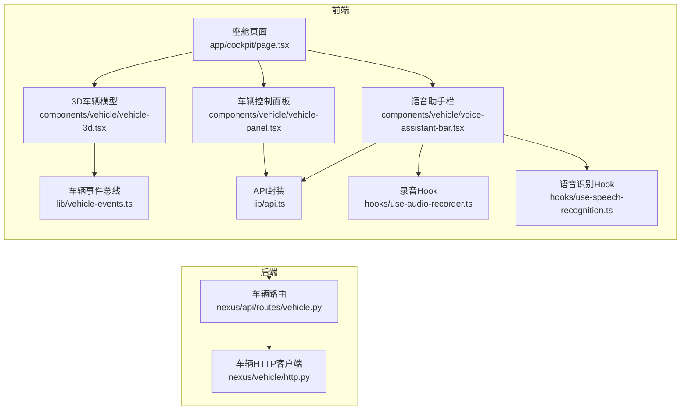
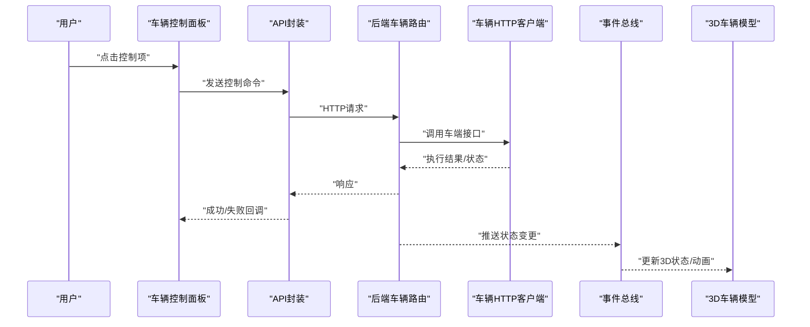
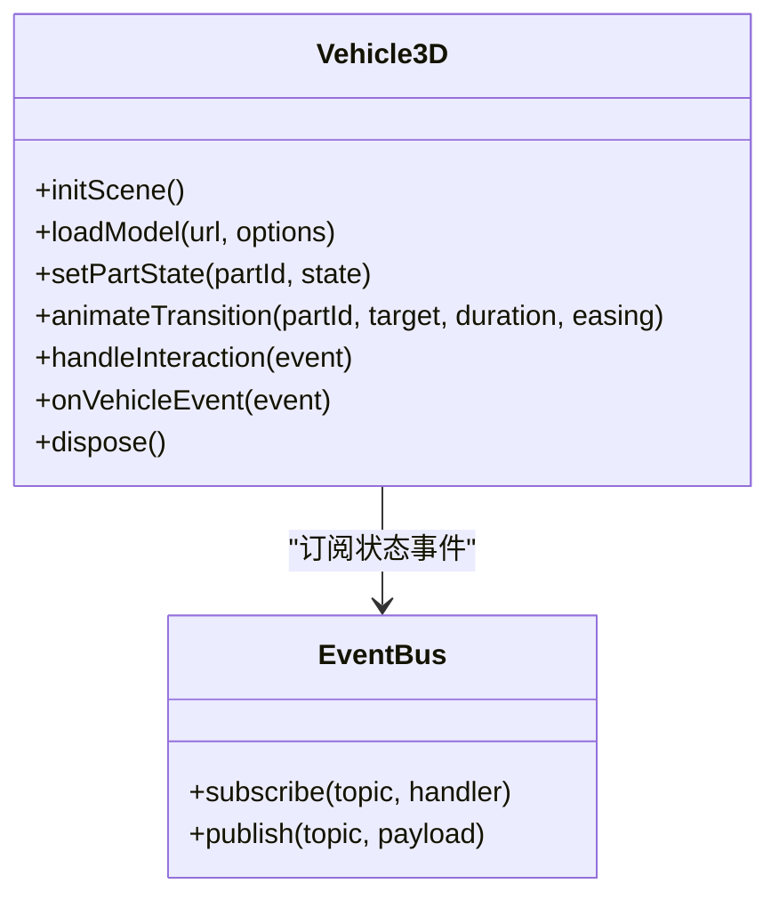
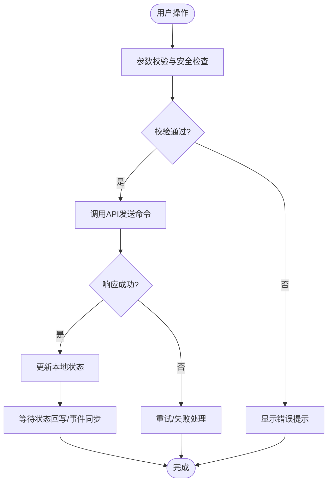
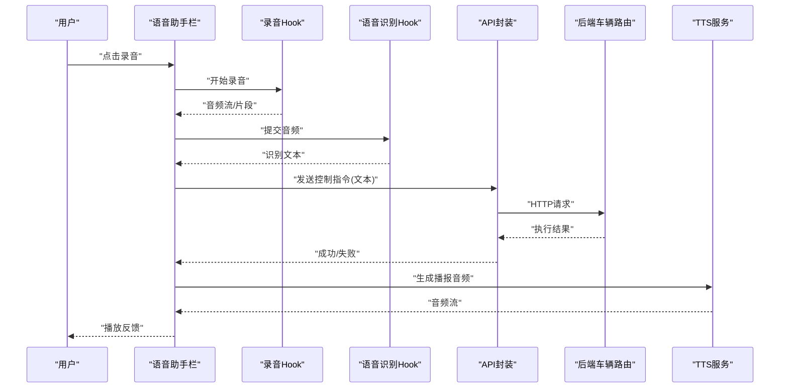
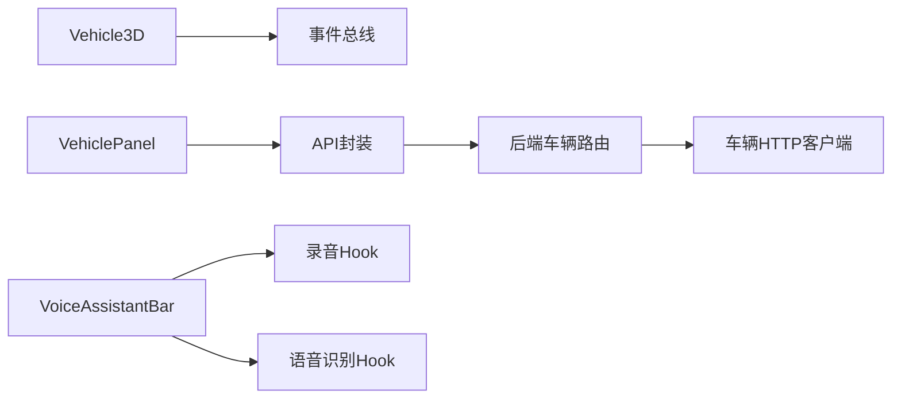

# 车辆控制组件

<cite>
**本文引用的文件**   
- [frontend_design/src/components/vehicle/vehicle-3d.tsx](file://frontend_design/src/components/vehicle/vehicle-3d.tsx)
- [frontend_design/src/components/vehicle/vehicle-panel.tsx](file://frontend_design/src/components/vehicle/vehicle-panel.tsx)
- [frontend_design/src/components/vehicle/voice-assistant-bar.tsx](file://frontend_design/src/components/vehicle/voice-assistant-bar.tsx)
- [frontend_design/src/lib/api.ts](file://frontend_design/src/lib/api.ts)
- [frontend_design/src/lib/vehicle-events.ts](file://frontend_design/src/lib/vehicle-events.ts)
- [frontend_design/src/hooks/use-audio-recorder.ts](file://frontend_design/src/hooks/use-audio-recorder.ts)
- [frontend_design/src/hooks/use-speech-recognition.ts](file://frontend_design/src/hooks/use-speech-recognition.ts)
- [frontend_design/src/app/cockpit/page.tsx](file://frontend_design/src/app/cockpit/page.tsx)
- [backend_design/nexus/api/routes/vehicle.py](file://backend_design/nexus/api/routes/vehicle.py)
- [backend_design/nexus/vehicle/http.py](file://backend_design/nexus/vehicle/http.py)
</cite>

## 目录
1. [简介](#简介)
2. [项目结构](#项目结构)
3. [核心组件](#核心组件)
4. [架构总览](#架构总览)
5. [详细组件分析](#详细组件分析)
6. [依赖关系分析](#依赖关系分析)
7. [性能考虑](#性能考虑)
8. [故障排查指南](#故障排查指南)
9. [结论](#结论)
10. [附录](#附录)

## 简介
本文件面向NexusCockpit前端的“车辆控制”能力，聚焦三个关键UI组件：
- 3D车辆模型组件（Vehicle3D）：负责在三维场景中加载、展示与交互车辆模型，并可视化车辆状态。
- 车辆控制面板（VehiclePanel）：提供车门、车窗、空调、座椅等常用控制的入口，封装命令发送与状态同步。
- 语音助手栏（VoiceAssistantBar）：集成录音、语音识别与TTS播报，支持通过自然语言下发车辆控制指令。

文档将深入说明各组件的功能特性、数据绑定机制、用户交互处理、状态同步策略、3D渲染配置、实时数据更新、错误处理、定制选项、动画效果与性能优化建议，并解释与后端车辆API的集成方式。

## 项目结构
前端采用Next.js应用，车辆控制相关代码位于frontend_design/src下：
- components/vehicle：三大核心组件
- lib：通用工具与API封装、事件总线
- hooks：音频录制、语音识别等自定义Hook
- app/cockpit：座舱页面，组合上述组件形成完整体验

图表来源
- [frontend_design/src/app/cockpit/page.tsx](file://frontend_design/src/app/cockpit/page.tsx)
- [frontend_design/src/components/vehicle/vehicle-3d.tsx](file://frontend_design/src/components/vehicle/vehicle-3d.tsx)
- [frontend_design/src/components/vehicle/vehicle-panel.tsx](file://frontend_design/src/components/vehicle/vehicle-panel.tsx)
- [frontend_design/src/components/vehicle/voice-assistant-bar.tsx](file://frontend_design/src/components/vehicle/voice-assistant-bar.tsx)
- [frontend_design/src/lib/api.ts](file://frontend_design/src/lib/api.ts)
- [frontend_design/src/lib/vehicle-events.ts](file://frontend_design/src/lib/vehicle-events.ts)
- [frontend_design/src/hooks/use-audio-recorder.ts](file://frontend_design/src/hooks/use-audio-recorder.ts)
- [frontend_design/src/hooks/use-speech-recognition.ts](file://frontend_design/src/hooks/use-speech-recognition.ts)
- [backend_design/nexus/api/routes/vehicle.py](file://backend_design/nexus/api/routes/vehicle.py)
- [backend_design/nexus/vehicle/http.py](file://backend_design/nexus/vehicle/http.py)

章节来源
- [frontend_design/src/app/cockpit/page.tsx](file://frontend_design/src/app/cockpit/page.tsx)
- [frontend_design/src/components/vehicle/vehicle-3d.tsx](file://frontend_design/src/components/vehicle/vehicle-3d.tsx)
- [frontend_design/src/components/vehicle/vehicle-panel.tsx](file://frontend_design/src/components/vehicle/vehicle-panel.tsx)
- [frontend_design/src/components/vehicle/voice-assistant-bar.tsx](file://frontend_design/src/components/vehicle/voice-assistant-bar.tsx)
- [frontend_design/src/lib/api.ts](file://frontend_design/src/lib/api.ts)
- [frontend_design/src/lib/vehicle-events.ts](file://frontend_design/src/lib/vehicle-events.ts)
- [frontend_design/src/hooks/use-audio-recorder.ts](file://frontend_design/src/hooks/use-audio-recorder.ts)
- [frontend_design/src/hooks/use-speech-recognition.ts](file://frontend_design/src/hooks/use-speech-recognition.ts)
- [backend_design/nexus/api/routes/vehicle.py](file://backend_design/nexus/api/routes/vehicle.py)
- [backend_design/nexus/vehicle/http.py](file://backend_design/nexus/vehicle/http.py)

## 核心组件
本节概述三大组件的职责与协作关系：
- Vehicle3D：基于WebGL/Three.js或同类库实现3D场景，加载车辆模型，响应视角切换、高亮部件、状态着色等交互；订阅车辆事件总线以驱动动画与状态可视化。
- VehiclePanel：以卡片/面板形式暴露常用控制项（如车门、车窗、空调、座椅），对每个控制项进行输入校验、防抖节流、并发限制，并通过API封装统一发送控制命令，同时监听状态回写以刷新UI。
- VoiceAssistantBar：整合录音、语音识别与TTS播放，将语音转文本后交由意图解析与技能执行链路，最终落盘为车辆控制命令；同时负责播报反馈与错误提示。

章节来源
- [frontend_design/src/components/vehicle/vehicle-3d.tsx](file://frontend_design/src/components/vehicle/vehicle-3d.tsx)
- [frontend_design/src/components/vehicle/vehicle-panel.tsx](file://frontend_design/src/components/vehicle/vehicle-panel.tsx)
- [frontend_design/src/components/vehicle/voice-assistant-bar.tsx](file://frontend_design/src/components/vehicle/voice-assistant-bar.tsx)

## 架构总览
从端到端视角，车辆控制的数据流如下：
- 用户操作（面板点击/语音输入/3D交互）触发前端命令发送
- 前端调用API封装，经后端路由转发至车辆HTTP客户端
- 后端与车端通信，返回执行结果与状态变更
- 前端通过事件总线与WebSocket（如有）接收实时状态，驱动UI与3D场景更新

图表来源
- [frontend_design/src/components/vehicle/vehicle-panel.tsx](file://frontend_design/src/components/vehicle/vehicle-panel.tsx)
- [frontend_design/src/lib/api.ts](file://frontend_design/src/lib/api.ts)
- [backend_design/nexus/api/routes/vehicle.py](file://backend_design/nexus/api/routes/vehicle.py)
- [backend_design/nexus/vehicle/http.py](file://backend_design/nexus/vehicle/http.py)
- [frontend_design/src/lib/vehicle-events.ts](file://frontend_design/src/lib/vehicle-events.ts)
- [frontend_design/src/components/vehicle/vehicle-3d.tsx](file://frontend_design/src/components/vehicle/vehicle-3d.tsx)

## 详细组件分析

### 3D车辆模型组件（Vehicle3D）
职责与特性
- 3D场景初始化与渲染管线配置（相机、光照、阴影、抗锯齿、分辨率适配）
- 车辆模型加载与材质管理（纹理、法线贴图、LOD）
- 部件级交互（点击选中、悬停高亮、拖拽旋转、缩放）
- 状态可视化（车门开合、车窗升降、灯光开关、空调出风方向、座椅位置）
- 动画系统（过渡插值、缓动曲线、循环动画）
- 事件订阅与状态同步（来自事件总线或WebSocket）

数据绑定机制
- 通过事件总线订阅车辆状态变更，映射到模型部件属性（可见性、位置、旋转、材质颜色）
- 使用局部状态缓存最近一次状态，避免频繁重绘
- 对高频状态（如转向角、车速）采用节流与增量更新策略

用户交互处理
- 射线检测命中判定，区分不同部件
- 手势与键盘快捷键支持（重置视角、聚焦部件）
- 交互态与业务态分离，确保可撤销与一致性

3D渲染配置要点
- 根据设备性能动态调整渲染质量（像素比、阴影贴图大小、后处理开关）
- 按需加载模型资源，预取下一帧所需纹理
- 使用实例化渲染批量绘制重复元素（如螺丝、装饰件）

错误处理
- 模型加载失败降级为线框或占位图
- 资源超时重试与断网提示
- 异常堆栈上报与本地日志

图表来源
- [frontend_design/src/components/vehicle/vehicle-3d.tsx](file://frontend_design/src/components/vehicle/vehicle-3d.tsx)
- [frontend_design/src/lib/vehicle-events.ts](file://frontend_design/src/lib/vehicle-events.ts)

章节来源
- [frontend_design/src/components/vehicle/vehicle-3d.tsx](file://frontend_design/src/components/vehicle/vehicle-3d.tsx)
- [frontend_design/src/lib/vehicle-events.ts](file://frontend_design/src/lib/vehicle-events.ts)

### 车辆控制面板（VehiclePanel）
职责与特性
- 聚合常用控制项（车门、车窗、空调、座椅、灯光等）
- 表单式输入与滑块/开关控件，支持范围校验与默认值
- 防抖/节流与并发限流，防止误触与风暴
- 统一命令发送与结果回写，保持UI与真实状态一致
- 错误提示与重试机制

数据绑定机制
- 每个控制项维护本地状态，提交时合并为命令对象
- 成功后更新本地状态，失败则回滚并提示
- 监听全局状态事件，覆盖本地状态以保持强一致

用户交互处理
- 按钮长按二次确认（高风险操作）
- 键盘可达性与无障碍标签
- 移动端触控优化（大按钮、滑动条）

控制命令发送流程

图表来源
- [frontend_design/src/components/vehicle/vehicle-panel.tsx](file://frontend_design/src/components/vehicle/vehicle-panel.tsx)
- [frontend_design/src/lib/api.ts](file://frontend_design/src/lib/api.ts)

章节来源
- [frontend_design/src/components/vehicle/vehicle-panel.tsx](file://frontend_design/src/components/vehicle/vehicle-panel.tsx)
- [frontend_design/src/lib/api.ts](file://frontend_design/src/lib/api.ts)

### 语音助手栏（VoiceAssistantBar）
职责与特性
- 录音采集（麦克风权限、降噪、音量指示）
- 语音识别（STT）与文本输出
- 意图解析与技能编排（由后端Agent/Skills处理）
- TTS播报反馈与错误提示
- 与VehiclePanel联动，将语音指令转换为具体控制动作

数据绑定机制
- 录音状态、识别进度、播放状态集中管理
- 识别结果与TTS文本双向绑定，便于调试与回放
- 与事件总线集成，将语音控制结果广播给其他组件

用户交互处理
- 一键开始/停止录音
- 播放中打断与暂停
- 网络异常与权限缺失的友好提示

语音控制序列

图表来源
- [frontend_design/src/components/vehicle/voice-assistant-bar.tsx](file://frontend_design/src/components/vehicle/voice-assistant-bar.tsx)
- [frontend_design/src/hooks/use-audio-recorder.ts](file://frontend_design/src/hooks/use-audio-recorder.ts)
- [frontend_design/src/hooks/use-speech-recognition.ts](file://frontend_design/src/hooks/use-speech-recognition.ts)
- [frontend_design/src/lib/api.ts](file://frontend_design/src/lib/api.ts)
- [backend_design/nexus/api/routes/vehicle.py](file://backend_design/nexus/api/routes/vehicle.py)

章节来源
- [frontend_design/src/components/vehicle/voice-assistant-bar.tsx](file://frontend_design/src/components/vehicle/voice-assistant-bar.tsx)
- [frontend_design/src/hooks/use-audio-recorder.ts](file://frontend_design/src/hooks/use-audio-recorder.ts)
- [frontend_design/src/hooks/use-speech-recognition.ts](file://frontend_design/src/hooks/use-speech-recognition.ts)
- [frontend_design/src/lib/api.ts](file://frontend_design/src/lib/api.ts)
- [backend_design/nexus/api/routes/vehicle.py](file://backend_design/nexus/api/routes/vehicle.py)

## 依赖关系分析
组件间依赖与外部集成点
- Vehicle3D依赖事件总线与可能的WebSocket通道，用于实时状态驱动
- VehiclePanel依赖API封装，统一处理请求/响应与错误
- VoiceAssistantBar依赖录音与识别Hook，以及TTS能力
- 后端通过车辆路由与HTTP客户端对接车端服务

图表来源
- [frontend_design/src/components/vehicle/vehicle-3d.tsx](file://frontend_design/src/components/vehicle/vehicle-3d.tsx)
- [frontend_design/src/components/vehicle/vehicle-panel.tsx](file://frontend_design/src/components/vehicle/vehicle-panel.tsx)
- [frontend_design/src/components/vehicle/voice-assistant-bar.tsx](file://frontend_design/src/components/vehicle/voice-assistant-bar.tsx)
- [frontend_design/src/lib/api.ts](file://frontend_design/src/lib/api.ts)
- [frontend_design/src/lib/vehicle-events.ts](file://frontend_design/src/lib/vehicle-events.ts)
- [frontend_design/src/hooks/use-audio-recorder.ts](file://frontend_design/src/hooks/use-audio-recorder.ts)
- [frontend_design/src/hooks/use-speech-recognition.ts](file://frontend_design/src/hooks/use-speech-recognition.ts)
- [backend_design/nexus/api/routes/vehicle.py](file://backend_design/nexus/api/routes/vehicle.py)
- [backend_design/nexus/vehicle/http.py](file://backend_design/nexus/vehicle/http.py)

章节来源
- [frontend_design/src/components/vehicle/vehicle-3d.tsx](file://frontend_design/src/components/vehicle/vehicle-3d.tsx)
- [frontend_design/src/components/vehicle/vehicle-panel.tsx](file://frontend_design/src/components/vehicle/vehicle-panel.tsx)
- [frontend_design/src/components/vehicle/voice-assistant-bar.tsx](file://frontend_design/src/components/vehicle/voice-assistant-bar.tsx)
- [frontend_design/src/lib/api.ts](file://frontend_design/src/lib/api.ts)
- [frontend_design/src/lib/vehicle-events.ts](file://frontend_design/src/lib/vehicle-events.ts)
- [frontend_design/src/hooks/use-audio-recorder.ts](file://frontend_design/src/hooks/use-audio-recorder.ts)
- [frontend_design/src/hooks/use-speech-recognition.ts](file://frontend_design/src/hooks/use-speech-recognition.ts)
- [backend_design/nexus/api/routes/vehicle.py](file://backend_design/nexus/api/routes/vehicle.py)
- [backend_design/nexus/vehicle/http.py](file://backend_design/nexus/vehicle/http.py)

## 性能考虑
- 3D渲染
  - 动态降低像素比与阴影质量以提升低端设备帧率
  - 使用纹理压缩与异步加载，减少首屏时间
  - 对高频状态采用增量更新与批处理，避免每帧全量重建
- 控制命令
  - 防抖/节流与并发限流，避免风暴与重复提交
  - 失败快速重试与指数退避，提升鲁棒性
- 语音链路
  - 分段上传与边录边识，降低延迟
  - 静音检测与自动结束，节省带宽与算力
- 内存与资源
  - 及时释放不再使用的模型与纹理
  - 组件卸载时清理事件监听与定时器

[本节为通用性能建议，不直接分析具体文件]

## 故障排查指南
常见问题与定位步骤
- 3D模型无法加载
  - 检查资源路径与跨域策略
  - 查看浏览器控制台与网络面板的错误码
  - 启用降级渲染模式验证基础场景
- 控制命令无响应
  - 确认API封装的请求头与鉴权信息
  - 检查后端路由日志与车辆HTTP客户端连接状态
  - 观察事件总线是否收到状态回写
- 语音识别失败
  - 确认麦克风权限与浏览器兼容性
  - 检查音频编码格式与采样率
  - 查看识别服务的返回码与重试次数
- 状态不同步
  - 对比本地状态与事件总线最新状态
  - 检查WebSocket连接与心跳
  - 增加状态快照日志辅助定位

章节来源
- [frontend_design/src/components/vehicle/vehicle-3d.tsx](file://frontend_design/src/components/vehicle/vehicle-3d.tsx)
- [frontend_design/src/components/vehicle/vehicle-panel.tsx](file://frontend_design/src/components/vehicle/vehicle-panel.tsx)
- [frontend_design/src/components/vehicle/voice-assistant-bar.tsx](file://frontend_design/src/components/vehicle/voice-assistant-bar.tsx)
- [frontend_design/src/lib/api.ts](file://frontend_design/src/lib/api.ts)
- [frontend_design/src/lib/vehicle-events.ts](file://frontend_design/src/lib/vehicle-events.ts)
- [backend_design/nexus/api/routes/vehicle.py](file://backend_design/nexus/api/routes/vehicle.py)
- [backend_design/nexus/vehicle/http.py](file://backend_design/nexus/vehicle/http.py)

## 结论
Vehicle3D、VehiclePanel与VoiceAssistantBar共同构成NexusCockpit的车辆控制前端核心。通过清晰的数据绑定、稳健的命令发送与状态同步机制，结合3D可视化与语音交互，实现了直观、高效且可靠的车辆控制体验。建议在后续迭代中持续优化渲染性能、增强错误恢复与可观测性，并完善无障碍与国际化支持。

[本节为总结性内容，不直接分析具体文件]

## 附录
- 定制选项建议
  - 3D主题与材质包替换
  - 控制面板布局与功能开关
  - 语音风格与播报文案模板
- 最佳实践
  - 统一错误码与提示规范
  - 关键操作二次确认与审计日志
  - 灰度发布与A/B测试能力

[本节为概念性内容，不直接分析具体文件]