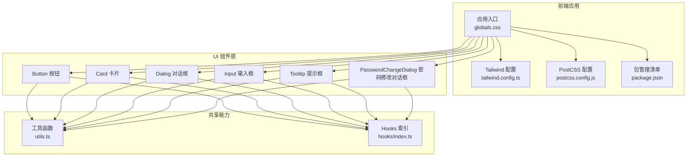
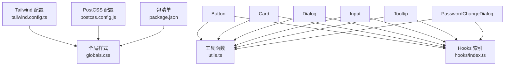
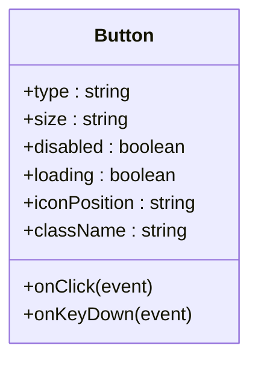
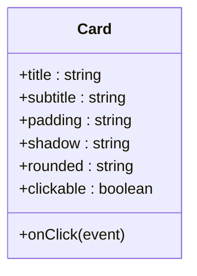
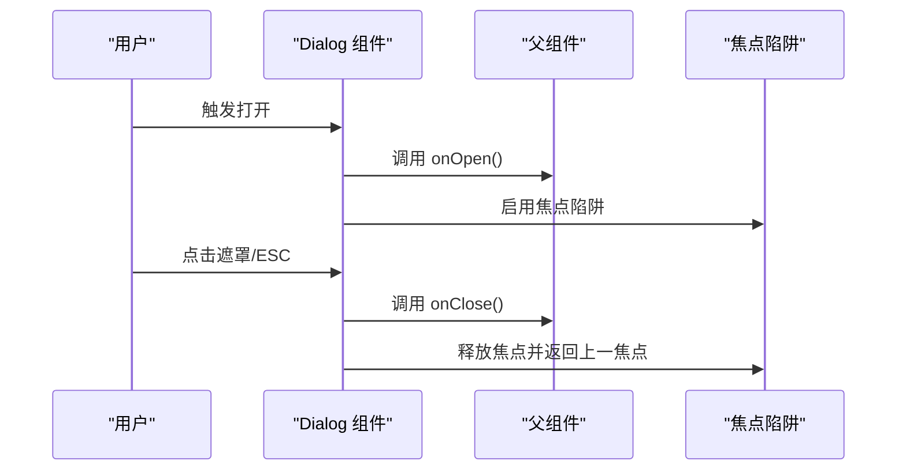
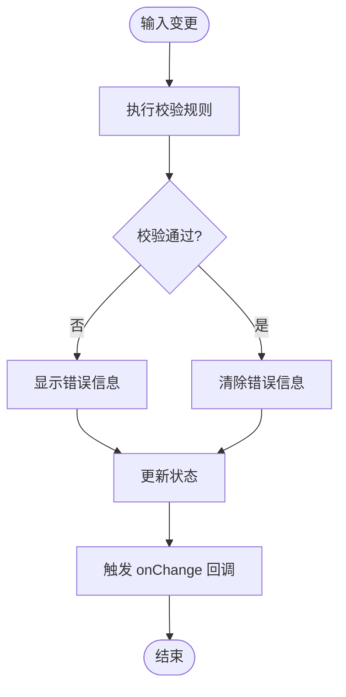
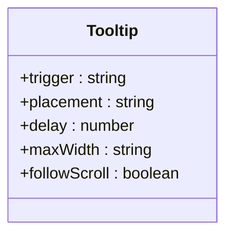
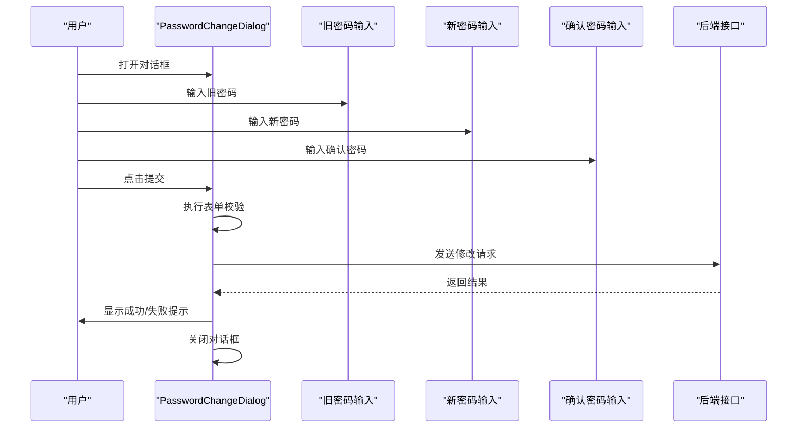
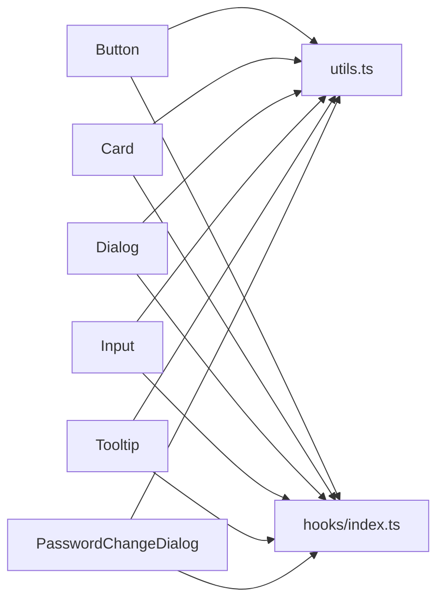

# UI组件库设计

<cite>
**本文引用的文件**   
- [frontend_design/src/components/ui/button.tsx](file://frontend_design/src/components/ui/button.tsx)
- [frontend_design/src/components/ui/card.tsx](file://frontend_design/src/components/ui/card.tsx)
- [frontend_design/src/components/ui/dialog.tsx](file://frontend_design/src/components/ui/dialog.tsx)
- [frontend_design/src/components/ui/input.tsx](file://frontend_design/src/components/ui/input.tsx)
- [frontend_design/src/components/ui/tooltip.tsx](file://frontend_design/src/components/ui/tooltip.tsx)
- [frontend_design/src/components/ui/password-change-dialog.tsx](file://frontend_design/src/components/ui/password-change-dialog.tsx)
- [frontend_design/tailwind.config.ts](file://frontend_design/tailwind.config.ts)
- [frontend_design/postcss.config.js](file://frontend_design/postcss.config.js)
- [frontend_design/package.json](file://frontend_design/package.json)
- [frontend_design/src/app/globals.css](file://frontend_design/src/app/globals.css)
- [frontend_design/src/lib/utils.ts](file://frontend_design/src/lib/utils.ts)
- [frontend_design/src/hooks/index.ts](file://frontend_design/src/hooks/index.ts)
</cite>

## 目录
1. [简介](#简介)
2. [项目结构](#项目结构)
3. [核心组件](#核心组件)
4. [架构总览](#架构总览)
5. [详细组件分析](#详细组件分析)
6. [依赖关系分析](#依赖关系分析)
7. [性能考量](#性能考量)
8. [故障排查指南](#故障排查指南)
9. [结论](#结论)
10. [附录](#附录)

## 简介
本文件为 NexusCockpit 前端应用的 UI 组件库文档，聚焦于基于 TailwindCSS 的组件设计体系与实现。内容覆盖基础组件（按钮、卡片、对话框、输入框、提示框等）的设计规范、属性接口、事件处理、样式定制选项、响应式设计与可访问性支持，并提供组合使用模式、最佳实践、测试策略与文档生成方案。读者无需深入前端工程细节即可理解并正确使用这些组件。

## 项目结构
NexusCockpit 的前端采用 Next.js + TypeScript + TailwindCSS 技术栈。UI 组件集中于 frontend_design/src/components/ui 目录，遵循“原子化”组织方式：每个基础组件独立文件，便于复用与维护。样式由 Tailwind 提供，并通过全局 CSS 与配置进行主题扩展。工具函数与通用 Hook 位于 lib 与 hooks 目录，供组件内部或业务页面组合使用。

图表来源
- [frontend_design/src/app/globals.css](file://frontend_design/src/app/globals.css)
- [frontend_design/tailwind.config.ts](file://frontend_design/tailwind.config.ts)
- [frontend_design/postcss.config.js](file://frontend_design/postcss.config.js)
- [frontend_design/package.json](file://frontend_design/package.json)
- [frontend_design/src/components/ui/button.tsx](file://frontend_design/src/components/ui/button.tsx)
- [frontend_design/src/components/ui/card.tsx](file://frontend_design/src/components/ui/card.tsx)
- [frontend_design/src/components/ui/dialog.tsx](file://frontend_design/src/components/ui/dialog.tsx)
- [frontend_design/src/components/ui/input.tsx](file://frontend_design/src/components/ui/input.tsx)
- [frontend_design/src/components/ui/tooltip.tsx](file://frontend_design/src/components/ui/tooltip.tsx)
- [frontend_design/src/components/ui/password-change-dialog.tsx](file://frontend_design/src/components/ui/password-change-dialog.tsx)
- [frontend_design/src/lib/utils.ts](file://frontend_design/src/lib/utils.ts)
- [frontend_design/src/hooks/index.ts](file://frontend_design/src/hooks/index.ts)

章节来源
- [frontend_design/src/app/globals.css](file://frontend_design/src/app/globals.css)
- [frontend_design/tailwind.config.ts](file://frontend_design/tailwind.config.ts)
- [frontend_design/postcss.config.js](file://frontend_design/postcss.config.js)
- [frontend_design/package.json](file://frontend_design/package.json)
- [frontend_design/src/components/ui/button.tsx](file://frontend_design/src/components/ui/button.tsx)
- [frontend_design/src/components/ui/card.tsx](file://frontend_design/src/components/ui/card.tsx)
- [frontend_design/src/components/ui/dialog.tsx](file://frontend_design/src/components/ui/dialog.tsx)
- [frontend_design/src/components/ui/input.tsx](file://frontend_design/src/components/ui/input.tsx)
- [frontend_design/src/components/ui/tooltip.tsx](file://frontend_design/src/components/ui/tooltip.tsx)
- [frontend_design/src/components/ui/password-change-dialog.tsx](file://frontend_design/src/components/ui/password-change-dialog.tsx)
- [frontend_design/src/lib/utils.ts](file://frontend_design/src/lib/utils.ts)
- [frontend_design/src/hooks/index.ts](file://frontend_design/src/hooks/index.ts)

## 核心组件
本节概述各基础组件的职责与设计要点，强调其属性接口、事件处理、样式定制、响应式与可访问性支持。

- 按钮 Button
  - 职责：触发操作的基础交互控件，支持多种视觉变体与尺寸。
  - 属性接口：类型、尺寸、是否禁用、加载状态、图标位置、对齐方式等。
  - 事件处理：点击回调、键盘回车/空格触发、焦点管理。
  - 样式定制：通过 Tailwind 类名覆盖主色、圆角、阴影、边框等。
  - 响应式：小屏紧凑布局，大屏更宽松间距。
  - 可访问性：语义标签、aria-* 属性、焦点可见性。

- 卡片 Card
  - 职责：承载一组相关内容的容器，常用于信息展示与操作入口。
  - 属性接口：标题、副标题、内边距、阴影、圆角、背景、是否可点击。
  - 事件处理：点击跳转、展开收起、拖拽占位（可选）。
  - 样式定制：通过 Tailwind 类名控制布局与装饰。
  - 响应式：网格自适应、堆叠布局。
  - 可访问性：区域语义、标题层级、图片 alt。

- 对话框 Dialog
  - 职责：模态窗口用于确认、表单输入或重要提示。
  - 属性接口：打开/关闭状态、标题、内容、底部操作区、遮罩、滚动行为。
  - 事件处理：打开/关闭回调、ESC 关闭、点击遮罩关闭、焦点陷阱。
  - 样式定制：尺寸、动画、定位、层级 z-index。
  - 响应式：移动端全屏/半屏适配。
  - 可访问性：role="dialog"、aria-modal、focus trap、返回上一个焦点。

- 输入框 Input
  - 职责：文本输入控件，支持单行/多行、校验反馈、前缀/后缀。
  - 属性接口：值、占位符、只读、禁用、错误信息、辅助说明、类型。
  - 事件处理：onChange、onBlur、onFocus、提交回调。
  - 样式定制：边框、颜色、字号、高度、图标。
  - 响应式：宽度自适应、移动端键盘优化。
  - 可访问性：label 关联、aria-invalid、aria-describedby。

- 提示框 Tooltip
  - 职责：轻量级上下文提示，鼠标悬停或聚焦时显示。
  - 属性接口：触发方式、位置、延迟、最大宽度、是否跟随滚动。
  - 事件处理：显示/隐藏时机、溢出检测。
  - 样式定制：背景、文字、箭头方向、圆角。
  - 响应式：小屏自动调整位置或改为长按触发。
  - 可访问性：aria-describedby、键盘导航、屏幕阅读器友好。

- 密码修改对话框 PasswordChangeDialog
  - 职责：封装密码修改流程，包含旧密码、新密码、确认密码及校验逻辑。
  - 属性接口：打开/关闭、提交回调、成功/失败提示。
  - 事件处理：表单验证、提交、取消、错误重置。
  - 样式定制：复用 Dialog/Input 样式，统一品牌风格。
  - 响应式：移动端表单布局优化。
  - 可访问性：表单字段关联、错误提示可读、焦点顺序合理。

章节来源
- [frontend_design/src/components/ui/button.tsx](file://frontend_design/src/components/ui/button.tsx)
- [frontend_design/src/components/ui/card.tsx](file://frontend_design/src/components/ui/card.tsx)
- [frontend_design/src/components/ui/dialog.tsx](file://frontend_design/src/components/ui/dialog.tsx)
- [frontend_design/src/components/ui/input.tsx](file://frontend_design/src/components/ui/input.tsx)
- [frontend_design/src/components/ui/tooltip.tsx](file://frontend_design/src/components/ui/tooltip.tsx)
- [frontend_design/src/components/ui/password-change-dialog.tsx](file://frontend_design/src/components/ui/password-change-dialog.tsx)

## 架构总览
UI 组件库以 TailwindCSS 为核心样式引擎，结合全局 CSS 与配置文件完成主题与插件扩展。组件之间保持低耦合，通过 props 传递数据与行为；复杂交互通过 Hooks 抽象，提升复用性与可测试性。

图表来源
- [frontend_design/tailwind.config.ts](file://frontend_design/tailwind.config.ts)
- [frontend_design/postcss.config.js](file://frontend_design/postcss.config.js)
- [frontend_design/package.json](file://frontend_design/package.json)
- [frontend_design/src/app/globals.css](file://frontend_design/src/app/globals.css)
- [frontend_design/src/components/ui/button.tsx](file://frontend_design/src/components/ui/button.tsx)
- [frontend_design/src/components/ui/card.tsx](file://frontend_design/src/components/ui/card.tsx)
- [frontend_design/src/components/ui/dialog.tsx](file://frontend_design/src/components/ui/dialog.tsx)
- [frontend_design/src/components/ui/input.tsx](file://frontend_design/src/components/ui/input.tsx)
- [frontend_design/src/components/ui/tooltip.tsx](file://frontend_design/src/components/ui/tooltip.tsx)
- [frontend_design/src/components/ui/password-change-dialog.tsx](file://frontend_design/src/components/ui/password-change-dialog.tsx)
- [frontend_design/src/lib/utils.ts](file://frontend_design/src/lib/utils.ts)
- [frontend_design/src/hooks/index.ts](file://frontend_design/src/hooks/index.ts)

## 详细组件分析

### 按钮 Button
- 设计要点
  - 提供多种视觉变体（主按钮、次按钮、危险按钮等），通过类型属性切换。
  - 支持尺寸控制（默认、小、大），适配不同场景密度。
  - 支持禁用与加载状态，避免重复提交与误操作。
- 属性接口（示例）
  - type: 按钮类型（primary/secondary/danger/...）
  - size: 尺寸（sm/md/lg）
  - disabled: 是否禁用
  - loading: 是否加载中
  - iconPosition: 图标位置（left/right）
  - className: 自定义样式类名
- 事件处理
  - onClick: 点击回调
  - onKeyDown: 键盘触发（回车/空格）
- 样式定制
  - 通过 Tailwind 类名覆盖颜色、圆角、阴影、边框等。
  - 支持 hover/focus/disabled 状态样式。
- 响应式
  - 小屏下减小内边距与字号，保证触控友好。
- 可访问性
  - 使用 button 语义标签，设置 aria-disabled、aria-busy 等。
  - 确保焦点可见性与键盘可达。

图表来源
- [frontend_design/src/components/ui/button.tsx](file://frontend_design/src/components/ui/button.tsx)

章节来源
- [frontend_design/src/components/ui/button.tsx](file://frontend_design/src/components/ui/button.tsx)

### 卡片 Card
- 设计要点
  - 作为内容容器，提供统一的圆角、阴影、背景与内边距。
  - 支持标题、副标题、操作区插槽，便于组合。
- 属性接口（示例）
  - title: 标题文本
  - subtitle: 副标题文本
  - padding: 内边距
  - shadow: 阴影强度
  - rounded: 圆角大小
  - clickable: 是否可点击
  - onClick: 点击回调
- 样式定制
  - 通过 Tailwind 类名控制布局与装饰。
- 响应式
  - 在网格中自适应列数，移动端堆叠显示。
- 可访问性
  - 使用 article/section 语义，标题层级正确，图片提供 alt。

图表来源
- [frontend_design/src/components/ui/card.tsx](file://frontend_design/src/components/ui/card.tsx)

章节来源
- [frontend_design/src/components/ui/card.tsx](file://frontend_design/src/components/ui/card.tsx)

### 对话框 Dialog
- 设计要点
  - 模态窗口，用于重要交互与表单输入。
  - 支持打开/关闭状态控制、遮罩、滚动锁定。
- 属性接口（示例）
  - open: 是否打开
  - onClose: 关闭回调
  - title: 标题
  - content: 内容节点
  - footer: 底部操作区
  - maskClosable: 点击遮罩是否关闭
  - escClosable: ESC 是否关闭
- 事件处理
  - 打开/关闭回调、焦点陷阱、返回上一个焦点。
- 样式定制
  - 尺寸、动画、定位、层级 z-index。
- 响应式
  - 移动端全屏/半屏适配，滚动区域正确处理。
- 可访问性
  - role="dialog"、aria-modal、aria-labelledby、aria-describedby。

图表来源
- [frontend_design/src/components/ui/dialog.tsx](file://frontend_design/src/components/ui/dialog.tsx)

章节来源
- [frontend_design/src/components/ui/dialog.tsx](file://frontend_design/src/components/ui/dialog.tsx)

### 输入框 Input
- 设计要点
  - 文本输入控件，支持多种类型与校验反馈。
  - 支持前缀/后缀图标、占位符、只读/禁用状态。
- 属性接口（示例）
  - value: 当前值
  - placeholder: 占位符
  - readOnly: 是否只读
  - disabled: 是否禁用
  - error: 错误信息
  - helperText: 辅助说明
  - type: 输入类型
  - onChange: 值变化回调
  - onBlur/onFocus: 失焦/聚焦回调
- 事件处理
  - 实时校验、提交回调、错误提示展示。
- 样式定制
  - 边框、颜色、字号、高度、图标。
- 响应式
  - 宽度自适应，移动端键盘优化。
- 可访问性
  - label 关联、aria-invalid、aria-describedby。

图表来源
- [frontend_design/src/components/ui/input.tsx](file://frontend_design/src/components/ui/input.tsx)

章节来源
- [frontend_design/src/components/ui/input.tsx](file://frontend_design/src/components/ui/input.tsx)

### 提示框 Tooltip
- 设计要点
  - 轻量级上下文提示，鼠标悬停或聚焦时显示。
  - 支持位置、延迟、最大宽度、跟随滚动。
- 属性接口（示例）
  - trigger: 触发方式（hover/focus）
  - placement: 位置（top/bottom/left/right）
  - delay: 显示/隐藏延迟
  - maxWidth: 最大宽度
  - followScroll: 是否跟随滚动
- 事件处理
  - 显示/隐藏时机、溢出检测与位置修正。
- 样式定制
  - 背景、文字、箭头方向、圆角。
- 响应式
  - 小屏自动调整位置或改为长按触发。
- 可访问性
  - aria-describedby、键盘导航、屏幕阅读器友好。

图表来源
- [frontend_design/src/components/ui/tooltip.tsx](file://frontend_design/src/components/ui/tooltip.tsx)

章节来源
- [frontend_design/src/components/ui/tooltip.tsx](file://frontend_design/src/components/ui/tooltip.tsx)

### 密码修改对话框 PasswordChangeDialog
- 设计要点
  - 封装密码修改流程，包含旧密码、新密码、确认密码及校验逻辑。
  - 复用 Dialog 与 Input 组件，统一交互与样式。
- 属性接口（示例）
  - open: 是否打开
  - onClose: 关闭回调
  - onSubmit: 提交回调
  - onSuccess: 成功回调
  - onError: 错误回调
- 事件处理
  - 表单验证、提交、取消、错误重置。
- 样式定制
  - 复用 Dialog/Input 样式，统一品牌风格。
- 响应式
  - 移动端表单布局优化。
- 可访问性
  - 表单字段关联、错误提示可读、焦点顺序合理。

图表来源
- [frontend_design/src/components/ui/password-change-dialog.tsx](file://frontend_design/src/components/ui/password-change-dialog.tsx)
- [frontend_design/src/components/ui/dialog.tsx](file://frontend_design/src/components/ui/dialog.tsx)
- [frontend_design/src/components/ui/input.tsx](file://frontend_design/src/components/ui/input.tsx)

章节来源
- [frontend_design/src/components/ui/password-change-dialog.tsx](file://frontend_design/src/components/ui/password-change-dialog.tsx)

## 依赖关系分析
- 组件与工具函数
  - 所有 UI 组件均可能依赖 utils.ts 中的工具函数（如类名合并、格式化等）。
- 组件与 Hooks
  - 复杂交互（如焦点管理、异步加载、音频录制等）通过 hooks/index.ts 暴露的 Hook 抽象，降低组件复杂度。
- 样式与构建
  - tailwind.config.ts 定义主题与插件；postcss.config.js 负责编译；package.json 声明依赖与脚本。

图表来源
- [frontend_design/src/components/ui/button.tsx](file://frontend_design/src/components/ui/button.tsx)
- [frontend_design/src/components/ui/card.tsx](file://frontend_design/src/components/ui/card.tsx)
- [frontend_design/src/components/ui/dialog.tsx](file://frontend_design/src/components/ui/dialog.tsx)
- [frontend_design/src/components/ui/input.tsx](file://frontend_design/src/components/ui/input.tsx)
- [frontend_design/src/components/ui/tooltip.tsx](file://frontend_design/src/components/ui/tooltip.tsx)
- [frontend_design/src/components/ui/password-change-dialog.tsx](file://frontend_design/src/components/ui/password-change-dialog.tsx)
- [frontend_design/src/lib/utils.ts](file://frontend_design/src/lib/utils.ts)
- [frontend_design/src/hooks/index.ts](file://frontend_design/src/hooks/index.ts)

章节来源
- [frontend_design/src/lib/utils.ts](file://frontend_design/src/lib/utils.ts)
- [frontend_design/src/hooks/index.ts](file://frontend_design/src/hooks/index.ts)

## 性能考量
- 渲染优化
  - 合理使用 React.memo 包裹纯展示组件，减少重渲染。
  - 对大型列表或复杂内容使用虚拟滚动（按需引入）。
- 样式优化
  - 利用 Tailwind 的原子类减少自定义 CSS，避免样式冲突。
  - 按需引入插件与主题，减小打包体积。
- 交互优化
  - 对话框与提示框使用懒加载与防抖/节流，避免频繁计算。
  - 输入框的实时校验采用防抖，降低性能开销。
- 资源优化
  - 图标与图片使用 SVG 或 WebP，按需加载。
  - 静态资源缓存与 CDN 加速。

## 故障排查指南
- 常见问题
  - 样式未生效：检查 Tailwind 配置与 PostCSS 是否正确集成；确认全局样式是否被覆盖。
  - 对话框无法关闭：检查 open 状态与 onClose 回调绑定；确认焦点陷阱是否正确释放。
  - 输入框校验不触发：检查 onChange 与 onBlur 事件绑定；确认校验逻辑返回值。
  - 提示框位置异常：检查容器滚动与溢出情况；必要时启用跟随滚动与位置修正。
- 调试建议
  - 使用浏览器开发者工具检查 DOM 结构与样式优先级。
  - 打印关键 props 与状态，定位数据流问题。
  - 针对可访问性问题，使用屏幕阅读器与键盘导航验证。

章节来源
- [frontend_design/tailwind.config.ts](file://frontend_design/tailwind.config.ts)
- [frontend_design/postcss.config.js](file://frontend_design/postcss.config.js)
- [frontend_design/src/components/ui/dialog.tsx](file://frontend_design/src/components/ui/dialog.tsx)
- [frontend_design/src/components/ui/input.tsx](file://frontend_design/src/components/ui/input.tsx)
- [frontend_design/src/components/ui/tooltip.tsx](file://frontend_design/src/components/ui/tooltip.tsx)

## 结论
本 UI 组件库以 TailwindCSS 为基础，构建了可复用、可扩展、可访问的基础组件集合。通过清晰的属性接口、事件处理与样式定制选项，组件能够灵活适配不同业务场景。配合响应式设计与可访问性支持，确保了良好的用户体验。建议在项目中优先使用这些组件，并结合测试策略与文档生成方案，持续提升质量与效率。

## 附录

### 组件使用示例与场景
- 按钮
  - 场景：主操作、次要操作、危险操作。
  - 示例路径：[button.tsx](file://frontend_design/src/components/ui/button.tsx)
- 卡片
  - 场景：仪表盘信息块、功能入口卡片。
  - 示例路径：[card.tsx](file://frontend_design/src/components/ui/card.tsx)
- 对话框
  - 场景：确认删除、表单录入、重要提示。
  - 示例路径：[dialog.tsx](file://frontend_design/src/components/ui/dialog.tsx)
- 输入框
  - 场景：搜索、表单字段、过滤条件。
  - 示例路径：[input.tsx](file://frontend_design/src/components/ui/input.tsx)
- 提示框
  - 场景：帮助提示、字段说明、操作引导。
  - 示例路径：[tooltip.tsx](file://frontend_design/src/components/ui/tooltip.tsx)
- 密码修改对话框
  - 场景：账户安全设置、密码重置流程。
  - 示例路径：[password-change-dialog.tsx](file://frontend_design/src/components/ui/password-change-dialog.tsx)

### 测试策略
- 单元测试
  - 使用 Jest + React Testing Library 对组件进行断言。
  - 覆盖 props 变化、事件触发、状态更新。
- 交互测试
  - 模拟用户操作（点击、输入、键盘），验证 UI 行为。
- 可访问性测试
  - 使用 axe-core 或类似工具扫描 a11y 问题。
- 快照测试
  - 对稳定 UI 结构进行快照比对，防止意外回归。

### 文档生成方案
- 自动生成
  - 使用 Storybook 或类似的组件文档工具，自动生成组件示例与 API 文档。
- 手动维护
  - 在 README 或 docs 目录下维护使用说明与最佳实践。
- 版本管理
  - 将组件文档纳入版本发布流程，确保文档与代码同步。