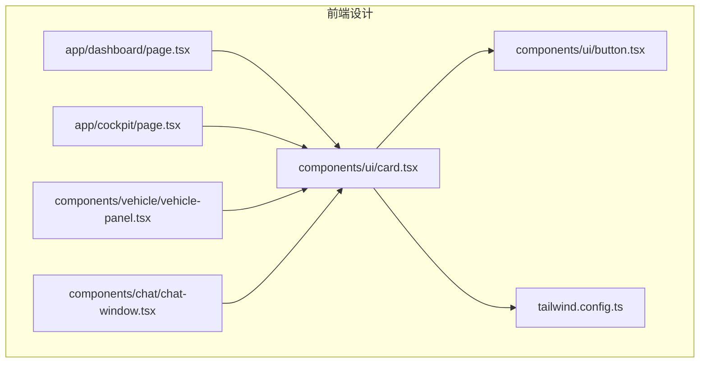
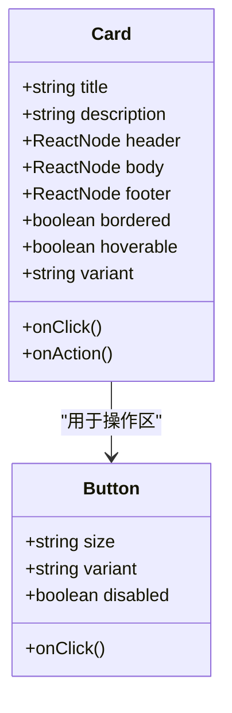
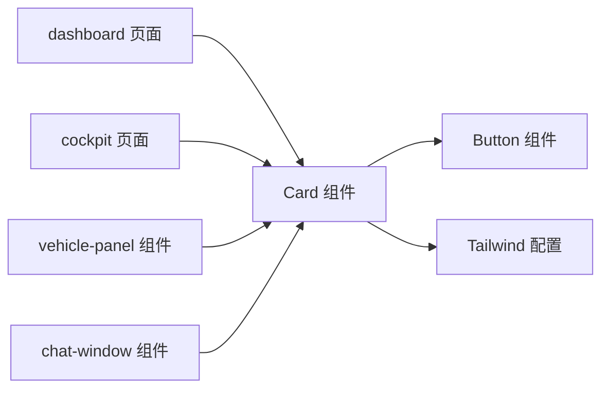
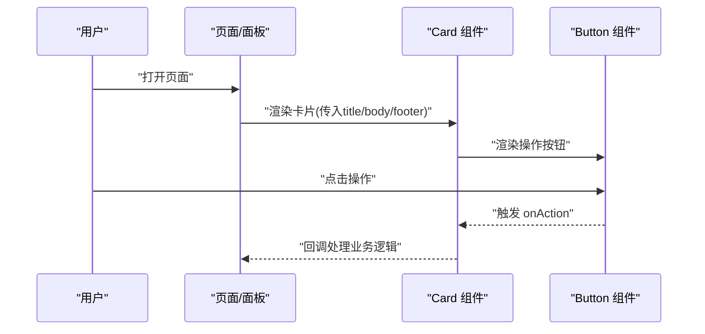

# 卡片组件(Card)

<cite>
**本文引用的文件**   
- [card.tsx](file://frontend_design/src/components/ui/card.tsx)
- [button.tsx](file://frontend_design/src/components/ui/button.tsx)
- [dashboard/page.tsx](file://frontend_design/src/app/dashboard/page.tsx)
- [cockpit/page.tsx](file://frontend_design/src/app/cockpit/page.tsx)
- [vehicle-panel.tsx](file://frontend_design/src/components/vehicle/vehicle-panel.tsx)
- [chat-window.tsx](file://frontend_design/src/components/chat/chat-window.tsx)
- [tailwind.config.ts](file://frontend_design/tailwind.config.ts)
</cite>

## 目录
1. [简介](#简介)
2. [项目结构](#项目结构)
3. [核心组件](#核心组件)
4. [架构总览](#架构总览)
5. [详细组件分析](#详细组件分析)
6. [依赖分析](#依赖分析)
7. [性能考虑](#性能考虑)
8. [故障排查指南](#故障排查指南)
9. [结论](#结论)
10. [附录](#附录)

## 简介
本文件为 NexusCockpit 前端应用中的卡片组件（Card）提供系统化文档。内容涵盖布局结构、内容组织与视觉设计；属性接口定义（标题、描述、操作区、内容区）；变体类型（信息卡片、操作卡片、统计卡片等）；嵌套组合模式（图片、图标、按钮等）；响应式适配策略；常见使用场景示例路径；交互效果与动画过渡说明。

## 项目结构
NexusCockpit 的前端基于 Next.js + React + Tailwind CSS 构建，UI 基础组件位于 components/ui 目录，页面级示例分布在 app 目录下，业务面板在 components/vehicle 中也有卡片化布局实践。

图表来源
- [dashboard/page.tsx](file://frontend_design/src/app/dashboard/page.tsx)
- [cockpit/page.tsx](file://frontend_design/src/app/cockpit/page.tsx)
- [card.tsx](file://frontend_design/src/components/ui/card.tsx)
- [button.tsx](file://frontend_design/src/components/ui/button.tsx)
- [vehicle-panel.tsx](file://frontend_design/src/components/vehicle/vehicle-panel.tsx)
- [chat-window.tsx](file://frontend_design/src/components/chat/chat-window.tsx)
- [tailwind.config.ts](file://frontend_design/tailwind.config.ts)

章节来源
- [card.tsx](file://frontend_design/src/components/ui/card.tsx)
- [dashboard/page.tsx](file://frontend_design/src/app/dashboard/page.tsx)
- [cockpit/page.tsx](file://frontend_design/src/app/cockpit/page.tsx)
- [vehicle-panel.tsx](file://frontend_design/src/components/vehicle/vehicle-panel.tsx)
- [chat-window.tsx](file://frontend_design/src/components/chat/chat-window.tsx)
- [tailwind.config.ts](file://frontend_design/tailwind.config.ts)

## 核心组件
- Card 组件：提供统一的容器样式与语义化结构，支持头部（标题/副标题）、主体（文本/数据/媒体）、底部（操作区）三段式布局。
- Button 组件：作为卡片操作区的标准交互元素，支持多种尺寸与状态。
- Tailwind 配置：通过主题色板、圆角、阴影、间距等原子类驱动卡片外观与变体。

章节来源
- [card.tsx](file://frontend_design/src/components/ui/card.tsx)
- [button.tsx](file://frontend_design/src/components/ui/button.tsx)
- [tailwind.config.ts](file://frontend_design/tailwind.config.ts)

## 架构总览
卡片组件采用“容器+区域”的模块化设计，结合 Tailwind 原子类实现高内聚、低耦合的样式体系。页面与业务面板通过 props 注入不同内容，形成多变的卡片形态。

图表来源
- [card.tsx](file://frontend_design/src/components/ui/card.tsx)
- [button.tsx](file://frontend_design/src/components/ui/button.tsx)

## 详细组件分析

### 组件结构与属性接口
- 布局结构
  - 头部区域：标题、副标题、辅助图标或标签
  - 主体区域：富文本、数据指标、媒体（图片/视频/图表）
  - 底部区域：操作按钮组、链接、状态指示
- 属性接口（建议）
  - title: string | ReactNode
  - description: string | ReactNode
  - header: ReactNode
  - body: ReactNode
  - footer: ReactNode
  - bordered: boolean
  - hoverable: boolean
  - variant: "default" | "info" | "action" | "stat" | "product" | "user"
  - onClick: () => void
  - onAction: (actionKey?: string) => void
- 样式约定
  - 圆角、阴影、边框、背景色由 variant 控制
  - 悬停态、聚焦态、禁用态统一通过 Tailwind 类管理

章节来源
- [card.tsx](file://frontend_design/src/components/ui/card.tsx)

### 变体类型与样式配置
- 信息卡片（info）
  - 用途：提示、公告、帮助说明
  - 特征：强调标题与描述，弱化装饰
- 操作卡片（action）
  - 用途：快捷入口、功能入口
  - 特征：突出主操作按钮，可带图标
- 统计卡片（stat）
  - 用途：关键指标展示
  - 特征：大数字、单位、趋势标识
- 产品卡片（product）
  - 用途：商品/资源展示
  - 特征：图片占位、价格、评分、购买按钮
- 用户卡片（user）
  - 用途：人员信息概览
  - 特征：头像、姓名、角色、联系方式

章节来源
- [card.tsx](file://frontend_design/src/components/ui/card.tsx)
- [tailwind.config.ts](file://frontend_design/tailwind.config.ts)

### 嵌套组件与组合模式
- 与图片组合：在 body 中嵌入图片组件，设置自适应宽高与占位图
- 与图标组合：在 header 或 footer 中使用图标增强语义
- 与按钮组合：footer 放置主/次操作按钮，支持分组与对齐
- 与列表/表格组合：body 承载轻量数据列表或行项

章节来源
- [card.tsx](file://frontend_design/src/components/ui/card.tsx)
- [button.tsx](file://frontend_design/src/components/ui/button.tsx)

### 响应式设计实现
- 栅格与间距：使用 Tailwind 断点类在不同屏幕下调整列数与内边距
- 字体与字号：在小屏上缩小标题与正文字号，保证可读性
- 图片与媒体：使用相对宽度与对象适配，避免溢出
- 操作区布局：移动端纵向堆叠按钮，桌面端横向排列

章节来源
- [card.tsx](file://frontend_design/src/components/ui/card.tsx)
- [tailwind.config.ts](file://frontend_design/tailwind.config.ts)

### 交互效果与动画过渡
- 悬停反馈：轻微上浮与阴影加深
- 点击反馈：按下态缩放与颜色变化
- 加载态：骨架屏或旋转指示器
- 过渡时长：统一使用短促过渡，保持流畅体验

章节来源
- [card.tsx](file://frontend_design/src/components/ui/card.tsx)
- [button.tsx](file://frontend_design/src/components/ui/button.tsx)

### 使用示例（路径指引）
- 数据展示卡片：参考仪表盘页面中对指标卡片的组合方式
  - [dashboard/page.tsx](file://frontend_design/src/app/dashboard/page.tsx)
- 驾驶舱卡片：参考 cockpit 页面中的任务/状态卡片
  - [cockpit/page.tsx](file://frontend_design/src/app/cockpit/page.tsx)
- 车辆面板卡片：参考 vehicle-panel 中的设备/状态卡片
  - [vehicle-panel.tsx](file://frontend_design/src/components/vehicle/vehicle-panel.tsx)
- 聊天窗口卡片：参考 chat-window 中的消息/快捷操作卡片
  - [chat-window.tsx](file://frontend_design/src/components/chat/chat-window.tsx)

章节来源
- [dashboard/page.tsx](file://frontend_design/src/app/dashboard/page.tsx)
- [cockpit/page.tsx](file://frontend_design/src/app/cockpit/page.tsx)
- [vehicle-panel.tsx](file://frontend_design/src/components/vehicle/vehicle-panel.tsx)
- [chat-window.tsx](file://frontend_design/src/components/chat/chat-window.tsx)

## 依赖分析
- 内部依赖
  - Card 依赖 Button 作为标准操作控件
  - 所有样式由 Tailwind 原子类驱动，遵循 tailwind.config.ts 的主题配置
- 外部依赖
  - React 与 Next.js 生态
  - Tailwind CSS 工具链

图表来源
- [card.tsx](file://frontend_design/src/components/ui/card.tsx)
- [button.tsx](file://frontend_design/src/components/ui/button.tsx)
- [tailwind.config.ts](file://frontend_design/tailwind.config.ts)
- [dashboard/page.tsx](file://frontend_design/src/app/dashboard/page.tsx)
- [cockpit/page.tsx](file://frontend_design/src/app/cockpit/page.tsx)
- [vehicle-panel.tsx](file://frontend_design/src/components/vehicle/vehicle-panel.tsx)
- [chat-window.tsx](file://frontend_design/src/components/chat/chat-window.tsx)

章节来源
- [card.tsx](file://frontend_design/src/components/ui/card.tsx)
- [button.tsx](file://frontend_design/src/components/ui/button.tsx)
- [tailwind.config.ts](file://frontend_design/tailwind.config.ts)
- [dashboard/page.tsx](file://frontend_design/src/app/dashboard/page.tsx)
- [cockpit/page.tsx](file://frontend_design/src/app/cockpit/page.tsx)
- [vehicle-panel.tsx](file://frontend_design/src/components/vehicle/vehicle-panel.tsx)
- [chat-window.tsx](file://frontend_design/src/components/chat/chat-window.tsx)

## 性能考虑
- 减少重排：避免在高频更新区域频繁变更布局类名
- 懒加载媒体：图片与视频按需加载，优先显示占位图
- 事件委托：对批量卡片操作使用事件委托降低监听开销
- 渲染优化：对静态卡片进行 memo 缓存，动态内容局部更新

[本节为通用指导，不直接分析具体文件]

## 故障排查指南
- 样式异常
  - 检查 Tailwind 配置是否包含所需颜色、圆角、阴影等主题项
  - 确认组件使用的类名未被覆盖或冲突
- 交互失效
  - 验证 Button 的 onClick 是否正确透传到 Card 的 footer
  - 检查事件冒泡与阻止默认行为
- 响应式错乱
  - 核对断点类名与容器宽度约束
  - 确保媒体元素具备自适应属性
- 性能问题
  - 定位频繁更新的卡片节点，使用 memo 或拆分子组件
  - 避免在 render 中创建新对象导致不必要的重渲染

章节来源
- [card.tsx](file://frontend_design/src/components/ui/card.tsx)
- [button.tsx](file://frontend_design/src/components/ui/button.tsx)
- [tailwind.config.ts](file://frontend_design/tailwind.config.ts)

## 结论
Card 组件以清晰的三段式布局与丰富的变体能力，支撑了 NexusCockpit 的多类业务场景。通过 Tailwind 原子类与标准化属性接口，实现了高复用性与一致的视觉体验。建议在后续迭代中继续完善无障碍支持与国际化文案，并补充更完善的单元测试与可视化用例。

[本节为总结性内容，不直接分析具体文件]

## 附录

### 典型使用流程（序列图）

图表来源
- [card.tsx](file://frontend_design/src/components/ui/card.tsx)
- [button.tsx](file://frontend_design/src/components/ui/button.tsx)
- [dashboard/page.tsx](file://frontend_design/src/app/dashboard/page.tsx)
- [cockpit/page.tsx](file://frontend_design/src/app/cockpit/page.tsx)
- [vehicle-panel.tsx](file://frontend_design/src/components/vehicle/vehicle-panel.tsx)
- [chat-window.tsx](file://frontend_design/src/components/chat/chat-window.tsx)