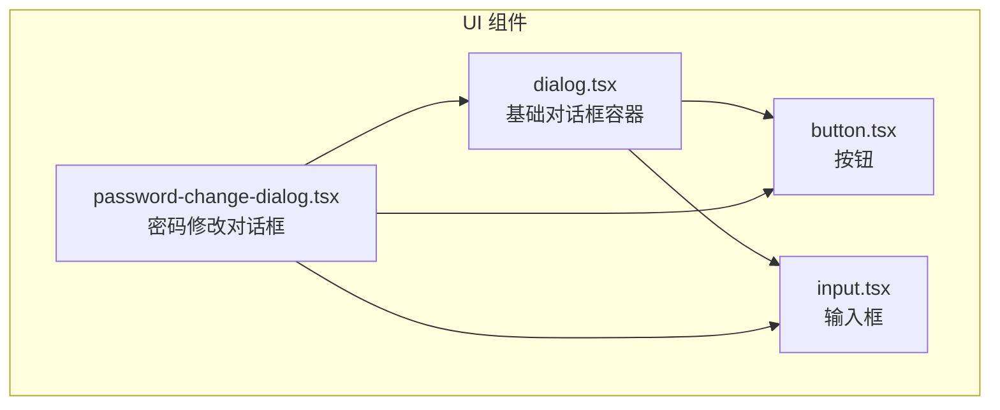
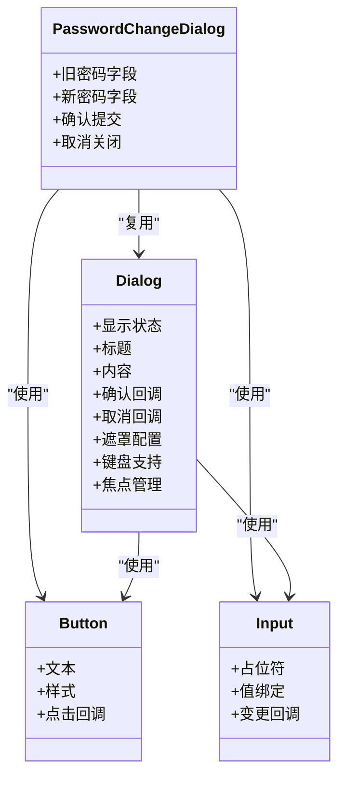
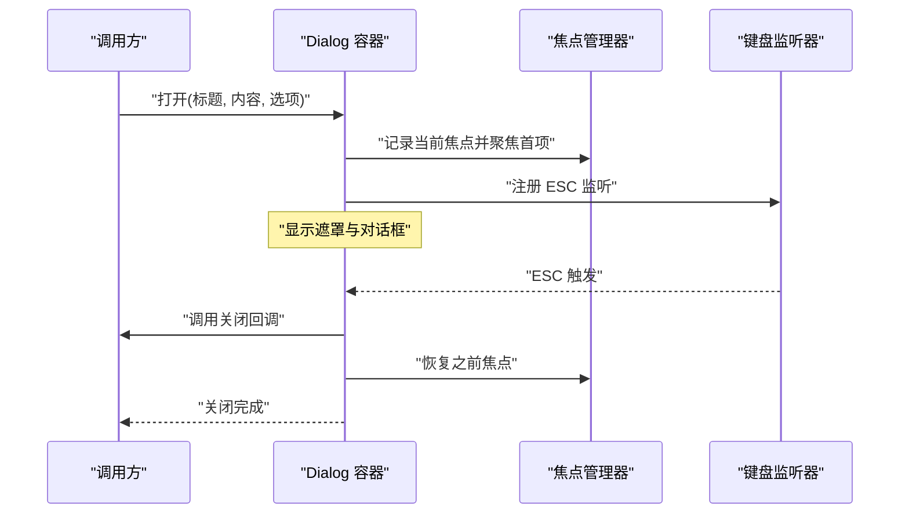
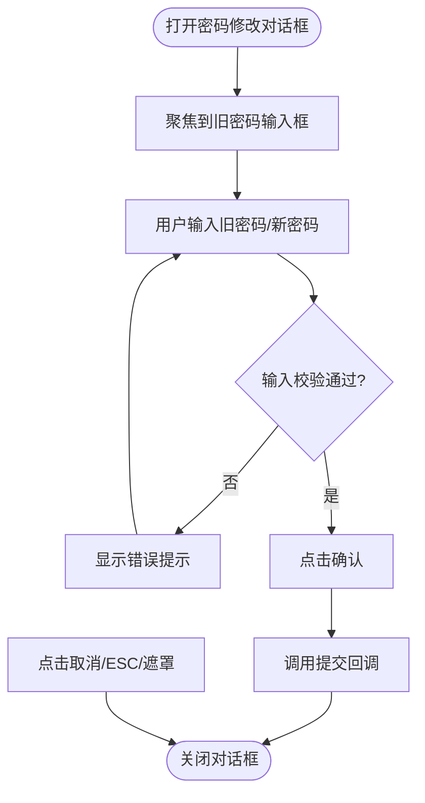
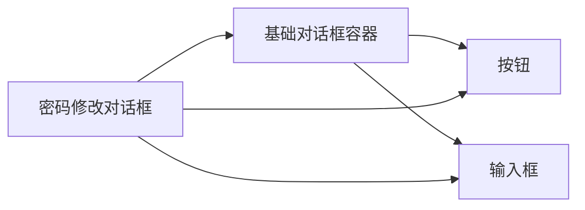

# 对话框组件(Dialog)

<cite>
**本文引用的文件**   
- [dialog.tsx](file://frontend_design/src/components/ui/dialog.tsx)
- [password-change-dialog.tsx](file://frontend_design/src/components/ui/password-change-dialog.tsx)
- [button.tsx](file://frontend_design/src/components/ui/button.tsx)
- [input.tsx](file://frontend_design/src/components/ui/input.tsx)
</cite>

## 目录
1. [简介](#简介)
2. [项目结构](#项目结构)
3. [核心组件](#核心组件)
4. [架构总览](#架构总览)
5. [详细组件分析](#详细组件分析)
6. [依赖分析](#依赖分析)
7. [性能考虑](#性能考虑)
8. [故障排查指南](#故障排查指南)
9. [结论](#结论)
10. [附录](#附录)

## 简介
本文件面向 NexusCockpit 前端应用，系统化梳理并文档化“对话框组件（Dialog）”。重点覆盖：
- 模态显示机制、层级管理与焦点控制
- 属性接口与配置方式（标题、内容、确认/取消按钮等）
- 常见对话框类型（确认、输入、自定义内容等）
- 打开与关闭的控制方法（编程式与用户交互）
- 遮罩层配置（背景透明度、点击外部关闭、ESC 键关闭）
- 动画与过渡效果配置
- 典型使用场景示例（删除确认、表单输入、信息提示等）

## 项目结构
对话框相关代码位于前端 UI 组件目录中，核心实现与常用组合如下：
- 基础对话框容器：用于管理模态、遮罩、层级、焦点与键盘事件
- 专用对话框：如密码修改对话框，展示如何复用基础能力构建业务对话框
- 通用 UI 原子组件：按钮、输入框等，作为对话框内容的组成元素

图表来源
- [dialog.tsx](file://frontend_design/src/components/ui/dialog.tsx)
- [password-change-dialog.tsx](file://frontend_design/src/components/ui/password-change-dialog.tsx)
- [button.tsx](file://frontend_design/src/components/ui/button.tsx)
- [input.tsx](file://frontend_design/src/components/ui/input.tsx)

章节来源
- [dialog.tsx](file://frontend_design/src/components/ui/dialog.tsx)
- [password-change-dialog.tsx](file://frontend_design/src/components/ui/password-change-dialog.tsx)
- [button.tsx](file://frontend_design/src/components/ui/button.tsx)
- [input.tsx](file://frontend_design/src/components/ui/input.tsx)

## 核心组件
- 基础对话框容器（dialog.tsx）
  - 职责：提供模态窗口、遮罩层、层级堆叠、焦点捕获与恢复、键盘事件处理（如 ESC）、以及可配置的标题与内容区域。
  - 关键能力：
    - 模态显示：阻止底层交互，聚焦到对话框内部
    - 层级管理：通过 z-index 或等效机制确保多对话框正确堆叠
    - 焦点控制：进入时聚焦首个可聚焦元素，离开时恢复之前焦点
    - 键盘支持：监听 ESC 触发关闭
    - 遮罩行为：支持点击遮罩关闭、背景透明度可调
- 专用对话框（password-change-dialog.tsx）
  - 职责：封装密码修改流程，复用基础对话框的模态与交互能力，提供表单输入与确认/取消操作。
  - 典型用法：在设置页或账户管理中调用，完成密码更新。

章节来源
- [dialog.tsx](file://frontend_design/src/components/ui/dialog.tsx)
- [password-change-dialog.tsx](file://frontend_design/src/components/ui/password-change-dialog.tsx)

## 架构总览
下图展示了基础对话框与专用对话框之间的依赖关系，以及与通用 UI 原子组件的组合方式。

图表来源
- [dialog.tsx](file://frontend_design/src/components/ui/dialog.tsx)
- [password-change-dialog.tsx](file://frontend_design/src/components/ui/password-change-dialog.tsx)
- [button.tsx](file://frontend_design/src/components/ui/button.tsx)
- [input.tsx](file://frontend_design/src/components/ui/input.tsx)

## 详细组件分析

### 基础对话框容器（Dialog）
- 模态显示机制
  - 渲染遮罩层与对话框主体，阻止对底层内容的交互
  - 通过层级策略保证多个对话框按顺序堆叠
- 层级管理
  - 维护当前激活对话框的层级索引，新打开的对话框获得更高优先级
  - 关闭后自动回收层级资源
- 焦点控制
  - 打开时记录当前焦点元素，将焦点移至对话框内第一个可聚焦项
  - 关闭时恢复之前的焦点位置，提升可访问性
- 键盘与交互
  - 监听 ESC 键触发关闭
  - 可选：点击遮罩关闭
- 遮罩层配置
  - 支持调整背景透明度
  - 支持点击遮罩关闭开关
- 内容插槽
  - 标题区：可配置标题文本
  - 内容区：支持任意子节点（文本、表单、图片等）
  - 操作区：确认/取消按钮及回调

图表来源
- [dialog.tsx](file://frontend_design/src/components/ui/dialog.tsx)

章节来源
- [dialog.tsx](file://frontend_design/src/components/ui/dialog.tsx)

### 专用对话框：密码修改（PasswordChangeDialog）
- 功能要点
  - 基于基础对话框封装，提供旧密码与新密码输入
  - 包含确认与取消按钮，分别执行提交与关闭逻辑
- 数据流
  - 用户在输入框中输入值，组件内部进行校验
  - 确认后调用父级提供的提交回调；取消则直接关闭对话框
- 交互细节
  - 打开时自动聚焦到第一个输入框
  - 支持 ESC 关闭与点击遮罩关闭（由基础容器提供）

图表来源
- [password-change-dialog.tsx](file://frontend_design/src/components/ui/password-change-dialog.tsx)
- [dialog.tsx](file://frontend_design/src/components/ui/dialog.tsx)
- [input.tsx](file://frontend_design/src/components/ui/input.tsx)
- [button.tsx](file://frontend_design/src/components/ui/button.tsx)

章节来源
- [password-change-dialog.tsx](file://frontend_design/src/components/ui/password-change-dialog.tsx)
- [dialog.tsx](file://frontend_design/src/components/ui/dialog.tsx)
- [input.tsx](file://frontend_design/src/components/ui/input.tsx)
- [button.tsx](file://frontend_design/src/components/ui/button.tsx)

### 常见对话框类型与使用场景
- 确认对话框
  - 用途：删除、退出登录等危险操作的二次确认
  - 配置要点：标题为操作名称，内容为风险提示，提供确认与取消按钮
- 输入对话框
  - 用途：快速收集简短信息（如重命名、搜索过滤）
  - 配置要点：标题描述任务，内容包含输入框，确认时返回输入值
- 自定义内容对话框
  - 用途：复杂表单、预览、帮助信息等
  - 配置要点：内容区自由组合任意子组件，按需添加操作按钮

章节来源
- [dialog.tsx](file://frontend_design/src/components/ui/dialog.tsx)
- [password-change-dialog.tsx](file://frontend_design/src/components/ui/password-change-dialog.tsx)

### 打开与关闭的控制方法
- 编程式控制
  - 通过状态变量控制对话框的显示/隐藏
  - 在确认/取消回调中更新状态以关闭对话框
- 用户交互触发
  - 点击按钮打开对话框
  - 点击遮罩、按下 ESC 或显式调用关闭方法关闭对话框

章节来源
- [dialog.tsx](file://frontend_design/src/components/ui/dialog.tsx)
- [password-change-dialog.tsx](file://frontend_design/src/components/ui/password-change-dialog.tsx)

### 遮罩层配置
- 背景透明度：可通过配置项调整遮罩层的透明度
- 点击外部关闭：支持开启/关闭点击遮罩关闭行为
- ESC 键关闭：默认启用，可在配置中调整

章节来源
- [dialog.tsx](file://frontend_design/src/components/ui/dialog.tsx)

### 动画与过渡效果
- 入场/出场动画：对话框与遮罩的淡入淡出、缩放等过渡
- 配置项：可切换动画开关、时长与缓动函数
- 无障碍建议：动画不应影响键盘导航与屏幕阅读器体验

章节来源
- [dialog.tsx](file://frontend_design/src/components/ui/dialog.tsx)

## 依赖分析
- 组件耦合
  - 专用对话框强依赖基础对话框容器，复用其模态、焦点与键盘能力
  - 基础对话框弱依赖通用 UI 原子组件（按钮、输入框），便于扩展内容
- 外部依赖
  - 无额外第三方库依赖声明于对话框组件自身，主要依赖框架与 UI 原子组件

图表来源
- [dialog.tsx](file://frontend_design/src/components/ui/dialog.tsx)
- [password-change-dialog.tsx](file://frontend_design/src/components/ui/password-change-dialog.tsx)
- [button.tsx](file://frontend_design/src/components/ui/button.tsx)
- [input.tsx](file://frontend_design/src/components/ui/input.tsx)

章节来源
- [dialog.tsx](file://frontend_design/src/components/ui/dialog.tsx)
- [password-change-dialog.tsx](file://frontend_design/src/components/ui/password-change-dialog.tsx)
- [button.tsx](file://frontend_design/src/components/ui/button.tsx)
- [input.tsx](file://frontend_design/src/components/ui/input.tsx)

## 性能考虑
- 延迟渲染：仅在需要时挂载对话框 DOM，减少初始渲染开销
- 事件去抖：频繁打开/关闭时避免重复注册/注销事件监听
- 焦点优化：仅聚焦必要元素，避免不必要的重排
- 动画节流：长列表或复杂内容下可禁用动画以提升响应速度

## 故障排查指南
- 无法关闭
  - 检查是否禁用了 ESC 与点击遮罩关闭
  - 确认关闭回调未被拦截或未更新显示状态
- 焦点异常
  - 验证打开时是否正确记录并恢复焦点
  - 检查内容区内是否存在不可聚焦元素导致焦点丢失
- 层级错乱
  - 确认多层对话框打开时的层级递增逻辑
  - 检查关闭后层级回收是否及时
- 动画卡顿
  - 尝试降低动画时长或禁用动画
  - 检查内容复杂度，必要时拆分或懒加载

章节来源
- [dialog.tsx](file://frontend_design/src/components/ui/dialog.tsx)

## 结论
基础对话框容器提供了完善的模态、遮罩、层级与焦点管理能力，配合专用对话框可以快速构建多种业务场景。通过合理的配置与最佳实践，可获得一致的用户体验与良好的可访问性。

## 附录
- 使用示例路径参考
  - 删除确认对话框：参见基础对话框容器的使用方式
  - 表单输入对话框：参见密码修改对话框的实现思路
  - 信息提示对话框：参见基础对话框容器的内容插槽用法

章节来源
- [dialog.tsx](file://frontend_design/src/components/ui/dialog.tsx)
- [password-change-dialog.tsx](file://frontend_design/src/components/ui/password-change-dialog.tsx)