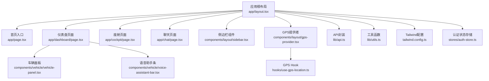
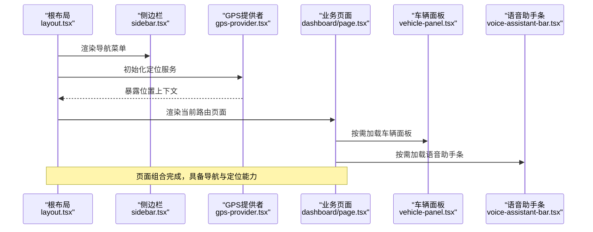
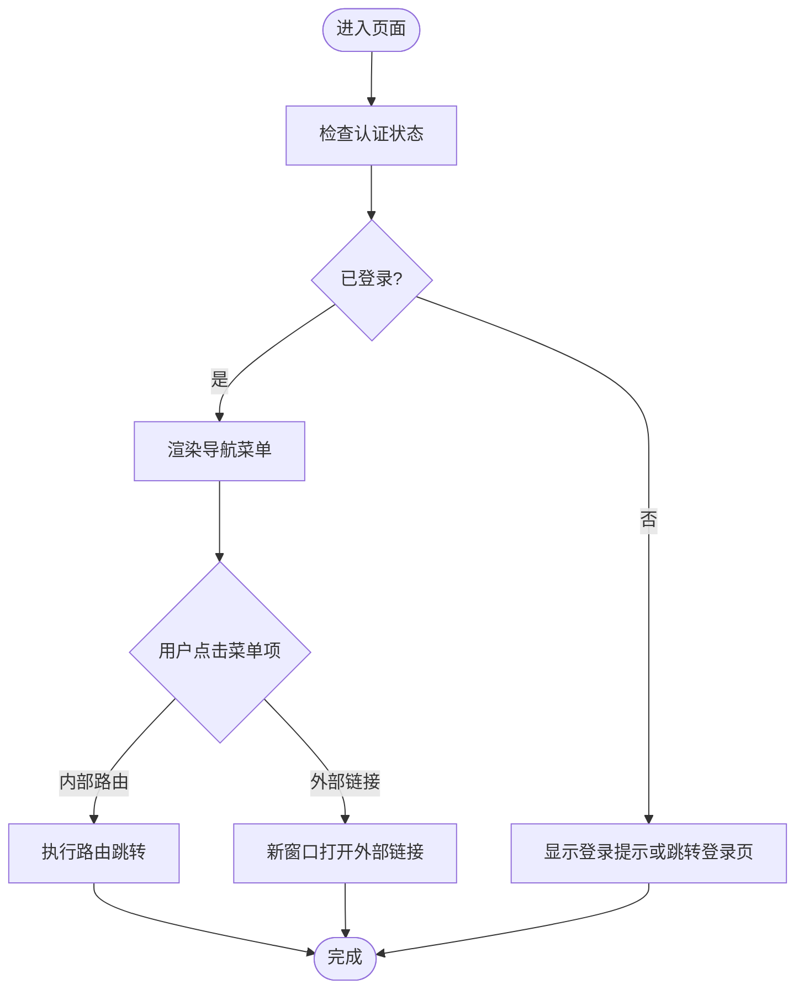
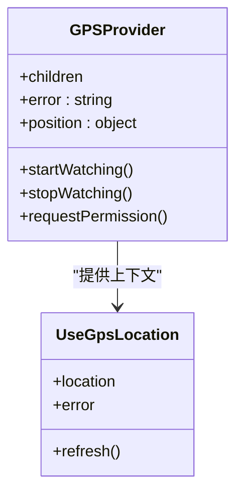
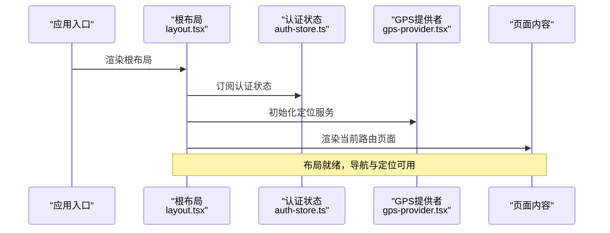
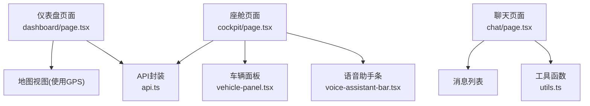
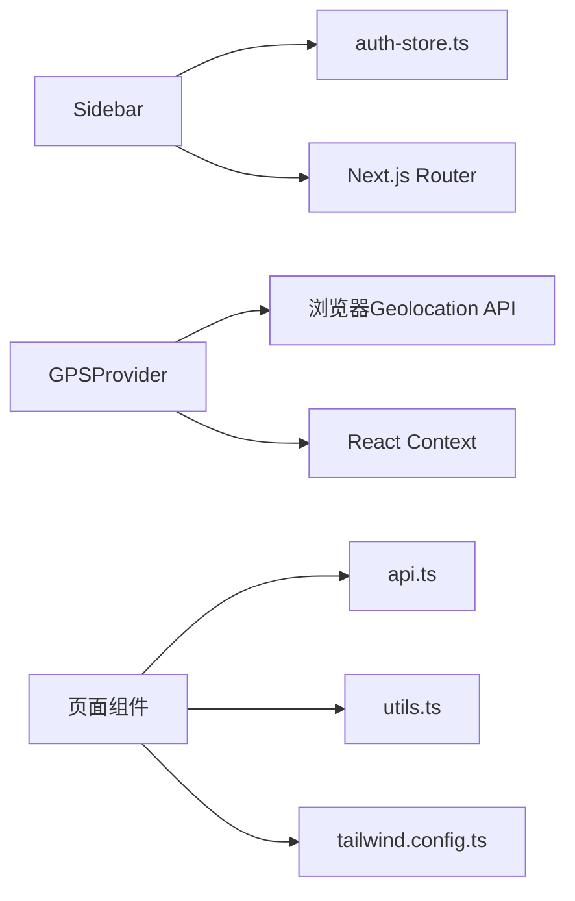

# 布局组件

<cite>
**本文引用的文件**   
- [layout.tsx](file://frontend_design/src/app/layout.tsx)
- [sidebar.tsx](file://frontend_design/src/components/layout/sidebar.tsx)
- [gps-provider.tsx](file://frontend_design/src/components/layout/gps-provider.tsx)
- [use-gps-location.ts](file://frontend_design/src/hooks/use-gps-location.ts)
- [page.tsx](file://frontend_design/src/app/page.tsx)
- [dashboard/page.tsx](file://frontend_design/src/app/dashboard/page.tsx)
- [cockpit/page.tsx](file://frontend_design/src/app/cockpit/page.tsx)
- [chat/page.tsx](file://frontend_design/src/app/chat/page.tsx)
- [vehicle-panel.tsx](file://frontend_design/src/components/vehicle/vehicle-panel.tsx)
- [voice-assistant-bar.tsx](file://frontend_design/src/components/vehicle/voice-assistant-bar.tsx)
- [auth-store.ts](file://frontend_design/src/stores/auth-store.ts)
- [api.ts](file://frontend_design/src/lib/api.ts)
- [utils.ts](file://frontend_design/src/lib/utils.ts)
- [tailwind.config.ts](file://frontend_design/src/tailwind.config.ts)
</cite>

## 目录
1. [简介](#简介)
2. [项目结构](#项目结构)
3. [核心组件](#核心组件)
4. [架构总览](#架构总览)
5. [详细组件分析](#详细组件分析)
6. [依赖关系分析](#依赖关系分析)
7. [性能考虑](#性能考虑)
8. [故障排查指南](#故障排查指南)
9. [结论](#结论)
10. [附录](#附录)

## 简介
本文件面向NexusCockpit前端应用的布局子系统，聚焦以下目标：
- 侧边栏组件(Sidebar)的结构设计、导航逻辑与响应式适配
- GPS定位提供者(GPSProvider)的实现原理、数据共享机制与使用方法
- 布局系统的整体架构：页面框架、路由集成与状态管理
- 组件组合模式：如何通过布局组件构建完整页面
- 主题切换与个性化配置方案
- 复杂页面的布局实现示例（以路径引用代替代码片段）
- 性能优化策略：组件懒加载与内存管理

## 项目结构
前端采用Next.js应用结构，布局相关的关键位置如下：
- 应用根布局：app/layout.tsx
- 页面级布局入口：app/page.tsx
- 业务页面：app/dashboard/page.tsx、app/cockpit/page.tsx、app/chat/page.tsx
- 通用布局组件：components/layout/sidebar.tsx、components/layout/gps-provider.tsx
- 车辆面板与语音助手条：components/vehicle/vehicle-panel.tsx、components/vehicle/voice-assistant-bar.tsx
- 全局工具与API：lib/api.ts、lib/utils.ts
- 样式与主题：tailwind.config.ts
- 状态存储：stores/auth-store.ts

图表来源
- [layout.tsx:1-200](file://frontend_design/src/app/layout.tsx#L1-L200)
- [page.tsx:1-200](file://frontend_design/src/app/page.tsx#L1-L200)
- [dashboard/page.tsx:1-200](file://frontend_design/src/app/dashboard/page.tsx#L1-L200)
- [cockpit/page.tsx:1-200](file://frontend_design/src/app/cockpit/page.tsx#L1-L200)
- [chat/page.tsx:1-200](file://frontend_design/src/app/chat/page.tsx#L1-L200)
- [sidebar.tsx:1-200](file://frontend_design/src/components/layout/sidebar.tsx#L1-L200)
- [gps-provider.tsx:1-200](file://frontend_design/src/components/layout/gps-provider.tsx#L1-L200)
- [use-gps-location.ts:1-200](file://frontend_design/src/hooks/use-gps-location.ts#L1-L200)
- [vehicle-panel.tsx:1-200](file://frontend_design/src/components/vehicle/vehicle-panel.tsx#L1-L200)
- [voice-assistant-bar.tsx:1-200](file://frontend_design/src/components/vehicle/voice-assistant-bar.tsx#L1-L200)
- [api.ts:1-200](file://frontend_design/src/lib/api.ts#L1-L200)
- [utils.ts:1-200](file://frontend_design/src/lib/utils.ts#L1-L200)
- [tailwind.config.ts:1-200](file://frontend_design/src/tailwind.config.ts#L1-L200)
- [auth-store.ts:1-200](file://frontend_design/src/stores/auth-store.ts#L1-L200)

章节来源
- [layout.tsx:1-200](file://frontend_design/src/app/layout.tsx#L1-L200)
- [page.tsx:1-200](file://frontend_design/src/app/page.tsx#L1-L200)
- [dashboard/page.tsx:1-200](file://frontend_design/src/app/dashboard/page.tsx#L1-L200)
- [cockpit/page.tsx:1-200](file://frontend_design/src/app/cockpit/page.tsx#L1-L200)
- [chat/page.tsx:1-200](file://frontend_design/src/app/chat/page.tsx#L1-L200)
- [sidebar.tsx:1-200](file://frontend_design/src/components/layout/sidebar.tsx#L1-L200)
- [gps-provider.tsx:1-200](file://frontend_design/src/components/layout/gps-provider.tsx#L1-L200)
- [use-gps-location.ts:1-200](file://frontend_design/src/hooks/use-gps-location.ts#L1-L200)
- [vehicle-panel.tsx:1-200](file://frontend_design/src/components/vehicle/vehicle-panel.tsx#L1-L200)
- [voice-assistant-bar.tsx:1-200](file://frontend_design/src/components/vehicle/voice-assistant-bar.tsx#L1-L200)
- [api.ts:1-200](file://frontend_design/src/lib/api.ts#L1-L200)
- [utils.ts:1-200](file://frontend_design/src/lib/utils.ts#L1-L200)
- [tailwind.config.ts:1-200](file://frontend_design/src/tailwind.config.ts#L1-L200)
- [auth-store.ts:1-200](file://frontend_design/src/stores/auth-store.ts#L1-L200)

## 核心组件
本节聚焦布局子系统的三大核心：
- 侧边栏组件(Sidebar)：负责导航菜单、折叠状态、移动端抽屉展示、权限控制与路由跳转
- GPS定位提供者(GPSProvider)：封装浏览器Geolocation API，提供统一的位置上下文与错误处理
- 根布局(layout.tsx)：整合Sidebar与GPSProvider，组织页面框架、注入全局状态与资源

章节来源
- [sidebar.tsx:1-200](file://frontend_design/src/components/layout/sidebar.tsx#L1-L200)
- [gps-provider.tsx:1-200](file://frontend_design/src/components/layout/gps-provider.tsx#L1-L200)
- [layout.tsx:1-200](file://frontend_design/src/app/layout.tsx#L1-L200)

## 架构总览
布局系统遵循“根布局包裹 + 功能提供者注入 + 页面组合”的模式：
- 根布局在应用启动时挂载Sidebar与GPSProvider，确保所有页面可访问导航与位置能力
- 各业务页面通过组合模式拼装头部、主体区域与底部信息，必要时引入车辆面板与语音助手条
- 状态管理由全局Store与Context共同承担，如认证状态、用户偏好等

图表来源
- [layout.tsx:1-200](file://frontend_design/src/app/layout.tsx#L1-L200)
- [sidebar.tsx:1-200](file://frontend_design/src/components/layout/sidebar.tsx#L1-L200)
- [gps-provider.tsx:1-200](file://frontend_design/src/components/layout/gps-provider.tsx#L1-L200)
- [dashboard/page.tsx:1-200](file://frontend_design/src/app/dashboard/page.tsx#L1-L200)
- [vehicle-panel.tsx:1-200](file://frontend_design/src/components/vehicle/vehicle-panel.tsx#L1-L200)
- [voice-assistant-bar.tsx:1-200](file://frontend_design/src/components/vehicle/voice-assistant-bar.tsx#L1-L200)

## 详细组件分析

### 侧边栏组件(Sidebar)
- 结构设计
  - 顶部品牌区与用户信息区
  - 导航分组与层级菜单
  - 折叠按钮与移动端抽屉开关
- 导航逻辑
  - 基于Next.js路由进行跳转，支持外部链接与新窗口打开
  - 根据认证状态与权限动态显示/隐藏菜单项
- 响应式适配
  - 桌面端固定宽度侧边栏，移动端使用抽屉覆盖层
  - 断点切换与手势关闭支持
- 交互细节
  - 选中态高亮、悬停反馈、键盘可达性
  - 防抖点击与重复导航保护

图表来源
- [sidebar.tsx:1-200](file://frontend_design/src/components/layout/sidebar.tsx#L1-L200)
- [auth-store.ts:1-200](file://frontend_design/src/stores/auth-store.ts#L1-L200)

章节来源
- [sidebar.tsx:1-200](file://frontend_design/src/components/layout/sidebar.tsx#L1-L200)
- [auth-store.ts:1-200](file://frontend_design/src/stores/auth-store.ts#L1-L200)

### GPS定位提供者(GPSProvider)
- 实现原理
  - 封装浏览器Geolocation API，提供watchPosition与getCurrentPosition能力
  - 维护位置状态、错误码与重试策略
- 数据共享机制
  - 通过React Context将位置数据与操作暴露给子树
  - 结合Hook(use-gps-location)简化消费方接入
- 使用方法
  - 在根布局中包裹GPSProvider
  - 在任意子组件中使用Hook获取当前位置与错误信息
  - 支持手动触发刷新与权限请求

图表来源
- [gps-provider.tsx:1-200](file://frontend_design/src/components/layout/gps-provider.tsx#L1-L200)
- [use-gps-location.ts:1-200](file://frontend_design/src/hooks/use-gps-location.ts#L1-L200)

章节来源
- [gps-provider.tsx:1-200](file://frontend_design/src/components/layout/gps-provider.tsx#L1-L200)
- [use-gps-location.ts:1-200](file://frontend_design/src/hooks/use-gps-location.ts#L1-L200)

### 根布局(layout.tsx)
- 职责
  - 挂载全局样式与字体
  - 注入认证状态与GPS上下文
  - 组织Sidebar与主内容区域
- 路由集成
  - 与Next.js App Router协同，确保页面正确嵌套
- 状态管理
  - 读取并同步认证状态，驱动导航可见性与用户信息展示

图表来源
- [layout.tsx:1-200](file://frontend_design/src/app/layout.tsx#L1-L200)
- [auth-store.ts:1-200](file://frontend_design/src/stores/auth-store.ts#L1-L200)
- [gps-provider.tsx:1-200](file://frontend_design/src/components/layout/gps-provider.tsx#L1-L200)

章节来源
- [layout.tsx:1-200](file://frontend_design/src/app/layout.tsx#L1-L200)
- [auth-store.ts:1-200](file://frontend_design/src/stores/auth-store.ts#L1-L200)
- [gps-provider.tsx:1-200](file://frontend_design/src/components/layout/gps-provider.tsx#L1-L200)

### 页面组合模式与示例
- 仪表盘页面(dashboard/page.tsx)
  - 组合头部、统计卡片与地图视图
  - 使用GPSProvider提供的坐标更新地图中心
- 座舱页面(cockpit/page.tsx)
  - 组合车辆面板与语音助手条
  - 通过API调用获取车辆状态并实时更新
- 聊天页面(chat/page.tsx)
  - 组合消息列表与输入框
  - 利用工具函数格式化时间戳与消息类型

图表来源
- [dashboard/page.tsx:1-200](file://frontend_design/src/app/dashboard/page.tsx#L1-L200)
- [cockpit/page.tsx:1-200](file://frontend_design/src/app/cockpit/page.tsx#L1-L200)
- [chat/page.tsx:1-200](file://frontend_design/src/app/chat/page.tsx#L1-L200)
- [vehicle-panel.tsx:1-200](file://frontend_design/src/components/vehicle/vehicle-panel.tsx#L1-L200)
- [voice-assistant-bar.tsx:1-200](file://frontend_design/src/components/vehicle/voice-assistant-bar.tsx#L1-L200)
- [api.ts:1-200](file://frontend_design/src/lib/api.ts#L1-L200)
- [utils.ts:1-200](file://frontend_design/src/lib/utils.ts#L1-L200)

章节来源
- [dashboard/page.tsx:1-200](file://frontend_design/src/app/dashboard/page.tsx#L1-L200)
- [cockpit/page.tsx:1-200](file://frontend_design/src/app/cockpit/page.tsx#L1-L200)
- [chat/page.tsx:1-200](file://frontend_design/src/app/chat/page.tsx#L1-L200)
- [vehicle-panel.tsx:1-200](file://frontend_design/src/components/vehicle/vehicle-panel.tsx#L1-L200)
- [voice-assistant-bar.tsx:1-200](file://frontend_design/src/components/vehicle/voice-assistant-bar.tsx#L1-L200)
- [api.ts:1-200](file://frontend_design/src/lib/api.ts#L1-L200)
- [utils.ts:1-200](file://frontend_design/src/lib/utils.ts#L1-L200)

## 依赖关系分析
- 组件耦合
  - Sidebar依赖认证状态与路由库
  - GPSProvider依赖浏览器API与React Context
  - 页面组件依赖API封装与工具函数
- 外部依赖
  - Next.js路由与App Router
  - Tailwind CSS用于样式与主题
  - 可选第三方地图SDK（若使用）

图表来源
- [sidebar.tsx:1-200](file://frontend_design/src/components/layout/sidebar.tsx#L1-L200)
- [auth-store.ts:1-200](file://frontend_design/src/stores/auth-store.ts#L1-L200)
- [gps-provider.tsx:1-200](file://frontend_design/src/components/layout/gps-provider.tsx#L1-L200)
- [api.ts:1-200](file://frontend_design/src/lib/api.ts#L1-L200)
- [utils.ts:1-200](file://frontend_design/src/lib/utils.ts#L1-L200)
- [tailwind.config.ts:1-200](file://frontend_design/src/tailwind.config.ts#L1-L200)

章节来源
- [sidebar.tsx:1-200](file://frontend_design/src/components/layout/sidebar.tsx#L1-L200)
- [auth-store.ts:1-200](file://frontend_design/src/stores/auth-store.ts#L1-L200)
- [gps-provider.tsx:1-200](file://frontend_design/src/components/layout/gps-provider.tsx#L1-L200)
- [api.ts:1-200](file://frontend_design/src/lib/api.ts#L1-L200)
- [utils.ts:1-200](file://frontend_design/src/lib/utils.ts#L1-L200)
- [tailwind.config.ts:1-200](file://frontend_design/src/tailwind.config.ts#L1-L200)

## 性能考虑
- 组件懒加载
  - 对重型组件（如地图、3D模型）使用动态导入与条件渲染
  - 在用户交互后再加载非关键UI
- 内存管理
  - 及时清理GPS监听器与事件订阅
  - 避免在高频回调中创建闭包对象
- 渲染优化
  - 使用React.memo与useMemo减少不必要的重渲染
  - 分页与虚拟列表优化大数据量场景
- 网络请求
  - 合并请求与缓存策略，避免频繁拉取相同数据
  - 失败重试与退避算法提升稳定性

[本节为通用指导，不直接分析具体文件]

## 故障排查指南
- 侧边栏无法展开或菜单不显示
  - 检查认证状态是否正确加载
  - 确认路由配置与菜单项映射一致
- GPS定位失败或权限被拒绝
  - 查看错误码并提示用户开启定位权限
  - 降级到默认城市或上次已知位置
- 页面布局错乱
  - 检查Tailwind配置与断点设置
  - 验证容器高度与溢出处理

章节来源
- [sidebar.tsx:1-200](file://frontend_design/src/components/layout/sidebar.tsx#L1-L200)
- [gps-provider.tsx:1-200](file://frontend_design/src/components/layout/gps-provider.tsx#L1-L200)
- [tailwind.config.ts:1-200](file://frontend_design/src/tailwind.config.ts#L1-L200)

## 结论
本布局子系统通过根布局统一装配侧边栏与GPS能力，结合组合模式在各业务页面灵活拼装。认证状态驱动导航可见性，GPSProvider提供稳定的位置上下文。配合懒加载与内存管理策略，可在保证用户体验的同时维持良好的性能表现。

[本节为总结性内容，不直接分析具体文件]

## 附录
- 主题切换与个性化配置
  - 通过Tailwind配置定义主题变量与断点
  - 在根布局中注入主题上下文，支持运行时切换
  - 用户偏好持久化至本地存储或后端接口
- 复杂页面布局示例（路径引用）
  - 仪表盘：[dashboard/page.tsx](file://frontend_design/src/app/dashboard/page.tsx)
  - 座舱：[cockpit/page.tsx](file://frontend_design/src/app/cockpit/page.tsx)
  - 聊天：[chat/page.tsx](file://frontend_design/src/app/chat/page.tsx)

章节来源
- [tailwind.config.ts:1-200](file://frontend_design/src/tailwind.config.ts#L1-L200)
- [dashboard/page.tsx:1-200](file://frontend_design/src/app/dashboard/page.tsx#L1-L200)
- [cockpit/page.tsx:1-200](file://frontend_design/src/app/cockpit/page.tsx#L1-L200)
- [chat/page.tsx:1-200](file://frontend_design/src/app/chat/page.tsx#L1-L200)