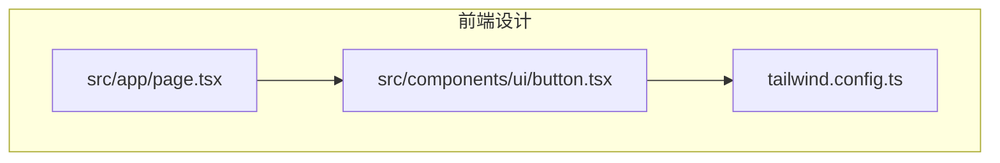
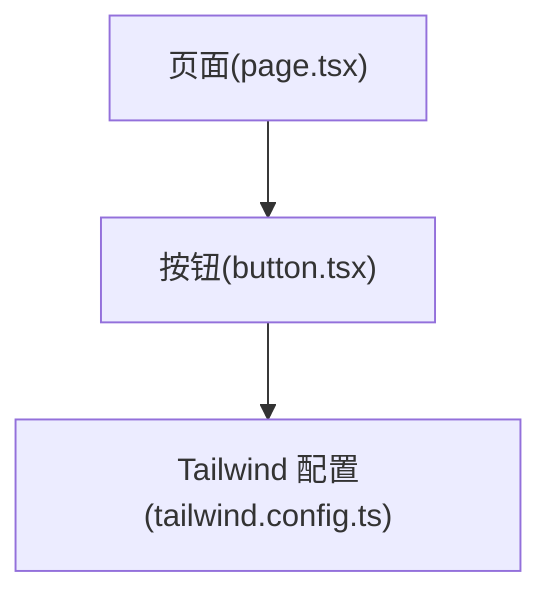
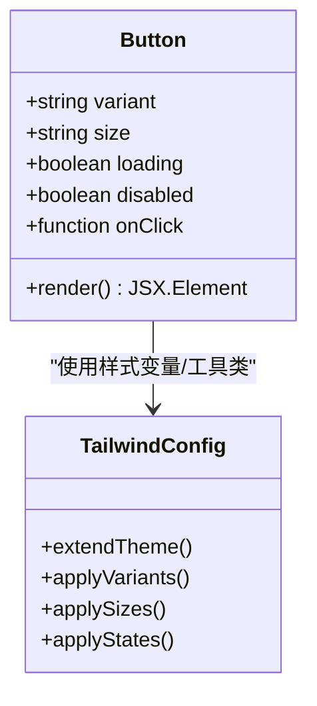
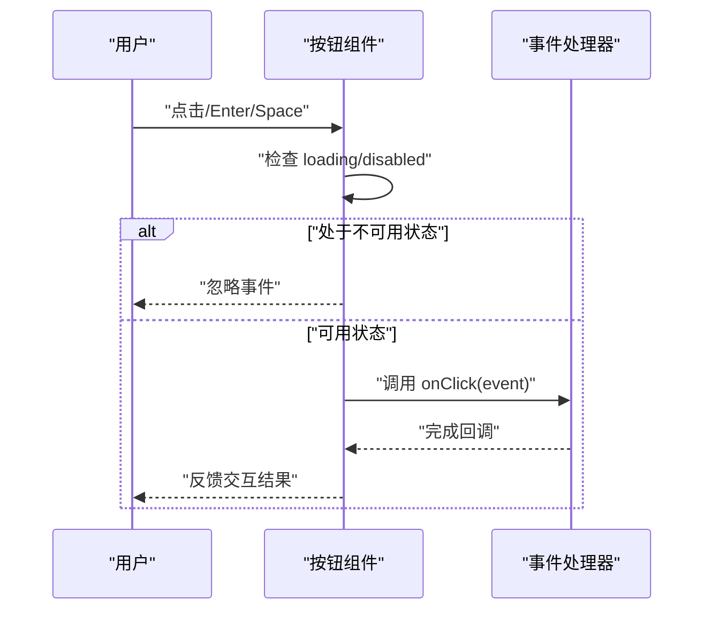
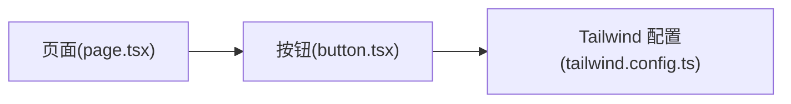

# 按钮组件(Button)

<cite>
**本文引用的文件**   
- [button.tsx](file://frontend_design/src/components/ui/button.tsx)
- [tailwind.config.ts](file://frontend_design/tailwind.config.ts)
- [page.tsx](file://frontend_design/src/app/page.tsx)
</cite>

## 目录
1. [简介](#简介)
2. [项目结构](#项目结构)
3. [核心组件](#核心组件)
4. [架构总览](#架构总览)
5. [详细组件分析](#详细组件分析)
6. [依赖分析](#依赖分析)
7. [性能考虑](#性能考虑)
8. [故障排查指南](#故障排查指南)
9. [结论](#结论)
10. [附录](#附录)

## 简介
本文件为 NexusCockpit 前端应用中的 Button 组件提供完整文档，涵盖设计规范、属性接口、实现细节、事件与可访问性、样式定制、响应式适配以及常见使用场景示例。Button 组件基于 React + Tailwind CSS 构建，支持多种变体（primary、secondary、outline、ghost）、尺寸规格（sm、md、lg）和状态（loading、disabled），并提供键盘导航与无障碍特性。

## 项目结构
Button 组件位于 UI 基础组件目录中，样式通过 Tailwind 配置进行主题化扩展。页面级示例可在应用首页中使用。

图表来源
- [button.tsx](file://frontend_design/src/components/ui/button.tsx)
- [tailwind.config.ts](file://frontend_design/tailwind.config.ts)
- [page.tsx](file://frontend_design/src/app/page.tsx)

章节来源
- [button.tsx](file://frontend_design/src/components/ui/button.tsx)
- [tailwind.config.ts](file://frontend_design/tailwind.config.ts)
- [page.tsx](file://frontend_design/src/app/page.tsx)

## 核心组件
- 组件职责：提供统一的按钮交互入口，封装变体、尺寸、状态与可访问性逻辑，统一样式风格。
- 技术栈：React（函数组件）、Tailwind CSS（原子化样式）。
- 关键能力：
  - 变体：primary、secondary、outline、ghost
  - 尺寸：sm、md、lg
  - 状态：loading、disabled
  - 事件：onClick
  - 可访问性：键盘操作、语义标签、焦点管理
  - 样式定制：颜色主题、边框、阴影等

章节来源
- [button.tsx](file://frontend_design/src/components/ui/button.tsx)

## 架构总览
Button 组件作为 UI 层的基础构件，被业务页面引用；样式由 Tailwind 配置集中管理，确保全局一致的主题与规范。

图表来源
- [page.tsx](file://frontend_design/src/app/page.tsx)
- [button.tsx](file://frontend_design/src/components/ui/button.tsx)
- [tailwind.config.ts](file://frontend_design/tailwind.config.ts)

## 详细组件分析

### 组件类图与关系

图表来源
- [button.tsx](file://frontend_design/src/components/ui/button.tsx)
- [tailwind.config.ts](file://frontend_design/tailwind.config.ts)

章节来源
- [button.tsx](file://frontend_design/src/components/ui/button.tsx)
- [tailwind.config.ts](file://frontend_design/tailwind.config.ts)

### 属性接口与默认值
- variant: 变体类型
  - 取值：primary | secondary | outline | ghost
  - 默认：primary
  - 说明：控制主色、描边、背景透明度等视觉风格
- size: 尺寸
  - 取值：sm | md | lg
  - 默认：md
  - 说明：控制内边距、字号、图标大小等
- loading: 加载状态
  - 类型：boolean
  - 默认：false
  - 说明：显示加载指示器并禁用交互
- disabled: 禁用状态
  - 类型：boolean
  - 默认：false
  - 说明：禁用点击与键盘操作，呈现禁用样式
- onClick: 点击回调
  - 类型：(event) => void
  - 说明：在非 disabled 且非 loading 时触发

章节来源
- [button.tsx](file://frontend_design/src/components/ui/button.tsx)

### 事件处理机制
- 点击事件：
  - 当 loading 或 disabled 为真时，阻止默认行为与冒泡，不触发 onClick。
  - 否则调用 onClick，并透传原生事件对象。
- 键盘导航：
  - 支持 Enter 与 Space 键触发点击。
  - 提供 Tab 聚焦与焦点可见样式。
- 可访问性：
  - 使用语义化元素（如 button）以确保屏幕阅读器识别。
  - 根据状态设置 aria-disabled、aria-busy 等属性。
  - 提供 role 与 tabIndex 的合理默认值。

图表来源
- [button.tsx](file://frontend_design/src/components/ui/button.tsx)

章节来源
- [button.tsx](file://frontend_design/src/components/ui/button.tsx)

### 样式定制选项
- 颜色主题：
  - 通过 Tailwind 配置扩展主题色，覆盖 primary、secondary、outline、ghost 的文本、背景与边框色。
- 边框样式：
  - outline 变体默认带边框；可通过配置调整圆角与粗细。
- 阴影效果：
  - 在 hover/focus 状态下添加阴影以提升层次感。
- 尺寸体系：
  - sm/md/lg 对应不同字号、行高、内边距与图标尺寸。
- 状态样式：
  - disabled 降低不透明度与指针事件；loading 显示旋转指示器并禁用交互。

章节来源
- [tailwind.config.ts](file://frontend_design/tailwind.config.ts)
- [button.tsx](file://frontend_design/src/components/ui/button.tsx)

### 使用场景与示例路径
以下为常见使用场景及对应的代码片段路径（不包含具体代码内容）：
- 表单提交：
  - 参考路径：[示例：表单提交](file://frontend_design/src/app/page.tsx)
- 导航跳转：
  - 参考路径：[示例：导航跳转](file://frontend_design/src/app/page.tsx)
- 操作触发（删除/编辑/确认）：
  - 参考路径：[示例：操作触发](file://frontend_design/src/app/page.tsx)

章节来源
- [page.tsx](file://frontend_design/src/app/page.tsx)

### 响应式设计与移动端适配
- 布局自适应：
  - 在小屏设备上自动调整字号与内边距，保持触控友好区域。
- 触摸优化：
  - 增大点击热区，避免误触；在 loading 状态下禁用重复点击。
- 可读性与对比度：
  - 保证在不同背景下的文字与图标对比度符合无障碍标准。

章节来源
- [button.tsx](file://frontend_design/src/components/ui/button.tsx)
- [tailwind.config.ts](file://frontend_design/tailwind.config.ts)

## 依赖分析
Button 组件依赖 Tailwind 配置提供的主题与工具类；页面组件通过导入方式复用 Button。

图表来源
- [page.tsx](file://frontend_design/src/app/page.tsx)
- [button.tsx](file://frontend_design/src/components/ui/button.tsx)
- [tailwind.config.ts](file://frontend_design/tailwind.config.ts)

章节来源
- [page.tsx](file://frontend_design/src/app/page.tsx)
- [button.tsx](file://frontend_design/src/components/ui/button.tsx)
- [tailwind.config.ts](file://frontend_design/tailwind.config.ts)

## 性能考虑
- 渲染开销：
  - 组件为纯展示型，避免不必要的重渲染；将频繁变化的状态提升到父组件统一管理。
- 事件处理：
  - 在 loading/disabled 分支快速返回，减少无效计算。
- 样式策略：
  - 使用 Tailwind 原子类，避免自定义复杂样式导致的回流与重绘。

## 故障排查指南
- 点击无响应：
  - 检查是否设置了 loading 或 disabled；确认 onClick 是否正确传入。
- 键盘无法触发：
  - 确认组件使用语义化元素，未覆盖默认的键盘行为。
- 样式异常：
  - 核对 Tailwind 配置是否包含对应变体与尺寸的样式定义；检查浏览器控制台是否有 Tailwind 编译错误。
- 可访问性问题：
  - 验证 aria-* 属性是否正确设置；使用屏幕阅读器测试焦点顺序与提示。

章节来源
- [button.tsx](file://frontend_design/src/components/ui/button.tsx)
- [tailwind.config.ts](file://frontend_design/tailwind.config.ts)

## 结论
Button 组件以清晰的属性接口与完善的可访问性为基础，结合 Tailwind 的主题化能力，提供了稳定一致的交互体验。通过合理的状态管理与样式定制，能够覆盖从表单到导航再到复杂操作的多种场景，并在移动端具备良好的适配表现。

## 附录
- 最佳实践建议：
  - 优先使用语义化元素与标准事件；在异步操作中显式启用 loading 状态。
  - 对高风险操作（删除、重置）使用 outline/ghost 变体配合二次确认。
  - 遵循统一的尺寸与间距规范，保持界面一致性。