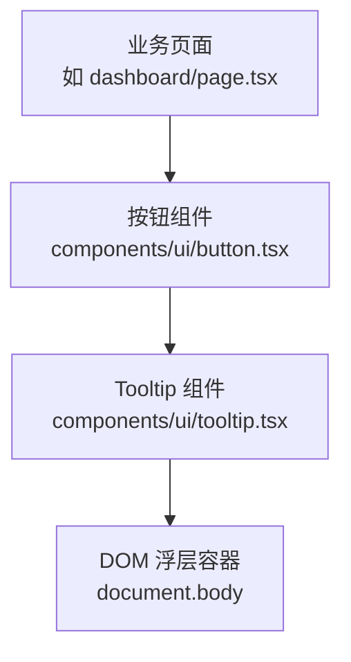
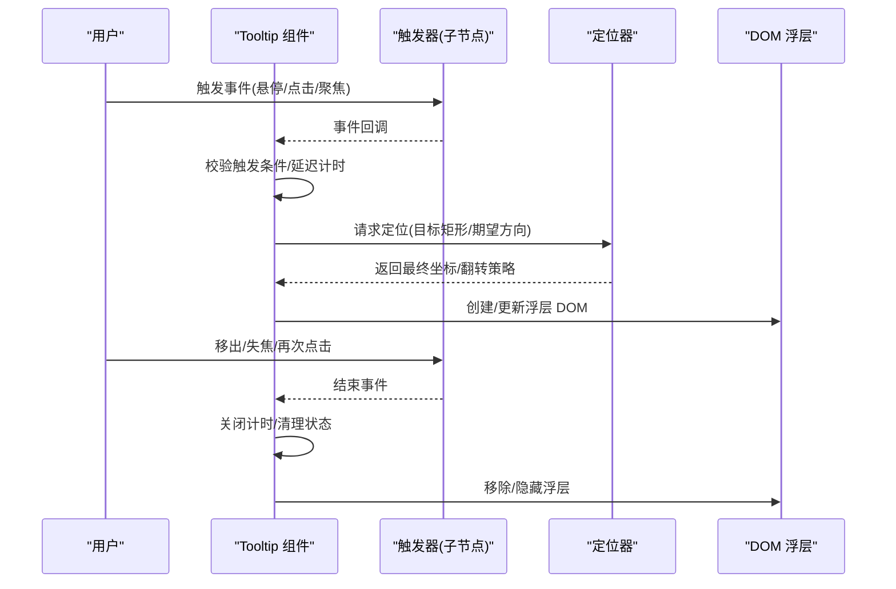
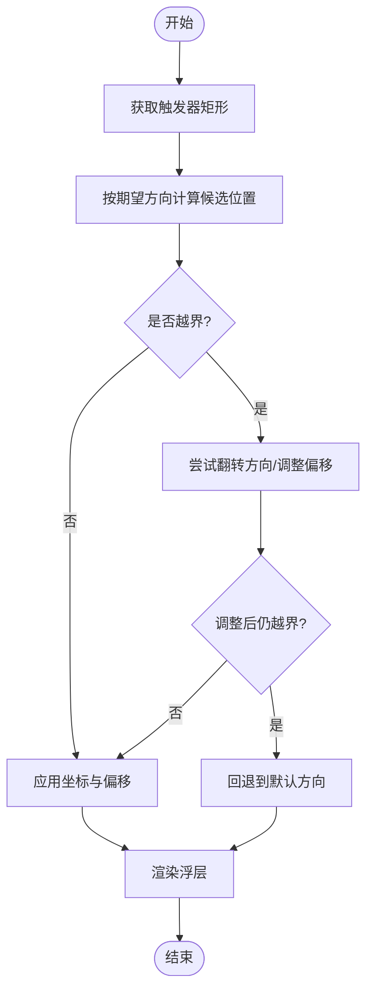
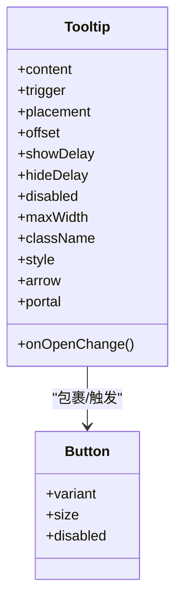

# 提示框组件(Tooltip)

<cite>
**本文引用的文件**   
- [tooltip.tsx](file://frontend_design/src/components/ui/tooltip.tsx)
- [button.tsx](file://frontend_design/src/components/ui/button.tsx)
</cite>

## 目录
1. [简介](#简介)
2. [项目结构](#项目结构)
3. [核心组件](#核心组件)
4. [架构总览](#架构总览)
5. [详细组件分析](#详细组件分析)
6. [依赖关系分析](#依赖关系分析)
7. [性能考虑](#性能考虑)
8. [故障排查指南](#故障排查指南)
9. [结论](#结论)
10. [附录](#附录)

## 简介
本文件为 NexusCockpit 前端应用中的 Tooltip（提示框）组件提供完整文档。内容覆盖触发机制、定位算法与显示控制，支持的交互模式（悬停、点击、焦点），属性接口（提示内容、延迟、位置、样式），智能定位系统（边界检测与自动调整），以及在不同场景下的使用示例与性能优化策略（懒加载与内存管理）。

## 项目结构
Tooltip 组件位于前端 UI 层，作为通用基础组件被业务页面复用。其典型调用路径如下：
- 业务按钮或链接通过 Tooltip 包裹自身，传入提示内容与交互配置
- Tooltip 内部监听用户事件并计算定位，渲染浮层 DOM
- 定位逻辑根据视口与目标元素尺寸进行边界检测与自动翻转

图表来源
- [tooltip.tsx](file://frontend_design/src/components/ui/tooltip.tsx)
- [button.tsx](file://frontend_design/src/components/ui/button.tsx)

章节来源
- [tooltip.tsx](file://frontend_design/src/components/ui/tooltip.tsx)
- [button.tsx](file://frontend_design/src/components/ui/button.tsx)

## 核心组件
- Tooltip 组件
  - 职责：接收触发器（children）、提示内容、交互模式与定位配置，负责事件绑定、显示/隐藏控制与定位计算。
  - 关键能力：
    - 多触发方式：hover、focus、click
    - 显示延迟：进入/离开延迟可配
    - 智能定位：基于视口边界的自动翻转与偏移
    - 样式定制：主题、圆角、阴影、最大宽度等
    - 无障碍：支持键盘导航与屏幕阅读器语义
    - 性能：按需挂载、防抖节流、避免重排抖动

章节来源
- [tooltip.tsx](file://frontend_design/src/components/ui/tooltip.tsx)

## 架构总览
Tooltip 的运行时交互流程如下：

图表来源
- [tooltip.tsx](file://frontend_design/src/components/ui/tooltip.tsx)

## 详细组件分析

### 触发机制与交互模式
- 悬停触发(hover)
  - 鼠标进入触发器时启动“进入延迟”，超时后显示；鼠标离开时启动“离开延迟”，超时后隐藏。
  - 适合信息密度较低、非强操作的辅助说明。
- 点击触发(click)
  - 点击触发器显示，点击外部区域或再次点击触发器隐藏。
  - 适合需要明确确认的场景，避免误触。
- 焦点触发(focus)
  - 元素获得焦点时显示，失去焦点时隐藏。
  - 对键盘操作与无障碍友好，确保 Tab 可达性。

建议：
- 同一 Tooltip 可同时启用 hover 与 focus，但 click 与 hover/focus 组合需谨慎，避免冲突。
- 在移动端优先使用点击触发，减少误触与频繁显隐。

章节来源
- [tooltip.tsx](file://frontend_design/src/components/ui/tooltip.tsx)

### 定位算法与智能定位
- 输入
  - 触发器边界矩形（getBoundingClientRect）
  - 期望方向（上/下/左/右）
  - 间距与偏移量
- 计算
  - 基于视口尺寸与滚动位置，计算候选位置
  - 边界检测：若超出视口则尝试翻转方向或调整偏移
  - 防溢出：限制最大宽度与换行策略
- 输出
  - 最终 top/left 坐标与是否翻转标记
  - 可选箭头对齐修正

图表来源
- [tooltip.tsx](file://frontend_design/src/components/ui/tooltip.tsx)

章节来源
- [tooltip.tsx](file://frontend_design/src/components/ui/tooltip.tsx)

### 显示控制与生命周期
- 状态机
  - 空闲 → 等待显示 → 显示中 → 等待隐藏 → 空闲
- 计时器
  - 进入/离开延迟独立计时，避免闪烁
- 事件去抖
  - 快速进出触发器时合并多次事件，降低重绘开销
- 销毁
  - 组件卸载时清理定时器与事件监听，防止内存泄漏

章节来源
- [tooltip.tsx](file://frontend_design/src/components/ui/tooltip.tsx)

### 属性接口（API）
以下为 Tooltip 常用属性定义与行为说明（类型以实际实现为准）：
- content: ReactNode | string
  - 提示内容，支持富文本或简单字符串
- trigger: 'hover' | 'focus' | 'click' | ('hover'|'focus'|'click')[]
  - 触发方式，支持单选或多选组合
- placement: 'top' | 'bottom' | 'left' | 'right' | 'auto' | 'auto-vertical' | 'auto-horizontal'
  - 期望位置，auto 系列表示由定位器自动选择最佳方向
- offset: number | [number, number]
  - 与触发器的间距，可为统一值或水平/垂直分别设置
- showDelay: number
  - 显示延迟（毫秒）
- hideDelay: number
  - 隐藏延迟（毫秒）
- disabled: boolean
  - 禁用提示显示
- maxWidth: number | string
  - 最大宽度，避免长文本溢出
- className?: string
  - 自定义类名，用于覆盖样式
- style?: CSSProperties
  - 内联样式覆盖
- onOpenChange?(open: boolean): void
  - 打开/关闭回调，便于埋点统计
- arrow?: boolean
  - 是否显示箭头
- portal?: boolean
  - 是否挂载到 document.body 的 Portal 容器中

章节来源
- [tooltip.tsx](file://frontend_design/src/components/ui/tooltip.tsx)

### 使用示例
以下示例展示常见用法，具体代码请参考对应源码路径：
- 按钮提示
  - 将 Tooltip 包裹在按钮外层，传入 content 与 placement
  - 参考：[button.tsx](file://frontend_design/src/components/ui/button.tsx)
- 链接说明
  - 对链接添加 tooltip，解释跳转目标或注意事项
  - 参考：[tooltip.tsx](file://frontend_design/src/components/ui/tooltip.tsx)
- 图标解释
  - 对功能图标增加 tooltip，说明用途与快捷键
  - 参考：[tooltip.tsx](file://frontend_design/src/components/ui/tooltip.tsx)

章节来源
- [tooltip.tsx](file://frontend_design/src/components/ui/tooltip.tsx)
- [button.tsx](file://frontend_design/src/components/ui/button.tsx)

### 无障碍与键盘交互
- 键盘可达性
  - 支持 Tab 聚焦触发器，Enter/Space 模拟点击触发
  - Esc 关闭浮层
- 屏幕阅读器
  - 为触发器与浮层提供合适的 aria-* 属性，提升可读性
- 焦点管理
  - 关闭时恢复焦点至触发器，避免焦点丢失

章节来源
- [tooltip.tsx](file://frontend_design/src/components/ui/tooltip.tsx)

## 依赖关系分析
Tooltip 与周边组件的关系如下：

图表来源
- [tooltip.tsx](file://frontend_design/src/components/ui/tooltip.tsx)
- [button.tsx](file://frontend_design/src/components/ui/button.tsx)

章节来源
- [tooltip.tsx](file://frontend_design/src/components/ui/tooltip.tsx)
- [button.tsx](file://frontend_design/src/components/ui/button.tsx)

## 性能考虑
- 懒加载与按需挂载
  - 仅在首次显示时创建浮层 DOM，隐藏时可选择保留或销毁，平衡首屏与内存占用
- 防抖与节流
  - 对 mouseenter/mouseleave 与 resize/scroll 事件做节流，减少重排
- 避免布局抖动
  - 使用 transform 与 opacity 控制显隐，避免直接修改导致回流
- 事件委托与一次性监听
  - 点击外部关闭仅注册一次，并在组件卸载时移除
- 大文本处理
  - 超长内容采用截断与省略号，必要时分页或弹窗承载
- 内存管理
  - 组件卸载时清理定时器、事件监听与 DOM 引用，防止泄漏

章节来源
- [tooltip.tsx](file://frontend_design/src/components/ui/tooltip.tsx)

## 故障排查指南
- 浮层被遮挡
  - 检查父级 overflow 与 z-index 层级，必要时启用 portal 挂载到 body
- 定位异常
  - 确认触发器可见且尺寸正确，避免 display:none 或零宽高
  - 在动态布局（如抽屉、模态框）中重新计算定位
- 频繁闪烁
  - 调整 showDelay/hideDelay，增大延迟阈值
  - 检查 hover 与 click 同时启用的冲突场景
- 键盘不可用
  - 确保触发器可聚焦，并提供合适的 aria 属性
- 移动端误触
  - 优先使用 click 触发，避免 hover 带来的误判

章节来源
- [tooltip.tsx](file://frontend_design/src/components/ui/tooltip.tsx)

## 结论
Tooltip 作为轻量级的信息提示组件，通过灵活的触发方式、可靠的智能定位与完善的无障碍支持，能够覆盖大多数业务场景。结合延迟控制、事件节流与按需挂载等优化手段，可在保证用户体验的同时维持良好的性能表现。

## 附录
- 最佳实践
  - 文案简洁明了，控制在两行以内
  - 合理设置 placement，优先靠近触发器
  - 对复杂操作提供明确的二次确认，而非仅靠 tooltip
- 常见问题
  - 在滚动容器中定位漂移：使用固定定位或 portal 解决
  - 嵌套 Tooltip 冲突：避免多层嵌套，必要时拆分交互