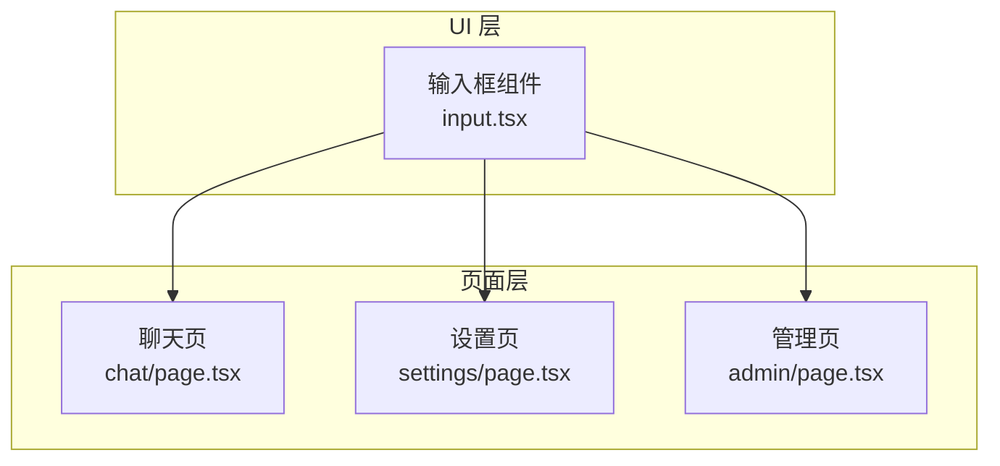
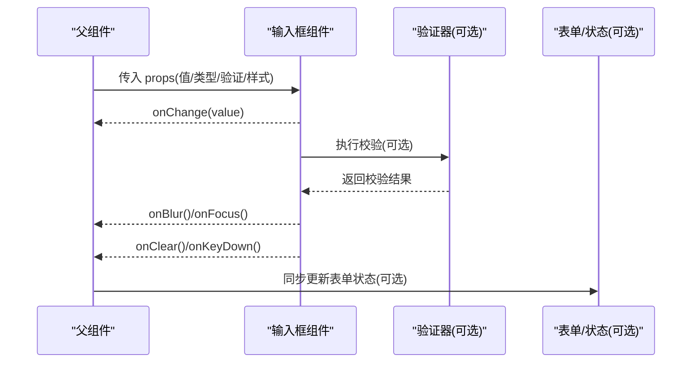
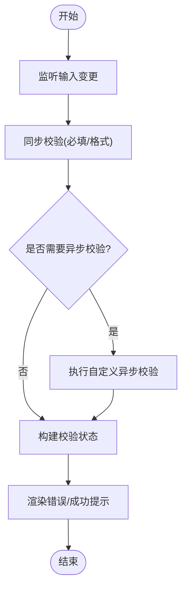
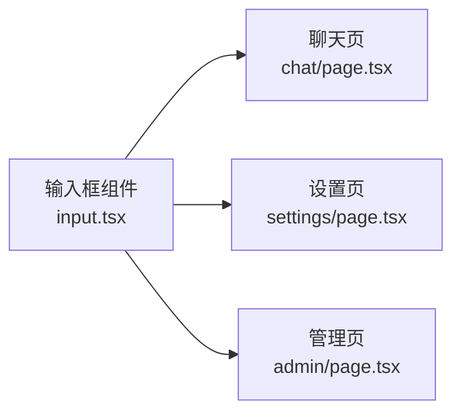

# 输入框组件(Input)

<cite>
**本文引用的文件**   
- [frontend_design/src/components/ui/input.tsx](file://frontend_design/src/components/ui/input.tsx)
- [frontend_design/src/app/chat/page.tsx](file://frontend_design/src/app/chat/page.tsx)
- [frontend_design/src/app/settings/page.tsx](file://frontend_design/src/app/settings/page.tsx)
- [frontend_design/src/app/admin/page.tsx](file://frontend_design/src/app/admin/page.tsx)
</cite>

## 目录
1. [简介](#简介)
2. [项目结构](#项目结构)
3. [核心组件](#核心组件)
4. [架构总览](#架构总览)
5. [详细组件分析](#详细组件分析)
6. [依赖关系分析](#依赖关系分析)
7. [性能考虑](#性能考虑)
8. [故障排查指南](#故障排查指南)
9. [结论](#结论)
10. [附录](#附录)

## 简介
本章节面向 NexusCockpit 前端应用中的输入框组件（Input），提供从基础能力到高级用法的完整文档。内容覆盖：
- 支持的输入类型与格式化能力
- 属性接口与状态控制（占位符、默认值、禁用、只读等）
- 输入验证规则（必填、格式、自定义函数）
- 错误提示与成功状态的视觉反馈
- 表单集成、实时搜索、自动完成等典型场景
- 可访问性支持（标签关联、ARIA 属性、键盘导航）

## 项目结构
输入框组件位于前端 UI 层，作为通用基础组件被页面级功能复用。下图展示了组件在工程中的位置及主要使用方。

图表来源
- [frontend_design/src/components/ui/input.tsx](file://frontend_design/src/components/ui/input.tsx)
- [frontend_design/src/app/chat/page.tsx](file://frontend_design/src/app/chat/page.tsx)
- [frontend_design/src/app/settings/page.tsx](file://frontend_design/src/app/settings/page.tsx)
- [frontend_design/src/app/admin/page.tsx](file://frontend_design/src/app/admin/page.tsx)

章节来源
- [frontend_design/src/components/ui/input.tsx](file://frontend_design/src/components/ui/input.tsx)
- [frontend_design/src/app/chat/page.tsx](file://frontend_design/src/app/chat/page.tsx)
- [frontend_design/src/app/settings/page.tsx](file://frontend_design/src/app/settings/page.tsx)
- [frontend_design/src/app/admin/page.tsx](file://frontend_design/src/app/admin/page.tsx)

## 核心组件
本节聚焦 Input 组件的核心职责与对外能力：
- 基础输入：文本、密码、数字、邮箱等类型
- 状态控制：占位符、默认值、禁用、只读
- 验证与反馈：必填、格式、自定义校验；错误/成功提示
- 交互增强：前缀/后缀、清除按钮、自动聚焦、大小与样式变体
- 可访问性：标签关联、ARIA 属性、键盘导航

章节来源
- [frontend_design/src/components/ui/input.tsx](file://frontend_design/src/components/ui/input.tsx)

## 架构总览
Input 组件采用“受控 + 非受控”双模式设计，既可作为独立控件直接渲染，也可与上层表单库或状态管理集成。其数据流遵循单向数据流原则：父组件通过 props 驱动输入值与状态，子组件通过回调事件向上汇报变化。

图表来源
- [frontend_design/src/components/ui/input.tsx](file://frontend_design/src/components/ui/input.tsx)
- [frontend_design/src/app/chat/page.tsx](file://frontend_design/src/app/chat/page.tsx)
- [frontend_design/src/app/settings/page.tsx](file://frontend_design/src/app/settings/page.tsx)
- [frontend_design/src/app/admin/page.tsx](file://frontend_design/src/app/admin/page.tsx)

## 详细组件分析

### 组件能力与属性接口
- 输入类型
  - 文本输入：适用于自由文本
  - 密码输入：隐藏字符显示
  - 数字输入：限制为数值，支持整数/小数
  - 邮箱输入：内置邮箱格式校验
- 常用属性
  - 占位符：未输入时的提示文案
  - 默认值：非受控模式下的初始值
  - 禁用状态：不可编辑且不可聚焦
  - 只读模式：可聚焦但不可修改
  - 前缀/后缀：图标或文字装饰
  - 清除按钮：一键清空输入
  - 尺寸与样式：紧凑/常规/宽松；边框颜色与圆角
- 事件回调
  - 变更：onChange
  - 焦点：onFocus/onBlur
  - 键盘：onKeyDown
  - 清除：onClear
- 验证与反馈
  - 必填校验
  - 格式校验（如邮箱、手机号等）
  - 自定义校验函数
  - 错误/成功提示文案与样式

章节来源
- [frontend_design/src/components/ui/input.tsx](file://frontend_design/src/components/ui/input.tsx)

### 输入验证流程
输入验证在用户输入、失焦或提交时触发，支持同步与异步校验。

图表来源
- [frontend_design/src/components/ui/input.tsx](file://frontend_design/src/components/ui/input.tsx)

### 使用场景与示例路径
以下为常见集成场景的入口文件路径，便于快速定位实际用法：
- 表单集成：用于注册、登录、设置等表单字段
  - [frontend_design/src/app/settings/page.tsx](file://frontend_design/src/app/settings/page.tsx)
  - [frontend_design/src/app/admin/page.tsx](file://frontend_design/src/app/admin/page.tsx)
- 实时搜索：结合防抖与远程检索
  - [frontend_design/src/app/chat/page.tsx](file://frontend_design/src/app/chat/page.tsx)
- 自动完成：基于本地或远端建议列表
  - [frontend_design/src/app/chat/page.tsx](file://frontend_design/src/app/chat/page.tsx)

章节来源
- [frontend_design/src/app/chat/page.tsx](file://frontend_design/src/app/chat/page.tsx)
- [frontend_design/src/app/settings/page.tsx](file://frontend_design/src/app/settings/page.tsx)
- [frontend_design/src/app/admin/page.tsx](file://frontend_design/src/app/admin/page.tsx)

### 可访问性支持
- 标签关联：通过 htmlFor 与 id 将 label 与 input 绑定
- ARIA 属性：aria-invalid、aria-describedby、aria-required 等
- 键盘导航：Tab 切换、Enter 提交、Esc 关闭弹窗（若存在）
- 屏幕阅读器友好：语义化结构与提示文案

章节来源
- [frontend_design/src/components/ui/input.tsx](file://frontend_design/src/components/ui/input.tsx)

## 依赖关系分析
Input 组件作为基础 UI 组件，被多个页面模块引用。下图展示其在当前仓库中的依赖方向。

图表来源
- [frontend_design/src/components/ui/input.tsx](file://frontend_design/src/components/ui/input.tsx)
- [frontend_design/src/app/chat/page.tsx](file://frontend_design/src/app/chat/page.tsx)
- [frontend_design/src/app/settings/page.tsx](file://frontend_design/src/app/settings/page.tsx)
- [frontend_design/src/app/admin/page.tsx](file://frontend_design/src/app/admin/page.tsx)

章节来源
- [frontend_design/src/components/ui/input.tsx](file://frontend_design/src/components/ui/input.tsx)
- [frontend_design/src/app/chat/page.tsx](file://frontend_design/src/app/chat/page.tsx)
- [frontend_design/src/app/settings/page.tsx](file://frontend_design/src/app/settings/page.tsx)
- [frontend_design/src/app/admin/page.tsx](file://frontend_design/src/app/admin/page.tsx)

## 性能考虑
- 受控与非受控选择：高频输入建议使用非受控模式减少重渲染
- 防抖与节流：搜索类输入应配合防抖，避免频繁请求
- 懒加载建议：自动完成建议列表按需加载
- 样式与主题：避免在每次渲染中创建新样式对象

## 故障排查指南
- 无法输入或无响应
  - 检查是否处于禁用或只读状态
  - 确认父组件是否正确传递受控值与 onChange
- 校验不生效
  - 核对必填与格式规则配置
  - 检查自定义校验函数返回值与异常处理
- 提示不显示
  - 确认错误/成功文案与描述元素 id 正确绑定
  - 检查 aria-describedby 指向是否存在
- 键盘操作异常
  - 验证 onKeyDown 是否阻止默认行为
  - 确认 Tab/Enter/Esc 等行为是否符合预期

章节来源
- [frontend_design/src/components/ui/input.tsx](file://frontend_design/src/components/ui/input.tsx)

## 结论
Input 组件提供了完善的输入能力与可访问性支持，既能满足简单表单字段需求，也能支撑复杂交互场景（如实时搜索与自动完成）。通过合理的受控/非受控策略与校验机制，可在保证用户体验的同时提升性能与稳定性。

## 附录
- 最佳实践
  - 始终为输入框提供清晰的标签与提示
  - 对敏感信息使用密码输入类型
  - 为关键输入提供即时反馈与帮助文案
  - 在移动端优化输入体验（输入法类型、自动大写等）