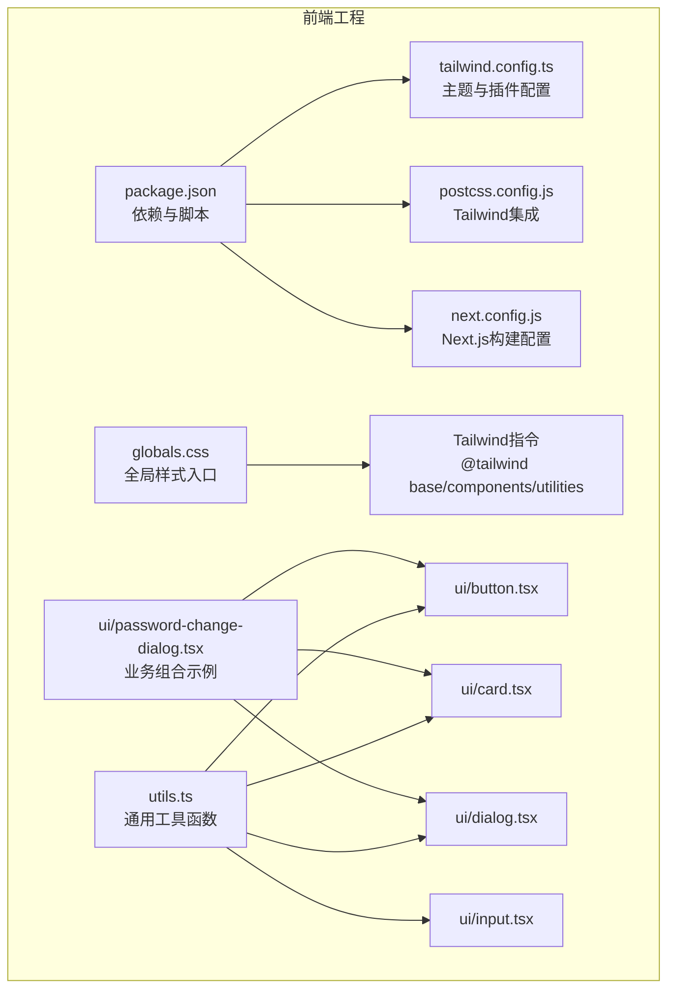
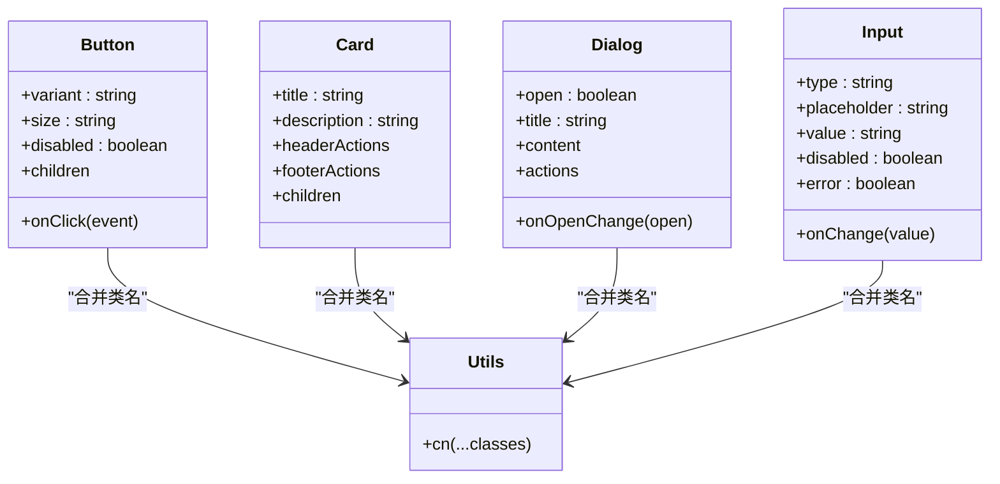
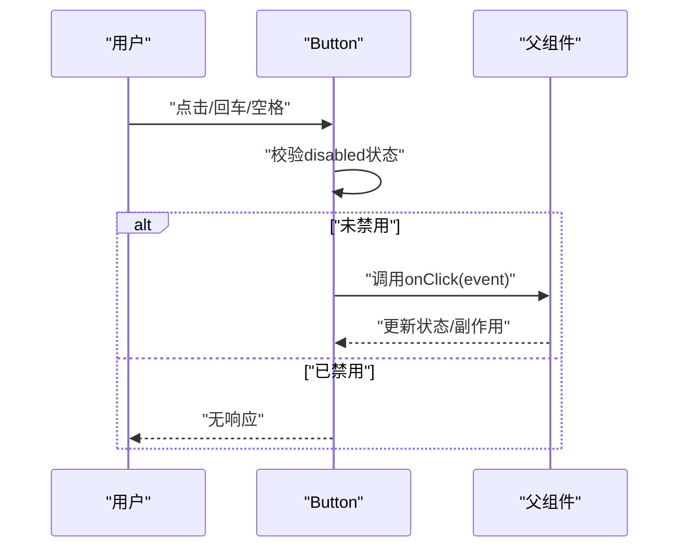
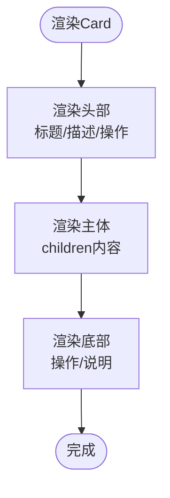
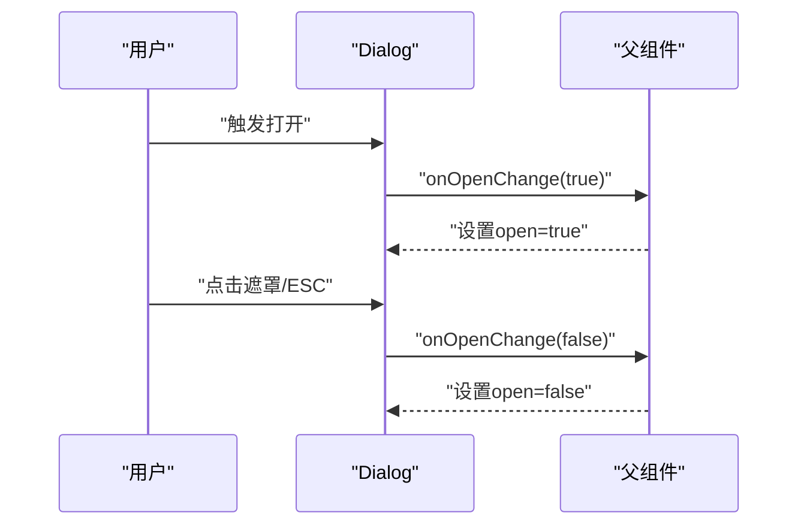
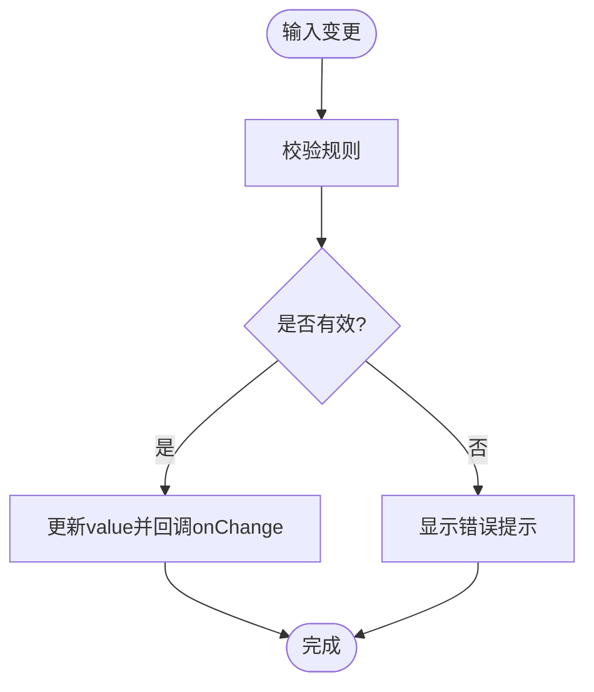
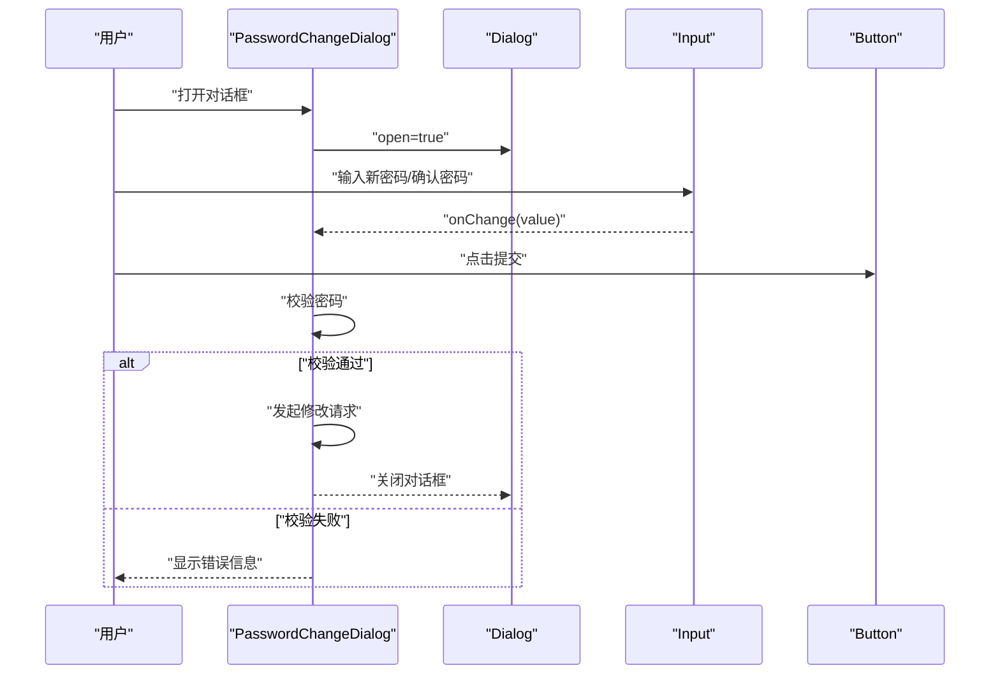
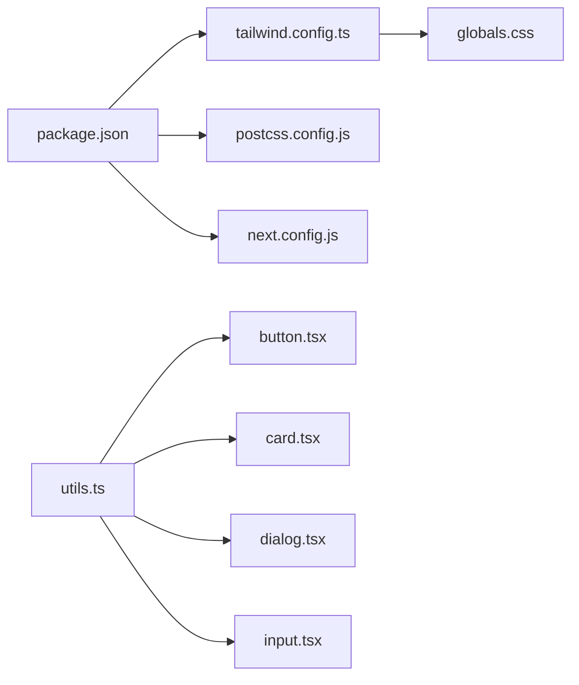

# UI组件系统

<cite>
**本文引用的文件**   
- [frontend_design/src/components/ui/button.tsx](file://frontend_design/src/components/ui/button.tsx)
- [frontend_design/src/components/ui/card.tsx](file://frontend_design/src/components/ui/card.tsx)
- [frontend_design/src/components/ui/dialog.tsx](file://frontend_design/src/components/ui/dialog.tsx)
- [frontend_design/src/components/ui/input.tsx](file://frontend_design/src/components/ui/input.tsx)
- [frontend_design/src/components/ui/password-change-dialog.tsx](file://frontend_design/src/components/ui/password-change-dialog.tsx)
- [frontend_design/tailwind.config.ts](file://frontend_design/tailwind.config.ts)
- [frontend_design/postcss.config.js](file://frontend_design/postcss.config.js)
- [frontend_design/package.json](file://frontend_design/package.json)
- [frontend_design/next.config.js](file://frontend_design/next.config.js)
- [frontend_design/src/app/globals.css](file://frontend_design/src/app/globals.css)
- [frontend_design/src/lib/utils.ts](file://frontend_design/src/lib/utils.ts)
</cite>

## 目录
1. [简介](#简介)
2. [项目结构](#项目结构)
3. [核心组件](#核心组件)
4. [架构总览](#架构总览)
5. [详细组件分析](#详细组件分析)
6. [依赖关系分析](#依赖关系分析)
7. [性能考虑](#性能考虑)
8. [故障排查指南](#故障排查指南)
9. [结论](#结论)
10. [附录](#附录)

## 简介
本文件面向前端开发者与UI工程师，系统化阐述基于TailwindCSS的UI组件设计与样式规范。文档覆盖基础组件（按钮、卡片、对话框、输入框）的属性接口与使用方法，主题与尺寸变体、样式覆盖机制、组合模式与复用策略，以及开发规范、测试方法与无障碍访问、跨浏览器兼容性建议。目标是帮助团队在Next.js + TailwindCSS技术栈下，构建一致、可维护、可扩展的UI体系。

## 项目结构
前端采用Next.js应用，UI组件集中于src/components/ui目录，样式由TailwindCSS驱动并通过PostCSS集成。全局样式入口位于src/app/globals.css，工具函数位于src/lib/utils.ts。

图表来源
- [frontend_design/package.json](file://frontend_design/package.json)
- [frontend_design/tailwind.config.ts](file://frontend_design/tailwind.config.ts)
- [frontend_design/postcss.config.js](file://frontend_design/postcss.config.js)
- [frontend_design/next.config.js](file://frontend_design/next.config.js)
- [frontend_design/src/app/globals.css](file://frontend_design/src/app/globals.css)
- [frontend_design/src/lib/utils.ts](file://frontend_design/src/lib/utils.ts)
- [frontend_design/src/components/ui/button.tsx](file://frontend_design/src/components/ui/button.tsx)
- [frontend_design/src/components/ui/card.tsx](file://frontend_design/src/components/ui/card.tsx)
- [frontend_design/src/components/ui/dialog.tsx](file://frontend_design/src/components/ui/dialog.tsx)
- [frontend_design/src/components/ui/input.tsx](file://frontend_design/src/components/ui/input.tsx)
- [frontend_design/src/components/ui/password-change-dialog.tsx](file://frontend_design/src/components/ui/password-change-dialog.tsx)

章节来源
- [frontend_design/package.json](file://frontend_design/package.json)
- [frontend_design/tailwind.config.ts](file://frontend_design/tailwind.config.ts)
- [frontend_design/postcss.config.js](file://frontend_design/postcss.config.js)
- [frontend_design/next.config.js](file://frontend_design/next.config.js)
- [frontend_design/src/app/globals.css](file://frontend_design/src/app/globals.css)
- [frontend_design/src/lib/utils.ts](file://frontend_design/src/lib/utils.ts)

## 核心组件
本节聚焦基础UI组件：Button、Card、Dialog、Input。每个组件均遵循以下设计原则：
- 以Tailwind原子类为主，结合className透传实现样式覆盖
- 通过props暴露最小必要属性集，保持API稳定
- 使用语义化HTML标签与ARIA属性，保障可访问性
- 提供尺寸变体与状态反馈（默认、悬停、禁用等）

章节来源
- [frontend_design/src/components/ui/button.tsx](file://frontend_design/src/components/ui/button.tsx)
- [frontend_design/src/components/ui/card.tsx](file://frontend_design/src/components/ui/card.tsx)
- [frontend_design/src/components/ui/dialog.tsx](file://frontend_design/src/components/ui/dialog.tsx)
- [frontend_design/src/components/ui/input.tsx](file://frontend_design/src/components/ui/input.tsx)

## 架构总览
组件层与样式系统的交互关系如下：

图表来源
- [frontend_design/src/components/ui/button.tsx](file://frontend_design/src/components/ui/button.tsx)
- [frontend_design/src/components/ui/card.tsx](file://frontend_design/src/components/ui/card.tsx)
- [frontend_design/src/components/ui/dialog.tsx](file://frontend_design/src/components/ui/dialog.tsx)
- [frontend_design/src/components/ui/input.tsx](file://frontend_design/src/components/ui/input.tsx)
- [frontend_design/src/lib/utils.ts](file://frontend_design/src/lib/utils.ts)

## 详细组件分析

### Button 按钮
- 职责：提供可点击的交互元素，支持多种视觉变体与尺寸
- 关键属性
  - variant：主按钮、次按钮、危险等
  - size：默认、小、大
  - disabled：禁用态
  - onClick：点击回调
  - className：外部样式覆盖
- 行为与状态
  - 默认/悬停/按下/禁用状态的颜色与阴影变化
  - 键盘可达性与焦点样式
- 组合与复用
  - 可与Icon组合，作为表单提交或导航触发器
- 可访问性
  - 使用button语义标签，确保tabindex与aria-*正确设置
- 样式覆盖
  - 通过className透传，优先覆盖内部Tailwind类

图表来源
- [frontend_design/src/components/ui/button.tsx](file://frontend_design/src/components/ui/button.tsx)

章节来源
- [frontend_design/src/components/ui/button.tsx](file://frontend_design/src/components/ui/button.tsx)

### Card 卡片
- 职责：承载内容区块，常用于信息展示与操作分组
- 关键属性
  - title/description：标题与描述
  - headerActions/footerActions：头部与尾部操作区
  - children：自定义内容区域
  - className：样式覆盖
- 布局与结构
  - 头部、主体、底部三段式布局
  - 内边距与圆角统一，适配不同屏幕
- 可访问性
  - 使用article或section语义，必要时添加role与aria-labelledby
- 组合与复用
  - 与Button、Input等组合形成表单卡片、统计卡片等

图表来源
- [frontend_design/src/components/ui/card.tsx](file://frontend_design/src/components/ui/card.tsx)

章节来源
- [frontend_design/src/components/ui/card.tsx](file://frontend_design/src/components/ui/card.tsx)

### Dialog 对话框
- 职责：模态弹窗，用于确认、提示、表单录入等场景
- 关键属性
  - open/onOpenChange：受控打开关闭
  - title：标题
  - content：内容区域
  - actions：操作按钮集合
- 行为与状态
  - 打开时锁定滚动、捕获焦点、Esc关闭
  - 关闭后恢复焦点与滚动
- 可访问性
  - 使用dialog语义，设置aria-modal、aria-labelledby、aria-describedby
- 组合与复用
  - 与Form、Input、Button组合为登录、设置等对话框

图表来源
- [frontend_design/src/components/ui/dialog.tsx](file://frontend_design/src/components/ui/dialog.tsx)

章节来源
- [frontend_design/src/components/ui/dialog.tsx](file://frontend_design/src/components/ui/dialog.tsx)

### Input 输入框
- 职责：文本输入控件，支持多种类型与状态
- 关键属性
  - type：text/password/email等
  - placeholder：占位符
  - value/onChange：受控值与变更回调
  - disabled/error：禁用与错误态
  - className：样式覆盖
- 行为与状态
  - 聚焦高亮、错误边框与提示文案
  - 与Label配合，提升可访问性
- 可访问性
  - 关联label的htmlFor/id，错误时设置aria-invalid与aria-describedby
- 组合与复用
  - 与Form、Button组合为搜索、筛选、表单等

图表来源
- [frontend_design/src/components/ui/input.tsx](file://frontend_design/src/components/ui/input.tsx)

章节来源
- [frontend_design/src/components/ui/input.tsx](file://frontend_design/src/components/ui/input.tsx)

### PasswordChangeDialog 密码修改对话框（组合示例）
- 职责：封装密码修改流程，组合Dialog、Input、Button等基础组件
- 组成
  - Dialog：承载表单与操作
  - Input：新密码、确认密码输入
  - Button：提交与取消
- 业务逻辑
  - 密码强度校验、一致性校验
  - 提交后关闭对话框并提示结果

图表来源
- [frontend_design/src/components/ui/password-change-dialog.tsx](file://frontend_design/src/components/ui/password-change-dialog.tsx)
- [frontend_design/src/components/ui/dialog.tsx](file://frontend_design/src/components/ui/dialog.tsx)
- [frontend_design/src/components/ui/input.tsx](file://frontend_design/src/components/ui/input.tsx)
- [frontend_design/src/components/ui/button.tsx](file://frontend_design/src/components/ui/button.tsx)

章节来源
- [frontend_design/src/components/ui/password-change-dialog.tsx](file://frontend_design/src/components/ui/password-change-dialog.tsx)

## 依赖关系分析
- 组件对工具函数的依赖
  - 所有基础组件通过工具函数合并类名，保证样式覆盖优先级与去重
- 样式系统依赖
  - TailwindCSS负责原子类生成，PostCSS将其注入到构建管线
  - Next.js通过配置文件启用Tailwind与全局样式
- 第三方依赖
  - package.json中声明了Tailwind、PostCSS、Next.js等依赖

图表来源
- [frontend_design/package.json](file://frontend_design/package.json)
- [frontend_design/tailwind.config.ts](file://frontend_design/tailwind.config.ts)
- [frontend_design/postcss.config.js](file://frontend_design/postcss.config.js)
- [frontend_design/next.config.js](file://frontend_design/next.config.js)
- [frontend_design/src/app/globals.css](file://frontend_design/src/app/globals.css)
- [frontend_design/src/lib/utils.ts](file://frontend_design/src/lib/utils.ts)
- [frontend_design/src/components/ui/button.tsx](file://frontend_design/src/components/ui/button.tsx)
- [frontend_design/src/components/ui/card.tsx](file://frontend_design/src/components/ui/card.tsx)
- [frontend_design/src/components/ui/dialog.tsx](file://frontend_design/src/components/ui/dialog.tsx)
- [frontend_design/src/components/ui/input.tsx](file://frontend_design/src/components/ui/input.tsx)

章节来源
- [frontend_design/package.json](file://frontend_design/package.json)
- [frontend_design/tailwind.config.ts](file://frontend_design/tailwind.config.ts)
- [frontend_design/postcss.config.js](file://frontend_design/postcss.config.js)
- [frontend_design/next.config.js](file://frontend_design/next.config.js)
- [frontend_design/src/app/globals.css](file://frontend_design/src/app/globals.css)
- [frontend_design/src/lib/utils.ts](file://frontend_design/src/lib/utils.ts)

## 性能考虑
- 样式体积
  - 使用Tailwind按需生成类，避免冗余CSS；合理拆分页面级样式
- 组件渲染
  - 避免在高频事件回调中创建对象或复杂计算；将稳定逻辑提升到useMemo/useCallback
- 交互体验
  - 对话框打开/关闭动画尽量轻量；输入框防抖处理长文本输入
- 资源加载
  - 图标与图片懒加载；按需引入字体与第三方库

[本节为通用指导，不直接分析具体文件]

## 故障排查指南
- 样式未生效
  - 检查Tailwind指令是否正确注入到全局样式
  - 确认className透传未被覆盖或冲突
- 对话框无法关闭
  - 检查open状态是否受控，onOpenChange是否被正确调用
  - 验证焦点管理与Esc键监听
- 输入框校验异常
  - 检查value/onChange绑定是否正确
  - 确认错误态的aria属性与提示文案同步
- 构建问题
  - 核对package.json依赖版本与PostCSS/Tailwind配置匹配
  - 清理缓存后重新安装依赖

章节来源
- [frontend_design/src/app/globals.css](file://frontend_design/src/app/globals.css)
- [frontend_design/src/components/ui/dialog.tsx](file://frontend_design/src/components/ui/dialog.tsx)
- [frontend_design/src/components/ui/input.tsx](file://frontend_design/src/components/ui/input.tsx)
- [frontend_design/package.json](file://frontend_design/package.json)
- [frontend_design/postcss.config.js](file://frontend_design/postcss.config.js)

## 结论
本UI组件系统以TailwindCSS为核心，结合Next.js与PostCSS构建高效、一致的界面层。基础组件提供稳定的属性接口与可访问性支持，通过工具函数实现灵活的样式覆盖与组合复用。建议在团队内推广统一的开发规范与测试方法，持续完善主题与尺寸变体，以提升整体交付质量与可维护性。

[本节为总结性内容，不直接分析具体文件]

## 附录

### 主题与尺寸变体
- 主题色
  - 在Tailwind配置中扩展颜色变量，供组件variant使用
- 尺寸
  - 定义sm/md/lg三类尺寸，统一内边距、字号与行高
- 深色模式
  - 使用Tailwind dark:前缀或数据属性切换，确保对比度达标

章节来源
- [frontend_design/tailwind.config.ts](file://frontend_design/tailwind.config.ts)

### 样式覆盖机制
- 推荐做法
  - 组件内部使用固定类名，外层通过className追加或覆盖
  - 使用工具函数合并类名，避免重复与冲突
- 注意事项
  - 谨慎使用!important；优先调整类名顺序与特异性

章节来源
- [frontend_design/src/lib/utils.ts](file://frontend_design/src/lib/utils.ts)

### 组合模式与复用策略
- 组合模式
  - 将基础组件拼装为业务组件（如密码修改对话框），降低耦合
- 复用策略
  - 抽取通用布局容器与表单模板，减少重复代码
  - 通过props插槽传递头部/尾部操作区，增强灵活性

章节来源
- [frontend_design/src/components/ui/password-change-dialog.tsx](file://frontend_design/src/components/ui/password-change-dialog.tsx)
- [frontend_design/src/components/ui/card.tsx](file://frontend_design/src/components/ui/card.tsx)

### 开发规范
- 命名
  - 组件文件以小写短横线命名，导出默认组件
- Props
  - 明确必填与可选属性，提供默认值与类型约束
- 可访问性
  - 使用语义化标签与ARIA属性，确保键盘可达与屏幕阅读器友好
- 样式
  - 优先使用Tailwind原子类，必要时在组件内集中定义样式块

章节来源
- [frontend_design/src/components/ui/button.tsx](file://frontend_design/src/components/ui/button.tsx)
- [frontend_design/src/components/ui/input.tsx](file://frontend_design/src/components/ui/input.tsx)
- [frontend_design/src/components/ui/dialog.tsx](file://frontend_design/src/components/ui/dialog.tsx)
- [frontend_design/src/components/ui/card.tsx](file://frontend_design/src/components/ui/card.tsx)

### 测试方法
- 单元测试
  - 断言组件渲染结构与属性行为（如禁用态不可点击）
- 交互测试
  - 模拟用户操作（点击、键盘、输入）验证状态流转
- 可访问性测试
  - 检查ARIA属性与焦点管理是否符合标准
- 快照测试
  - 对比组件输出快照，防止意外回归

[本节为通用指导，不直接分析具体文件]

### 无障碍访问支持
- 语义化标签
  - 使用button、dialog、input、article等原生语义
- ARIA属性
  - 为模态与表单元素设置aria-modal、aria-labelledby、aria-describedby、aria-invalid等
- 键盘可达性
  - 支持Tab导航、Enter/Space触发、Esc关闭对话框
- 焦点管理
  - 打开对话框时聚焦首个可交互元素，关闭后恢复原焦点

章节来源
- [frontend_design/src/components/ui/dialog.tsx](file://frontend_design/src/components/ui/dialog.tsx)
- [frontend_design/src/components/ui/input.tsx](file://frontend_design/src/components/ui/input.tsx)
- [frontend_design/src/components/ui/button.tsx](file://frontend_design/src/components/ui/button.tsx)

### 跨浏览器兼容性
- 现代浏览器
  - 目标Chrome/Firefox/Safari/Edge最新两个版本
- Polyfill与降级
  - 针对旧版浏览器提供必要的Polyfill与降级方案
- 特性检测
  - 对高级CSS/JS特性进行能力检测与回退

[本节为通用指导，不直接分析具体文件]