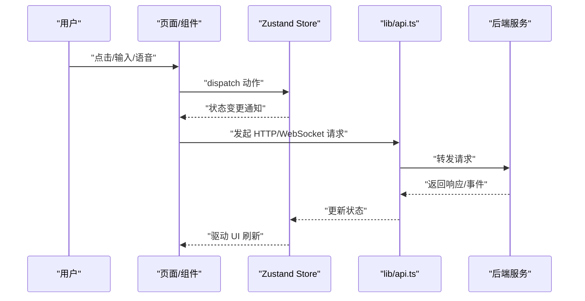
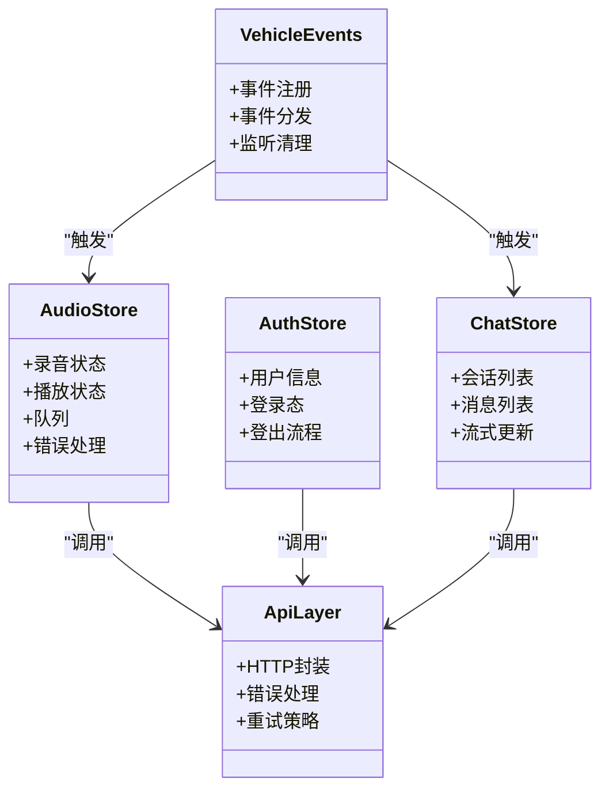
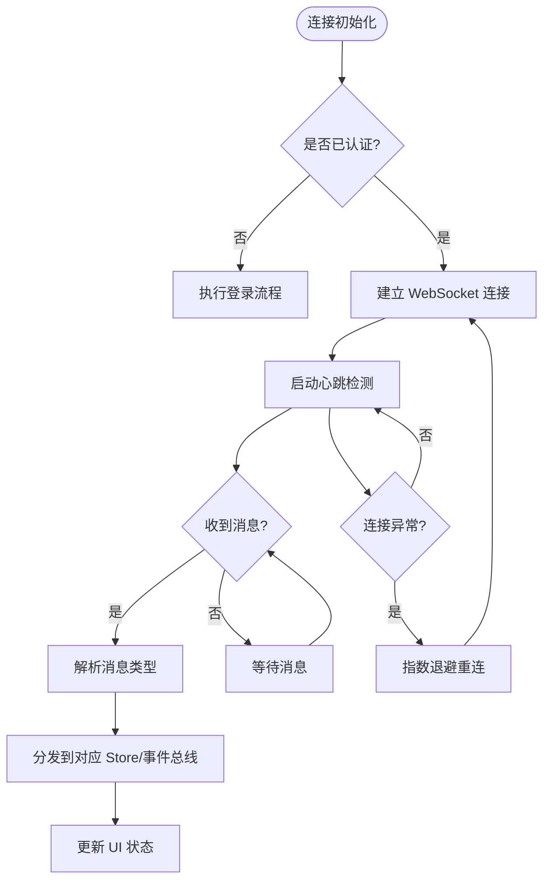
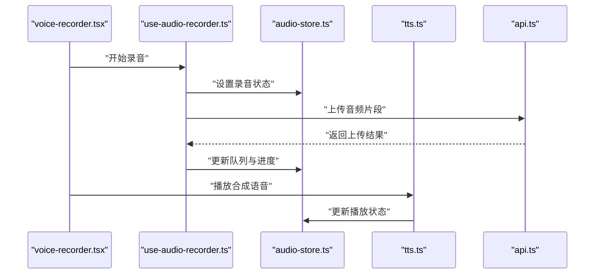
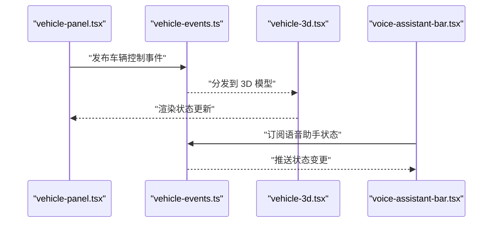
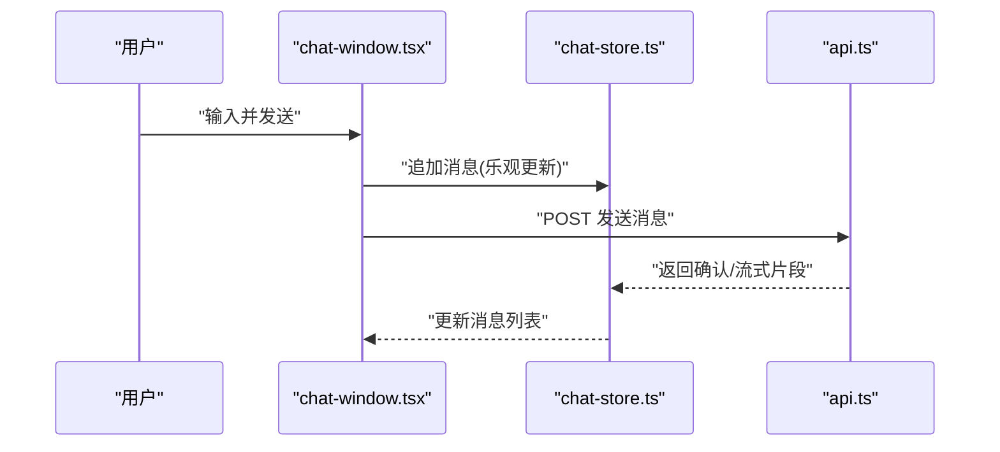
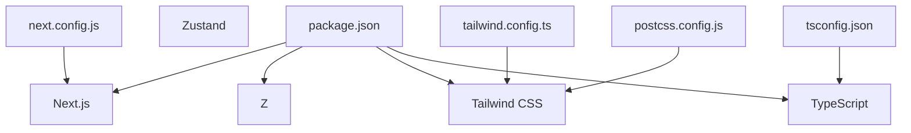

# 前端应用架构

<cite>
**本文引用的文件**   
- [frontend_design/src/app/layout.tsx](file://frontend_design/src/app/layout.tsx)
- [frontend_design/src/app/page.tsx](file://frontend_design/src/app/page.tsx)
- [frontend_design/src/app/chat/page.tsx](file://frontend_design/src/app/chat/page.tsx)
- [frontend_design/src/app/cockpit/page.tsx](file://frontend_design/src/app/cockpit/page.tsx)
- [frontend_design/src/app/dashboard/page.tsx](file://frontend_design/src/app/dashboard/page.tsx)
- [frontend_design/src/app/admin/page.tsx](file://frontend_design/src/app/admin/page.tsx)
- [frontend_design/src/app/dataplatform/page.tsx](file://frontend_design/src/app/dataplatform/page.tsx)
- [frontend_design/src/app/middleware/page.tsx](file://frontend_design/src/app/middleware/page.tsx)
- [frontend_design/src/app/settings/page.tsx](file://frontend_design/src/app/settings/page.tsx)
- [frontend_design/src/app/vehicle/page.tsx](file://frontend_design/src/app/vehicle/page.tsx)
- [frontend_design/src/components/layout/sidebar.tsx](file://frontend_design/src/components/layout/sidebar.tsx)
- [frontend_design/src/components/layout/gps-provider.tsx](file://frontend_design/src/components/layout/gps-provider.tsx)
- [frontend_design/src/components/ui/button.tsx](file://frontend_design/src/components/ui/button.tsx)
- [frontend_design/src/components/ui/card.tsx](file://frontend_design/src/components/ui/card.tsx)
- [frontend_design/src/components/ui/dialog.tsx](file://frontend_design/src/components/ui/dialog.tsx)
- [frontend_design/src/components/ui/input.tsx](file://frontend_design/src/components/ui/input.tsx)
- [frontend_design/src/components/ui/password-change-dialog.tsx](file://frontend_design/src/components/ui/password-change-dialog.tsx)
- [frontend_design/src/components/ui/tooltip.tsx](file://frontend_design/src/components/ui/tooltip.tsx)
- [frontend_design/src/components/chat/chat-window.tsx](file://frontend_design/src/components/chat/chat-window.tsx)
- [frontend_design/src/components/voice-recorder.tsx](file://frontend_design/src/components/voice-recorder.tsx)
- [frontend_design/src/components/vehicle/vehicle-3d.tsx](file://frontend_design/src/components/vehicle/vehicle-3d.tsx)
- [frontend_design/src/components/vehicle/vehicle-panel.tsx](file://frontend_design/src/components/vehicle/vehicle-panel.tsx)
- [frontend_design/src/components/vehicle/voice-assistant-bar.tsx](file://frontend_design/src/components/vehicle/voice-assistant-bar.tsx)
- [frontend_design/src/hooks/use-audio-recorder.ts](file://frontend_design/src/hooks/use-audio-recorder.ts)
- [frontend_design/src/hooks/use-speech-recognition.ts](file://frontend_design/src/hooks/use-speech-recognition.ts)
- [frontend_design/src/hooks/use-gps-location.ts](file://frontend_design/src/hooks/use-gps-location.ts)
- [frontend_design/src/hooks/use-async.ts](file://frontend_design/src/hooks/use-async.ts)
- [frontend_design/src/stores/audio-store.ts](file://frontend_design/src/stores/audio-store.ts)
- [frontend_design/src/stores/auth-store.ts](file://frontend_design/src/stores/auth-store.ts)
- [frontend_design/src/stores/chat-store.ts](file://frontend_design/src/stores/chat-store.ts)
- [frontend_design/src/lib/api.ts](file://frontend_design/src/lib/api.ts)
- [frontend_design/src/lib/tts.ts](file://frontend_design/src/lib/tts.ts)
- [frontend_design/src/lib/utils.ts](file://frontend_design/src/lib/utils.ts)
- [frontend_design/src/lib/vehicle-events.ts](file://frontend_design/src/lib/vehicle-events.ts)
- [frontend_design/src/types/index.ts](file://frontend_design/src/types/index.ts)
- [frontend_design/package.json](file://frontend_design/package.json)
- [frontend_design/next.config.js](file://frontend_design/next.config.js)
- [frontend_design/tailwind.config.ts](file://frontend_design/tailwind.config.ts)
- [frontend_design/postcss.config.js](file://frontend_design/postcss.config.js)
- [frontend_design/tsconfig.json](file://frontend_design/tsconfig.json)
</cite>

## 目录
1. [简介](#简介)
2. [项目结构](#项目结构)
3. [核心组件](#核心组件)
4. [架构总览](#架构总览)
5. [详细组件分析](#详细组件分析)
6. [依赖分析](#依赖分析)
7. [性能考虑](#性能考虑)
8. [故障排查指南](#故障排查指南)
9. [结论](#结论)
10. [附录](#附录)

## 简介
本文件为 NexusCockpit 前端应用的架构文档，聚焦于基于 Next.js 的现代化前端架构。内容涵盖页面路由设计、组件化开发模式、状态管理方案（Zustand 全局状态、本地状态、服务端状态同步）、UI 组件库设计与主题定制、实时通信机制（WebSocket 连接管理与消息处理）、音频处理（录音、播放、语音识别集成），以及组件开发规范、样式约定与性能优化建议。目标是帮助开发者快速理解并高效扩展前端能力。

## 项目结构
前端代码位于 frontend_design 目录，采用 Next.js App Router 组织页面与布局，组件按功能域拆分（ui、layout、chat、vehicle 等），状态通过 Zustand store 集中管理，API 调用与工具函数集中在 lib 目录，类型定义集中于 types。

```mermaid
graph TB
subgraph "应用入口"
L["layout.tsx"]
P["page.tsx"]
end
subgraph "页面路由"
Ck["cockpit/page.tsx"]
Ch["chat/page.tsx"]
Ds["dashboard/page.tsx"]
Ad["admin/page.tsx"]
Dp["dataplatform/page.tsx"]
Mw["middleware/page.tsx"]
St["settings/page.tsx"]
Vh["vehicle/page.tsx"]
end
subgraph "通用布局"
Sb["components/layout/sidebar.tsx"]
Gps["components/layout/gps-provider.tsx"]
end
subgraph "UI 组件库"
Btn["components/ui/button.tsx"]
Card["components/ui/card.tsx"]
Dial["components/ui/dialog.tsx"]
Inp["components/ui/input.tsx"]
Tlt["components/ui/tooltip.tsx"]
Pwd["components/ui/password-change-dialog.tsx"]
end
subgraph "业务组件"
ChatWin["components/chat/chat-window.tsx"]
VR["components/voice-recorder.tsx"]
V3D["components/vehicle/vehicle-3d.tsx"]
VPanel["components/vehicle/vehicle-panel.tsx"]
VBar["components/vehicle/voice-assistant-bar.tsx"]
end
subgraph "状态管理"
AStore["stores/audio-store.ts"]
AuthS["stores/auth-store.ts"]
ChatS["stores/chat-store.ts"]
end
subgraph "服务与工具"
Api["lib/api.ts"]
TTS["lib/tts.ts"]
Utils["lib/utils.ts"]
VEvt["lib/vehicle-events.ts"]
end
subgraph "类型与配置"
Types["types/index.ts"]
Ncfg["next.config.js"]
Tw["tailwind.config.ts"]
Post["postcss.config.js"]
TS["tsconfig.json"]
end
L --> Sb
L --> Gps
P --> Ck
P --> Ch
P --> Ds
P --> Ad
P --> Dp
P --> Mw
P --> St
P --> Vh
Ck --> VPanel
Ck --> V3D
Ck --> VBar
Ch --> ChatWin
Vh --> VPanel
Vh --> V3D
Vh --> VBar
ChatWin --> ChatS
VBar --> AStore
VR --> AStore
VPanel --> VEvt
VPanel --> AStore
V3D --> VEvt
ChatWin --> Api
VBar --> Api
VR --> Api
VPanel --> Api
V3D --> Api
AStore --> TTS
AStore --> Utils
ChatS --> Api
AuthS --> Api
Sb --> Types
Gps --> Types
Btn --> Types
Card --> Types
Dial --> Types
Inp --> Types
Tlt --> Types
Pwd --> Types
ChatWin --> Types
VR --> Types
VPanel --> Types
V3D --> Types
VBar --> Types
Ncfg --> L
Tw --> Btn
Tw --> Card
Tw --> Dial
Tw --> Inp
Tw --> Tlt
Tw --> Pwd
Post --> Tw
TS --> Ncfg
```

图表来源
- [frontend_design/src/app/layout.tsx](file://frontend_design/src/app/layout.tsx)
- [frontend_design/src/app/page.tsx](file://frontend_design/src/app/page.tsx)
- [frontend_design/src/app/cockpit/page.tsx](file://frontend_design/src/app/cockpit/page.tsx)
- [frontend_design/src/app/chat/page.tsx](file://frontend_design/src/app/chat/page.tsx)
- [frontend_design/src/app/dashboard/page.tsx](file://frontend_design/src/app/dashboard/page.tsx)
- [frontend_design/src/app/admin/page.tsx](file://frontend_design/src/app/admin/page.tsx)
- [frontend_design/src/app/dataplatform/page.tsx](file://frontend_design/src/app/dataplatform/page.tsx)
- [frontend_design/src/app/middleware/page.tsx](file://frontend_design/src/app/middleware/page.tsx)
- [frontend_design/src/app/settings/page.tsx](file://frontend_design/src/app/settings/page.tsx)
- [frontend_design/src/app/vehicle/page.tsx](file://frontend_design/src/app/vehicle/page.tsx)
- [frontend_design/src/components/layout/sidebar.tsx](file://frontend_design/src/components/layout/sidebar.tsx)
- [frontend_design/src/components/layout/gps-provider.tsx](file://frontend_design/src/components/layout/gps-provider.tsx)
- [frontend_design/src/components/ui/button.tsx](file://frontend_design/src/components/ui/button.tsx)
- [frontend_design/src/components/ui/card.tsx](file://frontend_design/src/components/ui/card.tsx)
- [frontend_design/src/components/ui/dialog.tsx](file://frontend_design/src/components/ui/dialog.tsx)
- [frontend_design/src/components/ui/input.tsx](file://frontend_design/src/components/ui/input.tsx)
- [frontend_design/src/components/ui/password-change-dialog.tsx](file://frontend_design/src/components/ui/password-change-dialog.tsx)
- [frontend_design/src/components/ui/tooltip.tsx](file://frontend_design/src/components/ui/tooltip.tsx)
- [frontend_design/src/components/chat/chat-window.tsx](file://frontend_design/src/components/chat/chat-window.tsx)
- [frontend_design/src/components/voice-recorder.tsx](file://frontend_design/src/components/voice-recorder.tsx)
- [frontend_design/src/components/vehicle/vehicle-3d.tsx](file://frontend_design/src/components/vehicle/vehicle-3d.tsx)
- [frontend_design/src/components/vehicle/vehicle-panel.tsx](file://frontend_design/src/components/vehicle/vehicle-panel.tsx)
- [frontend_design/src/components/vehicle/voice-assistant-bar.tsx](file://frontend_design/src/components/vehicle/voice-assistant-bar.tsx)
- [frontend_design/src/stores/audio-store.ts](file://frontend_design/src/stores/audio-store.ts)
- [frontend_design/src/stores/auth-store.ts](file://frontend_design/src/stores/auth-store.ts)
- [frontend_design/src/stores/chat-store.ts](file://frontend_design/src/stores/chat-store.ts)
- [frontend_design/src/lib/api.ts](file://frontend_design/src/lib/api.ts)
- [frontend_design/src/lib/tts.ts](file://frontend_design/src/lib/tts.ts)
- [frontend_design/src/lib/utils.ts](file://frontend_design/src/lib/utils.ts)
- [frontend_design/src/lib/vehicle-events.ts](file://frontend_design/src/lib/vehicle-events.ts)
- [frontend_design/src/types/index.ts](file://frontend_design/src/types/index.ts)
- [frontend_design/next.config.js](file://frontend_design/next.config.js)
- [frontend_design/tailwind.config.ts](file://frontend_design/tailwind.config.ts)
- [frontend_design/postcss.config.js](file://frontend_design/postcss.config.js)
- [frontend_design/tsconfig.json](file://frontend_design/tsconfig.json)

章节来源
- [frontend_design/src/app/layout.tsx](file://frontend_design/src/app/layout.tsx)
- [frontend_design/src/app/page.tsx](file://frontend_design/src/app/page.tsx)
- [frontend_design/src/app/cockpit/page.tsx](file://frontend_design/src/app/cockpit/page.tsx)
- [frontend_design/src/app/chat/page.tsx](file://frontend_design/src/app/chat/page.tsx)
- [frontend_design/src/app/dashboard/page.tsx](file://frontend_design/src/app/dashboard/page.tsx)
- [frontend_design/src/app/admin/page.tsx](file://frontend_design/src/app/admin/page.tsx)
- [frontend_design/src/app/dataplatform/page.tsx](file://frontend_design/src/app/dataplatform/page.tsx)
- [frontend_design/src/app/middleware/page.tsx](file://frontend_design/src/app/middleware/page.tsx)
- [frontend_design/src/app/settings/page.tsx](file://frontend_design/src/app/settings/page.tsx)
- [frontend_design/src/app/vehicle/page.tsx](file://frontend_design/src/app/vehicle/page.tsx)
- [frontend_design/src/components/layout/sidebar.tsx](file://frontend_design/src/components/layout/sidebar.tsx)
- [frontend_design/src/components/layout/gps-provider.tsx](file://frontend_design/src/components/layout/gps-provider.tsx)
- [frontend_design/src/components/ui/button.tsx](file://frontend_design/src/components/ui/button.tsx)
- [frontend_design/src/components/ui/card.tsx](file://frontend_design/src/components/ui/card.tsx)
- [frontend_design/src/components/ui/dialog.tsx](file://frontend_design/src/components/ui/dialog.tsx)
- [frontend_design/src/components/ui/input.tsx](file://frontend_design/src/components/ui/input.tsx)
- [frontend_design/src/components/ui/password-change-dialog.tsx](file://frontend_design/src/components/ui/password-change-dialog.tsx)
- [frontend_design/src/components/ui/tooltip.tsx](file://frontend_design/src/components/ui/tooltip.tsx)
- [frontend_design/src/components/chat/chat-window.tsx](file://frontend_design/src/components/chat/chat-window.tsx)
- [frontend_design/src/components/voice-recorder.tsx](file://frontend_design/src/components/voice-recorder.tsx)
- [frontend_design/src/components/vehicle/vehicle-3d.tsx](file://frontend_design/src/components/vehicle/vehicle-3d.tsx)
- [frontend_design/src/components/vehicle/vehicle-panel.tsx](file://frontend_design/src/components/vehicle/vehicle-panel.tsx)
- [frontend_design/src/components/vehicle/voice-assistant-bar.tsx](file://frontend_design/src/components/vehicle/voice-assistant-bar.tsx)
- [frontend_design/src/stores/audio-store.ts](file://frontend_design/src/stores/audio-store.ts)
- [frontend_design/src/stores/auth-store.ts](file://frontend_design/src/stores/auth-store.ts)
- [frontend_design/src/stores/chat-store.ts](file://frontend_design/src/stores/chat-store.ts)
- [frontend_design/src/lib/api.ts](file://frontend_design/src/lib/api.ts)
- [frontend_design/src/lib/tts.ts](file://frontend_design/src/lib/tts.ts)
- [frontend_design/src/lib/utils.ts](file://frontend_design/src/lib/utils.ts)
- [frontend_design/src/lib/vehicle-events.ts](file://frontend_design/src/lib/vehicle-events.ts)
- [frontend_design/src/types/index.ts](file://frontend_design/src/types/index.ts)
- [frontend_design/next.config.js](file://frontend_design/next.config.js)
- [frontend_design/tailwind.config.ts](file://frontend_design/tailwind.config.ts)
- [frontend_design/postcss.config.js](file://frontend_design/postcss.config.js)
- [frontend_design/tsconfig.json](file://frontend_design/tsconfig.json)

## 核心组件
- 页面与布局
  - layout.tsx：应用根布局，提供全局样式、导航容器与上下文提供者（如 GPS）。
  - page.tsx：首页入口，负责重定向或展示初始视图。
  - cockpit/page.tsx、vehicle/page.tsx：驾驶舱与车辆控制主界面，组合车辆面板、3D 模型与语音助手条。
  - chat/page.tsx：聊天界面，承载对话窗口与输入区。
  - dashboard/admin/dataplatform/middleware/settings：各功能页，分别承载对应业务模块。
- 通用布局组件
  - sidebar.tsx：侧边栏导航，聚合页面路由与权限控制。
  - gps-provider.tsx：GPS 定位上下文，向子树提供位置数据。
- UI 组件库
  - button.tsx、card.tsx、dialog.tsx、input.tsx、tooltip.tsx、password-change-dialog.tsx：基础交互与展示组件，统一风格与可访问性。
- 业务组件
  - chat-window.tsx：聊天消息列表、输入与发送逻辑，对接聊天状态与服务端。
  - voice-recorder.tsx：录音控件，封装 MediaRecorder 与上传流程。
  - vehicle-3d.tsx：车辆 3D 可视化，渲染车辆状态与交互事件。
  - vehicle-panel.tsx：车辆控制面板，聚合各项控制项与状态显示。
  - voice-assistant-bar.tsx：语音助手条，集成录音、TTS 播放与状态反馈。
- 状态管理（Zustand）
  - audio-store.ts：录音与播放状态、队列与错误处理。
  - auth-store.ts：认证信息与会话生命周期。
  - chat-store.ts：会话、消息与流式更新。
- 服务与工具
  - api.ts：HTTP 请求封装、拦截器与错误处理。
  - tts.ts：文本转语音播放策略与缓存。
  - utils.ts：通用工具函数。
  - vehicle-events.ts：车辆事件总线，解耦组件间通信。
- 类型与配置
  - types/index.ts：共享类型定义。
  - next.config.js、tailwind.config.ts、postcss.config.js、tsconfig.json：构建与样式配置。

章节来源
- [frontend_design/src/app/layout.tsx](file://frontend_design/src/app/layout.tsx)
- [frontend_design/src/app/page.tsx](file://frontend_design/src/app/page.tsx)
- [frontend_design/src/app/cockpit/page.tsx](file://frontend_design/src/app/cockpit/page.tsx)
- [frontend_design/src/app/chat/page.tsx](file://frontend_design/src/app/chat/page.tsx)
- [frontend_design/src/app/dashboard/page.tsx](file://frontend_design/src/app/dashboard/page.tsx)
- [frontend_design/src/app/admin/page.tsx](file://frontend_design/src/app/admin/page.tsx)
- [frontend_design/src/app/dataplatform/page.tsx](file://frontend_design/src/app/dataplatform/page.tsx)
- [frontend_design/src/app/middleware/page.tsx](file://frontend_design/src/app/middleware/page.tsx)
- [frontend_design/src/app/settings/page.tsx](file://frontend_design/src/app/settings/page.tsx)
- [frontend_design/src/app/vehicle/page.tsx](file://frontend_design/src/app/vehicle/page.tsx)
- [frontend_design/src/components/layout/sidebar.tsx](file://frontend_design/src/components/layout/sidebar.tsx)
- [frontend_design/src/components/layout/gps-provider.tsx](file://frontend_design/src/components/layout/gps-provider.tsx)
- [frontend_design/src/components/ui/button.tsx](file://frontend_design/src/components/ui/button.tsx)
- [frontend_design/src/components/ui/card.tsx](file://frontend_design/src/components/ui/card.tsx)
- [frontend_design/src/components/ui/dialog.tsx](file://frontend_design/src/components/ui/dialog.tsx)
- [frontend_design/src/components/ui/input.tsx](file://frontend_design/src/components/ui/input.tsx)
- [frontend_design/src/components/ui/password-change-dialog.tsx](file://frontend_design/src/components/ui/password-change-dialog.tsx)
- [frontend_design/src/components/ui/tooltip.tsx](file://frontend_design/src/components/ui/tooltip.tsx)
- [frontend_design/src/components/chat/chat-window.tsx](file://frontend_design/src/components/chat/chat-window.tsx)
- [frontend_design/src/components/voice-recorder.tsx](file://frontend_design/src/components/voice-recorder.tsx)
- [frontend_design/src/components/vehicle/vehicle-3d.tsx](file://frontend_design/src/components/vehicle/vehicle-3d.tsx)
- [frontend_design/src/components/vehicle/vehicle-panel.tsx](file://frontend_design/src/components/vehicle/vehicle-panel.tsx)
- [frontend_design/src/components/vehicle/voice-assistant-bar.tsx](file://frontend_design/src/components/vehicle/voice-assistant-bar.tsx)
- [frontend_design/src/stores/audio-store.ts](file://frontend_design/src/stores/audio-store.ts)
- [frontend_design/src/stores/auth-store.ts](file://frontend_design/src/stores/auth-store.ts)
- [frontend_design/src/stores/chat-store.ts](file://frontend_design/src/stores/chat-store.ts)
- [frontend_design/src/lib/api.ts](file://frontend_design/src/lib/api.ts)
- [frontend_design/src/lib/tts.ts](file://frontend_design/src/lib/tts.ts)
- [frontend_design/src/lib/utils.ts](file://frontend_design/src/lib/utils.ts)
- [frontend_design/src/lib/vehicle-events.ts](file://frontend_design/src/lib/vehicle-events.ts)
- [frontend_design/src/types/index.ts](file://frontend_design/src/types/index.ts)
- [frontend_design/next.config.js](file://frontend_design/next.config.js)
- [frontend_design/tailwind.config.ts](file://frontend_design/tailwind.config.ts)
- [frontend_design/postcss.config.js](file://frontend_design/postcss.config.js)
- [frontend_design/tsconfig.json](file://frontend_design/tsconfig.json)

## 架构总览
前端采用 Next.js App Router 进行页面级路由，结合 Zustand 实现跨组件状态共享，使用 Tailwind CSS 进行样式定制。关键数据流如下：
- 用户交互触发组件方法，更新 Zustand store。
- 组件通过 hooks 订阅 store 变化，驱动 UI 更新。
- 需要持久化或跨会话的数据通过 API 层与后端同步。
- 实时数据通过事件总线或 WebSocket（由上层网关提供）推送至 store。
- 音频与语音相关能力由专用 store 与工具库协调，避免在组件中直接操作浏览器 API。

图表来源
- [frontend_design/src/stores/audio-store.ts](file://frontend_design/src/stores/audio-store.ts)
- [frontend_design/src/stores/auth-store.ts](file://frontend_design/src/stores/auth-store.ts)
- [frontend_design/src/stores/chat-store.ts](file://frontend_design/src/stores/chat-store.ts)
- [frontend_design/src/lib/api.ts](file://frontend_design/src/lib/api.ts)

## 详细组件分析

### 页面与路由设计
- 根布局与入口
  - layout.tsx：挂载全局样式、侧边栏与 GPS 上下文，确保所有页面共享导航与定位能力。
  - page.tsx：作为应用首页，根据权限或配置跳转到 cockpit 或 dashboard。
- 功能页面
  - cockpit/page.tsx：整合 vehicle-panel、vehicle-3d 与 voice-assistant-bar，形成驾驶舱主视图。
  - vehicle/page.tsx：车辆控制独立页面，复用车辆组件与事件总线。
  - chat/page.tsx：聊天页面，承载 chat-window 组件，管理会话与消息。
  - dashboard/admin/dataplatform/middleware/settings：各自承载对应业务模块，遵循“页面即容器”的职责划分。
- 路由约定
  - 使用 Next.js App Router 的文件系统路由，路径与目录一致，便于维护与扩展。
  - 公共布局与导航通过 layout.tsx 注入，减少重复代码。

章节来源
- [frontend_design/src/app/layout.tsx](file://frontend_design/src/app/layout.tsx)
- [frontend_design/src/app/page.tsx](file://frontend_design/src/app/page.tsx)
- [frontend_design/src/app/cockpit/page.tsx](file://frontend_design/src/app/cockpit/page.tsx)
- [frontend_design/src/app/vehicle/page.tsx](file://frontend_design/src/app/vehicle/page.tsx)
- [frontend_design/src/app/chat/page.tsx](file://frontend_design/src/app/chat/page.tsx)
- [frontend_design/src/app/dashboard/page.tsx](file://frontend_design/src/app/dashboard/page.tsx)
- [frontend_design/src/app/admin/page.tsx](file://frontend_design/src/app/admin/page.tsx)
- [frontend_design/src/app/dataplatform/page.tsx](file://frontend_design/src/app/dataplatform/page.tsx)
- [frontend_design/src/app/middleware/page.tsx](file://frontend_design/src/app/middleware/page.tsx)
- [frontend_design/src/app/settings/page.tsx](file://frontend_design/src/app/settings/page.tsx)

### 组件化开发模式
- 分层职责
  - UI 层：button、card、dialog、input、tooltip、password-change-dialog 等基础组件，关注样式与交互细节。
  - 业务层：chat-window、voice-recorder、vehicle-3d、vehicle-panel、voice-assistant-bar 等，组合 UI 组件与状态。
  - 布局层：sidebar、gps-provider 提供全局布局与上下文。
- 组合原则
  - 页面仅做容器编排，不承载复杂逻辑；逻辑下沉到 store 与 hooks。
  - 组件尽量无副作用，通过 props 与回调与外部交互。
- 可复用性
  - 将通用交互封装为 UI 组件，统一可访问性与主题适配。
  - 业务组件通过事件总线与 store 解耦，降低耦合度。

章节来源
- [frontend_design/src/components/ui/button.tsx](file://frontend_design/src/components/ui/button.tsx)
- [frontend_design/src/components/ui/card.tsx](file://frontend_design/src/components/ui/card.tsx)
- [frontend_design/src/components/ui/dialog.tsx](file://frontend_design/src/components/ui/dialog.tsx)
- [frontend_design/src/components/ui/input.tsx](file://frontend_design/src/components/ui/input.tsx)
- [frontend_design/src/components/ui/password-change-dialog.tsx](file://frontend_design/src/components/ui/password-change-dialog.tsx)
- [frontend_design/src/components/ui/tooltip.tsx](file://frontend_design/src/components/ui/tooltip.tsx)
- [frontend_design/src/components/chat/chat-window.tsx](file://frontend_design/src/components/chat/chat-window.tsx)
- [frontend_design/src/components/voice-recorder.tsx](file://frontend_design/src/components/voice-recorder.tsx)
- [frontend_design/src/components/vehicle/vehicle-3d.tsx](file://frontend_design/src/components/vehicle/vehicle-3d.tsx)
- [frontend_design/src/components/vehicle/vehicle-panel.tsx](file://frontend_design/src/components/vehicle/vehicle-panel.tsx)
- [frontend_design/src/components/vehicle/voice-assistant-bar.tsx](file://frontend_design/src/components/vehicle/voice-assistant-bar.tsx)
- [frontend_design/src/components/layout/sidebar.tsx](file://frontend_design/src/components/layout/sidebar.tsx)
- [frontend_design/src/components/layout/gps-provider.tsx](file://frontend_design/src/components/layout/gps-provider.tsx)

### 状态管理方案
- 全局状态（Zustand）
  - audio-store.ts：管理录音、播放、队列与错误状态，供 voice-recorder 与 voice-assistant-bar 共享。
  - auth-store.ts：管理登录态、用户信息与鉴权流程。
  - chat-store.ts：管理会话、消息列表与流式增量更新。
- 本地状态
  - 组件内部通过 React useState/useReducer 管理短期 UI 状态，避免污染全局。
- 服务端状态同步
  - 通过 lib/api.ts 封装的请求层统一处理请求、响应与错误，store 负责将结果映射到状态。
- 事件驱动
  - vehicle-events.ts 提供轻量事件总线，用于组件间松耦合通信（如车辆状态变更）。

图表来源
- [frontend_design/src/stores/audio-store.ts](file://frontend_design/src/stores/audio-store.ts)
- [frontend_design/src/stores/auth-store.ts](file://frontend_design/src/stores/auth-store.ts)
- [frontend_design/src/stores/chat-store.ts](file://frontend_design/src/stores/chat-store.ts)
- [frontend_design/src/lib/vehicle-events.ts](file://frontend_design/src/lib/vehicle-events.ts)
- [frontend_design/src/lib/api.ts](file://frontend_design/src/lib/api.ts)

章节来源
- [frontend_design/src/stores/audio-store.ts](file://frontend_design/src/stores/audio-store.ts)
- [frontend_design/src/stores/auth-store.ts](file://frontend_design/src/stores/auth-store.ts)
- [frontend_design/src/stores/chat-store.ts](file://frontend_design/src/stores/chat-store.ts)
- [frontend_design/src/lib/vehicle-events.ts](file://frontend_design/src/lib/vehicle-events.ts)
- [frontend_design/src/lib/api.ts](file://frontend_design/src/lib/api.ts)

### UI 组件库设计与主题定制
- 组件设计
  - 基础组件遵循一致的 props 接口与可访问性规范，支持受控与非受控模式。
  - 组合型组件（如 password-change-dialog）复用基础组件，封装业务语义。
- 主题定制
  - 通过 tailwind.config.ts 定义颜色、字体、间距等设计令牌，统一视觉风格。
  - postcss.config.js 与 next.config.js 协同完成构建期样式处理与资源优化。
- 第三方集成
  - 按需引入第三方 UI 库并与自定义主题对齐，避免样式冲突。

章节来源
- [frontend_design/src/components/ui/button.tsx](file://frontend_design/src/components/ui/button.tsx)
- [frontend_design/src/components/ui/card.tsx](file://frontend_design/src/components/ui/card.tsx)
- [frontend_design/src/components/ui/dialog.tsx](file://frontend_design/src/components/ui/dialog.tsx)
- [frontend_design/src/components/ui/input.tsx](file://frontend_design/src/components/ui/input.tsx)
- [frontend_design/src/components/ui/password-change-dialog.tsx](file://frontend_design/src/components/ui/password-change-dialog.tsx)
- [frontend_design/src/components/ui/tooltip.tsx](file://frontend_design/src/components/ui/tooltip.tsx)
- [frontend_design/tailwind.config.ts](file://frontend_design/tailwind.config.ts)
- [frontend_design/postcss.config.js](file://frontend_design/postcss.config.js)
- [frontend_design/next.config.js](file://frontend_design/next.config.js)

### 实时通信实现
- 连接管理
  - 建议在 store 或专用服务中维护 WebSocket 连接生命周期（建立、心跳、断线重连）。
  - 通过事件总线将服务端事件分发到相关 store，保持 UI 一致性。
- 消息处理
  - 对消息进行类型解析与校验，区分不同业务场景（如聊天、车辆遥测）。
  - 对大对象或高频数据进行节流与去抖，避免频繁渲染。
- 错误重试
  - 指数退避与最大重试次数限制，防止雪崩。
  - 失败时降级为轮询或提示用户手动刷新。

[此图为概念流程图，未直接映射具体源码文件]

### 音频处理前端实现
- 录音
  - voice-recorder.tsx 封装 MediaRecorder，管理录音开始、暂停、停止与上传。
  - use-audio-recorder.ts 提供录音 Hook，暴露状态与操作方法。
- 播放与 TTS
  - audio-store.ts 管理播放队列与当前播放状态。
  - tts.ts 提供文本转语音播放策略，支持缓存与错误回退。
- 语音识别
  - use-speech-recognition.ts 封装浏览器语音识别 API，将识别结果写入聊天状态。
- 错误处理与用户体验
  - 权限拒绝、设备不支持时的友好提示与降级方案。
  - 网络异常时的重试与离线缓存策略。

图表来源
- [frontend_design/src/components/voice-recorder.tsx](file://frontend_design/src/components/voice-recorder.tsx)
- [frontend_design/src/hooks/use-audio-recorder.ts](file://frontend_design/src/hooks/use-audio-recorder.ts)
- [frontend_design/src/stores/audio-store.ts](file://frontend_design/src/stores/audio-store.ts)
- [frontend_design/src/lib/tts.ts](file://frontend_design/src/lib/tts.ts)
- [frontend_design/src/lib/api.ts](file://frontend_design/src/lib/api.ts)

章节来源
- [frontend_design/src/components/voice-recorder.tsx](file://frontend_design/src/components/voice-recorder.tsx)
- [frontend_design/src/hooks/use-audio-recorder.ts](file://frontend_design/src/hooks/use-audio-recorder.ts)
- [frontend_design/src/stores/audio-store.ts](file://frontend_design/src/stores/audio-store.ts)
- [frontend_design/src/lib/tts.ts](file://frontend_design/src/lib/tts.ts)
- [frontend_design/src/hooks/use-speech-recognition.ts](file://frontend_design/src/hooks/use-speech-recognition.ts)

### 车辆控制与可视化
- 组件协作
  - vehicle-panel.tsx 聚合控制项与状态显示，通过 vehicle-events.ts 广播状态变更。
  - vehicle-3d.tsx 接收事件并更新 3D 模型状态，提供交互反馈。
  - voice-assistant-bar.tsx 提供语音入口，与录音与 TTS 联动。
- 事件总线
  - vehicle-events.ts 提供注册、分发与监听清理，避免组件间强耦合。

图表来源
- [frontend_design/src/components/vehicle/vehicle-panel.tsx](file://frontend_design/src/components/vehicle/vehicle-panel.tsx)
- [frontend_design/src/components/vehicle/vehicle-3d.tsx](file://frontend_design/src/components/vehicle/vehicle-3d.tsx)
- [frontend_design/src/components/vehicle/voice-assistant-bar.tsx](file://frontend_design/src/components/vehicle/voice-assistant-bar.tsx)
- [frontend_design/src/lib/vehicle-events.ts](file://frontend_design/src/lib/vehicle-events.ts)

章节来源
- [frontend_design/src/components/vehicle/vehicle-panel.tsx](file://frontend_design/src/components/vehicle/vehicle-panel.tsx)
- [frontend_design/src/components/vehicle/vehicle-3d.tsx](file://frontend_design/src/components/vehicle/vehicle-3d.tsx)
- [frontend_design/src/components/vehicle/voice-assistant-bar.tsx](file://frontend_design/src/components/vehicle/voice-assistant-bar.tsx)
- [frontend_design/src/lib/vehicle-events.ts](file://frontend_design/src/lib/vehicle-events.ts)

### 聊天功能实现
- 组件与状态
  - chat-window.tsx 负责消息列表渲染、输入与发送。
  - chat-store.ts 管理会话与消息，支持流式增量更新。
- 服务端同步
  - 通过 api.ts 发送消息与获取历史，store 将响应映射为消息状态。
- 用户体验
  - 加载态、错误提示与重试按钮，保证弱网环境下的可用性。

图表来源
- [frontend_design/src/components/chat/chat-window.tsx](file://frontend_design/src/components/chat/chat-window.tsx)
- [frontend_design/src/stores/chat-store.ts](file://frontend_design/src/stores/chat-store.ts)
- [frontend_design/src/lib/api.ts](file://frontend_design/src/lib/api.ts)

章节来源
- [frontend_design/src/components/chat/chat-window.tsx](file://frontend_design/src/components/chat/chat-window.tsx)
- [frontend_design/src/stores/chat-store.ts](file://frontend_design/src/stores/chat-store.ts)
- [frontend_design/src/lib/api.ts](file://frontend_design/src/lib/api.ts)

## 依赖分析
- 运行时依赖
  - Next.js：应用框架与路由。
  - Zustand：轻量状态管理。
  - Tailwind CSS：原子化样式与主题定制。
  - TypeScript：类型安全与开发体验。
- 构建与样式
  - next.config.js：构建优化与代理配置。
  - tailwind.config.ts：设计令牌与插件扩展。
  - postcss.config.js：CSS 处理链。
  - tsconfig.json：编译选项与路径别名。

图表来源
- [frontend_design/package.json](file://frontend_design/package.json)
- [frontend_design/next.config.js](file://frontend_design/next.config.js)
- [frontend_design/tailwind.config.ts](file://frontend_design/tailwind.config.ts)
- [frontend_design/postcss.config.js](file://frontend_design/postcss.config.js)
- [frontend_design/tsconfig.json](file://frontend_design/tsconfig.json)

章节来源
- [frontend_design/package.json](file://frontend_design/package.json)
- [frontend_design/next.config.js](file://frontend_design/next.config.js)
- [frontend_design/tailwind.config.ts](file://frontend_design/tailwind.config.ts)
- [frontend_design/postcss.config.js](file://frontend_design/postcss.config.js)
- [frontend_design/tsconfig.json](file://frontend_design/tsconfig.json)

## 性能考虑
- 组件渲染
  - 使用 memo 与 useMemo/useCallback 减少不必要的重渲染。
  - 列表渲染采用虚拟滚动或分页加载，避免一次性渲染大量节点。
- 网络请求
  - 请求合并与去抖，避免重复请求。
  - 合理缓存与失效策略，减少服务端压力。
- 音频与媒体
  - 分片上传与断点续传，提升稳定性。
  - 播放队列与优先级控制，避免阻塞主线程。
- 构建与资源
  - 图片与静态资源懒加载与压缩。
  - 按需引入第三方库，减小包体积。

[本节为通用指导，无需源码引用]

## 故障排查指南
- 常见问题
  - 录音权限被拒：检查浏览器权限弹窗与用户选择，提供降级方案。
  - WebSocket 连接失败：查看心跳与重连日志，确认网关可达性与鉴权。
  - 语音识别不可用：检测浏览器兼容性，必要时切换为手动输入。
- 调试建议
  - 在 store 中增加日志输出，记录状态变更与错误堆栈。
  - 使用浏览器开发者工具的 Network 与 Performance 面板分析瓶颈。
  - 针对车辆事件，打印事件序列以定位时序问题。

章节来源
- [frontend_design/src/stores/audio-store.ts](file://frontend_design/src/stores/audio-store.ts)
- [frontend_design/src/stores/chat-store.ts](file://frontend_design/src/stores/chat-store.ts)
- [frontend_design/src/lib/api.ts](file://frontend_design/src/lib/api.ts)
- [frontend_design/src/lib/vehicle-events.ts](file://frontend_design/src/lib/vehicle-events.ts)

## 结论
NexusCockpit 前端采用 Next.js App Router 与 Zustand 的组合，实现了清晰的路由与状态管理架构。UI 组件库与业务组件分层明确，配合事件总线与工具库，提升了可维护性与可扩展性。音频与语音能力通过专用 store 与 hooks 封装，保证了良好的用户体验。后续可在实时通信、性能优化与可观测性方面持续完善。

[本节为总结，无需源码引用]

## 附录
- 组件开发规范
  - 命名：组件文件与导出名使用 PascalCase，文件名使用 kebab-case。
  - Props：明确可选与必填字段，提供默认值与类型约束。
  - 可访问性：确保键盘导航与屏幕阅读器支持。
- 样式约定
  - 优先使用 Tailwind 原子类，复杂样式抽取为组件内样式或主题变量。
  - 避免全局样式污染，使用作用域隔离。
- 类型与文档
  - 所有对外接口与状态需定义类型，并在 README 或注释中说明用途与示例。

[本节为通用指导，无需源码引用]