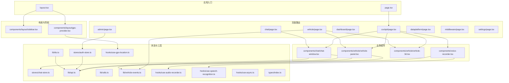
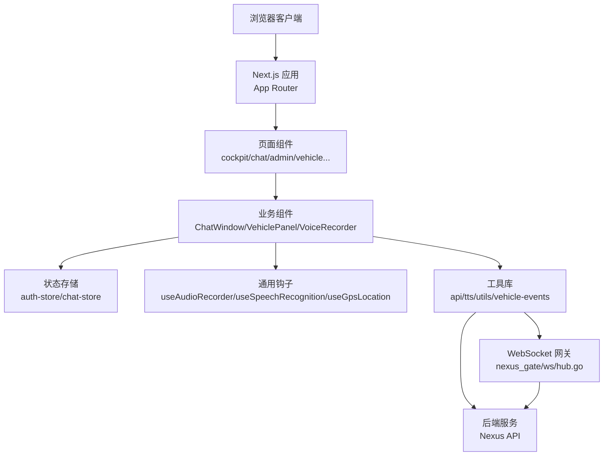
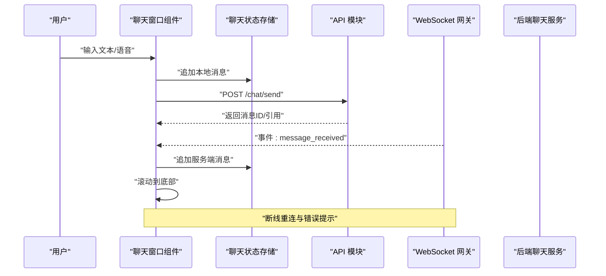
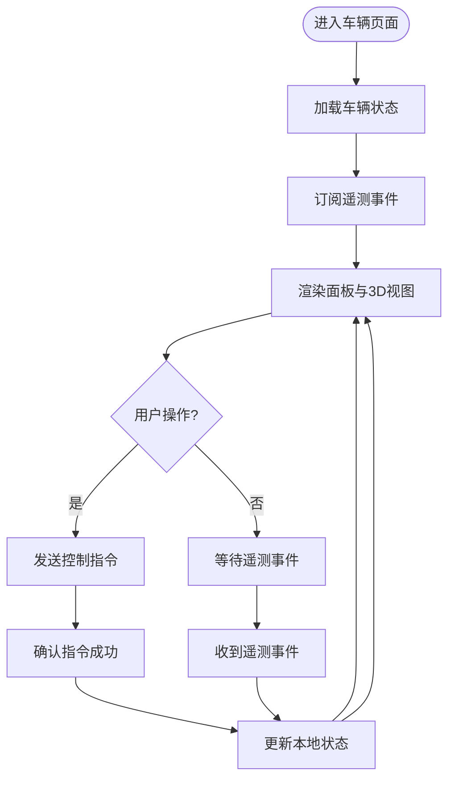
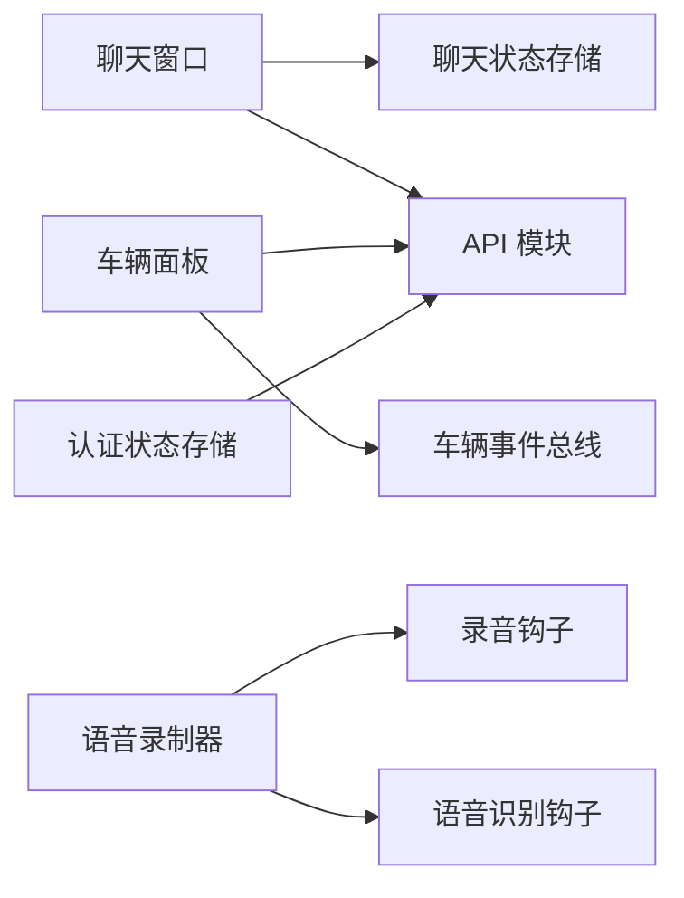

# 前端应用架构

<cite>
**本文引用的文件**   
- [frontend_design/src/app/layout.tsx](file://frontend_design/src/app/layout.tsx)
- [frontend_design/src/app/page.tsx](file://frontend_design/src/app/page.tsx)
- [frontend_design/src/app/chat/page.tsx](file://frontend_design/src/app/chat/page.tsx)
- [frontend_design/src/app/cockpit/page.tsx](file://frontend_design/src/app/cockpit/page.tsx)
- [frontend_design/src/app/admin/page.tsx](file://frontend_design/src/app/admin/page.tsx)
- [frontend_design/src/app/dashboard/page.tsx](file://frontend_design/src/app/dashboard/page.tsx)
- [frontend_design/src/app/dataplatform/page.tsx](file://frontend_design/src/app/dataplatform/page.tsx)
- [frontend_design/src/app/middleware/page.tsx](file://frontend_design/src/app/middleware/page.tsx)
- [frontend_design/src/app/settings/page.tsx](file://frontend_design/src/app/settings/page.tsx)
- [frontend_design/src/app/vehicle/page.tsx](file://frontend_design/src/app/vehicle/page.tsx)
- [frontend_design/src/components/layout/sidebar.tsx](file://frontend_design/src/components/layout/sidebar.tsx)
- [frontend_design/src/components/layout/gps-provider.tsx](file://frontend_design/src/components/layout/gps-provider.tsx)
- [frontend_design/src/components/chat/chat-window.tsx](file://frontend_design/src/components/chat/chat-window.tsx)
- [frontend_design/src/components/vehicle/vehicle-panel.tsx](file://frontend_design/src/components/vehicle/vehicle-panel.tsx)
- [frontend_design/src/components/vehicle/vehicle-3d.tsx](file://frontend_design/src/components/vehicle/vehicle-3d.tsx)
- [frontend_design/src/components/voice-recorder.tsx](file://frontend_design/src/components/voice-recorder.tsx)
- [frontend_design/src/hooks/use-audio-recorder.ts](file://frontend_design/src/hooks/use-audio-recorder.ts)
- [frontend_design/src/hooks/use-gps-location.ts](file://frontend_design/src/hooks/use-gps-location.ts)
- [frontend_design/src/hooks/use-speech-recognition.ts](file://frontend_design/src/hooks/use-speech-recognition.ts)
- [frontend_design/src/hooks/use-async.ts](file://frontend_design/src/hooks/use-async.ts)
- [frontend_design/src/stores/auth-store.ts](file://frontend_design/src/stores/auth-store.ts)
- [frontend_design/src/stores/chat-store.ts](file://frontend_design/src/stores/chat-store.ts)
- [frontend_design/src/lib/api.ts](file://frontend_design/src/lib/api.ts)
- [frontend_design/src/lib/tts.ts](file://frontend_design/src/lib/tts.ts)
- [frontend_design/src/lib/utils.ts](file://frontend_design/src/lib/utils.ts)
- [frontend_design/src/lib/vehicle-events.ts](file://frontend_design/src/lib/vehicle-events.ts)
- [frontend_design/src/types/index.ts](file://frontend_design/src/types/index.ts)
- [frontend_design/next.config.js](file://frontend_design/next.config.js)
- [frontend_design/tailwind.config.ts](file://frontend_design/tailwind.config.ts)
- [frontend_design/package.json](file://frontend_design/package.json)
</cite>

## 目录
1. [简介](#简介)
2. [项目结构](#项目结构)
3. [核心组件](#核心组件)
4. [架构总览](#架构总览)
5. [详细组件分析](#详细组件分析)
6. [依赖关系分析](#依赖关系分析)
7. [性能考虑](#性能考虑)
8. [故障排查指南](#故障排查指南)
9. [结论](#结论)
10. [附录](#附录)

## 简介
本技术文档面向前端工程，聚焦于基于 Next.js 的前端应用。内容涵盖：
- 页面路由组织与布局设计
- 组件架构与状态管理模式
- WebSocket 实时通信与事件处理机制（结合后端网关）
- 聊天界面、车辆控制面板与管理后台的功能实现
- 响应式设计与用户体验优化策略
- 自定义组件开发指南与样式定制方法
- 前端性能优化与错误处理最佳实践

## 项目结构
前端采用 Next.js App Router 组织页面，按功能域划分模块：
- app 目录：页面级路由与全局布局
- components：可复用 UI 与业务组件
- hooks：通用逻辑封装（录音、GPS、语音识别、异步请求等）
- stores：全局状态管理（认证、聊天会话）
- lib：工具库（API 调用、TTS、通用工具、车辆事件总线）
- types：类型定义
- 配置：Next.js、Tailwind CSS、包依赖

图表来源
- [frontend_design/src/app/layout.tsx](file://frontend_design/src/app/layout.tsx)
- [frontend_design/src/app/page.tsx](file://frontend_design/src/app/page.tsx)
- [frontend_design/src/app/cockpit/page.tsx](file://frontend_design/src/app/cockpit/page.tsx)
- [frontend_design/src/app/chat/page.tsx](file://frontend_design/src/app/chat/page.tsx)
- [frontend_design/src/app/admin/page.tsx](file://frontend_design/src/app/admin/page.tsx)
- [frontend_design/src/app/vehicle/page.tsx](file://frontend_design/src/app/vehicle/page.tsx)
- [frontend_design/src/components/layout/sidebar.tsx](file://frontend_design/src/components/layout/sidebar.tsx)
- [frontend_design/src/components/layout/gps-provider.tsx](file://frontend_design/src/components/layout/gps-provider.tsx)
- [frontend_design/src/components/chat/chat-window.tsx](file://frontend_design/src/components/chat/chat-window.tsx)
- [frontend_design/src/components/vehicle/vehicle-panel.tsx](file://frontend_design/src/components/vehicle/vehicle-panel.tsx)
- [frontend_design/src/components/vehicle/vehicle-3d.tsx](file://frontend_design/src/components/vehicle/vehicle-3d.tsx)
- [frontend_design/src/components/voice-recorder.tsx](file://frontend_design/src/components/voice-recorder.tsx)
- [frontend_design/src/stores/auth-store.ts](file://frontend_design/src/stores/auth-store.ts)
- [frontend_design/src/stores/chat-store.ts](file://frontend_design/src/stores/chat-store.ts)
- [frontend_design/src/lib/api.ts](file://frontend_design/src/lib/api.ts)
- [frontend_design/src/lib/tts.ts](file://frontend_design/src/lib/tts.ts)
- [frontend_design/src/lib/utils.ts](file://frontend_design/src/lib/utils.ts)
- [frontend_design/src/lib/vehicle-events.ts](file://frontend_design/src/lib/vehicle-events.ts)
- [frontend_design/src/hooks/use-audio-recorder.ts](file://frontend_design/src/hooks/use-audio-recorder.ts)
- [frontend_design/src/hooks/use-gps-location.ts](file://frontend_design/src/hooks/use-gps-location.ts)
- [frontend_design/src/hooks/use-speech-recognition.ts](file://frontend_design/src/hooks/use-speech-recognition.ts)
- [frontend_design/src/types/index.ts](file://frontend_design/src/types/index.ts)

章节来源
- [frontend_design/src/app/layout.tsx](file://frontend_design/src/app/layout.tsx)
- [frontend_design/src/app/page.tsx](file://frontend_design/src/app/page.tsx)
- [frontend_design/src/app/cockpit/page.tsx](file://frontend_design/src/app/cockpit/page.tsx)
- [frontend_design/src/app/chat/page.tsx](file://frontend_design/src/app/chat/page.tsx)
- [frontend_design/src/app/admin/page.tsx](file://frontend_design/src/app/admin/page.tsx)
- [frontend_design/src/app/vehicle/page.tsx](file://frontend_design/src/app/vehicle/page.tsx)
- [frontend_design/src/components/layout/sidebar.tsx](file://frontend_design/src/components/layout/sidebar.tsx)
- [frontend_design/src/components/layout/gps-provider.tsx](file://frontend_design/src/components/layout/gps-provider.tsx)
- [frontend_design/src/components/chat/chat-window.tsx](file://frontend_design/src/components/chat/chat-window.tsx)
- [frontend_design/src/components/vehicle/vehicle-panel.tsx](file://frontend_design/src/components/vehicle/vehicle-panel.tsx)
- [frontend_design/src/components/vehicle/vehicle-3d.tsx](file://frontend_design/src/components/vehicle/vehicle-3d.tsx)
- [frontend_design/src/components/voice-recorder.tsx](file://frontend_design/src/components/voice-recorder.tsx)
- [frontend_design/src/stores/auth-store.ts](file://frontend_design/src/stores/auth-store.ts)
- [frontend_design/src/stores/chat-store.ts](file://frontend_design/src/stores/chat-store.ts)
- [frontend_design/src/lib/api.ts](file://frontend_design/src/lib/api.ts)
- [frontend_design/src/lib/tts.ts](file://frontend_design/src/lib/tts.ts)
- [frontend_design/src/lib/utils.ts](file://frontend_design/src/lib/utils.ts)
- [frontend_design/src/lib/vehicle-events.ts](file://frontend_design/src/lib/vehicle-events.ts)
- [frontend_design/src/hooks/use-audio-recorder.ts](file://frontend_design/src/hooks/use-audio-recorder.ts)
- [frontend_design/src/hooks/use-gps-location.ts](file://frontend_design/src/hooks/use-gps-location.ts)
- [frontend_design/src/hooks/use-speech-recognition.ts](file://frontend_design/src/hooks/use-speech-recognition.ts)
- [frontend_design/src/types/index.ts](file://frontend_design/src/types/index.ts)

## 核心组件
- 布局与导航
  - 侧边栏提供多页面导航，支持移动端折叠与键盘快捷键
  - GPS 上下文提供者统一暴露位置信息，供地图或仪表盘使用
- 聊天窗口
  - 消息列表、输入框、发送按钮、语音录制集成
  - 通过聊天状态存储维护会话历史与滚动定位
- 车辆面板与 3D 视图
  - 车辆状态展示、控制指令下发、事件订阅与渲染
  - 3D 模型加载与交互（如车门、车窗、空调等）
- 语音录制器
  - 录音、转写、播放、重试与错误提示
- 状态管理
  - 认证状态：登录态、用户信息、权限
  - 聊天状态：会话列表、当前会话、消息队列
- 工具与事件
  - API 封装：统一请求头、拦截器、错误码映射
  - TTS：文本转语音流式播放
  - 车辆事件总线：WebSocket 事件分发与本地缓存

章节来源
- [frontend_design/src/components/layout/sidebar.tsx](file://frontend_design/src/components/layout/sidebar.tsx)
- [frontend_design/src/components/layout/gps-provider.tsx](file://frontend_design/src/components/layout/gps-provider.tsx)
- [frontend_design/src/components/chat/chat-window.tsx](file://frontend_design/src/components/chat/chat-window.tsx)
- [frontend_design/src/components/vehicle/vehicle-panel.tsx](file://frontend_design/src/components/vehicle/vehicle-panel.tsx)
- [frontend_design/src/components/vehicle/vehicle-3d.tsx](file://frontend_design/src/components/vehicle/vehicle-3d.tsx)
- [frontend_design/src/components/voice-recorder.tsx](file://frontend_design/src/components/voice-recorder.tsx)
- [frontend_design/src/stores/auth-store.ts](file://frontend_design/src/stores/auth-store.ts)
- [frontend_design/src/stores/chat-store.ts](file://frontend_design/src/stores/chat-store.ts)
- [frontend_design/src/lib/api.ts](file://frontend_design/src/lib/api.ts)
- [frontend_design/src/lib/tts.ts](file://frontend_design/src/lib/tts.ts)
- [frontend_design/src/lib/vehicle-events.ts](file://frontend_design/src/lib/vehicle-events.ts)

## 架构总览
前端以 Next.js 为运行时，App Router 负责页面路由；组件层通过 Hooks 与 Stores 解耦业务逻辑；网络层统一由 API 模块封装；WebSocket 通过网关服务建立长连接，用于实时消息与车辆遥测数据推送。

图表来源
- [frontend_design/src/app/cockpit/page.tsx](file://frontend_design/src/app/cockpit/page.tsx)
- [frontend_design/src/app/chat/page.tsx](file://frontend_design/src/app/chat/page.tsx)
- [frontend_design/src/app/admin/page.tsx](file://frontend_design/src/app/admin/page.tsx)
- [frontend_design/src/app/vehicle/page.tsx](file://frontend_design/src/app/vehicle/page.tsx)
- [frontend_design/src/components/chat/chat-window.tsx](file://frontend_design/src/components/chat/chat-window.tsx)
- [frontend_design/src/components/vehicle/vehicle-panel.tsx](file://frontend_design/src/components/vehicle/vehicle-panel.tsx)
- [frontend_design/src/components/voice-recorder.tsx](file://frontend_design/src/components/voice-recorder.tsx)
- [frontend_design/src/stores/auth-store.ts](file://frontend_design/src/stores/auth-store.ts)
- [frontend_design/src/stores/chat-store.ts](file://frontend_design/src/stores/chat-store.ts)
- [frontend_design/src/lib/api.ts](file://frontend_design/src/lib/api.ts)
- [frontend_design/src/lib/vehicle-events.ts](file://frontend_design/src/lib/vehicle-events.ts)

## 详细组件分析

### 聊天界面（Chat Window）
- 功能要点
  - 消息列表渲染、自动滚动到底部
  - 文本输入与发送，支持语音录制与转写
  - 与后端聊天接口交互，接收流式回复
  - 错误重试与离线提示
- 关键流程
  - 用户输入 -> 更新本地消息队列 -> 调用 API 发送 -> 监听 WebSocket 事件 -> 追加消息并滚动
  - 语音录制 -> 转写文本 -> 插入输入框或直接发送
- 状态与持久化
  - 会话列表与当前会话 ID 存储在 chat-store
  - 消息增量更新，避免全量重渲染

图表来源
- [frontend_design/src/components/chat/chat-window.tsx](file://frontend_design/src/components/chat/chat-window.tsx)
- [frontend_design/src/stores/chat-store.ts](file://frontend_design/src/stores/chat-store.ts)
- [frontend_design/src/lib/api.ts](file://frontend_design/src/lib/api.ts)
- [frontend_design/src/lib/vehicle-events.ts](file://frontend_design/src/lib/vehicle-events.ts)

章节来源
- [frontend_design/src/components/chat/chat-window.tsx](file://frontend_design/src/components/chat/chat-window.tsx)
- [frontend_design/src/stores/chat-store.ts](file://frontend_design/src/stores/chat-store.ts)
- [frontend_design/src/lib/api.ts](file://frontend_design/src/lib/api.ts)
- [frontend_design/src/lib/vehicle-events.ts](file://frontend_design/src/lib/vehicle-events.ts)

### 车辆控制面板（Vehicle Panel & 3D）
- 功能要点
  - 展示车辆状态（电量、胎压、门窗、空调等）
  - 下发控制指令（开关窗、调节温度、解锁/上锁）
  - 订阅车辆遥测事件，实时更新 UI
  - 3D 模型联动显示（车门开合、车窗升降）
- 事件处理
  - 通过 vehicle-events 订阅/发布事件
  - 将 WebSocket 事件转换为 UI 状态变更
- 性能优化
  - 局部状态更新，减少重绘
  - 防抖节流控制高频遥测数据渲染

图表来源
- [frontend_design/src/components/vehicle/vehicle-panel.tsx](file://frontend_design/src/components/vehicle/vehicle-panel.tsx)
- [frontend_design/src/components/vehicle/vehicle-3d.tsx](file://frontend_design/src/components/vehicle/vehicle-3d.tsx)
- [frontend_design/src/lib/vehicle-events.ts](file://frontend_design/src/lib/vehicle-events.ts)
- [frontend_design/src/lib/api.ts](file://frontend_design/src/lib/api.ts)

章节来源
- [frontend_design/src/components/vehicle/vehicle-panel.tsx](file://frontend_design/src/components/vehicle/vehicle-panel.tsx)
- [frontend_design/src/components/vehicle/vehicle-3d.tsx](file://frontend_design/src/components/vehicle/vehicle-3d.tsx)
- [frontend_design/src/lib/vehicle-events.ts](file://frontend_design/src/lib/vehicle-events.ts)
- [frontend_design/src/lib/api.ts](file://frontend_design/src/lib/api.ts)

### 管理后台（Admin）
- 功能要点
  - 用户管理、权限校验、密码修改
  - 系统设置与监控指标查看
- 安全与鉴权
  - 基于认证状态存储进行路由守卫
  - 敏感操作二次确认与日志记录

章节来源
- [frontend_design/src/app/admin/page.tsx](file://frontend_design/src/app/admin/page.tsx)
- [frontend_design/src/stores/auth-store.ts](file://frontend_design/src/stores/auth-store.ts)

### 其他页面
- 仪表盘（Dashboard）：聚合关键指标卡片与趋势图
- 数据平台（Data Platform）：数据源管理与查询结果展示
- 中间件（Middleware）：限流、缓存、任务队列状态
- 设置（Settings）：主题、语言、通知偏好

章节来源
- [frontend_design/src/app/dashboard/page.tsx](file://frontend_design/src/app/dashboard/page.tsx)
- [frontend_design/src/app/dataplatform/page.tsx](file://frontend_design/src/app/dataplatform/page.tsx)
- [frontend_design/src/app/middleware/page.tsx](file://frontend_design/src/app/middleware/page.tsx)
- [frontend_design/src/app/settings/page.tsx](file://frontend_design/src/app/settings/page.tsx)

## 依赖关系分析
- 组件耦合
  - 聊天窗口依赖聊天状态存储与 API 模块
  - 车辆面板依赖车辆事件总线与 API 模块
  - 语音录制器依赖音频与语音识别钩子
- 外部依赖
  - Tailwind CSS 提供原子化样式
  - Next.js 提供路由、SSR/CSR 能力
  - WebSocket 网关提供实时通道

图表来源
- [frontend_design/src/components/chat/chat-window.tsx](file://frontend_design/src/components/chat/chat-window.tsx)
- [frontend_design/src/stores/chat-store.ts](file://frontend_design/src/stores/chat-store.ts)
- [frontend_design/src/components/vehicle/vehicle-panel.tsx](file://frontend_design/src/components/vehicle/vehicle-panel.tsx)
- [frontend_design/src/lib/vehicle-events.ts](file://frontend_design/src/lib/vehicle-events.ts)
- [frontend_design/src/components/voice-recorder.tsx](file://frontend_design/src/components/voice-recorder.tsx)
- [frontend_design/src/hooks/use-audio-recorder.ts](file://frontend_design/src/hooks/use-audio-recorder.ts)
- [frontend_design/src/hooks/use-speech-recognition.ts](file://frontend_design/src/hooks/use-speech-recognition.ts)
- [frontend_design/src/stores/auth-store.ts](file://frontend_design/src/stores/auth-store.ts)
- [frontend_design/src/lib/api.ts](file://frontend_design/src/lib/api.ts)

章节来源
- [frontend_design/src/components/chat/chat-window.tsx](file://frontend_design/src/components/chat/chat-window.tsx)
- [frontend_design/src/stores/chat-store.ts](file://frontend_design/src/stores/chat-store.ts)
- [frontend_design/src/components/vehicle/vehicle-panel.tsx](file://frontend_design/src/components/vehicle/vehicle-panel.tsx)
- [frontend_design/src/lib/vehicle-events.ts](file://frontend_design/src/lib/vehicle-events.ts)
- [frontend_design/src/components/voice-recorder.tsx](file://frontend_design/src/components/voice-recorder.tsx)
- [frontend_design/src/hooks/use-audio-recorder.ts](file://frontend_design/src/hooks/use-audio-recorder.ts)
- [frontend_design/src/hooks/use-speech-recognition.ts](file://frontend_design/src/hooks/use-speech-recognition.ts)
- [frontend_design/src/stores/auth-store.ts](file://frontend_design/src/stores/auth-store.ts)
- [frontend_design/src/lib/api.ts](file://frontend_design/src/lib/api.ts)

## 性能考虑
- 渲染优化
  - 使用 React.memo 包裹纯展示组件，减少不必要的重渲染
  - 列表虚拟化（长列表场景）提升滚动性能
- 网络优化
  - 请求去重与缓存（相同参数短时间内的重复请求）
  - 分页与增量更新，避免一次性拉取大量数据
- 资源优化
  - 图片懒加载与按需引入
  - 代码分割与动态导入（大组件延迟加载）
- 实时通信
  - WebSocket 心跳保活与断线重连
  - 事件合并与节流，降低 UI 压力
- 构建与部署
  - 启用 Next.js 生产模式与静态导出（适用场景）
  - 使用 CDN 缓存静态资源

[本节为通用指导，不直接分析具体文件]

## 故障排查指南
- 常见问题
  - WebSocket 连接失败：检查网关地址、跨域配置、证书与防火墙
  - 语音录制无权限：浏览器需 HTTPS 且用户授权麦克风
  - 页面白屏：检查控制台错误、资源加载失败与路由守卫逻辑
- 调试建议
  - 在 API 模块增加请求/响应日志与错误堆栈
  - 对 WebSocket 事件进行打点统计（连接时长、丢包率）
  - 使用浏览器开发者工具的 Network 与 Performance 面板定位瓶颈
- 恢复策略
  - 自动重试与降级（离线时缓存本地数据）
  - 用户友好的错误提示与重试按钮

章节来源
- [frontend_design/src/lib/api.ts](file://frontend_design/src/lib/api.ts)
- [frontend_design/src/lib/vehicle-events.ts](file://frontend_design/src/lib/vehicle-events.ts)
- [frontend_design/src/components/voice-recorder.tsx](file://frontend_design/src/components/voice-recorder.tsx)

## 结论
该前端应用基于 Next.js 的模块化架构，通过清晰的页面路由、组件分层与状态管理，实现了聊天、车辆控制与管理后台等功能。借助 WebSocket 网关提供实时通信能力，结合响应式设计与性能优化策略，整体具备良好的可扩展性与用户体验。后续可在以下方面持续改进：
- 完善错误边界与全局异常捕获
- 引入更完善的单元测试与端到端测试
- 增强国际化与无障碍访问支持
- 深化可视化与数据分析能力

[本节为总结性内容，不直接分析具体文件]

## 附录

### 页面路由与布局
- 根布局提供全局导航与上下文（GPS、主题、语言）
- 各页面通过 App Router 独立挂载，按需加载

章节来源
- [frontend_design/src/app/layout.tsx](file://frontend_design/src/app/layout.tsx)
- [frontend_design/src/app/page.tsx](file://frontend_design/src/app/page.tsx)
- [frontend_design/src/app/cockpit/page.tsx](file://frontend_design/src/app/cockpit/page.tsx)
- [frontend_design/src/app/chat/page.tsx](file://frontend_design/src/app/chat/page.tsx)
- [frontend_design/src/app/admin/page.tsx](file://frontend_design/src/app/admin/page.tsx)
- [frontend_design/src/app/vehicle/page.tsx](file://frontend_design/src/app/vehicle/page.tsx)

### 状态管理
- 认证状态：登录态、用户信息、权限
- 聊天状态：会话列表、当前会话、消息队列

章节来源
- [frontend_design/src/stores/auth-store.ts](file://frontend_design/src/stores/auth-store.ts)
- [frontend_design/src/stores/chat-store.ts](file://frontend_design/src/stores/chat-store.ts)

### 工具与事件
- API 模块：统一请求封装、错误处理、拦截器
- TTS：文本转语音流式播放
- 车辆事件总线：事件订阅/发布、本地缓存

章节来源
- [frontend_design/src/lib/api.ts](file://frontend_design/src/lib/api.ts)
- [frontend_design/src/lib/tts.ts](file://frontend_design/src/lib/tts.ts)
- [frontend_design/src/lib/vehicle-events.ts](file://frontend_design/src/lib/vehicle-events.ts)

### 钩子与类型
- 录音、语音识别、GPS 定位、异步请求封装
- 统一类型定义，保障前后端契约一致

章节来源
- [frontend_design/src/hooks/use-audio-recorder.ts](file://frontend_design/src/hooks/use-audio-recorder.ts)
- [frontend_design/src/hooks/use-speech-recognition.ts](file://frontend_design/src/hooks/use-speech-recognition.ts)
- [frontend_design/src/hooks/use-gps-location.ts](file://frontend_design/src/hooks/use-gps-location.ts)
- [frontend_design/src/hooks/use-async.ts](file://frontend_design/src/hooks/use-async.ts)
- [frontend_design/src/types/index.ts](file://frontend_design/src/types/index.ts)

### 样式与配置
- Tailwind CSS 原子化样式与主题扩展
- Next.js 配置项（代理、环境变量、构建选项）
- 包依赖与脚本命令

章节来源
- [frontend_design/tailwind.config.ts](file://frontend_design/tailwind.config.ts)
- [frontend_design/next.config.js](file://frontend_design/next.config.js)
- [frontend_design/package.json](file://frontend_design/package.json)