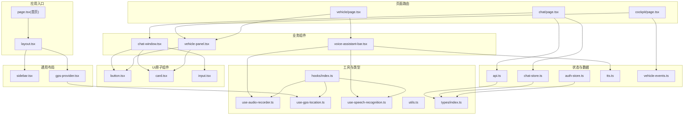
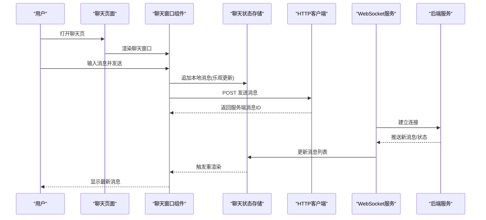
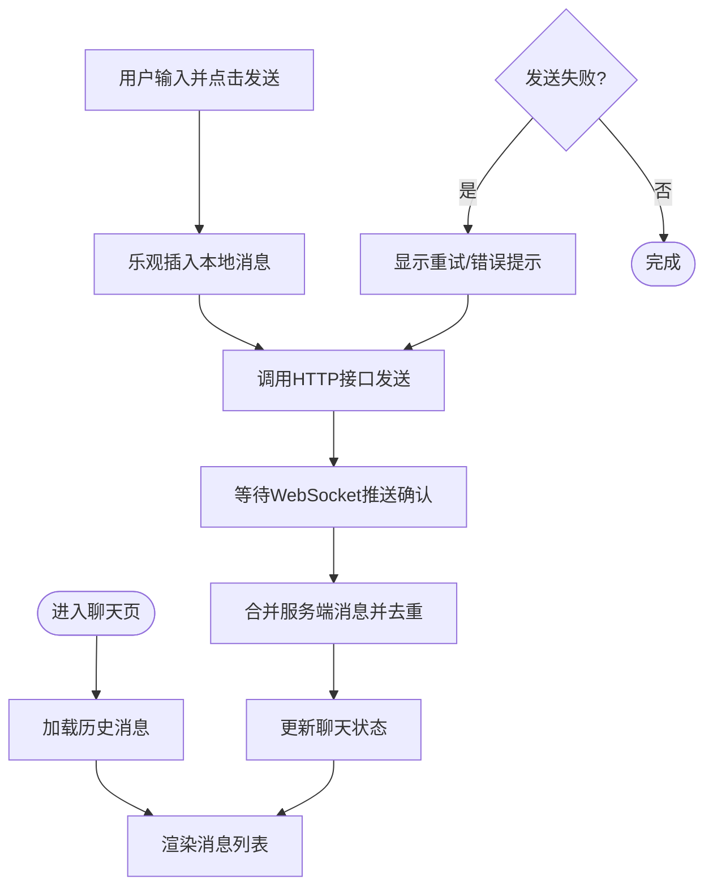
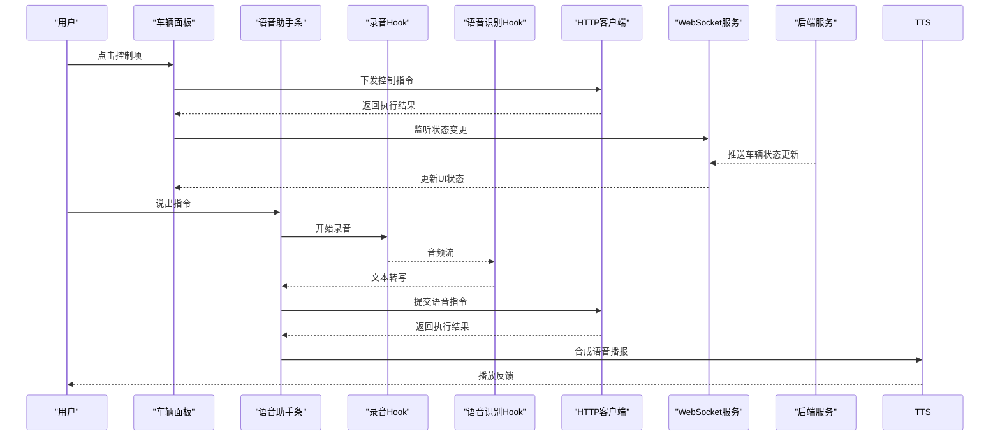
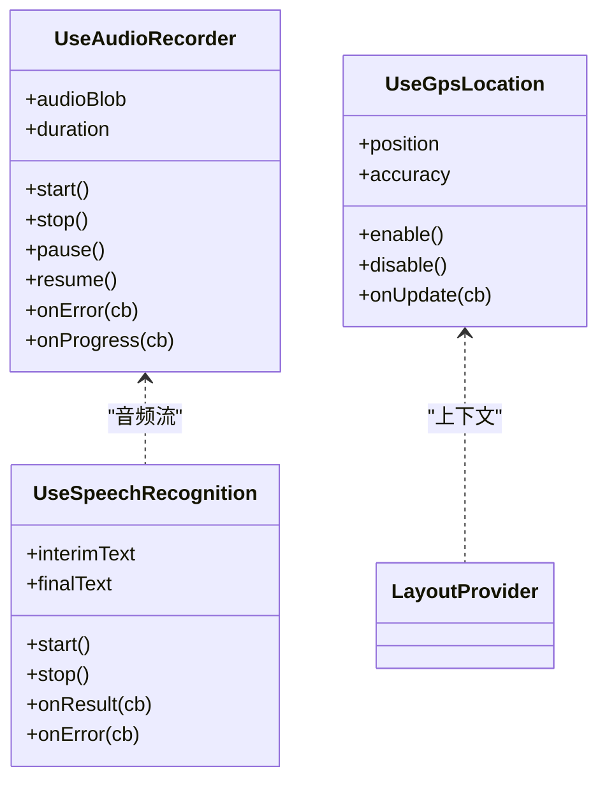
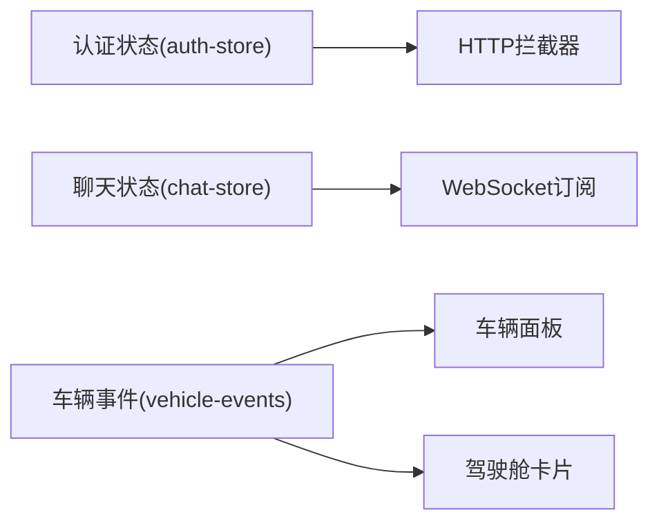
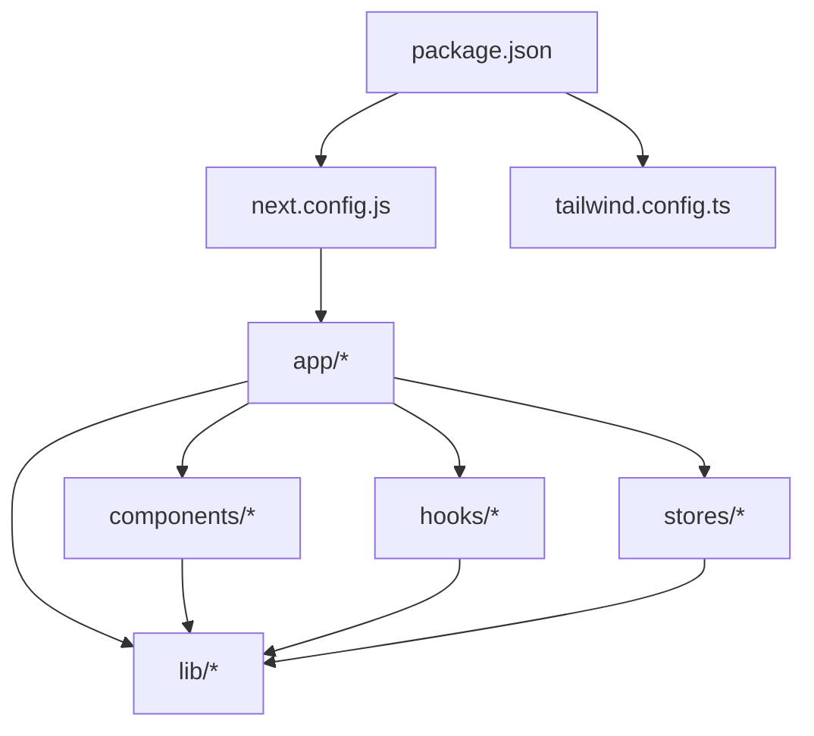

# 前端应用架构

<cite>
**本文引用的文件**   
- [frontend_design/src/app/layout.tsx](file://frontend_design/src/app/layout.tsx)
- [frontend_design/src/app/page.tsx](file://frontend_design/src/app/page.tsx)
- [frontend_design/src/app/chat/page.tsx](file://frontend_design/src/app/chat/page.tsx)
- [frontend_design/src/app/cockpit/page.tsx](file://frontend_design/src/app/cockpit/page.tsx)
- [frontend_design/src/app/vehicle/page.tsx](file://frontend_design/src/app/vehicle/page.tsx)
- [frontend_design/src/components/chat/chat-window.tsx](file://frontend_design/src/components/chat/chat-window.tsx)
- [frontend_design/src/components/layout/sidebar.tsx](file://frontend_design/src/components/layout/sidebar.tsx)
- [frontend_design/src/components/layout/gps-provider.tsx](file://frontend_design/src/components/layout/gps-provider.tsx)
- [frontend_design/src/components/ui/button.tsx](file://frontend_design/src/components/ui/button.tsx)
- [frontend_design/src/components/ui/card.tsx](file://frontend_design/src/components/ui/card.tsx)
- [frontend_design/src/components/ui/input.tsx](file://frontend_design/src/components/ui/input.tsx)
- [frontend_design/src/components/vehicle/vehicle-panel.tsx](file://frontend_design/src/components/vehicle/vehicle-panel.tsx)
- [frontend_design/src/components/vehicle/voice-assistant-bar.tsx](file://frontend_design/src/components/vehicle/voice-assistant-bar.tsx)
- [frontend_design/src/hooks/index.ts](file://frontend_design/src/hooks/index.ts)
- [frontend_design/src/hooks/use-audio-recorder.ts](file://frontend_design/src/hooks/use-audio-recorder.ts)
- [frontend_design/src/hooks/use-gps-location.ts](file://frontend_design/src/hooks/use-gps-location.ts)
- [frontend_design/src/hooks/use-speech-recognition.ts](file://frontend_design/src/hooks/use-speech-recognition.ts)
- [frontend_design/src/stores/auth-store.ts](file://frontend_design/src/stores/auth-store.ts)
- [frontend_design/src/stores/chat-store.ts](file://frontend_design/src/stores/chat-store.ts)
- [frontend_design/src/lib/api.ts](file://frontend_design/src/lib/api.ts)
- [frontend_design/src/lib/tts.ts](file://frontend_design/src/lib/tts.ts)
- [frontend_design/src/lib/utils.ts](file://frontend_design/src/lib/utils.ts)
- [frontend_design/src/lib/vehicle-events.ts](file://frontend_design/src/lib/vehicle-events.ts)
- [frontend_design/src/types/index.ts](file://frontend_design/src/types/index.ts)
- [frontend_design/package.json](file://frontend_design/package.json)
- [frontend_design/next.config.js](file://frontend_design/next.config.js)
- [frontend_design/tailwind.config.ts](file://frontend_design/tailwind.config.ts)
</cite>

## 目录
1. [简介](#简介)
2. [项目结构](#项目结构)
3. [核心组件](#核心组件)
4. [架构总览](#架构总览)
5. [详细组件分析](#详细组件分析)
6. [依赖关系分析](#依赖关系分析)
7. [性能考虑](#性能考虑)
8. [故障排查指南](#故障排查指南)
9. [结论](#结论)
10. [附录](#附录)

## 简介
本文件面向NexusCockpit的前端应用，系统性阐述基于Next.js的页面与组件组织、状态管理方案、实时通信机制以及前后端集成方式。文档覆盖聊天界面、驾驶舱监控、车辆控制面板等核心页面的实现思路，并总结自定义Hook设计模式、全局状态管理策略、UI组件库使用规范以及与后端服务的REST/WebSocket集成最佳实践。

## 项目结构
前端采用Next.js App Router组织页面，按功能域划分components、hooks、stores、lib与types目录，遵循“页面即路由”的约定式布局。

图表来源
- [frontend_design/src/app/layout.tsx](file://frontend_design/src/app/layout.tsx)
- [frontend_design/src/app/page.tsx](file://frontend_design/src/app/page.tsx)
- [frontend_design/src/app/chat/page.tsx](file://frontend_design/src/app/chat/page.tsx)
- [frontend_design/src/app/cockpit/page.tsx](file://frontend_design/src/app/cockpit/page.tsx)
- [frontend_design/src/app/vehicle/page.tsx](file://frontend_design/src/app/vehicle/page.tsx)
- [frontend_design/src/components/layout/sidebar.tsx](file://frontend_design/src/components/layout/sidebar.tsx)
- [frontend_design/src/components/layout/gps-provider.tsx](file://frontend_design/src/components/layout/gps-provider.tsx)
- [frontend_design/src/components/chat/chat-window.tsx](file://frontend_design/src/components/chat/chat-window.tsx)
- [frontend_design/src/components/vehicle/vehicle-panel.tsx](file://frontend_design/src/components/vehicle/vehicle-panel.tsx)
- [frontend_design/src/components/vehicle/voice-assistant-bar.tsx](file://frontend_design/src/components/vehicle/voice-assistant-bar.tsx)
- [frontend_design/src/components/ui/button.tsx](file://frontend_design/src/components/ui/button.tsx)
- [frontend_design/src/components/ui/card.tsx](file://frontend_design/src/components/ui/card.tsx)
- [frontend_design/src/components/ui/input.tsx](file://frontend_design/src/components/ui/input.tsx)
- [frontend_design/src/stores/auth-store.ts](file://frontend_design/src/stores/auth-store.ts)
- [frontend_design/src/stores/chat-store.ts](file://frontend_design/src/stores/chat-store.ts)
- [frontend_design/src/lib/api.ts](file://frontend_design/src/lib/api.ts)
- [frontend_design/src/lib/tts.ts](file://frontend_design/src/lib/tts.ts)
- [frontend_design/src/lib/vehicle-events.ts](file://frontend_design/src/lib/vehicle-events.ts)
- [frontend_design/src/hooks/index.ts](file://frontend_design/src/hooks/index.ts)
- [frontend_design/src/hooks/use-audio-recorder.ts](file://frontend_design/src/hooks/use-audio-recorder.ts)
- [frontend_design/src/hooks/use-gps-location.ts](file://frontend_design/src/hooks/use-gps-location.ts)
- [frontend_design/src/hooks/use-speech-recognition.ts](file://frontend_design/src/hooks/use-speech-recognition.ts)
- [frontend_design/src/types/index.ts](file://frontend_design/src/types/index.ts)

章节来源
- [frontend_design/src/app/layout.tsx](file://frontend_design/src/app/layout.tsx)
- [frontend_design/src/app/page.tsx](file://frontend_design/src/app/page.tsx)
- [frontend_design/src/app/chat/page.tsx](file://frontend_design/src/app/chat/page.tsx)
- [frontend_design/src/app/cockpit/page.tsx](file://frontend_design/src/app/cockpit/page.tsx)
- [frontend_design/src/app/vehicle/page.tsx](file://frontend_design/src/app/vehicle/page.tsx)
- [frontend_design/src/components/layout/sidebar.tsx](file://frontend_design/src/components/layout/sidebar.tsx)
- [frontend_design/src/components/layout/gps-provider.tsx](file://frontend_design/src/components/layout/gps-provider.tsx)
- [frontend_design/src/components/chat/chat-window.tsx](file://frontend_design/src/components/chat/chat-window.tsx)
- [frontend_design/src/components/vehicle/vehicle-panel.tsx](file://frontend_design/src/components/vehicle/vehicle-panel.tsx)
- [frontend_design/src/components/vehicle/voice-assistant-bar.tsx](file://frontend_design/src/components/vehicle/voice-assistant-bar.tsx)
- [frontend_design/src/components/ui/button.tsx](file://frontend_design/src/components/ui/button.tsx)
- [frontend_design/src/components/ui/card.tsx](file://frontend_design/src/components/ui/card.tsx)
- [frontend_design/src/components/ui/input.tsx](file://frontend_design/src/components/ui/input.tsx)
- [frontend_design/src/stores/auth-store.ts](file://frontend_design/src/stores/auth-store.ts)
- [frontend_design/src/stores/chat-store.ts](file://frontend_design/src/stores/chat-store.ts)
- [frontend_design/src/lib/api.ts](file://frontend_design/src/lib/api.ts)
- [frontend_design/src/lib/tts.ts](file://frontend_design/src/lib/tts.ts)
- [frontend_design/src/lib/vehicle-events.ts](file://frontend_design/src/lib/vehicle-events.ts)
- [frontend_design/src/hooks/index.ts](file://frontend_design/src/hooks/index.ts)
- [frontend_design/src/hooks/use-audio-recorder.ts](file://frontend_design/src/hooks/use-audio-recorder.ts)
- [frontend_design/src/hooks/use-gps-location.ts](file://frontend_design/src/hooks/use-gps-location.ts)
- [frontend_design/src/hooks/use-speech-recognition.ts](file://frontend_design/src/hooks/use-speech-recognition.ts)
- [frontend_design/src/types/index.ts](file://frontend_design/src/types/index.ts)

## 核心组件
- 页面级组件
  - 聊天页：负责会话列表、消息渲染、输入框与发送逻辑，通常订阅聊天状态与WebSocket事件。
  - 驾驶舱页：聚合车辆状态、告警、能耗、导航等卡片，展示关键指标与趋势。
  - 车辆控制页：提供空调、座椅、车窗、媒体等控制入口，结合语音助手进行快捷操作。
- 布局组件
  - 侧边栏：导航菜单、角色切换、主题与设置入口。
  - GPS提供者：在应用层暴露定位能力，供各页面消费。
- UI原子组件
  - 按钮、卡片、输入框等基础控件，统一样式与交互行为。
- 业务组件
  - 车辆面板：封装车辆状态与控制的组合视图。
  - 语音助手条：录音、识别、TTS播放一体化交互。

章节来源
- [frontend_design/src/app/chat/page.tsx](file://frontend_design/src/app/chat/page.tsx)
- [frontend_design/src/app/cockpit/page.tsx](file://frontend_design/src/app/cockpit/page.tsx)
- [frontend_design/src/app/vehicle/page.tsx](file://frontend_design/src/app/vehicle/page.tsx)
- [frontend_design/src/components/layout/sidebar.tsx](file://frontend_design/src/components/layout/sidebar.tsx)
- [frontend_design/src/components/layout/gps-provider.tsx](file://frontend_design/src/components/layout/gps-provider.tsx)
- [frontend_design/src/components/ui/button.tsx](file://frontend_design/src/components/ui/button.tsx)
- [frontend_design/src/components/ui/card.tsx](file://frontend_design/src/components/ui/card.tsx)
- [frontend_design/src/components/ui/input.tsx](file://frontend_design/src/components/ui/input.tsx)
- [frontend_design/src/components/vehicle/vehicle-panel.tsx](file://frontend_design/src/components/vehicle/vehicle-panel.tsx)
- [frontend_design/src/components/vehicle/voice-assistant-bar.tsx](file://frontend_design/src/components/vehicle/voice-assistant-bar.tsx)

## 架构总览
前端采用“页面-组件-Hook-Store-Lib”的分层结构：
- 页面层：Next.js App Router路由，承载业务场景编排。
- 组件层：可复用UI与业务组件，通过props与上下文传递数据。
- Hook层：封装浏览器API与复杂逻辑（录音、语音识别、GPS）。
- Store层：轻量全局状态（认证、聊天会话等），便于跨组件共享。
- Lib层：网络请求、TTS、事件总线等横切能力。

图表来源
- [frontend_design/src/app/chat/page.tsx](file://frontend_design/src/app/chat/page.tsx)
- [frontend_design/src/components/chat/chat-window.tsx](file://frontend_design/src/components/chat/chat-window.tsx)
- [frontend_design/src/stores/chat-store.ts](file://frontend_design/src/stores/chat-store.ts)
- [frontend_design/src/lib/api.ts](file://frontend_design/src/lib/api.ts)

## 详细组件分析

### 聊天界面（Chat）
- 职责
  - 维护消息列表、滚动位置、输入状态。
  - 处理发送、接收、重试与错误提示。
  - 与WebSocket保持长连接，订阅实时消息。
- 状态与数据流
  - 使用聊天store集中管理消息与会话元信息。
  - HTTP用于发送消息与拉取历史；WebSocket用于增量更新。
- 交互流程
  - 用户输入→乐观插入→调用API→等待WS回推→合并去重→渲染。

图表来源
- [frontend_design/src/app/chat/page.tsx](file://frontend_design/src/app/chat/page.tsx)
- [frontend_design/src/components/chat/chat-window.tsx](file://frontend_design/src/components/chat/chat-window.tsx)
- [frontend_design/src/stores/chat-store.ts](file://frontend_design/src/stores/chat-store.ts)
- [frontend_design/src/lib/api.ts](file://frontend_design/src/lib/api.ts)

章节来源
- [frontend_design/src/app/chat/page.tsx](file://frontend_design/src/app/chat/page.tsx)
- [frontend_design/src/components/chat/chat-window.tsx](file://frontend_design/src/components/chat/chat-window.tsx)
- [frontend_design/src/stores/chat-store.ts](file://frontend_design/src/stores/chat-store.ts)
- [frontend_design/src/lib/api.ts](file://frontend_design/src/lib/api.ts)

### 驾驶舱监控（Cockpit）
- 职责
  - 聚合多源数据（车辆状态、告警、能耗、导航等）并以卡片形式呈现。
  - 支持刷新、筛选与时间范围选择。
- 数据获取
  - 定时轮询或WebSocket增量更新，避免频繁全量刷新。
  - 对热点数据进行本地缓存与防抖。
- 可视化
  - 使用卡片组件组合不同指标，必要时引入图表库（若后续扩展）。

章节来源
- [frontend_design/src/app/cockpit/page.tsx](file://frontend_design/src/app/cockpit/page.tsx)
- [frontend_design/src/components/ui/card.tsx](file://frontend_design/src/components/ui/card.tsx)

### 车辆控制面板（Vehicle）
- 职责
  - 提供空调、座椅、车窗、媒体等控制入口。
  - 与语音助手联动，支持语音指令直达控制。
- 状态同步
  - 通过事件总线或WebSocket同步车辆状态变更。
  - 控制命令下发后，以乐观更新+服务端确认的方式保证一致性。
- 语音助手
  - 录音→语音识别→意图解析→下发控制→TTS反馈。

图表来源
- [frontend_design/src/app/vehicle/page.tsx](file://frontend_design/src/app/vehicle/page.tsx)
- [frontend_design/src/components/vehicle/vehicle-panel.tsx](file://frontend_design/src/components/vehicle/vehicle-panel.tsx)
- [frontend_design/src/components/vehicle/voice-assistant-bar.tsx](file://frontend_design/src/components/vehicle/voice-assistant-bar.tsx)
- [frontend_design/src/hooks/use-audio-recorder.ts](file://frontend_design/src/hooks/use-audio-recorder.ts)
- [frontend_design/src/hooks/use-speech-recognition.ts](file://frontend_design/src/hooks/use-speech-recognition.ts)
- [frontend_design/src/lib/tts.ts](file://frontend_design/src/lib/tts.ts)
- [frontend_design/src/lib/vehicle-events.ts](file://frontend_design/src/lib/vehicle-events.ts)
- [frontend_design/src/lib/api.ts](file://frontend_design/src/lib/api.ts)

章节来源
- [frontend_design/src/app/vehicle/page.tsx](file://frontend_design/src/app/vehicle/page.tsx)
- [frontend_design/src/components/vehicle/vehicle-panel.tsx](file://frontend_design/src/components/vehicle/vehicle-panel.tsx)
- [frontend_design/src/components/vehicle/voice-assistant-bar.tsx](file://frontend_design/src/components/vehicle/voice-assistant-bar.tsx)
- [frontend_design/src/hooks/use-audio-recorder.ts](file://frontend_design/src/hooks/use-audio-recorder.ts)
- [frontend_design/src/hooks/use-speech-recognition.ts](file://frontend_design/src/hooks/use-speech-recognition.ts)
- [frontend_design/src/lib/tts.ts](file://frontend_design/src/lib/tts.ts)
- [frontend_design/src/lib/vehicle-events.ts](file://frontend_design/src/lib/vehicle-events.ts)
- [frontend_design/src/lib/api.ts](file://frontend_design/src/lib/api.ts)

### 自定义Hook设计思路
- useAudioRecorder
  - 封装MediaRecorder，提供开始/停止/暂停、进度与错误回调。
  - 输出音频Blob与时长，供语音识别与上传使用。
- useSpeechRecognition
  - 封装Web Speech API或第三方SDK，提供转写文本、置信度与中断能力。
  - 与录音Hook解耦，支持热插拔识别引擎。
- useGpsLocation
  - 封装Geolocation API，提供定位、精度、速度、轨迹记录与权限处理。
  - 在GPS Provider中作为上下文暴露给全应用。

图表来源
- [frontend_design/src/hooks/use-audio-recorder.ts](file://frontend_design/src/hooks/use-audio-recorder.ts)
- [frontend_design/src/hooks/use-speech-recognition.ts](file://frontend_design/src/hooks/use-speech-recognition.ts)
- [frontend_design/src/hooks/use-gps-location.ts](file://frontend_design/src/hooks/use-gps-location.ts)
- [frontend_design/src/components/layout/gps-provider.tsx](file://frontend_design/src/components/layout/gps-provider.tsx)

章节来源
- [frontend_design/src/hooks/use-audio-recorder.ts](file://frontend_design/src/hooks/use-audio-recorder.ts)
- [frontend_design/src/hooks/use-speech-recognition.ts](file://frontend_design/src/hooks/use-speech-recognition.ts)
- [frontend_design/src/hooks/use-gps-location.ts](file://frontend_design/src/hooks/use-gps-location.ts)
- [frontend_design/src/components/layout/gps-provider.tsx](file://frontend_design/src/components/layout/gps-provider.tsx)

### 全局状态管理与事件总线
- 认证状态
  - 使用轻量store管理登录态、用户信息与过期时间，配合拦截器自动刷新Token。
- 聊天状态
  - 集中管理消息列表、当前会话、未读计数与发送队列。
- 车辆事件
  - 基于事件总线或WebSocket通道，将车辆状态变化广播到相关组件。

图表来源
- [frontend_design/src/stores/auth-store.ts](file://frontend_design/src/stores/auth-store.ts)
- [frontend_design/src/stores/chat-store.ts](file://frontend_design/src/stores/chat-store.ts)
- [frontend_design/src/lib/vehicle-events.ts](file://frontend_design/src/lib/vehicle-events.ts)
- [frontend_design/src/lib/api.ts](file://frontend_design/src/lib/api.ts)

章节来源
- [frontend_design/src/stores/auth-store.ts](file://frontend_design/src/stores/auth-store.ts)
- [frontend_design/src/stores/chat-store.ts](file://frontend_design/src/stores/chat-store.ts)
- [frontend_design/src/lib/vehicle-events.ts](file://frontend_design/src/lib/vehicle-events.ts)
- [frontend_design/src/lib/api.ts](file://frontend_design/src/lib/api.ts)

### UI组件库与样式体系
- 原子组件
  - 按钮、卡片、输入框等，统一尺寸、颜色与交互反馈。
- 组合组件
  - 聊天窗口、车辆面板等由原子组件拼装而成，关注业务语义。
- 样式策略
  - 基于Tailwind配置主题色、间距与断点，确保一致性与可维护性。

章节来源
- [frontend_design/src/components/ui/button.tsx](file://frontend_design/src/components/ui/button.tsx)
- [frontend_design/src/components/ui/card.tsx](file://frontend_design/src/components/ui/card.tsx)
- [frontend_design/src/components/ui/input.tsx](file://frontend_design/src/components/ui/input.tsx)
- [frontend_design/src/tailwind.config.ts](file://frontend_design/src/tailwind.config.ts)

## 依赖关系分析
- 包与框架
  - Next.js、React、TypeScript、Tailwind CSS为核心依赖。
- 运行时依赖
  - Web Speech API、Geolocation API、MediaRecorder为浏览器原生能力。
- 外部服务
  - REST API与WebSocket服务，用于消息、车辆状态与语音处理。

图表来源
- [frontend_design/package.json](file://frontend_design/package.json)
- [frontend_design/next.config.js](file://frontend_design/next.config.js)
- [frontend_design/tailwind.config.ts](file://frontend_design/tailwind.config.ts)
- [frontend_design/src/app/layout.tsx](file://frontend_design/src/app/layout.tsx)
- [frontend_design/src/app/page.tsx](file://frontend_design/src/app/page.tsx)
- [frontend_design/src/app/chat/page.tsx](file://frontend_design/src/app/chat/page.tsx)
- [frontend_design/src/app/cockpit/page.tsx](file://frontend_design/src/app/cockpit/page.tsx)
- [frontend_design/src/app/vehicle/page.tsx](file://frontend_design/src/app/vehicle/page.tsx)
- [frontend_design/src/components/chat/chat-window.tsx](file://frontend_design/src/components/chat/chat-window.tsx)
- [frontend_design/src/components/vehicle/vehicle-panel.tsx](file://frontend_design/src/components/vehicle/vehicle-panel.tsx)
- [frontend_design/src/components/vehicle/voice-assistant-bar.tsx](file://frontend_design/src/components/vehicle/voice-assistant-bar.tsx)
- [frontend_design/src/hooks/index.ts](file://frontend_design/src/hooks/index.ts)
- [frontend_design/src/hooks/use-audio-recorder.ts](file://frontend_design/src/hooks/use-audio-recorder.ts)
- [frontend_design/src/hooks/use-gps-location.ts](file://frontend_design/src/hooks/use-gps-location.ts)
- [frontend_design/src/hooks/use-speech-recognition.ts](file://frontend_design/src/hooks/use-speech-recognition.ts)
- [frontend_design/src/stores/auth-store.ts](file://frontend_design/src/stores/auth-store.ts)
- [frontend_design/src/stores/chat-store.ts](file://frontend_design/src/stores/chat-store.ts)
- [frontend_design/src/lib/api.ts](file://frontend_design/src/lib/api.ts)
- [frontend_design/src/lib/tts.ts](file://frontend_design/src/lib/tts.ts)
- [frontend_design/src/lib/vehicle-events.ts](file://frontend_design/src/lib/vehicle-events.ts)

章节来源
- [frontend_design/package.json](file://frontend_design/package.json)
- [frontend_design/next.config.js](file://frontend_design/next.config.js)
- [frontend_design/tailwind.config.ts](file://frontend_design/tailwind.config.ts)

## 性能考虑
- 消息渲染优化
  - 虚拟列表或分页加载历史消息，减少DOM节点数量。
  - 对长列表使用稳定key与增量更新，避免整表重渲染。
- WebSocket优化
  - 心跳保活与断线重连指数退避。
  - 消息去重与合并，避免重复渲染。
- 资源与首屏
  - 按需加载重型模块（如地图、图表）。
  - 静态资源压缩与CDN缓存。
- 音频与语音
  - 录音分段上传与流式识别，降低延迟。
  - TTS播放时避免阻塞主线程，使用Web Audio API缓冲。

[本节为通用指导，不直接分析具体文件]

## 故障排查指南
- 常见问题
  - 语音权限被拒绝：检查浏览器权限弹窗与麦克风可用性。
  - WebSocket连接失败：核对代理配置、端口与证书，查看重连日志。
  - 消息丢失或重复：检查乐观更新与WS回推的去重逻辑。
  - 定位不可用：检查设备是否支持Geolocation与HTTPS环境。
- 调试建议
  - 在开发环境开启详细日志与网络抓包。
  - 对关键Hook添加错误边界与降级路径。
  - 使用浏览器开发者工具的Performance与Memory面板分析瓶颈。

章节来源
- [frontend_design/src/hooks/use-audio-recorder.ts](file://frontend_design/src/hooks/use-audio-recorder.ts)
- [frontend_design/src/hooks/use-speech-recognition.ts](file://frontend_design/src/hooks/use-speech-recognition.ts)
- [frontend_design/src/hooks/use-gps-location.ts](file://frontend_design/src/hooks/use-gps-location.ts)
- [frontend_design/src/lib/api.ts](file://frontend_design/src/lib/api.ts)
- [frontend_design/src/lib/vehicle-events.ts](file://frontend_design/src/lib/vehicle-events.ts)

## 结论
本架构以Next.js App Router为入口，围绕“页面-组件-Hook-Store-Lib”分层组织代码，结合轻量全局状态与WebSocket实现实时通信。通过原子化UI组件与可复用的业务组件，提升可维护性与扩展性。建议在后续迭代中持续完善错误边界、性能监控与自动化测试，进一步提升稳定性与用户体验。

[本节为总结性内容，不直接分析具体文件]

## 附录
- 类型定义
  - 统一的类型文件用于约束API响应、消息结构与车辆状态。
- 工具函数
  - 通用工具方法（日期格式化、URL拼接、防抖节流等）。

章节来源
- [frontend_design/src/types/index.ts](file://frontend_design/src/types/index.ts)
- [frontend_design/src/lib/utils.ts](file://frontend_design/src/lib/utils.ts)