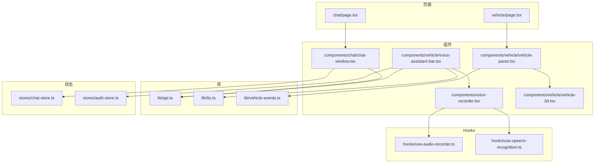
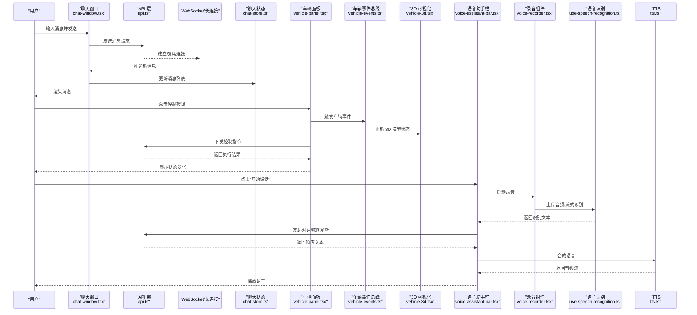
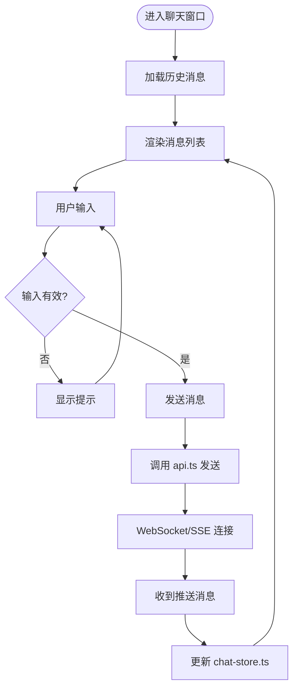
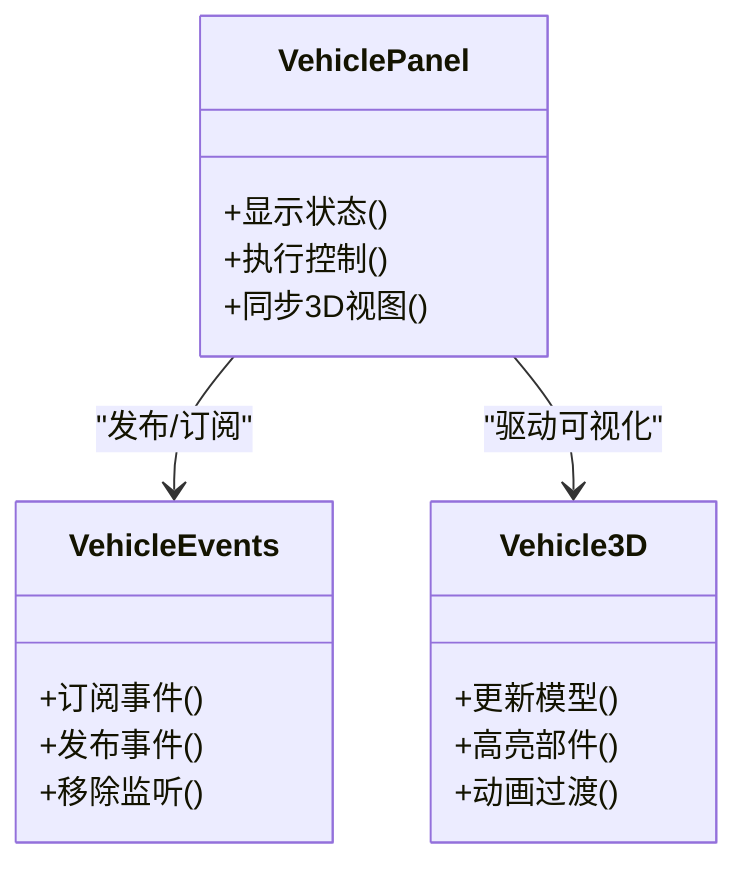
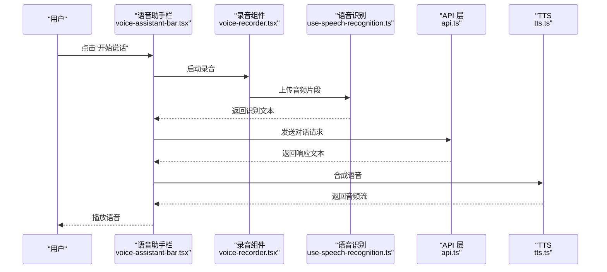
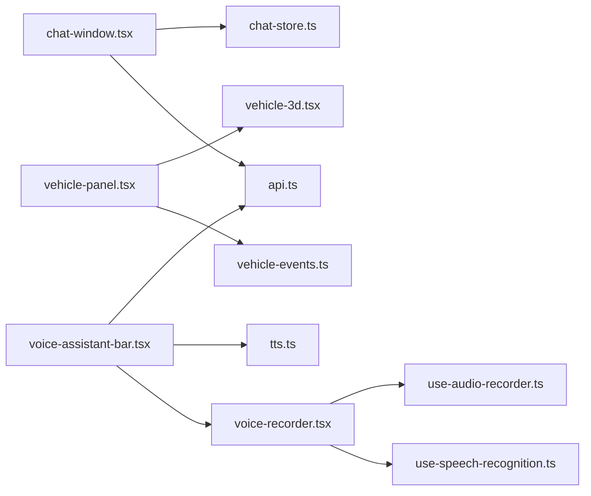

# 功能组件

<cite>
**本文引用的文件**   
- [chat-window.tsx](file://frontend_design/src/components/chat/chat-window.tsx)
- [vehicle-panel.tsx](file://frontend_design/src/components/vehicle/vehicle-panel.tsx)
- [voice-assistant-bar.tsx](file://frontend_design/src/components/vehicle/voice-assistant-bar.tsx)
- [voice-recorder.tsx](file://frontend_design/src/components/voice-recorder.tsx)
- [use-audio-recorder.ts](file://frontend_design/src/hooks/use-audio-recorder.ts)
- [use-speech-recognition.ts](file://frontend_design/src/hooks/use-speech-recognition.ts)
- [vehicle-events.ts](file://frontend_design/src/lib/vehicle-events.ts)
- [api.ts](file://frontend_design/src/lib/api.ts)
- [tts.ts](file://frontend_design/src/lib/tts.ts)
- [vehicle-3d.tsx](file://frontend_design/src/components/vehicle/vehicle-3d.tsx)
- [chat-store.ts](file://frontend_design/src/stores/chat-store.ts)
- [auth-store.ts](file://frontend_design/src/stores/auth-store.ts)
</cite>

## 目录
1. [简介](#简介)
2. [项目结构](#项目结构)
3. [核心组件](#核心组件)
4. [架构总览](#架构总览)
5. [详细组件分析](#详细组件分析)
6. [依赖分析](#依赖分析)
7. [性能考虑](#性能考虑)
8. [故障排查指南](#故障排查指南)
9. [结论](#结论)
10. [附录](#附录)

## 简介
本技术文档聚焦前端功能组件，围绕以下目标展开：
- 聊天窗口组件 chat-window.tsx：消息渲染、输入处理与实时通信集成。
- 车辆控制面板 vehicle-panel.tsx：车辆状态显示、控制操作与 3D 可视化集成。
- 语音助手 voice-assistant-bar.tsx 与录音组件 voice-recorder.tsx：语音交互实现（采集、识别、播放）。
- 组件间通信机制与事件处理模式。
- 组件自定义扩展方法与样式定制指南。
- 性能优化与用户体验改进最佳实践。

## 项目结构
前端采用 Next.js + React + TypeScript 组织方式，关键目录与职责如下：
- components：页面级功能组件（聊天、车辆面板、语音助手、录音器）
- hooks：可复用逻辑（音频录制、语音识别、GPS 定位等）
- lib：通用能力（API 调用、TTS、车辆事件总线）
- stores：全局状态（聊天会话、认证）
- app：路由页面入口

图表来源
- [chat-window.tsx](file://frontend_design/src/components/chat/chat-window.tsx)
- [vehicle-panel.tsx](file://frontend_design/src/components/vehicle/vehicle-panel.tsx)
- [voice-assistant-bar.tsx](file://frontend_design/src/components/vehicle/voice-assistant-bar.tsx)
- [voice-recorder.tsx](file://frontend_design/src/components/voice-recorder.tsx)
- [use-audio-recorder.ts](file://frontend_design/src/hooks/use-audio-recorder.ts)
- [use-speech-recognition.ts](file://frontend_design/src/hooks/use-speech-recognition.ts)
- [vehicle-events.ts](file://frontend_design/src/lib/vehicle-events.ts)
- [api.ts](file://frontend_design/src/lib/api.ts)
- [tts.ts](file://frontend_design/src/lib/tts.ts)
- [vehicle-3d.tsx](file://frontend_design/src/components/vehicle/vehicle-3d.tsx)
- [chat-store.ts](file://frontend_design/src/stores/chat-store.ts)
- [auth-store.ts](file://frontend_design/src/stores/auth-store.ts)

章节来源
- [chat-window.tsx](file://frontend_design/src/components/chat/chat-window.tsx)
- [vehicle-panel.tsx](file://frontend_design/src/components/vehicle/vehicle-panel.tsx)
- [voice-assistant-bar.tsx](file://frontend_design/src/components/vehicle/voice-assistant-bar.tsx)
- [voice-recorder.tsx](file://frontend_design/src/components/voice-recorder.tsx)
- [use-audio-recorder.ts](file://frontend_design/src/hooks/use-audio-recorder.ts)
- [use-speech-recognition.ts](file://frontend_design/src/hooks/use-speech-recognition.ts)
- [vehicle-events.ts](file://frontend_design/src/lib/vehicle-events.ts)
- [api.ts](file://frontend_design/src/lib/api.ts)
- [tts.ts](file://frontend_design/src/lib/tts.ts)
- [vehicle-3d.tsx](file://frontend_design/src/components/vehicle/vehicle-3d.tsx)
- [chat-store.ts](file://frontend_design/src/stores/chat-store.ts)
- [auth-store.ts](file://frontend_design/src/stores/auth-store.ts)

## 核心组件
本节概述各组件的职责与协作关系，为后续深入分析提供框架。

- 聊天窗口组件（chat-window.tsx）
  - 负责消息列表渲染、用户输入处理、发送消息、接收服务端推送并更新 UI。
  - 与聊天状态存储（chat-store.ts）和 API 层（api.ts）交互，支持 WebSocket 或轮询的实时通信。
- 车辆控制面板（vehicle-panel.tsx）
  - 展示车辆状态（如电量、胎压、空调、车窗等），提供控制按钮与快捷操作。
  - 通过车辆事件总线（vehicle-events.ts）与 3D 可视化（vehicle-3d.tsx）联动，实现状态同步与可视化反馈。
- 语音助手栏（voice-assistant-bar.tsx）
  - 提供语音交互入口，集成录音、识别、文本转语音（TTS）与对话流程编排。
  - 与录音组件（voice-recorder.tsx）、TTS（tts.ts）、API（api.ts）及认证状态（auth-store.ts）协作。
- 录音组件（voice-recorder.tsx）
  - 封装浏览器媒体流采集、录音时长与波形可视化、错误处理与权限提示。
  - 基于 use-audio-recorder.ts 与 use-speech-recognition.ts 提供录音与识别能力。

章节来源
- [chat-window.tsx](file://frontend_design/src/components/chat/chat-window.tsx)
- [vehicle-panel.tsx](file://frontend_design/src/components/vehicle/vehicle-panel.tsx)
- [voice-assistant-bar.tsx](file://frontend_design/src/components/vehicle/voice-assistant-bar.tsx)
- [voice-recorder.tsx](file://frontend_design/src/components/voice-recorder.tsx)
- [use-audio-recorder.ts](file://frontend_design/src/hooks/use-audio-recorder.ts)
- [use-speech-recognition.ts](file://frontend_design/src/hooks/use-speech-recognition.ts)
- [vehicle-events.ts](file://frontend_design/src/lib/vehicle-events.ts)
- [api.ts](file://frontend_design/src/lib/api.ts)
- [tts.ts](file://frontend_design/src/lib/tts.ts)
- [vehicle-3d.tsx](file://frontend_design/src/components/vehicle/vehicle-3d.tsx)
- [chat-store.ts](file://frontend_design/src/stores/chat-store.ts)
- [auth-store.ts](file://frontend_design/src/stores/auth-store.ts)

## 架构总览
下图展示了功能组件之间的数据流与控制流，包括消息通道、车辆事件与语音链路。

图表来源
- [chat-window.tsx](file://frontend_design/src/components/chat/chat-window.tsx)
- [api.ts](file://frontend_design/src/lib/api.ts)
- [chat-store.ts](file://frontend_design/src/stores/chat-store.ts)
- [vehicle-panel.tsx](file://frontend_design/src/components/vehicle/vehicle-panel.tsx)
- [vehicle-events.ts](file://frontend_design/src/lib/vehicle-events.ts)
- [vehicle-3d.tsx](file://frontend_design/src/components/vehicle/vehicle-3d.tsx)
- [voice-assistant-bar.tsx](file://frontend_design/src/components/vehicle/voice-assistant-bar.tsx)
- [voice-recorder.tsx](file://frontend_design/src/components/voice-recorder.tsx)
- [use-speech-recognition.ts](file://frontend_design/src/hooks/use-speech-recognition.ts)
- [tts.ts](file://frontend_design/src/lib/tts.ts)

## 详细组件分析

### 聊天窗口组件（chat-window.tsx）
- 消息渲染
  - 维护消息列表状态，按时间顺序渲染用户与系统消息。
  - 支持富文本/Markdown 渲染、图片与链接预览、滚动到底部自动定位。
- 输入处理
  - 文本输入框支持回车发送、Shift+回车换行、粘贴图片、表情选择。
  - 输入校验（长度限制、敏感词过滤）与防抖提交。
- 实时通信集成
  - 使用 WebSocket 或 SSE 接收服务端推送的新消息，合并到本地消息队列。
  - 断线重连与消息去重，保证消息一致性。
- 与状态管理协作
  - 将消息写入 chat-store.ts，供其他页面或组件订阅。
  - 在组件卸载时清理监听器与定时器，避免内存泄漏。

图表来源
- [chat-window.tsx](file://frontend_design/src/components/chat/chat-window.tsx)
- [api.ts](file://frontend_design/src/lib/api.ts)
- [chat-store.ts](file://frontend_design/src/stores/chat-store.ts)

章节来源
- [chat-window.tsx](file://frontend_design/src/components/chat/chat-window.tsx)
- [api.ts](file://frontend_design/src/lib/api.ts)
- [chat-store.ts](file://frontend_design/src/stores/chat-store.ts)

### 车辆控制面板（vehicle-panel.tsx）
- 车辆状态显示
  - 聚合多源状态（电池、胎压、空调、车窗、门锁等），以卡片/仪表盘形式呈现。
  - 支持刷新、筛选与分组展示。
- 控制操作
  - 提供开关、滑块、下拉选择等控件，触发车辆控制指令。
  - 操作前进行权限校验与二次确认，失败时回滚 UI 状态。
- 3D 可视化集成
  - 通过 vehicle-3d.tsx 展示车辆模型与实时状态（如车门开合、灯光、温度分布）。
  - 与 vehicle-events.ts 事件总线联动，实现跨组件状态同步。

图表来源
- [vehicle-panel.tsx](file://frontend_design/src/components/vehicle/vehicle-panel.tsx)
- [vehicle-3d.tsx](file://frontend_design/src/components/vehicle/vehicle-3d.tsx)
- [vehicle-events.ts](file://frontend_design/src/lib/vehicle-events.ts)

章节来源
- [vehicle-panel.tsx](file://frontend_design/src/components/vehicle/vehicle-panel.tsx)
- [vehicle-3d.tsx](file://frontend_design/src/components/vehicle/vehicle-3d.tsx)
- [vehicle-events.ts](file://frontend_design/src/lib/vehicle-events.ts)

### 语音助手栏（voice-assistant-bar.tsx）与录音组件（voice-recorder.tsx）
- 语音助手栏
  - 提供“开始/停止录音”、“播放/暂停语音”、“打断当前播放”等交互。
  - 编排识别→对话→TTS 的流程，处理网络异常与降级策略。
  - 与 tts.ts 协作播放音频，与 api.ts 发起对话请求，读取 auth-store.ts 的认证信息。
- 录音组件
  - 基于 use-audio-recorder.ts 获取媒体流，管理录音状态、时长与波形。
  - 基于 use-speech-recognition.ts 将音频转为文本，支持流式识别与中断。
  - 处理麦克风权限拒绝、设备不可用、静音检测等边界情况。

图表来源
- [voice-assistant-bar.tsx](file://frontend_design/src/components/vehicle/voice-assistant-bar.tsx)
- [voice-recorder.tsx](file://frontend_design/src/components/voice-recorder.tsx)
- [use-speech-recognition.ts](file://frontend_design/src/hooks/use-speech-recognition.ts)
- [api.ts](file://frontend_design/src/lib/api.ts)
- [tts.ts](file://frontend_design/src/lib/tts.ts)

章节来源
- [voice-assistant-bar.tsx](file://frontend_design/src/components/vehicle/voice-assistant-bar.tsx)
- [voice-recorder.tsx](file://frontend_design/src/components/voice-recorder.tsx)
- [use-audio-recorder.ts](file://frontend_design/src/hooks/use-audio-recorder.ts)
- [use-speech-recognition.ts](file://frontend_design/src/hooks/use-speech-recognition.ts)
- [api.ts](file://frontend_design/src/lib/api.ts)
- [tts.ts](file://frontend_design/src/lib/tts.ts)
- [auth-store.ts](file://frontend_design/src/stores/auth-store.ts)

## 依赖分析
- 组件耦合度
  - chat-window.tsx 依赖 api.ts 与 chat-store.ts，低耦合于具体传输协议（WebSocket/SSE）。
  - vehicle-panel.tsx 通过 vehicle-events.ts 解耦与 vehicle-3d.tsx 的交互，便于扩展更多可视化模块。
  - voice-assistant-bar.tsx 与 voice-recorder.tsx 通过 hooks 抽象出录音与识别能力，降低业务逻辑复杂度。
- 外部依赖
  - api.ts 统一封装 HTTP/WebSocket 请求与鉴权头注入。
  - tts.ts 封装 TTS 服务调用与音频播放策略。
  - vehicle-events.ts 作为轻量事件总线，提供发布/订阅接口。

图表来源
- [chat-window.tsx](file://frontend_design/src/components/chat/chat-window.tsx)
- [api.ts](file://frontend_design/src/lib/api.ts)
- [chat-store.ts](file://frontend_design/src/stores/chat-store.ts)
- [vehicle-panel.tsx](file://frontend_design/src/components/vehicle/vehicle-panel.tsx)
- [vehicle-events.ts](file://frontend_design/src/lib/vehicle-events.ts)
- [vehicle-3d.tsx](file://frontend_design/src/components/vehicle/vehicle-3d.tsx)
- [voice-assistant-bar.tsx](file://frontend_design/src/components/vehicle/voice-assistant-bar.tsx)
- [voice-recorder.tsx](file://frontend_design/src/components/voice-recorder.tsx)
- [use-speech-recognition.ts](file://frontend_design/src/hooks/use-speech-recognition.ts)
- [use-audio-recorder.ts](file://frontend_design/src/hooks/use-audio-recorder.ts)
- [tts.ts](file://frontend_design/src/lib/tts.ts)

章节来源
- [chat-window.tsx](file://frontend_design/src/components/chat/chat-window.tsx)
- [api.ts](file://frontend_design/src/lib/api.ts)
- [chat-store.ts](file://frontend_design/src/stores/chat-store.ts)
- [vehicle-panel.tsx](file://frontend_design/src/components/vehicle/vehicle-panel.tsx)
- [vehicle-events.ts](file://frontend_design/src/lib/vehicle-events.ts)
- [vehicle-3d.tsx](file://frontend_design/src/components/vehicle/vehicle-3d.tsx)
- [voice-assistant-bar.tsx](file://frontend_design/src/components/vehicle/voice-assistant-bar.tsx)
- [voice-recorder.tsx](file://frontend_design/src/components/voice-recorder.tsx)
- [use-speech-recognition.ts](file://frontend_design/src/hooks/use-speech-recognition.ts)
- [use-audio-recorder.ts](file://frontend_design/src/hooks/use-audio-recorder.ts)
- [tts.ts](file://frontend_design/src/lib/tts.ts)

## 性能考虑
- 聊天窗口
  - 虚拟列表渲染大量消息，减少 DOM 节点数量。
  - 增量更新与消息去重，避免重复渲染。
  - 图片懒加载与缩略图缓存，降低带宽占用。
- 车辆面板
  - 状态变更批量更新，合并多次事件触发。
  - 3D 场景按需渲染，隐藏不可见部件，降低 GPU 压力。
- 语音链路
  - 流式识别与边录边传，缩短首字延迟。
  - TTS 分段合成与预取，提升播放流畅性。
  - 音频压缩与采样率自适应，平衡质量与带宽。

[本节为通用指导，不直接分析具体文件]

## 故障排查指南
- 聊天窗口
  - 检查 WebSocket 连接状态与心跳保活；查看断线重连日志。
  - 验证消息 ID 去重策略，避免重复显示。
- 车辆面板
  - 核对 vehicle-events.ts 的事件命名与参数契约，确保发布者与订阅者一致。
  - 3D 模型加载失败时，回退到静态图示或占位符。
- 语音助手
  - 麦克风权限被拒时，引导用户授权；设备不可用时提示切换设备。
  - 识别超时或网络异常时，提供重试与离线缓存策略。
  - TTS 播放卡顿，检查音频格式与解码兼容性。

章节来源
- [vehicle-events.ts](file://frontend_design/src/lib/vehicle-events.ts)
- [voice-recorder.tsx](file://frontend_design/src/components/voice-recorder.tsx)
- [voice-assistant-bar.tsx](file://frontend_design/src/components/vehicle/voice-assistant-bar.tsx)
- [tts.ts](file://frontend_design/src/lib/tts.ts)
- [api.ts](file://frontend_design/src/lib/api.ts)

## 结论
通过对聊天窗口、车辆控制面板与语音助手组件的系统化分析，明确了各自职责、数据流与事件协作模式。借助事件总线与状态管理，组件间实现了松耦合与高内聚。结合虚拟列表、流式识别与分段 TTS 等优化手段，可在复杂交互场景下保持良好性能与用户体验。建议在实际项目中持续完善错误处理、监控埋点与可观测性，以提升稳定性与可维护性。

[本节为总结性内容，不直接分析具体文件]

## 附录
- 自定义扩展方法
  - 聊天窗口：新增消息类型（如卡片、投票）可通过扩展消息渲染器与 store 适配器实现。
  - 车辆面板：新增控制项只需注册事件并在 vehicle-3d.tsx 中映射可视化行为。
  - 语音助手：替换 TTS 引擎或识别后端，仅需适配 tts.ts 与 use-speech-recognition.ts 的接口。
- 样式定制指南
  - 使用 Tailwind 类名覆盖默认样式，或通过 CSS 变量定义主题色与字号。
  - 对 3D 场景提供多套材质与配色方案，根据主题动态切换。
- 最佳实践
  - 组件职责单一，尽量通过 props 与事件回调进行通信。
  - 对外暴露稳定的 API 契约，内部实现可演进与替换。
  - 对耗时操作引入进度反馈与取消机制，提升用户感知。

[本节为概念性内容，不直接分析具体文件]