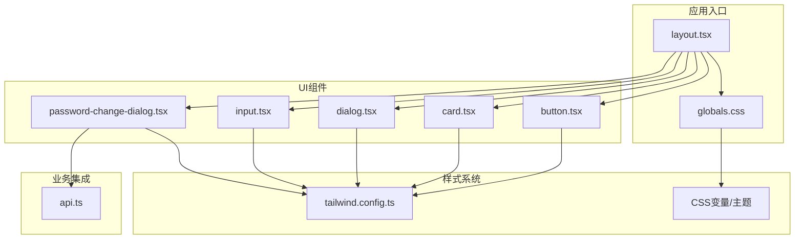
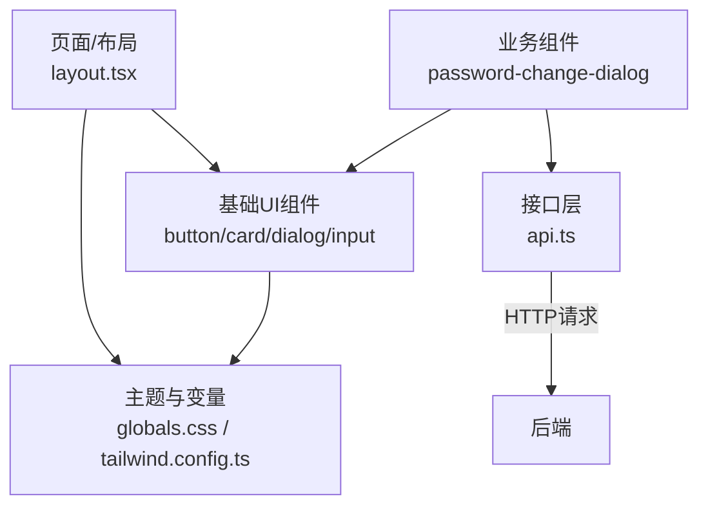
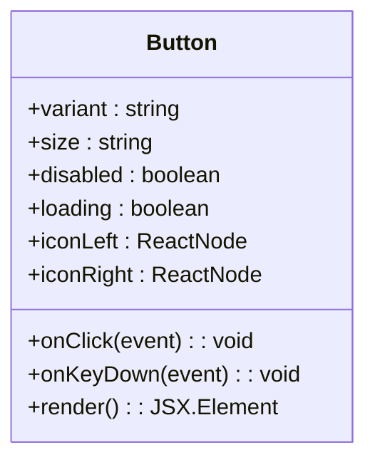
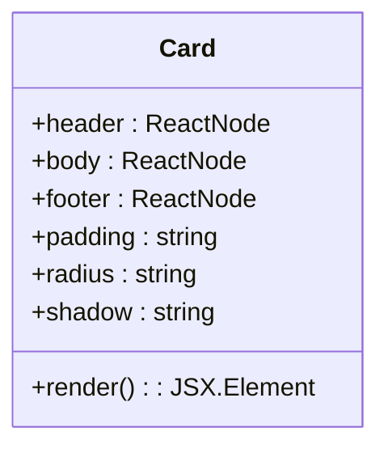
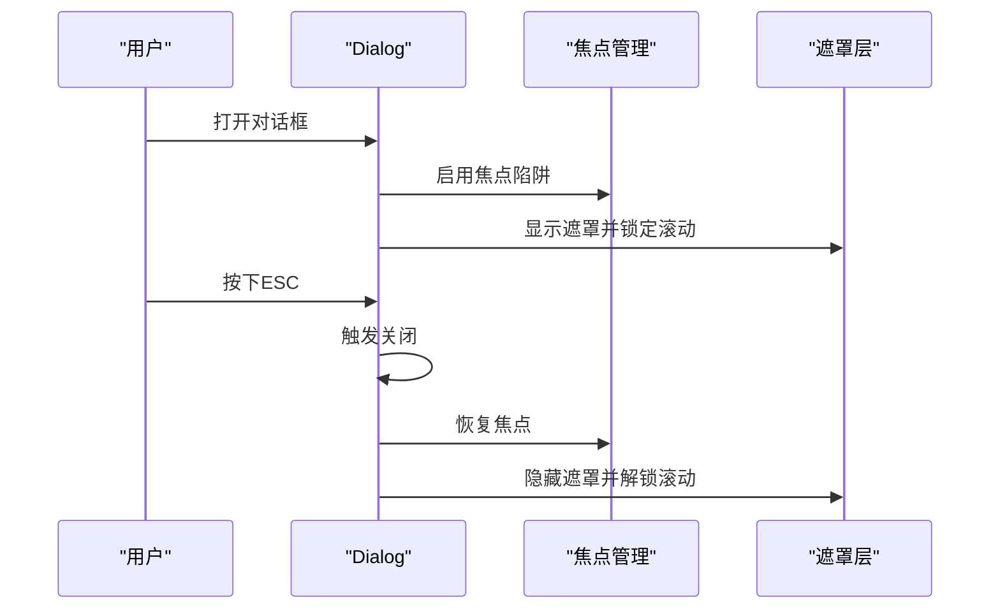
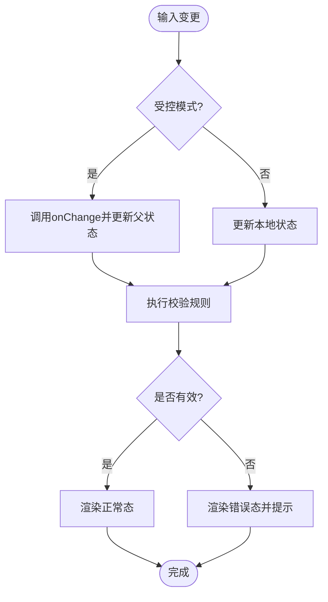
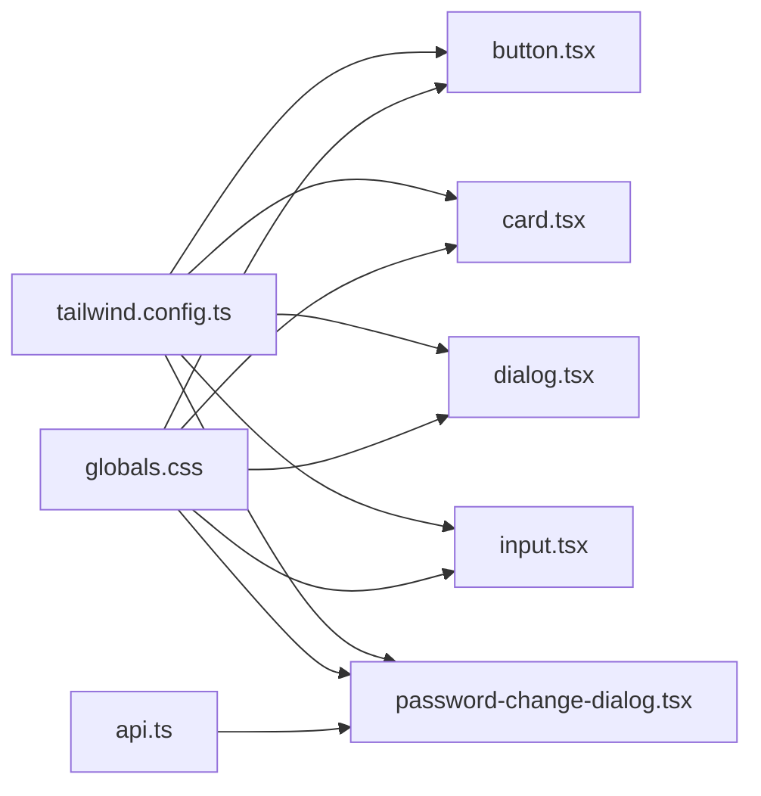

# 基础UI组件

<cite>
**本文引用的文件**   
- [button.tsx](file://frontend_design/src/components/ui/button.tsx)
- [card.tsx](file://frontend_design/src/components/ui/card.tsx)
- [dialog.tsx](file://frontend_design/src/components/ui/dialog.tsx)
- [input.tsx](file://frontend_design/src/components/ui/input.tsx)
- [password-change-dialog.tsx](file://frontend_design/src/components/ui/password-change-dialog.tsx)
- [tailwind.config.ts](file://frontend_design/tailwind.config.ts)
- [globals.css](file://frontend_design/src/app/globals.css)
- [layout.tsx](file://frontend_design/src/app/layout.tsx)
- [api.ts](file://frontend_design/src/lib/api.ts)
</cite>

## 目录
1. [简介](#简介)
2. [项目结构](#项目结构)
3. [核心组件](#核心组件)
4. [架构总览](#架构总览)
5. [详细组件分析](#详细组件分析)
6. [依赖关系分析](#依赖关系分析)
7. [性能考虑](#性能考虑)
8. [故障排查指南](#故障排查指南)
9. [结论](#结论)
10. [附录](#附录)

## 简介
本技术文档聚焦前端设计系统中的基础UI组件，包括按钮、卡片、对话框、输入框以及密码修改对话框。文档从组件属性定义、事件处理、样式主题与可访问性支持等维度进行深入解析，并给出组合使用模式、扩展方法、国际化思路、性能优化策略、测试方法与调试指南，帮助开发者快速理解与高效使用这些组件。

## 项目结构
前端采用 Next.js + Tailwind CSS 的架构，基础UI组件位于统一目录中，便于复用与治理。全局样式与主题变量通过CSS变量与Tailwind配置统一管理，布局入口负责注入全局上下文（如主题）。



图表来源
- [layout.tsx](file://frontend_design/src/app/layout.tsx)
- [globals.css](file://frontend_design/src/app/globals.css)
- [button.tsx](file://frontend_design/src/components/ui/button.tsx)
- [card.tsx](file://frontend_design/src/components/ui/card.tsx)
- [dialog.tsx](file://frontend_design/src/components/ui/dialog.tsx)
- [input.tsx](file://frontend_design/src/components/ui/input.tsx)
- [password-change-dialog.tsx](file://frontend_design/src/components/ui/password-change-dialog.tsx)
- [tailwind.config.ts](file://frontend_design/tailwind.config.ts)
- [api.ts](file://frontend_design/src/lib/api.ts)

章节来源
- [layout.tsx](file://frontend_design/src/app/layout.tsx)
- [globals.css](file://frontend_design/src/app/globals.css)
- [tailwind.config.ts](file://frontend_design/tailwind.config.ts)

## 核心组件
本节概述各基础组件的职责边界与对外暴露能力：
- 按钮 button.tsx：提供多种变体（主操作、次要、危险等）、尺寸、禁用态、加载态、图标插槽、键盘可达性与ARIA语义。
- 卡片 card.tsx：作为内容容器，提供圆角、阴影、内边距、头部/主体/尾部区域划分，适配不同密度与背景主题。
- 对话框 dialog.tsx：管理模态焦点、遮罩、ESC关闭、点击外部关闭、嵌套安全与滚动锁定。
- 输入 input.tsx：受控与非受控两种模式、前缀/后缀插槽、校验提示、只读/禁用、无障碍标签关联。
- 密码修改 password-change-dialog.tsx：封装密码修改流程，包含旧密码验证、新密码强度校验、确认一致性、错误反馈与安全传输。

章节来源
- [button.tsx](file://frontend_design/src/components/ui/button.tsx)
- [card.tsx](file://frontend_design/src/components/ui/card.tsx)
- [dialog.tsx](file://frontend_design/src/components/ui/dialog.tsx)
- [input.tsx](file://frontend_design/src/components/ui/input.tsx)
- [password-change-dialog.tsx](file://frontend_design/src/components/ui/password-change-dialog.tsx)

## 架构总览
组件层通过Tailwind配置与全局CSS变量实现主题化；业务组件（如密码修改对话框）调用API进行数据交互；布局入口负责注入全局上下文与样式。



图表来源
- [globals.css](file://frontend_design/src/app/globals.css)
- [tailwind.config.ts](file://frontend_design/tailwind.config.ts)
- [button.tsx](file://frontend_design/src/components/ui/button.tsx)
- [card.tsx](file://frontend_design/src/components/ui/card.tsx)
- [dialog.tsx](file://frontend_design/src/components/ui/dialog.tsx)
- [input.tsx](file://frontend_design/src/components/ui/input.tsx)
- [password-change-dialog.tsx](file://frontend_design/src/components/ui/password-change-dialog.tsx)
- [api.ts](file://frontend_design/src/lib/api.ts)
- [layout.tsx](file://frontend_design/src/app/layout.tsx)

## 详细组件分析

### 按钮 button.tsx
- 属性定义
  - 变体：主操作、次要、幽灵、危险等，通过类名或数据属性切换。
  - 尺寸：默认、小、大，影响字号、行高与内边距。
  - 状态：disabled、loading、active、focus-visible。
  - 图标：前置/后置图标插槽，保持视觉对齐与可读性。
  - 可访问性：role、aria-*、tabIndex、键盘Enter/Space触发。
- 事件处理
  - onClick、onKeyDown、onFocus、onBlur，支持合成事件与原生事件透传。
  - 在loading态下屏蔽重复提交与键盘触发。
- 样式与主题
  - 基于Tailwind原子类与CSS变量，支持明暗主题与品牌色定制。
  - 焦点环与对比度遵循WCAG建议。
- 可访问性
  - 为图标按钮提供aria-label；为组合控件提供aria-pressed/aria-expanded。
  - 确保颜色对比度与键盘导航顺序。



图表来源
- [button.tsx](file://frontend_design/src/components/ui/button.tsx)

章节来源
- [button.tsx](file://frontend_design/src/components/ui/button.tsx)

### 卡片 card.tsx
- 属性定义
  - 布局：padding、radius、shadow、hover效果。
  - 分区：header/body/footer插槽，支持条件渲染。
  - 主题：背景、边框、文字色，跟随全局主题变量。
- 事件处理
  - 支持点击穿透到内部元素，必要时提供onCardClick回调。
- 样式与主题
  - 使用Tailwind间距与圆角体系，保证一致性与可维护性。
- 可访问性
  - 作为容器时不设置role，仅在需要交互时添加相应语义。
  - 标题层级与文本对比度符合规范。



图表来源
- [card.tsx](file://frontend_design/src/components/ui/card.tsx)

章节来源
- [card.tsx](file://frontend_design/src/components/ui/card.tsx)

### 对话框 dialog.tsx
- 属性定义
  - 可见性：open、onOpenChange。
  - 行为：closeOnOverlay、closeOnEsc、lockScroll、trapFocus。
  - 内容：title、description、children、actions。
- 事件处理
  - ESC键关闭、遮罩点击关闭、焦点陷阱、子组件回调。
- 样式与主题
  - 遮罩透明度、动画过渡、响应式宽度、滚动区域隔离。
- 可访问性
  - aria-modal、aria-labelledby、aria-describedby、焦点初始定位与返回。
  - 阻止背景滚动，避免屏幕阅读器读取被遮挡内容。



图表来源
- [dialog.tsx](file://frontend_design/src/components/ui/dialog.tsx)

章节来源
- [dialog.tsx](file://frontend_design/src/components/ui/dialog.tsx)

### 输入 input.tsx
- 属性定义
  - 值与状态：value、defaultValue、onChange、onBlur、onFocus。
  - 展示：placeholder、prefix、suffix、readOnly、disabled。
  - 校验：error、helperText、validationRules。
- 事件处理
  - 受控模式下同步更新父级状态；非受控模式下本地维护。
  - 防抖与节流可选，减少高频输入带来的重渲染。
- 样式与主题
  - 输入框高度、字体、边框、焦点态、错误态、禁用态。
  - 前缀/后缀图标与输入框垂直居中。
- 可访问性
  - htmlFor与id关联label；错误信息使用aria-invalid与aria-describedby。
  - 支持键盘导航与屏幕阅读器播报。



图表来源
- [input.tsx](file://frontend_design/src/components/ui/input.tsx)

章节来源
- [input.tsx](file://frontend_design/src/components/ui/input.tsx)

### 密码修改对话框 password-change-dialog.tsx
- 业务逻辑
  - 表单字段：旧密码、新密码、确认新密码。
  - 校验规则：长度、复杂度（大小写、数字、特殊字符）、新旧密码不一致检测。
  - 提交流程：提交前二次确认，成功后关闭并刷新相关状态。
- 安全考虑
  - 仅HTTPS传输；服务端进行最终校验与哈希存储。
  - 客户端不记录明文历史；失败后清空敏感字段。
  - 防止暴力破解：结合后端速率限制与账户锁定策略。
- 用户体验
  - 实时校验与友好提示；加载态禁用提交；错误信息明确且可操作。
- 可访问性
  - 每个字段提供清晰label与错误说明；错误聚焦到首个无效字段。

```mermaid
sequenceDiagram
participant U as "用户"
participant D as "PasswordChangeDialog"
participant V as "校验器"
participant A as "api.ts"
participant S as "后端服务"
U->>D : 打开对话框并填写表单
D->>V : 实时校验(长度/复杂度/一致性)
U->>D : 点击提交
D->>D : 二次确认与加载态
D->>A : 发送密码修改请求
A->>S : POST /auth/change-password
S-->>A : 返回结果(成功/失败)
A-->>D : 回调处理
D->>U : 成功提示并关闭; 失败提示并保留焦点
```

图表来源
- [password-change-dialog.tsx](file://frontend_design/src/components/ui/password-change-dialog.tsx)
- [api.ts](file://frontend_design/src/lib/api.ts)

章节来源
- [password-change-dialog.tsx](file://frontend_design/src/components/ui/password-change-dialog.tsx)
- [api.ts](file://frontend_design/src/lib/api.ts)

## 依赖关系分析
- 组件间耦合
  - 基础组件相互独立，通过统一的样式系统与类型定义协作。
  - 业务组件依赖基础组件与API层，形成清晰的单向依赖。
- 外部依赖
  - Tailwind CSS用于样式原子化与主题扩展。
  - 全局CSS变量承载主题色、间距、圆角等设计令牌。
- 潜在循环依赖
  - 当前结构无循环导入风险；如需引入第三方库，建议使用懒加载与按需引入。



图表来源
- [tailwind.config.ts](file://frontend_design/tailwind.config.ts)
- [globals.css](file://frontend_design/src/app/globals.css)
- [button.tsx](file://frontend_design/src/components/ui/button.tsx)
- [card.tsx](file://frontend_design/src/components/ui/card.tsx)
- [dialog.tsx](file://frontend_design/src/components/ui/dialog.tsx)
- [input.tsx](file://frontend_design/src/components/ui/input.tsx)
- [password-change-dialog.tsx](file://frontend_design/src/components/ui/password-change-dialog.tsx)
- [api.ts](file://frontend_design/src/lib/api.ts)

章节来源
- [tailwind.config.ts](file://frontend_design/tailwind.config.ts)
- [globals.css](file://frontend_design/src/app/globals.css)

## 性能考虑
- 渲染优化
  - 对频繁更新的输入框使用防抖/节流，降低重渲染频率。
  - 将大型对话框内容拆分至懒加载模块，首屏更快。
- 样式与主题
  - 使用Tailwind预编译类，避免运行时计算样式。
  - 主题切换通过CSS变量替换，避免全量重绘。
- 事件与焦点
  - 对话框焦点陷阱仅在打开时启用，关闭后立即释放，减少监听开销。
- 网络与缓存
  - 密码修改请求去抖与幂等保护；失败重试需谨慎，避免无限循环。

[本节为通用指导，无需具体文件引用]

## 故障排查指南
- 常见问题
  - 主题未生效：检查全局CSS变量与Tailwind配置是否匹配；确认布局入口已注入主题上下文。
  - 对话框无法关闭：确认遮罩点击与ESC事件绑定未被其他组件拦截；检查焦点陷阱是否正确释放。
  - 输入校验不触发：确认受控模式下的onChange是否正确更新状态；检查校验规则返回值。
  - 密码修改失败：查看网络请求与错误码；确认后端速率限制与账户锁定策略。
- 调试技巧
  - 使用浏览器开发者工具检查ARIA属性与焦点顺序。
  - 在关键回调处打印日志，区分客户端与服务端错误。
  - 模拟弱网与错误响应，验证降级与提示体验。

章节来源
- [layout.tsx](file://frontend_design/src/app/layout.tsx)
- [dialog.tsx](file://frontend_design/src/components/ui/dialog.tsx)
- [input.tsx](file://frontend_design/src/components/ui/input.tsx)
- [password-change-dialog.tsx](file://frontend_design/src/components/ui/password-change-dialog.tsx)
- [api.ts](file://frontend_design/src/lib/api.ts)

## 结论
基础UI组件在设计系统中承担“原子”职责，通过统一的样式与可访问性规范，保障一致的视觉与交互体验。密码修改对话框作为典型业务组件，展示了如何组合基础组件、实现健壮的业务流程与安全实践。建议在后续迭代中持续完善类型定义、测试覆盖与国际化支持，以提升可维护性与可扩展性。

[本节为总结性内容，无需具体文件引用]

## 附录

### 设计系统规范与主题切换
- 设计令牌
  - 颜色：主色、辅助色、中性色、语义色（成功、警告、错误）。
  - 间距：4px基准网格，统一scale。
  - 圆角与阴影：小/中/大三级，保持一致性。
- 主题切换机制
  - 通过CSS变量在根节点切换data-theme或class，组件自动响应。
  - Tailwind配置中映射变量，确保构建期优化。

章节来源
- [globals.css](file://frontend_design/src/app/globals.css)
- [tailwind.config.ts](file://frontend_design/tailwind.config.ts)

### 组合使用模式与自定义扩展
- 组合模式
  - 卡片+按钮：卡片头部放置标题与操作按钮，主体承载内容。
  - 对话框+输入：在对话框内嵌入输入框，实现表单交互。
- 自定义扩展
  - 新增变体：在Tailwind配置中注册新类名，并在组件中映射。
  - 新增插槽：在组件中预留插槽位置，并通过props传递ReactNode。

章节来源
- [button.tsx](file://frontend_design/src/components/ui/button.tsx)
- [card.tsx](file://frontend_design/src/components/ui/card.tsx)
- [dialog.tsx](file://frontend_design/src/components/ui/dialog.tsx)
- [input.tsx](file://frontend_design/src/components/ui/input.tsx)
- [tailwind.config.ts](file://frontend_design/tailwind.config.ts)

### 国际化支持
- 文案集中管理：将按钮、提示、错误信息等文案抽离至i18n资源文件。
- 动态切换：根据语言包切换字符串，组件通过hooks或context获取当前语言。
- 格式与方向：日期、数字格式化与RTL布局支持。

[本节为通用指导，无需具体文件引用]

### 测试策略
- 单元测试
  - 针对输入校验、按钮点击、对话框开关等行为编写用例。
  - 使用Mock API模拟网络请求，断言状态变化与UI反馈。
- 集成测试
  - 端到端场景：打开对话框→填写表单→提交→成功/失败路径。
- 可访问性测试
  - 自动化扫描ARIA与键盘导航；人工复核屏幕阅读器播报。

[本节为通用指导，无需具体文件引用]

### 开发调试指南
- 本地环境
  - 启动前端服务，确保Tailwind与全局样式正确加载。
  - 开启Source Map以便调试。
- 问题定位
  - 使用React DevTools检查组件树与状态。
  - 在关键分支添加断点，观察事件流与副作用。

[本节为通用指导，无需具体文件引用]