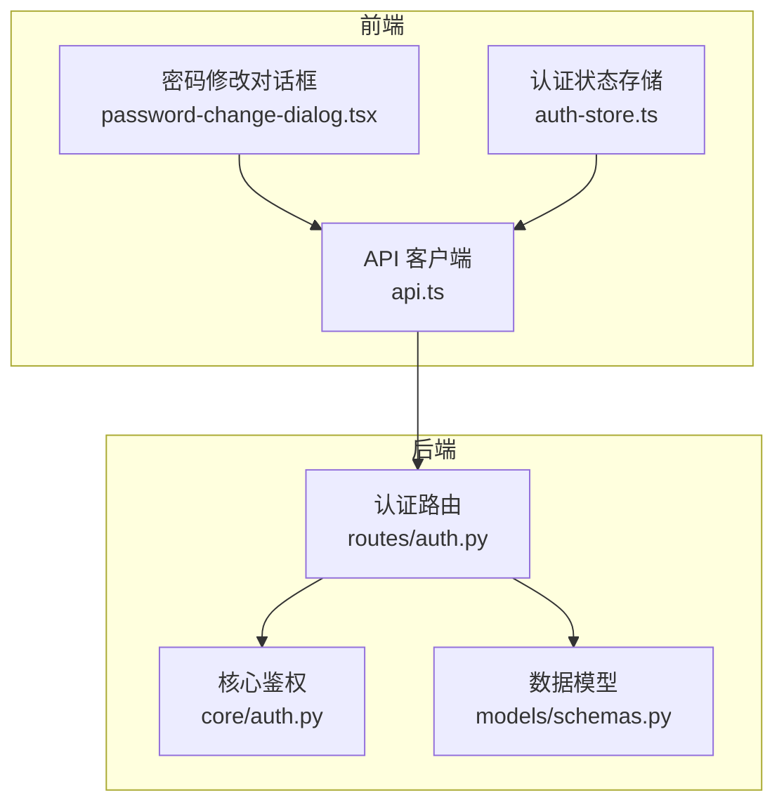
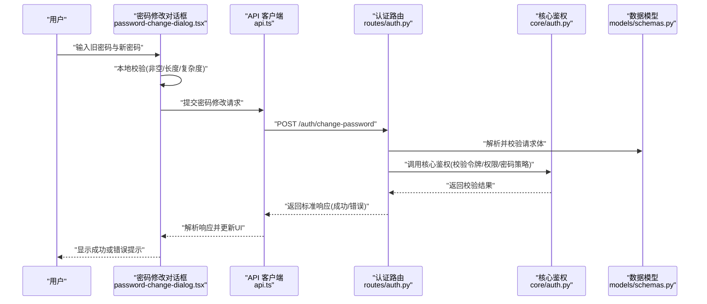
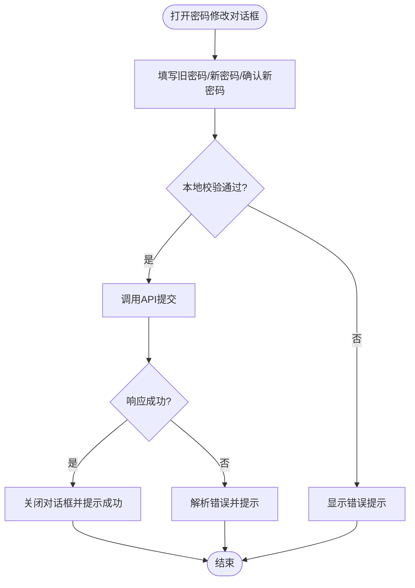
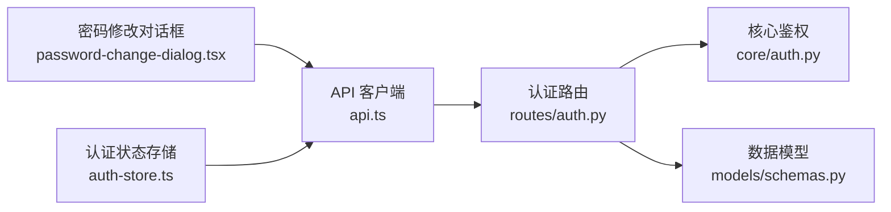

# 密码管理组件

<cite>
**本文引用的文件**   
- [backend_design/nexus/api/routes/auth.py](file://backend_design/nexus/api/routes/auth.py)
- [backend_design/nexus/core/auth.py](file://backend_design/nexus/core/auth.py)
- [backend_design/nexus/models/schemas.py](file://backend_design/nexus/models/schemas.py)
- [frontend_design/src/components/ui/password-change-dialog.tsx](file://frontend_design/src/components/ui/password-change-dialog.tsx)
- [frontend_design/src/stores/auth-store.ts](file://frontend_design/src/stores/auth-store.ts)
- [frontend_design/src/lib/api.ts](file://frontend_design/src/lib/api.ts)
</cite>

## 目录
1. [简介](#简介)
2. [项目结构](#项目结构)
3. [核心组件](#核心组件)
4. [架构总览](#架构总览)
5. [详细组件分析](#详细组件分析)
6. [依赖分析](#依赖分析)
7. [性能考虑](#性能考虑)
8. [故障排查指南](#故障排查指南)
9. [结论](#结论)
10. [附录](#附录)

## 简介
本文件聚焦于“密码管理”相关的前后端实现，覆盖用户密码修改、校验与错误处理流程。内容涵盖：
- 前端交互：密码修改对话框、状态存储与API调用封装
- 后端接口：认证路由、数据模型与核心鉴权逻辑
- 数据流与错误处理：从前端输入到后端验证、再到响应返回的完整链路

## 项目结构
密码管理涉及前后端协作，关键位置如下：
- 前端
  - 密码修改对话框组件：负责表单渲染、本地校验与提交
  - 认证状态存储：维护登录态与用户信息
  - API 客户端：统一封装请求与错误处理
- 后端
  - 认证路由：暴露密码修改等接口
  - 数据模型：定义请求/响应结构
  - 核心鉴权：校验令牌、权限与业务规则

图表来源
- [frontend_design/src/components/ui/password-change-dialog.tsx](file://frontend_design/src/components/ui/password-change-dialog.tsx)
- [frontend_design/src/stores/auth-store.ts](file://frontend_design/src/stores/auth-store.ts)
- [frontend_design/src/lib/api.ts](file://frontend_design/src/lib/api.ts)
- [backend_design/nexus/api/routes/auth.py](file://backend_design/nexus/api/routes/auth.py)
- [backend_design/nexus/core/auth.py](file://backend_design/nexus/core/auth.py)
- [backend_design/nexus/models/schemas.py](file://backend_design/nexus/models/schemas.py)

章节来源
- [frontend_design/src/components/ui/password-change-dialog.tsx](file://frontend_design/src/components/ui/password-change-dialog.tsx)
- [frontend_design/src/stores/auth-store.ts](file://frontend_design/src/stores/auth-store.ts)
- [frontend_design/src/lib/api.ts](file://frontend_design/src/lib/api.ts)
- [backend_design/nexus/api/routes/auth.py](file://backend_design/nexus/api/routes/auth.py)
- [backend_design/nexus/core/auth.py](file://backend_design/nexus/core/auth.py)
- [backend_design/nexus/models/schemas.py](file://backend_design/nexus/models/schemas.py)

## 核心组件
- 前端密码修改对话框
  - 职责：收集旧密码与新密码、执行本地格式校验、触发提交、展示结果与错误
  - 交互：打开/关闭弹窗、禁用提交按钮直至校验通过、成功后提示并关闭
- 认证状态存储
  - 职责：维护当前用户上下文（如用户标识、令牌），在密码修改后刷新必要状态
- API 客户端
  - 职责：统一发起HTTP请求、序列化/反序列化、错误码映射与重试策略（如有）
- 后端认证路由
  - 职责：接收密码修改请求、解析参数、调用核心鉴权模块、返回标准化响应
- 核心鉴权模块
  - 职责：校验令牌有效性、权限、密码强度、历史重复性、账户锁定等安全策略
- 数据模型
  - 职责：定义密码修改请求体与响应体的字段、类型与约束

章节来源
- [frontend_design/src/components/ui/password-change-dialog.tsx](file://frontend_design/src/components/ui/password-change-dialog.tsx)
- [frontend_design/src/stores/auth-store.ts](file://frontend_design/src/stores/auth-store.ts)
- [frontend_design/src/lib/api.ts](file://frontend_design/src/lib/api.ts)
- [backend_design/nexus/api/routes/auth.py](file://backend_design/nexus/api/routes/auth.py)
- [backend_design/nexus/core/auth.py](file://backend_design/nexus/core/auth.py)
- [backend_design/nexus/models/schemas.py](file://backend_design/nexus/models/schemas.py)

## 架构总览
下图展示了密码修改的端到端流程：前端对话框触发，经API客户端转发至后端认证路由，路由层调用核心鉴权完成校验与更新，最终返回结果给前端进行反馈。

图表来源
- [frontend_design/src/components/ui/password-change-dialog.tsx](file://frontend_design/src/components/ui/password-change-dialog.tsx)
- [frontend_design/src/lib/api.ts](file://frontend_design/src/lib/api.ts)
- [backend_design/nexus/api/routes/auth.py](file://backend_design/nexus/api/routes/auth.py)
- [backend_design/nexus/core/auth.py](file://backend_design/nexus/core/auth.py)
- [backend_design/nexus/models/schemas.py](file://backend_design/nexus/models/schemas.py)

## 详细组件分析

### 前端：密码修改对话框
- 功能要点
  - 表单字段：旧密码、新密码、确认新密码
  - 本地校验：必填、最小长度、复杂度（大小写/数字/特殊字符）、两次新密码一致
  - 提交控制：校验通过才启用提交；提交中禁用按钮并显示加载态
  - 结果反馈：成功则关闭对话框并提示；失败则展示具体错误信息
- 与状态存储集成
  - 成功后可触发认证状态刷新（例如重新拉取用户信息或刷新令牌）
- 与API客户端集成
  - 使用统一的请求方法，自动附加认证头、错误码映射与通用提示

图表来源
- [frontend_design/src/components/ui/password-change-dialog.tsx](file://frontend_design/src/components/ui/password-change-dialog.tsx)
- [frontend_design/src/lib/api.ts](file://frontend_design/src/lib/api.ts)

章节来源
- [frontend_design/src/components/ui/password-change-dialog.tsx](file://frontend_design/src/components/ui/password-change-dialog.tsx)
- [frontend_design/src/lib/api.ts](file://frontend_design/src/lib/api.ts)

### 前端：认证状态存储
- 职责
  - 维护当前用户上下文（如用户ID、角色、令牌有效期）
  - 提供读取/更新方法供对话框与API客户端使用
- 与密码修改联动
  - 密码修改成功后，可选择刷新用户信息或刷新令牌，确保会话一致性

章节来源
- [frontend_design/src/stores/auth-store.ts](file://frontend_design/src/stores/auth-store.ts)

### 前端：API 客户端
- 职责
  - 统一封装HTTP请求，自动附加认证头（如Bearer Token）
  - 统一错误处理：将后端错误码映射为友好提示
  - 可选：重试、超时、取消请求
- 与密码修改对接
  - 提供专用方法用于密码修改，简化调用方代码

章节来源
- [frontend_design/src/lib/api.ts](file://frontend_design/src/lib/api.ts)

### 后端：认证路由
- 职责
  - 定义密码修改接口路径与方法
  - 解析请求体、绑定数据模型、调用核心鉴权模块
  - 返回标准化响应（成功/失败及错误信息）
- 与其他模块关系
  - 依赖数据模型进行入参校验
  - 委托核心鉴权模块执行安全策略与业务校验

章节来源
- [backend_design/nexus/api/routes/auth.py](file://backend_design/nexus/api/routes/auth.py)
- [backend_design/nexus/models/schemas.py](file://backend_design/nexus/models/schemas.py)

### 后端：核心鉴权
- 职责
  - 校验访问令牌有效性与权限
  - 校验旧密码是否正确
  - 校验新密码是否符合安全策略（长度、复杂度、历史重复等）
  - 执行密码更新与审计记录（如有）
- 错误处理
  - 返回明确的错误原因（如旧密码错误、新密码不合规、账户被锁定等）

章节来源
- [backend_design/nexus/core/auth.py](file://backend_design/nexus/core/auth.py)

### 后端：数据模型
- 职责
  - 定义密码修改请求体字段（旧密码、新密码等）及其约束
  - 定义响应体结构（成功标志、消息、数据等）
- 作用
  - 作为路由层与核心鉴权之间的契约，保证数据结构一致性

章节来源
- [backend_design/nexus/models/schemas.py](file://backend_design/nexus/models/schemas.py)

## 依赖分析
密码管理的前后端依赖关系如下：

图表来源
- [frontend_design/src/components/ui/password-change-dialog.tsx](file://frontend_design/src/components/ui/password-change-dialog.tsx)
- [frontend_design/src/stores/auth-store.ts](file://frontend_design/src/stores/auth-store.ts)
- [frontend_design/src/lib/api.ts](file://frontend_design/src/lib/api.ts)
- [backend_design/nexus/api/routes/auth.py](file://backend_design/nexus/api/routes/auth.py)
- [backend_design/nexus/core/auth.py](file://backend_design/nexus/core/auth.py)
- [backend_design/nexus/models/schemas.py](file://backend_design/nexus/models/schemas.py)

章节来源
- [frontend_design/src/components/ui/password-change-dialog.tsx](file://frontend_design/src/components/ui/password-change-dialog.tsx)
- [frontend_design/src/stores/auth-store.ts](file://frontend_design/src/stores/auth-store.ts)
- [frontend_design/src/lib/api.ts](file://frontend_design/src/lib/api.ts)
- [backend_design/nexus/api/routes/auth.py](file://backend_design/nexus/api/routes/auth.py)
- [backend_design/nexus/core/auth.py](file://backend_design/nexus/core/auth.py)
- [backend_design/nexus/models/schemas.py](file://backend_design/nexus/models/schemas.py)

## 性能考虑
- 前端
  - 本地校验优先，减少无效网络请求
  - 提交时禁用按钮与显示加载态，避免重复提交
  - 合理设置请求超时与取消机制
- 后端
  - 对密码强度与历史重复性检查进行缓存优化（如最近N次密码哈希集合）
  - 限制并发与速率，防止暴力破解
  - 异步记录审计日志，降低主流程延迟

[本节为通用指导，无需特定文件引用]

## 故障排查指南
- 常见错误与定位
  - 旧密码错误：检查核心鉴权模块的旧密码比对逻辑
  - 新密码不合规：核对数据模型约束与核心鉴权的复杂度策略
  - 令牌失效：检查认证路由的令牌校验与前端是否携带正确认证头
  - 网络异常：查看API客户端的错误映射与重试策略
- 建议的调试步骤
  - 在前端控制台查看请求载荷与响应体
  - 在后端日志中检索对应接口的入参与错误堆栈
  - 复现最小用例，逐步缩小问题范围

章节来源
- [frontend_design/src/lib/api.ts](file://frontend_design/src/lib/api.ts)
- [backend_design/nexus/api/routes/auth.py](file://backend_design/nexus/api/routes/auth.py)
- [backend_design/nexus/core/auth.py](file://backend_design/nexus/core/auth.py)

## 结论
密码管理组件通过前后端协同实现了安全的密码修改流程：前端负责友好的交互与基础校验，后端负责严格的身份与策略校验。通过清晰的依赖关系与标准化的错误处理，整体具备良好的可维护性与可扩展性。后续可在审计追踪、多因素验证与更细粒度的风控策略方面持续增强。

[本节为总结性内容，无需特定文件引用]

## 附录
- 术语
  - 旧密码：当前已生效的密码，用于身份二次确认
  - 新密码：待更新的密码，需满足安全策略
  - 令牌：用于鉴权的短期凭证（如JWT）
- 参考实现位置
  - 前端对话框：[frontend_design/src/components/ui/password-change-dialog.tsx](file://frontend_design/src/components/ui/password-change-dialog.tsx)
  - 认证状态存储：[frontend_design/src/stores/auth-store.ts](file://frontend_design/src/stores/auth-store.ts)
  - API 客户端：[frontend_design/src/lib/api.ts](file://frontend_design/src/lib/api.ts)
  - 认证路由：[backend_design/nexus/api/routes/auth.py](file://backend_design/nexus/api/routes/auth.py)
  - 核心鉴权：[backend_design/nexus/core/auth.py](file://backend_design/nexus/core/auth.py)
  - 数据模型：[backend_design/nexus/models/schemas.py](file://backend_design/nexus/models/schemas.py)