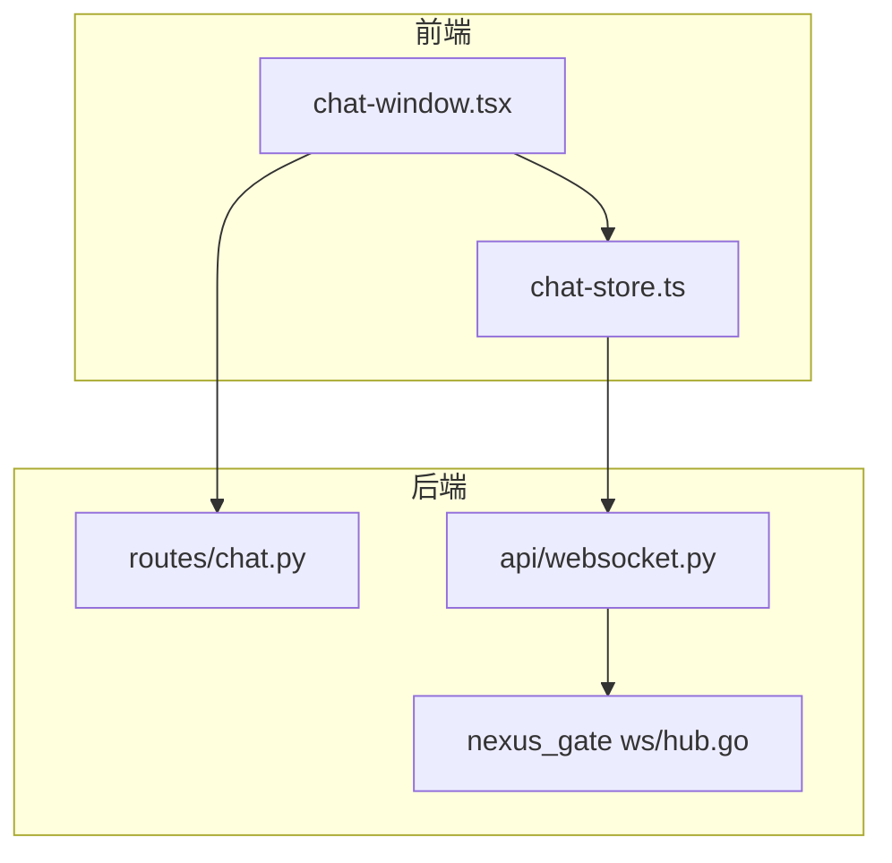
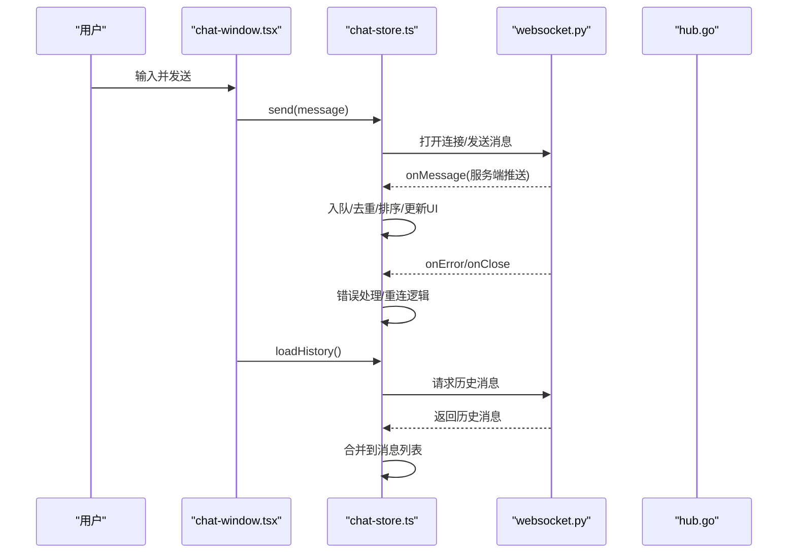
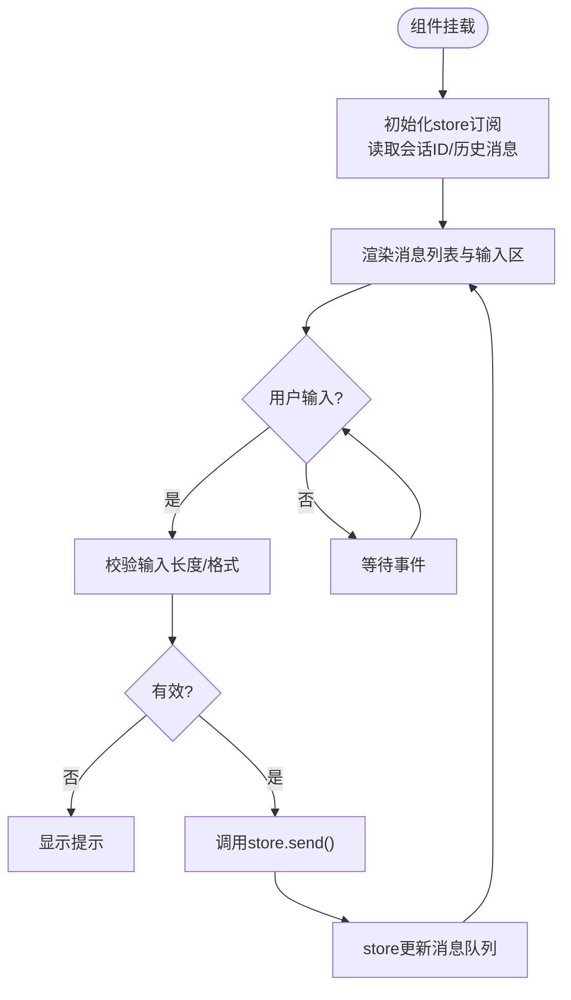
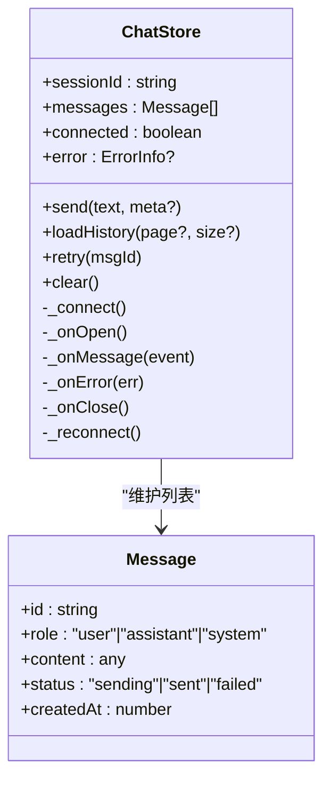
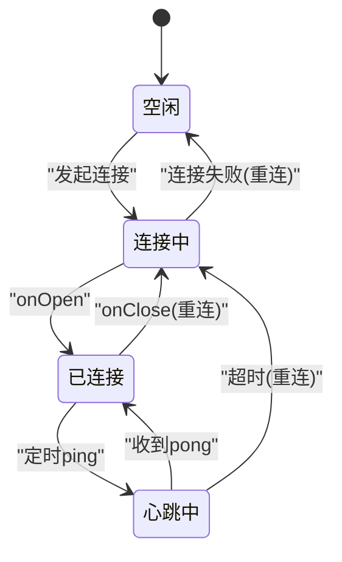
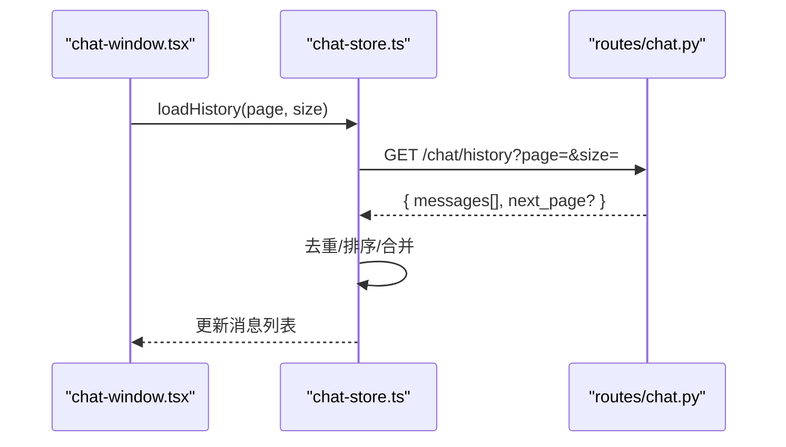
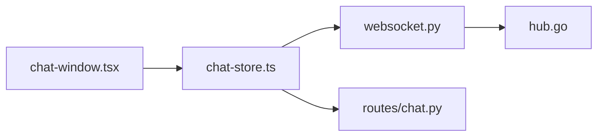

# 聊天组件

<cite>
**本文引用的文件**   
- [chat-window.tsx](file://frontend_design/src/components/chat/chat-window.tsx)
- [chat-store.ts](file://frontend_design/src/stores/chat-store.ts)
- [websocket.ts](file://backend_design/nexus/api/websocket.py)
- [chat.py](file://backend_design/nexus/api/routes/chat.py)
- [hub.go](file://backend_design/nexus_gate/internal/ws/hub.go)
</cite>

## 目录
1. [简介](#简介)
2. [项目结构](#项目结构)
3. [核心组件](#核心组件)
4. [架构总览](#架构总览)
5. [详细组件分析](#详细组件分析)
6. [依赖关系分析](#依赖关系分析)
7. [性能考虑](#性能考虑)
8. [故障排查指南](#故障排查指南)
9. [结论](#结论)
10. [附录](#附录)

## 简介
本技术文档聚焦于前端聊天组件 chat-window.tsx 的实现与集成，围绕消息渲染机制、用户输入处理、实时通信集成与状态管理展开。文档同时说明与 chat-store.ts 的状态同步机制（消息队列、错误处理与重连）、WebSocket 连接生命周期、消息格式定义与事件处理模式，并提供组件的自定义配置项、样式定制方法与扩展点说明，最后给出虚拟滚动、消息缓存与内存管理等性能优化策略。

## 项目结构
前端侧：
- 组件层：components/chat/chat-window.tsx 负责 UI 渲染与交互
- 状态层：stores/chat-store.ts 维护会话状态、消息队列与连接控制
- 类型与工具：types/index.ts、lib/* 提供类型与通用工具

后端侧：
- API 路由：nexus/api/routes/chat.py 暴露 HTTP 接口（如历史消息加载）
- WebSocket 服务：nexus/api/websocket.py 提供 WS 接入
- 网关转发：nexus_gate/internal/ws/hub.go 实现多实例广播/转发

图表来源
- [chat-window.tsx](file://frontend_design/src/components/chat/chat-window.tsx)
- [chat-store.ts](file://frontend_design/src/stores/chat-store.ts)
- [websocket.py](file://backend_design/nexus/api/websocket.py)
- [chat.py](file://backend_design/nexus/api/routes/chat.py)
- [hub.go](file://backend_design/nexus_gate/internal/ws/hub.go)

章节来源
- [chat-window.tsx](file://frontend_design/src/components/chat/chat-window.tsx)
- [chat-store.ts](file://frontend_design/src/stores/chat-store.ts)
- [websocket.py](file://backend_design/nexus/api/websocket.py)
- [chat.py](file://backend_design/nexus/api/routes/chat.py)
- [hub.go](file://backend_design/nexus_gate/internal/ws/hub.go)

## 核心组件
- chat-window.tsx
  - 职责：渲染消息列表、展示输入框与发送按钮、处理键盘与点击事件、调用 store 发起发送、监听 store 变更驱动 UI 更新、在必要时触发历史消息加载与自动滚动。
  - 关键交互：文本输入、回车发送、粘贴图片/附件（若支持）、清空输入、重试失败消息。
- chat-store.ts
  - 职责：维护当前会话 ID、消息列表、连接状态、错误信息；封装 WebSocket 连接生命周期（建立、心跳、重连、关闭）；提供 send/load/retry/clear 等动作；对消息进行去重、排序与分页加载；持久化必要状态（可选）。

章节来源
- [chat-window.tsx](file://frontend_design/src/components/chat/chat-window.tsx)
- [chat-store.ts](file://frontend_design/src/stores/chat-store.ts)

## 架构总览
前后端通过 WebSocket 进行实时双向通信，HTTP 用于历史消息拉取与鉴权等辅助能力。网关 hub.go 在多实例场景下承担消息广播与转发职责。

图表来源
- [chat-window.tsx](file://frontend_design/src/components/chat/chat-window.tsx)
- [chat-store.ts](file://frontend_design/src/stores/chat-store.ts)
- [websocket.py](file://backend_design/nexus/api/websocket.py)
- [hub.go](file://backend_design/nexus_gate/internal/ws/hub.go)

## 详细组件分析

### chat-window.tsx 组件分析
- 渲染机制
  - 从 chat-store 订阅消息列表与连接状态，按时间顺序渲染消息气泡。
  - 根据消息类型（文本、富文本、系统提示、错误态）选择不同渲染分支。
  - 自动滚动到底部策略：新消息到达或用户主动滚动回顶部时保持行为一致。
- 用户输入处理
  - 文本输入框绑定 onChange/onKeyDown，Enter 触发发送，Shift+Enter 换行。
  - 防抖/节流：避免重复提交；空内容拦截；超长输入截断提示。
  - 附件/图片：若支持，先本地预览，再上传后以占位消息显示，成功后替换为真实内容。
- 实时通信集成
  - 通过 chat-store 提供的 send/load/retry 等方法与后端交互。
  - 连接断开时显示“已断开”提示，支持手动重连。
- 状态管理
  - 仅持有必要的本地临时状态（如输入值、是否加载中），核心数据由 chat-store 统一维护。
  - 使用最小化 re-render：将消息列表拆分为不可变引用或稳定 key，减少不必要的重渲染。

图表来源
- [chat-window.tsx](file://frontend_design/src/components/chat/chat-window.tsx)
- [chat-store.ts](file://frontend_design/src/stores/chat-store.ts)

章节来源
- [chat-window.tsx](file://frontend_design/src/components/chat/chat-window.tsx)
- [chat-store.ts](file://frontend_design/src/stores/chat-store.ts)

### chat-store.ts 状态同步机制
- 消息队列管理
  - 新增消息：入队前进行去重（基于唯一键，如服务端返回的 id 或客户端生成 id + 时间戳）。
  - 排序与分页：按时间升序排列；首次加载采用分页拉取，后续增量追加。
  - 乐观更新：发送后立即插入“待确认”消息，收到服务端确认后替换为最终态。
- 错误处理
  - 网络异常：标记消息为“发送失败”，提供重试入口。
  - 业务错误：解析服务端错误码，转换为友好提示。
  - 幂等性：重试不产生重复消息。
- 重连逻辑
  - 指数退避：连接失败后按固定间隔递增重试，设置最大重试次数与上限间隔。
  - 断线恢复：重连成功后补拉缺失消息（基于 last_seen_id 或时间戳）。
  - 资源清理：断开时释放定时器与事件监听，避免内存泄漏。

图表来源
- [chat-store.ts](file://frontend_design/src/stores/chat-store.ts)

章节来源
- [chat-store.ts](file://frontend_design/src/stores/chat-store.ts)

### WebSocket 连接生命周期与事件处理
- 生命周期
  - 建立：组件挂载或会话切换时尝试连接；鉴权通过后进入 ready 状态。
  - 心跳：周期性 ping/pong 保活；超时则判定断开。
  - 关闭：正常关闭与异常关闭分别处理，触发重连或提示用户。
- 事件处理模式
  - onOpen：注册消息处理器，启动心跳。
  - onMessage：解析消息体，区分类型（文本、富文本、系统通知、错误），写入 store。
  - onError/onClose：记录错误日志，执行重连策略。
- 消息格式定义（建议）
  - 上行：{ type: "message", payload: { text, attachments?, metadata? }, id?: string }
  - 下行：{ type: "message"|"ack"|"error"|"system", payload: {...}, id?: string, ts: number }
  - 控制帧：{ type: "ping"|"pong"|"join"|"leave" }

图表来源
- [websocket.py](file://backend_design/nexus/api/websocket.py)
- [hub.go](file://backend_design/nexus_gate/internal/ws/hub.go)
- [chat-store.ts](file://frontend_design/src/stores/chat-store.ts)

章节来源
- [websocket.py](file://backend_design/nexus/api/websocket.py)
- [hub.go](file://backend_design/nexus_gate/internal/ws/hub.go)
- [chat-store.ts](file://frontend_design/src/stores/chat-store.ts)

### 历史消息加载与合并
- 触发时机：组件首次挂载、会话切换、下拉加载更多。
- 加载流程：向 chat API 请求历史页 -> 合并到现有列表 -> 保持滚动位置或滚动至底部（取决于用户行为）。
- 去重策略：基于服务端 id 或时间戳范围去重，避免重复渲染。

图表来源
- [chat-window.tsx](file://frontend_design/src/components/chat/chat-window.tsx)
- [chat-store.ts](file://frontend_design/src/stores/chat-store.ts)
- [chat.py](file://backend_design/nexus/api/routes/chat.py)

章节来源
- [chat-window.tsx](file://frontend_design/src/components/chat/chat-window.tsx)
- [chat-store.ts](file://frontend_design/src/stores/chat-store.ts)
- [chat.py](file://backend_design/nexus/api/routes/chat.py)

## 依赖关系分析
- 组件依赖
  - chat-window.tsx 依赖 chat-store.ts 提供的状态与动作方法。
  - chat-store.ts 依赖 WebSocket 客户端封装（可能位于 lib 或内部实现）与 HTTP 客户端（用于历史消息）。
- 后端依赖
  - websocket.py 作为 WS 接入层，可能与 hub.go 协作完成跨实例广播。
  - routes/chat.py 提供 REST 接口供前端拉取历史消息。

图表来源
- [chat-window.tsx](file://frontend_design/src/components/chat/chat-window.tsx)
- [chat-store.ts](file://frontend_design/src/stores/chat-store.ts)
- [websocket.py](file://backend_design/nexus/api/websocket.py)
- [chat.py](file://backend_design/nexus/api/routes/chat.py)
- [hub.go](file://backend_design/nexus_gate/internal/ws/hub.go)

章节来源
- [chat-window.tsx](file://frontend_design/src/components/chat/chat-window.tsx)
- [chat-store.ts](file://frontend_design/src/stores/chat-store.ts)
- [websocket.py](file://backend_design/nexus/api/websocket.py)
- [chat.py](file://backend_design/nexus/api/routes/chat.py)
- [hub.go](file://backend_design/nexus_gate/internal/ws/hub.go)

## 性能考虑
- 虚拟滚动
  - 对长列表启用虚拟滚动，仅渲染可视区域的消息节点，显著降低 DOM 压力。
  - 结合稳定的 itemKey（消息 id）提升 diff 效率。
- 消息缓存
  - 本地缓存最近 N 条消息，减少重复请求；会话切换时按需加载。
  - 对富媒体内容（图片/音频）做懒加载与缩略图缓存。
- 内存管理
  - 限制消息列表最大长度，超出部分归档或移除；重连后按需补拉。
  - 及时清理事件监听器、定时器与 WebSocket 引用，避免泄漏。
- 渲染优化
  - 使用 React.memo 包裹消息项组件，避免无关属性变化导致重渲染。
  - 批量更新：将多条消息合并为一个 state 更新批次。
- 网络优化
  - 压缩传输（gzip/protobuf）；合理分页大小；断线续传与增量同步。

[本节为通用性能指导，无需特定文件来源]

## 故障排查指南
- 常见问题
  - 无法连接：检查鉴权参数、跨域配置、防火墙与代理设置。
  - 消息丢失：核对服务端 id 与时间戳，确认重连后的补拉逻辑是否生效。
  - 重复消息：检查去重键是否稳定且全局唯一。
  - 频繁重连：调整心跳超时与退避策略，观察服务端负载。
- 定位步骤
  - 查看浏览器控制台与网络面板，确认 WS 握手与消息收发。
  - 在 chat-store 的错误回调处打印上下文（会话 id、错误码、堆栈）。
  - 对比前后端日志，确认消息序列号与时间戳一致性。
- 恢复策略
  - 手动重连：提供 UI 入口触发重连。
  - 降级模式：在网络不可用时允许离线草稿与延迟发送。

章节来源
- [chat-store.ts](file://frontend_design/src/stores/chat-store.ts)
- [websocket.py](file://backend_design/nexus/api/websocket.py)

## 结论
chat-window.tsx 与 chat-store.ts 共同构成了一个高内聚、低耦合的聊天子系统。通过明确的消息格式、稳健的重连与错误处理、以及良好的渲染与内存管理策略，可在复杂网络环境下提供流畅的用户体验。建议在后续迭代中持续完善监控埋点、可观测性与自动化测试，进一步提升稳定性与可维护性。

[本节为总结性内容，无需特定文件来源]

## 附录
- 自定义配置选项（示例）
  - 会话标识：sessionId
  - 初始分页：historyPageSize
  - 重连策略：maxRetries、backoffBaseMs、backoffMaxMs
  - 渲染开关：showTimestamps、enableVirtualScroll
- 样式定制方法
  - 通过 CSS 变量或主题配置覆盖气泡、背景、字体与间距。
  - 针对移动端适配：调整输入区高度与键盘避让。
- 扩展点
  - 消息类型扩展：在渲染分支中新增类型判断与渲染器。
  - 插件式中间件：在 chat-store 的 send/load 钩子中注入审计、统计或敏感词过滤。
  - 第三方集成：对接 TTS/ASR、知识库检索与外部工具调用。

[本节为概念性说明，无需特定文件来源]