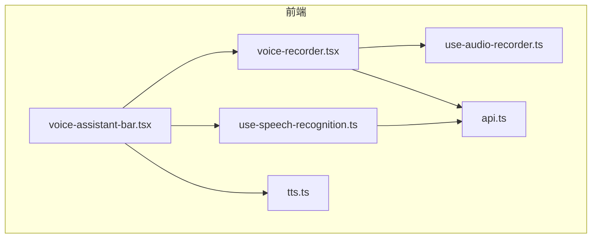
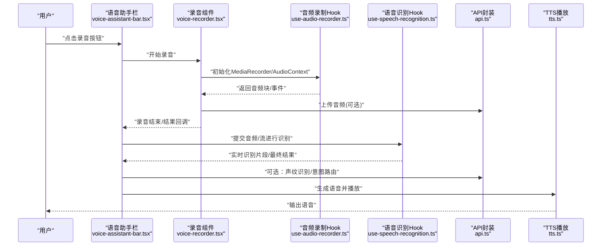
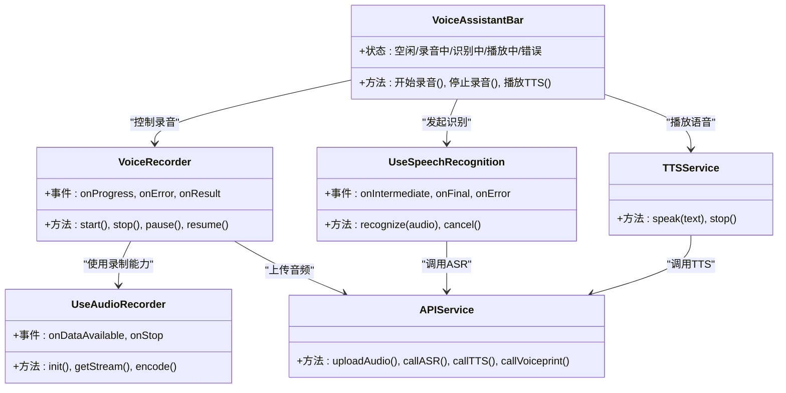

# 语音交互组件

<cite>
**本文引用的文件**   
- [voice-recorder.tsx](file://frontend_design/src/components/voice-recorder.tsx)
- [voice-assistant-bar.tsx](file://frontend_design/src/components/vehicle/voice-assistant-bar.tsx)
- [use-audio-recorder.ts](file://frontend_design/src/hooks/use-audio-recorder.ts)
- [use-speech-recognition.ts](file://frontend_design/src/hooks/use-speech-recognition.ts)
- [tts.ts](file://frontend_design/src/lib/tts.ts)
- [api.ts](file://frontend_design/src/lib/api.ts)
- [README.md](file://docs/voice/README.md)
- [audio-pipeline-guide.md](file://docs/voice/audio-pipeline-guide.md)
- [tts-guide.md](file://docs/voice/tts-guide.md)
- [voiceprint-guide.md](file://docs/voice/voiceprint-guide.md)
</cite>

## 目录
1. [简介](#简介)
2. [项目结构](#项目结构)
3. [核心组件](#核心组件)
4. [架构总览](#架构总览)
5. [详细组件分析](#详细组件分析)
6. [依赖关系分析](#依赖关系分析)
7. [性能考虑](#性能考虑)
8. [故障排查指南](#故障排查指南)
9. [结论](#结论)
10. [附录](#附录)

## 简介
本技术文档聚焦前端语音交互能力，围绕以下目标展开：
- 深入解析录音组件 voice-recorder.tsx 的音频采集、格式转换与上传处理流程。
- 详细说明语音助手栏 voice-assistant-bar.tsx 的 UI 交互与状态管理。
- 解释自定义 Hook use-audio-recorder.ts 与 use-speech-recognition.ts 的音频处理逻辑与浏览器兼容性策略。
- 描述语音识别结果的实时处理、TTS 语音合成播放以及声纹识别集成方式。
- 提供配置项说明、错误处理与性能优化策略，并给出移动端适配、无障碍访问与用户体验优化的最佳实践。

## 项目结构
前端语音相关代码主要位于 frontend_design/src 下，关键位置如下：
- 组件层：components/voice-recorder.tsx、components/vehicle/voice-assistant-bar.tsx
- 钩子层：hooks/use-audio-recorder.ts、hooks/use-speech-recognition.ts
- 能力库：lib/tts.ts（TTS 播放）、lib/api.ts（网络请求）
- 文档：docs/voice/*（语音管线、TTS、声纹指南）

图表来源
- [voice-recorder.tsx](file://frontend_design/src/components/voice-recorder.tsx)
- [voice-assistant-bar.tsx](file://frontend_design/src/components/vehicle/voice-assistant-bar.tsx)
- [use-audio-recorder.ts](file://frontend_design/src/hooks/use-audio-recorder.ts)
- [use-speech-recognition.ts](file://frontend_design/src/hooks/use-speech-recognition.ts)
- [tts.ts](file://frontend_design/src/lib/tts.ts)
- [api.ts](file://frontend_design/src/lib/api.ts)

章节来源
- [voice-recorder.tsx](file://frontend_design/src/components/voice-recorder.tsx)
- [voice-assistant-bar.tsx](file://frontend_design/src/components/vehicle/voice-assistant-bar.tsx)
- [use-audio-recorder.ts](file://frontend_design/src/hooks/use-audio-recorder.ts)
- [use-speech-recognition.ts](file://frontend_design/src/hooks/use-speech-recognition.ts)
- [tts.ts](file://frontend_design/src/lib/tts.ts)
- [api.ts](file://frontend_design/src/lib/api.ts)

## 核心组件
本节从职责边界与数据流角度，概述各模块如何协作完成“说话—识别—回复—播报”的闭环。

- voice-recorder.tsx：负责录音生命周期管理（开始/停止）、媒体流获取、本地转码与上传触发。
- voice-assistant-bar.tsx：作为入口 UI，聚合录音、识别、TTS 播放等状态，驱动用户交互。
- use-audio-recorder.ts：封装 MediaRecorder 与 AudioContext，提供跨浏览器兼容的录制能力。
- use-speech-recognition.ts：封装 Web Speech API 或对接后端 ASR，提供实时/非实时识别回调。
- tts.ts：封装 Web Speech Synthesis 或后端 TTS 接口，实现文本到语音的播放控制。
- api.ts：统一网络请求封装，承载上传、ASR/TTS/声纹识别等调用。

章节来源
- [voice-recorder.tsx](file://frontend_design/src/components/voice-recorder.tsx)
- [voice-assistant-bar.tsx](file://frontend_design/src/components/vehicle/voice-assistant-bar.tsx)
- [use-audio-recorder.ts](file://frontend_design/src/hooks/use-audio-recorder.ts)
- [use-speech-recognition.ts](file://frontend_design/src/hooks/use-speech-recognition.ts)
- [tts.ts](file://frontend_design/src/lib/tts.ts)
- [api.ts](file://frontend_design/src/lib/api.ts)

## 架构总览
下图展示了从用户点击到最终语音播报的关键路径，包括录音、识别、TTS 与声纹识别的集成点。

图表来源
- [voice-assistant-bar.tsx](file://frontend_design/src/components/vehicle/voice-assistant-bar.tsx)
- [voice-recorder.tsx](file://frontend_design/src/components/voice-recorder.tsx)
- [use-audio-recorder.ts](file://frontend_design/src/hooks/use-audio-recorder.ts)
- [use-speech-recognition.ts](file://frontend_design/src/hooks/use-speech-recognition.ts)
- [tts.ts](file://frontend_design/src/lib/tts.ts)
- [api.ts](file://frontend_design/src/lib/api.ts)

## 详细组件分析

### 录音组件 voice-recorder.tsx
职责与流程
- 音频采集：通过浏览器媒体接口获取麦克风权限与媒体流，交由录制 Hook 管理。
- 格式转换：在浏览器端将原始 PCM 转换为通用容器格式（如 WAV/OGG），便于上传与后端处理。
- 上传处理：将音频分片或整体上传至后端，支持断点续传与进度反馈。
- 事件与状态：暴露开始/停止/暂停/恢复等状态，向父组件推送进度与错误信息。

关键设计要点
- 资源释放：确保在组件卸载或异常时正确关闭媒体流与上下文，避免内存泄漏。
- 错误边界：对权限拒绝、设备不可用、编码不支持等场景进行兜底提示。
- 可插拔编码器：根据浏览器能力选择最优编码方案，必要时回退到后端转码。

章节来源
- [voice-recorder.tsx](file://frontend_design/src/components/voice-recorder.tsx)
- [use-audio-recorder.ts](file://frontend_design/src/hooks/use-audio-recorder.ts)
- [api.ts](file://frontend_design/src/lib/api.ts)

### 语音助手栏 voice-assistant-bar.tsx
UI 交互与状态管理
- 入口按钮：提供“按住说话/点击开始”两种模式，适配桌面与移动端。
- 状态机：维护空闲、录音中、识别中、播放中、错误等状态，驱动图标与文案变化。
- 结果展示：实时显示识别片段，最终结果进入业务处理流程。
- 集成点：串联录音、识别、TTS 播放与声纹识别，统一错误与重试策略。

用户体验优化
- 防误触：长按阈值、滑动取消、超时自动停止。
- 视觉反馈：波形动画、音量指示、加载骨架屏。
- 无障碍：ARIA 标签、键盘可达、屏幕阅读器友好。

章节来源
- [voice-assistant-bar.tsx](file://frontend_design/src/components/vehicle/voice-assistant-bar.tsx)
- [use-speech-recognition.ts](file://frontend_design/src/hooks/use-speech-recognition.ts)
- [tts.ts](file://frontend_design/src/lib/tts.ts)

### 音频录制 Hook use-audio-recorder.ts
功能与兼容性
- 媒体流管理：封装 navigator.mediaDevices.getUserMedia，处理权限与设备枚举。
- 录制引擎：基于 MediaRecorder 或 AudioWorklet，按浏览器能力选择最佳实现。
- 编码策略：优先使用浏览器原生编码（如 webm/ogg），否则回退到 PCM 后由后端转码。
- 事件模型：ondataavailable/onerror/onstop 等事件标准化，向上层提供稳定接口。

复杂度与性能
- 低延迟：采用分片上传与流式处理，减少首包时间。
- 内存控制：及时释放 Blob 与 ArrayBuffer，避免长录音导致内存峰值过高。

章节来源
- [use-audio-recorder.ts](file://frontend_design/src/hooks/use-audio-recorder.ts)
- [api.ts](file://frontend_design/src/lib/api.ts)

### 语音识别 Hook use-speech-recognition.ts
识别路径
- 浏览器原生：优先尝试 Web Speech API（SpeechRecognition），适用于 Chrome/Edge 等。
- 后端增强：当原生不可用时，将音频流/片段发送至后端 ASR，返回增量与最终结果。
- 实时处理：以节流/合并策略聚合中间结果，提升可读性与稳定性。

兼容性处理
- 特性检测：运行时检测 API 可用性，动态切换策略。
- 降级策略：无权限或不可用时引导用户授权或切换到按键发送文本。

章节来源
- [use-speech-recognition.ts](file://frontend_design/src/hooks/use-speech-recognition.ts)
- [api.ts](file://frontend_design/src/lib/api.ts)

### TTS 播放 tts.ts
播放策略
- 浏览器原生：优先使用 SpeechSynthesis，零网络开销，适合短文本即时反馈。
- 服务端合成：对于高质量音色或个性化声音，调用后端 TTS 接口并流式播放。
- 播放控制：支持暂停/继续/停止、语速/音量调节、队列管理。

章节来源
- [tts.ts](file://frontend_design/src/lib/tts.ts)
- [api.ts](file://frontend_design/src/lib/api.ts)

### 声纹识别集成
集成点
- 注册阶段：采集用户声纹样本，上传至后端进行特征提取与存储。
- 验证阶段：在对话前或敏感操作前进行声纹校验，结合业务规则决定是否放行。
- 容错策略：失败重试、多轮采样融合、人工复核通道。

章节来源
- [voiceprint-guide.md](file://docs/voice/voiceprint-guide.md)
- [api.ts](file://frontend_design/src/lib/api.ts)

## 依赖关系分析
组件与 Hook 之间的耦合关系如下：

图表来源
- [voice-assistant-bar.tsx](file://frontend_design/src/components/vehicle/voice-assistant-bar.tsx)
- [voice-recorder.tsx](file://frontend_design/src/components/voice-recorder.tsx)
- [use-audio-recorder.ts](file://frontend_design/src/hooks/use-audio-recorder.ts)
- [use-speech-recognition.ts](file://frontend_design/src/hooks/use-speech-recognition.ts)
- [tts.ts](file://frontend_design/src/lib/tts.ts)
- [api.ts](file://frontend_design/src/lib/api.ts)

章节来源
- [voice-assistant-bar.tsx](file://frontend_design/src/components/vehicle/voice-assistant-bar.tsx)
- [voice-recorder.tsx](file://frontend_design/src/components/voice-recorder.tsx)
- [use-audio-recorder.ts](file://frontend_design/src/hooks/use-audio-recorder.ts)
- [use-speech-recognition.ts](file://frontend_design/src/hooks/use-speech-recognition.ts)
- [tts.ts](file://frontend_design/src/lib/tts.ts)
- [api.ts](file://frontend_design/src/lib/api.ts)

## 性能考虑
- 首帧延迟：采用流式识别与边录边传，缩短端到端时延。
- 编码选择：优先使用浏览器高效编码；若需通用性，则在前端轻量转码后再上传。
- 内存管理：及时释放临时对象，限制缓存大小，避免长会话内存膨胀。
- 并发控制：限制同时进行的录音/识别/播放任务数，避免抢占系统资源。
- 网络优化：压缩音频、分片上传、重试与退避策略，降低弱网影响。

[本节为通用指导，不直接分析具体文件]

## 故障排查指南
常见问题与定位步骤
- 无法获取麦克风：检查权限弹窗、HTTPS 环境、设备占用情况。
- 录音无声或中断：确认设备默认输入、浏览器兼容性、AudioContext 是否被挂起。
- 识别结果为空：核查网络连通、ASR 服务状态、音频质量与噪声水平。
- TTS 无声音：检查浏览器合成器可用性、音频队列与静音设置。
- 声纹验证失败：增加采样次数、调整阈值、查看后端日志与相似度分数。

建议的日志与埋点
- 记录关键事件：开始/停止、错误码、耗时、文件大小、网络状态。
- 用户反馈入口：一键上报问题，附带环境与版本信息。

章节来源
- [api.ts](file://frontend_design/src/lib/api.ts)
- [tts.ts](file://frontend_design/src/lib/tts.ts)
- [use-audio-recorder.ts](file://frontend_design/src/hooks/use-audio-recorder.ts)
- [use-speech-recognition.ts](file://frontend_design/src/hooks/use-speech-recognition.ts)

## 结论
本语音交互方案以组件化与 Hook 抽象为核心，兼顾浏览器原生能力与后端增强，形成“采集—识别—合成—反馈”的完整链路。通过合理的兼容性策略、错误处理与性能优化，可在多端环境下提供稳定且流畅的语音体验。后续可进一步引入更智能的降噪、端侧小模型与个性化音色，持续提升用户体验。

[本节为总结性内容，不直接分析具体文件]

## 附录

### 配置选项参考
- 录音参数：采样率、声道数、比特率、分片大小、最大时长。
- 识别参数：语言、热词、实时开关、增量合并窗口。
- TTS 参数：音色、语速、音量、流式播放开关。
- 声纹参数：注册样本数量、阈值、重试次数。

章节来源
- [audio-pipeline-guide.md](file://docs/voice/audio-pipeline-guide.md)
- [tts-guide.md](file://docs/voice/tts-guide.md)
- [voiceprint-guide.md](file://docs/voice/voiceprint-guide.md)

### 移动端适配与无障碍最佳实践
- 移动端适配：全屏遮罩、手势交互、横竖屏自适应、后台录音限制处理。
- 无障碍访问：语义化标签、ARIA 属性、键盘导航、读屏器提示。
- 用户体验：明确的状态反馈、错误引导、重试机制、离线降级。

章节来源
- [README.md](file://docs/voice/README.md)
- [audio-pipeline-guide.md](file://docs/voice/audio-pipeline-guide.md)
- [tts-guide.md](file://docs/voice/tts-guide.md)
- [voiceprint-guide.md](file://docs/voice/voiceprint-guide.md)