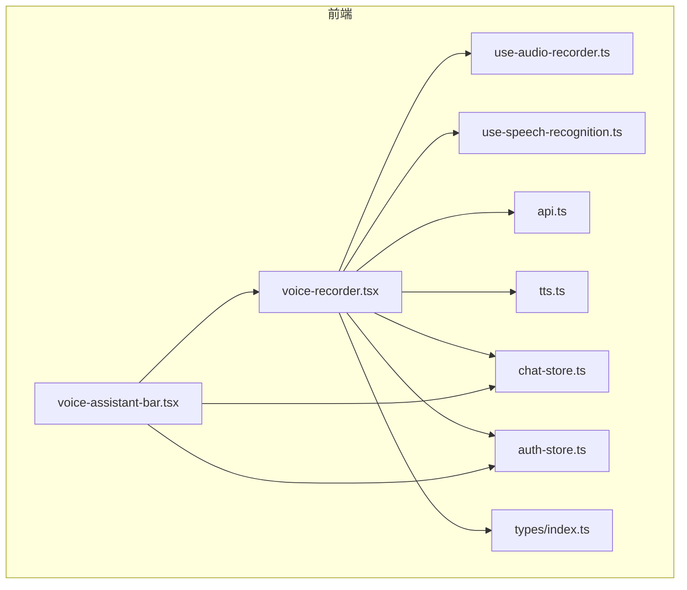
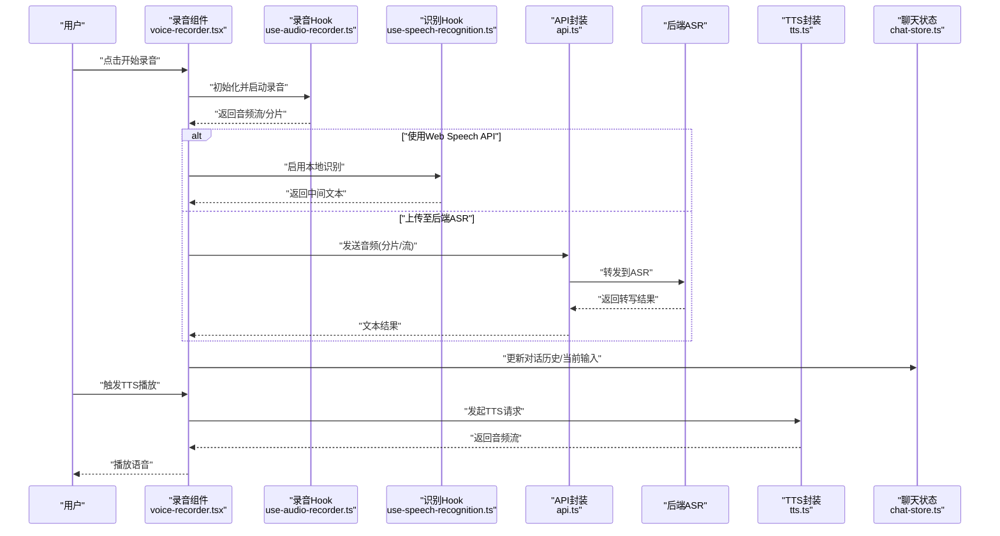
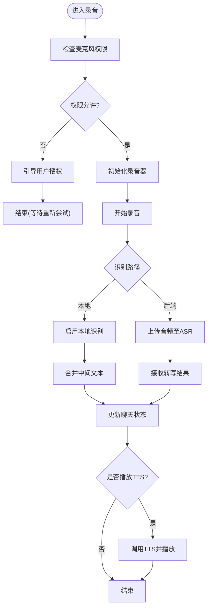
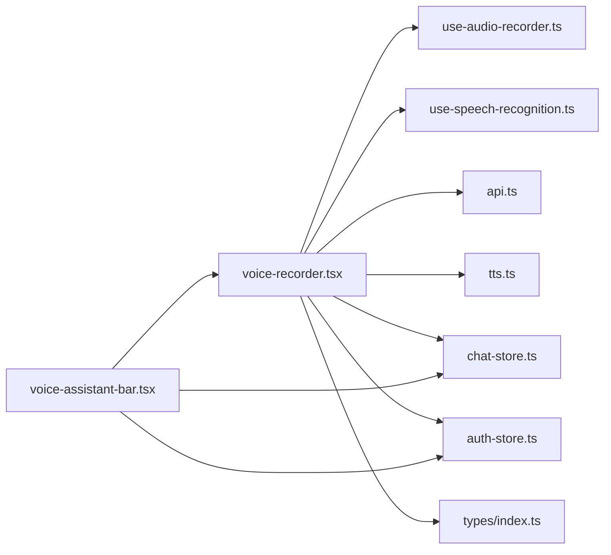

# 语音录制组件

<cite>
**本文引用的文件**   
- [voice-recorder.tsx](file://frontend_design/src/components/voice-recorder.tsx)
- [use-audio-recorder.ts](file://frontend_design/src/hooks/use-audio-recorder.ts)
- [use-speech-recognition.ts](file://frontend_design/src/hooks/use-speech-recognition.ts)
- [voice-assistant-bar.tsx](file://frontend_design/src/components/vehicle/voice-assistant-bar.tsx)
- [api.ts](file://frontend_design/src/lib/api.ts)
- [tts.ts](file://frontend_design/src/lib/tts.ts)
- [chat-store.ts](file://frontend_design/src/stores/chat-store.ts)
- [auth-store.ts](file://frontend_design/src/stores/auth-store.ts)
- [index.ts](file://frontend_design/src/types/index.ts)
- [README.md](file://docs/voice/README.md)
- [audio-pipeline-guide.md](file://docs/voice/audio-pipeline-guide.md)
- [tts-guide.md](file://docs/voice/tts-guide.md)
- [voiceprint-guide.md](file://docs/voice/voiceprint-guide.md)
</cite>

## 目录
1. [简介](#简介)
2. [项目结构](#项目结构)
3. [核心组件](#核心组件)
4. [架构总览](#架构总览)
5. [详细组件分析](#详细组件分析)
6. [依赖分析](#依赖分析)
7. [性能考虑](#性能考虑)
8. [故障排查指南](#故障排查指南)
9. [结论](#结论)
10. [附录](#附录)

## 简介
本文件聚焦于前端“语音录制组件”的实现与集成，覆盖从浏览器录音、实时转写、到后端 ASR/TTS 交互的完整链路。文档面向开发者与产品人员，既提供代码级细节，也给出可视化流程图与排障建议，帮助快速定位问题并优化体验。

## 项目结构
与语音录制相关的前端代码主要分布在以下位置：
- 组件层：页面内可复用的录音 UI 与入口
- Hooks 层：封装浏览器 MediaRecorder 与 Web Speech API 的能力
- 业务逻辑层：与后端 API、TTS、状态管理对接
- 类型定义：统一的数据结构与枚举

图表来源
- [voice-recorder.tsx](file://frontend_design/src/components/voice-recorder.tsx)
- [use-audio-recorder.ts](file://frontend_design/src/hooks/use-audio-recorder.ts)
- [use-speech-recognition.ts](file://frontend_design/src/hooks/use-speech-recognition.ts)
- [voice-assistant-bar.tsx](file://frontend_design/src/components/vehicle/voice-assistant-bar.tsx)
- [api.ts](file://frontend_design/src/lib/api.ts)
- [tts.ts](file://frontend_design/src/lib/tts.ts)
- [chat-store.ts](file://frontend_design/src/stores/chat-store.ts)
- [auth-store.ts](file://frontend_design/src/stores/auth-store.ts)
- [index.ts](file://frontend_design/src/types/index.ts)

章节来源
- [voice-recorder.tsx](file://frontend_design/src/components/voice-recorder.tsx)
- [use-audio-recorder.ts](file://frontend_design/src/hooks/use-audio-recorder.ts)
- [use-speech-recognition.ts](file://frontend_design/src/hooks/use-speech-recognition.ts)
- [voice-assistant-bar.tsx](file://frontend_design/src/components/vehicle/voice-assistant-bar.tsx)
- [api.ts](file://frontend_design/src/lib/api.ts)
- [tts.ts](file://frontend_design/src/lib/tts.ts)
- [chat-store.ts](file://frontend_design/src/stores/chat-store.ts)
- [auth-store.ts](file://frontend_design/src/stores/auth-store.ts)
- [index.ts](file://frontend_design/src/types/index.ts)

## 核心组件
- 录音组件（voice-recorder.tsx）
  - 职责：提供开始/停止录音、权限申请、音频上传、转写结果展示、播放 TTS 等交互能力；与 hooks 和 store 协作完成端到端流程。
  - 关键能力：
    - 使用浏览器媒体接口采集音频流
    - 将音频片段或流式数据发送至后端 ASR
    - 接收文本结果并更新聊天状态
    - 触发 TTS 播放回复
- 录音 Hook（use-audio-recorder.ts）
  - 职责：封装 MediaRecorder 生命周期、采样率/格式配置、错误处理、分片上传策略等。
- 语音识别 Hook（use-speech-recognition.ts）
  - 职责：封装 Web Speech API（如浏览器原生识别），作为本地兜底或辅助识别通道。
- 语音助手栏（voice-assistant-bar.tsx）
  - 职责：在车辆面板中嵌入录音入口，统一管理用户会话与认证上下文。
- 工具与类型
  - api.ts：封装 HTTP/WebSocket 请求、鉴权头、重试与超时控制
  - tts.ts：封装 TTS 播放、队列与中断策略
  - chat-store.ts：维护对话历史、当前输入、播放状态
  - auth-store.ts：维护登录态与令牌刷新
  - types/index.ts：统一数据结构与枚举

章节来源
- [voice-recorder.tsx](file://frontend_design/src/components/voice-recorder.tsx)
- [use-audio-recorder.ts](file://frontend_design/src/hooks/use-audio-recorder.ts)
- [use-speech-recognition.ts](file://frontend_design/src/hooks/use-speech-recognition.ts)
- [voice-assistant-bar.tsx](file://frontend_design/src/components/vehicle/voice-assistant-bar.tsx)
- [api.ts](file://frontend_design/src/lib/api.ts)
- [tts.ts](file://frontend_design/src/lib/tts.ts)
- [chat-store.ts](file://frontend_design/src/stores/chat-store.ts)
- [auth-store.ts](file://frontend_design/src/stores/auth-store.ts)
- [index.ts](file://frontend_design/src/types/index.ts)

## 架构总览
语音录制组件的整体调用链如下：用户在界面触发录音，组件通过 hooks 获取麦克风权限并采集音频，随后将音频数据发送到后端 ASR 服务进行转写；得到文本后更新聊天状态，并可触发 TTS 合成语音进行播报。

图表来源
- [voice-recorder.tsx](file://frontend_design/src/components/voice-recorder.tsx)
- [use-audio-recorder.ts](file://frontend_design/src/hooks/use-audio-recorder.ts)
- [use-speech-recognition.ts](file://frontend_design/src/hooks/use-speech-recognition.ts)
- [api.ts](file://frontend_design/src/lib/api.ts)
- [tts.ts](file://frontend_design/src/lib/tts.ts)
- [chat-store.ts](file://frontend_design/src/stores/chat-store.ts)

## 详细组件分析

### 录音组件（voice-recorder.tsx）
- 设计要点
  - 状态机：空闲/录音中/上传中/转写中/播放中
  - 权限管理：首次访问时申请麦克风权限，失败时引导用户授权
  - 上传策略：支持分片上传与断点续传（视后端能力而定）
  - 结果聚合：合并多次识别片段，去噪与纠错
  - 播放控制：TTS 播放队列、打断与优先级
- 交互流程
  - 开始录音 → 采集音频 → 选择本地/后端识别 → 更新聊天 → 可选播放 TTS
- 错误处理
  - 权限拒绝、设备不可用、网络异常、服务端错误码映射
  - 自动重试与降级策略（例如回退到本地识别）

图表来源
- [voice-recorder.tsx](file://frontend_design/src/components/voice-recorder.tsx)
- [use-audio-recorder.ts](file://frontend_design/src/hooks/use-audio-recorder.ts)
- [use-speech-recognition.ts](file://frontend_design/src/hooks/use-speech-recognition.ts)
- [api.ts](file://frontend_design/src/lib/api.ts)
- [tts.ts](file://frontend_design/src/lib/tts.ts)
- [chat-store.ts](file://frontend_design/src/stores/chat-store.ts)

章节来源
- [voice-recorder.tsx](file://frontend_design/src/components/voice-recorder.tsx)
- [use-audio-recorder.ts](file://frontend_design/src/hooks/use-audio-recorder.ts)
- [use-speech-recognition.ts](file://frontend_design/src/hooks/use-speech-recognition.ts)
- [api.ts](file://frontend_design/src/lib/api.ts)
- [tts.ts](file://frontend_design/src/lib/tts.ts)
- [chat-store.ts](file://frontend_design/src/stores/chat-store.ts)

### 录音 Hook（use-audio-recorder.ts）
- 功能边界
  - 封装 MediaRecorder 的创建、暂停、恢复、停止
  - 配置采样率、编码格式、分片大小
  - 捕获 ondataavailable/onerror/onstop 事件
  - 暴露统一的 start/stop/pause/resume 接口
- 复杂度与性能
  - 时间复杂度：O(n) 按数据块累积
  - 空间复杂度：受内存限制，需采用分片上传避免峰值占用
- 优化机会
  - 动态调整分片大小以平衡延迟与吞吐
  - 使用 OffscreenAudioContext 降低主线程压力（视浏览器支持）

章节来源
- [use-audio-recorder.ts](file://frontend_design/src/hooks/use-audio-recorder.ts)

### 语音识别 Hook（use-speech-recognition.ts）
- 功能边界
  - 封装 Web Speech API 的启用、监听、取消
  - 提供中间结果回调与最终结果回调
  - 兼容不同浏览器的差异与降级策略
- 适用场景
  - 低延迟的本地转写、弱网环境下的兜底方案
  - 与后端 ASR 并行运行，择优取用

章节来源
- [use-speech-recognition.ts](file://frontend_design/src/hooks/use-speech-recognition.ts)

### 语音助手栏（voice-assistant-bar.tsx）
- 职责
  - 在车辆面板中提供录音入口
  - 管理会话上下文与认证信息
  - 联动聊天状态与 TTS 播放
- 集成点
  - 读取认证状态，必要时刷新令牌
  - 向聊天状态写入消息与播放标记

章节来源
- [voice-assistant-bar.tsx](file://frontend_design/src/components/vehicle/voice-assistant-bar.tsx)
- [auth-store.ts](file://frontend_design/src/stores/auth-store.ts)
- [chat-store.ts](file://frontend_design/src/stores/chat-store.ts)

### 工具与类型
- api.ts
  - 封装请求头注入、错误码映射、重试与超时
  - 提供 uploadAudio/getTranscript/speak 等方法
- tts.ts
  - 管理播放队列、打断、音量与速率
  - 处理跨域与缓存策略
- chat-store.ts
  - 维护消息列表、当前输入、播放状态
  - 提供增删改查与批量操作
- auth-store.ts
  - 维护登录态、令牌刷新、过期检测
- types/index.ts
  - 定义录音状态、转写结果、TTS 参数等类型

章节来源
- [api.ts](file://frontend_design/src/lib/api.ts)
- [tts.ts](file://frontend_design/src/lib/tts.ts)
- [chat-store.ts](file://frontend_design/src/stores/chat-store.ts)
- [auth-store.ts](file://frontend_design/src/stores/auth-store.ts)
- [index.ts](file://frontend_design/src/types/index.ts)

## 依赖分析
组件间依赖关系清晰，遵循分层解耦原则：UI 组件依赖 Hooks，Hooks 依赖工具库与状态管理，状态管理独立于具体实现。

图表来源
- [voice-recorder.tsx](file://frontend_design/src/components/voice-recorder.tsx)
- [use-audio-recorder.ts](file://frontend_design/src/hooks/use-audio-recorder.ts)
- [use-speech-recognition.ts](file://frontend_design/src/hooks/use-speech-recognition.ts)
- [voice-assistant-bar.tsx](file://frontend_design/src/components/vehicle/voice-assistant-bar.tsx)
- [api.ts](file://frontend_design/src/lib/api.ts)
- [tts.ts](file://frontend_design/src/lib/tts.ts)
- [chat-store.ts](file://frontend_design/src/stores/chat-store.ts)
- [auth-store.ts](file://frontend_design/src/stores/auth-store.ts)
- [index.ts](file://frontend_design/src/types/index.ts)

章节来源
- [voice-recorder.tsx](file://frontend_design/src/components/voice-recorder.tsx)
- [use-audio-recorder.ts](file://frontend_design/src/hooks/use-audio-recorder.ts)
- [use-speech-recognition.ts](file://frontend_design/src/hooks/use-speech-recognition.ts)
- [voice-assistant-bar.tsx](file://frontend_design/src/components/vehicle/voice-assistant-bar.tsx)
- [api.ts](file://frontend_design/src/lib/api.ts)
- [tts.ts](file://frontend_design/src/lib/tts.ts)
- [chat-store.ts](file://frontend_design/src/stores/chat-store.ts)
- [auth-store.ts](file://frontend_design/src/stores/auth-store.ts)
- [index.ts](file://frontend_design/src/types/index.ts)

## 性能考虑
- 分片上传
  - 合理设置分片大小，兼顾首包延迟与内存占用
  - 对大文件采用并发上传与重传机制
- 本地识别优先
  - 在弱网环境下优先使用本地识别，提升响应速度
- 音频压缩
  - 根据网络状况动态调整编码与采样率
- 播放队列
  - 使用队列管理 TTS 播放，避免竞态与重复播放
- 资源释放
  - 及时释放 MediaStream 与 Audio 资源，防止泄漏

[本节为通用指导，不直接分析具体文件]

## 故障排查指南
- 常见问题
  - 无法获取麦克风权限：检查浏览器安全上下文（HTTPS）、用户授权弹窗、设备占用情况
  - 录音无声或断续：确认设备驱动、浏览器兼容性、分片大小与网络稳定性
  - 转写结果不准确：对比本地与后端识别结果，检查噪声环境与语言模型
  - TTS 播放失败：检查网络、跨域、音频格式与播放器兼容性
- 日志与调试
  - 在关键节点输出状态变化与错误码
  - 记录音频时长、分片数量、上传耗时与成功率
- 降级策略
  - 后端不可用时自动切换本地识别
  - 播放失败时提示用户重试或下载音频

章节来源
- [api.ts](file://frontend_design/src/lib/api.ts)
- [tts.ts](file://frontend_design/src/lib/tts.ts)
- [chat-store.ts](file://frontend_design/src/stores/chat-store.ts)
- [auth-store.ts](file://frontend_design/src/stores/auth-store.ts)

## 结论
语音录制组件通过清晰的层次划分与模块化设计，实现了从采集、识别到合成的完整闭环。结合分片上传、本地兜底与播放队列等策略，能够在多环境下保持稳定的用户体验。后续可进一步优化识别准确率与播放流畅度，并完善监控与告警能力。

[本节为总结性内容，不直接分析具体文件]

## 附录
- 语音管线指南：了解音频采集、预处理、传输与解码的最佳实践
- TTS 指南：掌握合成参数、语速语调与多音字处理
- 声纹指南：了解声纹注册、比对与隐私保护

章节来源
- [README.md](file://docs/voice/README.md)
- [audio-pipeline-guide.md](file://docs/voice/audio-pipeline-guide.md)
- [tts-guide.md](file://docs/voice/tts-guide.md)
- [voiceprint-guide.md](file://docs/voice/voiceprint-guide.md)