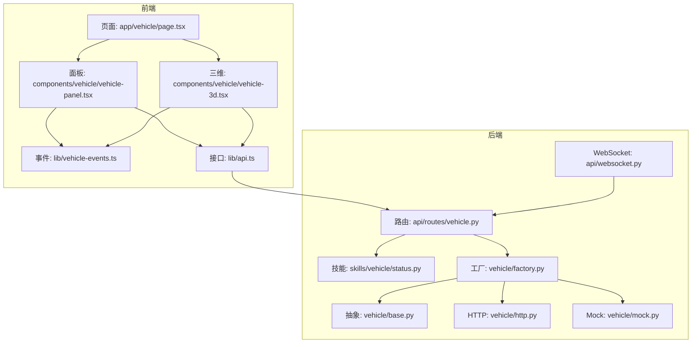
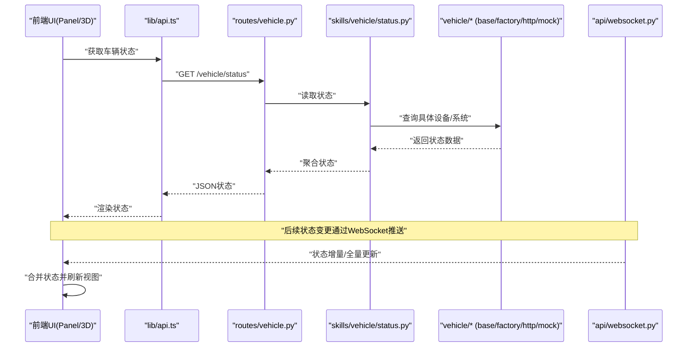
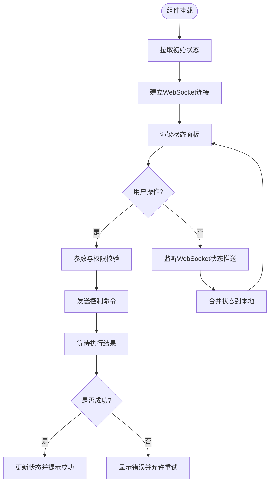
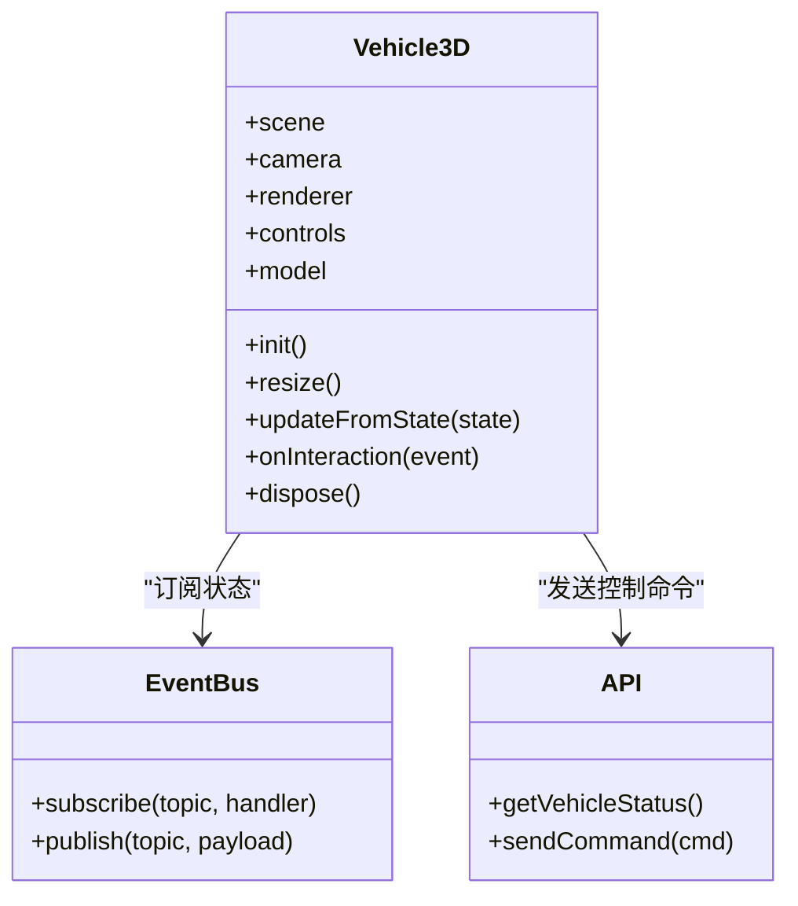
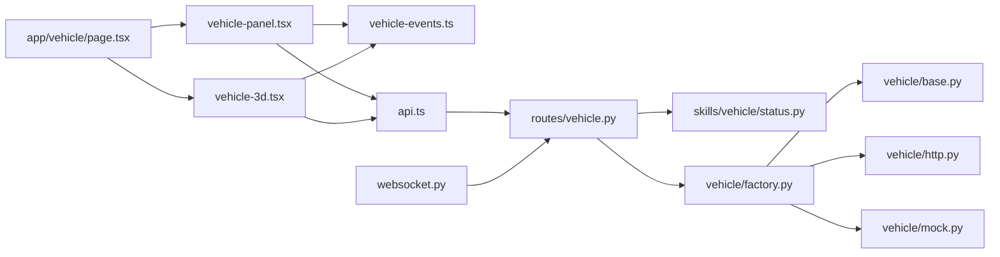

# 车辆控制组件

<cite>
**本文引用的文件**   
- [frontend_design/src/components/vehicle/vehicle-panel.tsx](file://frontend_design/src/components/vehicle/vehicle-panel.tsx)
- [frontend_design/src/components/vehicle/vehicle-3d.tsx](file://frontend_design/src/components/vehicle/vehicle-3d.tsx)
- [frontend_design/src/lib/vehicle-events.ts](file://frontend_design/src/lib/vehicle-events.ts)
- [frontend_design/src/lib/api.ts](file://frontend_design/src/lib/api.ts)
- [frontend_design/src/app/vehicle/page.tsx](file://frontend_design/src/app/vehicle/page.tsx)
- [backend_design/nexus/api/routes/vehicle.py](file://backend_design/nexus/api/routes/vehicle.py)
- [backend_design/nexus/api/websocket.py](file://backend_design/nexus/api/websocket.py)
- [backend_design/nexus/skills/vehicle/status.py](file://backend_design/nexus/skills/vehicle/status.py)
- [backend_design/nexus/vehicle/base.py](file://backend_design/nexus/vehicle/base.py)
- [backend_design/nexus/vehicle/factory.py](file://backend_design/nexus/vehicle/factory.py)
- [backend_design/nexus/vehicle/http.py](file://backend_design/nexus/vehicle/http.py)
- [backend_design/nexus/vehicle/mock.py](file://backend_design/nexus/vehicle/mock.py)
</cite>

## 目录
1. [简介](#简介)
2. [项目结构](#项目结构)
3. [核心组件](#核心组件)
4. [架构总览](#架构总览)
5. [详细组件分析](#详细组件分析)
6. [依赖分析](#依赖分析)
7. [性能考虑](#性能考虑)
8. [故障排查指南](#故障排查指南)
9. [结论](#结论)
10. [附录](#附录)

## 简介
本技术文档聚焦于“车辆控制组件”，围绕前端面板与三维可视化两个关键部分展开，覆盖以下目标：
- vehicle-panel.tsx 面板组件：车辆状态显示、控制操作界面、实时数据更新机制
- vehicle-3d.tsx 三维可视化组件：3D模型渲染、交互控制、场景管理
- 车辆数据的获取方式、状态同步机制与异常处理策略
- 车辆控制命令的发送流程、权限验证与错误反馈机制
- 3D组件的性能优化、响应式设计与用户体验改进方案

## 项目结构
与车辆控制相关的前端与后端代码分布如下：
- 前端
  - 页面入口：frontend_design/src/app/vehicle/page.tsx
  - 面板组件：frontend_design/src/components/vehicle/vehicle-panel.tsx
  - 三维组件：frontend_design/src/components/vehicle/vehicle-3d.tsx
  - 事件总线：frontend_design/src/lib/vehicle-events.ts
  - API 封装：frontend_design/src/lib/api.ts
- 后端
  - 车辆API路由：backend_design/nexus/api/routes/vehicle.py
  - WebSocket 服务：backend_design/nexus/api/websocket.py
  - 技能层（状态）：backend_design/nexus/skills/vehicle/status.py
  - 车辆驱动抽象与工厂：backend_design/nexus/vehicle/{base,factory,http,mock}.py

图表来源
- [frontend_design/src/app/vehicle/page.tsx](file://frontend_design/src/app/vehicle/page.tsx)
- [frontend_design/src/components/vehicle/vehicle-panel.tsx](file://frontend_design/src/components/vehicle/vehicle-panel.tsx)
- [frontend_design/src/components/vehicle/vehicle-3d.tsx](file://frontend_design/src/components/vehicle/vehicle-3d.tsx)
- [frontend_design/src/lib/vehicle-events.ts](file://frontend_design/src/lib/vehicle-events.ts)
- [frontend_design/src/lib/api.ts](file://frontend_design/src/lib/api.ts)
- [backend_design/nexus/api/routes/vehicle.py](file://backend_design/nexus/api/routes/vehicle.py)
- [backend_design/nexus/api/websocket.py](file://backend_design/nexus/api/websocket.py)
- [backend_design/nexus/skills/vehicle/status.py](file://backend_design/nexus/skills/vehicle/status.py)
- [backend_design/nexus/vehicle/base.py](file://backend_design/nexus/vehicle/base.py)
- [backend_design/nexus/vehicle/factory.py](file://backend_design/nexus/vehicle/factory.py)
- [backend_design/nexus/vehicle/http.py](file://backend_design/nexus/vehicle/http.py)
- [backend_design/nexus/vehicle/mock.py](file://backend_design/nexus/vehicle/mock.py)

章节来源
- [frontend_design/src/app/vehicle/page.tsx](file://frontend_design/src/app/vehicle/page.tsx)
- [frontend_design/src/components/vehicle/vehicle-panel.tsx](file://frontend_design/src/components/vehicle/vehicle-panel.tsx)
- [frontend_design/src/components/vehicle/vehicle-3d.tsx](file://frontend_design/src/components/vehicle/vehicle-3d.tsx)
- [frontend_design/src/lib/vehicle-events.ts](file://frontend_design/src/lib/vehicle-events.ts)
- [frontend_design/src/lib/api.ts](file://frontend_design/src/lib/api.ts)
- [backend_design/nexus/api/routes/vehicle.py](file://backend_design/nexus/api/routes/vehicle.py)
- [backend_design/nexus/api/websocket.py](file://backend_design/nexus/api/websocket.py)
- [backend_design/nexus/skills/vehicle/status.py](file://backend_design/nexus/skills/vehicle/status.py)
- [backend_design/nexus/vehicle/base.py](file://backend_design/nexus/vehicle/base.py)
- [backend_design/nexus/vehicle/factory.py](file://backend_design/nexus/vehicle/factory.py)
- [backend_design/nexus/vehicle/http.py](file://backend_design/nexus/vehicle/http.py)
- [backend_design/nexus/vehicle/mock.py](file://backend_design/nexus/vehicle/mock.py)

## 核心组件
本节概述两个核心前端组件的职责与协作关系。

- 面板组件（vehicle-panel.tsx）
  - 负责展示车辆基础状态信息（如电量、里程、车门锁闭等），并提供常用控制按钮（如解锁、空调开关等）。
  - 通过事件总线订阅后端推送的车辆状态变更，实现低延迟的状态刷新。
  - 将用户操作转换为控制指令，调用API进行下发，并反馈执行结果。

- 三维组件（vehicle-3d.tsx）
  - 负责加载与渲染车辆3D模型，支持视角旋转、缩放、点击部件高亮等交互。
  - 根据当前车辆状态动态更新模型外观（如车门开合、灯光状态）。
  - 提供与面板联动的交互入口（例如在3D视图中点击车门触发解锁）。

章节来源
- [frontend_design/src/components/vehicle/vehicle-panel.tsx](file://frontend_design/src/components/vehicle/vehicle-panel.tsx)
- [frontend_design/src/components/vehicle/vehicle-3d.tsx](file://frontend_design/src/components/vehicle/vehicle-3d.tsx)

## 架构总览
前后端协同的数据与控制流如下：
- 数据获取
  - 初始状态：前端通过REST API拉取车辆状态。
  - 实时状态：通过WebSocket接收服务端推送的状态增量或全量快照。
- 控制命令
  - 面板或3D组件发起控制请求，经API路由进入后端，由技能层或驱动层执行。
  - 执行结果通过WebSocket回推至前端，更新UI。

图表来源
- [frontend_design/src/lib/api.ts](file://frontend_design/src/lib/api.ts)
- [backend_design/nexus/api/routes/vehicle.py](file://backend_design/nexus/api/routes/vehicle.py)
- [backend_design/nexus/skills/vehicle/status.py](file://backend_design/nexus/skills/vehicle/status.py)
- [backend_design/nexus/vehicle/base.py](file://backend_design/nexus/vehicle/base.py)
- [backend_design/nexus/vehicle/factory.py](file://backend_design/nexus/vehicle/factory.py)
- [backend_design/nexus/vehicle/http.py](file://backend_design/nexus/vehicle/http.py)
- [backend_design/nexus/vehicle/mock.py](file://backend_design/nexus/vehicle/mock.py)
- [backend_design/nexus/api/websocket.py](file://backend_design/nexus/api/websocket.py)

## 详细组件分析

### 面板组件（vehicle-panel.tsx）
职责与功能
- 状态显示：以卡片/列表形式呈现关键指标（电量、胎压、门窗状态等）。
- 控制操作：提供常用控制按钮，带确认提示与防抖处理。
- 实时更新：基于事件总线订阅状态变更，局部更新DOM，避免整页重渲染。
- 错误反馈：对网络错误、超时、业务错误进行分类提示，并提供重试入口。

数据流与交互
- 初始化时调用API获取初始状态；随后建立WebSocket连接，接收增量更新。
- 用户点击控制按钮后，先进行本地校验与权限检查，再调用API下发命令。
- 收到执行结果后，更新对应状态字段并给出成功/失败反馈。

图表来源
- [frontend_design/src/components/vehicle/vehicle-panel.tsx](file://frontend_design/src/components/vehicle/vehicle-panel.tsx)
- [frontend_design/src/lib/vehicle-events.ts](file://frontend_design/src/lib/vehicle-events.ts)
- [frontend_design/src/lib/api.ts](file://frontend_design/src/lib/api.ts)
- [backend_design/nexus/api/websocket.py](file://backend_design/nexus/api/websocket.py)

章节来源
- [frontend_design/src/components/vehicle/vehicle-panel.tsx](file://frontend_design/src/components/vehicle/vehicle-panel.tsx)
- [frontend_design/src/lib/vehicle-events.ts](file://frontend_design/src/lib/vehicle-events.ts)
- [frontend_design/src/lib/api.ts](file://frontend_design/src/lib/api.ts)
- [backend_design/nexus/api/websocket.py](file://backend_design/nexus/api/websocket.py)

### 三维组件（vehicle-3d.tsx）
职责与功能
- 3D渲染：加载车辆模型，设置材质、光照、相机与控制器。
- 交互控制：支持鼠标拖拽旋转、滚轮缩放、点击部件选择与高亮。
- 场景管理：根据车辆状态切换场景元素（如打开车门、点亮车灯）。
- 联动面板：与面板组件共享状态，保证两者视图一致。

渲染与交互流程
- 首次加载时创建场景、相机、控制器与模型实例。
- 监听窗口尺寸变化，自适应调整画布大小与相机比例。
- 订阅状态事件，按状态映射更新模型属性（位置、可见性、材质颜色等）。
- 用户交互事件转化为控制指令，交由API下发。

图表来源
- [frontend_design/src/components/vehicle/vehicle-3d.tsx](file://frontend_design/src/components/vehicle/vehicle-3d.tsx)
- [frontend_design/src/lib/vehicle-events.ts](file://frontend_design/src/lib/vehicle-events.ts)
- [frontend_design/src/lib/api.ts](file://frontend_design/src/lib/api.ts)

章节来源
- [frontend_design/src/components/vehicle/vehicle-3d.tsx](file://frontend_design/src/components/vehicle/vehicle-3d.tsx)
- [frontend_design/src/lib/vehicle-events.ts](file://frontend_design/src/lib/vehicle-events.ts)
- [frontend_design/src/lib/api.ts](file://frontend_design/src/lib/api.ts)

### 页面容器（app/vehicle/page.tsx）
职责与功能
- 组合面板与三维组件，统一布局与状态上下文。
- 管理WebSocket生命周期与全局错误边界。
- 提供权限与配置注入（如是否启用3D、默认视角等）。

章节来源
- [frontend_design/src/app/vehicle/page.tsx](file://frontend_design/src/app/vehicle/page.tsx)

### 后端API与WebSocket
职责与功能
- REST接口：提供车辆状态查询、控制命令下发等能力。
- WebSocket：维护长连接，推送状态变更与命令执行结果。
- 权限校验：鉴权中间件确保仅授权用户可访问。
- 错误处理：统一错误码与消息体，便于前端分类处理。

章节来源
- [backend_design/nexus/api/routes/vehicle.py](file://backend_design/nexus/api/routes/vehicle.py)
- [backend_design/nexus/api/websocket.py](file://backend_design/nexus/api/websocket.py)

### 技能层与驱动层
职责与功能
- 技能层（status.py）：聚合多子系统状态，提供统一的查询接口。
- 驱动抽象（base.py）：定义车辆驱动的通用接口。
- 工厂（factory.py）：根据配置选择HTTP或Mock驱动。
- HTTP驱动（http.py）：通过HTTP协议与真实车辆系统通信。
- Mock驱动（mock.py）：用于开发与测试环境模拟数据。

章节来源
- [backend_design/nexus/skills/vehicle/status.py](file://backend_design/nexus/skills/vehicle/status.py)
- [backend_design/nexus/vehicle/base.py](file://backend_design/nexus/vehicle/base.py)
- [backend_design/nexus/vehicle/factory.py](file://backend_design/nexus/vehicle/factory.py)
- [backend_design/nexus/vehicle/http.py](file://backend_design/nexus/vehicle/http.py)
- [backend_design/nexus/vehicle/mock.py](file://backend_design/nexus/vehicle/mock.py)

## 依赖分析
组件间依赖关系如下：
- 面板与三维组件均依赖事件总线与API模块。
- 页面容器组合面板与三维组件，并管理WebSocket。
- 后端路由依赖技能层与驱动层，WebSocket作为独立通道推送状态。

图表来源
- [frontend_design/src/components/vehicle/vehicle-panel.tsx](file://frontend_design/src/components/vehicle/vehicle-panel.tsx)
- [frontend_design/src/components/vehicle/vehicle-3d.tsx](file://frontend_design/src/components/vehicle/vehicle-3d.tsx)
- [frontend_design/src/lib/vehicle-events.ts](file://frontend_design/src/lib/vehicle-events.ts)
- [frontend_design/src/lib/api.ts](file://frontend_design/src/lib/api.ts)
- [frontend_design/src/app/vehicle/page.tsx](file://frontend_design/src/app/vehicle/page.tsx)
- [backend_design/nexus/api/routes/vehicle.py](file://backend_design/nexus/api/routes/vehicle.py)
- [backend_design/nexus/api/websocket.py](file://backend_design/nexus/api/websocket.py)
- [backend_design/nexus/skills/vehicle/status.py](file://backend_design/nexus/skills/vehicle/status.py)
- [backend_design/nexus/vehicle/base.py](file://backend_design/nexus/vehicle/base.py)
- [backend_design/nexus/vehicle/factory.py](file://backend_design/nexus/vehicle/factory.py)
- [backend_design/nexus/vehicle/http.py](file://backend_design/nexus/vehicle/http.py)
- [backend_design/nexus/vehicle/mock.py](file://backend_design/nexus/vehicle/mock.py)

章节来源
- [frontend_design/src/components/vehicle/vehicle-panel.tsx](file://frontend_design/src/components/vehicle/vehicle-panel.tsx)
- [frontend_design/src/components/vehicle/vehicle-3d.tsx](file://frontend_design/src/components/vehicle/vehicle-3d.tsx)
- [frontend_design/src/lib/vehicle-events.ts](file://frontend_design/src/lib/vehicle-events.ts)
- [frontend_design/src/lib/api.ts](file://frontend_design/src/lib/api.ts)
- [frontend_design/src/app/vehicle/page.tsx](file://frontend_design/src/app/vehicle/page.tsx)
- [backend_design/nexus/api/routes/vehicle.py](file://backend_design/nexus/api/routes/vehicle.py)
- [backend_design/nexus/api/websocket.py](file://backend_design/nexus/api/websocket.py)
- [backend_design/nexus/skills/vehicle/status.py](file://backend_design/nexus/skills/vehicle/status.py)
- [backend_design/nexus/vehicle/base.py](file://backend_design/nexus/vehicle/base.py)
- [backend_design/nexus/vehicle/factory.py](file://backend_design/nexus/vehicle/factory.py)
- [backend_design/nexus/vehicle/http.py](file://backend_design/nexus/vehicle/http.py)
- [backend_design/nexus/vehicle/mock.py](file://backend_design/nexus/vehicle/mock.py)

## 性能考虑
- 渲染优化
  - 使用按需更新策略，仅在状态字段变化时更新对应节点，减少重绘范围。
  - 3D场景中采用对象池与纹理复用，降低GC压力。
  - 合理设置抗锯齿与阴影质量，移动端降级为轻量效果。
- 网络与状态同步
  - 优先使用WebSocket增量更新，必要时合并多次推送，避免频繁UI刷新。
  - 对高频状态字段进行节流与去抖，防止抖动闪烁。
- 响应式设计
  - 根据屏幕尺寸与像素密度调整3D分辨率与UI布局。
  - 在小屏设备上隐藏次要信息，提升可读性与触控体验。
- 用户体验
  - 提供加载骨架屏与错误占位图，增强感知性能。
  - 对耗时操作提供进度指示与取消入口。

[本节为通用指导，不直接分析具体文件]

## 故障排查指南
常见问题与定位步骤
- 无法获取初始状态
  - 检查API路由是否正常注册与鉴权是否通过。
  - 查看后端日志与错误码，确认驱动层是否可用。
- WebSocket断连或无推送
  - 确认连接建立与心跳保活逻辑。
  - 检查服务端推送主题与前端订阅主题是否一致。
- 控制命令无效
  - 核对权限与参数校验。
  - 观察后端执行链路（路由→技能→驱动）是否有异常抛出。
- 3D渲染卡顿
  - 降低渲染质量与几何复杂度。
  - 检查是否存在内存泄漏或未释放资源。

章节来源
- [backend_design/nexus/api/routes/vehicle.py](file://backend_design/nexus/api/routes/vehicle.py)
- [backend_design/nexus/api/websocket.py](file://backend_design/nexus/api/websocket.py)
- [backend_design/nexus/skills/vehicle/status.py](file://backend_design/nexus/skills/vehicle/status.py)
- [backend_design/nexus/vehicle/base.py](file://backend_design/nexus/vehicle/base.py)
- [backend_design/nexus/vehicle/factory.py](file://backend_design/nexus/vehicle/factory.py)
- [backend_design/nexus/vehicle/http.py](file://backend_design/nexus/vehicle/http.py)
- [backend_design/nexus/vehicle/mock.py](file://backend_design/nexus/vehicle/mock.py)

## 结论
车辆控制组件通过清晰的分层与模块化设计，实现了前后端高效协同：
- 面板组件专注状态展示与用户交互，结合事件总线实现低延迟刷新。
- 三维组件提供沉浸式可视化与直观操控，兼顾性能与可用性。
- 后端以技能与驱动解耦的方式扩展不同车辆系统与协议，保障灵活性与可维护性。
建议在生产环境中完善监控与告警，持续优化渲染与网络路径，提升整体稳定性与用户体验。

[本节为总结性内容，不直接分析具体文件]

## 附录
- 术语说明
  - 面板组件：负责车辆状态与控制操作的二维界面组件。
  - 三维组件：负责车辆模型渲染与交互的三维界面组件。
  - 事件总线：组件间通信的发布/订阅机制。
  - 技能层：面向业务能力的聚合层，对外暴露统一接口。
  - 驱动层：与具体车辆系统或协议对接的实现层。

[本节为概念性内容，不直接分析具体文件]