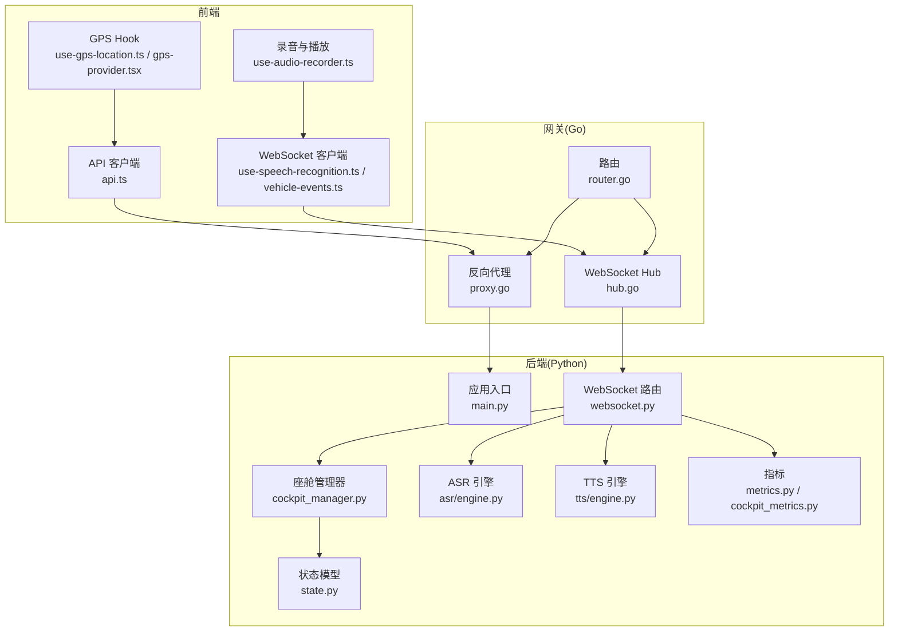
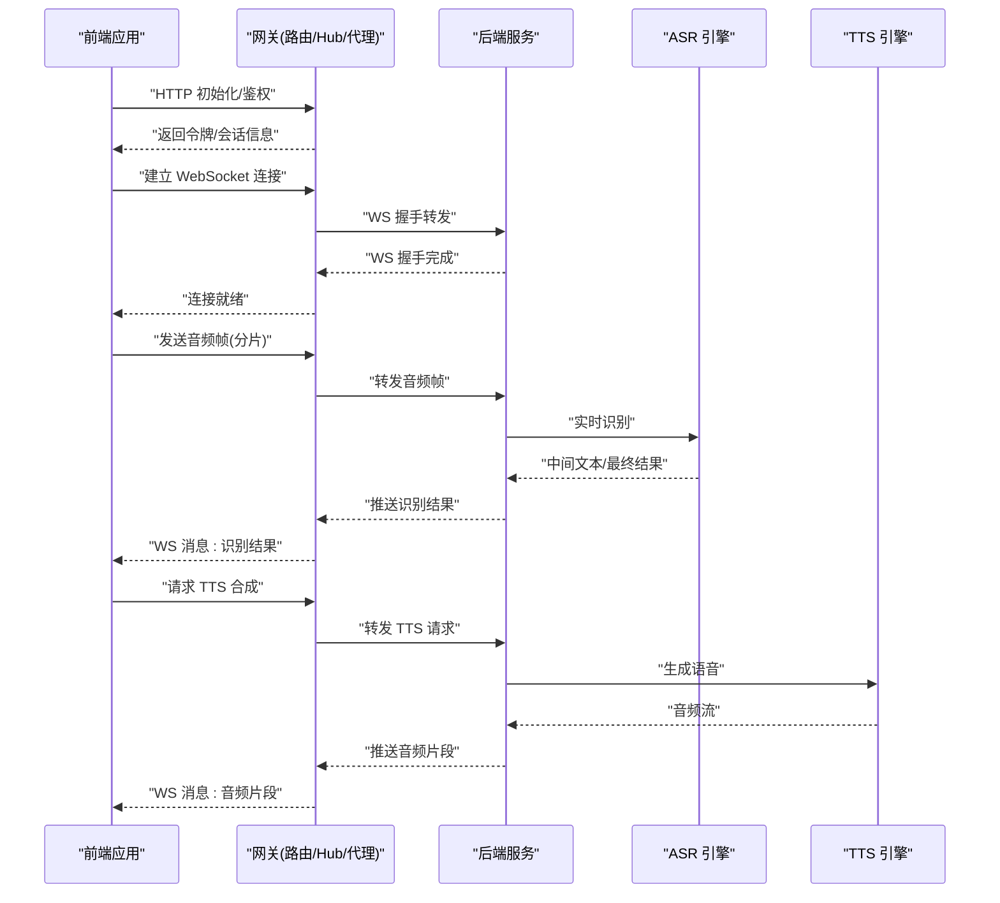
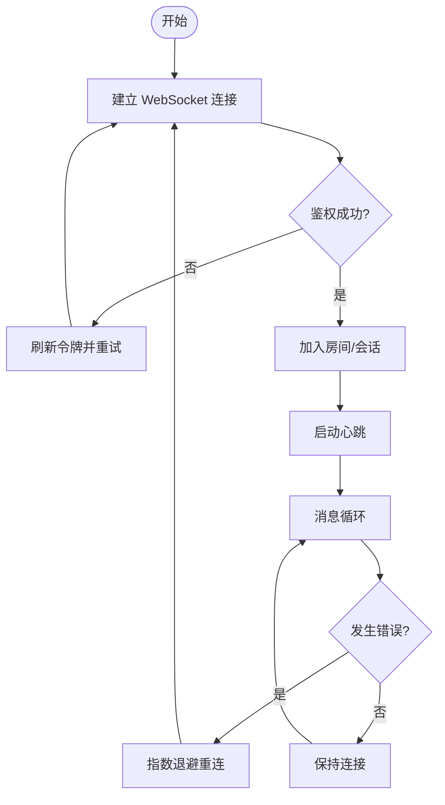
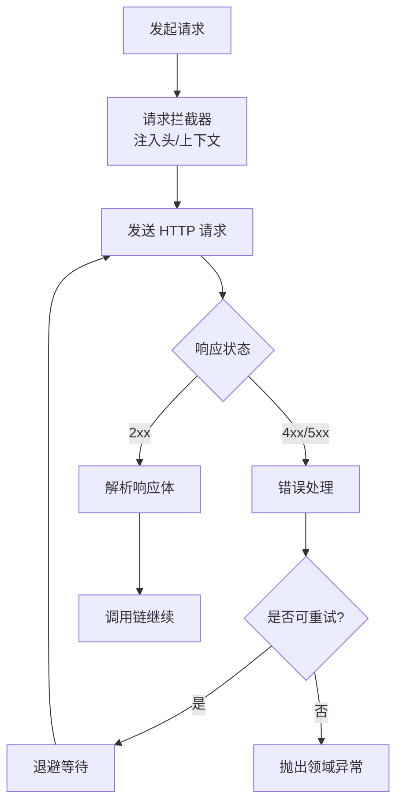
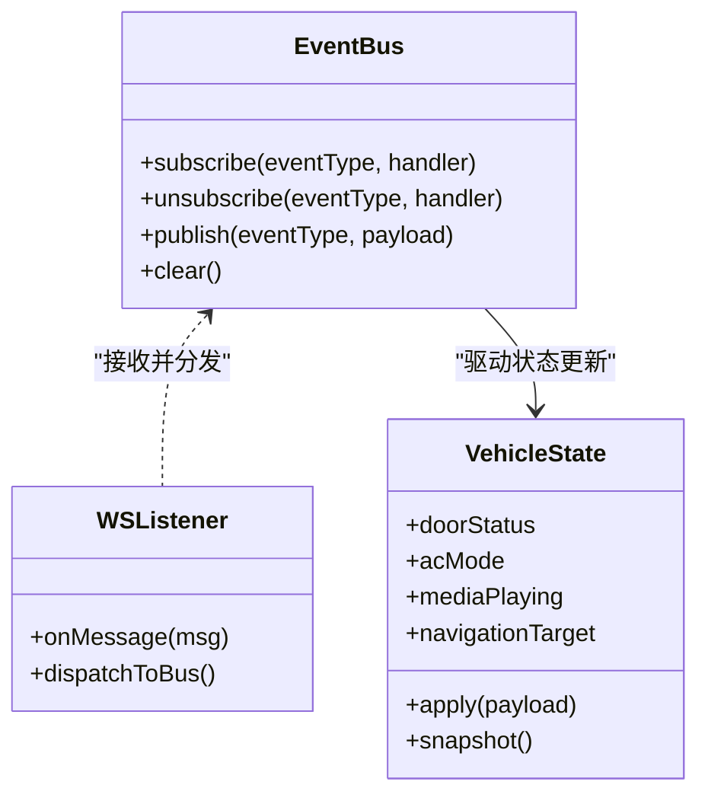
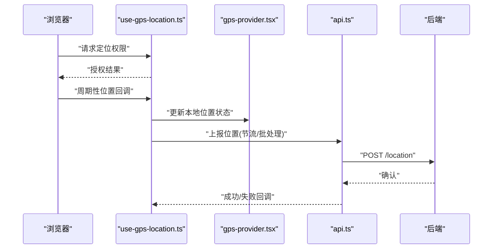
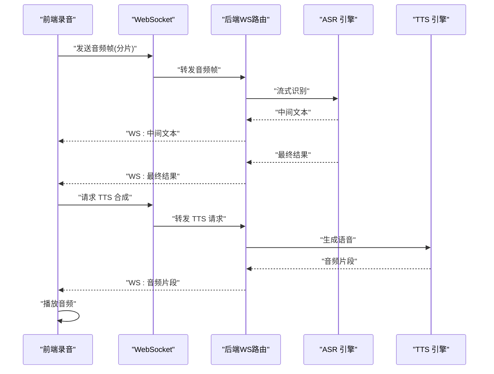
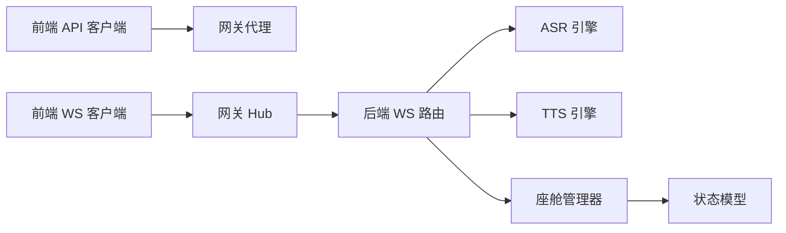

# 实时通信

<cite>
**本文引用的文件**   
- [backend_design/nexus/api/websocket.py](file://backend_design/nexus/api/websocket.py)
- [backend_design/nexus/main.py](file://backend_design/nexus/main.py)
- [backend_design/nexus_gate/internal/ws/hub.go](file://backend_design/nexus_gate/internal/ws/hub.go)
- [backend_design/nexus_gate/internal/proxy/proxy.go](file://backend_design/nexus_gate/internal/proxy/proxy.go)
- [backend_design/nexus_gate/internal/router/router.go](file://backend_design/nexus_gate/internal/router/router.go)
- [backend_design/nexus/core/cockpit_manager.py](file://backend_design/nexus/core/cockpit_manager.py)
- [backend_design/nexus/models/state.py](file://backend_design/nexus/models/state.py)
- [frontend_design/src/lib/api.ts](file://frontend_design/src/lib/api.ts)
- [frontend_design/src/hooks/use-gps-location.ts](file://frontend_design/src/hooks/use-gps-location.ts)
- [frontend_design/src/components/layout/gps-provider.tsx](file://frontend_design/src/components/layout/gps-provider.tsx)
- [frontend_design/src/lib/vehicle-events.ts](file://frontend_design/src/lib/vehicle-events.ts)
- [frontend_design/src/hooks/use-speech-recognition.ts](file://frontend_design/src/hooks/use-speech-recognition.ts)
- [frontend_design/src/hooks/use-audio-recorder.ts](file://frontend_design/src/hooks/use-audio-recorder.ts)
- [backend_design/nexus/asr/engine.py](file://backend_design/nexus/asr/engine.py)
- [backend_design/nexus/tts/engine.py](file://backend_design/nexus/tts/engine.py)
- [backend_design/nexus/observability/metrics.py](file://backend_design/nexus/observability/metrics.py)
- [backend_design/nexus/observability/cockpit_metrics.py](file://backend_design/nexus/observability/cockpit_metrics.py)
</cite>

## 目录
1. [简介](#简介)
2. [项目结构](#项目结构)
3. [核心组件](#核心组件)
4. [架构总览](#架构总览)
5. [详细组件分析](#详细组件分析)
6. [依赖分析](#依赖分析)
7. [性能考虑](#性能考虑)
8. [故障排查指南](#故障排查指南)
9. [结论](#结论)
10. [附录](#附录)

## 简介
本技术文档面向“实时通信”子系统，覆盖以下关键能力：
- WebSocket 连接的建立与管理（连接池、重连策略、错误处理）
- API 客户端实现（请求拦截、响应处理、错误重试）
- 车辆事件系统（订阅/发布模式与实时数据同步）
- GPS 位置服务集成与实时更新机制
- 语音识别的实时处理流程与音频流管理
- 性能优化与故障恢复策略
- 调试工具与监控指标的实现方法

## 项目结构
本项目采用前后端分离与网关分层架构：
- 前端（Next.js）提供用户界面与浏览器侧实时能力（WebSocket、GPS、Web Audio）。
- Go 网关负责鉴权、路由转发与 WebSocket Hub。
- Python 后端提供业务逻辑、ASR/TTS、车辆状态管理与可观测性。

图表来源
- [backend_design/nexus_gate/internal/router/router.go](file://backend_design/nexus_gate/internal/router/router.go)
- [backend_design/nexus_gate/internal/ws/hub.go](file://backend_design/nexus_gate/internal/ws/hub.go)
- [backend_design/nexus_gate/internal/proxy/proxy.go](file://backend_design/nexus_gate/internal/proxy/proxy.go)
- [backend_design/nexus/main.py](file://backend_design/nexus/main.py)
- [backend_design/nexus/api/websocket.py](file://backend_design/nexus/api/websocket.py)
- [backend_design/nexus/core/cockpit_manager.py](file://backend_design/nexus/core/cockpit_manager.py)
- [backend_design/nexus/models/state.py](file://backend_design/nexus/models/state.py)
- [backend_design/nexus/asr/engine.py](file://backend_design/nexus/asr/engine.py)
- [backend_design/nexus/tts/engine.py](file://backend_design/nexus/tts/engine.py)
- [backend_design/nexus/observability/metrics.py](file://backend_design/nexus/observability/metrics.py)
- [backend_design/nexus/observability/cockpit_metrics.py](file://backend_design/nexus/observability/cockpit_metrics.py)
- [frontend_design/src/lib/api.ts](file://frontend_design/src/lib/api.ts)
- [frontend_design/src/hooks/use-speech-recognition.ts](file://frontend_design/src/hooks/use-speech-recognition.ts)
- [frontend_design/src/hooks/use-gps-location.ts](file://frontend_design/src/hooks/use-gps-location.ts)
- [frontend_design/src/components/layout/gps-provider.tsx](file://frontend_design/src/components/layout/gps-provider.tsx)
- [frontend_design/src/lib/vehicle-events.ts](file://frontend_design/src/lib/vehicle-events.ts)
- [frontend_design/src/hooks/use-audio-recorder.ts](file://frontend_design/src/hooks/use-audio-recorder.ts)

章节来源
- [backend_design/nexus/main.py](file://backend_design/nexus/main.py)
- [backend_design/nexus/api/websocket.py](file://backend_design/nexus/api/websocket.py)
- [backend_design/nexus_gate/internal/ws/hub.go](file://backend_design/nexus_gate/internal/ws/hub.go)
- [backend_design/nexus_gate/internal/proxy/proxy.go](file://backend_design/nexus_gate/internal/proxy/proxy.go)
- [backend_design/nexus_gate/internal/router/router.go](file://backend_design/nexus_gate/internal/router/router.go)
- [frontend_design/src/lib/api.ts](file://frontend_design/src/lib/api.ts)
- [frontend_design/src/hooks/use-gps-location.ts](file://frontend_design/src/hooks/use-gps-location.ts)
- [frontend_design/src/components/layout/gps-provider.tsx](file://frontend_design/src/components/layout/gps-provider.tsx)
- [frontend_design/src/lib/vehicle-events.ts](file://frontend_design/src/lib/vehicle-events.ts)
- [frontend_design/src/hooks/use-speech-recognition.ts](file://frontend_design/src/hooks/use-speech-recognition.ts)
- [frontend_design/src/hooks/use-audio-recorder.ts](file://frontend_design/src/hooks/use-audio-recorder.ts)

## 核心组件
- WebSocket 网关与 Hub（Go）：负责鉴权后的长连接接入、消息广播与房间/会话级路由。
- WebSocket 路由（Python）：将 WS 事件映射到业务处理器（如 ASR/TTS、车辆控制、状态推送）。
- API 客户端（前端）：封装 HTTP 请求拦截、认证头注入、错误重试与降级。
- 车辆事件系统（前端）：基于发布/订阅的事件总线，驱动 UI 与业务模块实时同步。
- GPS 定位服务（前端）：通过浏览器 Geolocation API 获取位置并推送到后端或本地状态。
- 语音识别与合成（前后端协同）：前端采集音频流，经 WS 传输至后端 ASR；结果回写前端，必要时触发 TTS 返回语音。
- 可观测性与指标：在网关与后端埋点，暴露 Prometheus 指标与日志。

章节来源
- [backend_design/nexus_gate/internal/ws/hub.go](file://backend_design/nexus_gate/internal/ws/hub.go)
- [backend_design/nexus/api/websocket.py](file://backend_design/nexus/api/websocket.py)
- [frontend_design/src/lib/api.ts](file://frontend_design/src/lib/api.ts)
- [frontend_design/src/lib/vehicle-events.ts](file://frontend_design/src/lib/vehicle-events.ts)
- [frontend_design/src/hooks/use-gps-location.ts](file://frontend_design/src/hooks/use-gps-location.ts)
- [frontend_design/src/hooks/use-speech-recognition.ts](file://frontend_design/src/hooks/use-speech-recognition.ts)
- [frontend_design/src/hooks/use-audio-recorder.ts](file://frontend_design/src/hooks/use-audio-recorder.ts)
- [backend_design/nexus/asr/engine.py](file://backend_design/nexus/asr/engine.py)
- [backend_design/nexus/tts/engine.py](file://backend_design/nexus/tts/engine.py)
- [backend_design/nexus/observability/metrics.py](file://backend_design/nexus/observability/metrics.py)
- [backend_design/nexus/observability/cockpit_metrics.py](file://backend_design/nexus/observability/cockpit_metrics.py)

## 架构总览
下图展示了从前端到网关再到后端的端到端实时通信路径，包括 HTTP 与 WebSocket 两条通道。

图表来源
- [backend_design/nexus_gate/internal/router/router.go](file://backend_design/nexus_gate/internal/router/router.go)
- [backend_design/nexus_gate/internal/ws/hub.go](file://backend_design/nexus_gate/internal/ws/hub.go)
- [backend_design/nexus_gate/internal/proxy/proxy.go](file://backend_design/nexus_gate/internal/proxy/proxy.go)
- [backend_design/nexus/api/websocket.py](file://backend_design/nexus/api/websocket.py)
- [backend_design/nexus/asr/engine.py](file://backend_design/nexus/asr/engine.py)
- [backend_design/nexus/tts/engine.py](file://backend_design/nexus/tts/engine.py)

## 详细组件分析

### WebSocket 连接建立与管理
- 连接生命周期
  - 前端发起 WS 连接，携带鉴权上下文（由 API 客户端注入）。
  - 网关校验令牌并建立 Hub 会话，维护连接池与会话映射。
  - 后端接收 WS 事件，按路由分发到具体处理器（如 ASR/TTS、车辆事件）。
- 连接池与会话管理
  - Hub 维护活跃连接集合，支持按房间/会话广播。
  - 心跳检测与空闲超时清理，避免僵尸连接。
- 重连策略
  - 前端实现指数退避与抖动，结合最大重试次数与上限间隔。
  - 断线自动重连，保持会话上下文（如房间 ID、上次游标）。
- 错误处理
  - 网络异常、鉴权失败、服务端关闭等场景统一捕获，记录指标与日志。
  - 对不可恢复错误进行告警与降级提示。

图表来源
- [backend_design/nexus_gate/internal/ws/hub.go](file://backend_design/nexus_gate/internal/ws/hub.go)
- [backend_design/nexus/api/websocket.py](file://backend_design/nexus/api/websocket.py)
- [frontend_design/src/hooks/use-speech-recognition.ts](file://frontend_design/src/hooks/use-speech-recognition.ts)

章节来源
- [backend_design/nexus_gate/internal/ws/hub.go](file://backend_design/nexus_gate/internal/ws/hub.go)
- [backend_design/nexus/api/websocket.py](file://backend_design/nexus/api/websocket.py)
- [frontend_design/src/hooks/use-speech-recognition.ts](file://frontend_design/src/hooks/use-speech-recognition.ts)

### API 客户端实现（请求拦截、响应处理、错误重试）
- 请求拦截
  - 自动注入认证头、租户上下文与追踪 ID。
  - 对特定路径进行压缩或缓存策略选择。
- 响应处理
  - 统一解析 JSON/流式响应，转换错误码为领域异常。
  - 对分页、增量更新进行合并与去抖。
- 错误重试
  - 针对幂等 GET 请求实施有限次重试与退避。
  - 对网络抖动导致的瞬时失败进行快速重试，对业务错误直接抛出。

图表来源
- [frontend_design/src/lib/api.ts](file://frontend_design/src/lib/api.ts)

章节来源
- [frontend_design/src/lib/api.ts](file://frontend_design/src/lib/api.ts)

### 车辆事件系统（订阅/发布与实时同步）
- 事件总线
  - 前端维护事件注册表，支持按类型订阅与批量取消。
  - 事件载荷包含时间戳、版本与来源，便于幂等与回放。
- 实时同步
  - 通过 WS 推送车辆状态变更，前端合并到本地状态树。
  - 冲突解决采用最后写入优先（LWW），并提供撤销与补偿接口。
- 典型事件
  - 车门开关、空调状态、导航指令、媒体播放等。

图表来源
- [frontend_design/src/lib/vehicle-events.ts](file://frontend_design/src/lib/vehicle-events.ts)
- [backend_design/nexus/core/cockpit_manager.py](file://backend_design/nexus/core/cockpit_manager.py)
- [backend_design/nexus/models/state.py](file://backend_design/nexus/models/state.py)

章节来源
- [frontend_design/src/lib/vehicle-events.ts](file://frontend_design/src/lib/vehicle-events.ts)
- [backend_design/nexus/core/cockpit_manager.py](file://backend_design/nexus/core/cockpit_manager.py)
- [backend_design/nexus/models/state.py](file://backend_design/nexus/models/state.py)

### GPS 位置服务集成与实时更新
- 位置采集
  - 使用浏览器 Geolocation API 周期性获取经纬度与精度。
  - 支持权限拒绝与定位不可用的降级策略。
- 数据上报
  - 通过 HTTP 或 WS 上报位置，附带时间戳与设备标识。
  - 后端聚合与存储，供轨迹回放与地理围栏使用。
- 前端展示
  - 地图组件订阅位置事件，平滑插值与去抖渲染。

图表来源
- [frontend_design/src/hooks/use-gps-location.ts](file://frontend_design/src/hooks/use-gps-location.ts)
- [frontend_design/src/components/layout/gps-provider.tsx](file://frontend_design/src/components/layout/gps-provider.tsx)
- [frontend_design/src/lib/api.ts](file://frontend_design/src/lib/api.ts)

章节来源
- [frontend_design/src/hooks/use-gps-location.ts](file://frontend_design/src/hooks/use-gps-location.ts)
- [frontend_design/src/components/layout/gps-provider.tsx](file://frontend_design/src/components/layout/gps-provider.tsx)
- [frontend_design/src/lib/api.ts](file://frontend_design/src/lib/api.ts)

### 语音识别的实时处理流程与音频流管理
- 音频采集
  - 前端使用 MediaRecorder 或 Web Audio API 采集 PCM/Opus 流。
  - 分片打包并设置序列号，保证有序与丢包检测。
- 传输与识别
  - 通过 WS 将音频帧发送至后端，后端以流式方式送入 ASR。
  - 中间文本增量返回，最终结果带置信度与时间戳。
- 语音合成
  - 根据意图触发 TTS，后端流式返回音频片段，前端边收边播。

图表来源
- [frontend_design/src/hooks/use-speech-recognition.ts](file://frontend_design/src/hooks/use-speech-recognition.ts)
- [frontend_design/src/hooks/use-audio-recorder.ts](file://frontend_design/src/hooks/use-audio-recorder.ts)
- [backend_design/nexus/api/websocket.py](file://backend_design/nexus/api/websocket.py)
- [backend_design/nexus/asr/engine.py](file://backend_design/nexus/asr/engine.py)
- [backend_design/nexus/tts/engine.py](file://backend_design/nexus/tts/engine.py)

章节来源
- [frontend_design/src/hooks/use-speech-recognition.ts](file://frontend_design/src/hooks/use-speech-recognition.ts)
- [frontend_design/src/hooks/use-audio-recorder.ts](file://frontend_design/src/hooks/use-audio-recorder.ts)
- [backend_design/nexus/api/websocket.py](file://backend_design/nexus/api/websocket.py)
- [backend_design/nexus/asr/engine.py](file://backend_design/nexus/asr/engine.py)
- [backend_design/nexus/tts/engine.py](file://backend_design/nexus/tts/engine.py)

## 依赖分析
- 组件耦合
  - 网关与后端通过 WS 解耦，Hub 仅负责转发与广播。
  - 前端通过事件总线与状态层解耦 UI 与数据源。
- 外部依赖
  - 浏览器 API（Geolocation、MediaRecorder、Web Audio）。
  - 第三方 ASR/TTS 服务或本地模型。
- 潜在环路与风险
  - 避免前端事件循环中重复订阅导致内存泄漏。
  - 网关与后端需配置合理的超时与背压策略。

图表来源
- [frontend_design/src/lib/api.ts](file://frontend_design/src/lib/api.ts)
- [frontend_design/src/hooks/use-speech-recognition.ts](file://frontend_design/src/hooks/use-speech-recognition.ts)
- [backend_design/nexus_gate/internal/proxy/proxy.go](file://backend_design/nexus_gate/internal/proxy/proxy.go)
- [backend_design/nexus_gate/internal/ws/hub.go](file://backend_design/nexus_gate/internal/ws/hub.go)
- [backend_design/nexus/api/websocket.py](file://backend_design/nexus/api/websocket.py)
- [backend_design/nexus/asr/engine.py](file://backend_design/nexus/asr/engine.py)
- [backend_design/nexus/tts/engine.py](file://backend_design/nexus/tts/engine.py)
- [backend_design/nexus/core/cockpit_manager.py](file://backend_design/nexus/core/cockpit_manager.py)
- [backend_design/nexus/models/state.py](file://backend_design/nexus/models/state.py)

章节来源
- [frontend_design/src/lib/api.ts](file://frontend_design/src/lib/api.ts)
- [frontend_design/src/hooks/use-speech-recognition.ts](file://frontend_design/src/hooks/use-speech-recognition.ts)
- [backend_design/nexus_gate/internal/proxy/proxy.go](file://backend_design/nexus_gate/internal/proxy/proxy.go)
- [backend_design/nexus_gate/internal/ws/hub.go](file://backend_design/nexus_gate/internal/ws/hub.go)
- [backend_design/nexus/api/websocket.py](file://backend_design/nexus/api/websocket.py)
- [backend_design/nexus/asr/engine.py](file://backend_design/nexus/asr/engine.py)
- [backend_design/nexus/tts/engine.py](file://backend_design/nexus/tts/engine.py)
- [backend_design/nexus/core/cockpit_manager.py](file://backend_design/nexus/core/cockpit_manager.py)
- [backend_design/nexus/models/state.py](file://backend_design/nexus/models/state.py)

## 性能考虑
- 连接与消息
  - 合理设置心跳间隔与超时阈值，减少无效连接占用。
  - 消息体压缩与二进制编码（如 Protobuf/MessagePack）降低带宽。
- 并发与背压
  - Hub 使用队列与限流保护后端，防止雪崩。
  - 前端对高频事件（如 GPS、车辆状态）进行去抖与合并。
- 资源管理
  - 及时释放录音与播放器资源，避免内存泄漏。
  - 图片与静态资源按需加载与缓存。
- 可观测性
  - 暴露延迟、吞吐、错误率等指标，配合告警规则。

[本节为通用指导，不直接分析具体文件]

## 故障排查指南
- 常见问题
  - WS 频繁断开：检查鉴权过期、网关超时、后端负载过高。
  - 识别延迟高：查看 ASR 队列长度、CPU/GPU 利用率与网络抖动。
  - 定位失败：确认浏览器权限、GPS 信号质量与网络可达性。
- 诊断步骤
  - 前端：打开控制台查看 WS 状态与错误码，导出网络请求。
  - 网关：查看 Hub 连接数、广播延迟与错误计数。
  - 后端：检查 WS 路由日志、ASR/TTS 耗时与异常堆栈。
- 指标与日志
  - 使用内置指标端点采集关键 KPI，结合 Grafana 可视化。
  - 结构化日志包含 traceId、sessionId、eventType 等字段。

章节来源
- [backend_design/nexus/observability/metrics.py](file://backend_design/nexus/observability/metrics.py)
- [backend_design/nexus/observability/cockpit_metrics.py](file://backend_design/nexus/observability/cockpit_metrics.py)

## 结论
本实时通信方案通过网关 Hub 与后端 WS 路由解耦了前端与业务逻辑，结合事件总线与状态管理实现了车辆数据的实时同步。语音识别与合成采用流式处理，兼顾低延迟与用户体验。通过完善的错误处理、重连策略与可观测性体系，系统在复杂网络与高并发场景下具备较好的稳定性与可运维性。

[本节为总结性内容，不直接分析具体文件]

## 附录
- 术语
  - Hub：WebSocket 连接管理中心，负责连接池与会话路由。
  - 事件总线：进程内发布/订阅机制，用于模块间解耦通信。
  - 流式识别：边输入边输出的语音识别模式，降低端到端延迟。
- 最佳实践
  - 前端对高频事件做去抖与节流，避免 UI 卡顿。
  - 后端对热点接口启用缓存与熔断，提升鲁棒性。
  - 全链路埋点与追踪，确保问题可定位与可度量。

[本节为补充说明，不直接分析具体文件]