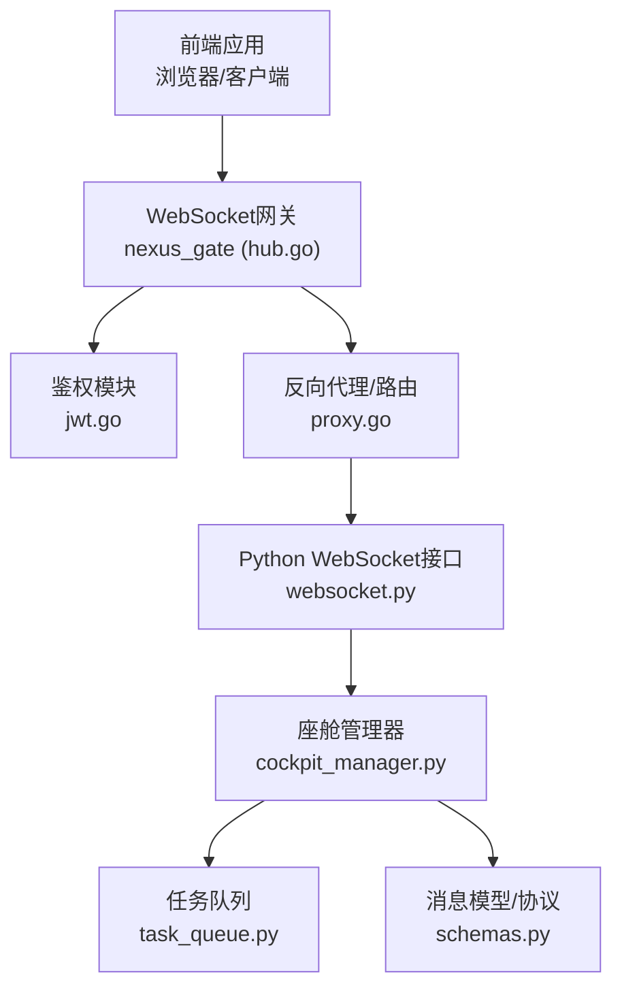
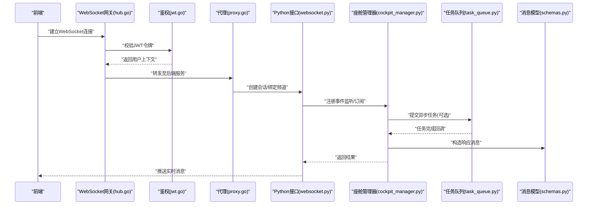
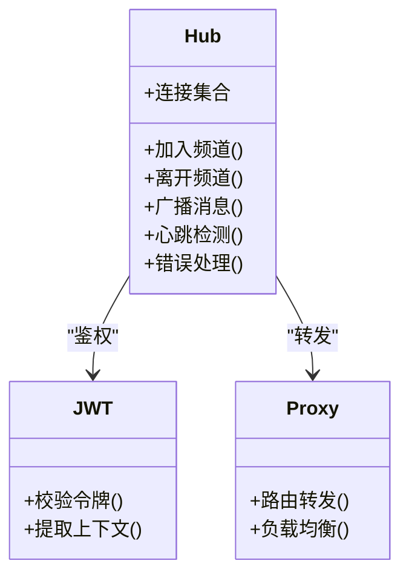
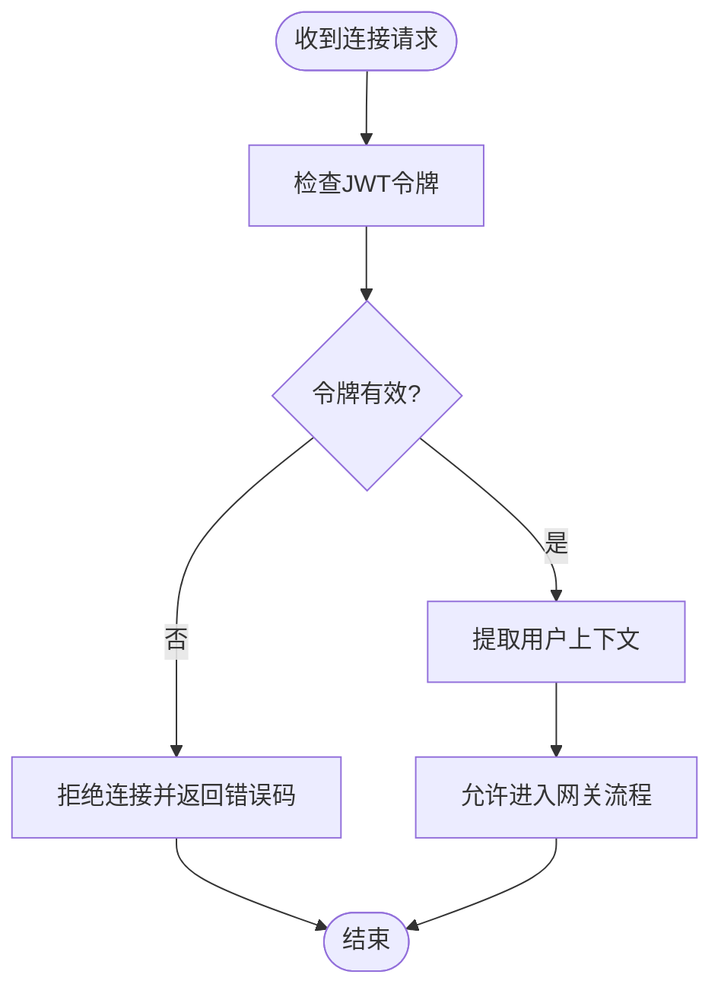
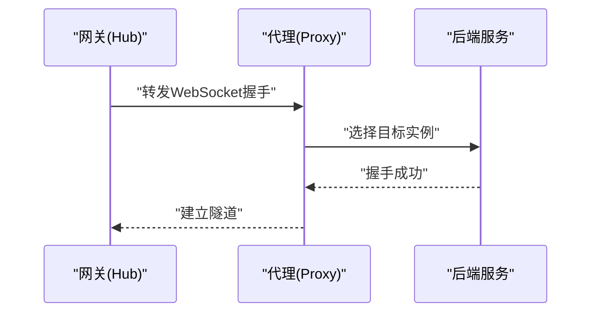
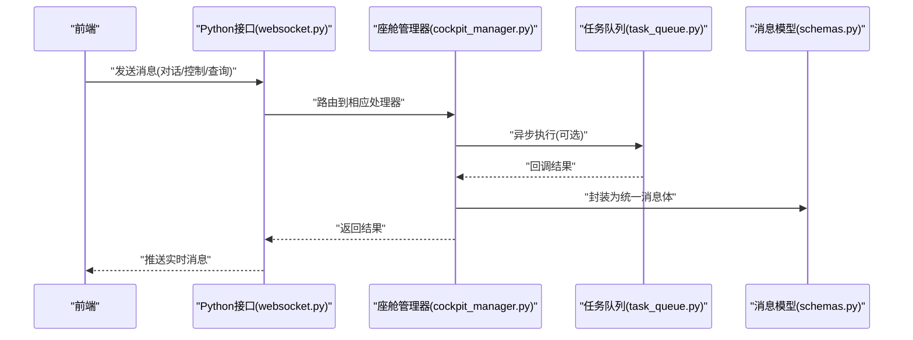
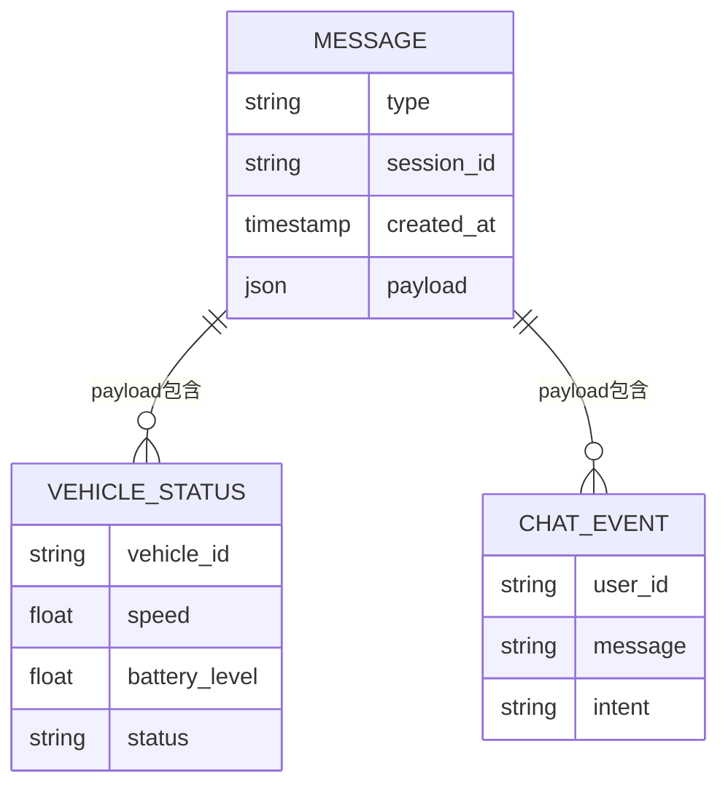
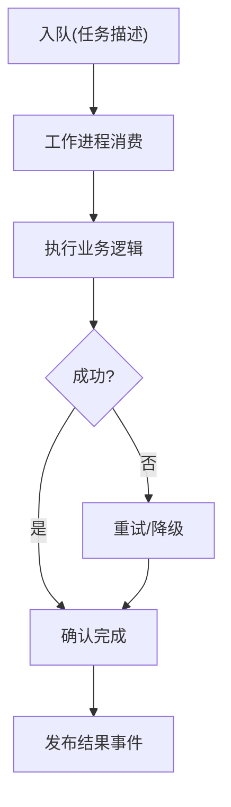
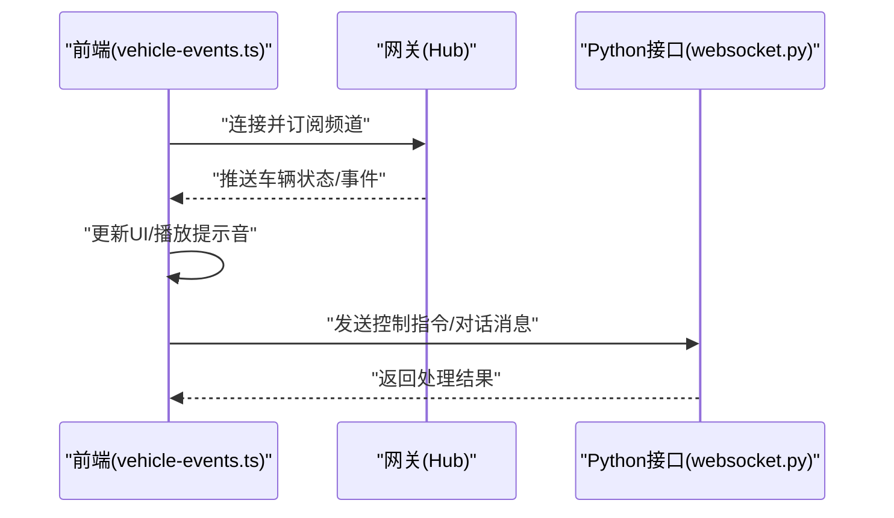
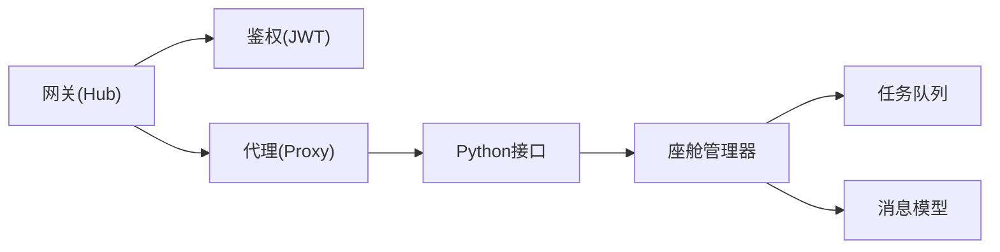

# 实时通信

<cite>
**本文引用的文件**   
- [backend_design/nexus/api/websocket.py](file://backend_design/nexus/api/websocket.py)
- [backend_design/nexus/core/cockpit_manager.py](file://backend_design/nexus/core/cockpit_manager.py)
- [backend_design/nexus/models/schemas.py](file://backend_design/nexus/models/schemas.py)
- [backend_design/nexus/middleware/task_queue.py](file://backend_design/nexus/middleware/task_queue.py)
- [backend_design/nexus_gate/internal/ws/hub.go](file://backend_design/nexus_gate/internal/ws/hub.go)
- [backend_design/nexus_gate/internal/auth/jwt.go](file://backend_design/nexus_gate/internal/auth/jwt.go)
- [backend_design/nexus_gate/internal/proxy/proxy.go](file://backend_design/nexus_gate/internal/proxy/proxy.go)
- [backend_design/nexus_gate/proto/nexus.proto](file://backend_design/nexus_gate/proto/nexus.proto)
- [frontend_design/src/lib/vehicle-events.ts](file://frontend_design/src/lib/vehicle-events.ts)
</cite>

## 目录
1. [简介](#简介)
2. [项目结构](#项目结构)
3. [核心组件](#核心组件)
4. [架构总览](#架构总览)
5. [详细组件分析](#详细组件分析)
6. [依赖关系分析](#依赖关系分析)
7. [性能考虑](#性能考虑)
8. [故障排查指南](#故障排查指南)
9. [结论](#结论)
10. [附录](#附录)

## 简介
本文件面向NexusCockpit的实时通信系统，聚焦WebSocket连接管理、消息协议设计与事件驱动架构。文档覆盖以下关键主题：
- 实时对话、车辆状态同步与事件通知的实现机制
- 连接重连策略、消息队列管理与错误处理方案
- 与后端的实时通信协议、数据格式定义与安全认证机制
- 实时通信的性能优化、监控告警与故障排查方法

## 项目结构
实时通信涉及前端、网关（Go）与后端服务（Python）三部分：
- 前端：基于浏览器或客户端应用，负责建立WebSocket连接、订阅频道、渲染实时数据
- 网关层（nexus_gate）：提供WebSocket接入、鉴权、路由转发、限流与代理能力
- 后端服务（nexus）：实现业务逻辑、事件分发、持久化与外部系统集成

图表来源
- [backend_design/nexus_gate/internal/ws/hub.go](file://backend_design/nexus_gate/internal/ws/hub.go)
- [backend_design/nexus_gate/internal/auth/jwt.go](file://backend_design/nexus_gate/internal/auth/jwt.go)
- [backend_design/nexus_gate/internal/proxy/proxy.go](file://backend_design/nexus_gate/internal/proxy/proxy.go)
- [backend_design/nexus/api/websocket.py](file://backend_design/nexus/api/websocket.py)
- [backend_design/nexus/core/cockpit_manager.py](file://backend_design/nexus/core/cockpit_manager.py)
- [backend_design/nexus/middleware/task_queue.py](file://backend_design/nexus/middleware/task_queue.py)
- [backend_design/nexus/models/schemas.py](file://backend_design/nexus/models/schemas.py)

章节来源
- [backend_design/nexus/api/websocket.py](file://backend_design/nexus/api/websocket.py)
- [backend_design/nexus/core/cockpit_manager.py](file://backend_design/nexus/core/cockpit_manager.py)
- [backend_design/nexus/models/schemas.py](file://backend_design/nexus/models/schemas.py)
- [backend_design/nexus/middleware/task_queue.py](file://backend_design/nexus/middleware/task_queue.py)
- [backend_design/nexus_gate/internal/ws/hub.go](file://backend_design/nexus_gate/internal/ws/hub.go)
- [backend_design/nexus_gate/internal/auth/jwt.go](file://backend_design/nexus_gate/internal/auth/jwt.go)
- [backend_design/nexus_gate/internal/proxy/proxy.go](file://backend_design/nexus_gate/internal/proxy/proxy.go)

## 核心组件
- WebSocket网关（Hub）：维护连接集合、广播与订阅、心跳检测、错误恢复
- 鉴权模块（JWT）：校验令牌、提取用户上下文、权限控制
- 反向代理/路由：将WebSocket请求转发到具体后端服务
- Python WebSocket接口：解析消息、调用业务逻辑、推送结果
- 座舱管理器：统一事件编排、状态同步、会话管理
- 任务队列：异步处理耗时任务、削峰填谷、重试与失败处理
- 消息模型/协议：定义统一的JSON消息结构与字段语义

章节来源
- [backend_design/nexus_gate/internal/ws/hub.go](file://backend_design/nexus_gate/internal/ws/hub.go)
- [backend_design/nexus_gate/internal/auth/jwt.go](file://backend_design/nexus_gate/internal/auth/jwt.go)
- [backend_design/nexus_gate/internal/proxy/proxy.go](file://backend_design/nexus_gate/internal/proxy/proxy.go)
- [backend_design/nexus/api/websocket.py](file://backend_design/nexus/api/websocket.py)
- [backend_design/nexus/core/cockpit_manager.py](file://backend_design/nexus/core/cockpit_manager.py)
- [backend_design/nexus/middleware/task_queue.py](file://backend_design/nexus/middleware/task_queue.py)
- [backend_design/nexus/models/schemas.py](file://backend_design/nexus/models/schemas.py)

## 架构总览
整体采用“前端—网关—后端”三层架构，结合事件驱动与消息队列实现高吞吐与低延迟的实时通信。

图表来源
- [backend_design/nexus_gate/internal/ws/hub.go](file://backend_design/nexus_gate/internal/ws/hub.go)
- [backend_design/nexus_gate/internal/auth/jwt.go](file://backend_design/nexus_gate/internal/auth/jwt.go)
- [backend_design/nexus_gate/internal/proxy/proxy.go](file://backend_design/nexus_gate/internal/proxy/proxy.go)
- [backend_design/nexus/api/websocket.py](file://backend_design/nexus/api/websocket.py)
- [backend_design/nexus/core/cockpit_manager.py](file://backend_design/nexus/core/cockpit_manager.py)
- [backend_design/nexus/middleware/task_queue.py](file://backend_design/nexus/middleware/task_queue.py)
- [backend_design/nexus/models/schemas.py](file://backend_design/nexus/models/schemas.py)

## 详细组件分析

### WebSocket网关（Hub）
职责：
- 维护活跃连接、房间/频道管理
- 心跳检测与断线重连触发
- 广播与定向推送
- 错误隔离与日志上报

图表来源
- [backend_design/nexus_gate/internal/ws/hub.go](file://backend_design/nexus_gate/internal/ws/hub.go)
- [backend_design/nexus_gate/internal/auth/jwt.go](file://backend_design/nexus_gate/internal/auth/jwt.go)
- [backend_design/nexus_gate/internal/proxy/proxy.go](file://backend_design/nexus_gate/internal/proxy/proxy.go)

章节来源
- [backend_design/nexus_gate/internal/ws/hub.go](file://backend_design/nexus_gate/internal/ws/hub.go)
- [backend_design/nexus_gate/internal/auth/jwt.go](file://backend_design/nexus_gate/internal/auth/jwt.go)
- [backend_design/nexus_gate/internal/proxy/proxy.go](file://backend_design/nexus_gate/internal/proxy/proxy.go)

### 鉴权模块（JWT）
职责：
- 验证访问令牌有效性
- 解析用户身份与权限
- 生成短期令牌用于会话续期

图表来源
- [backend_design/nexus_gate/internal/auth/jwt.go](file://backend_design/nexus_gate/internal/auth/jwt.go)

章节来源
- [backend_design/nexus_gate/internal/auth/jwt.go](file://backend_design/nexus_gate/internal/auth/jwt.go)

### 反向代理/路由（Proxy）
职责：
- 将WebSocket请求按路径/头部转发到对应后端服务
- 支持多租户与会话绑定
- 健康检查与故障转移

图表来源
- [backend_design/nexus_gate/internal/proxy/proxy.go](file://backend_design/nexus_gate/internal/proxy/proxy.go)

章节来源
- [backend_design/nexus_gate/internal/proxy/proxy.go](file://backend_design/nexus_gate/internal/proxy/proxy.go)

### Python WebSocket接口
职责：
- 接收并解析消息
- 调用座舱管理器进行事件编排
- 构造标准响应并推送给前端

图表来源
- [backend_design/nexus/api/websocket.py](file://backend_design/nexus/api/websocket.py)
- [backend_design/nexus/core/cockpit_manager.py](file://backend_design/nexus/core/cockpit_manager.py)
- [backend_design/nexus/middleware/task_queue.py](file://backend_design/nexus/middleware/task_queue.py)
- [backend_design/nexus/models/schemas.py](file://backend_design/nexus/models/schemas.py)

章节来源
- [backend_design/nexus/api/websocket.py](file://backend_design/nexus/api/websocket.py)
- [backend_design/nexus/core/cockpit_manager.py](file://backend_design/nexus/core/cockpit_manager.py)
- [backend_design/nexus/middleware/task_queue.py](file://backend_design/nexus/middleware/task_queue.py)
- [backend_design/nexus/models/schemas.py](file://backend_design/nexus/models/schemas.py)

### 消息模型与协议
- 统一消息体包含：类型、时间戳、会话ID、载荷等字段
- 支持多种消息类型：对话、车辆状态、事件通知、控制指令
- 通过protobuf定义网关与后端之间的内部协议（可选）

图表来源
- [backend_design/nexus/models/schemas.py](file://backend_design/nexus/models/schemas.py)
- [backend_design/nexus_gate/proto/nexus.proto](file://backend_design/nexus_gate/proto/nexus.proto)

章节来源
- [backend_design/nexus/models/schemas.py](file://backend_design/nexus/models/schemas.py)
- [backend_design/nexus_gate/proto/nexus.proto](file://backend_design/nexus_gate/proto/nexus.proto)

### 任务队列与异步处理
职责：
- 削峰填谷，避免阻塞主线程
- 支持重试、死信队列与监控指标
- 与座舱管理器协作，实现事件驱动的异步流水线

图表来源
- [backend_design/nexus/middleware/task_queue.py](file://backend_design/nexus/middleware/task_queue.py)

章节来源
- [backend_design/nexus/middleware/task_queue.py](file://backend_design/nexus/middleware/task_queue.py)

### 前端事件订阅与渲染
职责：
- 建立WebSocket连接并订阅频道
- 根据消息类型更新UI（对话窗口、车辆面板、通知栏）
- 实现本地缓存与离线提示

图表来源
- [frontend_design/src/lib/vehicle-events.ts](file://frontend_design/src/lib/vehicle-events.ts)
- [backend_design/nexus_gate/internal/ws/hub.go](file://backend_design/nexus_gate/internal/ws/hub.go)
- [backend_design/nexus/api/websocket.py](file://backend_design/nexus/api/websocket.py)

章节来源
- [frontend_design/src/lib/vehicle-events.ts](file://frontend_design/src/lib/vehicle-events.ts)

## 依赖关系分析
- 网关层依赖鉴权与代理模块，确保连接安全与正确路由
- Python接口依赖座舱管理器与任务队列，实现业务解耦与可扩展性
- 消息模型贯穿前后端与网关，保证协议一致性

图表来源
- [backend_design/nexus_gate/internal/ws/hub.go](file://backend_design/nexus_gate/internal/ws/hub.go)
- [backend_design/nexus_gate/internal/auth/jwt.go](file://backend_design/nexus_gate/internal/auth/jwt.go)
- [backend_design/nexus_gate/internal/proxy/proxy.go](file://backend_design/nexus_gate/internal/proxy/proxy.go)
- [backend_design/nexus/api/websocket.py](file://backend_design/nexus/api/websocket.py)
- [backend_design/nexus/core/cockpit_manager.py](file://backend_design/nexus/core/cockpit_manager.py)
- [backend_design/nexus/middleware/task_queue.py](file://backend_design/nexus/middleware/task_queue.py)
- [backend_design/nexus/models/schemas.py](file://backend_design/nexus/models/schemas.py)

章节来源
- [backend_design/nexus_gate/internal/ws/hub.go](file://backend_design/nexus_gate/internal/ws/hub.go)
- [backend_design/nexus_gate/internal/auth/jwt.go](file://backend_design/nexus_gate/internal/auth/jwt.go)
- [backend_design/nexus_gate/internal/proxy/proxy.go](file://backend_design/nexus_gate/internal/proxy/proxy.go)
- [backend_design/nexus/api/websocket.py](file://backend_design/nexus/api/websocket.py)
- [backend_design/nexus/core/cockpit_manager.py](file://backend_design/nexus/core/cockpit_manager.py)
- [backend_design/nexus/middleware/task_queue.py](file://backend_design/nexus/middleware/task_queue.py)
- [backend_design/nexus/models/schemas.py](file://backend_design/nexus/models/schemas.py)

## 性能考虑
- 连接复用与长连接池：减少握手开销，提升吞吐
- 心跳与超时控制：及时清理僵尸连接，释放资源
- 批量推送与合并：降低网络抖动对前端渲染的影响
- 异步处理与背压：使用任务队列削峰，避免雪崩
- 限流与熔断：保护后端服务，防止过载
- 监控与指标：采集连接数、消息速率、延迟分布与错误率

[本节为通用指导，不直接分析具体文件]

## 故障排查指南
常见问题与定位步骤：
- 连接失败：检查JWT令牌有效期、网关路由配置、后端服务健康状态
- 消息丢失：查看任务队列堆积情况、消费者是否异常、重试策略是否生效
- 延迟过高：分析心跳间隔、批量大小、网络拥塞与CPU/内存占用
- 错误码与日志：在网关与后端记录关键链路ID，便于追踪

章节来源
- [backend_design/nexus_gate/internal/auth/jwt.go](file://backend_design/nexus_gate/internal/auth/jwt.go)
- [backend_design/nexus_gate/internal/ws/hub.go](file://backend_design/nexus_gate/internal/ws/hub.go)
- [backend_design/nexus/middleware/task_queue.py](file://backend_design/nexus/middleware/task_queue.py)
- [backend_design/nexus/api/websocket.py](file://backend_design/nexus/api/websocket.py)

## 结论
NexusCockpit的实时通信系统以WebSocket为核心，结合网关鉴权、代理路由、事件驱动与任务队列，实现了高可用、可扩展的实时对话、车辆状态同步与事件通知。通过统一的消息模型与严格的错误处理策略，系统在性能与稳定性方面具备良好表现。建议在生产环境完善监控告警与自动化运维，持续提升用户体验。

[本节为总结性内容，不直接分析具体文件]

## 附录
- 协议参考：内部网关协议可通过protobuf定义，确保跨语言一致性与版本演进
- 前端最佳实践：合理设置重连退避、去抖与节流，避免频繁刷新造成抖动
- 安全加固：启用TLS、最小权限原则与敏感信息脱敏

[本节为补充说明，不直接分析具体文件]