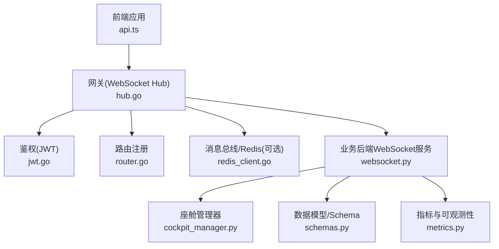
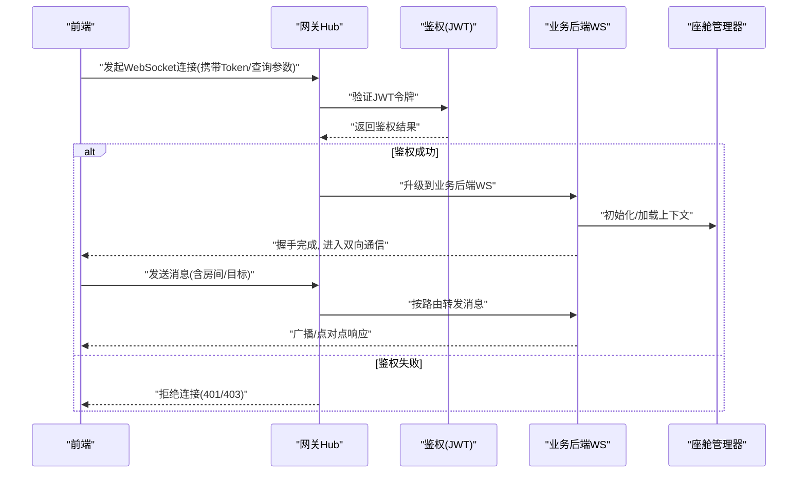
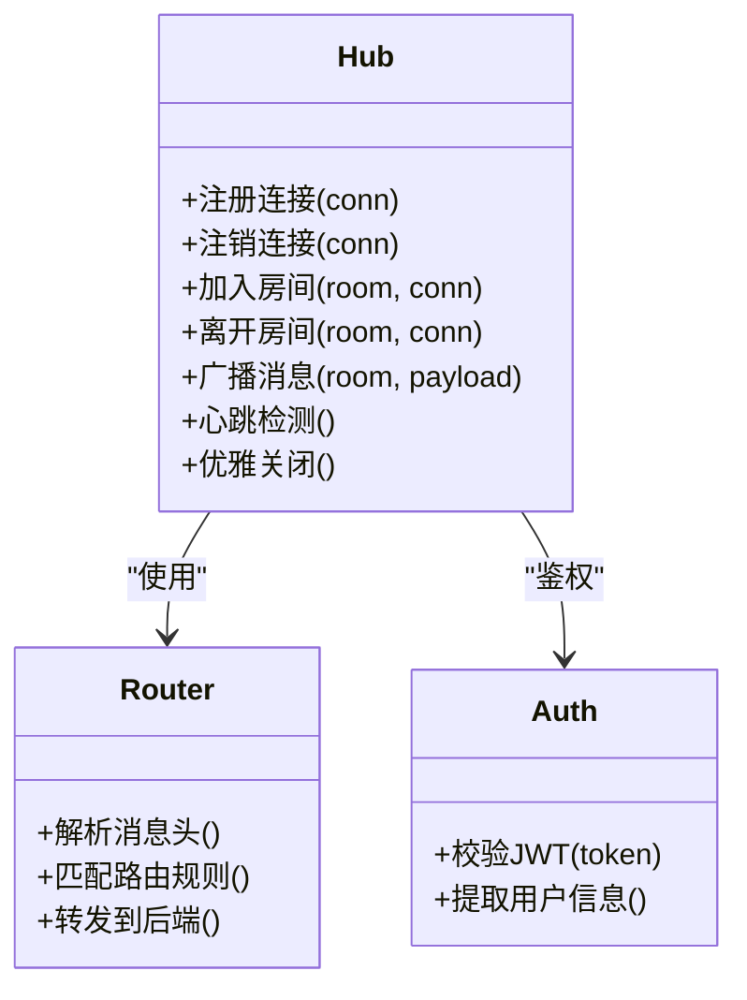
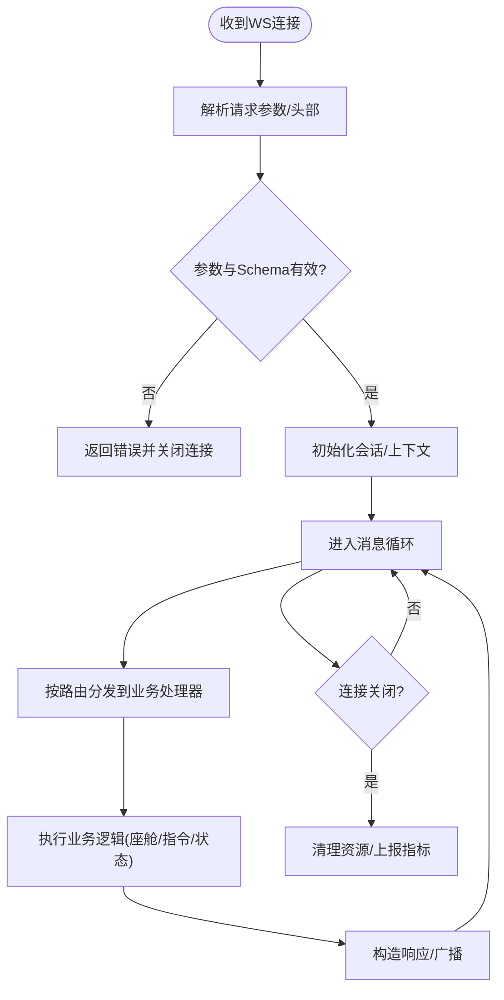
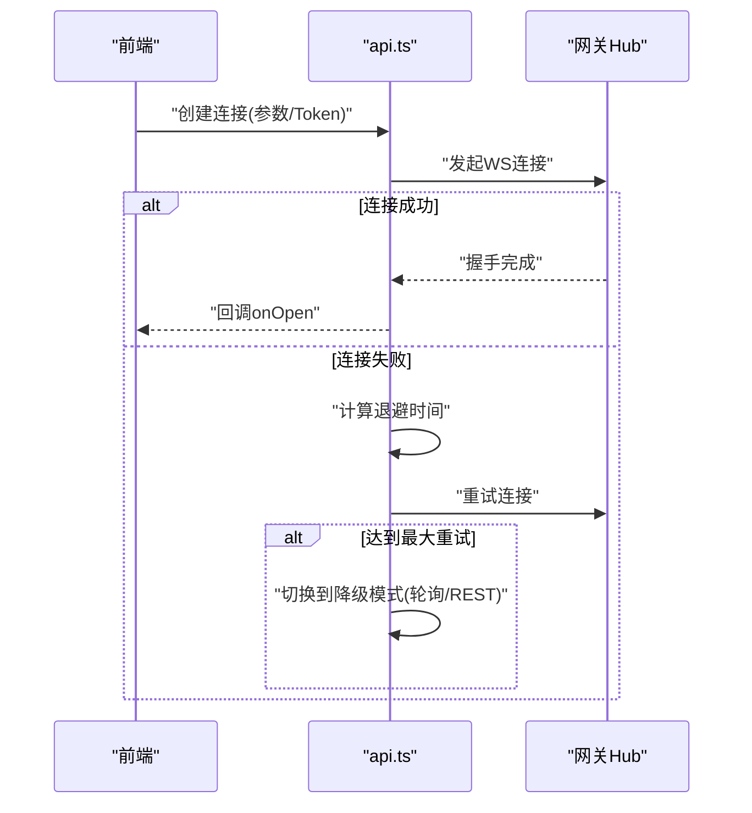
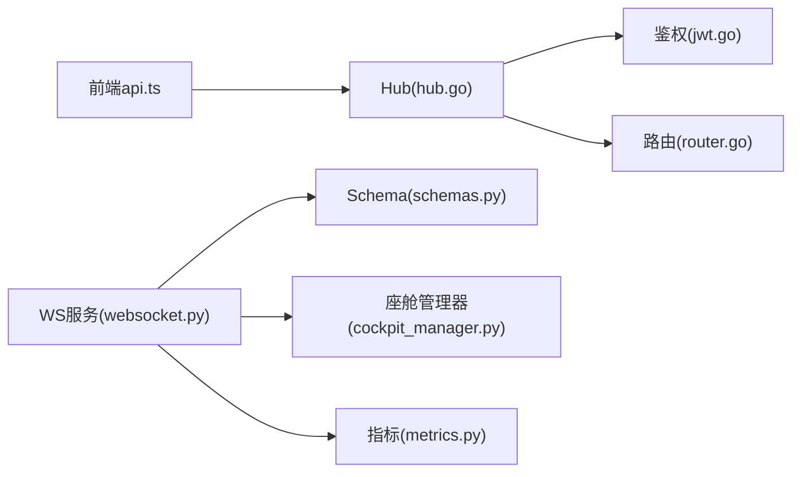

# WebSocket连接管理

<cite>
**本文引用的文件**   
- [backend_design/nexus/api/websocket.py](file://backend_design/nexus/api/websocket.py)
- [backend_design/nexus_gate/internal/ws/hub.go](file://backend_design/nexus_gate/internal/ws/hub.go)
- [backend_design/nexus_gate/internal/auth/jwt.go](file://backend_design/nexus_gate/internal/auth/jwt.go)
- [backend_design/nexus_gate/internal/router/router.go](file://backend_design/nexus_gate/internal/router/router.go)
- [backend_design/nexus/core/cockpit_manager.py](file://backend_design/nexus/core/cockpit_manager.py)
- [backend_design/nexus/models/schemas.py](file://backend_design/nexus/models/schemas.py)
- [backend_design/nexus/observability/metrics.py](file://backend_design/nexus/observability/metrics.py)
- [frontend_design/src/lib/api.ts](file://frontend_design/src/lib/api.ts)
</cite>

## 目录
1. [简介](#简介)
2. [项目结构](#项目结构)
3. [核心组件](#核心组件)
4. [架构总览](#架构总览)
5. [详细组件分析](#详细组件分析)
6. [依赖关系分析](#依赖关系分析)
7. [性能考量](#性能考量)
8. [故障排查指南](#故障排查指南)
9. [结论](#结论)
10. [附录](#附录)

## 简介
本文件面向NexusCockpit系统的WebSocket连接管理，覆盖前后端连接建立、认证与握手协议、连接生命周期（连接池、心跳、超时、优雅关闭）、消息路由（房间、用户分组、广播策略）、错误处理（异常捕获、自动重连、降级）、以及监控与调试方法。文档以代码级为依据，提供可视化图示与最佳实践建议，帮助读者快速理解并稳定集成WebSocket能力。

## 项目结构
NexusCockpit的WebSocket能力由网关层（Go）与业务后端（Python）共同实现：
- 网关层负责HTTP到WebSocket的升级、鉴权、连接注册、房间管理与消息转发。
- 业务后端暴露WebSocket接口，承载具体业务逻辑（如座舱状态、会话控制等）。
- 前端通过统一API模块发起WebSocket连接，并在断线时执行重连与降级。

图表来源
- [backend_design/nexus_gate/internal/ws/hub.go](file://backend_design/nexus_gate/internal/ws/hub.go)
- [backend_design/nexus_gate/internal/auth/jwt.go](file://backend_design/nexus_gate/internal/auth/jwt.go)
- [backend_design/nexus_gate/internal/router/router.go](file://backend_design/nexus_gate/internal/router/router.go)
- [backend_design/nexus/api/websocket.py](file://backend_design/nexus/api/websocket.py)
- [backend_design/nexus/core/cockpit_manager.py](file://backend_design/nexus/core/cockpit_manager.py)
- [backend_design/nexus/models/schemas.py](file://backend_design/nexus/models/schemas.py)
- [backend_design/nexus/observability/metrics.py](file://backend_design/nexus/observability/metrics.py)
- [frontend_design/src/lib/api.ts](file://frontend_design/src/lib/api.ts)

章节来源
- [backend_design/nexus_gate/internal/ws/hub.go](file://backend_design/nexus_gate/internal/ws/hub.go)
- [backend_design/nexus_gate/internal/auth/jwt.go](file://backend_design/nexus_gate/internal/auth/jwt.go)
- [backend_design/nexus_gate/internal/router/router.go](file://backend_design/nexus_gate/internal/router/router.go)
- [backend_design/nexus/api/websocket.py](file://backend_design/nexus/api/websocket.py)
- [backend_design/nexus/core/cockpit_manager.py](file://backend_design/nexus/core/cockpit_manager.py)
- [backend_design/nexus/models/schemas.py](file://backend_design/nexus/models/schemas.py)
- [backend_design/nexus/observability/metrics.py](file://backend_design/nexus/observability/metrics.py)
- [frontend_design/src/lib/api.ts](file://frontend_design/src/lib/api.ts)

## 核心组件
- 网关WebSocket Hub：维护连接集合、房间映射、心跳检测、消息路由与广播。
- 鉴权中间件：校验JWT令牌，确保仅合法客户端接入。
- 路由注册：将WebSocket路径与处理器绑定。
- 业务后端WebSocket服务：接收连接，执行业务逻辑（如座舱状态订阅、指令下发）。
- 座舱管理器：封装业务域对象与状态同步。
- Schema定义：约束消息结构与字段。
- 指标与可观测性：采集连接数、消息吞吐、延迟等关键指标。
- 前端API模块：封装连接参数、重连策略与降级行为。

章节来源
- [backend_design/nexus_gate/internal/ws/hub.go](file://backend_design/nexus_gate/internal/ws/hub.go)
- [backend_design/nexus_gate/internal/auth/jwt.go](file://backend_design/nexus_gate/internal/auth/jwt.go)
- [backend_design/nexus_gate/internal/router/router.go](file://backend_design/nexus_gate/internal/router/router.go)
- [backend_design/nexus/api/websocket.py](file://backend_design/nexus/api/websocket.py)
- [backend_design/nexus/core/cockpit_manager.py](file://backend_design/nexus/core/cockpit_manager.py)
- [backend_design/nexus/models/schemas.py](file://backend_design/nexus/models/schemas.py)
- [backend_design/nexus/observability/metrics.py](file://backend_design/nexus/observability/metrics.py)
- [frontend_design/src/lib/api.ts](file://frontend_design/src/lib/api.ts)

## 架构总览
下图展示从前端连接到业务后端的端到端流程，包括鉴权、握手、路由与消息分发。

图表来源
- [backend_design/nexus_gate/internal/ws/hub.go](file://backend_design/nexus_gate/internal/ws/hub.go)
- [backend_design/nexus_gate/internal/auth/jwt.go](file://backend_design/nexus_gate/internal/auth/jwt.go)
- [backend_design/nexus/api/websocket.py](file://backend_design/nexus/api/websocket.py)
- [backend_design/nexus/core/cockpit_manager.py](file://backend_design/nexus/core/cockpit_manager.py)

## 详细组件分析

### 网关WebSocket Hub（连接池、心跳、路由、广播）
- 连接池维护：集中管理活跃连接，支持按房间/用户维度索引。
- 心跳检测：周期性探测空闲连接，超时断开释放资源。
- 路由机制：根据消息头或负载中的房间/目标字段进行定向投递。
- 广播策略：支持房间广播、用户组广播与全量广播（谨慎使用）。
- 优雅关闭：在退出前向所有连接发送关闭帧，等待缓冲写入完成后清理。

图表来源
- [backend_design/nexus_gate/internal/ws/hub.go](file://backend_design/nexus_gate/internal/ws/hub.go)
- [backend_design/nexus_gate/internal/auth/jwt.go](file://backend_design/nexus_gate/internal/auth/jwt.go)
- [backend_design/nexus_gate/internal/router/router.go](file://backend_design/nexus_gate/internal/router/router.go)

章节来源
- [backend_design/nexus_gate/internal/ws/hub.go](file://backend_design/nexus_gate/internal/ws/hub.go)
- [backend_design/nexus_gate/internal/router/router.go](file://backend_design/nexus_gate/internal/router/router.go)
- [backend_design/nexus_gate/internal/auth/jwt.go](file://backend_design/nexus_gate/internal/auth/jwt.go)

### 业务后端WebSocket服务（握手、会话、业务逻辑）
- 握手协议：接收前端连接，读取认证信息与初始配置，完成会话初始化。
- 会话管理：维护用户上下文、房间成员、订阅关系。
- 业务处理：基于Schema校验消息，调用座舱管理器更新状态或触发动作。
- 指标上报：记录连接时长、消息数量、错误率等。

图表来源
- [backend_design/nexus/api/websocket.py](file://backend_design/nexus/api/websocket.py)
- [backend_design/nexus/core/cockpit_manager.py](file://backend_design/nexus/core/cockpit_manager.py)
- [backend_design/nexus/models/schemas.py](file://backend_design/nexus/models/schemas.py)
- [backend_design/nexus/observability/metrics.py](file://backend_design/nexus/observability/metrics.py)

章节来源
- [backend_design/nexus/api/websocket.py](file://backend_design/nexus/api/websocket.py)
- [backend_design/nexus/core/cockpit_manager.py](file://backend_design/nexus/core/cockpit_manager.py)
- [backend_design/nexus/models/schemas.py](file://backend_design/nexus/models/schemas.py)
- [backend_design/nexus/observability/metrics.py](file://backend_design/nexus/observability/metrics.py)

### 前端连接与重连策略
- 连接参数：包含服务端地址、协议（ws/wss）、查询参数（如token、房间标识）。
- 认证机制：在URL查询参数或自定义头部中携带JWT令牌，供网关校验。
- 重连逻辑：指数退避+抖动，限制最大重试次数；网络恢复后重建连接。
- 降级策略：当WebSocket不可用时，回退到轮询或REST接口获取必要数据。

图表来源
- [frontend_design/src/lib/api.ts](file://frontend_design/src/lib/api.ts)
- [backend_design/nexus_gate/internal/ws/hub.go](file://backend_design/nexus_gate/internal/ws/hub.go)

章节来源
- [frontend_design/src/lib/api.ts](file://frontend_design/src/lib/api.ts)

## 依赖关系分析
- 网关Hub依赖鉴权模块进行令牌校验，依赖路由模块进行消息分发。
- 业务后端依赖Schema进行消息校验，依赖座舱管理器执行业务操作。
- 可观测性模块贯穿前后端，用于采集连接与消息相关指标。

图表来源
- [backend_design/nexus_gate/internal/ws/hub.go](file://backend_design/nexus_gate/internal/ws/hub.go)
- [backend_design/nexus_gate/internal/auth/jwt.go](file://backend_design/nexus_gate/internal/auth/jwt.go)
- [backend_design/nexus_gate/internal/router/router.go](file://backend_design/nexus_gate/internal/router/router.go)
- [backend_design/nexus/api/websocket.py](file://backend_design/nexus/api/websocket.py)
- [backend_design/nexus/models/schemas.py](file://backend_design/nexus/models/schemas.py)
- [backend_design/nexus/core/cockpit_manager.py](file://backend_design/nexus/core/cockpit_manager.py)
- [backend_design/nexus/observability/metrics.py](file://backend_design/nexus/observability/metrics.py)
- [frontend_design/src/lib/api.ts](file://frontend_design/src/lib/api.ts)

章节来源
- [backend_design/nexus_gate/internal/ws/hub.go](file://backend_design/nexus_gate/internal/ws/hub.go)
- [backend_design/nexus_gate/internal/auth/jwt.go](file://backend_design/nexus_gate/internal/auth/jwt.go)
- [backend_design/nexus_gate/internal/router/router.go](file://backend_design/nexus_gate/internal/router/router.go)
- [backend_design/nexus/api/websocket.py](file://backend_design/nexus/api/websocket.py)
- [backend_design/nexus/models/schemas.py](file://backend_design/nexus/models/schemas.py)
- [backend_design/nexus/core/cockpit_manager.py](file://backend_design/nexus/core/cockpit_manager.py)
- [backend_design/nexus/observability/metrics.py](file://backend_design/nexus/observability/metrics.py)
- [frontend_design/src/lib/api.ts](file://frontend_design/src/lib/api.ts)

## 性能考量
- 连接池容量：合理设置最大连接数与每进程并发上限，避免内存泄漏。
- 心跳间隔与超时：根据网络环境调优，平衡实时性与资源占用。
- 广播范围：优先房间/用户组广播，减少全量广播带来的放大效应。
- 背压与限流：在高吞吐场景下对写通道进行限速，防止阻塞。
- 指标采样：对关键路径打点，结合Prometheus/Grafana进行可视化监控。

[本节为通用指导，不直接分析具体文件]

## 故障排查指南
- 连接异常捕获：检查网关日志与业务后端日志，定位握手失败原因（鉴权失败、参数缺失、后端不可用）。
- 自动重连逻辑：确认前端是否启用指数退避与最大重试次数，观察重连曲线是否符合预期。
- 降级策略：当WS不可用时，确认前端已切换至轮询或REST接口，保证基本功能可用。
- 监控与调试：查看连接数、消息吞吐、错误率等指标，结合链路追踪定位瓶颈。

章节来源
- [backend_design/nexus_gate/internal/ws/hub.go](file://backend_design/nexus_gate/internal/ws/hub.go)
- [backend_design/nexus/api/websocket.py](file://backend_design/nexus/api/websocket.py)
- [backend_design/nexus/observability/metrics.py](file://backend_design/nexus/observability/metrics.py)
- [frontend_design/src/lib/api.ts](file://frontend_design/src/lib/api.ts)

## 结论
NexusCockpit的WebSocket连接管理由网关Hub与业务后端协同实现，涵盖鉴权、握手、路由、广播、心跳与优雅关闭等关键环节。通过合理的连接池与心跳策略、严格的Schema校验与指标采集，系统可在高并发与不稳定网络环境下保持稳定与可观测。前端的重连与降级策略进一步提升了用户体验与鲁棒性。

[本节为总结，不直接分析具体文件]

## 附录
- 连接参数建议：
  - 协议：生产环境建议使用wss。
  - 查询参数：token、room、client_id等。
  - 头部：可附加设备指纹、版本信息等。
- 最佳实践：
  - 统一消息Schema，严格校验入参。
  - 房间粒度广播，避免全量广播。
  - 心跳与超时参数与环境适配。
  - 全面埋点与告警，保障可观测性。

[本节为补充说明，不直接分析具体文件]