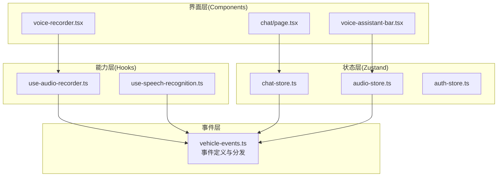
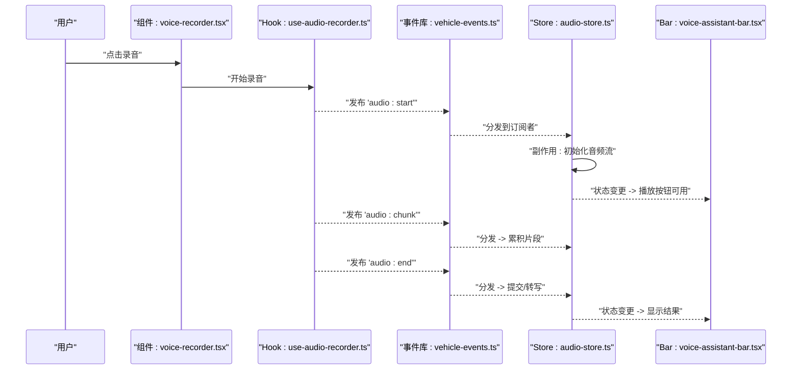
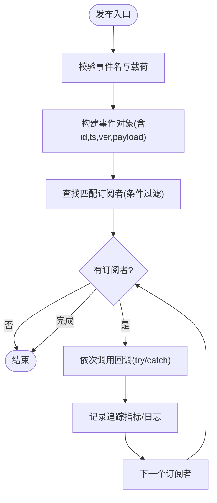
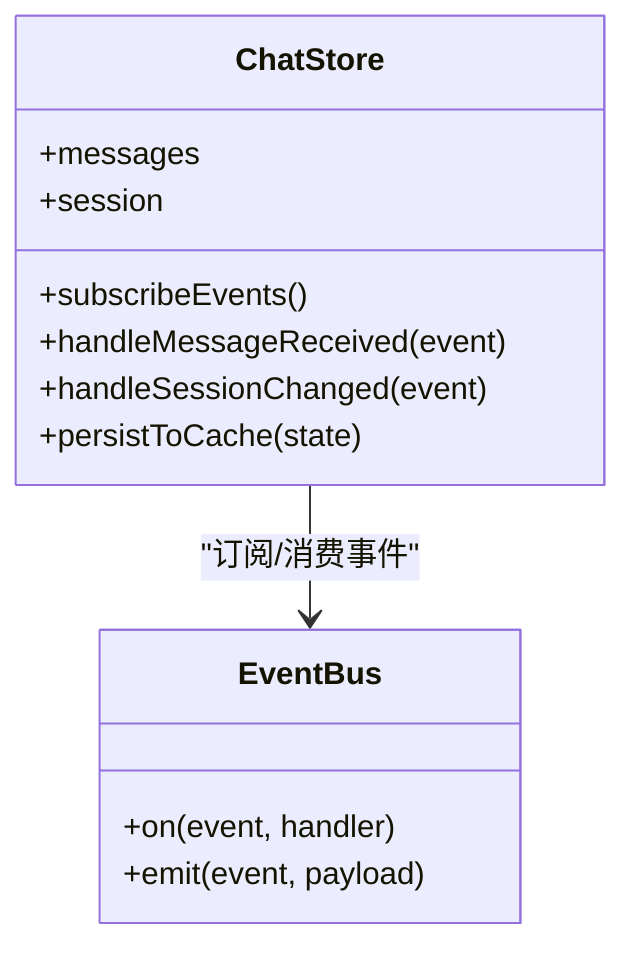
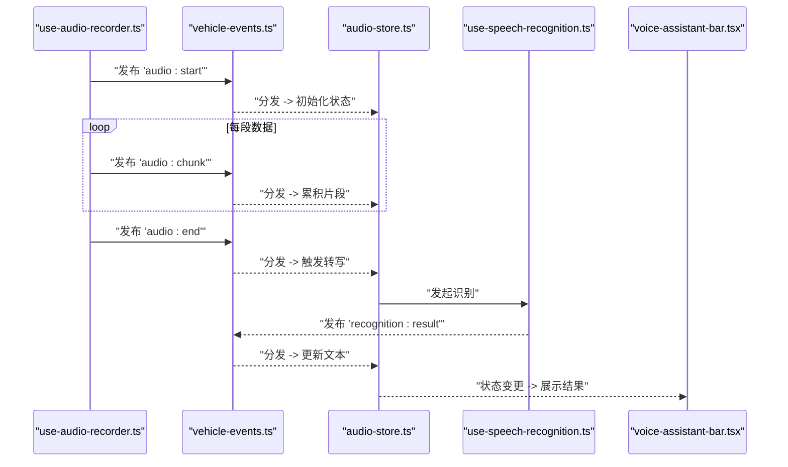
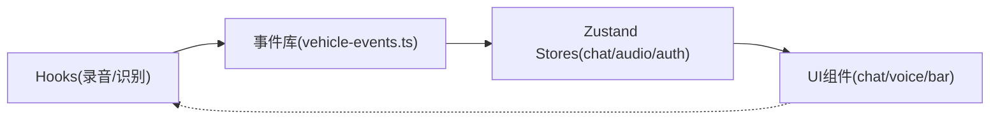

# 事件驱动开发模式

<cite>
**本文引用的文件**   
- [frontend_design/src/lib/vehicle-events.ts](file://frontend_design/src/lib/vehicle-events.ts)
- [frontend_design/src/stores/chat-store.ts](file://frontend_design/src/stores/chat-store.ts)
- [frontend_design/src/stores/audio-store.ts](file://frontend_design/src/stores/audio-store.ts)
- [frontend_design/src/stores/auth-store.ts](file://frontend_design/src/stores/auth-store.ts)
- [frontend_design/src/hooks/use-audio-recorder.ts](file://frontend_design/src/hooks/use-audio-recorder.ts)
- [frontend_design/src/hooks/use-speech-recognition.ts](file://frontend_design/src/hooks/use-speech-recognition.ts)
- [frontend_design/src/components/voice-recorder.tsx](file://frontend_design/src/components/voice-recorder.tsx)
- [frontend_design/src/components/vehicle/voice-assistant-bar.tsx](file://frontend_design/src/components/vehicle/voice-assistant-bar.tsx)
- [frontend_design/src/app/chat/page.tsx](file://frontend_design/src/app/chat/page.tsx)
</cite>

## 目录
1. [简介](#简介)
2. [项目结构](#项目结构)
3. [核心组件](#核心组件)
4. [架构总览](#架构总览)
5. [详细组件分析](#详细组件分析)
6. [依赖分析](#依赖分析)
7. [性能考虑](#性能考虑)
8. [故障排查指南](#故障排查指南)
9. [结论](#结论)
10. [附录](#附录)

## 简介
本文件面向NexusCockpit前端，系统化阐述事件驱动开发模式在系统中的落地实践。内容覆盖：
- 事件总线、发布订阅与观察者模式的实现思路与边界
- 自定义事件的定义规范（命名约定、数据结构设计、版本管理）
- 监听器的注册与管理（动态绑定、条件监听、内存泄漏防护）
- 状态管理中的事件处理（Zustand store的事件分发、副作用处理、状态同步）
- 事件调试工具与方法（追踪、性能分析、错误诊断）
- 实际案例与最佳实践（语音录制、语音识别、聊天会话等）

## 项目结构
前端采用Next.js应用，事件相关代码主要分布在以下位置：
- 领域事件库：用于车辆域事件定义与分发
- Zustand stores：集中式状态管理与事件分发
- Hooks：封装浏览器能力与外部服务，触发领域事件
- UI组件：消费事件并驱动UI更新

图表来源
- [frontend_design/src/lib/vehicle-events.ts](file://frontend_design/src/lib/vehicle-events.ts)
- [frontend_design/src/stores/chat-store.ts](file://frontend_design/src/stores/chat-store.ts)
- [frontend_design/src/stores/audio-store.ts](file://frontend_design/src/stores/audio-store.ts)
- [frontend_design/src/hooks/use-audio-recorder.ts](file://frontend_design/src/hooks/use-audio-recorder.ts)
- [frontend_design/src/hooks/use-speech-recognition.ts](file://frontend_design/src/hooks/use-speech-recognition.ts)
- [frontend_design/src/components/voice-recorder.tsx](file://frontend_design/src/components/voice-recorder.tsx)
- [frontend_design/src/components/vehicle/voice-assistant-bar.tsx](file://frontend_design/src/components/vehicle/voice-assistant-bar.tsx)
- [frontend_design/src/app/chat/page.tsx](file://frontend_design/src/app/chat/page.tsx)

章节来源
- [frontend_design/src/lib/vehicle-events.ts](file://frontend_design/src/lib/vehicle-events.ts)
- [frontend_design/src/stores/chat-store.ts](file://frontend_design/src/stores/chat-store.ts)
- [frontend_design/src/stores/audio-store.ts](file://frontend_design/src/stores/audio-store.ts)
- [frontend_design/src/hooks/use-audio-recorder.ts](file://frontend_design/src/hooks/use-audio-recorder.ts)
- [frontend_design/src/hooks/use-speech-recognition.ts](file://frontend_design/src/hooks/use-speech-recognition.ts)
- [frontend_design/src/components/voice-recorder.tsx](file://frontend_design/src/components/voice-recorder.tsx)
- [frontend_design/src/components/vehicle/voice-assistant-bar.tsx](file://frontend_design/src/components/vehicle/voice-assistant-bar.tsx)
- [frontend_design/src/app/chat/page.tsx](file://frontend_design/src/app/chat/page.tsx)

## 核心组件
- 事件库（vehicle-events.ts）
  - 职责：定义领域事件类型、常量、事件载荷结构；提供统一的发布/订阅接口；可选的轻量日志与追踪。
  - 关键能力：事件命名空间、版本字段、条件过滤、一次性监听、去抖/节流扩展点。
- Zustand Store（chat-store.ts、audio-store.ts、auth-store.ts）
  - 职责：维护应用状态；订阅领域事件；执行副作用（如网络请求、持久化）；将结果写回状态树。
  - 关键能力：基于事件的分发器、副作用编排、状态一致性保障。
- Hooks（use-audio-recorder.ts、use-speech-recognition.ts）
  - 职责：封装浏览器API或第三方SDK；将底层能力变化转换为领域事件。
  - 关键能力：生命周期管理、错误上报、重试策略。
- UI组件（voice-recorder.tsx、voice-assistant-bar.tsx、chat/page.tsx）
  - 职责：消费状态与事件；驱动交互与渲染。
  - 关键能力：按需订阅、条件渲染、用户反馈。

章节来源
- [frontend_design/src/lib/vehicle-events.ts](file://frontend_design/src/lib/vehicle-events.ts)
- [frontend_design/src/stores/chat-store.ts](file://frontend_design/src/stores/chat-store.ts)
- [frontend_design/src/stores/audio-store.ts](file://frontend_design/src/stores/audio-store.ts)
- [frontend_design/src/stores/auth-store.ts](file://frontend_design/src/stores/auth-store.ts)
- [frontend_design/src/hooks/use-audio-recorder.ts](file://frontend_design/src/hooks/use-audio-recorder.ts)
- [frontend_design/src/hooks/use-speech-recognition.ts](file://frontend_design/src/hooks/use-speech-recognition.ts)
- [frontend_design/src/components/voice-recorder.tsx](file://frontend_design/src/components/voice-recorder.tsx)
- [frontend_design/src/components/vehicle/voice-assistant-bar.tsx](file://frontend_design/src/components/vehicle/voice-assistant-bar.tsx)
- [frontend_design/src/app/chat/page.tsx](file://frontend_design/src/app/chat/page.tsx)

## 架构总览
事件驱动架构在前端的分层关系如下：
- 能力层（Hooks）捕获原生能力变化，发布领域事件
- 事件层（Event Bus）负责路由、过滤、版本兼容与追踪
- 状态层（Zustand）订阅事件，执行业务副作用，更新状态
- 界面层（Components）订阅状态，响应式渲染

图表来源
- [frontend_design/src/components/voice-recorder.tsx](file://frontend_design/src/components/voice-recorder.tsx)
- [frontend_design/src/hooks/use-audio-recorder.ts](file://frontend_design/src/hooks/use-audio-recorder.ts)
- [frontend_design/src/lib/vehicle-events.ts](file://frontend_design/src/lib/vehicle-events.ts)
- [frontend_design/src/stores/audio-store.ts](file://frontend_design/src/stores/audio-store.ts)
- [frontend_design/src/components/vehicle/voice-assistant-bar.tsx](file://frontend_design/src/components/vehicle/voice-assistant-bar.tsx)

## 详细组件分析

### 事件库（vehicle-events.ts）
- 设计要点
  - 事件命名：采用“模块:动作”或“模块:实体.动作”的命名空间风格，保证唯一性与可读性
  - 事件载荷：包含基础元数据（时间戳、来源、版本）、业务数据、可选上下文
  - 版本管理：载荷中携带version字段，支持向后兼容与灰度升级
  - 订阅模型：支持一次性订阅、条件订阅、批量订阅
  - 追踪与可观测性：记录事件ID、耗时、错误堆栈，便于定位问题
- 典型流程
  - 发布：校验事件名与载荷 -> 生成事件ID -> 遍历订阅者 -> 按顺序调用回调
  - 订阅：注册回调与过滤条件 -> 返回取消函数 -> 组件卸载时调用以释放资源
  - 条件监听：根据上下文（如租户、设备、功能开关）决定是否投递
  - 内存安全：自动清理过期订阅、避免闭包引用导致泄漏

图表来源
- [frontend_design/src/lib/vehicle-events.ts](file://frontend_design/src/lib/vehicle-events.ts)

章节来源
- [frontend_design/src/lib/vehicle-events.ts](file://frontend_design/src/lib/vehicle-events.ts)

### Zustand Store 中的事件处理（以 chat-store.ts 为例）
- 职责
  - 订阅领域事件（如消息发送、接收、会话切换）
  - 执行副作用（如网络请求、本地缓存）
  - 更新状态树，确保UI一致性
- 关键点
  - 使用store内部订阅机制，在初始化时注册事件监听
  - 副作用幂等：通过事件ID或时间戳去重
  - 错误隔离：单个事件处理失败不影响其他事件
  - 状态快照：必要时保存历史快照以便回滚或审计

图表来源
- [frontend_design/src/stores/chat-store.ts](file://frontend_design/src/stores/chat-store.ts)
- [frontend_design/src/lib/vehicle-events.ts](file://frontend_design/src/lib/vehicle-events.ts)

章节来源
- [frontend_design/src/stores/chat-store.ts](file://frontend_design/src/stores/chat-store.ts)

### 音频与语音识别链路（audio-store.ts、use-audio-recorder.ts、use-speech-recognition.ts）
- 职责分工
  - use-audio-recorder.ts：封装MediaRecorder，产生“开始/片段/结束”事件
  - use-speech-recognition.ts：封装语音识别能力，产生“识别中/结果/错误”事件
  - audio-store.ts：聚合音频片段、触发转写、管理播放状态
- 关键流程
  - 录制开始 -> 发布开始事件 -> 周期性发布片段事件 -> 录制结束发布结束事件
  - 识别开始 -> 发布识别中事件 -> 收到结果发布成功事件 -> 异常发布错误事件
  - Store侧统一收敛，更新UI状态（录音进度、识别文本、播放控制）

图表来源
- [frontend_design/src/hooks/use-audio-recorder.ts](file://frontend_design/src/hooks/use-audio-recorder.ts)
- [frontend_design/src/lib/vehicle-events.ts](file://frontend_design/src/lib/vehicle-events.ts)
- [frontend_design/src/stores/audio-store.ts](file://frontend_design/src/stores/audio-store.ts)
- [frontend_design/src/hooks/use-speech-recognition.ts](file://frontend_design/src/hooks/use-speech-recognition.ts)
- [frontend_design/src/components/vehicle/voice-assistant-bar.tsx](file://frontend_design/src/components/vehicle/voice-assistant-bar.tsx)

章节来源
- [frontend_design/src/stores/audio-store.ts](file://frontend_design/src/stores/audio-store.ts)
- [frontend_design/src/hooks/use-audio-recorder.ts](file://frontend_design/src/hooks/use-audio-recorder.ts)
- [frontend_design/src/hooks/use-speech-recognition.ts](file://frontend_design/src/hooks/use-speech-recognition.ts)
- [frontend_design/src/components/vehicle/voice-assistant-bar.tsx](file://frontend_design/src/components/vehicle/voice-assistant-bar.tsx)

### 认证与权限事件（auth-store.ts）
- 职责
  - 订阅登录/登出、令牌刷新、权限变更等事件
  - 维护用户会话、角色与功能开关
  - 在事件驱动下触发鉴权相关的副作用（如重新加载受保护资源）
- 关键点
  - 事件幂等：重复登录事件不会重复创建会话
  - 安全：敏感信息不进入通用事件载荷，仅传递必要标识
  - 降级：当后端不可用时，优先使用本地缓存与会话恢复

章节来源
- [frontend_design/src/stores/auth-store.ts](file://frontend_design/src/stores/auth-store.ts)

### 聊天页面集成（chat/page.tsx）
- 职责
  - 作为聊天场景的容器，订阅聊天相关事件与状态
  - 将用户输入转化为领域事件（如发送消息）
  - 渲染消息列表、输入框、发送按钮等
- 关键点
  - 事件与状态解耦：页面只关心最终状态，具体处理由store负责
  - 错误提示：从事件载荷中提取错误信息并友好展示

章节来源
- [frontend_design/src/app/chat/page.tsx](file://frontend_design/src/app/chat/page.tsx)

### 录音组件集成（voice-recorder.tsx）
- 职责
  - 提供录音交互入口，调用录音Hook
  - 根据事件与状态控制UI（开始/停止、进度条、错误提示）
- 关键点
  - 生命周期：组件卸载时取消订阅，防止内存泄漏
  - 用户体验：即时反馈（波形、时长、错误原因）

章节来源
- [frontend_design/src/components/voice-recorder.tsx](file://frontend_design/src/components/voice-recorder.tsx)

## 依赖分析
- 耦合关系
  - Hooks对事件库强依赖，负责将能力变化转为事件
  - Store对事件库弱依赖，通过订阅接口消费事件
  - 组件对Store强依赖，对事件库无直接依赖，保持UI简洁
- 潜在循环
  - 避免Store反向发布同一事件造成环路
  - 事件库不应依赖具体Store实现，保持纯事件通道
- 外部依赖
  - 浏览器媒体API、语音识别API、网络请求库等

图表来源
- [frontend_design/src/lib/vehicle-events.ts](file://frontend_design/src/lib/vehicle-events.ts)
- [frontend_design/src/stores/chat-store.ts](file://frontend_design/src/stores/chat-store.ts)
- [frontend_design/src/stores/audio-store.ts](file://frontend_design/src/stores/audio-store.ts)
- [frontend_design/src/stores/auth-store.ts](file://frontend_design/src/stores/auth-store.ts)
- [frontend_design/src/hooks/use-audio-recorder.ts](file://frontend_design/src/hooks/use-audio-recorder.ts)
- [frontend_design/src/hooks/use-speech-recognition.ts](file://frontend_design/src/hooks/use-speech-recognition.ts)
- [frontend_design/src/components/voice-recorder.tsx](file://frontend_design/src/components/voice-recorder.tsx)
- [frontend_design/src/components/vehicle/voice-assistant-bar.tsx](file://frontend_design/src/components/vehicle/voice-assistant-bar.tsx)
- [frontend_design/src/app/chat/page.tsx](file://frontend_design/src/app/chat/page.tsx)

章节来源
- [frontend_design/src/lib/vehicle-events.ts](file://frontend_design/src/lib/vehicle-events.ts)
- [frontend_design/src/stores/chat-store.ts](file://frontend_design/src/stores/chat-store.ts)
- [frontend_design/src/stores/audio-store.ts](file://frontend_design/src/stores/audio-store.ts)
- [frontend_design/src/stores/auth-store.ts](file://frontend_design/src/stores/auth-store.ts)
- [frontend_design/src/hooks/use-audio-recorder.ts](file://frontend_design/src/hooks/use-audio-recorder.ts)
- [frontend_design/src/hooks/use-speech-recognition.ts](file://frontend_design/src/hooks/use-speech-recognition.ts)
- [frontend_design/src/components/voice-recorder.tsx](file://frontend_design/src/components/voice-recorder.tsx)
- [frontend_design/src/components/vehicle/voice-assistant-bar.tsx](file://frontend_design/src/components/vehicle/voice-assistant-bar.tsx)
- [frontend_design/src/app/chat/page.tsx](file://frontend_design/src/app/chat/page.tsx)

## 性能考虑
- 事件分发
  - 批量合并：高频事件（如音频片段）应合并或节流后再分发
  - 条件订阅：减少无关订阅者的计算开销
- 状态更新
  - 最小化状态粒度：避免大对象频繁替换，使用增量更新
  - 副作用批处理：将多个副作用合并为一次持久化
- 内存管理
  - 及时取消订阅：组件卸载时调用取消函数
  - 避免闭包持有大对象：在回调中仅引用必要字段
- 可观测性
  - 采样统计：对热点事件进行采样记录，避免全量日志
  - 错误分级：区分可恢复与不可恢复错误，采取不同策略

[本节为通用指导，无需源码引用]

## 故障排查指南
- 常见问题
  - 事件未触发：检查事件名是否一致、订阅是否已注册、条件过滤是否过严
  - 状态不同步：确认副作用是否幂等、是否存在竞态条件
  - 内存泄漏：确认组件卸载时是否调用取消订阅函数
  - 性能抖动：检查高频事件是否缺少节流/合并
- 定位方法
  - 事件追踪：启用事件ID与时间戳，串联上下游调用链
  - 断点与日志：在事件分发前后打印关键参数
  - 回放与复现：记录事件序列，构造最小复现场景
- 修复建议
  - 增加重试与退避策略
  - 引入超时与熔断保护
  - 完善错误分类与告警

章节来源
- [frontend_design/src/lib/vehicle-events.ts](file://frontend_design/src/lib/vehicle-events.ts)
- [frontend_design/src/stores/chat-store.ts](file://frontend_design/src/stores/chat-store.ts)
- [frontend_design/src/stores/audio-store.ts](file://frontend_design/src/stores/audio-store.ts)
- [frontend_design/src/hooks/use-audio-recorder.ts](file://frontend_design/src/hooks/use-audio-recorder.ts)
- [frontend_design/src/hooks/use-speech-recognition.ts](file://frontend_design/src/hooks/use-speech-recognition.ts)

## 结论
通过将能力层、事件层与状态层解耦，NexusCockpit前端实现了高内聚、低耦合的事件驱动架构。该模式提升了系统的可测试性、可扩展性与可观测性。建议在后续迭代中持续完善事件规范、增强调试工具链，并在复杂场景中引入更细粒度的条件订阅与批处理策略。

[本节为总结性内容，无需源码引用]

## 附录

### 自定义事件定义规范
- 命名约定
  - 采用“模块:动作”或“模块:实体.动作”，例如“audio:start”、“recognition:result”
  - 动词使用过去分词或动名词，体现事件语义
- 数据结构设计
  - 基础字段：event、version、timestamp、eventId、source
  - 业务字段：payload（按场景定义），可选context（租户、设备、功能开关）
  - 错误字段：error（code、message、stack）
- 版本管理
  - version字段用于兼容演进，旧版客户端忽略未知字段
  - 重大变更需升级major版本，并提供迁移策略

章节来源
- [frontend_design/src/lib/vehicle-events.ts](file://frontend_design/src/lib/vehicle-events.ts)

### 监听器注册与管理
- 动态绑定
  - 运行时注册/注销监听器，支持条件过滤
- 一次性监听
  - 首次触发后自动移除，适用于启动阶段的一次性任务
- 内存泄漏防护
  - 所有订阅必须返回取消函数，组件卸载时调用
  - 避免在回调中持有大对象引用

章节来源
- [frontend_design/src/lib/vehicle-events.ts](file://frontend_design/src/lib/vehicle-events.ts)

### 状态管理中的事件处理
- 事件分发
  - Store在初始化时订阅领域事件，统一处理
- 副作用处理
  - 网络请求、本地缓存、统计上报等副作用在事件处理器中编排
- 状态同步
  - 保证状态更新的原子性与幂等性，避免重复写入

章节来源
- [frontend_design/src/stores/chat-store.ts](file://frontend_design/src/stores/chat-store.ts)
- [frontend_design/src/stores/audio-store.ts](file://frontend_design/src/stores/audio-store.ts)
- [frontend_design/src/stores/auth-store.ts](file://frontend_design/src/stores/auth-store.ts)

### 事件调试工具与方法
- 事件追踪
  - 为每个事件分配唯一ID，串联上下游
- 性能分析
  - 记录事件处理耗时，识别热点路径
- 错误诊断
  - 收集错误上下文，分类告警，辅助快速定位

章节来源
- [frontend_design/src/lib/vehicle-events.ts](file://frontend_design/src/lib/vehicle-events.ts)

### 实战案例与最佳实践
- 语音录制与识别
  - 将底层能力变化抽象为领域事件，Store聚合并驱动UI
- 聊天会话
  - 通过事件驱动消息收发与会话切换，保持UI与状态一致
- 认证与权限
  - 以事件驱动会话生命周期，简化鉴权逻辑

章节来源
- [frontend_design/src/hooks/use-audio-recorder.ts](file://frontend_design/src/hooks/use-audio-recorder.ts)
- [frontend_design/src/hooks/use-speech-recognition.ts](file://frontend_design/src/hooks/use-speech-recognition.ts)
- [frontend_design/src/stores/audio-store.ts](file://frontend_design/src/stores/audio-store.ts)
- [frontend_design/src/stores/chat-store.ts](file://frontend_design/src/stores/chat-store.ts)
- [frontend_design/src/stores/auth-store.ts](file://frontend_design/src/stores/auth-store.ts)
- [frontend_design/src/components/voice-recorder.tsx](file://frontend_design/src/components/voice-recorder.tsx)
- [frontend_design/src/components/vehicle/voice-assistant-bar.tsx](file://frontend_design/src/components/vehicle/voice-assistant-bar.tsx)
- [frontend_design/src/app/chat/page.tsx](file://frontend_design/src/app/chat/page.tsx)