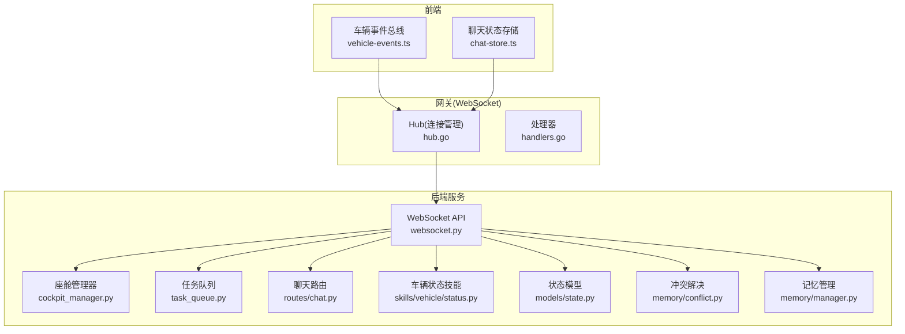
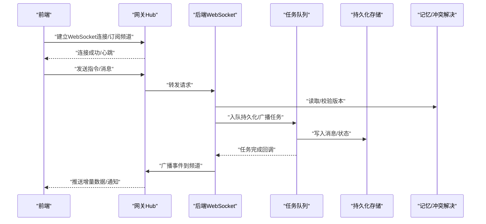
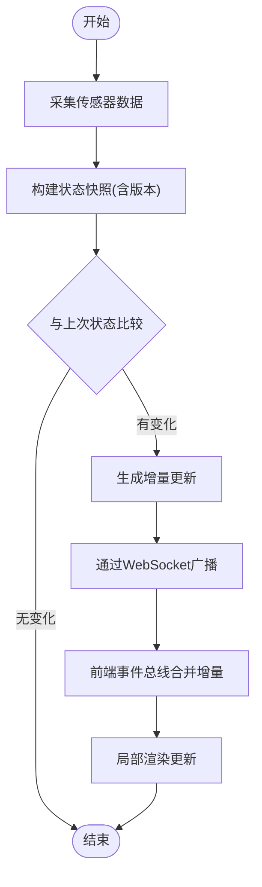
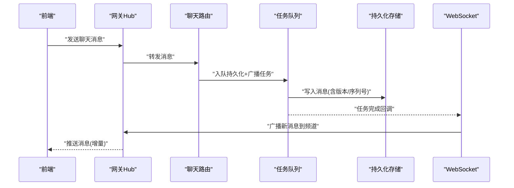
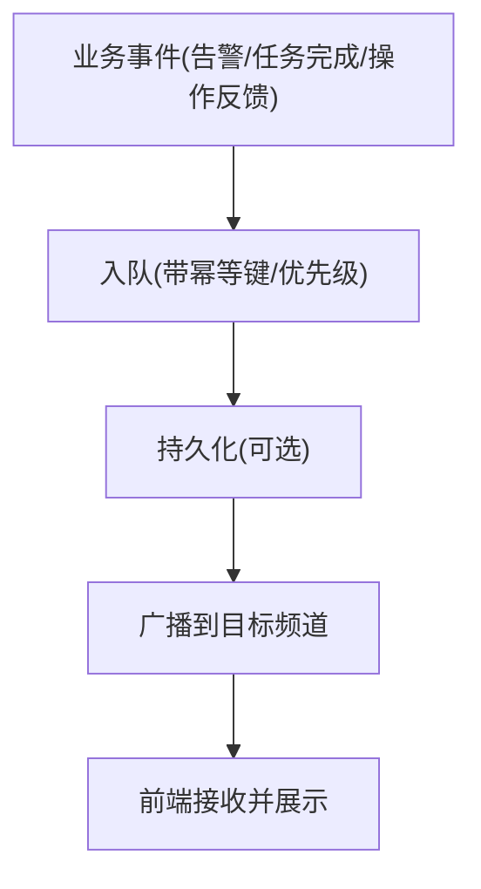
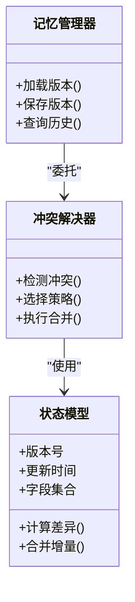
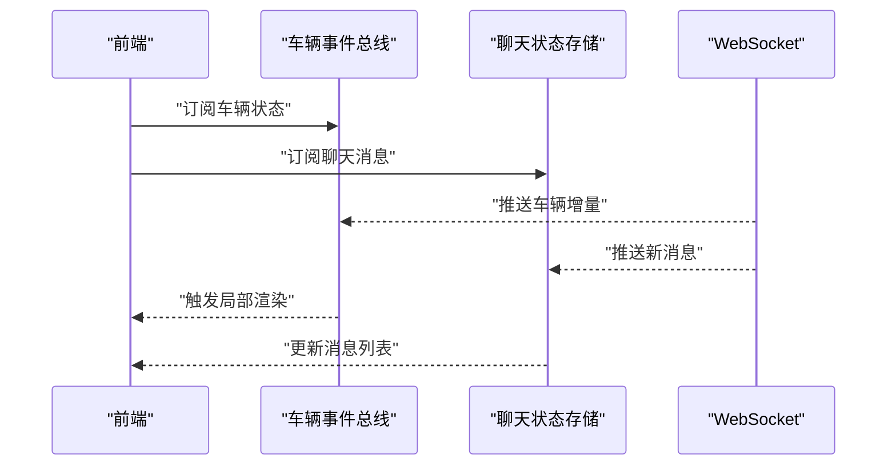
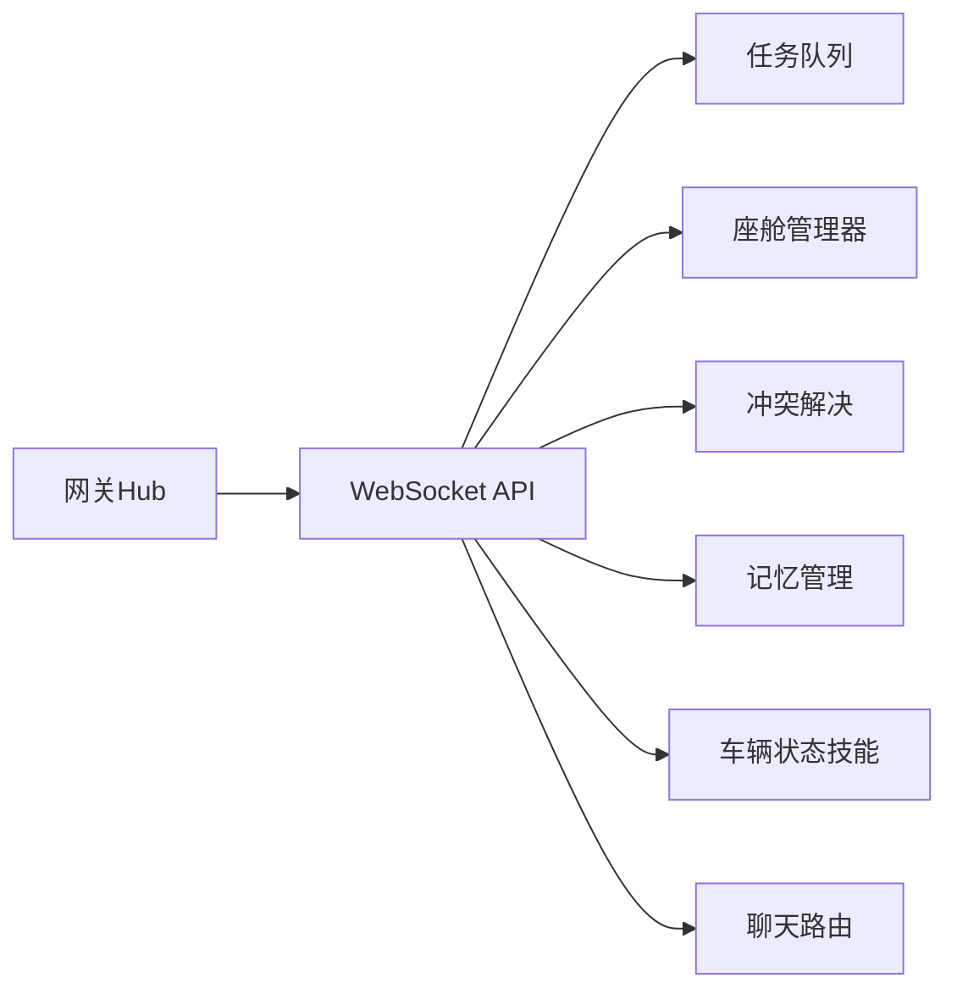

# 实时数据同步

<cite>
**本文引用的文件**   
- [backend_design/nexus/api/websocket.py](file://backend_design/nexus/api/websocket.py)
- [backend_design/nexus/core/cockpit_manager.py](file://backend_design/nexus/core/cockpit_manager.py)
- [backend_design/nexus/middleware/task_queue.py](file://backend_design/nexus/middleware/task_queue.py)
- [backend_design/nexus/memory/conflict.py](file://backend_design/nexus/memory/conflict.py)
- [backend_design/nexus/memory/manager.py](file://backend_design/nexus/memory/manager.py)
- [backend_design/nexus/skills/vehicle/status.py](file://backend_design/nexus/skills/vehicle/status.py)
- [backend_design/nexus/models/state.py](file://backend_design/nexus/models/state.py)
- [backend_design/nexus/api/routes/chat.py](file://backend_design/nexus/api/routes/chat.py)
- [backend_design/nexus_gate/internal/ws/hub.go](file://backend_design/nexus_gate/internal/ws/hub.go)
- [backend_design/nexus_gate/internal/handlers/handlers.go](file://backend_design/nexus_gate/internal/handlers/handlers.go)
- [frontend_design/src/lib/vehicle-events.ts](file://frontend_design/src/lib/vehicle-events.ts)
- [frontend_design/src/stores/chat-store.ts](file://frontend_design/src/stores/chat-store.ts)
</cite>

## 目录
1. [简介](#简介)
2. [项目结构](#项目结构)
3. [核心组件](#核心组件)
4. [架构总览](#架构总览)
5. [详细组件分析](#详细组件分析)
6. [依赖分析](#依赖分析)
7. [性能考虑](#性能考虑)
8. [故障排查指南](#故障排查指南)
9. [结论](#结论)
10. [附录](#附录)

## 简介
本文件聚焦NexusCockpit系统的“实时数据同步”能力，覆盖以下关键主题：
- 车辆状态数据的实时更新机制：传感器数据采集、状态变更检测与前端界面同步。
- 聊天消息的实时推送实现：消息队列处理、消息持久化与多客户端同步。
- 系统通知推送机制：告警信息、任务完成通知与用户操作反馈。
- 数据冲突解决策略：版本控制、合并算法与一致性保证。
- 性能优化技巧：增量更新、批量处理与缓存策略。

## 项目结构
与实时数据同步相关的后端与前端模块分布如下：
- 后端（Python）
  - WebSocket 接入与广播：backend_design/nexus/api/websocket.py
  - 座舱管理器（会话/连接管理）：backend_design/nexus/core/cockpit_manager.py
  - 异步任务队列（用于消息持久化与广播调度）：backend_design/nexus/middleware/task_queue.py
  - 记忆与冲突解决：backend_design/nexus/memory/conflict.py, backend_design/nexus/memory/manager.py
  - 车辆技能（状态采集/上报）：backend_design/nexus/skills/vehicle/status.py
  - 状态模型定义：backend_design/nexus/models/state.py
  - 聊天路由（消息写入/读取）：backend_design/nexus/api/routes/chat.py
- 网关（Go）
  - WebSocket Hub（连接管理与扇出）：backend_design/nexus_gate/internal/ws/hub.go
  - 通用处理器（鉴权/转发等）：backend_design/nexus_gate/internal/handlers/handlers.go
- 前端（Next.js）
  - 车辆事件总线（订阅/发布）：frontend_design/src/lib/vehicle-events.ts
  - 聊天状态存储（消息列表/发送）：frontend_design/src/stores/chat-store.ts

图表来源
- [backend_design/nexus/api/websocket.py](file://backend_design/nexus/api/websocket.py)
- [backend_design/nexus/core/cockpit_manager.py](file://backend_design/nexus/core/cockpit_manager.py)
- [backend_design/nexus/middleware/task_queue.py](file://backend_design/nexus/middleware/task_queue.py)
- [backend_design/nexus/memory/conflict.py](file://backend_design/nexus/memory/conflict.py)
- [backend_design/nexus/memory/manager.py](file://backend_design/nexus/memory/manager.py)
- [backend_design/nexus/skills/vehicle/status.py](file://backend_design/nexus/skills/vehicle/status.py)
- [backend_design/nexus/models/state.py](file://backend_design/nexus/models/state.py)
- [backend_design/nexus/api/routes/chat.py](file://backend_design/nexus/api/routes/chat.py)
- [backend_design/nexus_gate/internal/ws/hub.go](file://backend_design/nexus_gate/internal/ws/hub.go)
- [backend_design/nexus_gate/internal/handlers/handlers.go](file://backend_design/nexus_gate/internal/handlers/handlers.go)
- [frontend_design/src/lib/vehicle-events.ts](file://frontend_design/src/lib/vehicle-events.ts)
- [frontend_design/src/stores/chat-store.ts](file://frontend_design/src/stores/chat-store.ts)

章节来源
- [backend_design/nexus/api/websocket.py](file://backend_design/nexus/api/websocket.py)
- [backend_design/nexus/core/cockpit_manager.py](file://backend_design/nexus/core/cockpit_manager.py)
- [backend_design/nexus/middleware/task_queue.py](file://backend_design/nexus/middleware/task_queue.py)
- [backend_design/nexus/memory/conflict.py](file://backend_design/nexus/memory/conflict.py)
- [backend_design/nexus/memory/manager.py](file://backend_design/nexus/memory/manager.py)
- [backend_design/nexus/skills/vehicle/status.py](file://backend_design/nexus/skills/vehicle/status.py)
- [backend_design/nexus/models/state.py](file://backend_design/nexus/models/state.py)
- [backend_design/nexus/api/routes/chat.py](file://backend_design/nexus/api/routes/chat.py)
- [backend_design/nexus_gate/internal/ws/hub.go](file://backend_design/nexus_gate/internal/ws/hub.go)
- [backend_design/nexus_gate/internal/handlers/handlers.go](file://backend_design/nexus_gate/internal/handlers/handlers.go)
- [frontend_design/src/lib/vehicle-events.ts](file://frontend_design/src/lib/vehicle-events.ts)
- [frontend_design/src/stores/chat-store.ts](file://frontend_design/src/stores/chat-store.ts)

## 核心组件
- WebSocket 接入层
  - 负责建立/维护客户端连接、鉴权、房间/频道订阅与广播分发。
  - 与网关Hub协作，将后端事件推送到所有相关客户端。
- 座舱管理器
  - 管理会话上下文、连接生命周期、权限与资源隔离。
- 任务队列
  - 解耦耗时操作（如消息持久化、跨服务调用），保障高吞吐与可恢复性。
- 记忆与冲突解决
  - 提供版本化数据模型与冲突检测/合并策略，确保最终一致性。
- 车辆状态技能
  - 周期性或事件驱动地采集车辆传感器数据，计算差异并触发增量更新。
- 聊天路由
  - 接收/返回聊天消息，结合任务队列进行持久化与广播。
- 状态模型
  - 定义统一的数据结构与版本字段，支撑增量对比与合并。
- 前端事件总线与状态存储
  - 封装WebSocket事件订阅、去抖/节流、本地状态更新与UI渲染。

章节来源
- [backend_design/nexus/api/websocket.py](file://backend_design/nexus/api/websocket.py)
- [backend_design/nexus/core/cockpit_manager.py](file://backend_design/nexus/core/cockpit_manager.py)
- [backend_design/nexus/middleware/task_queue.py](file://backend_design/nexus/middleware/task_queue.py)
- [backend_design/nexus/memory/conflict.py](file://backend_design/nexus/memory/conflict.py)
- [backend_design/nexus/memory/manager.py](file://backend_design/nexus/memory/manager.py)
- [backend_design/nexus/skills/vehicle/status.py](file://backend_design/nexus/skills/vehicle/status.py)
- [backend_design/nexus/models/state.py](file://backend_design/nexus/models/state.py)
- [backend_design/nexus/api/routes/chat.py](file://backend_design/nexus/api/routes/chat.py)
- [frontend_design/src/lib/vehicle-events.ts](file://frontend_design/src/lib/vehicle-events.ts)
- [frontend_design/src/stores/chat-store.ts](file://frontend_design/src/stores/chat-store.ts)

## 架构总览
整体采用“网关Hub + 后端WS + 任务队列 + 记忆/冲突解决 + 前端事件总线”的分层架构：
- 前端通过网关Hub建立长连接，订阅频道。
- 后端WS接收指令与事件，协调业务逻辑与持久化。
- 任务队列承载异步工作，避免阻塞主循环。
- 记忆与冲突解决模块保障多端一致性与幂等。
- 前端事件总线对高频数据进行聚合与增量渲染。

图表来源
- [backend_design/nexus_gate/internal/ws/hub.go](file://backend_design/nexus_gate/internal/ws/hub.go)
- [backend_design/nexus/api/websocket.py](file://backend_design/nexus/api/websocket.py)
- [backend_design/nexus/middleware/task_queue.py](file://backend_design/nexus/middleware/task_queue.py)
- [backend_design/nexus/memory/conflict.py](file://backend_design/nexus/memory/conflict.py)
- [backend_design/nexus/memory/manager.py](file://backend_design/nexus/memory/manager.py)

## 详细组件分析

### 车辆状态实时同步
- 数据采集
  - 由车辆状态技能按周期或事件触发采集传感器数据，生成带时间戳与版本的状态快照。
- 变更检测
  - 基于状态模型中的版本字段与关键字段对比，仅输出差异（增量）。
- 推送与前端同步
  - 后端通过WebSocket广播增量；前端事件总线接收后合并至本地状态，触发UI局部刷新。

图表来源
- [backend_design/nexus/skills/vehicle/status.py](file://backend_design/nexus/skills/vehicle/status.py)
- [backend_design/nexus/models/state.py](file://backend_design/nexus/models/state.py)
- [backend_design/nexus/api/websocket.py](file://backend_design/nexus/api/websocket.py)
- [frontend_design/src/lib/vehicle-events.ts](file://frontend_design/src/lib/vehicle-events.ts)

章节来源
- [backend_design/nexus/skills/vehicle/status.py](file://backend_design/nexus/skills/vehicle/status.py)
- [backend_design/nexus/models/state.py](file://backend_design/nexus/models/state.py)
- [backend_design/nexus/api/websocket.py](file://backend_design/nexus/api/websocket.py)
- [frontend_design/src/lib/vehicle-events.ts](file://frontend_design/src/lib/vehicle-events.ts)

### 聊天消息实时推送
- 消息入队
  - 聊天路由接收消息后，将持久化与广播任务入队，避免阻塞请求链路。
- 持久化
  - 任务消费者将消息落库，并记录版本/序列号以支持重放与去重。
- 多客户端同步
  - 任务完成后，后端向对应频道广播新消息；网关Hub扇出至所有订阅客户端。

图表来源
- [backend_design/nexus/api/routes/chat.py](file://backend_design/nexus/api/routes/chat.py)
- [backend_design/nexus/middleware/task_queue.py](file://backend_design/nexus/middleware/task_queue.py)
- [backend_design/nexus/api/websocket.py](file://backend_design/nexus/api/websocket.py)
- [backend_design/nexus_gate/internal/ws/hub.go](file://backend_design/nexus_gate/internal/ws/hub.go)

章节来源
- [backend_design/nexus/api/routes/chat.py](file://backend_design/nexus/api/routes/chat.py)
- [backend_design/nexus/middleware/task_queue.py](file://backend_design/nexus/middleware/task_queue.py)
- [backend_design/nexus/api/websocket.py](file://backend_design/nexus/api/websocket.py)
- [backend_design/nexus_gate/internal/ws/hub.go](file://backend_design/nexus_gate/internal/ws/hub.go)
- [frontend_design/src/stores/chat-store.ts](file://frontend_design/src/stores/chat-store.ts)

### 系统通知推送机制
- 通知类型
  - 告警信息、任务完成通知、用户操作反馈。
- 推送流程
  - 业务侧产生通知事件 -> 入队 -> 持久化（可选）-> 广播到目标频道 -> 前端展示。
- 可靠性
  - 借助任务队列重试与幂等键，确保不丢不漏；前端根据版本/序列号去重。

图表来源
- [backend_design/nexus/middleware/task_queue.py](file://backend_design/nexus/middleware/task_queue.py)
- [backend_design/nexus/api/websocket.py](file://backend_design/nexus/api/websocket.py)
- [backend_design/nexus_gate/internal/ws/hub.go](file://backend_design/nexus_gate/internal/ws/hub.go)

章节来源
- [backend_design/nexus/middleware/task_queue.py](file://backend_design/nexus/middleware/task_queue.py)
- [backend_design/nexus/api/websocket.py](file://backend_design/nexus/api/websocket.py)
- [backend_design/nexus_gate/internal/ws/hub.go](file://backend_design/nexus_gate/internal/ws/hub.go)

### 数据冲突解决策略
- 版本控制
  - 所有可写实体携带版本字段；写入前校验版本，防止覆盖最新值。
- 合并算法
  - 针对复杂对象，采用字段级合并策略：新增/更新字段，删除标记字段；数组采用追加/替换策略。
- 一致性保证
  - 通过幂等键与序列号，确保重复消息不会产生副作用；失败重试时具备幂等性。

图表来源
- [backend_design/nexus/models/state.py](file://backend_design/nexus/models/state.py)
- [backend_design/nexus/memory/conflict.py](file://backend_design/nexus/memory/conflict.py)
- [backend_design/nexus/memory/manager.py](file://backend_design/nexus/memory/manager.py)

章节来源
- [backend_design/nexus/models/state.py](file://backend_design/nexus/models/state.py)
- [backend_design/nexus/memory/conflict.py](file://backend_design/nexus/memory/conflict.py)
- [backend_design/nexus/memory/manager.py](file://backend_design/nexus/memory/manager.py)

### 前端实时同步与渲染
- 事件总线
  - 封装WebSocket事件订阅、错误重连、心跳保活与事件分发。
- 增量更新
  - 对高频数据（如车辆状态）采用增量合并，减少重绘范围。
- 聊天状态
  - 维护消息列表、已读状态与发送进度，结合去重与排序保证显示正确性。

图表来源
- [frontend_design/src/lib/vehicle-events.ts](file://frontend_design/src/lib/vehicle-events.ts)
- [frontend_design/src/stores/chat-store.ts](file://frontend_design/src/stores/chat-store.ts)
- [backend_design/nexus/api/websocket.py](file://backend_design/nexus/api/websocket.py)

章节来源
- [frontend_design/src/lib/vehicle-events.ts](file://frontend_design/src/lib/vehicle-events.ts)
- [frontend_design/src/stores/chat-store.ts](file://frontend_design/src/stores/chat-store.ts)
- [backend_design/nexus/api/websocket.py](file://backend_design/nexus/api/websocket.py)

## 依赖分析
- 组件耦合
  - WebSocket层依赖任务队列与记忆/冲突解决模块；网关Hub仅关注连接与扇出。
- 外部依赖
  - 持久化存储（数据库/消息存储）、可能的缓存层（Redis）用于热点数据与限流。
- 潜在环依赖
  - 通过任务队列与事件通道解耦，避免直接循环调用。

图表来源
- [backend_design/nexus/api/websocket.py](file://backend_design/nexus/api/websocket.py)
- [backend_design/nexus/middleware/task_queue.py](file://backend_design/nexus/middleware/task_queue.py)
- [backend_design/nexus/core/cockpit_manager.py](file://backend_design/nexus/core/cockpit_manager.py)
- [backend_design/nexus/memory/conflict.py](file://backend_design/nexus/memory/conflict.py)
- [backend_design/nexus/memory/manager.py](file://backend_design/nexus/memory/manager.py)
- [backend_design/nexus/skills/vehicle/status.py](file://backend_design/nexus/skills/vehicle/status.py)
- [backend_design/nexus/api/routes/chat.py](file://backend_design/nexus/api/routes/chat.py)
- [backend_design/nexus_gate/internal/ws/hub.go](file://backend_design/nexus_gate/internal/ws/hub.go)

章节来源
- [backend_design/nexus/api/websocket.py](file://backend_design/nexus/api/websocket.py)
- [backend_design/nexus/middleware/task_queue.py](file://backend_design/nexus/middleware/task_queue.py)
- [backend_design/nexus/core/cockpit_manager.py](file://backend_design/nexus/core/cockpit_manager.py)
- [backend_design/nexus/memory/conflict.py](file://backend_design/nexus/memory/conflict.py)
- [backend_design/nexus/memory/manager.py](file://backend_design/nexus/memory/manager.py)
- [backend_design/nexus/skills/vehicle/status.py](file://backend_design/nexus/skills/vehicle/status.py)
- [backend_design/nexus/api/routes/chat.py](file://backend_design/nexus/api/routes/chat.py)
- [backend_design/nexus_gate/internal/ws/hub.go](file://backend_design/nexus_gate/internal/ws/hub.go)

## 性能考虑
- 增量更新
  - 仅在存在差异时推送增量，减少带宽与前端渲染压力。
- 批量处理
  - 对高频小消息进行窗口聚合，降低广播频率与数据库写入次数。
- 缓存策略
  - 热点状态（如车辆概览）在内存/缓存中保留最近快照，缩短响应路径。
- 背压与限流
  - 在任务队列与WebSocket层实施限流与背压，防止雪崩。
- 前端优化
  - 去抖/节流、虚拟滚动、局部更新与事件合并，提升交互流畅度。

[本节为通用指导，无需特定文件引用]

## 故障排查指南
- 常见问题
  - 连接断开与重连：检查网关心跳与前端重连策略。
  - 消息丢失：核对任务队列重试与幂等键，确认持久化是否成功。
  - 状态不一致：比对版本字段与序列号，定位冲突点。
  - 前端渲染异常：验证增量合并逻辑与事件去重。
- 建议日志与指标
  - 记录连接建立/断开、消息入队/消费、持久化结果与广播延迟。
  - 监控队列积压、错误率与端到端延迟。

章节来源
- [backend_design/nexus/middleware/task_queue.py](file://backend_design/nexus/middleware/task_queue.py)
- [backend_design/nexus/api/websocket.py](file://backend_design/nexus/api/websocket.py)
- [backend_design/nexus_gate/internal/ws/hub.go](file://backend_design/nexus_gate/internal/ws/hub.go)
- [backend_design/nexus/memory/conflict.py](file://backend_design/nexus/memory/conflict.py)

## 结论
本方案通过“网关Hub + 后端WS + 任务队列 + 记忆/冲突解决 + 前端事件总线”的协同，实现了车辆状态、聊天消息与系统通知的高效、可靠与一致的实时同步。配合增量更新、批量处理与缓存策略，可在高并发场景下保持低延迟与高吞吐。

[本节为总结性内容，无需特定文件引用]

## 附录
- 术语
  - 增量更新：仅传输变化的数据片段。
  - 幂等键：确保重复处理不会产生副作用的唯一标识。
  - 扇出：将一条消息广播给多个订阅者。
- 最佳实践
  - 始终携带版本/序列号；对高频数据做窗口聚合；为关键路径设置超时与重试上限；在前端做去重与防抖。

[本节为补充说明，无需特定文件引用]