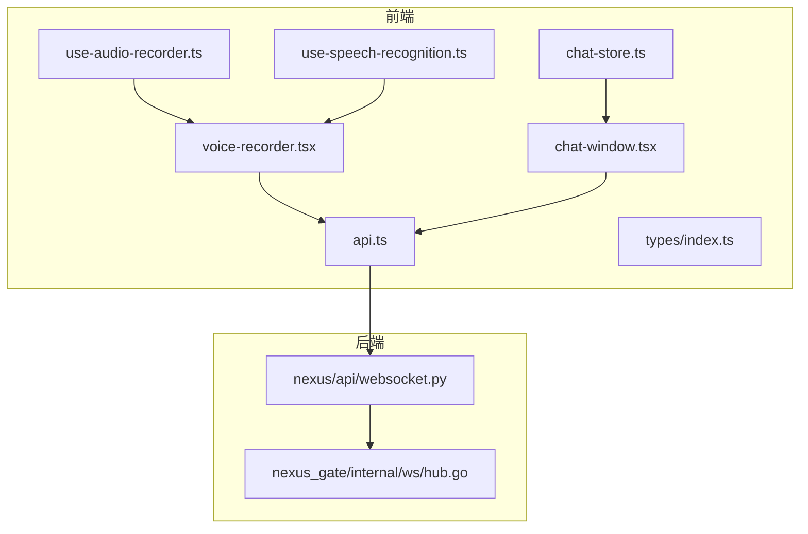
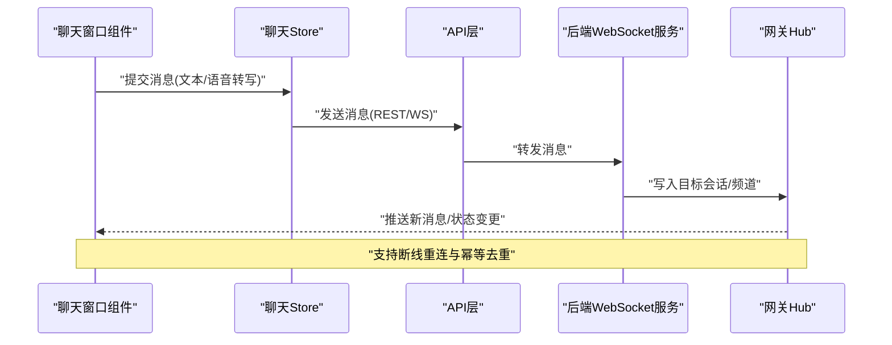
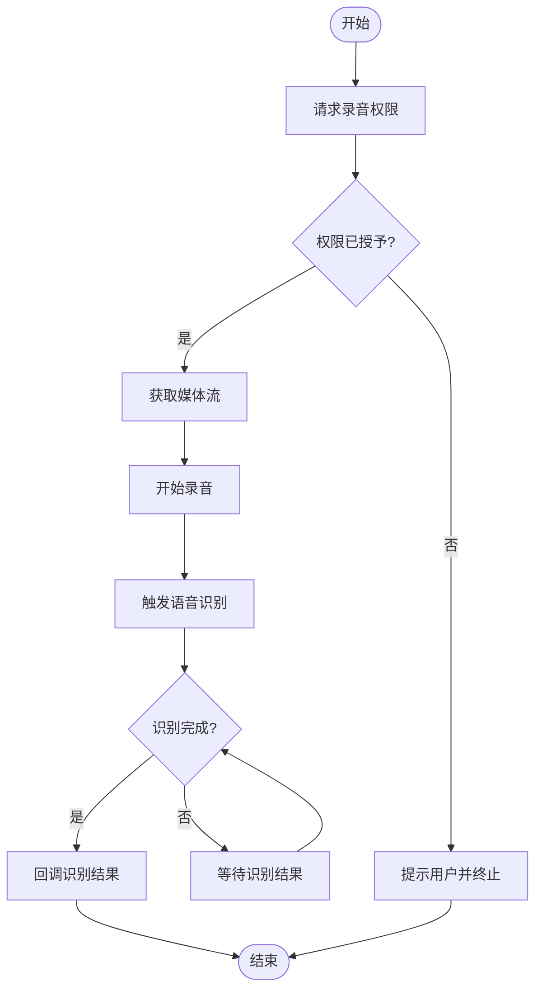
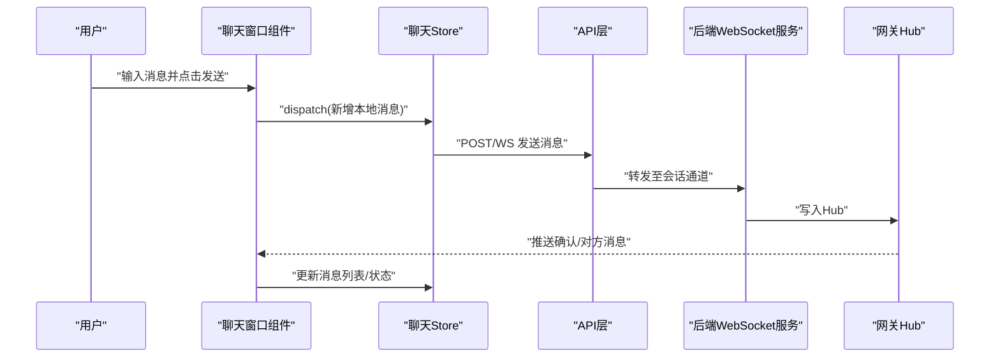
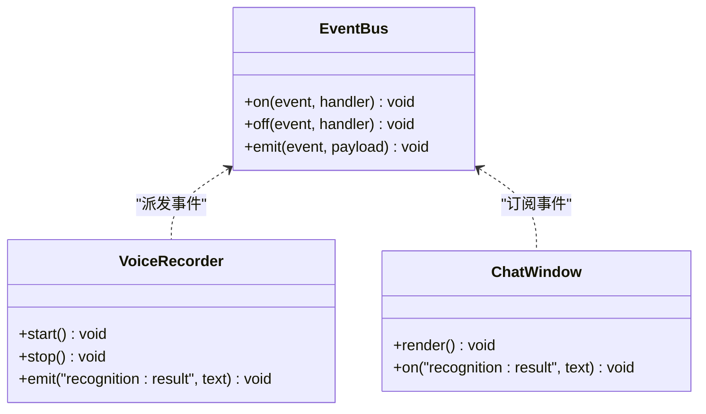
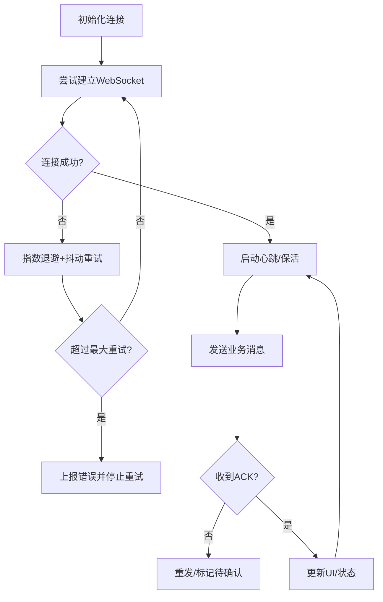
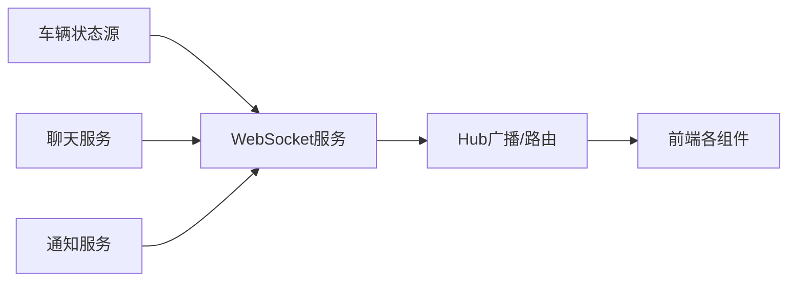
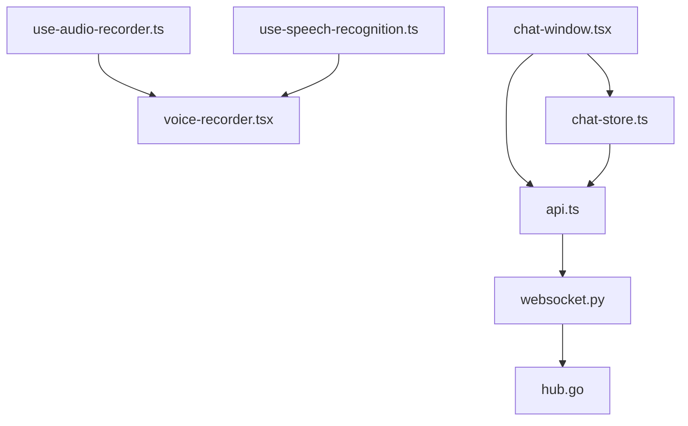

# 实时通信实现

<cite>
**本文引用的文件**   
- [frontend_design/src/hooks/use-audio-recorder.ts](file://frontend_design/src/hooks/use-audio-recorder.ts)
- [frontend_design/src/hooks/use-speech-recognition.ts](file://frontend_design/src/hooks/use-speech-recognition.ts)
- [frontend_design/src/components/voice-recorder.tsx](file://frontend_design/src/components/voice-recorder.tsx)
- [frontend_design/src/lib/api.ts](file://frontend_design/src/lib/api.ts)
- [frontend_design/src/stores/chat-store.ts](file://frontend_design/src/stores/chat-store.ts)
- [frontend_design/src/components/chat/chat-window.tsx](file://frontend_design/src/components/chat/chat-window.tsx)
- [frontend_design/src/types/index.ts](file://frontend_design/src/types/index.ts)
- [backend_design/nexus/api/websocket.py](file://backend_design/nexus/api/websocket.py)
- [backend_design/nexus_gate/internal/ws/hub.go](file://backend_design/nexus_gate/internal/ws/hub.go)
</cite>

## 目录
1. [简介](#简介)
2. [项目结构](#项目结构)
3. [核心组件](#核心组件)
4. [架构总览](#架构总览)
5. [详细组件分析](#详细组件分析)
6. [依赖分析](#依赖分析)
7. [性能考虑](#性能考虑)
8. [故障排查指南](#故障排查指南)
9. [结论](#结论)
10. [附录](#附录)

## 简介
本文件面向 NexusCockpit 前端应用，系统性梳理并说明“实时通信”的端到端实现与最佳实践。内容覆盖：
- WebSocket 连接管理（建立、消息收发、错误处理、重连策略）
- 实时数据同步（车辆状态更新、聊天消息推送、系统通知等场景）
- 语音识别的前端实现（录音权限、音频流处理、识别结果回调）
- 事件驱动开发模式（自定义事件定义、监听与处理）
- 性能优化建议与故障排查方法
- API 调用示例与集成指南

## 项目结构
前端侧与实时通信相关的代码主要分布在 hooks、stores、components 与 lib 目录；后端侧提供 WebSocket 网关与业务路由。下图给出与实时通信相关的关键文件关系概览。

图表来源
- [frontend_design/src/hooks/use-audio-recorder.ts](file://frontend_design/src/hooks/use-audio-recorder.ts)
- [frontend_design/src/hooks/use-speech-recognition.ts](file://frontend_design/src/hooks/use-speech-recognition.ts)
- [frontend_design/src/components/voice-recorder.tsx](file://frontend_design/src/components/voice-recorder.tsx)
- [frontend_design/src/stores/chat-store.ts](file://frontend_design/src/stores/chat-store.ts)
- [frontend_design/src/components/chat/chat-window.tsx](file://frontend_design/src/components/chat/chat-window.tsx)
- [frontend_design/src/lib/api.ts](file://frontend_design/src/lib/api.ts)
- [frontend_design/src/types/index.ts](file://frontend_design/src/types/index.ts)
- [backend_design/nexus/api/websocket.py](file://backend_design/nexus/api/websocket.py)
- [backend_design/nexus_gate/internal/ws/hub.go](file://backend_design/nexus_gate/internal/ws/hub.go)

章节来源
- [frontend_design/src/hooks/use-audio-recorder.ts](file://frontend_design/src/hooks/use-audio-recorder.ts)
- [frontend_design/src/hooks/use-speech-recognition.ts](file://frontend_design/src/hooks/use-speech-recognition.ts)
- [frontend_design/src/components/voice-recorder.tsx](file://frontend_design/src/components/voice-recorder.tsx)
- [frontend_design/src/stores/chat-store.ts](file://frontend_design/src/stores/chat-store.ts)
- [frontend_design/src/components/chat/chat-window.tsx](file://frontend_design/src/components/chat/chat-window.tsx)
- [frontend_design/src/lib/api.ts](file://frontend_design/src/lib/api.ts)
- [frontend_design/src/types/index.ts](file://frontend_design/src/types/index.ts)
- [backend_design/nexus/api/websocket.py](file://backend_design/nexus/api/websocket.py)
- [backend_design/nexus_gate/internal/ws/hub.go](file://backend_design/nexus_gate/internal/ws/hub.go)

## 核心组件
本节聚焦与实时通信直接相关的前端能力与职责边界：
- 音频采集与语音识别 Hook：封装浏览器媒体设备访问、录音控制、转写回调
- 语音录制组件：将录音与识别结果暴露给页面使用
- 聊天 Store：集中管理聊天会话状态与消息列表
- 聊天窗口组件：负责渲染消息、触发发送与接收展示
- API 层：统一封装 HTTP/WebSocket 请求入口与类型定义

章节来源
- [frontend_design/src/hooks/use-audio-recorder.ts](file://frontend_design/src/hooks/use-audio-recorder.ts)
- [frontend_design/src/hooks/use-speech-recognition.ts](file://frontend_design/src/hooks/use-speech-recognition.ts)
- [frontend_design/src/components/voice-recorder.tsx](file://frontend_design/src/components/voice-recorder.tsx)
- [frontend_design/src/stores/chat-store.ts](file://frontend_design/src/stores/chat-store.ts)
- [frontend_design/src/components/chat/chat-window.tsx](file://frontend_design/src/components/chat/chat-window.tsx)
- [frontend_design/src/lib/api.ts](file://frontend_design/src/lib/api.ts)
- [frontend_design/src/types/index.ts](file://frontend_design/src/types/index.ts)

## 架构总览
NexusCockpit 的实时通信由“前端组件/Hook/Store + 后端 WebSocket 服务 + 网关 Hub”组成。前端通过 API 层发起连接或发送消息，后端根据业务路由进行转发或广播，Hub 负责多客户端的连接管理与消息分发。

图表来源
- [frontend_design/src/components/chat/chat-window.tsx](file://frontend_design/src/components/chat/chat-window.tsx)
- [frontend_design/src/stores/chat-store.ts](file://frontend_design/src/stores/chat-store.ts)
- [frontend_design/src/lib/api.ts](file://frontend_design/src/lib/api.ts)
- [backend_design/nexus/api/websocket.py](file://backend_design/nexus/api/websocket.py)
- [backend_design/nexus_gate/internal/ws/hub.go](file://backend_design/nexus_gate/internal/ws/hub.go)

## 详细组件分析

### 语音识别与录音流程
该流程涵盖从用户授权到录音、转写、结果回传的完整链路。

图表来源
- [frontend_design/src/hooks/use-audio-recorder.ts](file://frontend_design/src/hooks/use-audio-recorder.ts)
- [frontend_design/src/hooks/use-speech-recognition.ts](file://frontend_design/src/hooks/use-speech-recognition.ts)
- [frontend_design/src/components/voice-recorder.tsx](file://frontend_design/src/components/voice-recorder.tsx)

章节来源
- [frontend_design/src/hooks/use-audio-recorder.ts](file://frontend_design/src/hooks/use-audio-recorder.ts)
- [frontend_design/src/hooks/use-speech-recognition.ts](file://frontend_design/src/hooks/use-speech-recognition.ts)
- [frontend_design/src/components/voice-recorder.tsx](file://frontend_design/src/components/voice-recorder.tsx)

### 聊天消息发送与接收
聊天功能通过 Store 聚合状态，组件负责交互，API 层负责网络传输，后端通过 WebSocket 推送消息。

图表来源
- [frontend_design/src/components/chat/chat-window.tsx](file://frontend_design/src/components/chat/chat-window.tsx)
- [frontend_design/src/stores/chat-store.ts](file://frontend_design/src/stores/chat-store.ts)
- [frontend_design/src/lib/api.ts](file://frontend_design/src/lib/api.ts)
- [backend_design/nexus/api/websocket.py](file://backend_design/nexus/api/websocket.py)
- [backend_design/nexus_gate/internal/ws/hub.go](file://backend_design/nexus_gate/internal/ws/hub.go)

章节来源
- [frontend_design/src/components/chat/chat-window.tsx](file://frontend_design/src/components/chat/chat-window.tsx)
- [frontend_design/src/stores/chat-store.ts](file://frontend_design/src/stores/chat-store.ts)
- [frontend_design/src/lib/api.ts](file://frontend_design/src/lib/api.ts)
- [backend_design/nexus/api/websocket.py](file://backend_design/nexus/api/websocket.py)
- [backend_design/nexus_gate/internal/ws/hub.go](file://backend_design/nexus_gate/internal/ws/hub.go)

### 事件驱动开发模式（自定义事件）
为解耦模块间通信，可在前端采用自定义事件总线模式：
- 定义事件名与载荷类型（建议在类型文件中集中声明）
- 在需要触发的位置派发事件
- 在消费方注册监听器，并在卸载时移除监听，避免内存泄漏

图表来源
- [frontend_design/src/types/index.ts](file://frontend_design/src/types/index.ts)
- [frontend_design/src/components/voice-recorder.tsx](file://frontend_design/src/components/voice-recorder.tsx)
- [frontend_design/src/components/chat/chat-window.tsx](file://frontend_design/src/components/chat/chat-window.tsx)

章节来源
- [frontend_design/src/types/index.ts](file://frontend_design/src/types/index.ts)
- [frontend_design/src/components/voice-recorder.tsx](file://frontend_design/src/components/voice-recorder.tsx)
- [frontend_design/src/components/chat/chat-window.tsx](file://frontend_design/src/components/chat/chat-window.tsx)

### WebSocket 连接管理（建立、收发、错误、重连）
- 连接建立：在应用初始化或进入需要实时能力的页面时创建连接，携带鉴权信息（如 Token）
- 消息收发：定义统一的协议格式（包含消息类型、负载、时间戳、序列号等），发送前做必要校验
- 错误处理：捕获网络异常、服务端错误码、心跳超时等，记录日志并触发降级逻辑
- 重连策略：指数退避 + 抖动，限制最大重试次数；连接恢复后按序补发未确认消息

图表来源
- [frontend_design/src/lib/api.ts](file://frontend_design/src/lib/api.ts)
- [backend_design/nexus/api/websocket.py](file://backend_design/nexus/api/websocket.py)
- [backend_design/nexus_gate/internal/ws/hub.go](file://backend_design/nexus_gate/internal/ws/hub.go)

章节来源
- [frontend_design/src/lib/api.ts](file://frontend_design/src/lib/api.ts)
- [backend_design/nexus/api/websocket.py](file://backend_design/nexus/api/websocket.py)
- [backend_design/nexus_gate/internal/ws/hub.go](file://backend_design/nexus_gate/internal/ws/hub.go)

### 实时数据同步（车辆状态、聊天、通知）
- 车辆状态更新：订阅车辆主题，增量更新仪表盘与可视化组件
- 聊天消息推送：基于会话维度的频道，保证顺序与去重
- 系统通知：全局广播或按角色/租户定向推送

图表来源
- [backend_design/nexus/api/websocket.py](file://backend_design/nexus/api/websocket.py)
- [backend_design/nexus_gate/internal/ws/hub.go](file://backend_design/nexus_gate/internal/ws/hub.go)
- [frontend_design/src/stores/chat-store.ts](file://frontend_design/src/stores/chat-store.ts)
- [frontend_design/src/components/chat/chat-window.tsx](file://frontend_design/src/components/chat/chat-window.tsx)

章节来源
- [backend_design/nexus/api/websocket.py](file://backend_design/nexus/api/websocket.py)
- [backend_design/nexus_gate/internal/ws/hub.go](file://backend_design/nexus_gate/internal/ws/hub.go)
- [frontend_design/src/stores/chat-store.ts](file://frontend_design/src/stores/chat-store.ts)
- [frontend_design/src/components/chat/chat-window.tsx](file://frontend_design/src/components/chat/chat-window.tsx)

## 依赖分析
- 前端内部依赖
  - 语音识别与录音 Hook 被语音录制组件复用
  - 聊天窗口组件依赖聊天 Store 的状态与动作
  - API 层作为统一网络入口，被多个组件/Store 调用
- 前后端耦合点
  - API 层与后端 WebSocket 服务对接
  - 后端服务通过 Hub 进行多客户端消息分发

图表来源
- [frontend_design/src/hooks/use-audio-recorder.ts](file://frontend_design/src/hooks/use-audio-recorder.ts)
- [frontend_design/src/hooks/use-speech-recognition.ts](file://frontend_design/src/hooks/use-speech-recognition.ts)
- [frontend_design/src/components/voice-recorder.tsx](file://frontend_design/src/components/voice-recorder.tsx)
- [frontend_design/src/components/chat/chat-window.tsx](file://frontend_design/src/components/chat/chat-window.tsx)
- [frontend_design/src/stores/chat-store.ts](file://frontend_design/src/stores/chat-store.ts)
- [frontend_design/src/lib/api.ts](file://frontend_design/src/lib/api.ts)
- [backend_design/nexus/api/websocket.py](file://backend_design/nexus/api/websocket.py)
- [backend_design/nexus_gate/internal/ws/hub.go](file://backend_design/nexus_gate/internal/ws/hub.go)

章节来源
- [frontend_design/src/hooks/use-audio-recorder.ts](file://frontend_design/src/hooks/use-audio-recorder.ts)
- [frontend_design/src/hooks/use-speech-recognition.ts](file://frontend_design/src/hooks/use-speech-recognition.ts)
- [frontend_design/src/components/voice-recorder.tsx](file://frontend_design/src/components/voice-recorder.tsx)
- [frontend_design/src/components/chat/chat-window.tsx](file://frontend_design/src/components/chat/chat-window.tsx)
- [frontend_design/src/stores/chat-store.ts](file://frontend_design/src/stores/chat-store.ts)
- [frontend_design/src/lib/api.ts](file://frontend_design/src/lib/api.ts)
- [backend_design/nexus/api/websocket.py](file://backend_design/nexus/api/websocket.py)
- [backend_design/nexus_gate/internal/ws/hub.go](file://backend_design/nexus_gate/internal/ws/hub.go)

## 性能考虑
- 连接与消息
  - 合并高频小消息，降低帧率与序列化开销
  - 使用二进制或压缩协议（如 MessagePack/Protobuf）减少带宽
  - 对大对象进行分页/增量更新，避免一次性全量刷新
- 渲染与状态
  - 使用不可变数据结构与浅比较，减少不必要的重渲染
  - 虚拟列表/分页加载长列表消息
- 资源与并发
  - 限制并发连接数，复用连接池
  - 合理设置心跳间隔与超时阈值，避免频繁重连风暴
- 容错与降级
  - 离线缓存与队列，网络恢复后批量补发
  - 关键路径失败快速失败，非关键路径延迟重试

[本节为通用指导，不直接分析具体文件]

## 故障排查指南
- 常见问题定位
  - 无法建立连接：检查鉴权参数、跨域配置、防火墙与代理
  - 消息丢失或乱序：核对序列号/时间戳，确认服务端是否按序投递
  - 频繁重连：观察心跳超时、服务端限流与证书问题
  - 语音识别无结果：检查麦克风权限、浏览器兼容性、音频编码格式
- 调试手段
  - 前端：打开控制台日志，记录连接生命周期与消息收发
  - 后端：查看 WebSocket 接入日志、Hub 路由与广播统计
  - 抓包：使用浏览器开发者工具或网络抓包工具验证协议与载荷

章节来源
- [frontend_design/src/lib/api.ts](file://frontend_design/src/lib/api.ts)
- [backend_design/nexus/api/websocket.py](file://backend_design/nexus/api/websocket.py)
- [backend_design/nexus_gate/internal/ws/hub.go](file://backend_design/nexus_gate/internal/ws/hub.go)

## 结论
通过统一的 API 层、清晰的 Store 状态管理与事件驱动模式，NexusCockpit 在前端实现了可扩展的实时通信能力。结合后端 WebSocket 服务与 Hub 的消息分发，可稳定支撑聊天、车辆状态与系统通知等多类实时场景。配合合理的性能优化与完善的排障手段，可进一步提升用户体验与系统可靠性。

[本节为总结性内容，不直接分析具体文件]

## 附录

### API 调用示例与集成指南
- 建立 WebSocket 连接
  - 在应用初始化或进入需要实时能力的页面时，调用 API 层的连接方法，传入鉴权信息
  - 连接成功后注册消息处理器，按消息类型分发到对应 Store 或组件
- 发送聊天消息
  - 在聊天窗口组件中触发发送动作，调用 API 层发送接口
  - 收到服务端确认后更新本地消息状态
- 订阅车辆状态
  - 在仪表盘或车辆面板组件中订阅相应主题，增量更新 UI
- 接收系统通知
  - 在全局通知中心订阅广播消息，展示 Toast 或角标

章节来源
- [frontend_design/src/lib/api.ts](file://frontend_design/src/lib/api.ts)
- [frontend_design/src/components/chat/chat-window.tsx](file://frontend_design/src/components/chat/chat-window.tsx)
- [frontend_design/src/stores/chat-store.ts](file://frontend_design/src/stores/chat-store.ts)
- [backend_design/nexus/api/websocket.py](file://backend_design/nexus/api/websocket.py)
- [backend_design/nexus_gate/internal/ws/hub.go](file://backend_design/nexus_gate/internal/ws/hub.go)