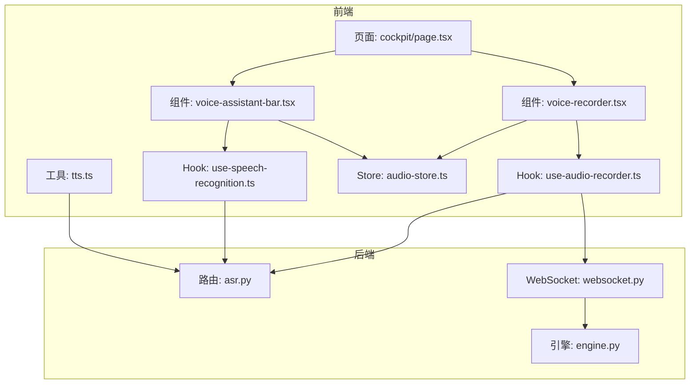
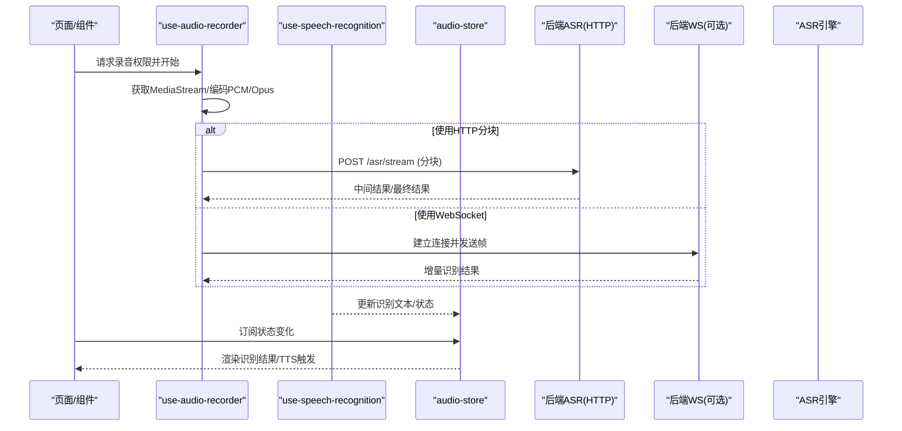
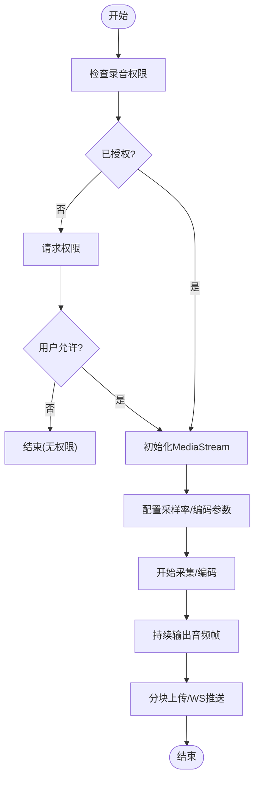
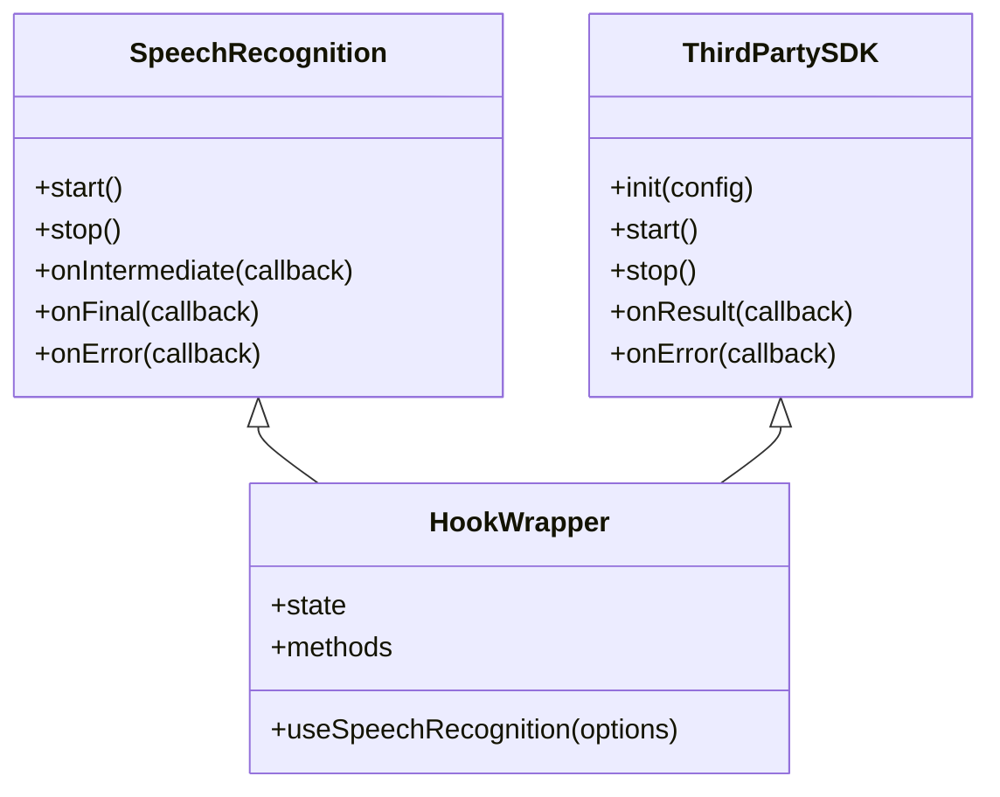
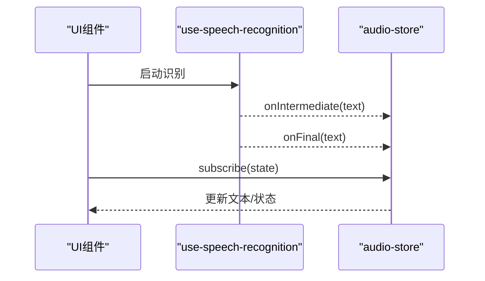
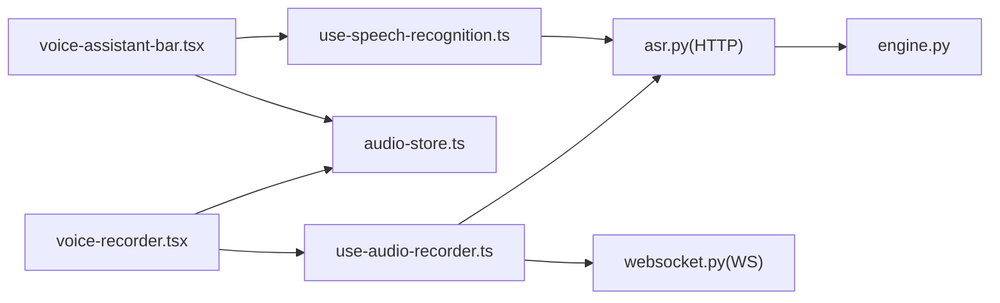

# 语音识别前端实现

<cite>
**本文引用的文件**   
- [frontend_design/src/components/voice-recorder.tsx](file://frontend_design/src/components/voice-recorder.tsx)
- [frontend_design/src/hooks/use-audio-recorder.ts](file://frontend_design/src/hooks/use-audio-recorder.ts)
- [frontend_design/src/hooks/use-speech-recognition.ts](file://frontend_design/src/hooks/use-speech-recognition.ts)
- [frontend_design/src/stores/audio-store.ts](file://frontend_design/src/stores/audio-store.ts)
- [frontend_design/src/lib/tts.ts](file://frontend_design/src/lib/tts.ts)
- [frontend_design/src/app/cockpit/page.tsx](file://frontend_design/src/app/cockpit/page.tsx)
- [frontend_design/src/components/vehicle/voice-assistant-bar.tsx](file://frontend_design/src/components/vehicle/voice-assistant-bar.tsx)
- [backend_design/nexus/api/routes/asr.py](file://backend_design/nexus/api/routes/asr.py)
- [backend_design/nexus/api/websocket.py](file://backend_design/nexus/api/websocket.py)
- [backend_design/nexus/asr/engine.py](file://backend_design/nexus/asr/engine.py)
- [docs/voice/asr-guide.md](file://docs/voice/asr-guide.md)
- [docs/voice/audio-pipeline-guide.md](file://docs/voice/audio-pipeline-guide.md)
</cite>

## 目录
1. [简介](#简介)
2. [项目结构](#项目结构)
3. [核心组件](#核心组件)
4. [架构总览](#架构总览)
5. [详细组件分析](#详细组件分析)
6. [依赖关系分析](#依赖关系分析)
7. [性能考虑](#性能考虑)
8. [故障排查指南](#故障排查指南)
9. [结论](#结论)
10. [附录](#附录)

## 简介
本文件面向NexusCockpit系统的语音识别前端实现，聚焦以下目标：
- 浏览器录音权限管理：请求、授权与状态监听
- 音频流处理：麦克风采集、格式转换与流式传输
- 语音识别集成：Web Speech API使用、第三方SDK集成、识别结果回调
- 音频质量控制：降噪、音量调节、采样率设置
- 跨浏览器兼容性与移动端适配
- 具体API调用示例与故障排查

## 项目结构
前端采用Next.js（App Router）组织页面与组件，语音相关能力集中在hooks、stores与UI组件中；后端提供ASR接口与WebSocket通道。

图表来源
- [frontend_design/src/app/cockpit/page.tsx](file://frontend_design/src/app/cockpit/page.tsx)
- [frontend_design/src/components/voice-recorder.tsx](file://frontend_design/src/components/voice-recorder.tsx)
- [frontend_design/src/components/vehicle/voice-assistant-bar.tsx](file://frontend_design/src/components/vehicle/voice-assistant-bar.tsx)
- [frontend_design/src/hooks/use-audio-recorder.ts](file://frontend_design/src/hooks/use-audio-recorder.ts)
- [frontend_design/src/hooks/use-speech-recognition.ts](file://frontend_design/src/hooks/use-speech-recognition.ts)
- [frontend_design/src/stores/audio-store.ts](file://frontend_design/src/stores/audio-store.ts)
- [frontend_design/src/lib/tts.ts](file://frontend_design/src/lib/tts.ts)
- [backend_design/nexus/api/routes/asr.py](file://backend_design/nexus/api/routes/asr.py)
- [backend_design/nexus/api/websocket.py](file://backend_design/nexus/api/websocket.py)
- [backend_design/nexus/asr/engine.py](file://backend_design/nexus/asr/engine.py)

章节来源
- [frontend_design/src/app/cockpit/page.tsx](file://frontend_design/src/app/cockpit/page.tsx)
- [frontend_design/src/components/voice-recorder.tsx](file://frontend_design/src/components/voice-recorder.tsx)
- [frontend_design/src/components/vehicle/voice-assistant-bar.tsx](file://frontend_design/src/components/vehicle/voice-assistant-bar.tsx)
- [frontend_design/src/hooks/use-audio-recorder.ts](file://frontend_design/src/hooks/use-audio-recorder.ts)
- [frontend_design/src/hooks/use-speech-recognition.ts](file://frontend_design/src/hooks/use-speech-recognition.ts)
- [frontend_design/src/stores/audio-store.ts](file://frontend_design/src/stores/audio-store.ts)
- [frontend_design/src/lib/tts.ts](file://frontend_design/src/lib/tts.ts)
- [backend_design/nexus/api/routes/asr.py](file://backend_design/nexus/api/routes/asr.py)
- [backend_design/nexus/api/websocket.py](file://backend_design/nexus/api/websocket.py)
- [backend_design/nexus/asr/engine.py](file://backend_design/nexus/asr/engine.py)

## 核心组件
- 录音组件与Hook
  - 负责麦克风权限申请、MediaStream获取、PCM/Opus编码与分片上传或WebSocket推送
  - 暴露开始/停止/暂停等控制方法，并向上层组件广播状态
- 语音识别Hook
  - 封装Web Speech API或第三方SDK的初始化、配置、事件回调与错误处理
  - 将识别结果写入全局store供UI消费
- 音频状态Store
  - 集中管理录音状态、识别进度、最终文本、TTS播放状态等
- TTS工具
  - 提供文本转语音播放能力，支持流式或分段播放

章节来源
- [frontend_design/src/hooks/use-audio-recorder.ts](file://frontend_design/src/hooks/use-audio-recorder.ts)
- [frontend_design/src/hooks/use-speech-recognition.ts](file://frontend_design/src/hooks/use-speech-recognition.ts)
- [frontend_design/src/stores/audio-store.ts](file://frontend_design/src/stores/audio-store.ts)
- [frontend_design/src/lib/tts.ts](file://frontend_design/src/lib/tts.ts)

## 架构总览
前端通过MediaRecorder或AudioWorklet采集音频，按策略编码为PCM/Opus后，以HTTP分块或WebSocket流式发送至后端ASR服务；后端进行实时识别并将增量结果回推至前端。同时，前端可结合Web Speech API作为降级方案或增强体验。

图表来源
- [frontend_design/src/hooks/use-audio-recorder.ts](file://frontend_design/src/hooks/use-audio-recorder.ts)
- [frontend_design/src/hooks/use-speech-recognition.ts](file://frontend_design/src/hooks/use-speech-recognition.ts)
- [frontend_design/src/stores/audio-store.ts](file://frontend_design/src/stores/audio-store.ts)
- [backend_design/nexus/api/routes/asr.py](file://backend_design/nexus/api/routes/asr.py)
- [backend_design/nexus/api/websocket.py](file://backend_design/nexus/api/websocket.py)
- [backend_design/nexus/asr/engine.py](file://backend_design/nexus/asr/engine.py)

## 详细组件分析

### 录音权限管理与音频采集
- 权限模型
  - 使用浏览器媒体权限API进行“一次性”授权，用户可选择允许/拒绝/仅本次会话
  - 需捕获用户拒绝后的提示与引导，避免重复弹窗造成干扰
- 采集流程
  - 创建音频上下文与输入节点
  - 选择编码器（PCM/Opus），设定采样率、声道数、比特率
  - 使用MediaRecorder或自定义分片策略进行数据切片
- 关键注意事项
  - 在HTTPS环境下运行，否则无法访问麦克风
  - 移动端需处理后台切换、来电中断等场景
  - 对静音检测与VAD进行阈值配置，减少无效上传

图表来源
- [frontend_design/src/hooks/use-audio-recorder.ts](file://frontend_design/src/hooks/use-audio-recorder.ts)

章节来源
- [frontend_design/src/hooks/use-audio-recorder.ts](file://frontend_design/src/hooks/use-audio-recorder.ts)

### Web Speech API与第三方SDK集成
- Web Speech API
  - 适用于快速集成与离线识别场景，注意不同浏览器的支持差异
  - 通过事件回调获取中间结果与最终结果，并写入Store
- 第三方SDK
  - 若需要更高准确率或特定语言/方言支持，可引入厂商SDK
  - 统一抽象层屏蔽差异，对外暴露一致的start/stop/onResult接口

图表来源
- [frontend_design/src/hooks/use-speech-recognition.ts](file://frontend_design/src/hooks/use-speech-recognition.ts)

章节来源
- [frontend_design/src/hooks/use-speech-recognition.ts](file://frontend_design/src/hooks/use-speech-recognition.ts)

### 识别结果回调与状态管理
- Store职责
  - 维护当前录音状态、识别进度、最终文本、TTS播放状态
  - 提供订阅机制，组件按需消费
- 回调链路
  - 识别Hook将中间/最终结果写入Store
  - UI组件订阅Store变化，驱动界面更新与TTS触发

图表来源
- [frontend_design/src/hooks/use-speech-recognition.ts](file://frontend_design/src/hooks/use-speech-recognition.ts)
- [frontend_design/src/stores/audio-store.ts](file://frontend_design/src/stores/audio-store.ts)

章节来源
- [frontend_design/src/stores/audio-store.ts](file://frontend_design/src/stores/audio-store.ts)

### 音频质量控制
- 降噪与回声消除
  - 利用浏览器内置AEC/ANS/AGC能力，必要时在AudioWorklet中实现轻量降噪
- 音量调节
  - 基于GainNode动态调整增益，避免削波与过弱信号
- 采样率与编码
  - 推荐16kHz单声道用于ASR；根据网络条件选择Opus降低带宽
- VAD与静音切分
  - 基于能量阈值或简单VAD算法，自动切分有效片段，减少无效上传

章节来源
- [frontend_design/src/hooks/use-audio-recorder.ts](file://frontend_design/src/hooks/use-audio-recorder.ts)
- [docs/voice/audio-pipeline-guide.md](file://docs/voice/audio-pipeline-guide.md)

### 跨浏览器兼容性与移动端适配
- 兼容性要点
  - MediaRecorder与Web Speech API在不同浏览器存在差异，需提供降级路径
  - iOS Safari对后台录音限制严格，需在页面可见时保持活跃
- 移动端适配
  - 处理锁屏、来电、通知打断；恢复录音与断线重连
  - 触摸交互优化，避免误触导致意外停止

章节来源
- [frontend_design/src/hooks/use-audio-recorder.ts](file://frontend_design/src/hooks/use-audio-recorder.ts)
- [frontend_design/src/hooks/use-speech-recognition.ts](file://frontend_design/src/hooks/use-speech-recognition.ts)

### 页面与组件集成
- Cockpit页面
  - 集成录音与识别入口，展示识别结果与操作按钮
- 车载语音助手栏
  - 常驻入口，支持一键唤醒、可视化波形与状态反馈

章节来源
- [frontend_design/src/app/cockpit/page.tsx](file://frontend_design/src/app/cockpit/page.tsx)
- [frontend_design/src/components/vehicle/voice-assistant-bar.tsx](file://frontend_design/src/components/vehicle/voice-assistant-bar.tsx)

## 依赖关系分析
- 前端内部依赖
  - 组件依赖Hooks与Store，Hooks之间解耦，通过Store共享状态
- 前后端依赖
  - HTTP分块上传与WebSocket两种模式并存，便于在不同网络条件下选择最优路径
  - 后端ASR路由与引擎分离，便于替换与扩展

图表来源
- [frontend_design/src/components/voice-recorder.tsx](file://frontend_design/src/components/voice-recorder.tsx)
- [frontend_design/src/hooks/use-audio-recorder.ts](file://frontend_design/src/hooks/use-audio-recorder.ts)
- [frontend_design/src/hooks/use-speech-recognition.ts](file://frontend_design/src/hooks/use-speech-recognition.ts)
- [frontend_design/src/stores/audio-store.ts](file://frontend_design/src/stores/audio-store.ts)
- [backend_design/nexus/api/routes/asr.py](file://backend_design/nexus/api/routes/asr.py)
- [backend_design/nexus/api/websocket.py](file://backend_design/nexus/api/websocket.py)
- [backend_design/nexus/asr/engine.py](file://backend_design/nexus/asr/engine.py)

章节来源
- [frontend_design/src/components/voice-recorder.tsx](file://frontend_design/src/components/voice-recorder.tsx)
- [frontend_design/src/hooks/use-audio-recorder.ts](file://frontend_design/src/hooks/use-audio-recorder.ts)
- [frontend_design/src/hooks/use-speech-recognition.ts](file://frontend_design/src/hooks/use-speech-recognition.ts)
- [frontend_design/src/stores/audio-store.ts](file://frontend_design/src/stores/audio-store.ts)
- [backend_design/nexus/api/routes/asr.py](file://backend_design/nexus/api/routes/asr.py)
- [backend_design/nexus/api/websocket.py](file://backend_design/nexus/api/websocket.py)
- [backend_design/nexus/asr/engine.py](file://backend_design/nexus/asr/engine.py)

## 性能考虑
- 编码与带宽
  - 优先使用Opus低延迟编码，合理设置码率与分片大小
- 网络与重试
  - 对HTTP分块失败进行指数退避重试；WebSocket断线自动重连
- 计算开销
  - 降噪与VAD尽量轻量化，避免阻塞主线程；必要时使用WebWorker
- 识别延迟
  - 中间结果尽早回传，提升交互响应性

[本节为通用指导，不直接分析具体文件]

## 故障排查指南
- 常见权限问题
  - 未授予麦克风权限：检查浏览器地址栏权限提示与HTTPS要求
  - 多次拒绝：提供清晰引导与重新授权入口
- 采集异常
  - 无声或断续：检查设备占用、系统音量、浏览器后台限制
  - 高CPU占用：评估降噪复杂度，切换到更轻量的处理或关闭非必要效果
- 识别失败
  - 网络超时：切换HTTP/WS模式，检查服务端健康状态
  - 语言/方言不支持：确认后端配置与前端语言参数一致
- 移动端特有问题
  - 锁屏/来电中断：实现前台保活与恢复逻辑
  - 自动播放限制：由用户手势触发TTS播放

章节来源
- [frontend_design/src/hooks/use-audio-recorder.ts](file://frontend_design/src/hooks/use-audio-recorder.ts)
- [frontend_design/src/hooks/use-speech-recognition.ts](file://frontend_design/src/hooks/use-speech-recognition.ts)
- [docs/voice/asr-guide.md](file://docs/voice/asr-guide.md)

## 结论
本实现通过模块化设计将录音、识别、状态管理与UI解耦，兼顾性能与可维护性。建议在生产环境优先采用WebSocket流式识别以获得更低延迟，并在不支持的环境回退到Web Speech API或HTTP分块上传。同时完善移动端适配与错误恢复策略，确保用户体验稳定可靠。

[本节为总结性内容，不直接分析具体文件]

## 附录

### API调用示例（路径参考）
- 录音与上传
  - 使用录音Hook发起录音并分块上传至ASR接口
  - 参考路径：[use-audio-recorder.ts](file://frontend_design/src/hooks/use-audio-recorder.ts)、[asr.py](file://backend_design/nexus/api/routes/asr.py)
- WebSocket流式识别
  - 建立WS连接并持续推送音频帧，接收增量结果
  - 参考路径：[use-audio-recorder.ts](file://frontend_design/src/hooks/use-audio-recorder.ts)、[websocket.py](file://backend_design/nexus/api/websocket.py)
- Web Speech API识别
  - 初始化识别器并订阅中间/最终结果
  - 参考路径：[use-speech-recognition.ts](file://frontend_design/src/hooks/use-speech-recognition.ts)
- TTS播放
  - 将识别文本转换为语音并播放
  - 参考路径：[tts.ts](file://frontend_design/src/lib/tts.ts)

章节来源
- [frontend_design/src/hooks/use-audio-recorder.ts](file://frontend_design/src/hooks/use-audio-recorder.ts)
- [frontend_design/src/hooks/use-speech-recognition.ts](file://frontend_design/src/hooks/use-speech-recognition.ts)
- [frontend_design/src/lib/tts.ts](file://frontend_design/src/lib/tts.ts)
- [backend_design/nexus/api/routes/asr.py](file://backend_design/nexus/api/routes/asr.py)
- [backend_design/nexus/api/websocket.py](file://backend_design/nexus/api/websocket.py)