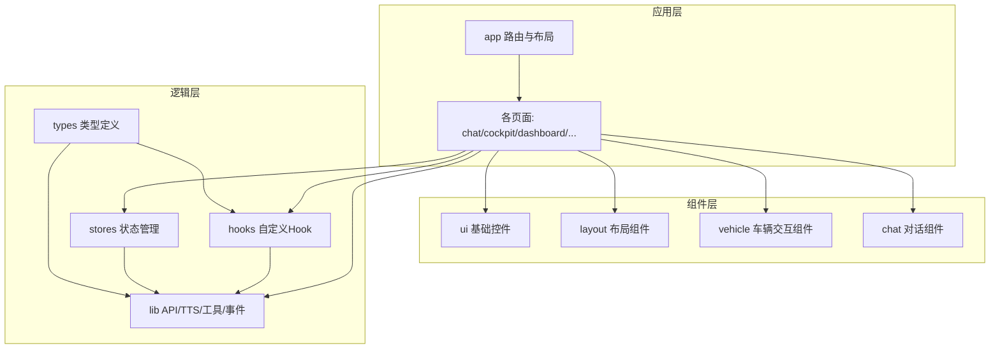
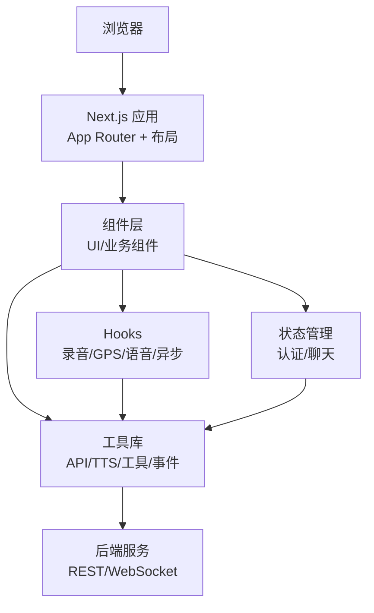
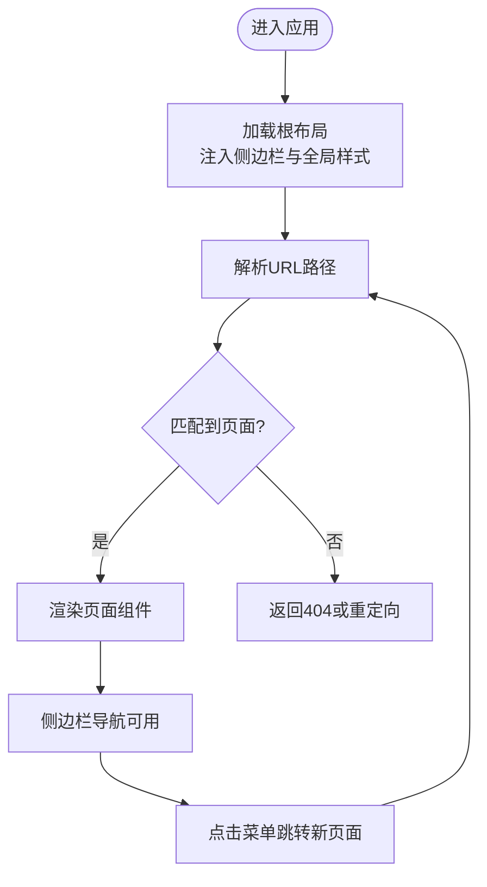
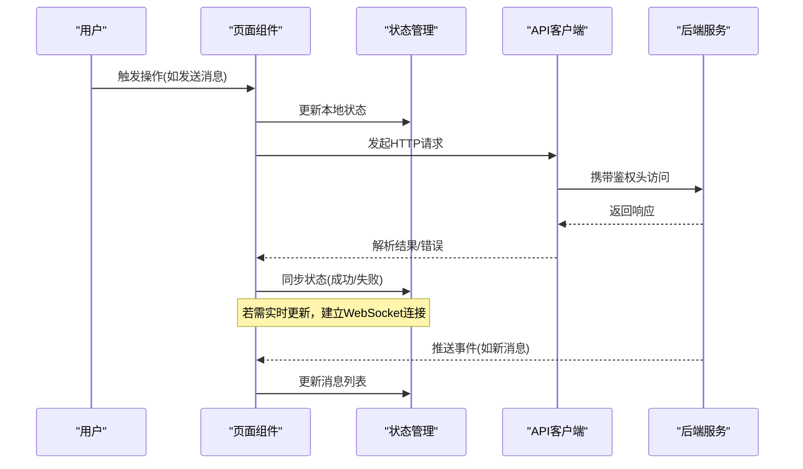
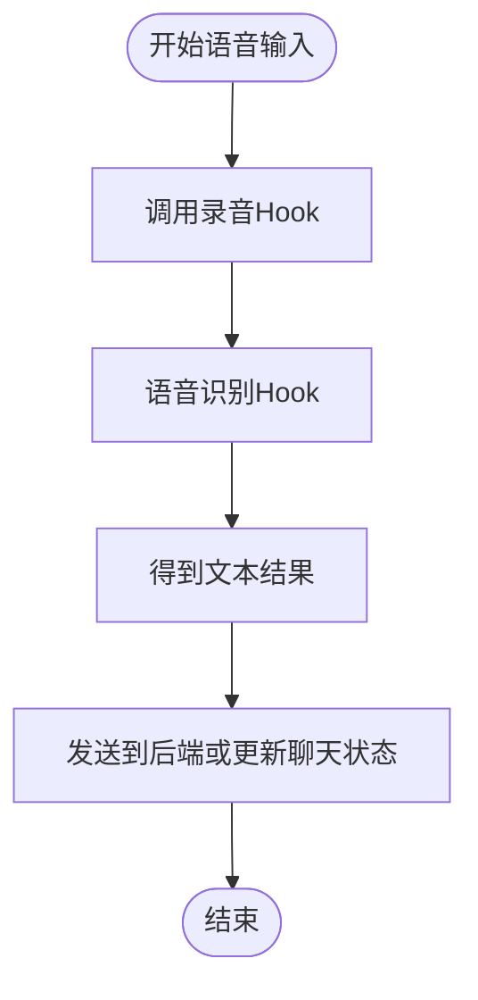
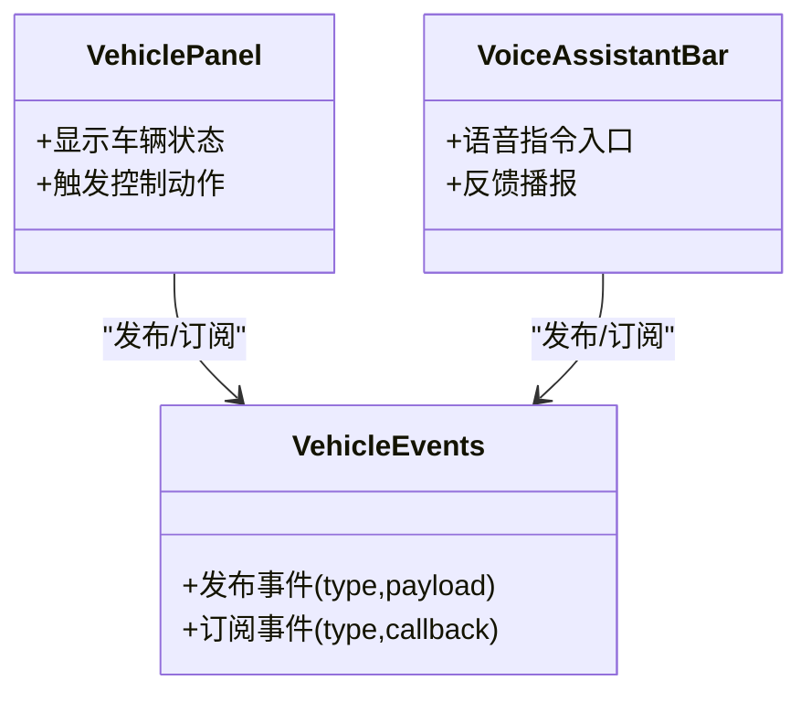
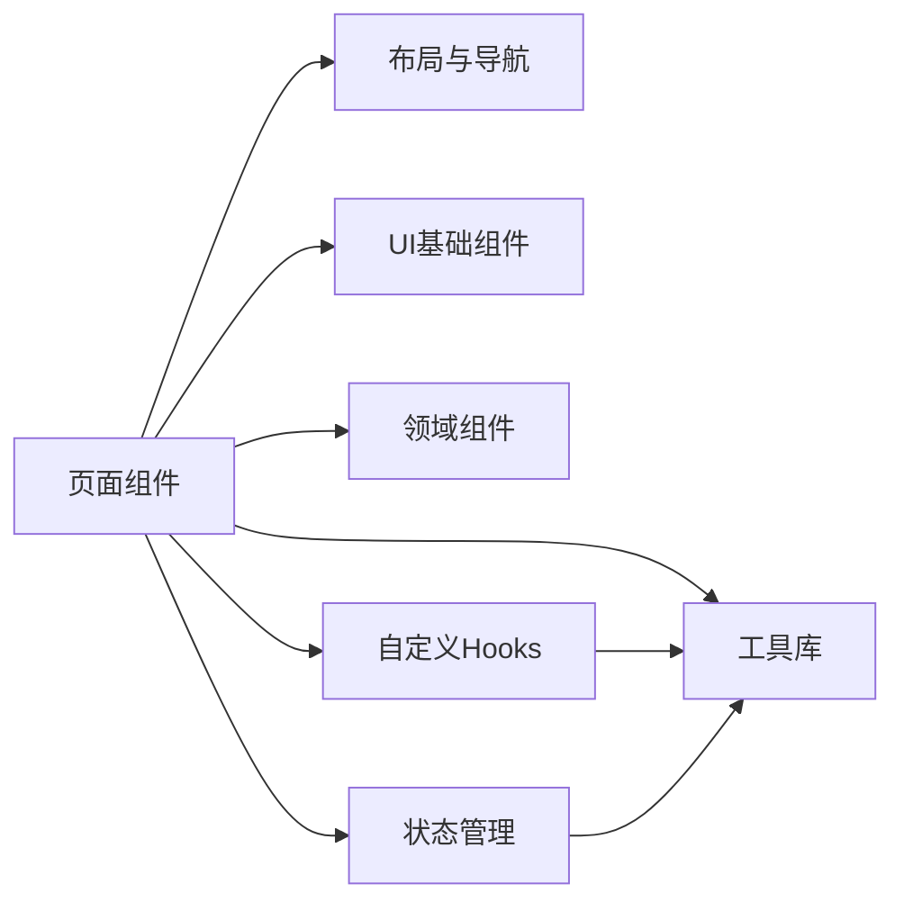

# 应用架构设计

<cite>
**本文引用的文件**   
- [frontend_design/src/app/layout.tsx](file://frontend_design/src/app/layout.tsx)
- [frontend_design/src/app/page.tsx](file://frontend_design/src/app/page.tsx)
- [frontend_design/src/app/chat/page.tsx](file://frontend_design/src/app/chat/page.tsx)
- [frontend_design/src/app/cockpit/page.tsx](file://frontend_design/src/app/cockpit/page.tsx)
- [frontend_design/src/app/dashboard/page.tsx](file://frontend_design/src/app/dashboard/page.tsx)
- [frontend_design/src/app/admin/page.tsx](file://frontend_design/src/app/admin/page.tsx)
- [frontend_design/src/app/dataplatform/page.tsx](file://frontend_design/src/app/dataplatform/page.tsx)
- [frontend_design/src/app/middleware/page.tsx](file://frontend_design/src/app/middleware/page.tsx)
- [frontend_design/src/app/settings/page.tsx](file://frontend_design/src/app/settings/page.tsx)
- [frontend_design/src/app/vehicle/page.tsx](file://frontend_design/src/app/vehicle/page.tsx)
- [frontend_design/src/components/layout/sidebar.tsx](file://frontend_design/src/components/layout/sidebar.tsx)
- [frontend_design/src/components/layout/gps-provider.tsx](file://frontend_design/src/components/layout/gps-provider.tsx)
- [frontend_design/src/components/ui/button.tsx](file://frontend_design/src/components/ui/button.tsx)
- [frontend_design/src/components/ui/card.tsx](file://frontend_design/src/components/ui/card.tsx)
- [frontend_design/src/components/ui/input.tsx](file://frontend_design/src/components/ui/input.tsx)
- [frontend_design/src/components/chat/chat-window.tsx](file://frontend_design/src/components/chat/chat-window.tsx)
- [frontend_design/src/components/vehicle/vehicle-3d.tsx](file://frontend_design/src/components/vehicle/vehicle-3d.tsx)
- [frontend_design/src/components/vehicle/vehicle-panel.tsx](file://frontend_design/src/components/vehicle/vehicle-panel.tsx)
- [frontend_design/src/components/vehicle/voice-assistant-bar.tsx](file://frontend_design/src/components/vehicle/voice-assistant-bar.tsx)
- [frontend_design/src/hooks/use-audio-recorder.ts](file://frontend_design/src/hooks/use-audio-recorder.ts)
- [frontend_design/src/hooks/use-gps-location.ts](file://frontend_design/src/hooks/use-gps-location.ts)
- [frontend_design/src/hooks/use-speech-recognition.ts](file://frontend_design/src/hooks/use-speech-recognition.ts)
- [frontend_design/src/hooks/use-async.ts](file://frontend_design/src/hooks/use-async.ts)
- [frontend_design/src/hooks/index.ts](file://frontend_design/src/hooks/index.ts)
- [frontend_design/src/lib/api.ts](file://frontend_design/src/lib/api.ts)
- [frontend_design/src/lib/tts.ts](file://frontend_design/src/lib/tts.ts)
- [frontend_design/src/lib/utils.ts](file://frontend_design/src/lib/utils.ts)
- [frontend_design/src/lib/vehicle-events.ts](file://frontend_design/src/lib/vehicle-events.ts)
- [frontend_design/src/stores/auth-store.ts](file://frontend_design/src/stores/auth-store.ts)
- [frontend_design/src/stores/chat-store.ts](file://frontend_design/src/stores/chat-store.ts)
- [frontend_design/src/types/index.ts](file://frontend_design/src/types/index.ts)
- [frontend_design/next.config.js](file://frontend_design/next.config.js)
- [frontend_design/package.json](file://frontend_design/package.json)
- [frontend_design/tailwind.config.ts](file://frontend_design/tailwind.config.ts)
- [frontend_design/postcss.config.js](file://frontend_design/postcss.config.js)
- [frontend_design/tsconfig.json](file://frontend_design/tsconfig.json)
- [frontend_design/Dockerfile](file://frontend_design/Dockerfile)
</cite>

## 目录
1. [简介](#简介)
2. [项目结构](#项目结构)
3. [核心组件](#核心组件)
4. [架构总览](#架构总览)
5. [详细组件分析](#详细组件分析)
6. [依赖分析](#依赖分析)
7. [性能考虑](#性能考虑)
8. [故障排查指南](#故障排查指南)
9. [结论](#结论)
10. [附录](#附录)

## 简介
本文件面向NexusCockpit前端应用的架构设计与实现，聚焦Next.js应用的整体架构、页面路由与布局、配置管理、技术栈选型、启动流程、中间件机制、构建优化策略、前后端分离的API集成模式、环境变量与部署策略，以及目录结构设计原则、模块划分规范与最佳实践。文档同时提供可视化架构图、流程图和时序图，帮助读者快速理解系统结构与关键流程。

## 项目结构
前端采用Next.js App Router组织代码，遵循“按功能域+分层”的目录结构：
- app：基于文件系统的路由定义，每个子目录对应一个页面或路由组；layout.tsx为全局布局入口。
- components：可复用UI与业务组件，进一步细分为ui（基础控件）、layout（布局相关）、chat（对话界面）、vehicle（车辆交互）等。
- hooks：自定义React Hooks，封装音频录制、GPS定位、语音识别、异步请求等通用能力。
- lib：领域工具库，包含API客户端、TTS工具、通用工具函数、车辆事件总线等。
- stores：状态管理（轻量store），如认证与聊天会话状态。
- types：TypeScript类型定义集中存放。
- 根级配置文件：next.config.js、tailwind.config.ts、postcss.config.js、tsconfig.json、package.json、Dockerfile等。

图表来源
- [frontend_design/src/app/layout.tsx](file://frontend_design/src/app/layout.tsx)
- [frontend_design/src/app/chat/page.tsx](file://frontend_design/src/app/chat/page.tsx)
- [frontend_design/src/app/cockpit/page.tsx](file://frontend_design/src/app/cockpit/page.tsx)
- [frontend_design/src/app/dashboard/page.tsx](file://frontend_design/src/app/dashboard/page.tsx)
- [frontend_design/src/app/admin/page.tsx](file://frontend_design/src/app/admin/page.tsx)
- [frontend_design/src/app/dataplatform/page.tsx](file://frontend_design/src/app/dataplatform/page.tsx)
- [frontend_design/src/app/middleware/page.tsx](file://frontend_design/src/app/middleware/page.tsx)
- [frontend_design/src/app/settings/page.tsx](file://frontend_design/src/app/settings/page.tsx)
- [frontend_design/src/app/vehicle/page.tsx](file://frontend_design/src/app/vehicle/page.tsx)
- [frontend_design/src/components/layout/sidebar.tsx](file://frontend_design/src/components/layout/sidebar.tsx)
- [frontend_design/src/components/layout/gps-provider.tsx](file://frontend_design/src/components/layout/gps-provider.tsx)
- [frontend_design/src/components/ui/button.tsx](file://frontend_design/src/components/ui/button.tsx)
- [frontend_design/src/components/ui/card.tsx](file://frontend_design/src/components/ui/card.tsx)
- [frontend_design/src/components/ui/input.tsx](file://frontend_design/src/components/ui/input.tsx)
- [frontend_design/src/components/chat/chat-window.tsx](file://frontend_design/src/components/chat/chat-window.tsx)
- [frontend_design/src/components/vehicle/vehicle-3d.tsx](file://frontend_design/src/components/vehicle/vehicle-3d.tsx)
- [frontend_design/src/components/vehicle/vehicle-panel.tsx](file://frontend_design/src/components/vehicle/vehicle-panel.tsx)
- [frontend_design/src/components/vehicle/voice-assistant-bar.tsx](file://frontend_design/src/components/vehicle/voice-assistant-bar.tsx)
- [frontend_design/src/hooks/use-audio-recorder.ts](file://frontend_design/src/hooks/use-audio-recorder.ts)
- [frontend_design/src/hooks/use-gps-location.ts](file://frontend_design/src/hooks/use-gps-location.ts)
- [frontend_design/src/hooks/use-speech-recognition.ts](file://frontend_design/src/hooks/use-speech-recognition.ts)
- [frontend_design/src/hooks/use-async.ts](file://frontend_design/src/hooks/use-async.ts)
- [frontend_design/src/hooks/index.ts](file://frontend_design/src/hooks/index.ts)
- [frontend_design/src/lib/api.ts](file://frontend_design/src/lib/api.ts)
- [frontend_design/src/lib/tts.ts](file://frontend_design/src/lib/tts.ts)
- [frontend_design/src/lib/utils.ts](file://frontend_design/src/lib/utils.ts)
- [frontend_design/src/lib/vehicle-events.ts](file://frontend_design/src/lib/vehicle-events.ts)
- [frontend_design/src/stores/auth-store.ts](file://frontend_design/src/stores/auth-store.ts)
- [frontend_design/src/stores/chat-store.ts](file://frontend_design/src/stores/chat-store.ts)
- [frontend_design/src/types/index.ts](file://frontend_design/src/types/index.ts)

章节来源
- [frontend_design/src/app/layout.tsx](file://frontend_design/src/app/layout.tsx)
- [frontend_design/src/app/page.tsx](file://frontend_design/src/app/page.tsx)
- [frontend_design/src/app/chat/page.tsx](file://frontend_design/src/app/chat/page.tsx)
- [frontend_design/src/app/cockpit/page.tsx](file://frontend_design/src/app/cockpit/page.tsx)
- [frontend_design/src/app/dashboard/page.tsx](file://frontend_design/src/app/dashboard/page.tsx)
- [frontend_design/src/app/admin/page.tsx](file://frontend_design/src/app/admin/page.tsx)
- [frontend_design/src/app/dataplatform/page.tsx](file://frontend_design/src/app/dataplatform/page.tsx)
- [frontend_design/src/app/middleware/page.tsx](file://frontend_design/src/app/middleware/page.tsx)
- [frontend_design/src/app/settings/page.tsx](file://frontend_design/src/app/settings/page.tsx)
- [frontend_design/src/app/vehicle/page.tsx](file://frontend_design/src/app/vehicle/page.tsx)
- [frontend_design/src/components/layout/sidebar.tsx](file://frontend_design/src/components/layout/sidebar.tsx)
- [frontend_design/src/components/layout/gps-provider.tsx](file://frontend_design/src/components/layout/gps-provider.tsx)
- [frontend_design/src/components/ui/button.tsx](file://frontend_design/src/components/ui/button.tsx)
- [frontend_design/src/components/ui/card.tsx](file://frontend_design/src/components/ui/card.tsx)
- [frontend_design/src/components/ui/input.tsx](file://frontend_design/src/components/ui/input.tsx)
- [frontend_design/src/components/chat/chat-window.tsx](file://frontend_design/src/components/chat/chat-window.tsx)
- [frontend_design/src/components/vehicle/vehicle-3d.tsx](file://frontend_design/src/components/vehicle/vehicle-3d.tsx)
- [frontend_design/src/components/vehicle/vehicle-panel.tsx](file://frontend_design/src/components/vehicle/vehicle-panel.tsx)
- [frontend_design/src/components/vehicle/voice-assistant-bar.tsx](file://frontend_design/src/components/vehicle/voice-assistant-bar.tsx)
- [frontend_design/src/hooks/use-audio-recorder.ts](file://frontend_design/src/hooks/use-audio-recorder.ts)
- [frontend_design/src/hooks/use-gps-location.ts](file://frontend_design/src/hooks/use-gps-location.ts)
- [frontend_design/src/hooks/use-speech-recognition.ts](file://frontend_design/src/hooks/use-speech-recognition.ts)
- [frontend_design/src/hooks/use-async.ts](file://frontend_design/src/hooks/use-async.ts)
- [frontend_design/src/hooks/index.ts](file://frontend_design/src/hooks/index.ts)
- [frontend_design/src/lib/api.ts](file://frontend_design/src/lib/api.ts)
- [frontend_design/src/lib/tts.ts](file://frontend_design/src/lib/tts.ts)
- [frontend_design/src/lib/utils.ts](file://frontend_design/src/lib/utils.ts)
- [frontend_design/src/lib/vehicle-events.ts](file://frontend_design/src/lib/vehicle-events.ts)
- [frontend_design/src/stores/auth-store.ts](file://frontend_design/src/stores/auth-store.ts)
- [frontend_design/src/stores/chat-store.ts](file://frontend_design/src/stores/chat-store.ts)
- [frontend_design/src/types/index.ts](file://frontend_design/src/types/index.ts)

## 核心组件
- 全局布局与导航
  - layout.tsx作为根布局，统一注入侧边栏、主题、全局样式与Provider。
  - sidebar.tsx提供导航菜单与路由跳转，结合App Router进行页面切换。
- 页面组件
  - chat、cockpit、dashboard、admin、dataplatform、middleware、settings、vehicle等页面分别承载各自业务场景。
- UI基础组件
  - button、card、input等原子化控件，保证风格一致性与复用性。
- 领域组件
  - vehicle-3d、vehicle-panel、voice-assistant-bar用于车辆控制与展示。
  - chat-window用于对话窗口渲染与消息流处理。
- 自定义Hooks
  - use-audio-recorder：封装浏览器录音能力。
  - use-gps-location：获取并订阅地理位置。
  - use-speech-recognition：语音转文本。
  - use-async：统一异步状态管理。
- 工具库
  - api.ts：统一的HTTP请求封装，处理鉴权头、错误码、重试与超时。
  - tts.ts：文本转语音播放与队列管理。
  - utils.ts：通用工具函数。
  - vehicle-events.ts：车辆事件发布/订阅总线。
- 状态管理
  - auth-store.ts：用户认证状态与登录态维护。
  - chat-store.ts：聊天会话、消息列表与发送状态。
- 类型定义
  - types/index.ts：集中定义接口与枚举，确保前后端契约一致性。

章节来源
- [frontend_design/src/app/layout.tsx](file://frontend_design/src/app/layout.tsx)
- [frontend_design/src/components/layout/sidebar.tsx](file://frontend_design/src/components/layout/sidebar.tsx)
- [frontend_design/src/components/ui/button.tsx](file://frontend_design/src/components/ui/button.tsx)
- [frontend_design/src/components/ui/card.tsx](file://frontend_design/src/components/ui/card.tsx)
- [frontend_design/src/components/ui/input.tsx](file://frontend_design/src/components/ui/input.tsx)
- [frontend_design/src/components/chat/chat-window.tsx](file://frontend_design/src/components/chat/chat-window.tsx)
- [frontend_design/src/components/vehicle/vehicle-3d.tsx](file://frontend_design/src/components/vehicle/vehicle-3d.tsx)
- [frontend_design/src/components/vehicle/vehicle-panel.tsx](file://frontend_design/src/components/vehicle/vehicle-panel.tsx)
- [frontend_design/src/components/vehicle/voice-assistant-bar.tsx](file://frontend_design/src/components/vehicle/voice-assistant-bar.tsx)
- [frontend_design/src/hooks/use-audio-recorder.ts](file://frontend_design/src/hooks/use-audio-recorder.ts)
- [frontend_design/src/hooks/use-gps-location.ts](file://frontend_design/src/hooks/use-gps-location.ts)
- [frontend_design/src/hooks/use-speech-recognition.ts](file://frontend_design/src/hooks/use-speech-recognition.ts)
- [frontend_design/src/hooks/use-async.ts](file://frontend_design/src/hooks/use-async.ts)
- [frontend_design/src/lib/api.ts](file://frontend_design/src/lib/api.ts)
- [frontend_design/src/lib/tts.ts](file://frontend_design/src/lib/tts.ts)
- [frontend_design/src/lib/utils.ts](file://frontend_design/src/lib/utils.ts)
- [frontend_design/src/lib/vehicle-events.ts](file://frontend_design/src/lib/vehicle-events.ts)
- [frontend_design/src/stores/auth-store.ts](file://frontend_design/src/stores/auth-store.ts)
- [frontend_design/src/stores/chat-store.ts](file://frontend_design/src/stores/chat-store.ts)
- [frontend_design/src/types/index.ts](file://frontend_design/src/types/index.ts)

## 架构总览
整体采用前后端分离架构：
- 前端：Next.js（App Router）负责页面渲染、路由、组件与状态管理。
- 后端：通过REST/WebSocket与后端服务通信，使用api.ts统一封装。
- 部署：前端静态资源构建后由容器化部署，支持反向代理与CDN缓存。

图表来源
- [frontend_design/src/app/layout.tsx](file://frontend_design/src/app/layout.tsx)
- [frontend_design/src/lib/api.ts](file://frontend_design/src/lib/api.ts)
- [frontend_design/src/components/layout/sidebar.tsx](file://frontend_design/src/components/layout/sidebar.tsx)
- [frontend_design/src/hooks/use-audio-recorder.ts](file://frontend_design/src/hooks/use-audio-recorder.ts)
- [frontend_design/src/hooks/use-gps-location.ts](file://frontend_design/src/hooks/use-gps-location.ts)
- [frontend_design/src/hooks/use-speech-recognition.ts](file://frontend_design/src/hooks/use-speech-recognition.ts)
- [frontend_design/src/stores/auth-store.ts](file://frontend_design/src/stores/auth-store.ts)
- [frontend_design/src/stores/chat-store.ts](file://frontend_design/src/stores/chat-store.ts)

## 详细组件分析

### 页面路由与布局
- 路由结构
  - 基于文件系统的路由：app下每个目录对应一个页面，如chat、cockpit、dashboard等。
  - 根布局layout.tsx统一注入侧边栏、全局样式与Provider。
- 导航与跳转
  - sidebar.tsx提供菜单项，点击后触发App Router导航。
- 页面职责
  - chat：对话界面，集成语音输入与消息流。
  - cockpit：驾驶舱主视图，聚合车辆状态与控制面板。
  - dashboard：数据看板，展示指标与图表。
  - admin：管理后台，权限控制与系统设置。
  - dataplatform：数据平台入口，对接数据源与任务。
  - middleware：中间件监控与配置。
  - settings：应用设置与偏好。
  - vehicle：车辆详情与交互。

图表来源
- [frontend_design/src/app/layout.tsx](file://frontend_design/src/app/layout.tsx)
- [frontend_design/src/components/layout/sidebar.tsx](file://frontend_design/src/components/layout/sidebar.tsx)
- [frontend_design/src/app/chat/page.tsx](file://frontend_design/src/app/chat/page.tsx)
- [frontend_design/src/app/cockpit/page.tsx](file://frontend_design/src/app/cockpit/page.tsx)
- [frontend_design/src/app/dashboard/page.tsx](file://frontend_design/src/app/dashboard/page.tsx)
- [frontend_design/src/app/admin/page.tsx](file://frontend_design/src/app/admin/page.tsx)
- [frontend_design/src/app/dataplatform/page.tsx](file://frontend_design/src/app/dataplatform/page.tsx)
- [frontend_design/src/app/middleware/page.tsx](file://frontend_design/src/app/middleware/page.tsx)
- [frontend_design/src/app/settings/page.tsx](file://frontend_design/src/app/settings/page.tsx)
- [frontend_design/src/app/vehicle/page.tsx](file://frontend_design/src/app/vehicle/page.tsx)

章节来源
- [frontend_design/src/app/layout.tsx](file://frontend_design/src/app/layout.tsx)
- [frontend_design/src/app/page.tsx](file://frontend_design/src/app/page.tsx)
- [frontend_design/src/components/layout/sidebar.tsx](file://frontend_design/src/components/layout/sidebar.tsx)
- [frontend_design/src/app/chat/page.tsx](file://frontend_design/src/app/chat/page.tsx)
- [frontend_design/src/app/cockpit/page.tsx](file://frontend_design/src/app/cockpit/page.tsx)
- [frontend_design/src/app/dashboard/page.tsx](file://frontend_design/src/app/dashboard/page.tsx)
- [frontend_design/src/app/admin/page.tsx](file://frontend_design/src/app/admin/page.tsx)
- [frontend_design/src/app/dataplatform/page.tsx](file://frontend_design/src/app/dataplatform/page.tsx)
- [frontend_design/src/app/middleware/page.tsx](file://frontend_design/src/app/middleware/page.tsx)
- [frontend_design/src/app/settings/page.tsx](file://frontend_design/src/app/settings/page.tsx)
- [frontend_design/src/app/vehicle/page.tsx](file://frontend_design/src/app/vehicle/page.tsx)

### API集成与WebSocket
- HTTP请求封装
  - api.ts统一处理请求头（含鉴权）、错误码映射、重试与超时。
- WebSocket集成
  - 在需要实时数据的页面（如cockpit、chat）建立连接，接收事件并更新状态。
- 错误处理
  - 网络异常、鉴权失败、业务错误分类处理，提示用户并记录日志。

图表来源
- [frontend_design/src/lib/api.ts](file://frontend_design/src/lib/api.ts)
- [frontend_design/src/stores/chat-store.ts](file://frontend_design/src/stores/chat-store.ts)
- [frontend_design/src/stores/auth-store.ts](file://frontend_design/src/stores/auth-store.ts)
- [frontend_design/src/app/chat/page.tsx](file://frontend_design/src/app/chat/page.tsx)
- [frontend_design/src/app/cockpit/page.tsx](file://frontend_design/src/app/cockpit/page.tsx)

章节来源
- [frontend_design/src/lib/api.ts](file://frontend_design/src/lib/api.ts)
- [frontend_design/src/stores/chat-store.ts](file://frontend_design/src/stores/chat-store.ts)
- [frontend_design/src/stores/auth-store.ts](file://frontend_design/src/stores/auth-store.ts)
- [frontend_design/src/app/chat/page.tsx](file://frontend_design/src/app/chat/page.tsx)
- [frontend_design/src/app/cockpit/page.tsx](file://frontend_design/src/app/cockpit/page.tsx)

### 语音与位置能力
- 语音录制与识别
  - use-audio-recorder封装浏览器录音，use-speech-recognition将音频转为文本。
- GPS定位
  - use-gps-location获取当前位置并订阅变化，供地图与导航使用。
- TTS播放
  - tts.ts负责文本转语音播放与队列管理，避免并发冲突。

图表来源
- [frontend_design/src/hooks/use-audio-recorder.ts](file://frontend_design/src/hooks/use-audio-recorder.ts)
- [frontend_design/src/hooks/use-speech-recognition.ts](file://frontend_design/src/hooks/use-speech-recognition.ts)
- [frontend_design/src/lib/tts.ts](file://frontend_design/src/lib/tts.ts)
- [frontend_design/src/hooks/use-gps-location.ts](file://frontend_design/src/hooks/use-gps-location.ts)

章节来源
- [frontend_design/src/hooks/use-audio-recorder.ts](file://frontend_design/src/hooks/use-audio-recorder.ts)
- [frontend_design/src/hooks/use-speech-recognition.ts](file://frontend_design/src/hooks/use-speech-recognition.ts)
- [frontend_design/src/lib/tts.ts](file://frontend_design/src/lib/tts.ts)
- [frontend_design/src/hooks/use-gps-location.ts](file://frontend_design/src/hooks/use-gps-location.ts)

### 车辆交互与事件总线
- 车辆组件
  - vehicle-3d、vehicle-panel、voice-assistant-bar组合呈现车辆状态与控制入口。
- 事件总线
  - vehicle-events.ts提供发布/订阅机制，解耦组件间通信。

图表来源
- [frontend_design/src/components/vehicle/vehicle-panel.tsx](file://frontend_design/src/components/vehicle/vehicle-panel.tsx)
- [frontend_design/src/components/vehicle/voice-assistant-bar.tsx](file://frontend_design/src/components/vehicle/voice-assistant-bar.tsx)
- [frontend_design/src/lib/vehicle-events.ts](file://frontend_design/src/lib/vehicle-events.ts)

章节来源
- [frontend_design/src/components/vehicle/vehicle-panel.tsx](file://frontend_design/src/components/vehicle/vehicle-panel.tsx)
- [frontend_design/src/components/vehicle/voice-assistant-bar.tsx](file://frontend_design/src/components/vehicle/voice-assistant-bar.tsx)
- [frontend_design/src/lib/vehicle-events.ts](file://frontend_design/src/lib/vehicle-events.ts)

### 配置与环境变量
- 构建与运行时配置
  - next.config.js：Next.js构建选项、代理、图片优化等。
  - tailwind.config.ts：Tailwind CSS主题与插件配置。
  - postcss.config.js：PostCSS处理器链。
  - tsconfig.json：TypeScript编译选项。
  - package.json：依赖与脚本命令。
- 环境变量
  - 建议使用NEXT_PUBLIC_前缀暴露给客户端的环境变量，敏感信息仅在后端或构建期使用。
  - 不同环境（开发/测试/生产）通过环境变量区分API地址、密钥与功能开关。

章节来源
- [frontend_design/next.config.js](file://frontend_design/next.config.js)
- [frontend_design/tailwind.config.ts](file://frontend_design/tailwind.config.ts)
- [frontend_design/postcss.config.js](file://frontend_design/postcss.config.js)
- [frontend_design/tsconfig.json](file://frontend_design/tsconfig.json)
- [frontend_design/package.json](file://frontend_design/package.json)

### 部署与容器化
- Dockerfile
  - 多阶段构建：安装依赖、构建静态资源、最小化镜像。
- 反向代理与CDN
  - 建议通过Nginx或云厂商网关进行静态资源缓存与HTTPS终止。
- 环境变量注入
  - 在容器编排时注入环境变量，避免硬编码。

章节来源
- [frontend_design/Dockerfile](file://frontend_design/Dockerfile)

## 依赖分析
- 内部依赖
  - 页面组件依赖布局与UI组件，业务组件依赖Hooks与工具库，状态管理贯穿多个页面。
- 外部依赖
  - Next.js生态（React、Tailwind、PostCSS、TypeScript）。
  - 浏览器API（MediaRecorder、Geolocation、SpeechRecognition）。
  - 网络库（fetch或axios，取决于api.ts实现）。

图表来源
- [frontend_design/src/app/chat/page.tsx](file://frontend_design/src/app/chat/page.tsx)
- [frontend_design/src/app/cockpit/page.tsx](file://frontend_design/src/app/cockpit/page.tsx)
- [frontend_design/src/components/layout/sidebar.tsx](file://frontend_design/src/components/layout/sidebar.tsx)
- [frontend_design/src/components/ui/button.tsx](file://frontend_design/src/components/ui/button.tsx)
- [frontend_design/src/components/chat/chat-window.tsx](file://frontend_design/src/components/chat/chat-window.tsx)
- [frontend_design/src/hooks/use-audio-recorder.ts](file://frontend_design/src/hooks/use-audio-recorder.ts)
- [frontend_design/src/lib/api.ts](file://frontend_design/src/lib/api.ts)
- [frontend_design/src/stores/chat-store.ts](file://frontend_design/src/stores/chat-store.ts)

章节来源
- [frontend_design/src/app/chat/page.tsx](file://frontend_design/src/app/chat/page.tsx)
- [frontend_design/src/app/cockpit/page.tsx](file://frontend_design/src/app/cockpit/page.tsx)
- [frontend_design/src/components/layout/sidebar.tsx](file://frontend_design/src/components/layout/sidebar.tsx)
- [frontend_design/src/components/ui/button.tsx](file://frontend_design/src/components/ui/button.tsx)
- [frontend_design/src/components/chat/chat-window.tsx](file://frontend_design/src/components/chat/chat-window.tsx)
- [frontend_design/src/hooks/use-audio-recorder.ts](file://frontend_design/src/hooks/use-audio-recorder.ts)
- [frontend_design/src/lib/api.ts](file://frontend_design/src/lib/api.ts)
- [frontend_design/src/stores/chat-store.ts](file://frontend_design/src/stores/chat-store.ts)

## 性能考虑
- 构建优化
  - 启用Next.js增量静态再生成（ISR）与按需预渲染，减少首屏时间。
  - 图片与字体资源优化，开启压缩与懒加载。
- 运行时优化
  - 组件拆分与懒加载，避免首屏过大。
  - 合理使用React.memo与useMemo/useCallback减少重渲染。
  - 网络请求去抖与节流，避免频繁调用。
- 缓存策略
  - 静态资源CDN缓存，API响应合理设置Cache-Control。
  - 本地存储（localStorage/sessionStorage）缓存非敏感数据。
- 监控与度量
  - 接入前端性能监控（如Web Vitals），关注LCP、FID、CLS等指标。

[本节为通用指导，不直接分析具体文件]

## 故障排查指南
- 常见问题
  - 鉴权失败：检查token是否过期、刷新逻辑是否正确。
  - 网络错误：确认API地址、跨域配置与代理规则。
  - 语音/定位权限：浏览器安全策略要求用户授权，需在UI中引导。
- 调试技巧
  - 使用浏览器开发者工具查看网络请求与WebSocket帧。
  - 在关键路径添加日志输出，定位异常堆栈。
  - 对复杂状态变更引入快照与回放机制。

章节来源
- [frontend_design/src/lib/api.ts](file://frontend_design/src/lib/api.ts)
- [frontend_design/src/stores/auth-store.ts](file://frontend_design/src/stores/auth-store.ts)
- [frontend_design/src/hooks/use-audio-recorder.ts](file://frontend_design/src/hooks/use-audio-recorder.ts)
- [frontend_design/src/hooks/use-gps-location.ts](file://frontend_design/src/hooks/use-gps-location.ts)

## 结论
NexusCockpit前端采用Next.js App Router与模块化目录结构，清晰划分页面、组件、Hooks、工具与状态管理，具备良好的可扩展性与可维护性。通过统一的API封装与WebSocket集成，实现了前后端分离的高效协作。配合合理的构建优化与部署策略，可在多环境下稳定运行并提供良好的用户体验。

[本节为总结性内容，不直接分析具体文件]

## 附录
- 开发工作流建议
  - 使用Git分支策略与PR审查，保持代码质量。
  - 引入ESLint与Prettier统一代码风格。
  - 编写单元测试与端到端测试，覆盖关键路径。
- 最佳实践
  - 类型优先：在types中明确接口契约，减少运行时错误。
  - 组件单一职责：UI与业务逻辑分离，便于复用与维护。
  - 错误边界：在关键页面增加错误边界，提升健壮性。

[本节为通用指导，不直接分析具体文件]