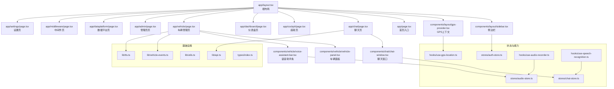
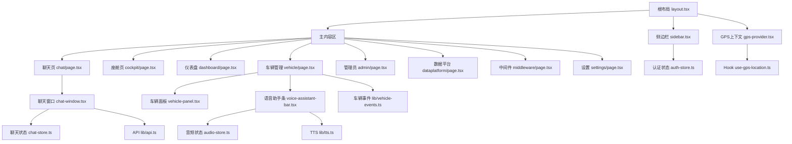
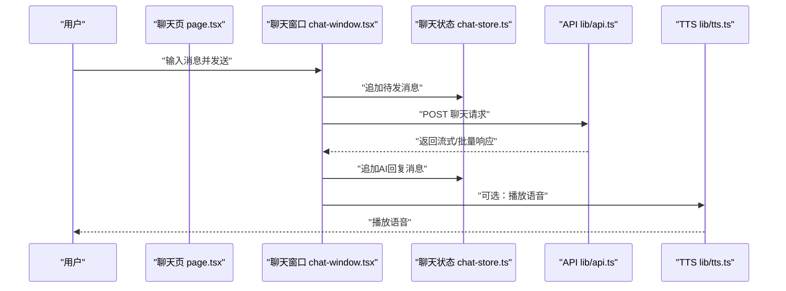
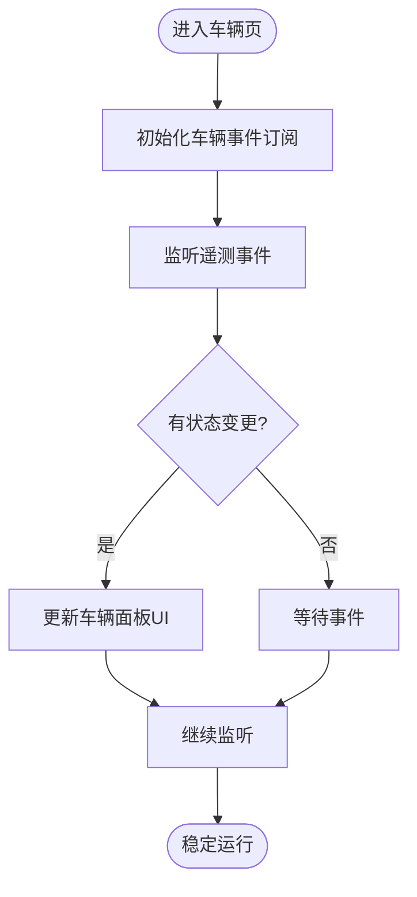
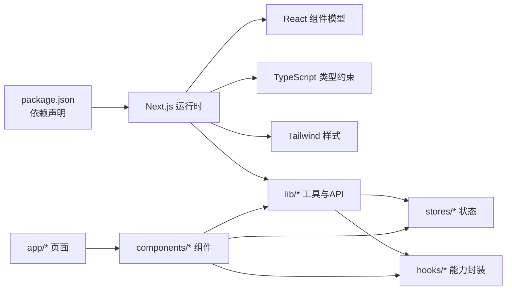

# 应用结构和路由

<cite>
**本文引用的文件**   
- [frontend_design/src/app/layout.tsx](file://frontend_design/src/app/layout.tsx)
- [frontend_design/src/app/page.tsx](file://frontend_design/src/app/page.tsx)
- [frontend_design/src/app/chat/page.tsx](file://frontend_design/src/app/chat/page.tsx)
- [frontend_design/src/app/cockpit/page.tsx](file://frontend_design/src/app/cockpit/page.tsx)
- [frontend_design/src/app/dashboard/page.tsx](file://frontend_design/src/app/dashboard/page.tsx)
- [frontend_design/src/app/vehicle/page.tsx](file://frontend_design/src/app/vehicle/page.tsx)
- [frontend_design/src/app/admin/page.tsx](file://frontend_design/src/app/admin/page.tsx)
- [frontend_design/src/app/dataplatform/page.tsx](file://frontend_design/src/app/dataplatform/page.tsx)
- [frontend_design/src/app/middleware/page.tsx](file://frontend_design/src/app/middleware/page.tsx)
- [frontend_design/src/app/settings/page.tsx](file://frontend_design/src/app/settings/page.tsx)
- [frontend_design/src/components/layout/sidebar.tsx](file://frontend_design/src/components/layout/sidebar.tsx)
- [frontend_design/src/components/layout/gps-provider.tsx](file://frontend_design/src/components/layout/gps-provider.tsx)
- [frontend_design/src/components/chat/chat-window.tsx](file://frontend_design/src/components/chat/chat-window.tsx)
- [frontend_design/src/components/vehicle/vehicle-panel.tsx](file://frontend_design/src/components/vehicle/vehicle-panel.tsx)
- [frontend_design/src/components/vehicle/voice-assistant-bar.tsx](file://frontend_design/src/components/vehicle/voice-assistant-bar.tsx)
- [frontend_design/src/stores/auth-store.ts](file://frontend_design/src/stores/auth-store.ts)
- [frontend_design/src/stores/chat-store.ts](file://frontend_design/src/stores/chat-store.ts)
- [frontend_design/src/stores/audio-store.ts](file://frontend_design/src/stores/audio-store.ts)
- [frontend_design/src/hooks/use-gps-location.ts](file://frontend_design/src/hooks/use-gps-location.ts)
- [frontend_design/src/hooks/use-audio-recorder.ts](file://frontend_design/src/hooks/use-audio-recorder.ts)
- [frontend_design/src/hooks/use-speech-recognition.ts](file://frontend_design/src/hooks/use-speech-recognition.ts)
- [frontend_design/src/lib/api.ts](file://frontend_design/src/lib/api.ts)
- [frontend_design/src/lib/tts.ts](file://frontend_design/src/lib/tts.ts)
- [frontend_design/src/lib/utils.ts](file://frontend_design/src/lib/utils.ts)
- [frontend_design/src/lib/vehicle-events.ts](file://frontend_design/src/lib/vehicle-events.ts)
- [frontend_design/src/types/index.ts](file://frontend_design/src/types/index.ts)
- [frontend_design/package.json](file://frontend_design/package.json)
- [frontend_design/next.config.js](file://frontend_design/next.config.js)
</cite>

## 目录
1. [简介](#简介)
2. [项目结构](#项目结构)
3. [核心组件](#核心组件)
4. [架构总览](#架构总览)
5. [详细组件分析](#详细组件分析)
6. [依赖分析](#依赖分析)
7. [性能考虑](#性能考虑)
8. [故障排查指南](#故障排查指南)
9. [结论](#结论)
10. [附录](#附录)

## 简介
本文件面向NexusCockpit前端应用，聚焦于基于Next.js App Router的页面组织与路由设计。文档将系统阐述：
- 布局组件的设计模式与全局布局实现（侧边栏导航、头部信息、响应式适配）
- 页面路由配置与嵌套路由实现方式
- 功能页面职责划分（聊天界面、座舱控制、仪表盘、车辆管理等）
- 页面间数据传递与状态共享机制（Store、Hooks、事件总线等）
- 页面开发最佳实践与性能优化建议

## 项目结构
前端采用Next.js App Router约定式路由，src/app目录下每个路由文件夹对应一个页面或布局；src/components提供可复用UI与业务组件；src/stores集中管理跨页面状态；src/hooks封装通用能力；src/lib提供API、工具与领域事件；src/types定义类型契约。

图表来源
- [frontend_design/src/app/layout.tsx](file://frontend_design/src/app/layout.tsx)
- [frontend_design/src/components/layout/sidebar.tsx](file://frontend_design/src/components/layout/sidebar.tsx)
- [frontend_design/src/components/layout/gps-provider.tsx](file://frontend_design/src/components/layout/gps-provider.tsx)
- [frontend_design/src/app/page.tsx](file://frontend_design/src/app/page.tsx)
- [frontend_design/src/app/chat/page.tsx](file://frontend_design/src/app/chat/page.tsx)
- [frontend_design/src/app/cockpit/page.tsx](file://frontend_design/src/app/cockpit/page.tsx)
- [frontend_design/src/app/dashboard/page.tsx](file://frontend_design/src/app/dashboard/page.tsx)
- [frontend_design/src/app/vehicle/page.tsx](file://frontend_design/src/app/vehicle/page.tsx)
- [frontend_design/src/app/admin/page.tsx](file://frontend_design/src/app/admin/page.tsx)
- [frontend_design/src/app/dataplatform/page.tsx](file://frontend_design/src/app/dataplatform/page.tsx)
- [frontend_design/src/app/middleware/page.tsx](file://frontend_design/src/app/middleware/page.tsx)
- [frontend_design/src/app/settings/page.tsx](file://frontend_design/src/app/settings/page.tsx)
- [frontend_design/src/components/chat/chat-window.tsx](file://frontend_design/src/components/chat/chat-window.tsx)
- [frontend_design/src/components/vehicle/vehicle-panel.tsx](file://frontend_design/src/components/vehicle/vehicle-panel.tsx)
- [frontend_design/src/components/vehicle/voice-assistant-bar.tsx](file://frontend_design/src/components/vehicle/voice-assistant-bar.tsx)
- [frontend_design/src/stores/auth-store.ts](file://frontend_design/src/stores/auth-store.ts)
- [frontend_design/src/stores/chat-store.ts](file://frontend_design/src/stores/chat-store.ts)
- [frontend_design/src/stores/audio-store.ts](file://frontend_design/src/stores/audio-store.ts)
- [frontend_design/src/hooks/use-gps-location.ts](file://frontend_design/src/hooks/use-gps-location.ts)
- [frontend_design/src/hooks/use-audio-recorder.ts](file://frontend_design/src/hooks/use-audio-recorder.ts)
- [frontend_design/src/hooks/use-speech-recognition.ts](file://frontend_design/src/hooks/use-speech-recognition.ts)
- [frontend_design/src/lib/api.ts](file://frontend_design/src/lib/api.ts)
- [frontend_design/src/lib/tts.ts](file://frontend_design/src/lib/tts.ts)
- [frontend_design/src/lib/utils.ts](file://frontend_design/src/lib/utils.ts)
- [frontend_design/src/lib/vehicle-events.ts](file://frontend_design/src/lib/vehicle-events.ts)

章节来源
- [frontend_design/src/app/layout.tsx](file://frontend_design/src/app/layout.tsx)
- [frontend_design/src/app/page.tsx](file://frontend_design/src/app/page.tsx)
- [frontend_design/src/app/chat/page.tsx](file://frontend_design/src/app/chat/page.tsx)
- [frontend_design/src/app/cockpit/page.tsx](file://frontend_design/src/app/cockpit/page.tsx)
- [frontend_design/src/app/dashboard/page.tsx](file://frontend_design/src/app/dashboard/page.tsx)
- [frontend_design/src/app/vehicle/page.tsx](file://frontend_design/src/app/vehicle/page.tsx)
- [frontend_design/src/app/admin/page.tsx](file://frontend_design/src/app/admin/page.tsx)
- [frontend_design/src/app/dataplatform/page.tsx](file://frontend_design/src/app/dataplatform/page.tsx)
- [frontend_design/src/app/middleware/page.tsx](file://frontend_design/src/app/middleware/page.tsx)
- [frontend_design/src/app/settings/page.tsx](file://frontend_design/src/app/settings/page.tsx)
- [frontend_design/src/components/layout/sidebar.tsx](file://frontend_design/src/components/layout/sidebar.tsx)
- [frontend_design/src/components/layout/gps-provider.tsx](file://frontend_design/src/components/layout/gps-provider.tsx)
- [frontend_design/src/components/chat/chat-window.tsx](file://frontend_design/src/components/chat/chat-window.tsx)
- [frontend_design/src/components/vehicle/vehicle-panel.tsx](file://frontend_design/src/components/vehicle/vehicle-panel.tsx)
- [frontend_design/src/components/vehicle/voice-assistant-bar.tsx](file://frontend_design/src/components/vehicle/voice-assistant-bar.tsx)
- [frontend_design/src/stores/auth-store.ts](file://frontend_design/src/stores/auth-store.ts)
- [frontend_design/src/stores/chat-store.ts](file://frontend_design/src/stores/chat-store.ts)
- [frontend_design/src/stores/audio-store.ts](file://frontend_design/src/stores/audio-store.ts)
- [frontend_design/src/hooks/use-gps-location.ts](file://frontend_design/src/hooks/use-gps-location.ts)
- [frontend_design/src/hooks/use-audio-recorder.ts](file://frontend_design/src/hooks/use-audio-recorder.ts)
- [frontend_design/src/hooks/use-speech-recognition.ts](file://frontend_design/src/hooks/use-speech-recognition.ts)
- [frontend_design/src/lib/api.ts](file://frontend_design/src/lib/api.ts)
- [frontend_design/src/lib/tts.ts](file://frontend_design/src/lib/tts.ts)
- [frontend_design/src/lib/utils.ts](file://frontend_design/src/lib/utils.ts)
- [frontend_design/src/lib/vehicle-events.ts](file://frontend_design/src/lib/vehicle-events.ts)

## 核心组件
- 根布局（layout.tsx）
  - 作用：定义全局HTML骨架、主题样式、全局Provider（如GPS）、侧边栏容器与主内容区域。
  - 关键点：通过Provider注入全局能力；在移动端/桌面端切换侧边栏显隐；统一头部信息展示。
- 侧边栏（sidebar.tsx）
  - 作用：导航菜单、当前路由高亮、折叠/展开、权限可见性控制。
  - 关键点：与auth-store联动显示/隐藏受控菜单项；支持响应式抽屉。
- GPS上下文（gps-provider.tsx）
  - 作用：封装浏览器定位能力，向子树提供位置状态与更新方法。
  - 关键点：结合use-gps-location Hook进行订阅与错误处理。
- 聊天窗口（chat-window.tsx）
  - 作用：消息列表渲染、输入框、发送逻辑、流式接收与滚动保持。
  - 关键点：与chat-store协作，调用api.ts发起请求，必要时触发tts.ts播放。
- 车辆面板（vehicle-panel.tsx）
  - 作用：车辆状态卡片、控制按钮、实时事件监听与可视化。
  - 关键点：使用vehicle-events.ts订阅车辆遥测事件，驱动UI更新。
- 语音助手条（voice-assistant-bar.tsx）
  - 作用：录音控制、语音识别结果预览、TTS播放控制。
  - 关键点：与audio-store、use-audio-recorder、use-speech-recognition协作。

章节来源
- [frontend_design/src/app/layout.tsx](file://frontend_design/src/app/layout.tsx)
- [frontend_design/src/components/layout/sidebar.tsx](file://frontend_design/src/components/layout/sidebar.tsx)
- [frontend_design/src/components/layout/gps-provider.tsx](file://frontend_design/src/components/layout/gps-provider.tsx)
- [frontend_design/src/components/chat/chat-window.tsx](file://frontend_design/src/components/chat/chat-window.tsx)
- [frontend_design/src/components/vehicle/vehicle-panel.tsx](file://frontend_design/src/components/vehicle/vehicle-panel.tsx)
- [frontend_design/src/components/vehicle/voice-assistant-bar.tsx](file://frontend_design/src/components/vehicle/voice-assistant-bar.tsx)

## 架构总览
下图展示了App Router下的页面与布局关系、关键组件与状态/能力的交互路径。

图表来源
- [frontend_design/src/app/layout.tsx](file://frontend_design/src/app/layout.tsx)
- [frontend_design/src/components/layout/sidebar.tsx](file://frontend_design/src/components/layout/sidebar.tsx)
- [frontend_design/src/components/layout/gps-provider.tsx](file://frontend_design/src/components/layout/gps-provider.tsx)
- [frontend_design/src/app/chat/page.tsx](file://frontend_design/src/app/chat/page.tsx)
- [frontend_design/src/app/cockpit/page.tsx](file://frontend_design/src/app/cockpit/page.tsx)
- [frontend_design/src/app/dashboard/page.tsx](file://frontend_design/src/app/dashboard/page.tsx)
- [frontend_design/src/app/vehicle/page.tsx](file://frontend_design/src/app/vehicle/page.tsx)
- [frontend_design/src/app/admin/page.tsx](file://frontend_design/src/app/admin/page.tsx)
- [frontend_design/src/app/dataplatform/page.tsx](file://frontend_design/src/app/dataplatform/page.tsx)
- [frontend_design/src/app/middleware/page.tsx](file://frontend_design/src/app/middleware/page.tsx)
- [frontend_design/src/app/settings/page.tsx](file://frontend_design/src/app/settings/page.tsx)
- [frontend_design/src/components/chat/chat-window.tsx](file://frontend_design/src/components/chat/chat-window.tsx)
- [frontend_design/src/components/vehicle/vehicle-panel.tsx](file://frontend_design/src/components/vehicle/vehicle-panel.tsx)
- [frontend_design/src/components/vehicle/voice-assistant-bar.tsx](file://frontend_design/src/components/vehicle/voice-assistant-bar.tsx)
- [frontend_design/src/stores/auth-store.ts](file://frontend_design/src/stores/auth-store.ts)
- [frontend_design/src/stores/chat-store.ts](file://frontend_design/src/stores/chat-store.ts)
- [frontend_design/src/stores/audio-store.ts](file://frontend_design/src/stores/audio-store.ts)
- [frontend_design/src/hooks/use-gps-location.ts](file://frontend_design/src/hooks/use-gps-location.ts)
- [frontend_design/src/lib/api.ts](file://frontend_design/src/lib/api.ts)
- [frontend_design/src/lib/tts.ts](file://frontend_design/src/lib/tts.ts)
- [frontend_design/src/lib/vehicle-events.ts](file://frontend_design/src/lib/vehicle-events.ts)

## 详细组件分析

### 根布局与全局布局
- 职责
  - 提供全局HTML结构与样式入口
  - 挂载GPS Provider，使全应用可用
  - 承载侧边栏与主内容区，处理响应式布局
- 设计要点
  - 使用Provider包裹子树，避免重复初始化
  - 侧边栏在移动端以抽屉形式呈现，桌面端常驻
  - 头部信息（如用户头像、租户信息）由布局统一管理
- 相关实现参考
  - [frontend_design/src/app/layout.tsx](file://frontend_design/src/app/layout.tsx)
  - [frontend_design/src/components/layout/sidebar.tsx](file://frontend_design/src/components/layout/sidebar.tsx)
  - [frontend_design/src/components/layout/gps-provider.tsx](file://frontend_design/src/components/layout/gps-provider.tsx)

章节来源
- [frontend_design/src/app/layout.tsx](file://frontend_design/src/app/layout.tsx)
- [frontend_design/src/components/layout/sidebar.tsx](file://frontend_design/src/components/layout/sidebar.tsx)
- [frontend_design/src/components/layout/gps-provider.tsx](file://frontend_design/src/components/layout/gps-provider.tsx)

### 页面路由与职责划分
- 路由约定
  - src/app下每个目录对应一个路由路径，例如 /chat、/cockpit、/dashboard、/vehicle 等
  - 根路由 / 指向 app/page.tsx，作为默认入口
- 页面职责
  - 聊天页（/chat）：消息收发、会话管理、流式输出
  - 座舱页（/cockpit）：综合控制入口，聚合各子系统视图
  - 仪表盘（/dashboard）：关键指标概览与趋势图
  - 车辆管理（/vehicle）：车辆状态、远程控制、事件订阅
  - 管理员（/admin）：系统管理与配置
  - 数据平台（/dataplatform）：数据接入与监控
  - 中间件（/middleware）：中间件状态与调试
  - 设置（/settings）：用户偏好与系统设置
- 参考实现
  - [frontend_design/src/app/page.tsx](file://frontend_design/src/app/page.tsx)
  - [frontend_design/src/app/chat/page.tsx](file://frontend_design/src/app/chat/page.tsx)
  - [frontend_design/src/app/cockpit/page.tsx](file://frontend_design/src/app/cockpit/page.tsx)
  - [frontend_design/src/app/dashboard/page.tsx](file://frontend_design/src/app/dashboard/page.tsx)
  - [frontend_design/src/app/vehicle/page.tsx](file://frontend_design/src/app/vehicle/page.tsx)
  - [frontend_design/src/app/admin/page.tsx](file://frontend_design/src/app/admin/page.tsx)
  - [frontend_design/src/app/dataplatform/page.tsx](file://frontend_design/src/app/dataplatform/page.tsx)
  - [frontend_design/src/app/middleware/page.tsx](file://frontend_design/src/app/middleware/page.tsx)
  - [frontend_design/src/app/settings/page.tsx](file://frontend_design/src/app/settings/page.tsx)

章节来源
- [frontend_design/src/app/page.tsx](file://frontend_design/src/app/page.tsx)
- [frontend_design/src/app/chat/page.tsx](file://frontend_design/src/app/chat/page.tsx)
- [frontend_design/src/app/cockpit/page.tsx](file://frontend_design/src/app/cockpit/page.tsx)
- [frontend_design/src/app/dashboard/page.tsx](file://frontend_design/src/app/dashboard/page.tsx)
- [frontend_design/src/app/vehicle/page.tsx](file://frontend_design/src/app/vehicle/page.tsx)
- [frontend_design/src/app/admin/page.tsx](file://frontend_design/src/app/admin/page.tsx)
- [frontend_design/src/app/dataplatform/page.tsx](file://frontend_design/src/app/dataplatform/page.tsx)
- [frontend_design/src/app/middleware/page.tsx](file://frontend_design/src/app/middleware/page.tsx)
- [frontend_design/src/app/settings/page.tsx](file://frontend_design/src/app/settings/page.tsx)

### 聊天界面（/chat）
- 组件关系
  - 页面负责装载聊天窗口组件
  - 聊天窗口负责消息渲染、输入处理、发送与接收
- 数据流
  - 用户输入 -> chat-store 更新本地状态 -> api.ts 发起请求 -> 服务端返回 -> chat-store 追加消息 -> UI重渲染
  - 可选：TTS播放已生成文本片段
- 参考实现
  - [frontend_design/src/app/chat/page.tsx](file://frontend_design/src/app/chat/page.tsx)
  - [frontend_design/src/components/chat/chat-window.tsx](file://frontend_design/src/components/chat/chat-window.tsx)
  - [frontend_design/src/stores/chat-store.ts](file://frontend_design/src/stores/chat-store.ts)
  - [frontend_design/src/lib/api.ts](file://frontend_design/src/lib/api.ts)
  - [frontend_design/src/lib/tts.ts](file://frontend_design/src/lib/tts.ts)

图表来源
- [frontend_design/src/app/chat/page.tsx](file://frontend_design/src/app/chat/page.tsx)
- [frontend_design/src/components/chat/chat-window.tsx](file://frontend_design/src/components/chat/chat-window.tsx)
- [frontend_design/src/stores/chat-store.ts](file://frontend_design/src/stores/chat-store.ts)
- [frontend_design/src/lib/api.ts](file://frontend_design/src/lib/api.ts)
- [frontend_design/src/lib/tts.ts](file://frontend_design/src/lib/tts.ts)

章节来源
- [frontend_design/src/app/chat/page.tsx](file://frontend_design/src/app/chat/page.tsx)
- [frontend_design/src/components/chat/chat-window.tsx](file://frontend_design/src/components/chat/chat-window.tsx)
- [frontend_design/src/stores/chat-store.ts](file://frontend_design/src/stores/chat-store.ts)
- [frontend_design/src/lib/api.ts](file://frontend_design/src/lib/api.ts)
- [frontend_design/src/lib/tts.ts](file://frontend_design/src/lib/tts.ts)

### 座舱控制（/cockpit）
- 职责
  - 作为综合控制入口，聚合仪表盘、车辆、媒体、空调等模块
- 设计模式
  - 采用“聚合页”模式，内部通过子路由或条件渲染加载具体功能模块
- 参考实现
  - [frontend_design/src/app/cockpit/page.tsx](file://frontend_design/src/app/cockpit/page.tsx)

章节来源
- [frontend_design/src/app/cockpit/page.tsx](file://frontend_design/src/app/cockpit/page.tsx)

### 仪表盘（/dashboard）
- 职责
  - 展示关键KPI、趋势图、告警摘要
- 数据来源
  - 通过api.ts拉取后端指标，结合本地缓存减少请求频率
- 参考实现
  - [frontend_design/src/app/dashboard/page.tsx](file://frontend_design/src/app/dashboard/page.tsx)

章节来源
- [frontend_design/src/app/dashboard/page.tsx](file://frontend_design/src/app/dashboard/page.tsx)

### 车辆管理（/vehicle）
- 组件关系
  - 页面装载车辆面板与语音助手条
  - 车辆面板订阅vehicle-events，实时更新状态与控制反馈
- 数据流
  - 车辆事件 -> vehicle-events -> vehicle-panel -> UI更新
  - 语音助手条 -> audio-store/use-audio-recorder/use-speech-recognition -> api.ts/TTS
- 参考实现
  - [frontend_design/src/app/vehicle/page.tsx](file://frontend_design/src/app/vehicle/page.tsx)
  - [frontend_design/src/components/vehicle/vehicle-panel.tsx](file://frontend_design/src/components/vehicle/vehicle-panel.tsx)
  - [frontend_design/src/components/vehicle/voice-assistant-bar.tsx](file://frontend_design/src/components/vehicle/voice-assistant-bar.tsx)
  - [frontend_design/src/lib/vehicle-events.ts](file://frontend_design/src/lib/vehicle-events.ts)
  - [frontend_design/src/stores/audio-store.ts](file://frontend_design/src/stores/audio-store.ts)
  - [frontend_design/src/hooks/use-audio-recorder.ts](file://frontend_design/src/hooks/use-audio-recorder.ts)
  - [frontend_design/src/hooks/use-speech-recognition.ts](file://frontend_design/src/hooks/use-speech-recognition.ts)
  - [frontend_design/src/lib/api.ts](file://frontend_design/src/lib/api.ts)
  - [frontend_design/src/lib/tts.ts](file://frontend_design/src/lib/tts.ts)

图表来源
- [frontend_design/src/app/vehicle/page.tsx](file://frontend_design/src/app/vehicle/page.tsx)
- [frontend_design/src/components/vehicle/vehicle-panel.tsx](file://frontend_design/src/components/vehicle/vehicle-panel.tsx)
- [frontend_design/src/lib/vehicle-events.ts](file://frontend_design/src/lib/vehicle-events.ts)

章节来源
- [frontend_design/src/app/vehicle/page.tsx](file://frontend_design/src/app/vehicle/page.tsx)
- [frontend_design/src/components/vehicle/vehicle-panel.tsx](file://frontend_design/src/components/vehicle/vehicle-panel.tsx)
- [frontend_design/src/components/vehicle/voice-assistant-bar.tsx](file://frontend_design/src/components/vehicle/voice-assistant-bar.tsx)
- [frontend_design/src/lib/vehicle-events.ts](file://frontend_design/src/lib/vehicle-events.ts)
- [frontend_design/src/stores/audio-store.ts](file://frontend_design/src/stores/audio-store.ts)
- [frontend_design/src/hooks/use-audio-recorder.ts](file://frontend_design/src/hooks/use-audio-recorder.ts)
- [frontend_design/src/hooks/use-speech-recognition.ts](file://frontend_design/src/hooks/use-speech-recognition.ts)
- [frontend_design/src/lib/api.ts](file://frontend_design/src/lib/api.ts)
- [frontend_design/src/lib/tts.ts](file://frontend_design/src/lib/tts.ts)

### 其他页面
- 管理员（/admin）：系统管理、用户与权限、日志查看
- 数据平台（/dataplatform）：数据源接入、任务调度、监控
- 中间件（/middleware）：中间件状态、限流、缓存、队列
- 设置（/settings）：用户偏好、主题、语言、通知开关
- 参考实现
  - [frontend_design/src/app/admin/page.tsx](file://frontend_design/src/app/admin/page.tsx)
  - [frontend_design/src/app/dataplatform/page.tsx](file://frontend_design/src/app/dataplatform/page.tsx)
  - [frontend_design/src/app/middleware/page.tsx](file://frontend_design/src/app/middleware/page.tsx)
  - [frontend_design/src/app/settings/page.tsx](file://frontend_design/src/app/settings/page.tsx)

章节来源
- [frontend_design/src/app/admin/page.tsx](file://frontend_design/src/app/admin/page.tsx)
- [frontend_design/src/app/dataplatform/page.tsx](file://frontend_design/src/app/dataplatform/page.tsx)
- [frontend_design/src/app/middleware/page.tsx](file://frontend_design/src/app/middleware/page.tsx)
- [frontend_design/src/app/settings/page.tsx](file://frontend_design/src/app/settings/page.tsx)

## 依赖分析
- 包与框架
  - Next.js、React、TypeScript、Tailwind CSS等在前端工程化中承担构建、运行时与样式职责
- 运行时依赖
  - 浏览器API（定位、媒体、Web Audio等）
  - 网络请求（HTTP/WebSocket）
- 内部依赖
  - 页面依赖组件、组件依赖Store/Hook/Lib
  - Store之间尽量解耦，通过事件或回调通信

图表来源
- [frontend_design/package.json](file://frontend_design/package.json)
- [frontend_design/next.config.js](file://frontend_design/next.config.js)
- [frontend_design/src/app/layout.tsx](file://frontend_design/src/app/layout.tsx)
- [frontend_design/src/lib/api.ts](file://frontend_design/src/lib/api.ts)
- [frontend_design/src/stores/auth-store.ts](file://frontend_design/src/stores/auth-store.ts)
- [frontend_design/src/hooks/use-gps-location.ts](file://frontend_design/src/hooks/use-gps-location.ts)

章节来源
- [frontend_design/package.json](file://frontend_design/package.json)
- [frontend_design/next.config.js](file://frontend_design/next.config.js)

## 性能考虑
- 路由级代码分割
  - 利用Next.js App Router对页面进行按需加载，减少首屏体积
- 组件懒加载
  - 对重型组件（如图表、3D模型）使用动态导入，仅在需要时加载
- 状态更新优化
  - 使用细粒度Store与选择器，避免整棵组件树重渲染
- 网络请求优化
  - 合理缓存（内存+持久化），合并请求，防抖/节流高频操作
- 媒体与音频
  - 录音与TTS注意资源释放与错误回退，避免阻塞主线程
- 样式与主题
  - 使用Tailwind原子类减少CSS体积，避免重复计算

[本节为通用指导，不直接分析具体文件]

## 故障排查指南
- 常见问题
  - 定位失败：检查GPS权限与浏览器支持，确认gps-provider是否正确挂载
  - 语音无法播放：检查音频设备权限、TTS服务可用性、音频格式兼容性
  - 聊天无响应：检查api.ts网络层、鉴权头、后端连通性与错误码
  - 车辆事件丢失：检查事件订阅生命周期、连接状态与重试策略
- 定位手段
  - 在关键路径添加日志与埋点
  - 使用浏览器开发者工具观察网络、控制台与性能面板
  - 针对Store变更增加快照对比，定位异常状态来源
- 参考实现
  - [frontend_design/src/components/layout/gps-provider.tsx](file://frontend_design/src/components/layout/gps-provider.tsx)
  - [frontend_design/src/hooks/use-gps-location.ts](file://frontend_design/src/hooks/use-gps-location.ts)
  - [frontend_design/src/lib/api.ts](file://frontend_design/src/lib/api.ts)
  - [frontend_design/src/lib/tts.ts](file://frontend_design/src/lib/tts.ts)
  - [frontend_design/src/lib/vehicle-events.ts](file://frontend_design/src/lib/vehicle-events.ts)

章节来源
- [frontend_design/src/components/layout/gps-provider.tsx](file://frontend_design/src/components/layout/gps-provider.tsx)
- [frontend_design/src/hooks/use-gps-location.ts](file://frontend_design/src/hooks/use-gps-location.ts)
- [frontend_design/src/lib/api.ts](file://frontend_design/src/lib/api.ts)
- [frontend_design/src/lib/tts.ts](file://frontend_design/src/lib/tts.ts)
- [frontend_design/src/lib/vehicle-events.ts](file://frontend_design/src/lib/vehicle-events.ts)

## 结论
本文件梳理了NexusCockpit前端的页面组织与路由设计，明确了根布局与全局能力注入方式，并对聊天、座舱、仪表盘、车辆管理等核心页面的职责与数据流进行了说明。通过统一的Store与Hook抽象，实现了跨页面状态共享与能力复用。建议在后续迭代中持续完善错误边界、性能监控与可观测性，以提升整体稳定性与用户体验。

[本节为总结性内容，不直接分析具体文件]

## 附录
- 类型契约
  - 统一类型定义位于types/index.ts，供页面与组件共享
- 工具函数
  - utils.ts提供通用工具方法，避免重复实现
- 配置与构建
  - next.config.js用于Next.js运行时配置
  - package.json声明依赖与脚本

章节来源
- [frontend_design/src/types/index.ts](file://frontend_design/src/types/index.ts)
- [frontend_design/src/lib/utils.ts](file://frontend_design/src/lib/utils.ts)
- [frontend_design/next.config.js](file://frontend_design/next.config.js)
- [frontend_design/package.json](file://frontend_design/package.json)