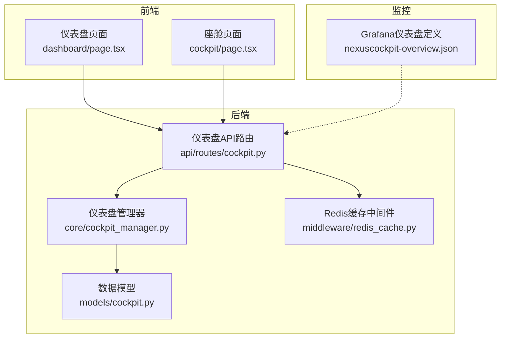
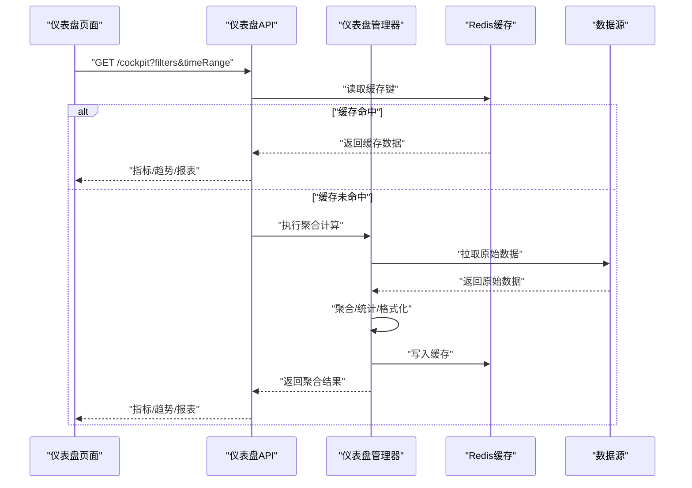
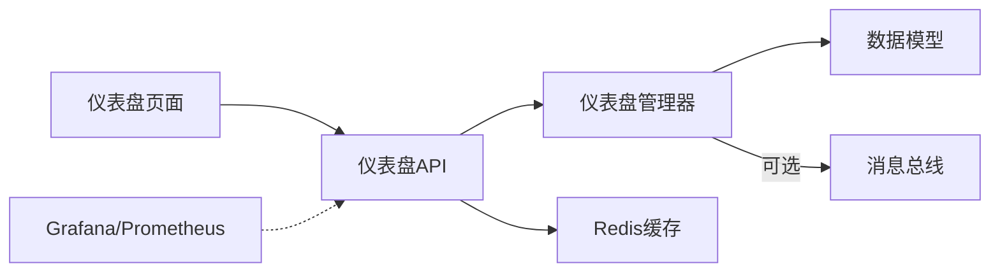
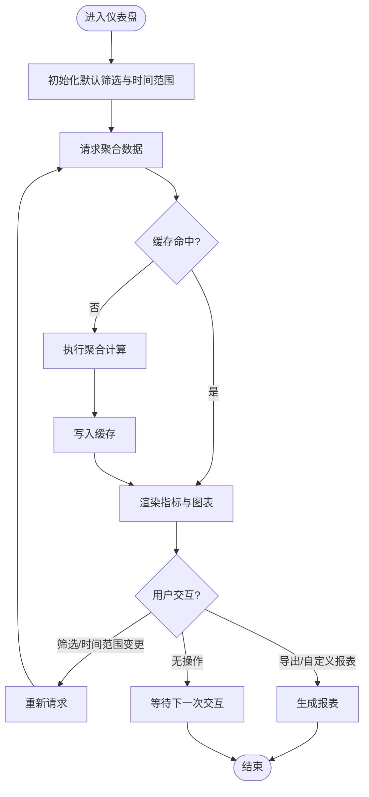

# 仪表盘页面

<cite>
**本文引用的文件**   
- [frontend_design/src/app/dashboard/page.tsx](file://frontend_design/src/app/dashboard/page.tsx)
- [frontend_design/src/app/cockpit/page.tsx](file://frontend_design/src/app/cockpit/page.tsx)
- [backend_design/nexus/api/routes/cockpit.py](file://backend_design/nexus/api/routes/cockpit.py)
- [backend_design/nexus/core/cockpit_manager.py](file://backend_design/nexus/core/cockpit_manager.py)
- [backend_design/nexus/models/cockpit.py](file://backend_design/nexus/models/cockpit.py)
- [backend_design/nexus/middleware/redis_cache.py](file://backend_design/nexus/middleware/redis_cache.py)
- [config/grafana/provisioning/dashboards/nexuscockpit-overview.json](file://config/grafana/provisioning/dashboards/nexuscockpit-overview.json)
</cite>

## 目录
1. [简介](#简介)
2. [项目结构](#项目结构)
3. [核心组件](#核心组件)
4. [架构总览](#架构总览)
5. [详细组件分析](#详细组件分析)
6. [依赖分析](#依赖分析)
7. [性能考虑](#性能考虑)
8. [故障排查指南](#故障排查指南)
9. [结论](#结论)
10. [附录](#附录)

## 简介
本文件面向NexusCockpit的仪表盘页面，聚焦业务数据展示能力与实现细节。内容覆盖关键业务指标、趋势分析与统计报表等核心特性；阐述数据聚合算法、图表渲染引擎与交互式数据分析流程；说明业务数据的获取策略、缓存机制与实时更新处理；并提供多维度筛选、时间范围选择与自定义报表生成的方案建议；最后给出大数据量下的性能优化与移动端适配策略。

## 项目结构
仪表盘功能由前端页面与后端API协同完成：
- 前端页面负责指标卡片、图表渲染、交互筛选与实时刷新
- 后端提供仪表盘数据接口，封装聚合逻辑、缓存与外部数据源访问
- Grafana配置用于系统级监控仪表盘的集成与展示

图示来源
- [frontend_design/src/app/dashboard/page.tsx](file://frontend_design/src/app/dashboard/page.tsx)
- [frontend_design/src/app/cockpit/page.tsx](file://frontend_design/src/app/cockpit/page.tsx)
- [backend_design/nexus/api/routes/cockpit.py](file://backend_design/nexus/api/routes/cockpit.py)
- [backend_design/nexus/core/cockpit_manager.py](file://backend_design/nexus/core/cockpit_manager.py)
- [backend_design/nexus/models/cockpit.py](file://backend_design/nexus/models/cockpit.py)
- [backend_design/nexus/middleware/redis_cache.py](file://backend_design/nexus/middleware/redis_cache.py)
- [config/grafana/provisioning/dashboards/nexuscockpit-overview.json](file://config/grafana/provisioning/dashboards/nexuscockpit-overview.json)

章节来源
- [frontend_design/src/app/dashboard/page.tsx](file://frontend_design/src/app/dashboard/page.tsx)
- [frontend_design/src/app/cockpit/page.tsx](file://frontend_design/src/app/cockpit/page.tsx)
- [backend_design/nexus/api/routes/cockpit.py](file://backend_design/nexus/api/routes/cockpit.py)
- [backend_design/nexus/core/cockpit_manager.py](file://backend_design/nexus/core/cockpit_manager.py)
- [backend_design/nexus/models/cockpit.py](file://backend_design/nexus/models/cockpit.py)
- [backend_design/nexus/middleware/redis_cache.py](file://backend_design/nexus/middleware/redis_cache.py)
- [config/grafana/provisioning/dashboards/nexuscockpit-overview.json](file://config/grafana/provisioning/dashboards/nexuscockpit-overview.json)

## 核心组件
- 仪表盘页面（前端）
  - 负责指标卡片布局、图表渲染、筛选控件与实时刷新
  - 通过API调用获取聚合后的指标与趋势数据
- 仪表盘API（后端）
  - 暴露REST接口供前端消费
  - 组合查询、聚合计算与缓存命中结果
- 仪表盘管理器（后端）
  - 编排数据拉取、聚合与格式化
  - 管理缓存键与失效策略
- 数据模型（后端）
  - 定义仪表盘返回的数据结构与校验规则
- Redis缓存（后端）
  - 提供高性能的热点指标缓存
- Grafana仪表盘（监控）
  - 提供系统运行态概览，与业务仪表盘互补

章节来源
- [frontend_design/src/app/dashboard/page.tsx](file://frontend_design/src/app/dashboard/page.tsx)
- [backend_design/nexus/api/routes/cockpit.py](file://backend_design/nexus/api/routes/cockpit.py)
- [backend_design/nexus/core/cockpit_manager.py](file://backend_design/nexus/core/cockpit_manager.py)
- [backend_design/nexus/models/cockpit.py](file://backend_design/nexus/models/cockpit.py)
- [backend_design/nexus/middleware/redis_cache.py](file://backend_design/nexus/middleware/redis_cache.py)
- [config/grafana/provisioning/dashboards/nexuscockpit-overview.json](file://config/grafana/provisioning/dashboards/nexuscockpit-overview.json)

## 架构总览
仪表盘整体采用前后端分离架构：前端以页面为入口，按需请求后端聚合接口；后端在管理器中协调数据源与缓存，最终返回标准化响应。Grafana作为独立监控视图，可复用同一数据源或指标体系。

图示来源
- [backend_design/nexus/api/routes/cockpit.py](file://backend_design/nexus/api/routes/cockpit.py)
- [backend_design/nexus/core/cockpit_manager.py](file://backend_design/nexus/core/cockpit_manager.py)
- [backend_design/nexus/middleware/redis_cache.py](file://backend_design/nexus/middleware/redis_cache.py)

## 详细组件分析

### 仪表盘页面（前端）
- 职责
  - 渲染关键业务指标卡片（如总量、同比、环比、转化率等）
  - 渲染趋势图、分布图、排行榜等可视化图表
  - 提供多维度筛选（维度、标签、状态）、时间范围选择器
  - 支持导出与自定义报表生成（基于当前筛选条件）
- 交互流程
  - 初始化时加载默认时间范围与筛选
  - 用户变更筛选或时间范围后触发增量更新
  - 对高频指标进行轮询或WebSocket订阅（若后端支持）
- 性能策略
  - 列表与图表数据分页/懒加载
  - 防抖/节流减少重复请求
  - 本地缓存最近一次查询结果，避免抖动

章节来源
- [frontend_design/src/app/dashboard/page.tsx](file://frontend_design/src/app/dashboard/page.tsx)

### 仪表盘API（后端）
- 职责
  - 解析查询参数（筛选、时间范围、分页、排序）
  - 构建缓存键并尝试命中
  - 未命中则委托管理器执行聚合
  - 统一错误码与响应格式
- 关键点
  - 参数校验与边界处理
  - 超时与熔断保护
  - 限流与鉴权（结合网关层）

章节来源
- [backend_design/nexus/api/routes/cockpit.py](file://backend_design/nexus/api/routes/cockpit.py)

### 仪表盘管理器（后端）
- 职责
  - 编排数据拉取、过滤、聚合与格式化
  - 维护缓存键策略与TTL
  - 提供可扩展的聚合插件点（按指标类型）
- 算法要点
  - 时间窗口聚合（日/周/月粒度）
  - 多维分组与Top-N排行
  - 同比/环比/移动平均等衍生指标
- 错误处理
  - 上游服务异常降级到最近可用缓存
  - 部分失败时的容错与告警

章节来源
- [backend_design/nexus/core/cockpit_manager.py](file://backend_design/nexus/core/cockpit_manager.py)

### 数据模型（后端）
- 职责
  - 定义仪表盘响应结构（指标、趋势、报表）
  - 字段约束与枚举值
  - 兼容历史版本的结构演进
- 设计原则
  - 稳定契约，向后兼容
  - 明确必填/可选字段与默认值

章节来源
- [backend_design/nexus/models/cockpit.py](file://backend_design/nexus/models/cockpit.py)

### Redis缓存（后端）
- 职责
  - 存储热点指标与聚合结果
  - 提供原子性读写与过期控制
- 策略
  - 基于“筛选+时间范围”的复合键
  - 分层TTL（短周期高频指标、长周期低频指标）
  - 缓存预热与批量更新

章节来源
- [backend_design/nexus/middleware/redis_cache.py](file://backend_design/nexus/middleware/redis_cache.py)

### Grafana仪表盘（监控）
- 职责
  - 展示系统运行态概览（CPU、内存、QPS、延迟等）
  - 与业务仪表盘形成互补视角
- 集成方式
  - 通过Prometheus数据源采集指标
  - 预置面板与告警规则

章节来源
- [config/grafana/provisioning/dashboards/nexuscockpit-overview.json](file://config/grafana/provisioning/dashboards/nexuscockpit-overview.json)

## 依赖分析
- 耦合关系
  - 仪表盘页面仅依赖API契约，不感知具体数据源
  - API与管理器解耦，便于替换聚合实现
  - 管理器依赖数据模型与缓存中间件
- 外部依赖
  - Redis用于缓存
  - Prometheus/Grafana用于监控
  - 可能的消息总线用于实时更新（若启用）

图示来源
- [frontend_design/src/app/dashboard/page.tsx](file://frontend_design/src/app/dashboard/page.tsx)
- [backend_design/nexus/api/routes/cockpit.py](file://backend_design/nexus/api/routes/cockpit.py)
- [backend_design/nexus/core/cockpit_manager.py](file://backend_design/nexus/core/cockpit_manager.py)
- [backend_design/nexus/models/cockpit.py](file://backend_design/nexus/models/cockpit.py)
- [backend_design/nexus/middleware/redis_cache.py](file://backend_design/nexus/middleware/redis_cache.py)
- [config/grafana/provisioning/dashboards/nexuscockpit-overview.json](file://config/grafana/provisioning/dashboards/nexuscockpit-overview.json)

章节来源
- [backend_design/nexus/api/routes/cockpit.py](file://backend_design/nexus/api/routes/cockpit.py)
- [backend_design/nexus/core/cockpit_manager.py](file://backend_design/nexus/core/cockpit_manager.py)
- [backend_design/nexus/models/cockpit.py](file://backend_design/nexus/models/cockpit.py)
- [backend_design/nexus/middleware/redis_cache.py](file://backend_design/nexus/middleware/redis_cache.py)
- [config/grafana/provisioning/dashboards/nexuscockpit-overview.json](file://config/grafana/provisioning/dashboards/nexuscockpit-overview.json)

## 性能考虑
- 数据聚合优化
  - 预聚合与物化视图：将高频指标提前计算并落盘
  - 增量聚合：基于事件流增量更新，降低全量扫描
  - 采样与降采样：对长周期趋势使用合理采样率
- 缓存与一致性
  - 多级缓存：浏览器本地缓存 + Redis热点缓存
  - 缓存键规范化：确保筛选与时间范围变化能正确失效
  - 写扩散与读扩散权衡：热点指标采用广播式更新
- 传输与渲染
  - 分页与虚拟滚动：大列表与长时序数据按需加载
  - 增量更新：仅推送差异数据，减少带宽
  - 图表按需渲染：首屏只渲染关键指标，其余懒加载
- 并发与稳定性
  - 限流与熔断：防止雪崩
  - 超时与重试：对上游不稳定服务的保护
  - 降级策略：缓存兜底与静态占位

[本节为通用性能指导，无需特定文件引用]

## 故障排查指南
- 常见问题定位
  - 指标缺失或不一致：检查缓存键是否包含完整筛选条件；核对聚合窗口与时间戳对齐
  - 接口超时：查看上游数据源健康度与慢查询日志；评估是否需要扩容或引入物化视图
  - 图表闪烁或卡顿：确认是否频繁重渲染；检查是否开启增量更新与虚拟滚动
- 诊断手段
  - 打开网络面板观察请求频率与大小
  - 查看Redis命中率与TTL设置
  - 对比Grafana监控指标与业务指标差异
- 恢复策略
  - 清理异常缓存键并预热
  - 切换至只读模式或降级到最近可用快照
  - 临时放宽筛选范围以提升可用性

章节来源
- [backend_design/nexus/api/routes/cockpit.py](file://backend_design/nexus/api/routes/cockpit.py)
- [backend_design/nexus/core/cockpit_manager.py](file://backend_design/nexus/core/cockpit_manager.py)
- [backend_design/nexus/middleware/redis_cache.py](file://backend_design/nexus/middleware/redis_cache.py)

## 结论
仪表盘页面通过清晰的前后端分工与缓存策略，实现了高可用的业务数据展示。建议在后续迭代中持续完善增量聚合、实时更新与移动端体验，并结合Grafana监控形成端到端的可观测闭环。

[本节为总结性内容，无需特定文件引用]

## 附录

### 关键业务流程（流程图）

[该图为概念流程示意，无需图示来源]

### 移动端适配策略
- 布局与交互
  - 自适应网格与卡片堆叠
  - 触摸友好的筛选控件与大点击区域
  - 手势滑动切换时间范围
- 性能与体验
  - 首屏最小化渲染集
  - 图片与矢量图按需加载
  - 离线缓存关键指标快照
- 兼容性
  - 低分辨率适配与字体缩放
  - 弱网环境下的降级与提示

[本节为通用适配建议，无需特定文件引用]