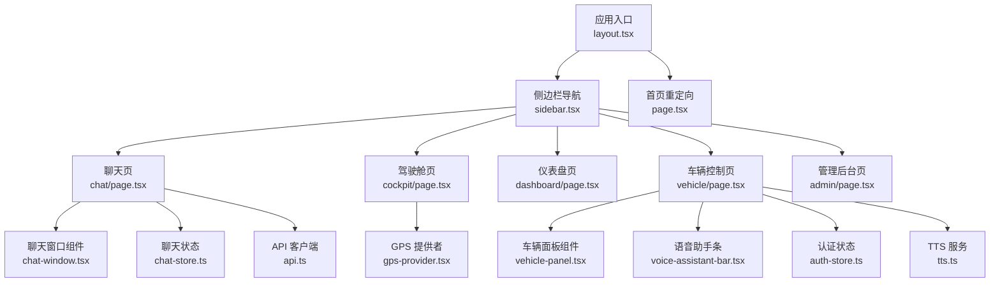
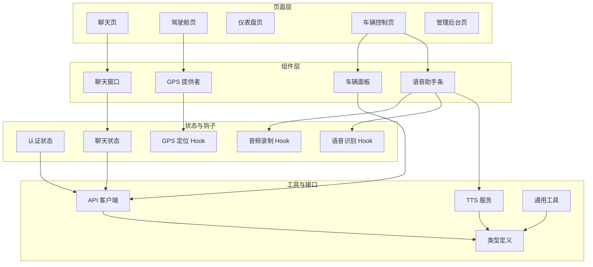
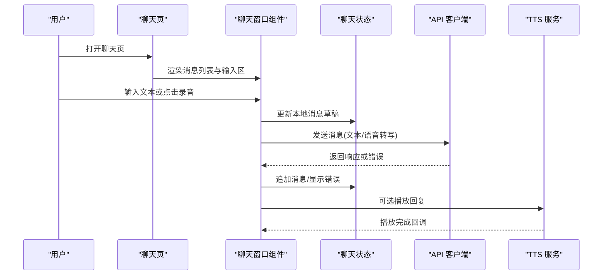
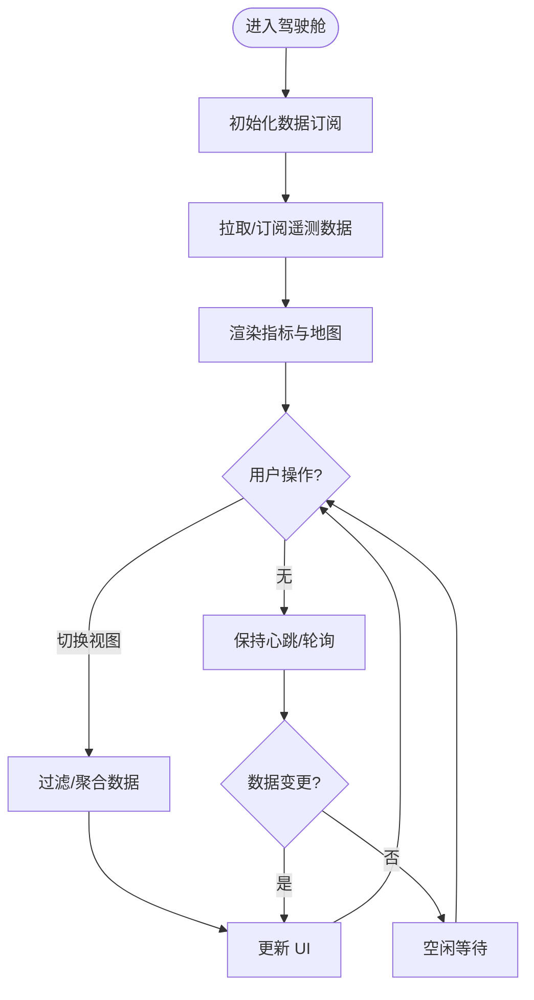
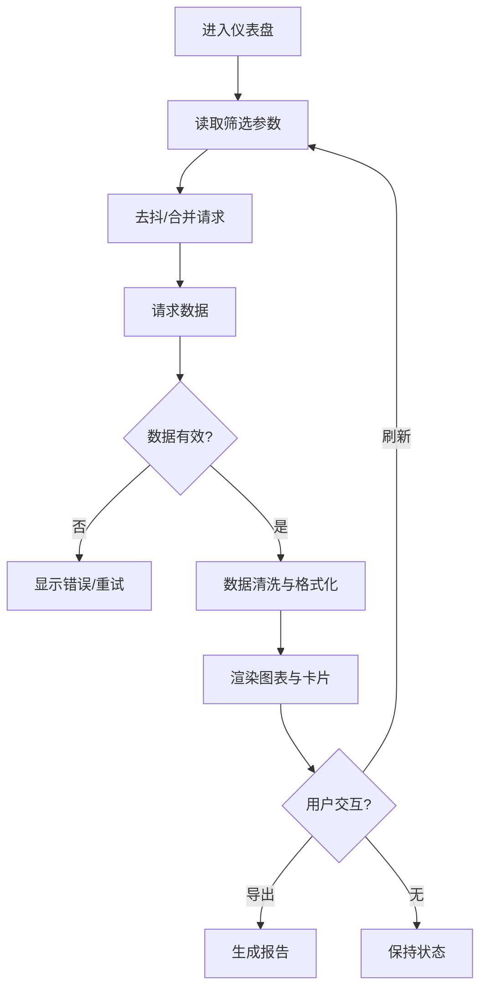
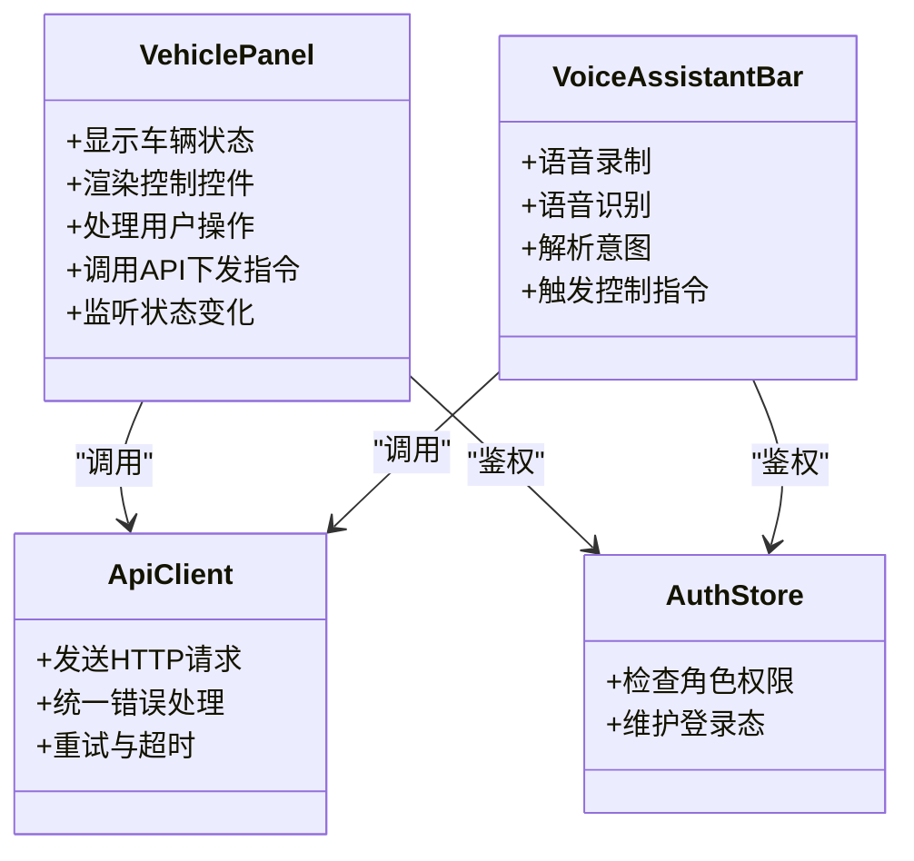
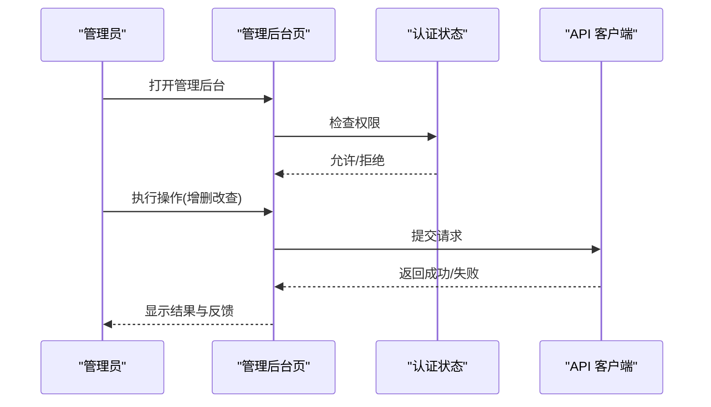
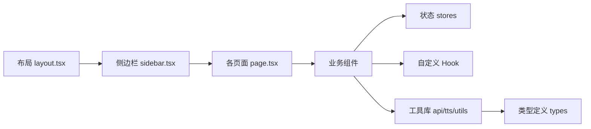

# 核心页面组件

<cite>
**本文引用的文件**   
- [frontend_design/src/app/layout.tsx](file://frontend_design/src/app/layout.tsx)
- [frontend_design/src/app/page.tsx](file://frontend_design/src/app/page.tsx)
- [frontend_design/src/app/chat/page.tsx](file://frontend_design/src/app/chat/page.tsx)
- [frontend_design/src/app/cockpit/page.tsx](file://frontend_design/src/app/cockpit/page.tsx)
- [frontend_design/src/app/dashboard/page.tsx](file://frontend_design/src/app/dashboard/page.tsx)
- [frontend_design/src/app/vehicle/page.tsx](file://frontend_design/src/app/vehicle/page.tsx)
- [frontend_design/src/app/admin/page.tsx](file://frontend_design/src/app/admin/page.tsx)
- [frontend_design/src/components/layout/sidebar.tsx](file://frontend_design/src/components/layout/sidebar.tsx)
- [frontend_design/src/components/layout/gps-provider.tsx](file://frontend_design/src/components/layout/gps-provider.tsx)
- [frontend_design/src/components/chat/chat-window.tsx](file://frontend_design/src/components/chat/chat-window.tsx)
- [frontend_design/src/components/vehicle/vehicle-panel.tsx](file://frontend_design/src/components/vehicle/vehicle-panel.tsx)
- [frontend_design/src/components/vehicle/voice-assistant-bar.tsx](file://frontend_design/src/components/vehicle/voice-assistant-bar.tsx)
- [frontend_design/src/stores/auth-store.ts](file://frontend_design/src/stores/auth-store.ts)
- [frontend_design/src/stores/chat-store.ts](file://frontend_design/src/stores/chat-store.ts)
- [frontend_design/src/hooks/use-audio-recorder.ts](file://frontend_design/src/hooks/use-audio-recorder.ts)
- [frontend_design/src/hooks/use-speech-recognition.ts](file://frontend_design/src/hooks/use-speech-recognition.ts)
- [frontend_design/src/hooks/use-gps-location.ts](file://frontend_design/src/hooks/use-gps-location.ts)
- [frontend_design/src/lib/api.ts](file://frontend_design/src/lib/api.ts)
- [frontend_design/src/lib/tts.ts](file://frontend_design/src/lib/tts.ts)
- [frontend_design/src/lib/utils.ts](file://frontend_design/src/lib/utils.ts)
- [frontend_design/src/types/index.ts](file://frontend_design/src/types/index.ts)
</cite>

## 目录
1. [简介](#简介)
2. [项目结构](#项目结构)
3. [核心组件](#核心组件)
4. [架构总览](#架构总览)
5. [详细组件分析](#详细组件分析)
6. [依赖分析](#依赖分析)
7. [性能考虑](#性能考虑)
8. [故障排查指南](#故障排查指南)
9. [结论](#结论)
10. [附录](#附录)

## 简介
本文件聚焦于 NexusCockpit 前端的核心页面组件，覆盖聊天界面、驾驶舱监控、仪表盘、车辆控制与管理后台等关键页面。文档从功能特性、用户交互流程、数据处理逻辑、状态管理、数据获取策略、错误处理机制、页面导航与权限控制、响应式设计实现等方面展开，并提供可视化架构图与流程图，帮助读者快速理解并高效扩展这些页面。

## 项目结构
前端采用 Next.js App Router 组织页面，按“页面 + 组件 + 状态 + 钩子 + 工具库”的层次划分：
- 页面层：app 目录下各路由对应的 page.tsx
- 布局与导航：layout.tsx 与 sidebar.tsx
- 业务组件：chat、vehicle 等模块下的可复用组件
- 状态管理：stores 中的轻量全局状态
- 自定义 Hook：use-audio-recorder、use-speech-recognition、use-gps-location 等
- 工具库：api、tts、utils、types

图表来源
- [frontend_design/src/app/layout.tsx](file://frontend_design/src/app/layout.tsx)
- [frontend_design/src/app/page.tsx](file://frontend_design/src/app/page.tsx)
- [frontend_design/src/components/layout/sidebar.tsx](file://frontend_design/src/components/layout/sidebar.tsx)
- [frontend_design/src/app/chat/page.tsx](file://frontend_design/src/app/chat/page.tsx)
- [frontend_design/src/app/cockpit/page.tsx](file://frontend_design/src/app/cockpit/page.tsx)
- [frontend_design/src/app/dashboard/page.tsx](file://frontend_design/src/app/dashboard/page.tsx)
- [frontend_design/src/app/vehicle/page.tsx](file://frontend_design/src/app/vehicle/page.tsx)
- [frontend_design/src/app/admin/page.tsx](file://frontend_design/src/app/admin/page.tsx)
- [frontend_design/src/components/chat/chat-window.tsx](file://frontend_design/src/components/chat/chat-window.tsx)
- [frontend_design/src/components/vehicle/vehicle-panel.tsx](file://frontend_design/src/components/vehicle/vehicle-panel.tsx)
- [frontend_design/src/components/vehicle/voice-assistant-bar.tsx](file://frontend_design/src/components/vehicle/voice-assistant-bar.tsx)
- [frontend_design/src/stores/auth-store.ts](file://frontend_design/src/stores/auth-store.ts)
- [frontend_design/src/stores/chat-store.ts](file://frontend_design/src/stores/chat-store.ts)
- [frontend_design/src/components/layout/gps-provider.tsx](file://frontend_design/src/components/layout/gps-provider.tsx)
- [frontend_design/src/lib/api.ts](file://frontend_design/src/lib/api.ts)
- [frontend_design/src/lib/tts.ts](file://frontend_design/src/lib/tts.ts)

章节来源
- [frontend_design/src/app/layout.tsx](file://frontend_design/src/app/layout.tsx)
- [frontend_design/src/app/page.tsx](file://frontend_design/src/app/page.tsx)
- [frontend_design/src/components/layout/sidebar.tsx](file://frontend_design/src/components/layout/sidebar.tsx)

## 核心组件
本节概述各核心页面的职责与交互要点：
- 聊天界面：消息列表、输入框、语音录制与识别、TTS 播放、会话持久化与错误重试
- 驾驶舱监控：实时车辆遥测、地图/GPS 定位、告警提示、指标刷新策略
- 仪表盘：关键指标卡片、图表渲染、分页/筛选、缓存与增量更新
- 车辆控制：设备能力展示、指令下发、状态同步、权限校验与失败回滚
- 管理后台：用户/租户管理、配置项编辑、审计日志、批量操作与确认

章节来源
- [frontend_design/src/app/chat/page.tsx](file://frontend_design/src/app/chat/page.tsx)
- [frontend_design/src/app/cockpit/page.tsx](file://frontend_design/src/app/cockpit/page.tsx)
- [frontend_design/src/app/dashboard/page.tsx](file://frontend_design/src/app/dashboard/page.tsx)
- [frontend_design/src/app/vehicle/page.tsx](file://frontend_design/src/app/vehicle/page.tsx)
- [frontend_design/src/app/admin/page.tsx](file://frontend_design/src/app/admin/page.tsx)

## 架构总览
前端整体采用“页面 -> 组件 -> 状态/Hook -> 工具库/API”的分层模式。页面负责路由与组合，组件封装 UI 与局部交互，状态集中管理跨组件数据，Hook 封装浏览器能力与副作用，工具库统一网络请求与通用逻辑。

图表来源
- [frontend_design/src/app/chat/page.tsx](file://frontend_design/src/app/chat/page.tsx)
- [frontend_design/src/app/cockpit/page.tsx](file://frontend_design/src/app/cockpit/page.tsx)
- [frontend_design/src/app/dashboard/page.tsx](file://frontend_design/src/app/dashboard/page.tsx)
- [frontend_design/src/app/vehicle/page.tsx](file://frontend_design/src/app/vehicle/page.tsx)
- [frontend_design/src/app/admin/page.tsx](file://frontend_design/src/app/admin/page.tsx)
- [frontend_design/src/components/chat/chat-window.tsx](file://frontend_design/src/components/chat/chat-window.tsx)
- [frontend_design/src/components/vehicle/vehicle-panel.tsx](file://frontend_design/src/components/vehicle/vehicle-panel.tsx)
- [frontend_design/src/components/vehicle/voice-assistant-bar.tsx](file://frontend_design/src/components/vehicle/voice-assistant-bar.tsx)
- [frontend_design/src/components/layout/gps-provider.tsx](file://frontend_design/src/components/layout/gps-provider.tsx)
- [frontend_design/src/stores/auth-store.ts](file://frontend_design/src/stores/auth-store.ts)
- [frontend_design/src/stores/chat-store.ts](file://frontend_design/src/stores/chat-store.ts)
- [frontend_design/src/hooks/use-audio-recorder.ts](file://frontend_design/src/hooks/use-audio-recorder.ts)
- [frontend_design/src/hooks/use-speech-recognition.ts](file://frontend_design/src/hooks/use-speech-recognition.ts)
- [frontend_design/src/hooks/use-gps-location.ts](file://frontend_design/src/hooks/use-gps-location.ts)
- [frontend_design/src/lib/api.ts](file://frontend_design/src/lib/api.ts)
- [frontend_design/src/lib/tts.ts](file://frontend_design/src/lib/tts.ts)
- [frontend_design/src/lib/utils.ts](file://frontend_design/src/lib/utils.ts)
- [frontend_design/src/types/index.ts](file://frontend_design/src/types/index.ts)

## 详细组件分析

### 聊天界面（Chat）
- 功能特性
  - 消息列表与滚动加载
  - 文本输入与快捷模板
  - 语音录制、转写与发送
  - TTS 播报与进度反馈
  - 会话历史加载与错误重试
- 用户交互流程
  - 用户输入或录音 -> 触发识别 -> 构建消息 -> 调用 API -> 渲染结果 -> 可选 TTS 播放
- 数据处理逻辑
  - 使用聊天状态存储消息与会话上下文
  - 通过 API 客户端发起请求，统一错误处理与重试
  - 语音识别与 TTS 通过独立 Hook/服务解耦
- 状态管理与数据获取
  - 聊天状态集中管理，避免重复请求
  - 首次加载拉取历史，后续增量追加
- 错误处理
  - 网络异常、识别失败、TTS 不可用等场景提供降级与提示
- 导航与权限
  - 通过侧边栏进入；若未登录则跳转至登录态检查（由认证状态驱动）
- 响应式设计与体验优化
  - 移动端优先的消息气泡布局
  - 长列表虚拟滚动建议（如数据量大）
  - 语音录制时禁用输入，避免冲突

图表来源
- [frontend_design/src/app/chat/page.tsx](file://frontend_design/src/app/chat/page.tsx)
- [frontend_design/src/components/chat/chat-window.tsx](file://frontend_design/src/components/chat/chat-window.tsx)
- [frontend_design/src/stores/chat-store.ts](file://frontend_design/src/stores/chat-store.ts)
- [frontend_design/src/lib/api.ts](file://frontend_design/src/lib/api.ts)
- [frontend_design/src/lib/tts.ts](file://frontend_design/src/lib/tts.ts)

章节来源
- [frontend_design/src/app/chat/page.tsx](file://frontend_design/src/app/chat/page.tsx)
- [frontend_design/src/components/chat/chat-window.tsx](file://frontend_design/src/components/chat/chat-window.tsx)
- [frontend_design/src/stores/chat-store.ts](file://frontend_design/src/stores/chat-store.ts)
- [frontend_design/src/lib/api.ts](file://frontend_design/src/lib/api.ts)
- [frontend_design/src/lib/tts.ts](file://frontend_design/src/lib/tts.ts)

### 驾驶舱监控（Cockpit）
- 功能特性
  - 实时遥测数据展示（速度、电量、温度等）
  - GPS 定位与轨迹回放
  - 告警事件流与通知
- 用户交互流程
  - 页面初始化订阅数据源 -> 渲染指标与地图 -> 用户切换视图/筛选条件 -> 重新拉取或过滤
- 数据处理逻辑
  - 使用 GPS 提供者统一管理定位信息
  - 定时轮询或 WebSocket 推送（根据后端能力）
- 状态管理与数据获取
  - 指标数据在组件内或共享状态中缓存，减少重复请求
  - 断线重连与指数退避策略
- 错误处理
  - 定位失败、数据缺失、超时等场景提供占位与重试
- 导航与权限
  - 仅授权用户可见；支持从其他页面跳转到指定指标锚点
- 响应式设计与体验优化
  - 大屏适配与网格布局
  - 关键指标高亮与颜色编码

图表来源
- [frontend_design/src/app/cockpit/page.tsx](file://frontend_design/src/app/cockpit/page.tsx)
- [frontend_design/src/components/layout/gps-provider.tsx](file://frontend_design/src/components/layout/gps-provider.tsx)
- [frontend_design/src/hooks/use-gps-location.ts](file://frontend_design/src/hooks/use-gps-location.ts)
- [frontend_design/src/lib/api.ts](file://frontend_design/src/lib/api.ts)

章节来源
- [frontend_design/src/app/cockpit/page.tsx](file://frontend_design/src/app/cockpit/page.tsx)
- [frontend_design/src/components/layout/gps-provider.tsx](file://frontend_design/src/components/layout/gps-provider.tsx)
- [frontend_design/src/hooks/use-gps-location.ts](file://frontend_design/src/hooks/use-gps-location.ts)
- [frontend_design/src/lib/api.ts](file://frontend_design/src/lib/api.ts)

### 仪表盘（Dashboard）
- 功能特性
  - 关键指标卡片、趋势图、对比图
  - 时间范围选择、维度筛选、分页加载
- 用户交互流程
  - 选择时间范围/维度 -> 触发查询 -> 渲染图表 -> 导出或分享
- 数据处理逻辑
  - 参数标准化与去抖，避免频繁请求
  - 图表数据预处理（归一化、空值填充）
- 状态管理与数据获取
  - 查询参数与结果缓存，支持撤销/恢复
- 错误处理
  - 空数据、格式异常、网络错误的友好提示
- 导航与权限
  - 支持深链接到特定看板
- 响应式设计与体验优化
  - 自适应图表尺寸与字体
  - 懒加载与骨架屏

图表来源
- [frontend_design/src/app/dashboard/page.tsx](file://frontend_design/src/app/dashboard/page.tsx)
- [frontend_design/src/lib/api.ts](file://frontend_design/src/lib/api.ts)
- [frontend_design/src/lib/utils.ts](file://frontend_design/src/lib/utils.ts)

章节来源
- [frontend_design/src/app/dashboard/page.tsx](file://frontend_design/src/app/dashboard/page.tsx)
- [frontend_design/src/lib/api.ts](file://frontend_design/src/lib/api.ts)
- [frontend_design/src/lib/utils.ts](file://frontend_design/src/lib/utils.ts)

### 车辆控制（Vehicle）
- 功能特性
  - 车辆状态概览、能力清单、远程控制（空调、车窗、座椅等）
  - 语音助手快捷指令
- 用户交互流程
  - 查看状态 -> 选择控制项 -> 权限校验 -> 下发指令 -> 状态同步与反馈
- 数据处理逻辑
  - 指令幂等与回滚策略
  - 状态轮询/事件订阅确保一致性
- 状态管理与数据获取
  - 车辆能力与当前状态缓存，避免重复查询
- 错误处理
  - 设备离线、权限不足、执行失败的明确提示与重试
- 导航与权限
  - 基于角色的访问控制（RBAC），未授权隐藏敏感控制
- 响应式设计与体验优化
  - 触控友好的大按钮与滑块
  - 操作前二次确认与动画反馈

图表来源
- [frontend_design/src/components/vehicle/vehicle-panel.tsx](file://frontend_design/src/components/vehicle/vehicle-panel.tsx)
- [frontend_design/src/components/vehicle/voice-assistant-bar.tsx](file://frontend_design/src/components/vehicle/voice-assistant-bar.tsx)
- [frontend_design/src/stores/auth-store.ts](file://frontend_design/src/stores/auth-store.ts)
- [frontend_design/src/lib/api.ts](file://frontend_design/src/lib/api.ts)

章节来源
- [frontend_design/src/app/vehicle/page.tsx](file://frontend_design/src/app/vehicle/page.tsx)
- [frontend_design/src/components/vehicle/vehicle-panel.tsx](file://frontend_design/src/components/vehicle/vehicle-panel.tsx)
- [frontend_design/src/components/vehicle/voice-assistant-bar.tsx](file://frontend_design/src/components/vehicle/voice-assistant-bar.tsx)
- [frontend_design/src/stores/auth-store.ts](file://frontend_design/src/stores/auth-store.ts)
- [frontend_design/src/lib/api.ts](file://frontend_design/src/lib/api.ts)

### 管理后台（Admin）
- 功能特性
  - 用户与租户管理、配置项编辑、审计日志查看
  - 批量操作与导入导出
- 用户交互流程
  - 进入后台 -> 选择模块 -> 编辑/审核 -> 提交 -> 结果反馈
- 数据处理逻辑
  - 表单校验、差异计算、并发保护
- 状态管理与数据获取
  - 列表分页与搜索缓存
  - 操作结果乐观更新与回滚
- 错误处理
  - 字段级错误提示、全局错误边界
- 导航与权限
  - 严格的路由守卫与菜单权限
- 响应式设计与体验优化
  - 表格横向滚动与列宽自适应
  - 批量操作的进度条与取消

图表来源
- [frontend_design/src/app/admin/page.tsx](file://frontend_design/src/app/admin/page.tsx)
- [frontend_design/src/stores/auth-store.ts](file://frontend_design/src/stores/auth-store.ts)
- [frontend_design/src/lib/api.ts](file://frontend_design/src/lib/api.ts)

章节来源
- [frontend_design/src/app/admin/page.tsx](file://frontend_design/src/app/admin/page.tsx)
- [frontend_design/src/stores/auth-store.ts](file://frontend_design/src/stores/auth-store.ts)
- [frontend_design/src/lib/api.ts](file://frontend_design/src/lib/api.ts)

## 依赖分析
- 页面与组件耦合度低，通过 props 与状态传递数据
- 状态集中在 stores，避免分散的 useEffect 导致的状态不一致
- Hook 封装浏览器能力，降低页面复杂度
- API 客户端统一拦截器，便于鉴权、重试与埋点

图表来源
- [frontend_design/src/app/layout.tsx](file://frontend_design/src/app/layout.tsx)
- [frontend_design/src/components/layout/sidebar.tsx](file://frontend_design/src/components/layout/sidebar.tsx)
- [frontend_design/src/app/chat/page.tsx](file://frontend_design/src/app/chat/page.tsx)
- [frontend_design/src/app/cockpit/page.tsx](file://frontend_design/src/app/cockpit/page.tsx)
- [frontend_design/src/app/dashboard/page.tsx](file://frontend_design/src/app/dashboard/page.tsx)
- [frontend_design/src/app/vehicle/page.tsx](file://frontend_design/src/app/vehicle/page.tsx)
- [frontend_design/src/app/admin/page.tsx](file://frontend_design/src/app/admin/page.tsx)
- [frontend_design/src/stores/auth-store.ts](file://frontend_design/src/stores/auth-store.ts)
- [frontend_design/src/stores/chat-store.ts](file://frontend_design/src/stores/chat-store.ts)
- [frontend_design/src/hooks/use-audio-recorder.ts](file://frontend_design/src/hooks/use-audio-recorder.ts)
- [frontend_design/src/hooks/use-speech-recognition.ts](file://frontend_design/src/hooks/use-speech-recognition.ts)
- [frontend_design/src/hooks/use-gps-location.ts](file://frontend_design/src/hooks/use-gps-location.ts)
- [frontend_design/src/lib/api.ts](file://frontend_design/src/lib/api.ts)
- [frontend_design/src/lib/tts.ts](file://frontend_design/src/lib/tts.ts)
- [frontend_design/src/lib/utils.ts](file://frontend_design/src/lib/utils.ts)
- [frontend_design/src/types/index.ts](file://frontend_design/src/types/index.ts)

章节来源
- [frontend_design/src/app/layout.tsx](file://frontend_design/src/app/layout.tsx)
- [frontend_design/src/components/layout/sidebar.tsx](file://frontend_design/src/components/layout/sidebar.tsx)
- [frontend_design/src/stores/auth-store.ts](file://frontend_design/src/stores/auth-store.ts)
- [frontend_design/src/stores/chat-store.ts](file://frontend_design/src/stores/chat-store.ts)
- [frontend_design/src/lib/api.ts](file://frontend_design/src/lib/api.ts)
- [frontend_design/src/types/index.ts](file://frontend_design/src/types/index.ts)

## 性能考虑
- 列表与图表
  - 使用虚拟滚动与按需渲染，避免大数据量卡顿
  - 图表数据降采样与增量更新
- 网络请求
  - 请求去抖与合并，避免抖动风暴
  - 缓存策略：内存缓存 + 短期磁盘缓存
  - 重试与退避：指数退避与最大重试次数
- 媒体处理
  - 语音录制分段上传与压缩
  - TTS 流式播放与预加载
- 渲染优化
  - React.memo 包裹高频组件
  - 拆分路由与懒加载页面
- 资源与样式
  - 图片与图标按需加载与 CDN 加速
  - Tailwind 类名去重与最小化

[本节为通用指导，不直接分析具体文件]

## 故障排查指南
- 常见问题
  - 语音识别失败：检查麦克风权限、浏览器兼容性、网络状况
  - TTS 无法播放：检查音频策略与自动播放限制
  - 定位失败：检查浏览器定位权限与 HTTPS 环境
  - 权限不足：检查认证状态与角色配置
- 调试建议
  - 在 API 客户端添加请求/响应日志
  - 对关键 Hook 增加状态快照与错误堆栈
  - 使用浏览器开发者工具的 Performance 面板分析渲染瓶颈

章节来源
- [frontend_design/src/hooks/use-audio-recorder.ts](file://frontend_design/src/hooks/use-audio-recorder.ts)
- [frontend_design/src/hooks/use-speech-recognition.ts](file://frontend_design/src/hooks/use-speech-recognition.ts)
- [frontend_design/src/hooks/use-gps-location.ts](file://frontend_design/src/hooks/use-gps-location.ts)
- [frontend_design/src/lib/api.ts](file://frontend_design/src/lib/api.ts)
- [frontend_design/src/lib/tts.ts](file://frontend_design/src/lib/tts.ts)
- [frontend_design/src/stores/auth-store.ts](file://frontend_design/src/stores/auth-store.ts)

## 结论
NexusCockpit 的前端以清晰的页面-组件-状态-钩子-工具分层组织，实现了聊天、驾驶舱、仪表盘、车辆控制与管理后台等核心页面。通过统一的状态管理与 API 客户端，系统具备良好的可维护性与可扩展性。建议在后续迭代中持续优化大数据渲染、网络健壮性与用户体验细节，进一步提升稳定性与性能。

[本节为总结，不直接分析具体文件]

## 附录
- 术语
  - TTS：文本转语音
  - ASR：自动语音识别
  - RBAC：基于角色的访问控制
- 参考路径
  - 页面入口与布局：[frontend_design/src/app/layout.tsx](file://frontend_design/src/app/layout.tsx)、[frontend_design/src/app/page.tsx](file://frontend_design/src/app/page.tsx)
  - 导航与侧边栏：[frontend_design/src/components/layout/sidebar.tsx](file://frontend_design/src/components/layout/sidebar.tsx)
  - 聊天相关：[frontend_design/src/app/chat/page.tsx](file://frontend_design/src/app/chat/page.tsx)、[frontend_design/src/components/chat/chat-window.tsx](file://frontend_design/src/components/chat/chat-window.tsx)、[frontend_design/src/stores/chat-store.ts](file://frontend_design/src/stores/chat-store.ts)
  - 驾驶舱与定位：[frontend_design/src/app/cockpit/page.tsx](file://frontend_design/src/app/cockpit/page.tsx)、[frontend_design/src/components/layout/gps-provider.tsx](file://frontend_design/src/components/layout/gps-provider.tsx)、[frontend_design/src/hooks/use-gps-location.ts](file://frontend_design/src/hooks/use-gps-location.ts)
  - 仪表盘：[frontend_design/src/app/dashboard/page.tsx](file://frontend_design/src/app/dashboard/page.tsx)
  - 车辆控制与语音：[frontend_design/src/app/vehicle/page.tsx](file://frontend_design/src/app/vehicle/page.tsx)、[frontend_design/src/components/vehicle/vehicle-panel.tsx](file://frontend_design/src/components/vehicle/vehicle-panel.tsx)、[frontend_design/src/components/vehicle/voice-assistant-bar.tsx](file://frontend_design/src/components/vehicle/voice-assistant-bar.tsx)
  - 管理后台：[frontend_design/src/app/admin/page.tsx](file://frontend_design/src/app/admin/page.tsx)
  - 认证与工具：[frontend_design/src/stores/auth-store.ts](file://frontend_design/src/stores/auth-store.ts)、[frontend_design/src/lib/api.ts](file://frontend_design/src/lib/api.ts)、[frontend_design/src/lib/tts.ts](file://frontend_design/src/lib/tts.ts)、[frontend_design/src/lib/utils.ts](file://frontend_design/src/lib/utils.ts)、[frontend_design/src/types/index.ts](file://frontend_design/src/types/index.ts)