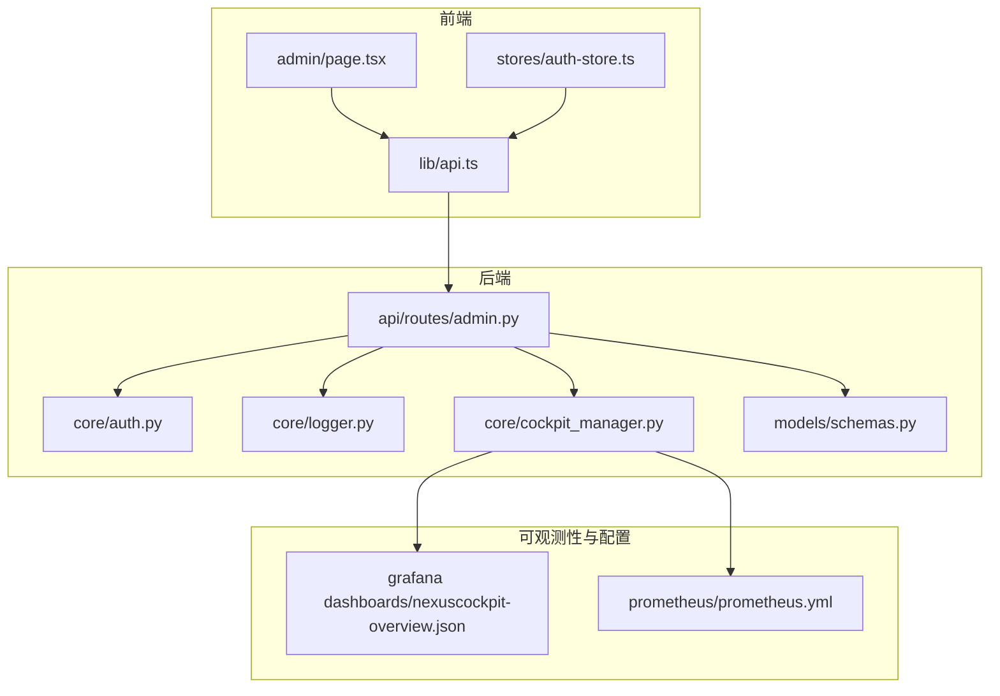
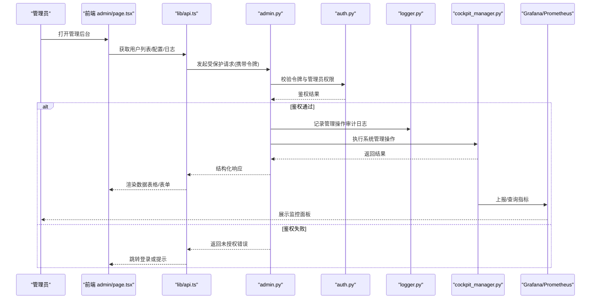
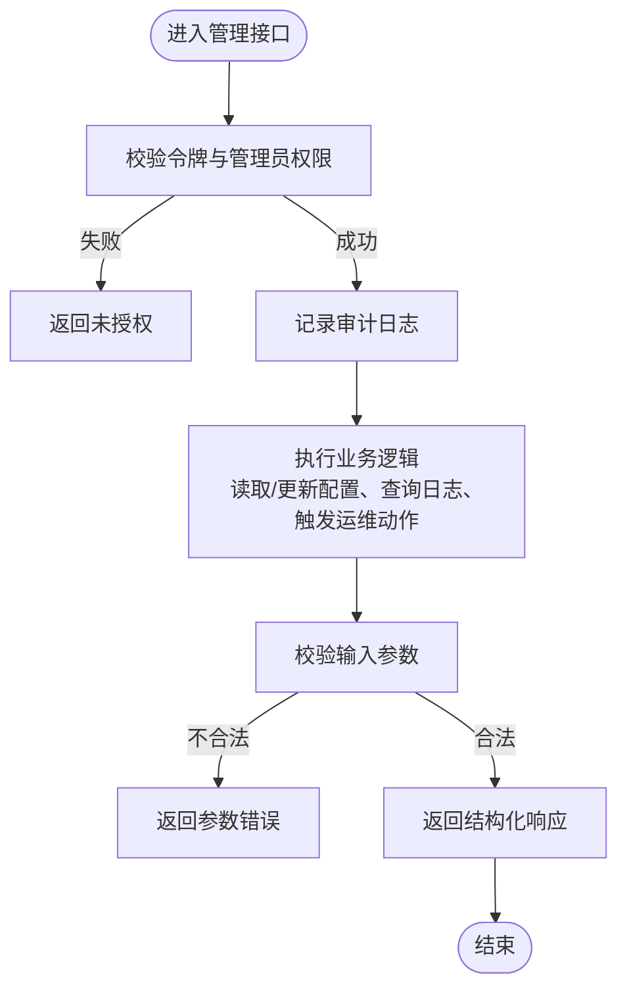
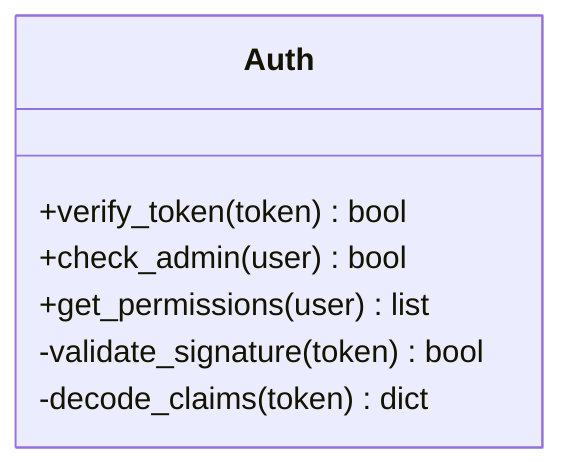
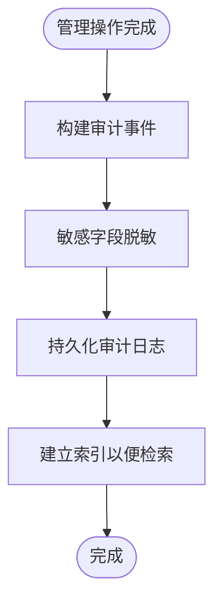
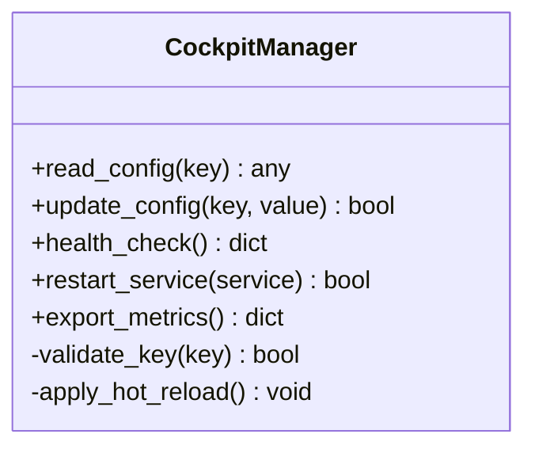
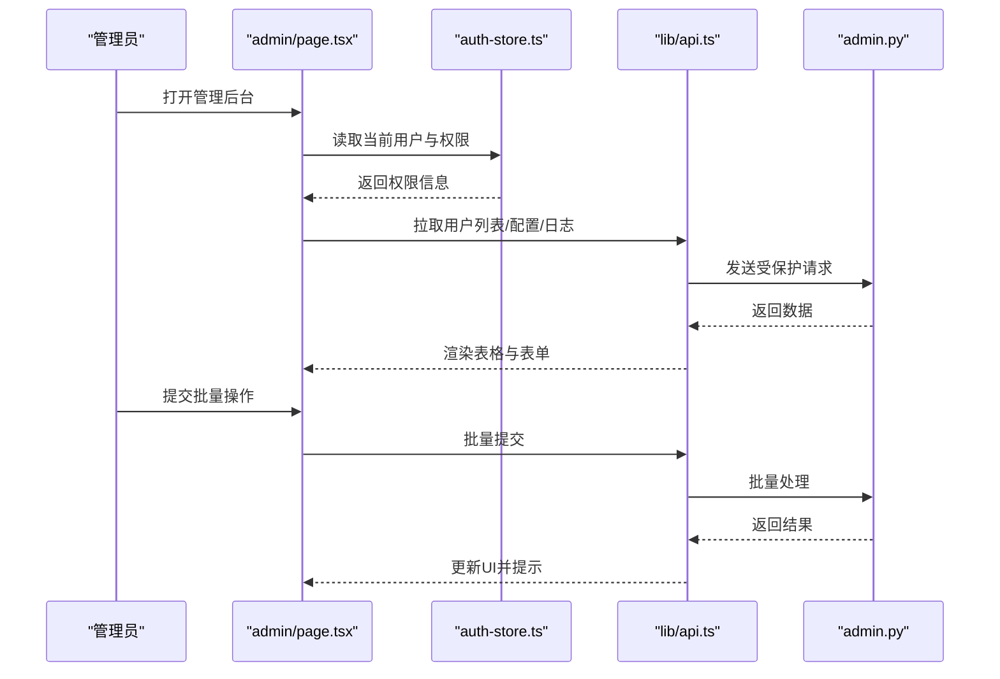
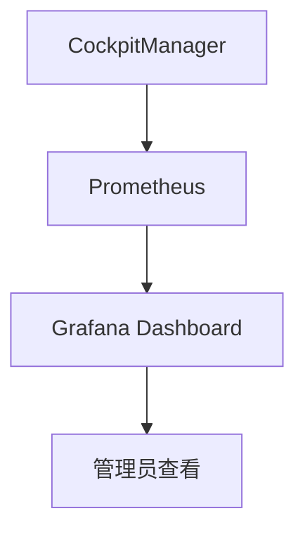
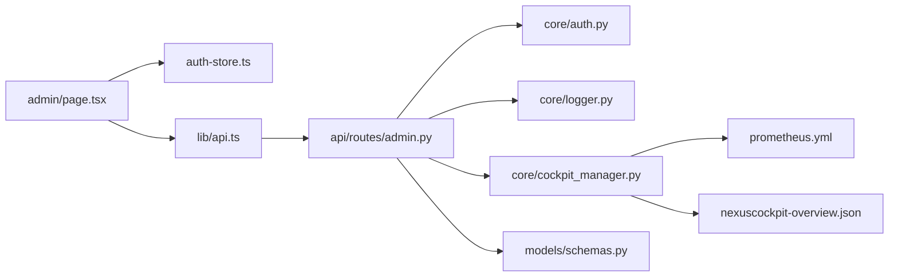

# 管理后台页面

<cite>
**本文引用的文件**   
- [backend_design/nexus/api/routes/admin.py](file://backend_design/nexus/api/routes/admin.py)
- [backend_design/nexus/core/auth.py](file://backend_design/nexus/core/auth.py)
- [backend_design/nexus/core/logger.py](file://backend_design/nexus/core/logger.py)
- [backend_design/nexus/core/cockpit_manager.py](file://backend_design/nexus/core/cockpit_manager.py)
- [backend_design/nexus/models/schemas.py](file://backend_design/nexus/models/schemas.py)
- [frontend_design/src/app/admin/page.tsx](file://frontend_design/src/app/admin/page.tsx)
- [frontend_design/src/stores/auth-store.ts](file://frontend_design/src/stores/auth-store.ts)
- [frontend_design/src/lib/api.ts](file://frontend_design/src/lib/api.ts)
- [config/grafana/provisioning/dashboards/nexuscockpit-overview.json](file://config/grafana/provisioning/dashboards/nexuscockpit-overview.json)
- [config/prometheus/prometheus.yml](file://config/prometheus/prometheus.yml)
</cite>

## 目录
1. [简介](#简介)
2. [项目结构](#项目结构)
3. [核心组件](#核心组件)
4. [架构总览](#架构总览)
5. [详细组件分析](#详细组件分析)
6. [依赖关系分析](#依赖关系分析)
7. [性能考虑](#性能考虑)
8. [故障排查指南](#故障排查指南)
9. [结论](#结论)
10. [附录](#附录)

## 简介
本文件面向NexusCockpit的管理后台页面，系统性阐述系统管理功能在前后端的实现方式与交互流程。内容覆盖用户管理、权限控制、系统配置、日志查看、监控面板、性能调优与故障诊断工具等关键特性；同时说明管理员权限验证、操作审计与安全加固策略，并对数据表格、表单校验与批量操作进行设计说明。文档以“渐进式复杂度”组织，既便于初学者快速上手，也满足高级用户的深入需求。

## 项目结构
管理后台涉及后端API路由、认证鉴权、日志与可观测性、前端页面与状态管理、以及监控配置等模块。下图给出与“管理后台”直接相关的代码位置概览：

图表来源
- [frontend_design/src/app/admin/page.tsx](file://frontend_design/src/app/admin/page.tsx)
- [frontend_design/src/stores/auth-store.ts](file://frontend_design/src/stores/auth-store.ts)
- [frontend_design/src/lib/api.ts](file://frontend_design/src/lib/api.ts)
- [backend_design/nexus/api/routes/admin.py](file://backend_design/nexus/api/routes/admin.py)
- [backend_design/nexus/core/auth.py](file://backend_design/nexus/core/auth.py)
- [backend_design/nexus/core/logger.py](file://backend_design/nexus/core/logger.py)
- [backend_design/nexus/core/cockpit_manager.py](file://backend_design/nexus/core/cockpit_manager.py)
- [backend_design/nexus/models/schemas.py](file://backend_design/nexus/models/schemas.py)
- [config/grafana/provisioning/dashboards/nexuscockpit-overview.json](file://config/grafana/provisioning/dashboards/nexuscockpit-overview.json)
- [config/prometheus/prometheus.yml](file://config/prometheus/prometheus.yml)

章节来源
- [backend_design/nexus/api/routes/admin.py](file://backend_design/nexus/api/routes/admin.py)
- [backend_design/nexus/core/auth.py](file://backend_design/nexus/core/auth.py)
- [backend_design/nexus/core/logger.py](file://backend_design/nexus/core/logger.py)
- [backend_design/nexus/core/cockpit_manager.py](file://backend_design/nexus/core/cockpit_manager.py)
- [backend_design/nexus/models/schemas.py](file://backend_design/nexus/models/schemas.py)
- [frontend_design/src/app/admin/page.tsx](file://frontend_design/src/app/admin/page.tsx)
- [frontend_design/src/stores/auth-store.ts](file://frontend_design/src/stores/auth-store.ts)
- [frontend_design/src/lib/api.ts](file://frontend_design/src/lib/api.ts)
- [config/grafana/provisioning/dashboards/nexuscockpit-overview.json](file://config/grafana/provisioning/dashboards/nexuscockpit-overview.json)
- [config/prometheus/prometheus.yml](file://config/prometheus/prometheus.yml)

## 核心组件
- 管理后台API路由：提供用户、权限、配置、日志、监控等管理端点，统一承载管理操作。
- 认证与授权：基于令牌的身份校验与角色/权限判定，确保仅管理员可访问敏感接口。
- 日志与审计：记录管理操作的关键事件，支持检索与导出。
- 系统配置与运行态管理：动态读取/更新配置项，触发健康检查、重启、备份恢复等运维动作。
- 监控与指标：暴露Prometheus指标，集成Grafana仪表盘，提供系统运行态势视图。
- 前端管理页：聚合各管理功能入口，提供数据表格、表单校验与批量操作能力。

章节来源
- [backend_design/nexus/api/routes/admin.py](file://backend_design/nexus/api/routes/admin.py)
- [backend_design/nexus/core/auth.py](file://backend_design/nexus/core/auth.py)
- [backend_design/nexus/core/logger.py](file://backend_design/nexus/core/logger.py)
- [backend_design/nexus/core/cockpit_manager.py](file://backend_design/nexus/core/cockpit_manager.py)
- [backend_design/nexus/models/schemas.py](file://backend_design/nexus/models/schemas.py)
- [frontend_design/src/app/admin/page.tsx](file://frontend_design/src/app/admin/page.tsx)
- [frontend_design/src/stores/auth-store.ts](file://frontend_design/src/stores/auth-store.ts)
- [frontend_design/src/lib/api.ts](file://frontend_design/src/lib/api.ts)

## 架构总览
管理后台采用前后端分离架构：前端通过REST API调用后端管理接口，后端在鉴权通过后执行业务逻辑并返回结构化响应；监控与日志由独立的可观测性组件采集与展示。

图表来源
- [frontend_design/src/app/admin/page.tsx](file://frontend_design/src/app/admin/page.tsx)
- [frontend_design/src/lib/api.ts](file://frontend_design/src/lib/api.ts)
- [backend_design/nexus/api/routes/admin.py](file://backend_design/nexus/api/routes/admin.py)
- [backend_design/nexus/core/auth.py](file://backend_design/nexus/core/auth.py)
- [backend_design/nexus/core/logger.py](file://backend_design/nexus/core/logger.py)
- [backend_design/nexus/core/cockpit_manager.py](file://backend_design/nexus/core/cockpit_manager.py)
- [config/grafana/provisioning/dashboards/nexuscockpit-overview.json](file://config/grafana/provisioning/dashboards/nexuscockpit-overview.json)
- [config/prometheus/prometheus.yml](file://config/prometheus/prometheus.yml)

## 详细组件分析

### 管理后台API路由（admin.py）
- 职责：集中定义管理端点，包括用户管理、权限控制、系统配置、日志查看、监控与运维操作等。
- 安全：所有敏感接口需携带有效令牌并通过管理员权限校验。
- 输入输出：使用统一的Schema模型进行参数校验与响应序列化，保证前后端契约一致。
- 审计：对关键写操作记录审计日志，包含操作人、时间、资源与变更摘要。

图表来源
- [backend_design/nexus/api/routes/admin.py](file://backend_design/nexus/api/routes/admin.py)
- [backend_design/nexus/core/auth.py](file://backend_design/nexus/core/auth.py)
- [backend_design/nexus/core/logger.py](file://backend_design/nexus/core/logger.py)
- [backend_design/nexus/models/schemas.py](file://backend_design/nexus/models/schemas.py)

章节来源
- [backend_design/nexus/api/routes/admin.py](file://backend_design/nexus/api/routes/admin.py)
- [backend_design/nexus/models/schemas.py](file://backend_design/nexus/models/schemas.py)

### 认证与授权（auth.py）
- 令牌校验：解析并验证JWT令牌的有效性、过期时间与签名。
- 权限判定：基于角色/权限集合判断是否为管理员，或对特定资源具备操作权限。
- 上下文注入：将当前用户身份与权限信息注入请求上下文，供后续中间件与业务逻辑使用。
- 安全建议：强制HTTPS传输、最小权限原则、令牌短期化与刷新机制。

图表来源
- [backend_design/nexus/core/auth.py](file://backend_design/nexus/core/auth.py)

章节来源
- [backend_design/nexus/core/auth.py](file://backend_design/nexus/core/auth.py)

### 日志与审计（logger.py）
- 审计日志：记录管理操作的主体、动作、目标资源、结果与附加上下文。
- 日志级别：区分INFO/WARN/ERROR，便于告警与检索。
- 存储与检索：支持按时间范围、操作类型、用户ID过滤，并提供分页与导出能力。
- 合规要求：保留周期、脱敏策略与访问控制。

图表来源
- [backend_design/nexus/core/logger.py](file://backend_design/nexus/core/logger.py)

章节来源
- [backend_design/nexus/core/logger.py](file://backend_design/nexus/core/logger.py)

### 系统配置与运行态管理（cockpit_manager.py）
- 配置管理：读取/更新运行时配置项，支持热加载与回滚。
- 运行态操作：健康检查、服务重启、缓存清理、任务队列管理等。
- 监控对接：暴露指标端点，推送关键指标至Prometheus，配合Grafana可视化。
- 安全边界：仅管理员可执行高危操作，且需二次确认与审计记录。

图表来源
- [backend_design/nexus/core/cockpit_manager.py](file://backend_design/nexus/core/cockpit_manager.py)
- [config/grafana/provisioning/dashboards/nexuscockpit-overview.json](file://config/grafana/provisioning/dashboards/nexuscockpit-overview.json)
- [config/prometheus/prometheus.yml](file://config/prometheus/prometheus.yml)

章节来源
- [backend_design/nexus/core/cockpit_manager.py](file://backend_design/nexus/core/cockpit_manager.py)
- [config/grafana/provisioning/dashboards/nexuscockpit-overview.json](file://config/grafana/provisioning/dashboards/nexuscockpit-overview.json)
- [config/prometheus/prometheus.yml](file://config/prometheus/prometheus.yml)

### 前端管理页（admin/page.tsx）
- 功能聚合：提供用户管理、权限控制、系统配置、日志查看、监控面板等入口。
- 数据表格：支持分页、排序、筛选、搜索与批量选择。
- 表单校验：前端即时校验必填、格式与业务规则，减少无效请求。
- 批量操作：支持批量启用/禁用、批量删除、批量导入/导出。
- 权限控制：根据当前用户角色动态显示菜单与按钮。

图表来源
- [frontend_design/src/app/admin/page.tsx](file://frontend_design/src/app/admin/page.tsx)
- [frontend_design/src/stores/auth-store.ts](file://frontend_design/src/stores/auth-store.ts)
- [frontend_design/src/lib/api.ts](file://frontend_design/src/lib/api.ts)
- [backend_design/nexus/api/routes/admin.py](file://backend_design/nexus/api/routes/admin.py)

章节来源
- [frontend_design/src/app/admin/page.tsx](file://frontend_design/src/app/admin/page.tsx)
- [frontend_design/src/stores/auth-store.ts](file://frontend_design/src/stores/auth-store.ts)
- [frontend_design/src/lib/api.ts](file://frontend_design/src/lib/api.ts)

### 监控面板与指标（Grafana/Prometheus）
- Prometheus抓取：配置抓取目标与指标路径，定期采集系统指标。
- Grafana仪表盘：预置NexusCockpit概览面板，展示关键KPI与趋势。
- 告警规则：针对异常阈值设置告警，联动通知渠道。

图表来源
- [config/prometheus/prometheus.yml](file://config/prometheus/prometheus.yml)
- [config/grafana/provisioning/dashboards/nexuscockpit-overview.json](file://config/grafana/provisioning/dashboards/nexuscockpit-overview.json)
- [backend_design/nexus/core/cockpit_manager.py](file://backend_design/nexus/core/cockpit_manager.py)

章节来源
- [config/prometheus/prometheus.yml](file://config/prometheus/prometheus.yml)
- [config/grafana/provisioning/dashboards/nexuscockpit-overview.json](file://config/grafana/provisioning/dashboards/nexuscockpit-overview.json)
- [backend_design/nexus/core/cockpit_manager.py](file://backend_design/nexus/core/cockpit_manager.py)

## 依赖关系分析
- 前端依赖：
  - admin/page.tsx 依赖 auth-store.ts 获取权限，依赖 api.ts 发起请求。
- 后端依赖：
  - admin.py 依赖 auth.py 进行鉴权，依赖 logger.py 记录审计，依赖 cockpit_manager.py 执行系统管理操作，依赖 schemas.py 进行数据校验。
- 可观测性依赖：
  - cockpit_manager.py 与 Prometheus/Grafana 协作，提供指标与可视化。

图表来源
- [frontend_design/src/app/admin/page.tsx](file://frontend_design/src/app/admin/page.tsx)
- [frontend_design/src/stores/auth-store.ts](file://frontend_design/src/stores/auth-store.ts)
- [frontend_design/src/lib/api.ts](file://frontend_design/src/lib/api.ts)
- [backend_design/nexus/api/routes/admin.py](file://backend_design/nexus/api/routes/admin.py)
- [backend_design/nexus/core/auth.py](file://backend_design/nexus/core/auth.py)
- [backend_design/nexus/core/logger.py](file://backend_design/nexus/core/logger.py)
- [backend_design/nexus/core/cockpit_manager.py](file://backend_design/nexus/core/cockpit_manager.py)
- [backend_design/nexus/models/schemas.py](file://backend_design/nexus/models/schemas.py)
- [config/prometheus/prometheus.yml](file://config/prometheus/prometheus.yml)
- [config/grafana/provisioning/dashboards/nexuscockpit-overview.json](file://config/grafana/provisioning/dashboards/nexuscockpit-overview.json)

章节来源
- [frontend_design/src/app/admin/page.tsx](file://frontend_design/src/app/admin/page.tsx)
- [frontend_design/src/stores/auth-store.ts](file://frontend_design/src/stores/auth-store.ts)
- [frontend_design/src/lib/api.ts](file://frontend_design/src/lib/api.ts)
- [backend_design/nexus/api/routes/admin.py](file://backend_design/nexus/api/routes/admin.py)
- [backend_design/nexus/core/auth.py](file://backend_design/nexus/core/auth.py)
- [backend_design/nexus/core/logger.py](file://backend_design/nexus/core/logger.py)
- [backend_design/nexus/core/cockpit_manager.py](file://backend_design/nexus/core/cockpit_manager.py)
- [backend_design/nexus/models/schemas.py](file://backend_design/nexus/models/schemas.py)
- [config/prometheus/prometheus.yml](file://config/prometheus/prometheus.yml)
- [config/grafana/provisioning/dashboards/nexuscockpit-overview.json](file://config/grafana/provisioning/dashboards/nexuscockpit-overview.json)

## 性能考虑
- 前端表格优化：虚拟滚动、分页加载、按需渲染列，避免大数据量卡顿。
- 请求合并与去抖：批量操作合并为单次请求，搜索输入防抖降低后端压力。
- 后端限流与缓存：对高频只读接口实施缓存与限流，保护系统稳定性。
- 指标采样：合理设置Prometheus抓取间隔与指标粒度，平衡精度与开销。
- 日志异步写入：审计日志采用异步落盘，避免阻塞主流程。

[本节为通用指导，无需具体文件引用]

## 故障排查指南
- 鉴权失败：
  - 检查令牌是否过期、签名是否正确、角色是否包含管理员权限。
  - 参考：[backend_design/nexus/core/auth.py](file://backend_design/nexus/core/auth.py)
- 参数校验错误：
  - 核对请求体结构与字段约束，参考Schema定义。
  - 参考：[backend_design/nexus/models/schemas.py](file://backend_design/nexus/models/schemas.py)
- 审计日志缺失：
  - 确认审计开关与日志级别，检查持久化与索引是否正常。
  - 参考：[backend_design/nexus/core/logger.py](file://backend_design/nexus/core/logger.py)
- 监控无数据：
  - 检查Prometheus抓取配置与指标端点可达性，确认Grafana数据源配置。
  - 参考：[config/prometheus/prometheus.yml](file://config/prometheus/prometheus.yml)、[config/grafana/provisioning/dashboards/nexuscockpit-overview.json](file://config/grafana/provisioning/dashboards/nexuscockpit-overview.json)
- 管理操作无响应：
  - 查看后端日志与审计事件，定位阻塞点与异常堆栈。
  - 参考：[backend_design/nexus/api/routes/admin.py](file://backend_design/nexus/api/routes/admin.py)

章节来源
- [backend_design/nexus/core/auth.py](file://backend_design/nexus/core/auth.py)
- [backend_design/nexus/models/schemas.py](file://backend_design/nexus/models/schemas.py)
- [backend_design/nexus/core/logger.py](file://backend_design/nexus/core/logger.py)
- [config/prometheus/prometheus.yml](file://config/prometheus/prometheus.yml)
- [config/grafana/provisioning/dashboards/nexuscockpit-overview.json](file://config/grafana/provisioning/dashboards/nexuscockpit-overview.json)
- [backend_design/nexus/api/routes/admin.py](file://backend_design/nexus/api/routes/admin.py)

## 结论
管理后台围绕“安全可控、可观测、易维护”的目标构建：通过严格的鉴权与审计保障操作安全，借助监控与日志提升问题定位效率，结合前端表格与批量操作提升管理效率。建议在持续演进中完善细粒度权限模型、增强数据备份恢复能力，并引入更完善的告警与自愈机制。

[本节为总结性内容，无需具体文件引用]

## 附录
- 最佳实践清单：
  - 强制HTTPS与令牌短期化
  - 最小权限与二次确认
  - 审计日志不可篡改与保留策略
  - 指标与日志的分级与脱敏
  - 前端表单强校验与错误友好提示
- 扩展方向：
  - RBAC/ABAC权限模型细化
  - 数据备份与恢复自动化
  - 多租户隔离与配额管理
  - 操作编排与工作流引擎

[本节为概念性内容，无需具体文件引用]