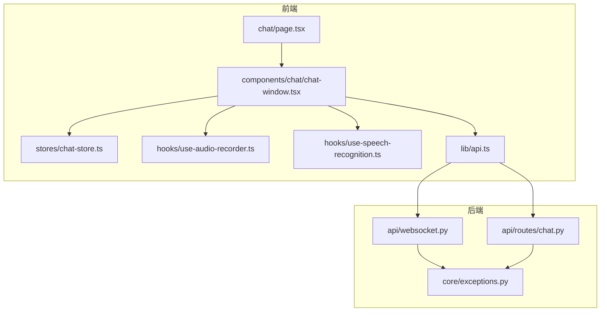
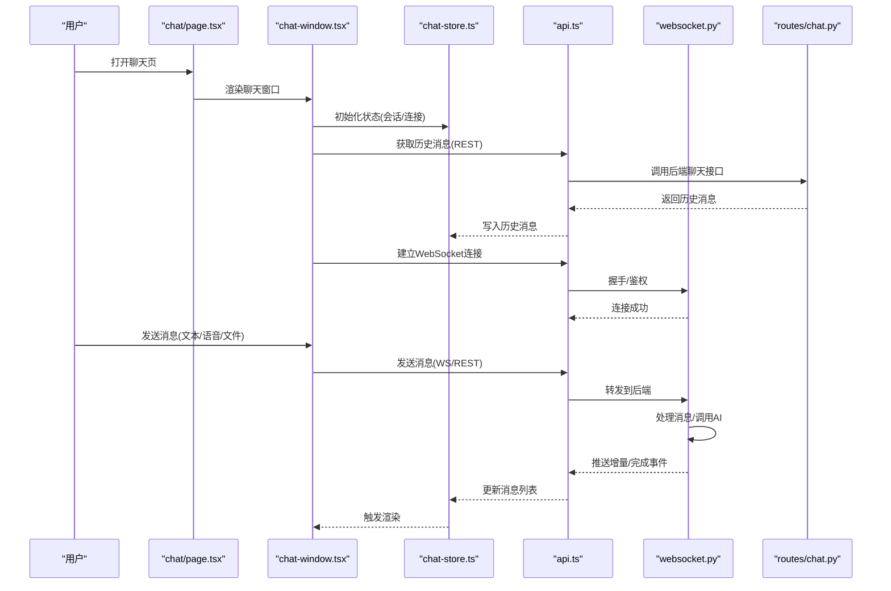
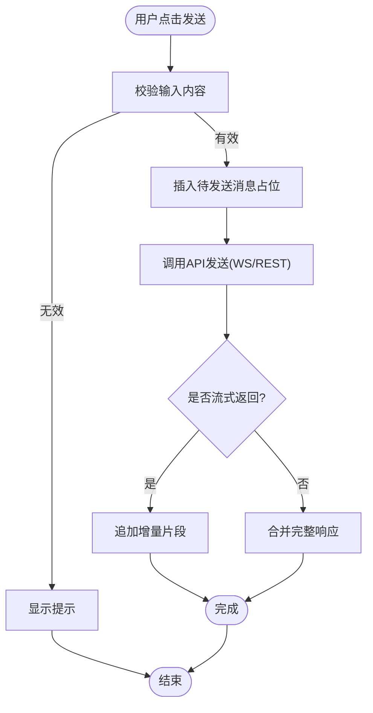
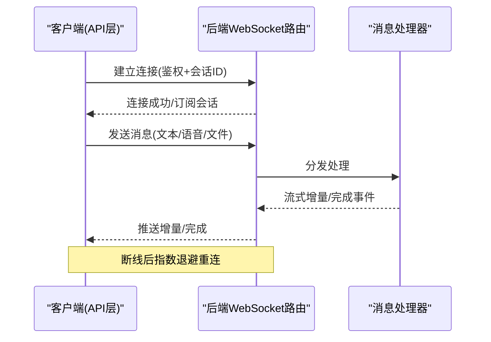
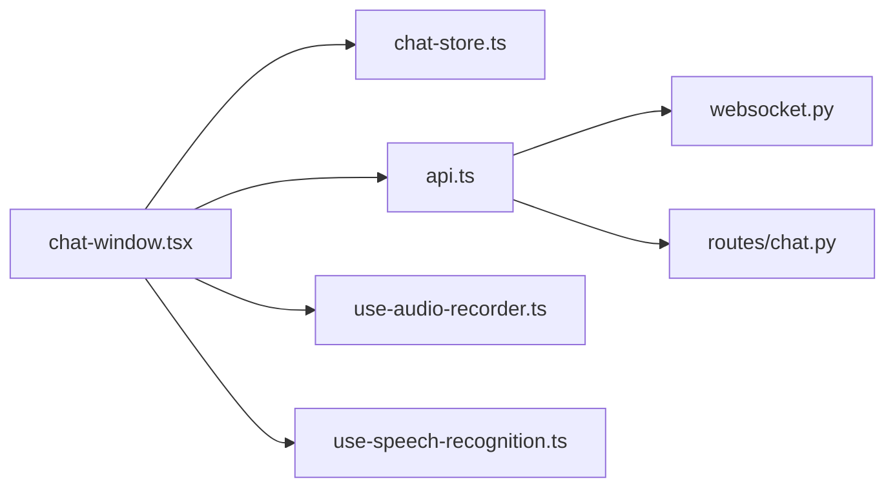

# 聊天界面页面

<cite>
**本文引用的文件**   
- [frontend_design/src/app/chat/page.tsx](file://frontend_design/src/app/chat/page.tsx)
- [frontend_design/src/components/chat/chat-window.tsx](file://frontend_design/src/components/chat/chat-window.tsx)
- [frontend_design/src/stores/chat-store.ts](file://frontend_design/src/stores/chat-store.ts)
- [frontend_design/src/hooks/use-audio-recorder.ts](file://frontend_design/src/hooks/use-audio-recorder.ts)
- [frontend_design/src/hooks/use-speech-recognition.ts](file://frontend_design/src/hooks/use-speech-recognition.ts)
- [frontend_design/src/lib/api.ts](file://frontend_design/src/lib/api.ts)
- [backend_design/nexus/api/websocket.py](file://backend_design/nexus/api/websocket.py)
- [backend_design/nexus/api/routes/chat.py](file://backend_design/nexus/api/routes/chat.py)
- [backend_design/nexus/core/exceptions.py](file://backend_design/nexus/core/exceptions.py)
</cite>

## 目录
1. [简介](#简介)
2. [项目结构](#项目结构)
3. [核心组件](#核心组件)
4. [架构总览](#架构总览)
5. [详细组件分析](#详细组件分析)
6. [依赖关系分析](#依赖关系分析)
7. [性能考虑](#性能考虑)
8. [故障排查指南](#故障排查指南)
9. [结论](#结论)
10. [附录](#附录)

## 简介
本文件面向 NexusCockpit 的“聊天界面”页面，系统性说明前端聊天页面的实现与交互流程，包括用户消息输入、AI 响应展示、对话历史管理、WebSocket 实时通信（连接建立、消息收发、错误重连）、状态管理、消息渲染优化与用户体验设计。同时覆盖语音输入集成、文本格式化、表情符号支持与文件上传能力，并提供性能优化策略与移动端适配方案。

## 项目结构
聊天功能涉及前后端多个模块：
- 前端页面与组件：聊天入口页、聊天窗口组件、状态存储、音频录制与语音识别 Hook、API 封装等
- 后端接口：WebSocket 路由、聊天业务路由、异常定义等

**图表来源**
- [frontend_design/src/app/chat/page.tsx](file://frontend_design/src/app/chat/page.tsx)
- [frontend_design/src/components/chat/chat-window.tsx](file://frontend_design/src/components/chat/chat-window.tsx)
- [frontend_design/src/stores/chat-store.ts](file://frontend_design/src/stores/chat-store.ts)
- [frontend_design/src/hooks/use-audio-recorder.ts](file://frontend_design/src/hooks/use-audio-recorder.ts)
- [frontend_design/src/hooks/use-speech-recognition.ts](file://frontend_design/src/hooks/use-speech-recognition.ts)
- [frontend_design/src/lib/api.ts](file://frontend_design/src/lib/api.ts)
- [backend_design/nexus/api/websocket.py](file://backend_design/nexus/api/websocket.py)
- [backend_design/nexus/api/routes/chat.py](file://backend_design/nexus/api/routes/chat.py)
- [backend_design/nexus/core/exceptions.py](file://backend_design/nexus/core/exceptions.py)

**章节来源**
- [frontend_design/src/app/chat/page.tsx](file://frontend_design/src/app/chat/page.tsx)
- [frontend_design/src/components/chat/chat-window.tsx](file://frontend_design/src/components/chat/chat-window.tsx)
- [frontend_design/src/stores/chat-store.ts](file://frontend_design/src/stores/chat-store.ts)
- [frontend_design/src/hooks/use-audio-recorder.ts](file://frontend_design/src/hooks/use-audio-recorder.ts)
- [frontend_design/src/hooks/use-speech-recognition.ts](file://frontend_design/src/hooks/use-speech-recognition.ts)
- [frontend_design/src/lib/api.ts](file://frontend_design/src/lib/api.ts)
- [backend_design/nexus/api/websocket.py](file://backend_design/nexus/api/websocket.py)
- [backend_design/nexus/api/routes/chat.py](file://backend_design/nexus/api/routes/chat.py)
- [backend_design/nexus/core/exceptions.py](file://backend_design/nexus/core/exceptions.py)

## 核心组件
- 聊天入口页：负责挂载聊天窗口、初始化会话上下文与全局配置
- 聊天窗口组件：承载消息列表、输入区、工具栏（语音、表情、文件）、滚动与渲染优化
- 聊天状态存储：集中管理消息队列、会话元信息、连接状态、加载态与错误态
- 语音相关 Hook：录音控制、浏览器原生语音识别集成
- API 层：统一封装 REST 与 WebSocket 调用，处理鉴权、重试与错误映射
- 后端 WebSocket 路由：维护连接、转发消息、广播与重连支持
- 后端聊天路由：提供非实时接口（如历史消息、文件上传）
- 异常定义：统一错误码与错误体结构

**章节来源**
- [frontend_design/src/app/chat/page.tsx](file://frontend_design/src/app/chat/page.tsx)
- [frontend_design/src/components/chat/chat-window.tsx](file://frontend_design/src/components/chat/chat-window.tsx)
- [frontend_design/src/stores/chat-store.ts](file://frontend_design/src/stores/chat-store.ts)
- [frontend_design/src/hooks/use-audio-recorder.ts](file://frontend_design/src/hooks/use-audio-recorder.ts)
- [frontend_design/src/hooks/use-speech-recognition.ts](file://frontend_design/src/hooks/use-speech-recognition.ts)
- [frontend_design/src/lib/api.ts](file://frontend_design/src/lib/api.ts)
- [backend_design/nexus/api/websocket.py](file://backend_design/nexus/api/websocket.py)
- [backend_design/nexus/api/routes/chat.py](file://backend_design/nexus/api/routes/chat.py)
- [backend_design/nexus/core/exceptions.py](file://backend_design/nexus/core/exceptions.py)

## 架构总览
聊天系统采用“前端组件 + 状态管理 + API 抽象 + 后端 WebSocket/REST”的分层架构。前端通过 API 层发起请求或建立 WebSocket 长连接；后端根据消息类型进行路由处理，必要时调用 AI 服务并流式返回结果。

**图表来源**
- [frontend_design/src/app/chat/page.tsx](file://frontend_design/src/app/chat/page.tsx)
- [frontend_design/src/components/chat/chat-window.tsx](file://frontend_design/src/components/chat/chat-window.tsx)
- [frontend_design/src/stores/chat-store.ts](file://frontend_design/src/stores/chat-store.ts)
- [frontend_design/src/lib/api.ts](file://frontend_design/src/lib/api.ts)
- [backend_design/nexus/api/websocket.py](file://backend_design/nexus/api/websocket.py)
- [backend_design/nexus/api/routes/chat.py](file://backend_design/nexus/api/routes/chat.py)

## 详细组件分析

### 聊天入口页（chat/page.tsx）
职责
- 作为聊天功能的页面容器，挂载聊天窗口组件
- 初始化必要的上下文（如主题、语言、租户信息等）
- 可选：在页面级监听全局事件（如通知、权限变更）

关键点
- 生命周期：进入页面时初始化，离开时清理资源（如断开连接）
- 与聊天窗口的数据传递：通过 props 或全局状态注入

**章节来源**
- [frontend_design/src/app/chat/page.tsx](file://frontend_design/src/app/chat/page.tsx)

### 聊天窗口组件（chat-window.tsx）
职责
- 管理消息列表展示与滚动定位
- 处理用户输入（文本、语音转写、表情选择、文件选择）
- 协调与状态存储和 API 层的交互
- 维护本地加载态、错误提示与空状态

关键逻辑
- 消息发送流程：校验输入 -> 插入待发送占位 -> 调用 API -> 接收流式/批量响应 -> 合并为最终消息
- 渲染优化：对长列表使用虚拟滚动或分页加载；仅对可见区域进行富文本解析
- 用户体验：自动滚动到底部、打字机效果、错误重试按钮、网络断线提示

**图表来源**
- [frontend_design/src/components/chat/chat-window.tsx](file://frontend_design/src/components/chat/chat-window.tsx)
- [frontend_design/src/stores/chat-store.ts](file://frontend_design/src/stores/chat-store.ts)
- [frontend_design/src/lib/api.ts](file://frontend_design/src/lib/api.ts)

**章节来源**
- [frontend_design/src/components/chat/chat-window.tsx](file://frontend_design/src/components/chat/chat-window.tsx)
- [frontend_design/src/stores/chat-store.ts](file://frontend_design/src/stores/chat-store.ts)
- [frontend_design/src/lib/api.ts](file://frontend_design/src/lib/api.ts)

### 聊天状态存储（chat-store.ts）
职责
- 集中管理：消息列表、当前会话、连接状态、加载与错误状态
- 提供原子化更新方法：追加消息、替换消息、清空会话、设置连接状态等
- 持久化：将必要状态同步到本地存储（如 localStorage），用于刷新后恢复

数据结构建议
- messages: 有序消息数组（含 id、角色、内容、时间戳、附件、状态）
- session: 会话元信息（id、标题、创建时间、标签等）
- connection: 连接状态（connected、reconnecting、lastError）
- ui: UI 状态（loading、error、scrollToBottom）

更新策略
- 乐观更新：先插入占位消息，成功后再修正状态
- 幂等性：基于消息 id 去重，避免重复渲染
- 增量合并：对流式响应按片段顺序拼接，保持光标位置稳定

**章节来源**
- [frontend_design/src/stores/chat-store.ts](file://frontend_design/src/stores/chat-store.ts)

### 语音输入集成
- 录音 Hook（use-audio-recorder.ts）：封装 MediaRecorder，提供开始/停止、分段采集、格式转换与大小限制
- 语音识别 Hook（use-speech-recognition.ts）：基于浏览器 SpeechRecognition API，提供实时转写与结果回调
- 集成方式：在输入区提供“按住说话/点击录音”控件，转写完成后自动填充文本或直接发送

注意事项
- 权限申请与降级：不支持浏览器回退为文件上传录音
- 静音检测与降噪：可结合 WebAudio 做简单 VAD 预处理
- 隐私提示：明确告知用户录音用途与存储范围

**章节来源**
- [frontend_design/src/hooks/use-audio-recorder.ts](file://frontend_design/src/hooks/use-audio-recorder.ts)
- [frontend_design/src/hooks/use-speech-recognition.ts](file://frontend_design/src/hooks/use-speech-recognition.ts)

### 文本格式化与表情符号
- 文本格式化：支持 Markdown 基础语法、代码块高亮、链接跳转、图片预览
- 表情符号：内置表情面板，支持键盘快捷输入与粘贴
- 安全策略：对用户输入进行 XSS 过滤，对富文本输出进行白名单渲染

**章节来源**
- [frontend_design/src/components/chat/chat-window.tsx](file://frontend_design/src/components/chat/chat-window.tsx)

### 文件上传
- 前端：选择文件 -> 校验类型/大小 -> 生成预览（图片/文档缩略图）-> 上传进度条
- 后端：REST 接口接收文件，落盘或对象存储，返回可访问 URL
- 消息中嵌入：将文件 URL 与元信息附加到消息体，渲染为卡片或下载链接

**章节来源**
- [frontend_design/src/components/chat/chat-window.tsx](file://frontend_design/src/components/chat/chat-window.tsx)
- [frontend_design/src/lib/api.ts](file://frontend_design/src/lib/api.ts)
- [backend_design/nexus/api/routes/chat.py](file://backend_design/nexus/api/routes/chat.py)

### WebSocket 实时通信
连接建立
- 前端在页面挂载时尝试建立连接，携带鉴权信息与会话标识
- 后端验证通过后返回连接成功事件，并订阅会话通道

消息收发
- 客户端发送：文本、语音转写结果、文件引用、控制指令（如停止生成）
- 服务端处理：路由到对应处理器，可能调用 AI 服务并流式返回增量片段
- 客户端接收：按序合并增量，更新消息状态，触发渲染

错误与重连
- 断线检测：心跳/超时机制
- 指数退避重连：失败次数越多，等待时间越长
- 状态恢复：重连后拉取未确认消息或会话快照

**图表来源**
- [frontend_design/src/lib/api.ts](file://frontend_design/src/lib/api.ts)
- [backend_design/nexus/api/websocket.py](file://backend_design/nexus/api/websocket.py)

**章节来源**
- [frontend_design/src/lib/api.ts](file://frontend_design/src/lib/api.ts)
- [backend_design/nexus/api/websocket.py](file://backend_design/nexus/api/websocket.py)

### 对话历史管理
- 首次进入：通过 REST 接口拉取历史消息，按时间排序渲染
- 分页加载：向上滚动加载更多早期消息，避免一次性加载过多
- 会话切换：切换会话时清空当前视图并重新拉取
- 本地缓存：将最近 N 条消息缓存至本地，提升二次打开速度

**章节来源**
- [frontend_design/src/lib/api.ts](file://frontend_design/src/lib/api.ts)
- [backend_design/nexus/api/routes/chat.py](file://backend_design/nexus/api/routes/chat.py)

## 依赖关系分析
- 组件耦合
  - chat-window.tsx 依赖 chat-store.ts 的状态与方法
  - chat-window.tsx 依赖 api.ts 的发送/连接封装
  - use-audio-recorder.ts 与 use-speech-recognition.ts 被 chat-window.tsx 组合使用
- 外部依赖
  - 浏览器 API：MediaRecorder、SpeechRecognition、File API
  - 后端：WebSocket 路由与 REST 聊天接口
- 潜在循环依赖
  - 确保 store 不反向依赖组件，API 层不依赖具体组件

**图表来源**
- [frontend_design/src/components/chat/chat-window.tsx](file://frontend_design/src/components/chat/chat-window.tsx)
- [frontend_design/src/stores/chat-store.ts](file://frontend_design/src/stores/chat-store.ts)
- [frontend_design/src/lib/api.ts](file://frontend_design/src/lib/api.ts)
- [frontend_design/src/hooks/use-audio-recorder.ts](file://frontend_design/src/hooks/use-audio-recorder.ts)
- [frontend_design/src/hooks/use-speech-recognition.ts](file://frontend_design/src/hooks/use-speech-recognition.ts)
- [backend_design/nexus/api/websocket.py](file://backend_design/nexus/api/websocket.py)
- [backend_design/nexus/api/routes/chat.py](file://backend_design/nexus/api/routes/chat.py)

**章节来源**
- [frontend_design/src/components/chat/chat-window.tsx](file://frontend_design/src/components/chat/chat-window.tsx)
- [frontend_design/src/stores/chat-store.ts](file://frontend_design/src/stores/chat-store.ts)
- [frontend_design/src/lib/api.ts](file://frontend_design/src/lib/api.ts)
- [frontend_design/src/hooks/use-audio-recorder.ts](file://frontend_design/src/hooks/use-audio-recorder.ts)
- [frontend_design/src/hooks/use-speech-recognition.ts](file://frontend_design/src/hooks/use-speech-recognition.ts)
- [backend_design/nexus/api/websocket.py](file://backend_design/nexus/api/websocket.py)
- [backend_design/nexus/api/routes/chat.py](file://backend_design/nexus/api/routes/chat.py)

## 性能考虑
- 列表渲染
  - 虚拟滚动：仅渲染可视区域的消息节点，降低 DOM 压力
  - 键值稳定：使用唯一 id 作为 key，减少不必要的重排
- 文本处理
  - 延迟解析：仅在消息可见时进行 Markdown/富文本解析
  - 防抖：输入框内容变化防抖，避免频繁计算
- 网络与内存
  - 分片上传：大文件分块上传，提高成功率与体验
  - 图片懒加载与压缩：按需加载与尺寸裁剪
  - 连接复用：单例 WebSocket 实例，避免重复握手
- 移动端适配
  - 自适应布局：小屏下隐藏次要控件，增大触控区域
  - 软键盘避让：动态调整视口高度，保证输入区可见
  - 触摸手势：滑动删除、长按复制、双击滚动到底部

[本节为通用指导，无需源码引用]

## 故障排查指南
常见问题与定位步骤
- 无法建立 WebSocket 连接
  - 检查鉴权头与会话 ID 是否正确
  - 查看后端日志与异常定义，确认错误码
  - 前端观察重连次数与退避间隔
- 消息不同步或丢失
  - 核对消息 id 与状态流转（pending/sent/delivered/failed）
  - 检查增量合并逻辑是否按序执行
- 语音转写失败
  - 确认浏览器权限与兼容性
  - 回退到文件上传模式
- 文件上传失败
  - 校验文件大小与类型限制
  - 检查后端存储路径与权限

参考实现位置
- 异常定义与错误码：后端统一异常模块
- 连接与重连：API 层封装
- 消息状态更新：状态存储

**章节来源**
- [backend_design/nexus/core/exceptions.py](file://backend_design/nexus/core/exceptions.py)
- [frontend_design/src/lib/api.ts](file://frontend_design/src/lib/api.ts)
- [frontend_design/src/stores/chat-store.ts](file://frontend_design/src/stores/chat-store.ts)

## 结论
聊天界面以清晰的组件分层与状态管理为核心，结合 WebSocket 实时通信与 REST 辅助接口，实现了流畅的用户体验。通过虚拟滚动、延迟解析、分片上传与移动端适配等优化策略，系统在复杂场景下仍保持稳定与高效。后续可进一步引入离线缓存、消息去重与更完善的监控指标，以提升可靠性与可观测性。

[本节为总结，无需源码引用]

## 附录
- 术语
  - 流式返回：服务端逐步推送增量内容，客户端即时渲染
  - 乐观更新：先更新 UI，再根据服务器响应修正
  - 指数退避：重连等待时间随失败次数呈指数增长
- 最佳实践
  - 所有用户输入需进行安全校验与过滤
  - 对外暴露的错误信息应脱敏且友好
  - 关键操作需提供撤销与重试能力

[本节为补充说明，无需源码引用]