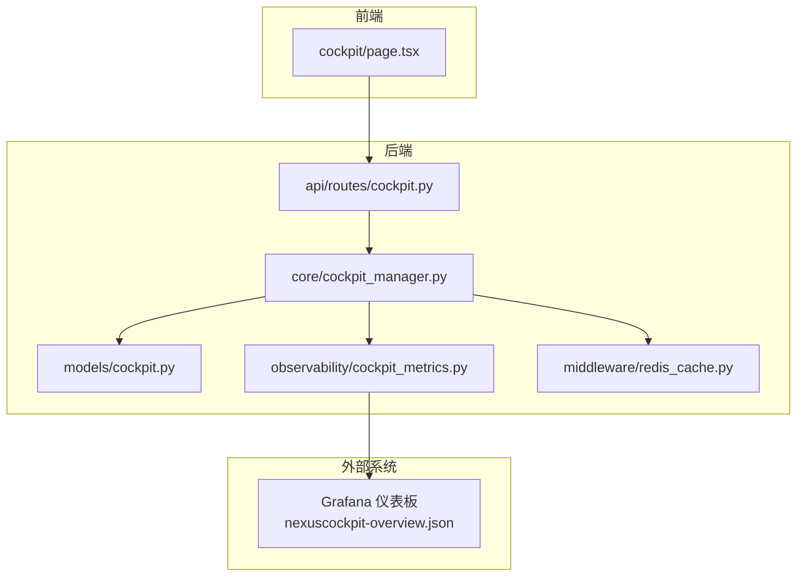
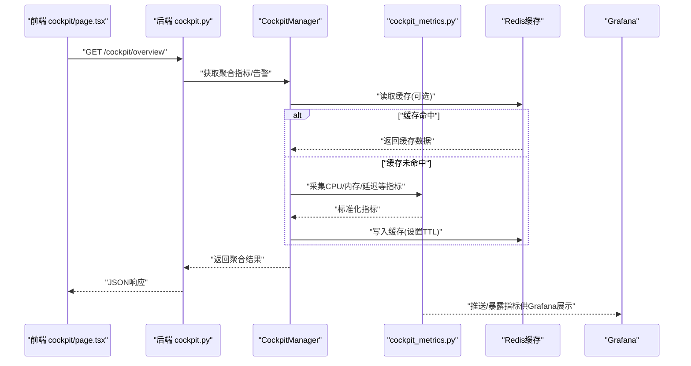
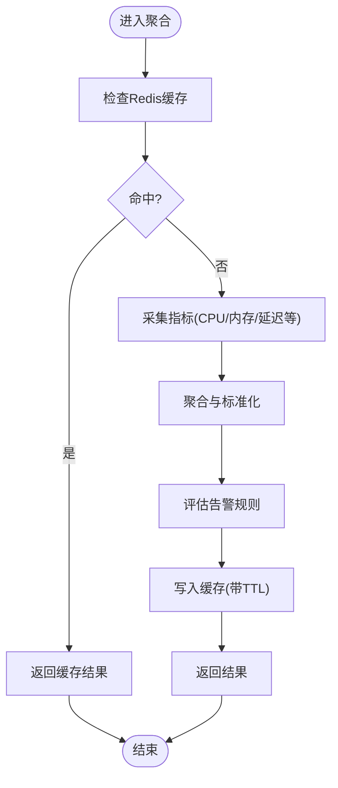
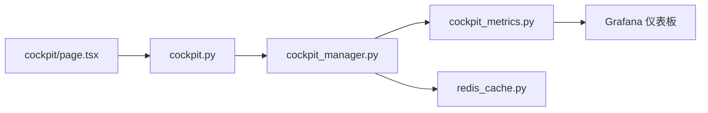

# 驾驶舱监控页面

<cite>
**本文引用的文件**   
- [frontend_design/src/app/cockpit/page.tsx](file://frontend_design/src/app/cockpit/page.tsx)
- [backend_design/nexus/api/routes/cockpit.py](file://backend_design/nexus/api/routes/cockpit.py)
- [backend_design/nexus/core/cockpit_manager.py](file://backend_design/nexus/core/cockpit_manager.py)
- [backend_design/nexus/models/cockpit.py](file://backend_design/nexus/models/cockpit.py)
- [backend_design/nexus/observability/cockpit_metrics.py](file://backend_design/nexus/observability/cockpit_metrics.py)
- [backend_design/nexus/middleware/redis_cache.py](file://backend_design/nexus/middleware/redis_cache.py)
- [config/grafana/provisioning/dashboards/nexuscockpit-overview.json](file://config/grafana/provisioning/dashboards/nexuscockpit-overview.json)
</cite>

## 目录
1. [简介](#简介)
2. [项目结构](#项目结构)
3. [核心组件](#核心组件)
4. [架构总览](#架构总览)
5. [详细组件分析](#详细组件分析)
6. [依赖关系分析](#依赖关系分析)
7. [性能考虑](#性能考虑)
8. [故障排查指南](#故障排查指南)
9. [结论](#结论)
10. [附录](#附录)

## 简介
本文件面向NexusCockpit的“驾驶舱监控页面”，聚焦以下目标：
- 实时数据可视化与性能指标展示（CPU、内存、请求延迟等）
- 告警信息管理
- 图表组件使用、数据刷新机制与实时更新策略
- 监控数据的采集、处理与展示流程
- 自定义仪表板配置、主题切换与响应式布局实现
- 监控数据的缓存策略与性能优化建议

## 项目结构
与驾驶舱监控相关的前后端关键位置如下：
- 前端页面入口：frontend_design/src/app/cockpit/page.tsx
- 后端API路由：backend_design/nexus/api/routes/cockpit.py
- 监控管理核心：backend_design/nexus/core/cockpit_manager.py
- 数据模型定义：backend_design/nexus/models/cockpit.py
- 指标采集与上报：backend_design/nexus/observability/cockpit_metrics.py
- 缓存中间件：backend_design/nexus/middleware/redis_cache.py
- Grafana仪表板配置：config/grafana/provisioning/dashboards/nexuscockpit-overview.json

图示来源
- [frontend_design/src/app/cockpit/page.tsx](file://frontend_design/src/app/cockpit/page.tsx)
- [backend_design/nexus/api/routes/cockpit.py](file://backend_design/nexus/api/routes/cockpit.py)
- [backend_design/nexus/core/cockpit_manager.py](file://backend_design/nexus/core/cockpit_manager.py)
- [backend_design/nexus/models/cockpit.py](file://backend_design/nexus/models/cockpit.py)
- [backend_design/nexus/observability/cockpit_metrics.py](file://backend_design/nexus/observability/cockpit_metrics.py)
- [backend_design/nexus/middleware/redis_cache.py](file://backend_design/nexus/middleware/redis_cache.py)
- [config/grafana/provisioning/dashboards/nexuscockpit-overview.json](file://config/grafana/provisioning/dashboards/nexuscockpit-overview.json)

章节来源
- [frontend_design/src/app/cockpit/page.tsx](file://frontend_design/src/app/cockpit/page.tsx)
- [backend_design/nexus/api/routes/cockpit.py](file://backend_design/nexus/api/routes/cockpit.py)
- [backend_design/nexus/core/cockpit_manager.py](file://backend_design/nexus/core/cockpit_manager.py)
- [backend_design/nexus/models/cockpit.py](file://backend_design/nexus/models/cockpit.py)
- [backend_design/nexus/observability/cockpit_metrics.py](file://backend_design/nexus/observability/cockpit_metrics.py)
- [backend_design/nexus/middleware/redis_cache.py](file://backend_design/nexus/middleware/redis_cache.py)
- [config/grafana/provisioning/dashboards/nexuscockpit-overview.json](file://config/grafana/provisioning/dashboards/nexuscockpit-overview.json)

## 核心组件
- 前端驾驶舱页面：负责渲染监控面板、图表组件、告警列表，并维护数据刷新与实时更新逻辑。
- 后端驾驶舱API：提供聚合后的监控指标、告警信息、系统状态等接口，供前端拉取或订阅。
- CockpitManager：协调指标采集、缓存读写、告警规则评估与结果组装。
- 数据模型：统一描述指标、告警、仪表盘配置等数据结构。
- 可观测性模块：对接底层指标源（如Prometheus/Grafana），输出标准化指标。
- Redis缓存：对热点指标进行短期缓存，降低后端压力与前端抖动。
- Grafana仪表板：提供统一的可视化能力，支持自定义配置与主题。

章节来源
- [backend_design/nexus/core/cockpit_manager.py](file://backend_design/nexus/core/cockpit_manager.py)
- [backend_design/nexus/models/cockpit.py](file://backend_design/nexus/models/cockpit.py)
- [backend_design/nexus/observability/cockpit_metrics.py](file://backend_design/nexus/observability/cockpit_metrics.py)
- [backend_design/nexus/middleware/redis_cache.py](file://backend_design/nexus/middleware/redis_cache.py)
- [config/grafana/provisioning/dashboards/nexuscockpit-overview.json](file://config/grafana/provisioning/dashboards/nexuscockpit-overview.json)

## 架构总览
下图展示了从前端到后端的端到端数据流，以及指标采集、缓存与可视化的关键环节。

图示来源
- [frontend_design/src/app/cockpit/page.tsx](file://frontend_design/src/app/cockpit/page.tsx)
- [backend_design/nexus/api/routes/cockpit.py](file://backend_design/nexus/api/routes/cockpit.py)
- [backend_design/nexus/core/cockpit_manager.py](file://backend_design/nexus/core/cockpit_manager.py)
- [backend_design/nexus/observability/cockpit_metrics.py](file://backend_design/nexus/observability/cockpit_metrics.py)
- [backend_design/nexus/middleware/redis_cache.py](file://backend_design/nexus/middleware/redis_cache.py)
- [config/grafana/provisioning/dashboards/nexuscockpit-overview.json](file://config/grafana/provisioning/dashboards/nexuscockpit-overview.json)

## 详细组件分析

### 前端驾驶舱页面（cockpit/page.tsx）
职责与要点
- 页面初始化：加载仪表盘配置、主题与布局参数。
- 数据获取：调用后端聚合接口，按周期轮询或基于事件更新。
- 图表渲染：根据指标类型选择折线图、柱状图、仪表盘等组件。
- 告警展示：高亮异常指标，提供告警详情与操作入口。
- 响应式布局：适配不同屏幕尺寸，动态调整网格与组件大小。
- 主题切换：通过上下文或全局状态切换明暗主题与配色方案。

数据刷新与实时更新策略
- 轮询模式：固定间隔拉取最新指标，适合低吞吐场景。
- 增量更新：仅拉取变更字段，减少传输体积。
- 事件驱动：若后端支持WebSocket/SSE，则采用推送方式降低延迟。
- 防抖与节流：在高频更新时合并请求，避免UI抖动。

图表组件使用建议
- 时间序列指标（CPU、内存、延迟）：折线图/面积图，启用平滑与缩放。
- 分布类指标（错误率、分位延迟）：直方图/热力图。
- 阈值型指标（健康度、容量水位）：仪表盘/进度条。
- 告警事件：时间轴/列表，支持筛选与跳转。

章节来源
- [frontend_design/src/app/cockpit/page.tsx](file://frontend_design/src/app/cockpit/page.tsx)

### 后端API（cockpit.py）
职责与要点
- 暴露聚合接口：将多源指标与告警聚合为统一视图。
- 参数校验：过滤时间窗口、维度标签、采样粒度等。
- 权限控制：鉴权与租户隔离（如有）。
- 错误处理：超时、降级、空数据兜底。

典型交互流程
- 接收查询参数（时间范围、维度、指标集合）。
- 委托CockpitManager执行聚合。
- 返回结构化JSON给前端。

章节来源
- [backend_design/nexus/api/routes/cockpit.py](file://backend_design/nexus/api/routes/cockpit.py)

### CockpitManager（cockpit_manager.py）
职责与要点
- 指标编排：调度各指标采集器，合并结果。
- 缓存策略：读前查缓存，写后设过期；支持按维度键控。
- 告警评估：基于阈值与规则计算告警级别与消息。
- 容错与降级：部分采集失败不影响整体可用性。

图示来源
- [backend_design/nexus/core/cockpit_manager.py](file://backend_design/nexus/core/cockpit_manager.py)
- [backend_design/nexus/middleware/redis_cache.py](file://backend_design/nexus/middleware/redis_cache.py)
- [backend_design/nexus/observability/cockpit_metrics.py](file://backend_design/nexus/observability/cockpit_metrics.py)

章节来源
- [backend_design/nexus/core/cockpit_manager.py](file://backend_design/nexus/core/cockpit_manager.py)

### 数据模型（cockpit.py）
职责与要点
- 指标实体：包含名称、值、时间戳、维度标签等。
- 告警实体：包含级别、消息、触发条件、生效时间等。
- 仪表盘配置：包含组件布局、主题、刷新策略等。

章节来源
- [backend_design/nexus/models/cockpit.py](file://backend_design/nexus/models/cockpit.py)

### 可观测性指标（cockpit_metrics.py）
职责与要点
- 指标采集：对接系统探针或Prometheus，提取CPU、内存、请求延迟等。
- 指标清洗：去噪、插值、对齐时间窗。
- 指标导出：向Grafana/Prometheus暴露或推送。

章节来源
- [backend_design/nexus/observability/cockpit_metrics.py](file://backend_design/nexus/observability/cockpit_metrics.py)

### 缓存中间件（redis_cache.py）
职责与要点
- 通用缓存封装：get/set/delete/exists。
- 键空间设计：按指标名+维度+时间窗生成唯一键。
- TTL管理：短周期热数据快速失效，避免脏读。

章节来源
- [backend_design/nexus/middleware/redis_cache.py](file://backend_design/nexus/middleware/redis_cache.py)

### Grafana仪表板（nexuscockpit-overview.json）
职责与要点
- 预置面板：概览页包含CPU、内存、延迟、错误率等常用面板。
- 数据源绑定：指向Prometheus或其他时序数据库。
- 主题与联动：支持暗色主题、跨面板变量联动。

章节来源
- [config/grafana/provisioning/dashboards/nexuscockpit-overview.json](file://config/grafana/provisioning/dashboards/nexuscockpit-overview.json)

## 依赖关系分析
- 前端依赖后端聚合接口，间接依赖指标采集与缓存。
- CockpitManager依赖指标采集与缓存中间件，解耦具体数据源。
- Grafana作为独立可视化层，通过标准指标协议消费数据。

图示来源
- [frontend_design/src/app/cockpit/page.tsx](file://frontend_design/src/app/cockpit/page.tsx)
- [backend_design/nexus/api/routes/cockpit.py](file://backend_design/nexus/api/routes/cockpit.py)
- [backend_design/nexus/core/cockpit_manager.py](file://backend_design/nexus/core/cockpit_manager.py)
- [backend_design/nexus/observability/cockpit_metrics.py](file://backend_design/nexus/observability/cockpit_metrics.py)
- [backend_design/nexus/middleware/redis_cache.py](file://backend_design/nexus/middleware/redis_cache.py)
- [config/grafana/provisioning/dashboards/nexuscockpit-overview.json](file://config/grafana/provisioning/dashboards/nexuscockpit-overview.json)

章节来源
- [backend_design/nexus/core/cockpit_manager.py](file://backend_design/nexus/core/cockpit_manager.py)
- [backend_design/nexus/observability/cockpit_metrics.py](file://backend_design/nexus/observability/cockpit_metrics.py)
- [backend_design/nexus/middleware/redis_cache.py](file://backend_design/nexus/middleware/redis_cache.py)
- [config/grafana/provisioning/dashboards/nexuscockpit-overview.json](file://config/grafana/provisioning/dashboards/nexuscockpit-overview.json)

## 性能考虑
- 缓存优先：对热点指标启用短TTL缓存，降低后端压力与前端抖动。
- 增量更新：优先返回差异数据，减少网络与渲染开销。
- 采样与降采样：在大时间窗口内自动降采样，平衡精度与性能。
- 并发与限流：对指标采集与聚合做并发控制与熔断保护。
- 前端渲染优化：虚拟滚动、按需加载、图表懒渲染。
- 资源复用：复用图表实例与数据适配器，避免重复创建。

[本节为通用指导，不直接分析具体文件]

## 故障排查指南
常见问题与定位步骤
- 指标缺失或为空
  - 检查指标采集链路是否可用（探针、Prometheus连通性）。
  - 确认时间窗口与维度标签是否正确。
  - 查看缓存是否命中旧数据或过期策略不当。
- 告警风暴
  - 检查告警规则阈值与冷却时间。
  - 确认是否存在瞬时抖动导致的误报。
- 前端卡顿
  - 检查轮询频率与数据量，必要时改为增量或事件驱动。
  - 观察图表渲染耗时，考虑分页或降采样。
- 主题/布局异常
  - 验证配置项是否被正确加载与应用。
  - 检查浏览器兼容性与CSS变量覆盖。

章节来源
- [backend_design/nexus/core/cockpit_manager.py](file://backend_design/nexus/core/cockpit_manager.py)
- [backend_design/nexus/observability/cockpit_metrics.py](file://backend_design/nexus/observability/cockpit_metrics.py)
- [backend_design/nexus/middleware/redis_cache.py](file://backend_design/nexus/middleware/redis_cache.py)
- [frontend_design/src/app/cockpit/page.tsx](file://frontend_design/src/app/cockpit/page.tsx)

## 结论
驾驶舱监控页面通过前后端协作与多层缓存，实现了实时、稳定且可扩展的系统监控体验。结合Grafana的统一可视化能力，既能满足日常运维需求，也便于扩展更多业务指标与告警策略。建议在后续迭代中持续优化采集路径、缓存策略与前端渲染性能，以提升整体稳定性与用户体验。

[本节为总结性内容，不直接分析具体文件]

## 附录
- 自定义仪表板配置
  - 在Grafana中导入或编辑nexuscockpit-overview.json，调整面板、数据源与主题。
- 主题切换
  - 前端通过全局状态或CSS变量切换明暗主题，确保图表与控件一致适配。
- 响应式布局
  - 基于栅格系统与断点策略，动态调整组件尺寸与排列。
- 数据刷新策略
  - 默认轮询间隔可配置；在高负载场景下建议切换为增量或事件驱动。

章节来源
- [config/grafana/provisioning/dashboards/nexuscockpit-overview.json](file://config/grafana/provisioning/dashboards/nexuscockpit-overview.json)
- [frontend_design/src/app/cockpit/page.tsx](file://frontend_design/src/app/cockpit/page.tsx)