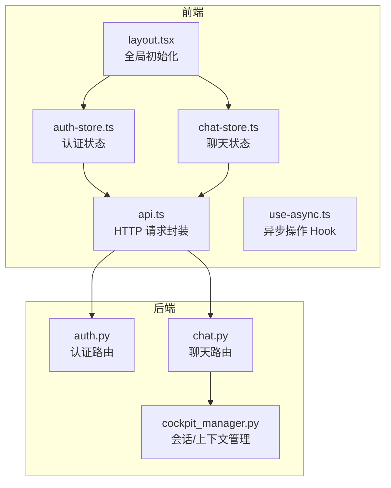
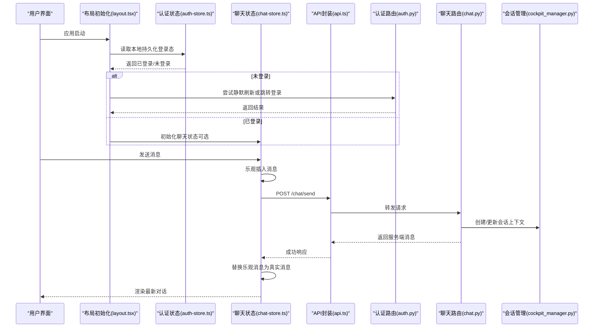
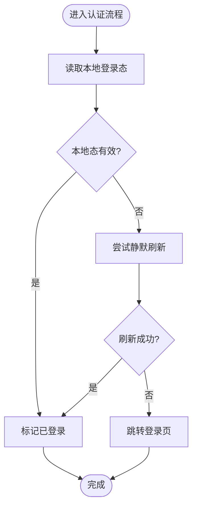
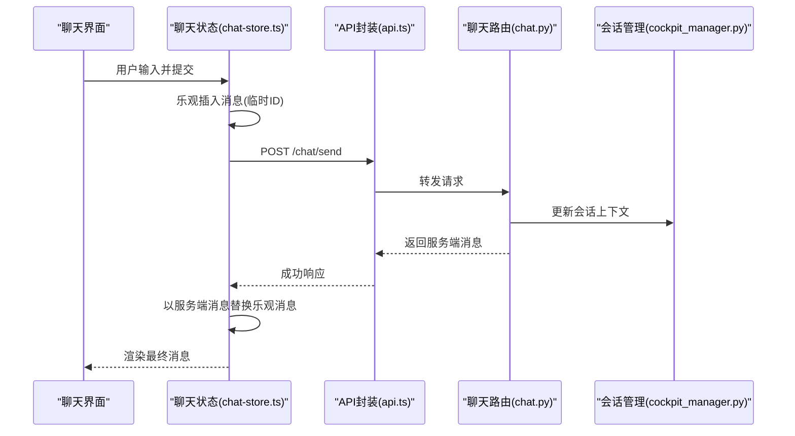
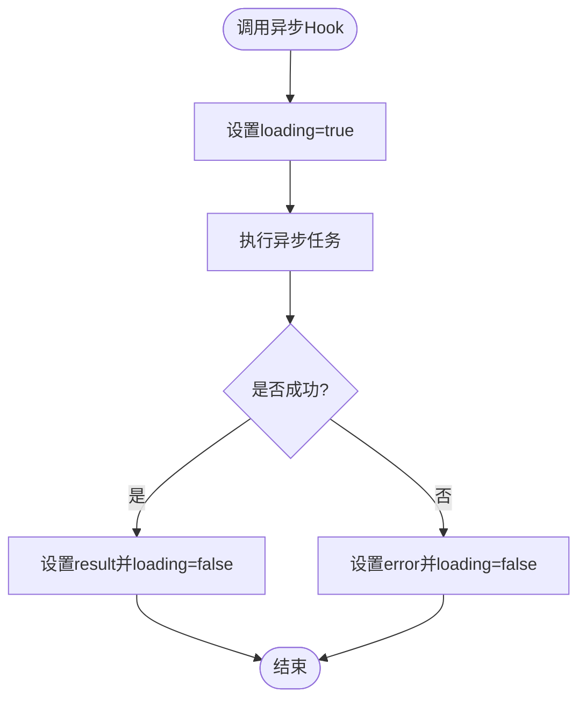
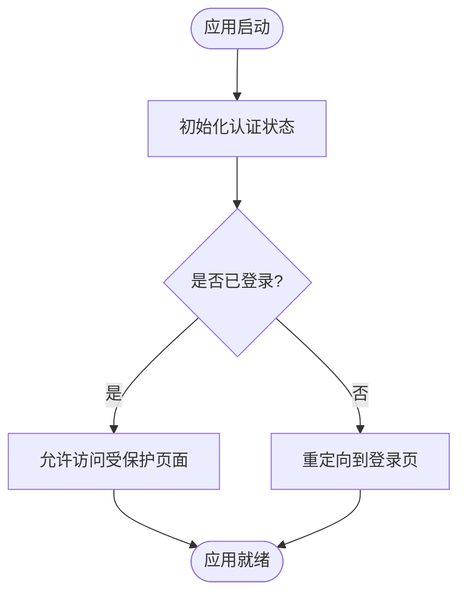
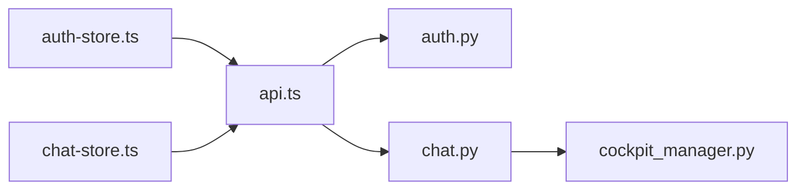

# 状态管理

<cite>
**本文引用的文件**   
- [frontend_design/src/stores/auth-store.ts](file://frontend_design/src/stores/auth-store.ts)
- [frontend_design/src/stores/chat-store.ts](file://frontend_design/src/stores/chat-store.ts)
- [frontend_design/src/lib/api.ts](file://frontend_design/src/lib/api.ts)
- [frontend_design/src/hooks/use-async.ts](file://frontend_design/src/hooks/use-async.ts)
- [frontend_design/src/app/layout.tsx](file://frontend_design/src/app/layout.tsx)
- [backend_design/nexus/api/routes/auth.py](file://backend_design/nexus/api/routes/auth.py)
- [backend_design/nexus/api/routes/chat.py](file://backend_design/nexus/api/routes/chat.py)
- [backend_design/nexus/core/cockpit_manager.py](file://backend_design/nexus/core/cockpit_manager.py)
</cite>

## 目录
1. [简介](#简介)
2. [项目结构](#项目结构)
3. [核心组件](#核心组件)
4. [架构总览](#架构总览)
5. [详细组件分析](#详细组件分析)
6. [依赖关系分析](#依赖关系分析)
7. [性能考虑](#性能考虑)
8. [故障排查指南](#故障排查指南)
9. [结论](#结论)
10. [附录](#附录)

## 简介
本文件面向 NexusCockpit 前端的状态管理系统，聚焦全局状态管理的架构设计、存储策略与数据同步机制。文档围绕认证状态与聊天状态两大业务域展开，覆盖状态持久化、更新模式、选择器设计、与后端 API 的同步、缓存策略与错误恢复机制，并提供最佳实践、性能优化与调试工具使用指南，帮助读者快速理解并高效维护状态层。

## 项目结构
NexusCockpit 的前端采用 Next.js 应用，状态管理集中在 stores 目录，通过 hooks 与页面组件交互；API 调用封装在 lib/api.ts；布局层负责全局初始化（如鉴权检查）。后端提供认证与会话相关的 REST/WebSocket 接口，由 cockpit_manager 协调会话与上下文。

图表来源
- [frontend_design/src/app/layout.tsx](file://frontend_design/src/app/layout.tsx)
- [frontend_design/src/stores/auth-store.ts](file://frontend_design/src/stores/auth-store.ts)
- [frontend_design/src/stores/chat-store.ts](file://frontend_design/src/stores/chat-store.ts)
- [frontend_design/src/lib/api.ts](file://frontend_design/src/lib/api.ts)
- [frontend_design/src/hooks/use-async.ts](file://frontend_design/src/hooks/use-async.ts)
- [backend_design/nexus/api/routes/auth.py](file://backend_design/nexus/api/routes/auth.py)
- [backend_design/nexus/api/routes/chat.py](file://backend_design/nexus/api/routes/chat.py)
- [backend_design/nexus/core/cockpit_manager.py](file://backend_design/nexus/core/cockpit_manager.py)

章节来源
- [frontend_design/src/app/layout.tsx](file://frontend_design/src/app/layout.tsx)
- [frontend_design/src/stores/auth-store.ts](file://frontend_design/src/stores/auth-store.ts)
- [frontend_design/src/stores/chat-store.ts](file://frontend_design/src/stores/chat-store.ts)
- [frontend_design/src/lib/api.ts](file://frontend_design/src/lib/api.ts)
- [frontend_design/src/hooks/use-async.ts](file://frontend_design/src/hooks/use-async.ts)
- [backend_design/nexus/api/routes/auth.py](file://backend_design/nexus/api/routes/auth.py)
- [backend_design/nexus/api/routes/chat.py](file://backend_design/nexus/api/routes/chat.py)
- [backend_design/nexus/core/cockpit_manager.py](file://backend_design/nexus/core/cockpit_manager.py)

## 核心组件
- 认证状态（auth-store）：管理登录态、用户信息、令牌生命周期、自动刷新与退出清理。
- 聊天状态（chat-store）：管理会话列表、当前会话消息流、输入状态、发送与接收流程、错误与加载态。
- API 封装（api.ts）：统一 HTTP 请求、拦截器（鉴权头、错误处理）、重试与超时控制。
- 异步 Hook（use-async.ts）：封装通用异步执行、loading/error/result 状态与取消逻辑。
- 布局初始化（layout.tsx）：应用启动时校验登录态、恢复本地持久化状态、必要时触发重定向。

章节来源
- [frontend_design/src/stores/auth-store.ts](file://frontend_design/src/stores/auth-store.ts)
- [frontend_design/src/stores/chat-store.ts](file://frontend_design/src/stores/chat-store.ts)
- [frontend_design/src/lib/api.ts](file://frontend_design/src/lib/api.ts)
- [frontend_design/src/hooks/use-async.ts](file://frontend_design/src/hooks/use-async.ts)
- [frontend_design/src/app/layout.tsx](file://frontend_design/src/app/layout.tsx)

## 架构总览
整体采用“单源状态 + 局部选择器”的模式：stores 作为单一事实来源，页面通过选择器订阅所需片段，避免不必要的重渲染。数据同步遵循“乐观更新 + 失败回滚”的策略，结合 use-async 提供的统一异步模型，确保 UI 一致性与可观测性。

图表来源
- [frontend_design/src/app/layout.tsx](file://frontend_design/src/app/layout.tsx)
- [frontend_design/src/stores/auth-store.ts](file://frontend_design/src/stores/auth-store.ts)
- [frontend_design/src/stores/chat-store.ts](file://frontend_design/src/stores/chat-store.ts)
- [frontend_design/src/lib/api.ts](file://frontend_design/src/lib/api.ts)
- [backend_design/nexus/api/routes/auth.py](file://backend_design/nexus/api/routes/auth.py)
- [backend_design/nexus/api/routes/chat.py](file://backend_design/nexus/api/routes/chat.py)
- [backend_design/nexus/core/cockpit_manager.py](file://backend_design/nexus/core/cockpit_manager.py)

## 详细组件分析

### 认证状态（auth-store）
职责与边界
- 登录/登出：提交凭据、保存令牌、设置全局鉴权头、清理本地状态。
- 令牌刷新：基于 refresh token 或无感续期策略，失败则强制登出。
- 持久化：将关键登录态写入本地存储，应用重启后恢复。
- 选择器：暴露 isAuth、user、token 等细粒度字段供组件订阅。

更新模式
- 同步更新：本地状态立即变更，保证 UI 即时反馈。
- 异步刷新：后台静默刷新令牌，失败时触发登出流程。
- 错误恢复：网络异常或 401 时，尝试刷新；仍失败则清除状态并重定向。

持久化策略
- 仅持久化必要最小集（如 user、token），敏感信息按安全策略处理。
- 应用启动时从本地恢复，若过期则走刷新或登出流程。

图表来源
- [frontend_design/src/stores/auth-store.ts](file://frontend_design/src/stores/auth-store.ts)
- [frontend_design/src/lib/api.ts](file://frontend_design/src/lib/api.ts)
- [backend_design/nexus/api/routes/auth.py](file://backend_design/nexus/api/routes/auth.py)

章节来源
- [frontend_design/src/stores/auth-store.ts](file://frontend_design/src/stores/auth-store.ts)
- [frontend_design/src/lib/api.ts](file://frontend_design/src/lib/api.ts)
- [backend_design/nexus/api/routes/auth.py](file://backend_design/nexus/api/routes/auth.py)

### 聊天状态（chat-store）
职责与边界
- 会话管理：会话列表、当前会话 ID、切换会话。
- 消息流：消息追加、去重、乐观插入、服务端回填。
- 输入状态：文本、附件、语音等输入类型与校验。
- 错误与加载：发送中、失败提示、重试入口。

数据同步
- 乐观更新：先插入本地消息，再发起 API 请求；成功后替换为服务端消息。
- 失败回滚：请求失败时移除乐观消息并显示错误提示。
- 增量同步：支持分页拉取历史消息与实时推送（如有 WebSocket）。

选择器设计
- 暴露 currentMessages、inputState、isSending、error 等细粒度字段。
- 组合选择器：例如 hasUnsentMessages、lastMessageTime 等派生状态。

图表来源
- [frontend_design/src/stores/chat-store.ts](file://frontend_design/src/stores/chat-store.ts)
- [frontend_design/src/lib/api.ts](file://frontend_design/src/lib/api.ts)
- [backend_design/nexus/api/routes/chat.py](file://backend_design/nexus/api/routes/chat.py)
- [backend_design/nexus/core/cockpit_manager.py](file://backend_design/nexus/core/cockpit_manager.py)

章节来源
- [frontend_design/src/stores/chat-store.ts](file://frontend_design/src/stores/chat-store.ts)
- [frontend_design/src/lib/api.ts](file://frontend_design/src/lib/api.ts)
- [backend_design/nexus/api/routes/chat.py](file://backend_design/nexus/api/routes/chat.py)
- [backend_design/nexus/core/cockpit_manager.py](file://backend_design/nexus/core/cockpit_manager.py)

### 异步操作 Hook（use-async）
作用
- 统一封装异步执行的 loading、error、result 三态。
- 提供取消、重试、防抖与节流能力。
- 与 stores 配合，简化复杂业务流程的状态管理。

典型用法
- 在 store 方法中调用 use-async 包装的请求函数，返回统一的执行结果。
- 在组件中消费 hook 的结果，驱动 UI 展示与交互。

图表来源
- [frontend_design/src/hooks/use-async.ts](file://frontend_design/src/hooks/use-async.ts)

章节来源
- [frontend_design/src/hooks/use-async.ts](file://frontend_design/src/hooks/use-async.ts)

### 布局初始化（layout.tsx）
职责
- 应用启动时进行鉴权检查与状态恢复。
- 根据认证状态决定路由守卫与页面可见性。
- 初始化必要的全局资源（如日志、埋点、WebSocket 连接等）。

图表来源
- [frontend_design/src/app/layout.tsx](file://frontend_design/src/app/layout.tsx)
- [frontend_design/src/stores/auth-store.ts](file://frontend_design/src/stores/auth-store.ts)

章节来源
- [frontend_design/src/app/layout.tsx](file://frontend_design/src/app/layout.tsx)
- [frontend_design/src/stores/auth-store.ts](file://frontend_design/src/stores/auth-store.ts)

## 依赖关系分析
- 低耦合高内聚：每个 store 只关注自身领域，通过 api.ts 与后端通信，避免跨 store 直接调用。
- 选择器解耦：组件仅订阅所需字段，减少无关重渲染。
- 外部依赖：HTTP 客户端、本地存储、路由与鉴权中间件。

图表来源
- [frontend_design/src/stores/auth-store.ts](file://frontend_design/src/stores/auth-store.ts)
- [frontend_design/src/stores/chat-store.ts](file://frontend_design/src/stores/chat-store.ts)
- [frontend_design/src/lib/api.ts](file://frontend_design/src/lib/api.ts)
- [backend_design/nexus/api/routes/auth.py](file://backend_design/nexus/api/routes/auth.py)
- [backend_design/nexus/api/routes/chat.py](file://backend_design/nexus/api/routes/chat.py)
- [backend_design/nexus/core/cockpit_manager.py](file://backend_design/nexus/core/cockpit_manager.py)

章节来源
- [frontend_design/src/stores/auth-store.ts](file://frontend_design/src/stores/auth-store.ts)
- [frontend_design/src/stores/chat-store.ts](file://frontend_design/src/stores/chat-store.ts)
- [frontend_design/src/lib/api.ts](file://frontend_design/src/lib/api.ts)
- [backend_design/nexus/api/routes/auth.py](file://backend_design/nexus/api/routes/auth.py)
- [backend_design/nexus/api/routes/chat.py](file://backend_design/nexus/api/routes/chat.py)
- [backend_design/nexus/core/cockpit_manager.py](file://backend_design/nexus/core/cockpit_manager.py)

## 性能考虑
- 选择器粒度：尽量暴露细粒度字段，避免整块状态订阅导致大面积重渲染。
- 批量更新：合并多次状态变更，减少渲染次数。
- 懒加载与分页：聊天消息按需加载，避免一次性载入大量数据。
- 去抖动与节流：输入框与搜索场景使用防抖，降低频繁状态更新。
- 缓存策略：对不常变化的配置或字典数据进行短期缓存，减少重复请求。
- 取消与竞态：在组件卸载或参数变化时取消未完成请求，避免脏数据覆盖。

[本节为通用指导，无需具体文件引用]

## 故障排查指南
常见问题与定位步骤
- 登录态丢失：检查本地存储是否被清理、刷新令牌是否失败、路由守卫是否正确重定向。
- 聊天消息不同步：确认乐观消息是否被正确替换、服务端返回格式是否符合预期、错误是否触发回滚。
- 网络异常：查看 api.ts 的错误拦截与重试逻辑、后端返回码与错误体结构。
- 性能问题：使用浏览器性能面板观察重渲染热点，检查选择器是否过于宽泛。

建议的调试手段
- 在 stores 中添加结构化日志，记录关键状态变更与 API 往返。
- 使用浏览器开发者工具的 Network 面板追踪请求与响应。
- 针对异步操作，利用 use-async 的 error 与 result 字段进行断点与回放。

章节来源
- [frontend_design/src/stores/auth-store.ts](file://frontend_design/src/stores/auth-store.ts)
- [frontend_design/src/stores/chat-store.ts](file://frontend_design/src/stores/chat-store.ts)
- [frontend_design/src/lib/api.ts](file://frontend_design/src/lib/api.ts)
- [frontend_design/src/hooks/use-async.ts](file://frontend_design/src/hooks/use-async.ts)

## 结论
NexusCockpit 的状态管理以 stores 为核心，结合选择器与统一异步 Hook，实现了清晰的数据流与良好的可维护性。认证与聊天两大业务域分别封装在独立 store 中，通过 api.ts 与后端稳定对接，并通过乐观更新与错误回滚保障用户体验。遵循本文的最佳实践与性能优化建议，可进一步提升系统的稳定性与可观测性。

[本节为总结性内容，无需具体文件引用]

## 附录
- 术语说明
  - 乐观更新：先更新本地状态，再与后端同步，失败时回滚。
  - 选择器：从全局状态中提取子集的函数，用于精确订阅。
  - 持久化：将状态保存到本地存储，应用重启后可恢复。
- 参考实现路径
  - 认证流程：[auth-store.ts](file://frontend_design/src/stores/auth-store.ts)、[auth.py](file://backend_design/nexus/api/routes/auth.py)
  - 聊天流程：[chat-store.ts](file://frontend_design/src/stores/chat-store.ts)、[chat.py](file://backend_design/nexus/api/routes/chat.py)
  - 异步封装：[use-async.ts](file://frontend_design/src/hooks/use-async.ts)
  - 全局初始化：[layout.tsx](file://frontend_design/src/app/layout.tsx)

[本节为补充信息，无需具体文件引用]