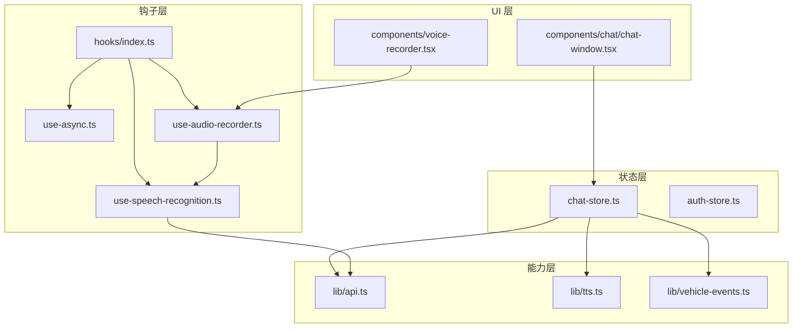
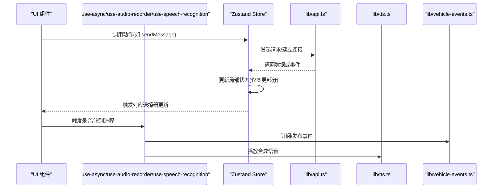
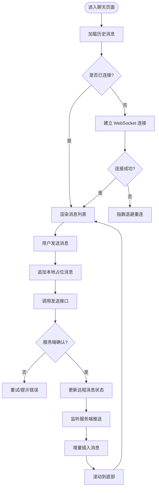
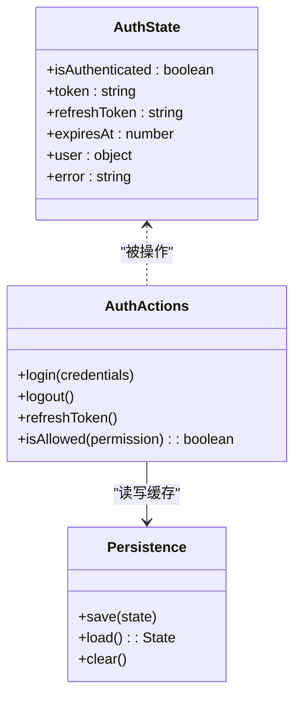
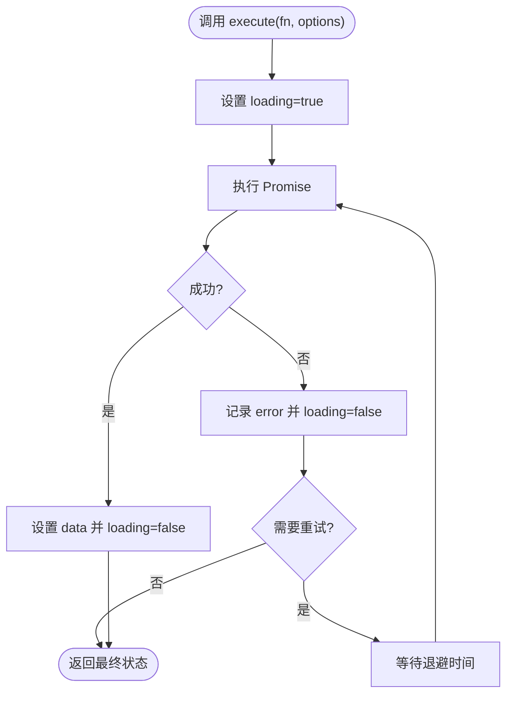
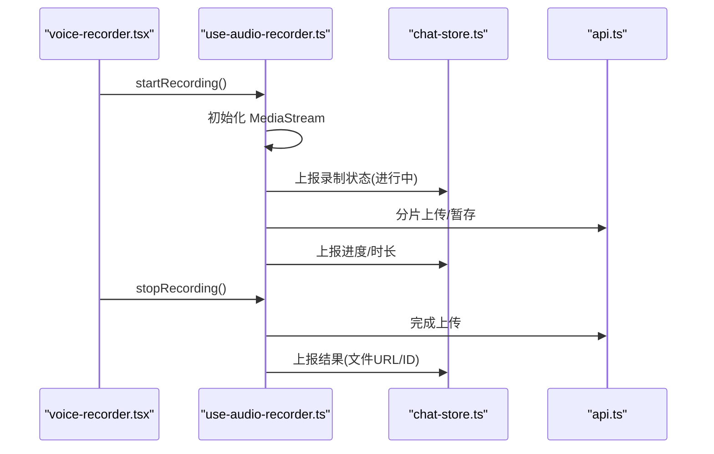
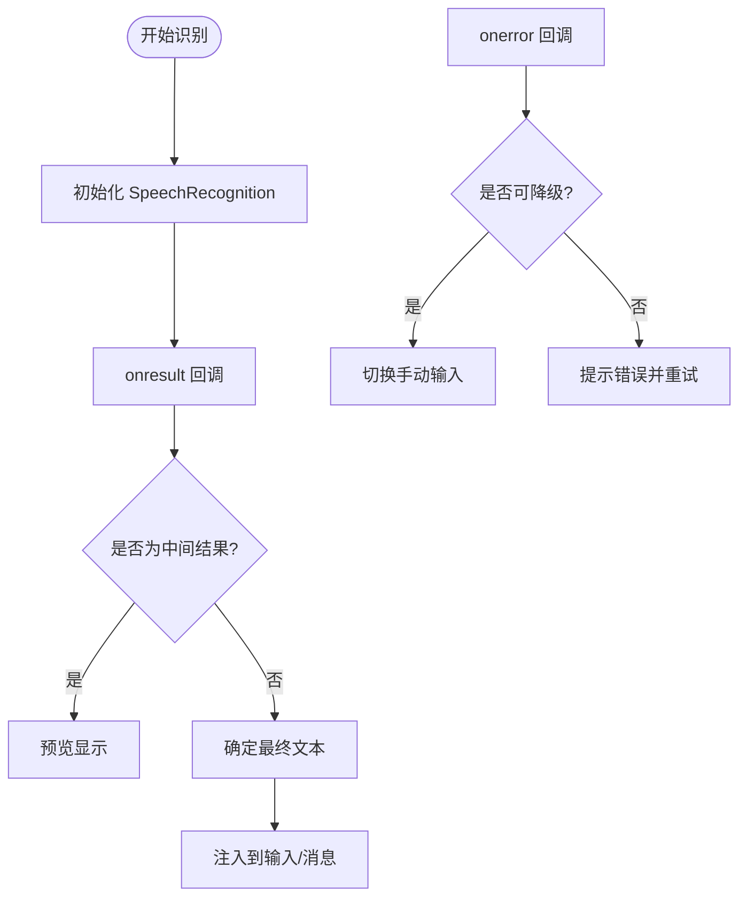
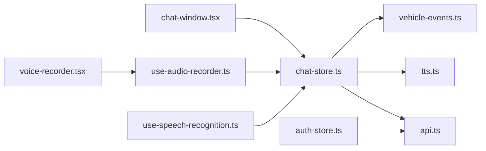

# 状态管理

<cite>
**本文引用的文件**   
- [chat-store.ts](file://frontend_design/src/stores/chat-store.ts)
- [auth-store.ts](file://frontend_design/src/stores/auth-store.ts)
- [use-async.ts](file://frontend_design/src/hooks/use-async.ts)
- [use-audio-recorder.ts](file://frontend_design/src/hooks/use-audio-recorder.ts)
- [use-speech-recognition.ts](file://frontend_design/src/hooks/use-speech-recognition.ts)
- [index.ts](file://frontend_design/src/hooks/index.ts)
- [api.ts](file://frontend_design/src/lib/api.ts)
- [tts.ts](file://frontend_design/src/lib/tts.ts)
- [vehicle-events.ts](file://frontend_design/src/lib/vehicle-events.ts)
- [chat-window.tsx](file://frontend_design/src/components/chat/chat-window.tsx)
- [voice-recorder.tsx](file://frontend_design/src/components/voice-recorder.tsx)
</cite>

## 目录
1. [简介](#简介)
2. [项目结构](#项目结构)
3. [核心组件](#核心组件)
4. [架构总览](#架构总览)
5. [详细组件分析](#详细组件分析)
6. [依赖分析](#依赖分析)
7. [性能考虑](#性能考虑)
8. [故障排查指南](#故障排查指南)
9. [结论](#结论)
10. [附录](#附录)

## 简介
本文件聚焦前端状态管理，围绕基于 Zustand 的 store 设计与实现展开，重点覆盖：
- chat-store.ts：聊天消息列表、会话管理与实时状态同步
- auth-store.ts：用户认证状态、权限控制与用户信息缓存
- 自定义 hooks：use-async 异步状态管理、use-audio-recorder 音频录制、use-speech-recognition 语音识别
- 状态持久化策略与性能优化方法
- 状态调试与错误处理最佳实践

## 项目结构
前端状态相关代码主要位于 frontend_design/src 下：
- stores：Zustand store 定义（chat-store.ts、auth-store.ts）
- hooks：业务型自定义 hooks（use-async.ts、use-audio-recorder.ts、use-speech-recognition.ts），统一导出入口 index.ts
- lib：网络与工具库（api.ts、tts.ts、vehicle-events.ts）
- components：使用上述 store 和 hooks 的 UI 组件（如 chat-window.tsx、voice-recorder.tsx）

图表来源
- [chat-store.ts:1-200](file://frontend_design/src/stores/chat-store.ts#L1-L200)
- [auth-store.ts:1-200](file://frontend_design/src/stores/auth-store.ts#L1-L200)
- [use-async.ts:1-200](file://frontend_design/src/hooks/use-async.ts#L1-L200)
- [use-audio-recorder.ts:1-200](file://frontend_design/src/hooks/use-audio-recorder.ts#L1-L200)
- [use-speech-recognition.ts:1-200](file://frontend_design/src/hooks/use-speech-recognition.ts#L1-L200)
- [index.ts:1-200](file://frontend_design/src/hooks/index.ts#L1-L200)
- [api.ts:1-200](file://frontend_design/src/lib/api.ts#L1-L200)
- [tts.ts:1-200](file://frontend_design/src/lib/tts.ts#L1-L200)
- [vehicle-events.ts:1-200](file://frontend_design/src/lib/vehicle-events.ts#L1-L200)
- [chat-window.tsx:1-200](file://frontend_design/src/components/chat/chat-window.tsx#L1-L200)
- [voice-recorder.tsx:1-200](file://frontend_design/src/components/voice-recorder.tsx#L1-L200)

章节来源
- [chat-store.ts:1-200](file://frontend_design/src/stores/chat-store.ts#L1-L200)
- [auth-store.ts:1-200](file://frontend_design/src/stores/auth-store.ts#L1-L200)
- [use-async.ts:1-200](file://frontend_design/src/hooks/use-async.ts#L1-L200)
- [use-audio-recorder.ts:1-200](file://frontend_design/src/hooks/use-audio-recorder.ts#L1-L200)
- [use-speech-recognition.ts:1-200](file://frontend_design/src/hooks/use-speech-recognition.ts#L1-L200)
- [index.ts:1-200](file://frontend_design/src/hooks/index.ts#L1-L200)
- [api.ts:1-200](file://frontend_design/src/lib/api.ts#L1-L200)
- [tts.ts:1-200](file://frontend_design/src/lib/tts.ts#L1-L200)
- [vehicle-events.ts:1-200](file://frontend_design/src/lib/vehicle-events.ts#L1-L200)
- [chat-window.tsx:1-200](file://frontend_design/src/components/chat/chat-window.tsx#L1-L200)
- [voice-recorder.tsx:1-200](file://frontend_design/src/components/voice-recorder.tsx#L1-L200)

## 核心组件
本节概述各模块职责与交互关系。

- chat-store.ts
  - 维护聊天消息列表与会话上下文
  - 提供发送消息、加载历史、清空会话等动作
  - 与 WebSocket/事件总线集成，实现服务端消息推送的前端状态同步
- auth-store.ts
  - 管理登录态、用户信息与权限
  - 提供登录、登出、刷新令牌等方法
  - 负责本地缓存与过期策略
- use-async.ts
  - 封装通用异步流程（loading/error/data）
  - 支持取消、重试与节流防抖扩展点
- use-audio-recorder.ts
  - 封装 MediaRecorder 与流式采集
  - 提供开始/停止、暂停/恢复、转码与上传接口
- use-speech-recognition.ts
  - 封装浏览器 SpeechRecognition API
  - 提供实时转写、结果回调与错误处理
- hooks/index.ts
  - 统一导出 hooks，便于按功能域导入
- lib/api.ts / tts.ts / vehicle-events.ts
  - 网络请求、TTS 播放、车辆事件订阅等能力抽象

章节来源
- [chat-store.ts:1-200](file://frontend_design/src/stores/chat-store.ts#L1-L200)
- [auth-store.ts:1-200](file://frontend_design/src/stores/auth-store.ts#L1-L200)
- [use-async.ts:1-200](file://frontend_design/src/hooks/use-async.ts#L1-L200)
- [use-audio-recorder.ts:1-200](file://frontend_design/src/hooks/use-audio-recorder.ts#L1-L200)
- [use-speech-recognition.ts:1-200](file://frontend_design/src/hooks/use-speech-recognition.ts#L1-L200)
- [index.ts:1-200](file://frontend_design/src/hooks/index.ts#L1-L200)
- [api.ts:1-200](file://frontend_design/src/lib/api.ts#L1-L200)
- [tts.ts:1-200](file://frontend_design/src/lib/tts.ts#L1-L200)
- [vehicle-events.ts:1-200](file://frontend_design/src/lib/vehicle-events.ts#L1-L200)

## 架构总览
整体采用“UI 层 -> hooks 层 -> store 层 -> 能力层”的分层模式。store 作为单一事实源，hooks 将复杂能力封装为可复用的逻辑单元，UI 通过订阅 store 片段实现最小化重渲染。

图表来源
- [chat-store.ts:1-200](file://frontend_design/src/stores/chat-store.ts#L1-L200)
- [auth-store.ts:1-200](file://frontend_design/src/stores/auth-store.ts#L1-L200)
- [use-async.ts:1-200](file://frontend_design/src/hooks/use-async.ts#L1-L200)
- [use-audio-recorder.ts:1-200](file://frontend_design/src/hooks/use-audio-recorder.ts#L1-L200)
- [use-speech-recognition.ts:1-200](file://frontend_design/src/hooks/use-speech-recognition.ts#L1-L200)
- [api.ts:1-200](file://frontend_design/src/lib/api.ts#L1-L200)
- [tts.ts:1-200](file://frontend_design/src/lib/tts.ts#L1-L200)
- [vehicle-events.ts:1-200](file://frontend_design/src/lib/vehicle-events.ts#L1-L200)

## 详细组件分析

### chat-store.ts：聊天状态管理
- 状态设计
  - 消息列表：以有序集合存储，支持分页加载与增量追加
  - 会话上下文：当前会话标识、元数据、是否正在生成
  - 实时状态：连接状态、断线重连计数、最后活跃时间
- 关键动作
  - 发送消息：入队待发送消息，调用后端接口，成功后落盘并触发滚动定位
  - 加载历史：根据页码拉取历史消息，合并去重
  - 清空会话：重置消息与上下文
  - 接收推送：监听 WebSocket/事件总线，增量插入消息并更新阅读标记
- 与外部系统协作
  - 通过 api.ts 进行 HTTP/WebSocket 通信
  - 通过 tts.ts 触发文本转语音播放
  - 通过 vehicle-events.ts 订阅车辆状态变化，用于对话上下文增强

图表来源
- [chat-store.ts:1-200](file://frontend_design/src/stores/chat-store.ts#L1-L200)
- [api.ts:1-200](file://frontend_design/src/lib/api.ts#L1-L200)
- [tts.ts:1-200](file://frontend_design/src/lib/tts.ts#L1-L200)
- [vehicle-events.ts:1-200](file://frontend_design/src/lib/vehicle-events.ts#L1-L200)

章节来源
- [chat-store.ts:1-200](file://frontend_design/src/stores/chat-store.ts#L1-L200)
- [chat-window.tsx:1-200](file://frontend_design/src/components/chat/chat-window.tsx#L1-L200)

### auth-store.ts：认证状态管理
- 状态设计
  - 登录态：是否已登录、令牌有效期、刷新令牌
  - 用户信息：基础资料、角色与权限集
  - 错误信息：最近一次认证错误
- 关键动作
  - 登录：提交凭据，保存令牌与用户信息，设置过期时间
  - 登出：清理本地缓存与内存状态
  - 刷新令牌：在即将过期时自动刷新，失败则跳转登录
  - 权限校验：提供 isAllowed 判断，结合路由守卫使用
- 持久化策略
  - 使用 localStorage/sessionStorage 缓存敏感信息（建议加密）
  - 过期时间戳校验，避免无效令牌继续生效

图表来源
- [auth-store.ts:1-200](file://frontend_design/src/stores/auth-store.ts#L1-L200)

章节来源
- [auth-store.ts:1-200](file://frontend_design/src/stores/auth-store.ts#L1-L200)

### 自定义 hooks 设计模式

#### use-async：通用异步状态管理
- 目标：将 loading/error/data 三态从组件中抽离，减少样板代码
- 能力
  - 执行函数：接受 Promise，自动管理三态
  - 取消：支持 AbortController 取消
  - 重试：可配置最大重试次数与退避策略
  - 节流/防抖：可选参数控制高频调用
- 典型用法：封装 fetch/get/post 等请求，供 store 或组件复用

图表来源
- [use-async.ts:1-200](file://frontend_design/src/hooks/use-async.ts#L1-L200)

章节来源
- [use-async.ts:1-200](file://frontend_design/src/hooks/use-async.ts#L1-L200)

#### use-audio-recorder：音频录制
- 目标：封装浏览器录音能力，提供稳定一致的录制体验
- 能力
  - 开始/停止/暂停/恢复
  - 流式获取 PCM/Opus 数据
  - 上传至后端或转为 Blob 供预览
  - 错误处理：权限拒绝、设备不可用、编码失败
- 与 store 协作：将录制进度与结果写入 store，驱动 UI 更新

图表来源
- [use-audio-recorder.ts:1-200](file://frontend_design/src/hooks/use-audio-recorder.ts#L1-L200)
- [chat-store.ts:1-200](file://frontend_design/src/stores/chat-store.ts#L1-L200)
- [voice-recorder.tsx:1-200](file://frontend_design/src/components/voice-recorder.tsx#L1-L200)
- [api.ts:1-200](file://frontend_design/src/lib/api.ts#L1-L200)

章节来源
- [use-audio-recorder.ts:1-200](file://frontend_design/src/hooks/use-audio-recorder.ts#L1-L200)
- [voice-recorder.tsx:1-200](file://frontend_design/src/components/voice-recorder.tsx#L1-L200)

#### use-speech-recognition：语音识别
- 目标：封装 Web Speech API，提供实时转写与错误兜底
- 能力
  - 开始/停止识别
  - 实时中间结果与最终结果回调
  - 语言切换、置信度阈值过滤
  - 兼容降级：不支持时回退到手动输入
- 与 store 协作：将识别结果注入聊天输入或作为消息内容

图表来源
- [use-speech-recognition.ts:1-200](file://frontend_design/src/hooks/use-speech-recognition.ts#L1-L200)

章节来源
- [use-speech-recognition.ts:1-200](file://frontend_design/src/hooks/use-speech-recognition.ts#L1-L200)

#### hooks/index.ts：统一导出
- 作用：集中导出 use-async、use-audio-recorder、use-speech-recognition，方便按功能域导入
- 好处：降低耦合，便于后续替换实现或增加新 hook

章节来源
- [index.ts:1-200](file://frontend_design/src/hooks/index.ts#L1-L200)

## 依赖分析
- 组件对 hooks 的依赖
  - chat-window.tsx 依赖 chat-store.ts 与 tts.ts
  - voice-recorder.tsx 依赖 use-audio-recorder.ts 与 api.ts
- hooks 对 store 的依赖
  - use-audio-recorder.ts 可能将录制结果写入 chat-store.ts
  - use-speech-recognition.ts 可能将识别结果写入 chat-store.ts
- store 对能力层的依赖
  - chat-store.ts 依赖 api.ts、tts.ts、vehicle-events.ts
  - auth-store.ts 依赖 api.ts 与本地存储

图表来源
- [chat-window.tsx:1-200](file://frontend_design/src/components/chat/chat-window.tsx#L1-L200)
- [voice-recorder.tsx:1-200](file://frontend_design/src/components/voice-recorder.tsx#L1-L200)
- [chat-store.ts:1-200](file://frontend_design/src/stores/chat-store.ts#L1-L200)
- [auth-store.ts:1-200](file://frontend_design/src/stores/auth-store.ts#L1-L200)
- [use-audio-recorder.ts:1-200](file://frontend_design/src/hooks/use-audio-recorder.ts#L1-L200)
- [use-speech-recognition.ts:1-200](file://frontend_design/src/hooks/use-speech-recognition.ts#L1-L200)
- [api.ts:1-200](file://frontend_design/src/lib/api.ts#L1-L200)
- [tts.ts:1-200](file://frontend_design/src/lib/tts.ts#L1-L200)
- [vehicle-events.ts:1-200](file://frontend_design/src/lib/vehicle-events.ts#L1-L200)

章节来源
- [chat-window.tsx:1-200](file://frontend_design/src/components/chat/chat-window.tsx#L1-L200)
- [voice-recorder.tsx:1-200](file://frontend_design/src/components/voice-recorder.tsx#L1-L200)
- [chat-store.ts:1-200](file://frontend_design/src/stores/chat-store.ts#L1-L200)
- [auth-store.ts:1-200](file://frontend_design/src/stores/auth-store.ts#L1-L200)
- [use-audio-recorder.ts:1-200](file://frontend_design/src/hooks/use-audio-recorder.ts#L1-L200)
- [use-speech-recognition.ts:1-200](file://frontend_design/src/hooks/use-speech-recognition.ts#L1-L200)
- [api.ts:1-200](file://frontend_design/src/lib/api.ts#L1-L200)
- [tts.ts:1-200](file://frontend_design/src/lib/tts.ts#L1-L200)
- [vehicle-events.ts:1-200](file://frontend_design/src/lib/vehicle-events.ts#L1-L200)

## 性能考虑
- 选择器粒度
  - 使用 Zustand 选择器精确订阅所需字段，避免整树重渲染
- 批量更新
  - 合并多次状态变更，减少渲染次数
- 虚拟列表
  - 长消息列表采用虚拟化渲染，按需挂载节点
- 去重与增量
  - 消息合并策略避免重复插入；WebSocket 推送仅应用差异
- 资源回收
  - 及时释放 MediaStream、SpeechRecognition 实例与定时器
- 缓存与预取
  - 对热点数据（如用户信息、常用模板）做短期缓存
- 节流与防抖
  - 输入框、滚动、窗口 resize 等高频事件需节流/防抖

[本节为通用指导，不直接分析具体文件]

## 故障排查指南
- 常见问题
  - 录音权限被拒：检查浏览器权限弹窗与 HTTPS 环境要求
  - 语音识别不可用：检测浏览器兼容性并提供手动输入降级
  - WebSocket 频繁断线：检查网络状况与心跳机制，合理退避重连
  - 令牌过期：确保刷新令牌逻辑正确，必要时引导重新登录
- 调试技巧
  - 打印 store 快照与动作日志，定位状态变更来源
  - 使用浏览器开发者工具的 Performance 面板分析重渲染热点
  - 对关键路径添加埋点（耗时、错误率、重试次数）
- 错误处理
  - 统一错误分类与提示文案
  - 区分可恢复错误与致命错误，提供重试与回滚策略

章节来源
- [chat-store.ts:1-200](file://frontend_design/src/stores/chat-store.ts#L1-L200)
- [auth-store.ts:1-200](file://frontend_design/src/stores/auth-store.ts#L1-L200)
- [use-audio-recorder.ts:1-200](file://frontend_design/src/hooks/use-audio-recorder.ts#L1-L200)
- [use-speech-recognition.ts:1-200](file://frontend_design/src/hooks/use-speech-recognition.ts#L1-L200)

## 结论
本项目采用 Zustand 作为状态中心，配合可复用的自定义 hooks 与清晰的能力分层，实现了聊天、认证、音视频等复杂场景的状态管理。通过选择器细粒度订阅、增量更新与完善的错误处理，兼顾了用户体验与可维护性。后续可在持久化、监控与测试方面进一步完善。

[本节为总结性内容，不直接分析具体文件]

## 附录
- 术语
  - Store：状态容器，提供读取与更新能力
  - Hook：封装可复用逻辑的函数，常用于副作用与状态组合
  - 选择器：从 store 中抽取特定字段的订阅方式
- 参考路径
  - 聊天状态：[chat-store.ts](file://frontend_design/src/stores/chat-store.ts)
  - 认证状态：[auth-store.ts](file://frontend_design/src/stores/auth-store.ts)
  - 异步状态：[use-async.ts](file://frontend_design/src/hooks/use-async.ts)
  - 音频录制：[use-audio-recorder.ts](file://frontend_design/src/hooks/use-audio-recorder.ts)
  - 语音识别：[use-speech-recognition.ts](file://frontend_design/src/hooks/use-speech-recognition.ts)
  - 统一导出：[index.ts](file://frontend_design/src/hooks/index.ts)
  - 网络与工具：[api.ts](file://frontend_design/src/lib/api.ts)、[tts.ts](file://frontend_design/src/lib/tts.ts)、[vehicle-events.ts](file://frontend_design/src/lib/vehicle-events.ts)
  - 组件示例：[chat-window.tsx](file://frontend_design/src/components/chat/chat-window.tsx)、[voice-recorder.tsx](file://frontend_design/src/components/voice-recorder.tsx)