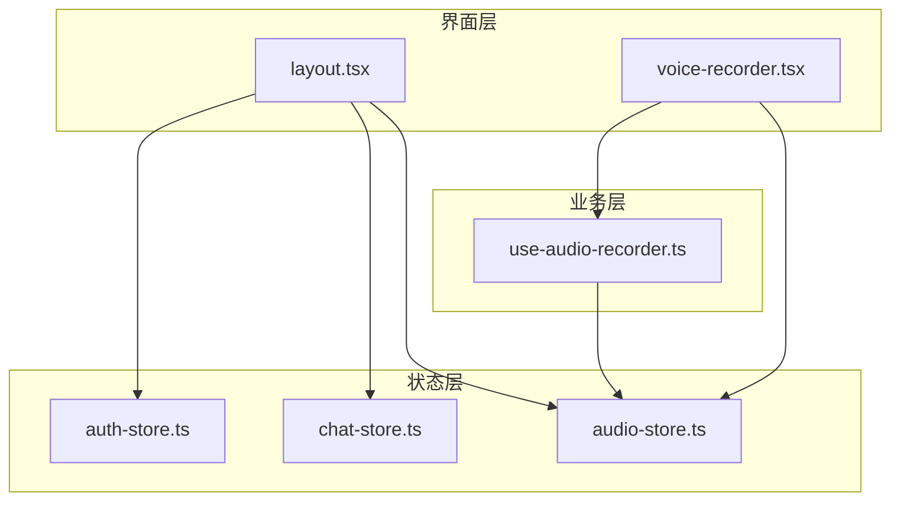
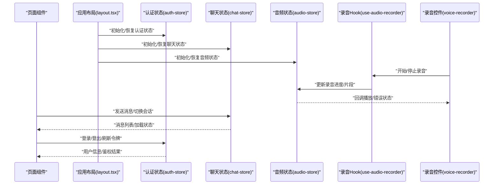
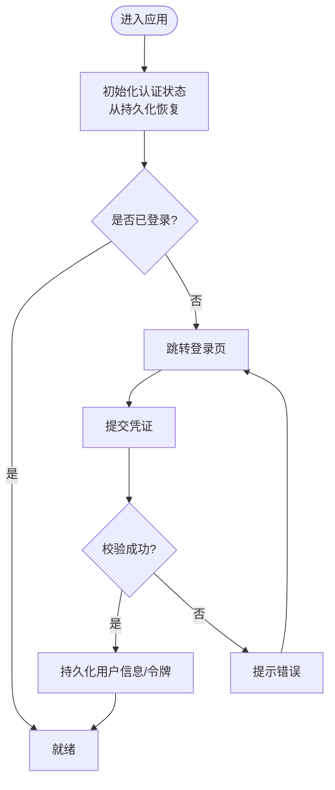
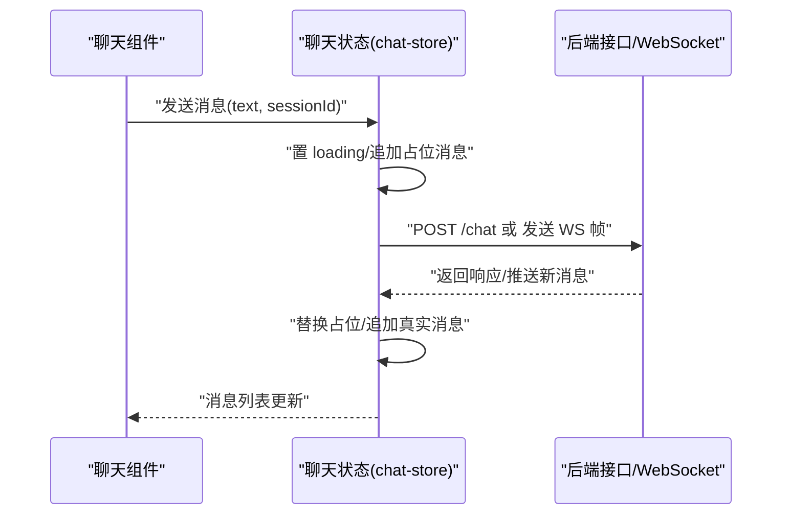
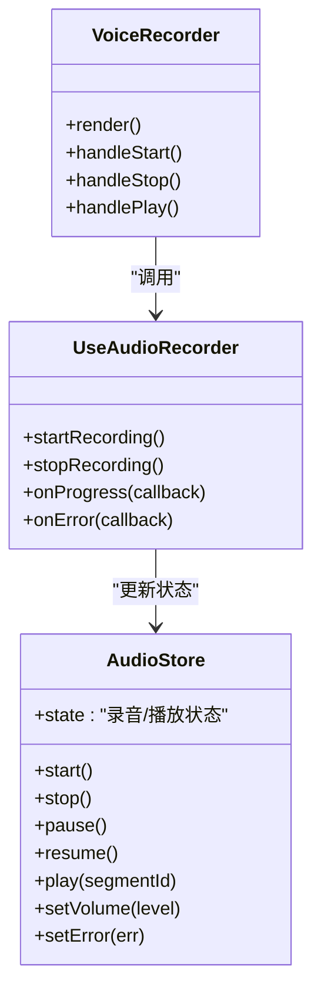
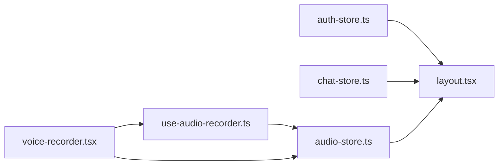

# 全局状态管理

<cite>
**本文引用的文件**   
- [frontend_design/src/stores/auth-store.ts](file://frontend_design/src/stores/auth-store.ts)
- [frontend_design/src/stores/chat-store.ts](file://frontend_design/src/stores/chat-store.ts)
- [frontend_design/src/stores/audio-store.ts](file://frontend_design/src/stores/audio-store.ts)
- [frontend_design/src/hooks/use-audio-recorder.ts](file://frontend_design/src/hooks/use-audio-recorder.ts)
- [frontend_design/src/components/voice-recorder.tsx](file://frontend_design/src/components/voice-recorder.tsx)
- [frontend_design/src/app/layout.tsx](file://frontend_design/src/app/layout.tsx)
</cite>

## 目录
1. [简介](#简介)
2. [项目结构](#项目结构)
3. [核心组件](#核心组件)
4. [架构总览](#架构总览)
5. [详细组件分析](#详细组件分析)
6. [依赖关系分析](#依赖关系分析)
7. [性能考虑](#性能考虑)
8. [故障排查指南](#故障排查指南)
9. [结论](#结论)
10. [附录](#附录)

## 简介
本文件面向 NexusCockpit 前端应用的全局状态管理，聚焦基于 Zustand 的状态设计、实现与使用。文档覆盖认证状态（auth-store）、聊天状态（chat-store）、音频状态（audio-store）三大核心模块，阐述状态定义模式、更新机制、订阅模式与选择器使用；并给出持久化策略、跨模块同步机制与性能优化建议。同时提供在组件中创建、更新与订阅状态的实践方式、最佳实践与调试方法，帮助读者快速上手并高效维护。

## 项目结构
前端状态相关代码集中在 stores 目录，配合 hooks 与 UI 组件完成数据流闭环：
- stores：Zustand store 定义与导出
- hooks：封装与 store 交互的自定义 Hook（如录音）
- components：UI 组件通过 Hook 或 store 直接消费状态
- app/layout.tsx：应用启动时初始化关键 store（如持久化恢复）

图表来源
- [frontend_design/src/stores/auth-store.ts](file://frontend_design/src/stores/auth-store.ts)
- [frontend_design/src/stores/chat-store.ts](file://frontend_design/src/stores/chat-store.ts)
- [frontend_design/src/stores/audio-store.ts](file://frontend_design/src/stores/audio-store.ts)
- [frontend_design/src/hooks/use-audio-recorder.ts](file://frontend_design/src/hooks/use-audio-recorder.ts)
- [frontend_design/src/components/voice-recorder.tsx](file://frontend_design/src/components/voice-recorder.tsx)
- [frontend_design/src/app/layout.tsx](file://frontend_design/src/app/layout.tsx)

章节来源
- [frontend_design/src/stores/auth-store.ts](file://frontend_design/src/stores/auth-store.ts)
- [frontend_design/src/stores/chat-store.ts](file://frontend_design/src/stores/chat-store.ts)
- [frontend_design/src/stores/audio-store.ts](file://frontend_design/src/stores/audio-store.ts)
- [frontend_design/src/hooks/use-audio-recorder.ts](file://frontend_design/src/hooks/use-audio-recorder.ts)
- [frontend_design/src/components/voice-recorder.tsx](file://frontend_design/src/components/voice-recorder.tsx)
- [frontend_design/src/app/layout.tsx](file://frontend_design/src/app/layout.tsx)

## 核心组件
本节概述三个核心 store 的职责与边界：
- 认证状态（auth-store）：负责用户登录态、权限信息、会话生命周期等
- 聊天状态（chat-store）：负责消息列表、会话上下文、发送/接收流程等
- 音频状态（audio-store）：负责录音、播放、音量、设备枚举与错误状态等

这些 store 通常遵循以下通用模式：
- 定义：以 create 工厂函数声明 state、actions、selectors
- 更新：通过 actions 进行不可变更新，避免直接修改 state
- 订阅：组件通过 selector 精确订阅所需字段，减少重渲染
- 持久化：结合中间件将关键状态落盘，保证刷新后恢复
- 组合：复杂逻辑可拆分为多个小 store，并通过 actions 互相调用

章节来源
- [frontend_design/src/stores/auth-store.ts](file://frontend_design/src/stores/auth-store.ts)
- [frontend_design/src/stores/chat-store.ts](file://frontend_design/src/stores/chat-store.ts)
- [frontend_design/src/stores/audio-store.ts](file://frontend_design/src/stores/audio-store.ts)

## 架构总览
下图展示从页面到状态再到外部资源的数据流向，以及关键同步点：

图表来源
- [frontend_design/src/app/layout.tsx](file://frontend_design/src/app/layout.tsx)
- [frontend_design/src/stores/auth-store.ts](file://frontend_design/src/stores/auth-store.ts)
- [frontend_design/src/stores/chat-store.ts](file://frontend_design/src/stores/chat-store.ts)
- [frontend_design/src/stores/audio-store.ts](file://frontend_design/src/stores/audio-store.ts)
- [frontend_design/src/hooks/use-audio-recorder.ts](file://frontend_design/src/hooks/use-audio-recorder.ts)
- [frontend_design/src/components/voice-recorder.tsx](file://frontend_design/src/components/voice-recorder.tsx)

## 详细组件分析

### 认证状态（auth-store）
职责与边界
- 管理用户身份、角色、权限、登录态与过期时间
- 提供登录、登出、刷新令牌、设置用户信息等动作
- 支持持久化，确保刷新后自动恢复登录态

典型用法要点
- 在应用入口（layout.tsx）恢复持久化的认证状态
- 组件通过选择器仅订阅必要字段，避免全量订阅导致重渲染
- 敏感操作前校验登录态，必要时触发静默刷新令牌

更新与订阅模式
- 更新：通过 actions 返回新的用户对象或标记登录态变化
- 订阅：使用 selector 获取 user、isAuthenticated、token 等
- 副作用：在登录成功后拉取用户资料或初始化其他模块状态

持久化策略
- 将 token、用户基本信息持久化到本地存储
- 处理过期与刷新逻辑，失败时回退到未登录态

图表来源
- [frontend_design/src/stores/auth-store.ts](file://frontend_design/src/stores/auth-store.ts)
- [frontend_design/src/app/layout.tsx](file://frontend_design/src/app/layout.tsx)

章节来源
- [frontend_design/src/stores/auth-store.ts](file://frontend_design/src/stores/auth-store.ts)
- [frontend_design/src/app/layout.tsx](file://frontend_design/src/app/layout.tsx)

### 聊天状态（chat-store）
职责与边界
- 维护消息列表、当前会话、发送/接收状态、错误与分页
- 提供发送消息、清空历史、切换会话、批量导入等动作
- 可与后端 API 或 WebSocket 集成，保持前后端一致

典型用法要点
- 发送消息前先置 loading，成功后追加消息并滚动到底部
- 使用选择器订阅当前会话的消息列表，避免无关消息变更触发重渲染
- 对长列表采用虚拟滚动或分页加载，降低渲染压力

更新与订阅模式
- 更新：追加消息、合并增量、重置会话
- 订阅：按会话维度选择消息数组、loading、error 等
- 副作用：在收到新消息时触发 TTS 播报或语音合成

图表来源
- [frontend_design/src/stores/chat-store.ts](file://frontend_design/src/stores/chat-store.ts)

章节来源
- [frontend_design/src/stores/chat-store.ts](file://frontend_design/src/stores/chat-store.ts)

### 音频状态（audio-store）
职责与边界
- 管理录音状态（进行中/暂停/结束）、播放控制、音量、设备枚举与错误
- 暴露 start/stop/pause/resume/play/stop 等动作
- 与 use-audio-recorder Hook 协作，驱动 UI 反馈

典型用法要点
- 在 voice-recorder 中通过 Hook 发起录音，并将进度与片段写入 audio-store
- 播放时监听 onended/onerror，统一更新错误与状态
- 使用选择器订阅 isRecording/isPlaying/currentSegment 等细粒度字段

更新与订阅模式
- 更新：原子性更新录音阶段、片段集合、播放指针
- 订阅：仅订阅当前需要的播放/录音状态，避免全量更新
- 副作用：在录音结束时上传片段或触发后续处理

图表来源
- [frontend_design/src/stores/audio-store.ts](file://frontend_design/src/stores/audio-store.ts)
- [frontend_design/src/hooks/use-audio-recorder.ts](file://frontend_design/src/hooks/use-audio-recorder.ts)
- [frontend_design/src/components/voice-recorder.tsx](file://frontend_design/src/components/voice-recorder.tsx)

章节来源
- [frontend_design/src/stores/audio-store.ts](file://frontend_design/src/stores/audio-store.ts)
- [frontend_design/src/hooks/use-audio-recorder.ts](file://frontend_design/src/hooks/use-audio-recorder.ts)
- [frontend_design/src/components/voice-recorder.tsx](file://frontend_design/src/components/voice-recorder.tsx)

## 依赖关系分析
- 低耦合：各 store 独立定义，通过 actions 暴露能力，组件按需订阅
- 明确边界：认证、聊天、音频各司其职，避免跨域污染
- 组合式：复杂场景下可在 layout.tsx 中编排初始化顺序与依赖

图表来源
- [frontend_design/src/stores/auth-store.ts](file://frontend_design/src/stores/auth-store.ts)
- [frontend_design/src/stores/chat-store.ts](file://frontend_design/src/stores/chat-store.ts)
- [frontend_design/src/stores/audio-store.ts](file://frontend_design/src/stores/audio-store.ts)
- [frontend_design/src/hooks/use-audio-recorder.ts](file://frontend_design/src/hooks/use-audio-recorder.ts)
- [frontend_design/src/components/voice-recorder.tsx](file://frontend_design/src/components/voice-recorder.tsx)
- [frontend_design/src/app/layout.tsx](file://frontend_design/src/app/layout.tsx)

章节来源
- [frontend_design/src/stores/auth-store.ts](file://frontend_design/src/stores/auth-store.ts)
- [frontend_design/src/stores/chat-store.ts](file://frontend_design/src/stores/chat-store.ts)
- [frontend_design/src/stores/audio-store.ts](file://frontend_design/src/stores/audio-store.ts)
- [frontend_design/src/hooks/use-audio-recorder.ts](file://frontend_design/src/hooks/use-audio-recorder.ts)
- [frontend_design/src/components/voice-recorder.tsx](file://frontend_design/src/components/voice-recorder.tsx)
- [frontend_design/src/app/layout.tsx](file://frontend_design/src/app/layout.tsx)

## 性能考虑
- 选择器优先：组件只订阅必要字段，避免整树订阅导致的频繁重渲染
- 不可变更新：每次更新返回新引用，便于浅比较与 React 优化
- 分片与分页：聊天消息与音频片段采用分页/分片加载，降低内存占用
- 防抖与节流：高频输入（如搜索、滚动）需加防抖/节流
- 懒加载与缓存：非首屏状态延迟初始化，热点数据加入缓存
- 事件去重：WebSocket 或轮询场景下对重复消息做幂等处理
- 计算缓存：复杂派生状态使用 memo 或选择器缓存

[本节为通用指导，不直接分析具体文件]

## 故障排查指南
常见问题与定位思路
- 状态未持久化：检查初始化顺序与持久化中间件配置，确认 key 与序列化策略
- 组件不更新：确认是否使用了选择器且返回值引用发生变化
- 录音异常：查看 audio-store 的错误字段与浏览器权限提示，核对麦克风访问
- 聊天不同步：检查消息追加逻辑与唯一 ID 生成，避免重复或丢失
- 认证失效：确认令牌刷新逻辑与过期时间戳处理

调试技巧
- 打印状态快照：在关键 action 前后输出必要字段（脱敏）
- 记录调用栈：在复杂 action 中附加调用来源，便于回溯
- 断点与日志：在 Hook 与 store 的边界处打点，观察数据流
- 最小复现：剥离无关逻辑，构造最小用例验证问题

章节来源
- [frontend_design/src/stores/auth-store.ts](file://frontend_design/src/stores/auth-store.ts)
- [frontend_design/src/stores/chat-store.ts](file://frontend_design/src/stores/chat-store.ts)
- [frontend_design/src/stores/audio-store.ts](file://frontend_design/src/stores/audio-store.ts)
- [frontend_design/src/hooks/use-audio-recorder.ts](file://frontend_design/src/hooks/use-audio-recorder.ts)
- [frontend_design/src/components/voice-recorder.tsx](file://frontend_design/src/components/voice-recorder.tsx)

## 结论
通过清晰的职责划分、选择器驱动的细粒度订阅、不可变更新与必要的持久化，NexusCockpit 的前端状态管理具备良好的可维护性与扩展性。建议在后续迭代中持续完善错误上报、监控埋点与单元测试，进一步提升稳定性与可观测性。

[本节为总结性内容，不直接分析具体文件]

## 附录
- 最佳实践清单
  - 每个 store 只关注单一领域，避免“上帝状态”
  - 所有对外暴露的能力以 actions 形式提供，禁止外部直接修改 state
  - 使用选择器订阅最小必要字段，必要时拆分更细粒度的 store
  - 持久化仅包含必要字段，注意敏感信息脱敏与版本兼容
  - 对耗时操作引入 loading/error 状态，提升用户体验
  - 对高频更新路径增加防抖/节流与去重逻辑
- 调试清单
  - 在关键 action 前后输出必要字段与调用栈
  - 使用浏览器开发者工具追踪状态变更
  - 针对异步流程补充超时与重试策略，并记录失败原因

[本节为通用指导，不直接分析具体文件]