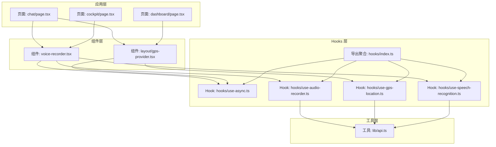
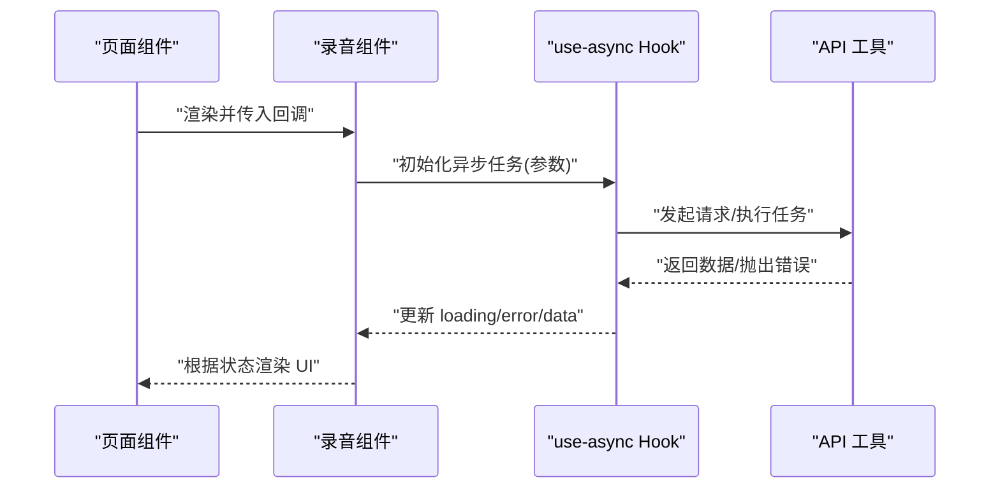
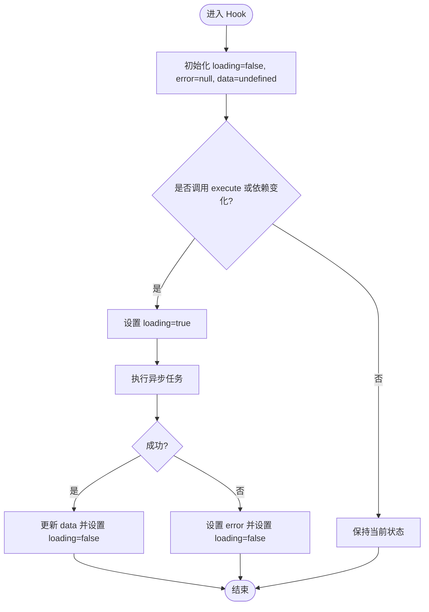
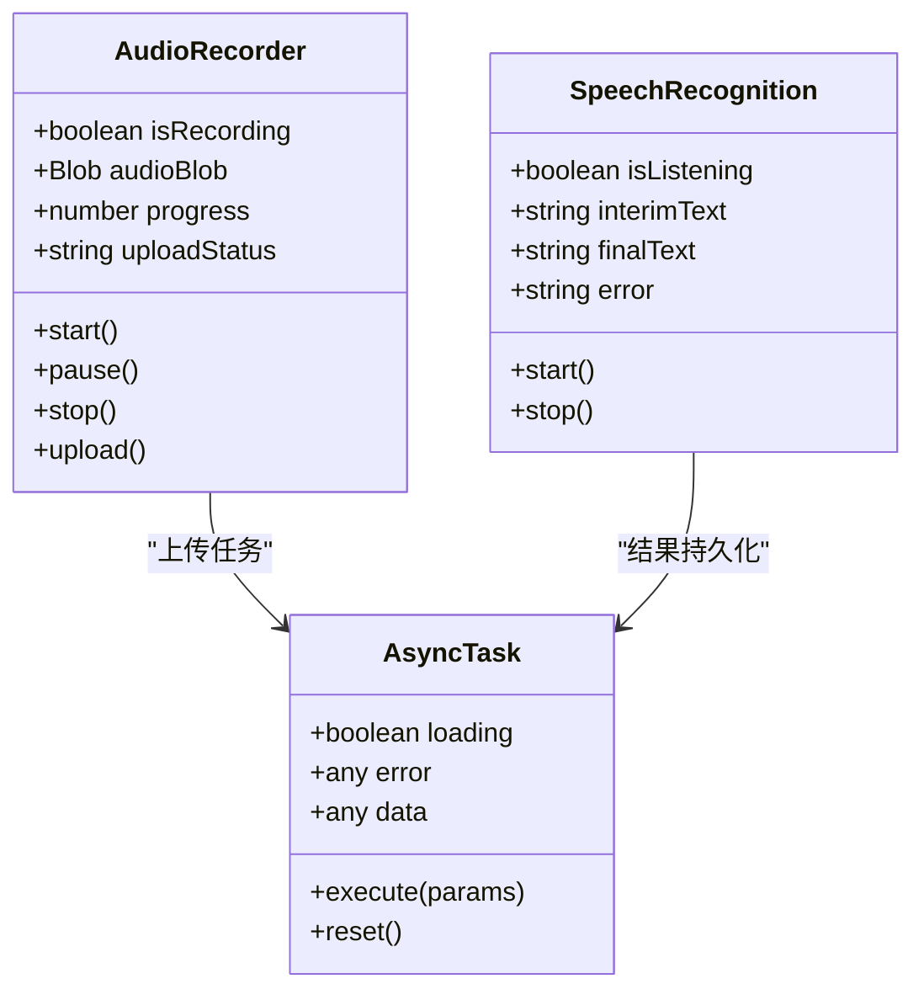
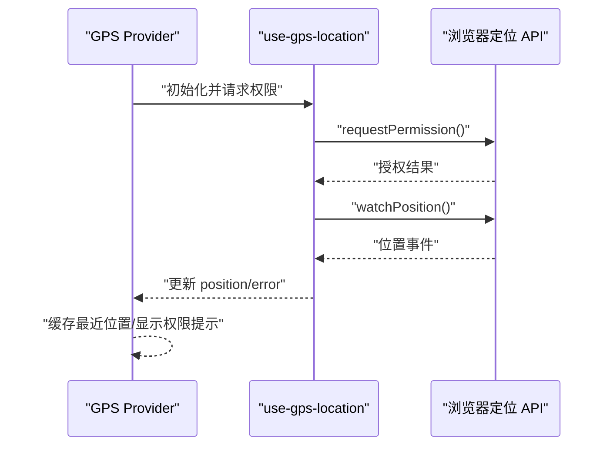
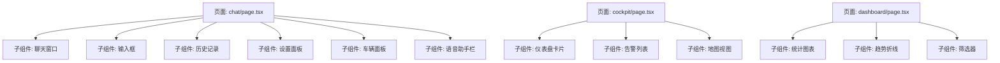
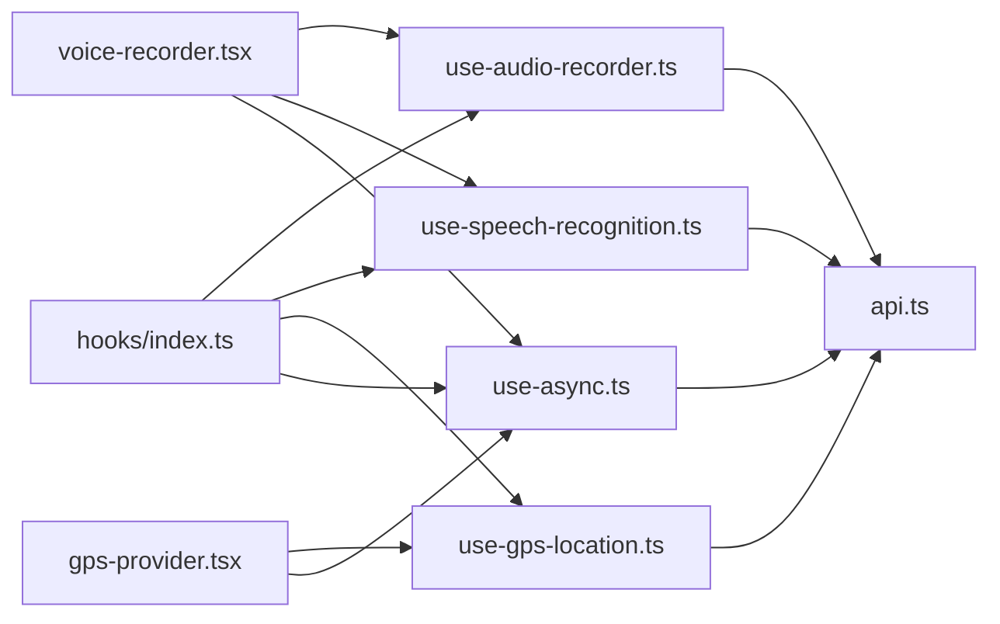

# 本地状态管理

<cite>
**本文引用的文件**   
- [frontend_design/src/hooks/use-async.ts](file://frontend_design/src/hooks/use-async.ts)
- [frontend_design/src/hooks/index.ts](file://frontend_design/src/hooks/index.ts)
- [frontend_design/src/hooks/use-audio-recorder.ts](file://frontend_design/src/hooks/use-audio-recorder.ts)
- [frontend_design/src/hooks/use-gps-location.ts](file://frontend_design/src/hooks/use-gps-location.ts)
- [frontend_design/src/hooks/use-speech-recognition.ts](file://frontend_design/src/hooks/use-speech-recognition.ts)
- [frontend_design/src/components/voice-recorder.tsx](file://frontend_design/src/components/voice-recorder.tsx)
- [frontend_design/src/components/layout/gps-provider.tsx](file://frontend_design/src/components/layout/gps-provider.tsx)
- [frontend_design/src/app/chat/page.tsx](file://frontend_design/src/app/chat/page.tsx)
- [frontend_design/src/app/cockpit/page.tsx](file://frontend_design/src/app/cockpit/page.tsx)
- [frontend_design/src/app/dashboard/page.tsx](file://frontend_design/src/app/dashboard/page.tsx)
- [frontend_design/src/lib/api.ts](file://frontend_design/src/lib/api.ts)
</cite>

## 目录
1. [简介](#简介)
2. [项目结构](#项目结构)
3. [核心组件](#核心组件)
4. [架构总览](#架构总览)
5. [详细组件分析](#详细组件分析)
6. [依赖分析](#依赖分析)
7. [性能考虑](#性能考虑)
8. [故障排查指南](#故障排查指南)
9. [结论](#结论)
10. [附录](#附录) 

## 简介
本文件聚焦于 NexusCockpit 前端应用的“本地状态管理”，围绕 React Hooks 在组件内部的状态组织与复用展开，重点包括：
- 基础 Hooks（useState、useEffect）的常见使用模式
- 自定义 Hook 的设计模式与职责边界
- use-async 异步状态管理 Hook 的实现原理与用法
- 组件内状态的组织结构、状态提升策略与共享模式
- 表单状态、UI 交互状态、数据缓存状态的实战示例
- 本地状态的性能优化技巧与最佳实践

## 项目结构
NexusCockpit 的前端采用 Next.js + TypeScript 技术栈。与本地状态管理密切相关的目录与文件如下：
- hooks：集中存放可复用的自定义 Hook，如 use-async、use-audio-recorder、use-gps-location、use-speech-recognition
- components：业务组件，通常通过 useState/useEffect 管理 UI 与交互状态，并组合使用自定义 Hook
- app：页面级入口，负责将多个组件拼装成完整页面，必要时进行状态提升
- lib：工具库与网络请求封装，供组件或 Hook 调用

图表来源
- [frontend_design/src/app/chat/page.tsx](file://frontend_design/src/app/chat/page.tsx)
- [frontend_design/src/app/cockpit/page.tsx](file://frontend_design/src/app/cockpit/page.tsx)
- [frontend_design/src/app/dashboard/page.tsx](file://frontend_design/src/app/dashboard/page.tsx)
- [frontend_design/src/components/voice-recorder.tsx](file://frontend_design/src/components/voice-recorder.tsx)
- [frontend_design/src/components/layout/gps-provider.tsx](file://frontend_design/src/components/layout/gps-provider.tsx)
- [frontend_design/src/hooks/use-async.ts](file://frontend_design/src/hooks/use-async.ts)
- [frontend_design/src/hooks/use-audio-recorder.ts](file://frontend_design/src/hooks/use-audio-recorder.ts)
- [frontend_design/src/hooks/use-gps-location.ts](file://frontend_design/src/hooks/use-gps-location.ts)
- [frontend_design/src/hooks/use-speech-recognition.ts](file://frontend_design/src/hooks/use-speech-recognition.ts)
- [frontend_design/src/hooks/index.ts](file://frontend_design/src/hooks/index.ts)
- [frontend_design/src/lib/api.ts](file://frontend_design/src/lib/api.ts)

章节来源
- [frontend_design/src/hooks/use-async.ts](file://frontend_design/src/hooks/use-async.ts)
- [frontend_design/src/hooks/index.ts](file://frontend_design/src/hooks/index.ts)
- [frontend_design/src/hooks/use-audio-recorder.ts](file://frontend_design/src/hooks/use-audio-recorder.ts)
- [frontend_design/src/hooks/use-gps-location.ts](file://frontend_design/src/hooks/use-gps-location.ts)
- [frontend_design/src/hooks/use-speech-recognition.ts](file://frontend_design/src/hooks/use-speech-recognition.ts)
- [frontend_design/src/components/voice-recorder.tsx](file://frontend_design/src/components/voice-recorder.tsx)
- [frontend_design/src/components/layout/gps-provider.tsx](file://frontend_design/src/components/layout/gps-provider.tsx)
- [frontend_design/src/app/chat/page.tsx](file://frontend_design/src/app/chat/page.tsx)
- [frontend_design/src/app/cockpit/page.tsx](file://frontend_design/src/app/cockpit/page.tsx)
- [frontend_design/src/app/dashboard/page.tsx](file://frontend_design/src/app/dashboard/page.tsx)
- [frontend_design/src/lib/api.ts](file://frontend_design/src/lib/api.ts)

## 核心组件
本节从“本地状态”的角度梳理关键模块的职责与协作关系。

- 自定义 Hook：use-async
  - 目标：统一封装异步操作的加载态、错误态与结果态，提供稳定的触发函数与清理能力
  - 典型输出：loading、error、data、execute（触发执行）、reset（重置状态）
  - 适用场景：数据获取、计算密集型任务、需要取消或重试的操作
  - 设计要点：
    - 避免重复执行：对参数变化进行稳定化比较
    - 清理副作用：在卸载或依赖变化时中止旧请求
    - 错误隔离：捕获异常并暴露 error 状态，便于上层展示

- 自定义 Hook：use-audio-recorder
  - 目标：封装录音生命周期（开始、暂停、停止、上传），管理音频片段与进度
  - 典型输出：isRecording、audioBlob、progress、uploadStatus、start/stop/pause 等
  - 适用场景：语音助手、会议记录、即时转写

- 自定义 Hook：use-gps-location
  - 目标：订阅地理位置变更，维护当前位置与定位权限状态
  - 典型输出：position、error、permission、updateLocation
  - 适用场景：车载导航、位置相关仪表盘

- 自定义 Hook：use-speech-recognition
  - 目标：封装浏览器语音识别能力，管理识别流、中间结果与最终文本
  - 典型输出：isListening、interimText、finalText、error、start/stop
  - 适用场景：语音输入、实时字幕

- 组件：voice-recorder.tsx
  - 职责：组合录音与语音识别 Hook，呈现录制界面与播放控制
  - 本地状态：UI 交互（是否显示播放条、错误提示）、临时缓存（当前音频片段）

- 组件：layout/gps-provider.tsx
  - 职责：为子树提供位置上下文，封装 use-gps-location 的使用细节
  - 本地状态：权限弹窗、定位失败兜底、最近一次位置缓存

- 页面：chat/page.tsx、cockpit/page.tsx、dashboard/page.tsx
  - 职责：编排业务组件，必要时进行状态提升（例如跨组件共享的搜索词、筛选条件）
  - 本地状态：页面级筛选、分页、Tab 切换、表单草稿

章节来源
- [frontend_design/src/hooks/use-async.ts](file://frontend_design/src/hooks/use-async.ts)
- [frontend_design/src/hooks/use-audio-recorder.ts](file://frontend_design/src/hooks/use-audio-recorder.ts)
- [frontend_design/src/hooks/use-gps-location.ts](file://frontend_design/src/hooks/use-gps-location.ts)
- [frontend_design/src/hooks/use-speech-recognition.ts](file://frontend_design/src/hooks/use-speech-recognition.ts)
- [frontend_design/src/components/voice-recorder.tsx](file://frontend_design/src/components/voice-recorder.tsx)
- [frontend_design/src/components/layout/gps-provider.tsx](file://frontend_design/src/components/layout/gps-provider.tsx)
- [frontend_design/src/app/chat/page.tsx](file://frontend_design/src/app/chat/page.tsx)
- [frontend_design/src/app/cockpit/page.tsx](file://frontend_design/src/app/cockpit/page.tsx)
- [frontend_design/src/app/dashboard/page.tsx](file://frontend_design/src/app/dashboard/page.tsx)

## 架构总览
下图展示了本地状态在组件与 Hook 之间的流动方式，以及异步状态管理的通用流程。

图表来源
- [frontend_design/src/hooks/use-async.ts](file://frontend_design/src/hooks/use-async.ts)
- [frontend_design/src/components/voice-recorder.tsx](file://frontend_design/src/components/voice-recorder.tsx)
- [frontend_design/src/lib/api.ts](file://frontend_design/src/lib/api.ts)

## 详细组件分析

### 异步状态管理 Hook：use-async
- 设计目标
  - 将“执行—等待—完成/失败”的生命周期抽象为统一的 loading、error、data 三态
  - 提供 execute 方法以受控触发，支持参数变化自动重跑
  - 提供 reset 方法用于清空状态，避免残留数据影响后续渲染
- 关键行为
  - 参数稳定性：仅当关键参数变化时才重新执行，避免不必要的重复请求
  - 清理机制：在依赖变化或组件卸载前中止旧任务，防止竞态
  - 错误处理：捕获异常并设置 error，同时保持 data 不变，确保 UI 可降级展示
- 使用建议
  - 将纯函数式的数据转换放在 execute 内部，避免在渲染期做昂贵计算
  - 对于列表类数据，结合分页与去抖，减少频繁刷新
  - 与 Suspense 配合时，注意错误边界的放置位置

图表来源
- [frontend_design/src/hooks/use-async.ts](file://frontend_design/src/hooks/use-async.ts)

章节来源
- [frontend_design/src/hooks/use-async.ts](file://frontend_design/src/hooks/use-async.ts)

### 录音与语音识别：use-audio-recorder 与 use-speech-recognition
- use-audio-recorder
  - 职责：管理媒体流、录音片段、上传进度与错误提示
  - 本地状态：录音中、已录片段、上传状态、错误信息
  - 与 use-async 协作：将上传逻辑封装为异步任务，统一处理 loading/error
- use-speech-recognition
  - 职责：管理语音识别会话、中间结果与最终文本
  - 本地状态：监听中、中间文本、最终文本、错误信息
  - 与 use-async 协作：可将识别结果持久化或发送到后端作为异步任务

图表来源
- [frontend_design/src/hooks/use-audio-recorder.ts](file://frontend_design/src/hooks/use-audio-recorder.ts)
- [frontend_design/src/hooks/use-speech-recognition.ts](file://frontend_design/src/hooks/use-speech-recognition.ts)
- [frontend_design/src/hooks/use-async.ts](file://frontend_design/src/hooks/use-async.ts)

章节来源
- [frontend_design/src/hooks/use-audio-recorder.ts](file://frontend_design/src/hooks/use-audio-recorder.ts)
- [frontend_design/src/hooks/use-speech-recognition.ts](file://frontend_design/src/hooks/use-speech-recognition.ts)
- [frontend_design/src/hooks/use-async.ts](file://frontend_design/src/hooks/use-async.ts)

### 位置服务：use-gps-location 与 gps-provider
- use-gps-location
  - 职责：订阅设备位置、处理权限与错误
  - 本地状态：position、error、permission
- gps-provider
  - 职责：为子树提供位置上下文，封装权限弹窗与兜底逻辑
  - 本地状态：是否显示权限提示、最近一次位置缓存

图表来源
- [frontend_design/src/hooks/use-gps-location.ts](file://frontend_design/src/hooks/use-gps-location.ts)
- [frontend_design/src/components/layout/gps-provider.tsx](file://frontend_design/src/components/layout/gps-provider.tsx)

章节来源
- [frontend_design/src/hooks/use-gps-location.ts](file://frontend_design/src/hooks/use-gps-location.ts)
- [frontend_design/src/components/layout/gps-provider.tsx](file://frontend_design/src/components/layout/gps-provider.tsx)

### 页面编排与状态提升
- chat/page.tsx、cockpit/page.tsx、dashboard/page.tsx
  - 职责：组合业务组件，管理页面级本地状态（如 Tab、分页、筛选）
  - 状态提升策略：
    - 当多个子组件需要同步同一份数据时，将状态提升到最近的共同父组件
    - 使用受控组件模式，将表单值与 onChange 回调下传
    - 对昂贵的派生状态使用记忆化（如 useMemo）避免重复计算

图表来源
- [frontend_design/src/app/chat/page.tsx](file://frontend_design/src/app/chat/page.tsx)
- [frontend_design/src/app/cockpit/page.tsx](file://frontend_design/src/app/cockpit/page.tsx)
- [frontend_design/src/app/dashboard/page.tsx](file://frontend_design/src/app/dashboard/page.tsx)

章节来源
- [frontend_design/src/app/chat/page.tsx](file://frontend_design/src/app/chat/page.tsx)
- [frontend_design/src/app/cockpit/page.tsx](file://frontend_design/src/app/cockpit/page.tsx)
- [frontend_design/src/app/dashboard/page.tsx](file://frontend_design/src/app/dashboard/page.tsx)

## 依赖分析
- 组件到 Hook 的依赖
  - voice-recorder.tsx 依赖 use-audio-recorder、use-speech-recognition、use-async
  - gps-provider.tsx 依赖 use-gps-location、use-async
- Hook 到工具的依赖
  - 各 Hook 可能通过 api.ts 发起网络请求或访问浏览器原生能力
- 导出聚合
  - hooks/index.ts 统一导出常用 Hook，便于页面与组件按需引入

图表来源
- [frontend_design/src/components/voice-recorder.tsx](file://frontend_design/src/components/voice-recorder.tsx)
- [frontend_design/src/components/layout/gps-provider.tsx](file://frontend_design/src/components/layout/gps-provider.tsx)
- [frontend_design/src/hooks/use-audio-recorder.ts](file://frontend_design/src/hooks/use-audio-recorder.ts)
- [frontend_design/src/hooks/use-speech-recognition.ts](file://frontend_design/src/hooks/use-speech-recognition.ts)
- [frontend_design/src/hooks/use-gps-location.ts](file://frontend_design/src/hooks/use-gps-location.ts)
- [frontend_design/src/hooks/use-async.ts](file://frontend_design/src/hooks/use-async.ts)
- [frontend_design/src/hooks/index.ts](file://frontend_design/src/hooks/index.ts)
- [frontend_design/src/lib/api.ts](file://frontend_design/src/lib/api.ts)

章节来源
- [frontend_design/src/hooks/index.ts](file://frontend_design/src/hooks/index.ts)
- [frontend_design/src/components/voice-recorder.tsx](file://frontend_design/src/components/voice-recorder.tsx)
- [frontend_design/src/components/layout/gps-provider.tsx](file://frontend_design/src/components/layout/gps-provider.tsx)
- [frontend_design/src/hooks/use-audio-recorder.ts](file://frontend_design/src/hooks/use-audio-recorder.ts)
- [frontend_design/src/hooks/use-speech-recognition.ts](file://frontend_design/src/hooks/use-speech-recognition.ts)
- [frontend_design/src/hooks/use-gps-location.ts](file://frontend_design/src/hooks/use-gps-location.ts)
- [frontend_design/src/hooks/use-async.ts](file://frontend_design/src/hooks/use-async.ts)
- [frontend_design/src/lib/api.ts](file://frontend_design/src/lib/api.ts)

## 性能考虑
- 避免不必要的重渲染
  - 使用 useCallback 包裹传递给子组件的回调，避免子组件因引用变化而重渲染
  - 使用 useMemo 缓存昂贵的派生状态（如过滤后的列表、格式化后的文本）
- 合理拆分状态
  - 将高频更新的状态（如滚动位置、输入框内容）与低频状态（如用户配置）分离，降低整体更新范围
- 防抖与节流
  - 对搜索输入、窗口尺寸变化等高频事件进行防抖/节流，减少状态更新频率
- 异步任务优化
  - 在 use-async 中实现参数稳定性检查，避免重复执行
  - 对长耗时任务提供取消机制，避免旧请求覆盖新结果
- 资源释放
  - 在 useEffect 清理函数中移除事件监听、定时器、媒体流等，防止内存泄漏

[本节为通用指导，不直接分析具体文件]

## 故障排查指南
- 常见问题
  - 异步任务竞态：旧请求在新请求完成后仍覆盖结果
    - 排查：确认是否在每次执行前清理上一次的任务引用
  - 权限被拒绝导致定位失败
    - 排查：检查 permission 状态与错误消息，提供重试与引导
  - 录音无法上传或中断
    - 排查：检查 uploadStatus 与错误信息，确认网络与后端可用性
  - 语音识别未触发或无结果
    - 排查：检查 isListening 与浏览器兼容性，确认麦克风权限
- 调试建议
  - 在 Hook 内部增加日志输出（仅在开发环境）
  - 使用 React DevTools 观察状态变化与组件重渲染次数
  - 针对 use-async，打印 execute 的参数与执行时间，定位重复执行原因

章节来源
- [frontend_design/src/hooks/use-async.ts](file://frontend_design/src/hooks/use-async.ts)
- [frontend_design/src/hooks/use-audio-recorder.ts](file://frontend_design/src/hooks/use-audio-recorder.ts)
- [frontend_design/src/hooks/use-gps-location.ts](file://frontend_design/src/hooks/use-gps-location.ts)
- [frontend_design/src/hooks/use-speech-recognition.ts](file://frontend_design/src/hooks/use-speech-recognition.ts)

## 结论
通过合理的本地状态组织与自定义 Hook 抽象，NexusCockpit 在前端实现了清晰的状态边界与良好的可维护性。use-async 提供了统一的异步状态管理模式；录音与语音识别 Hook 将复杂媒体与识别流程封装为易用的接口；gps-provider 则简化了位置服务的集成。配合状态提升与性能优化策略，可在保证用户体验的同时，降低代码复杂度与维护成本。

[本节为总结性内容，不直接分析具体文件]

## 附录
- 常见本地状态场景与推荐模式
  - 表单状态：受控组件 + 校验规则 + 提交前的合并与去抖
  - UI 交互状态：开关、模态框、折叠面板等使用 useState 管理
  - 数据缓存状态：use-async 结合键值缓存，避免重复请求
  - 媒体与传感器：封装为独立 Hook，统一处理权限与错误
- 参考路径
  - 异步状态管理：[frontend_design/src/hooks/use-async.ts](file://frontend_design/src/hooks/use-async.ts)
  - 录音与识别：[frontend_design/src/hooks/use-audio-recorder.ts](file://frontend_design/src/hooks/use-audio-recorder.ts)、[frontend_design/src/hooks/use-speech-recognition.ts](file://frontend_design/src/hooks/use-speech-recognition.ts)
  - 位置服务：[frontend_design/src/hooks/use-gps-location.ts](file://frontend_design/src/hooks/use-gps-location.ts)、[frontend_design/src/components/layout/gps-provider.tsx](file://frontend_design/src/components/layout/gps-provider.tsx)
  - 页面编排：[frontend_design/src/app/chat/page.tsx](file://frontend_design/src/app/chat/page.tsx)、[frontend_design/src/app/cockpit/page.tsx](file://frontend_design/src/app/cockpit/page.tsx)、[frontend_design/src/app/dashboard/page.tsx](file://frontend_design/src/app/dashboard/page.tsx)
  - 工具库：[frontend_design/src/lib/api.ts](file://frontend_design/src/lib/api.ts)