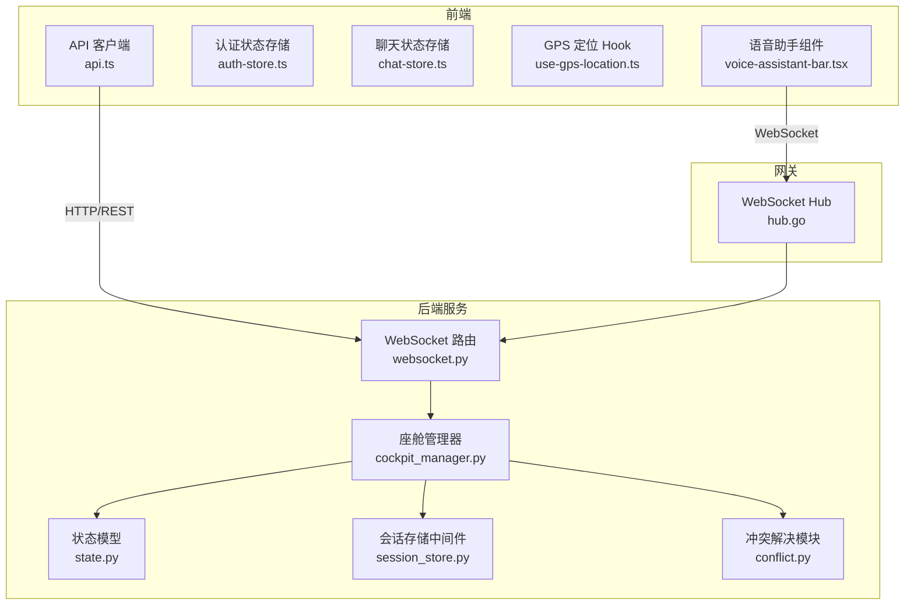
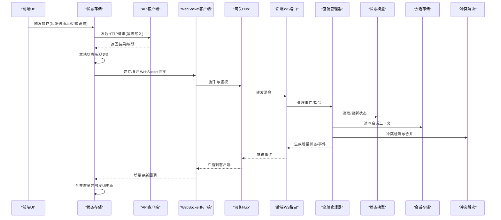
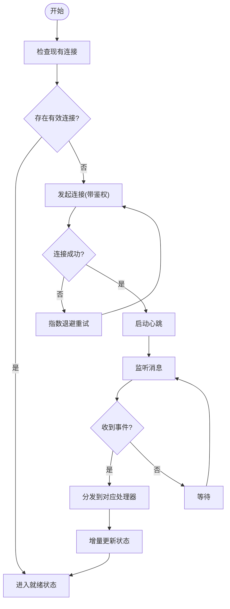
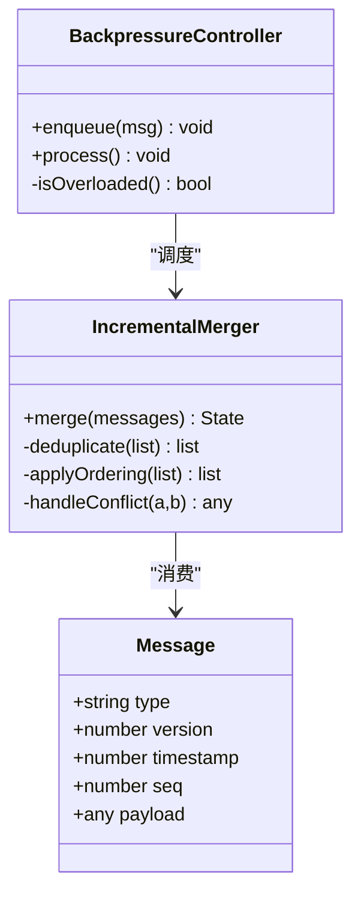
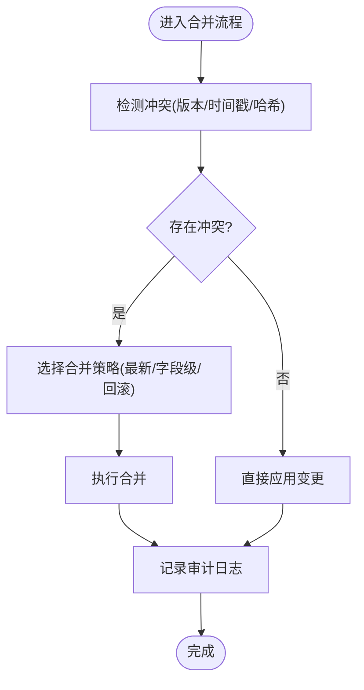
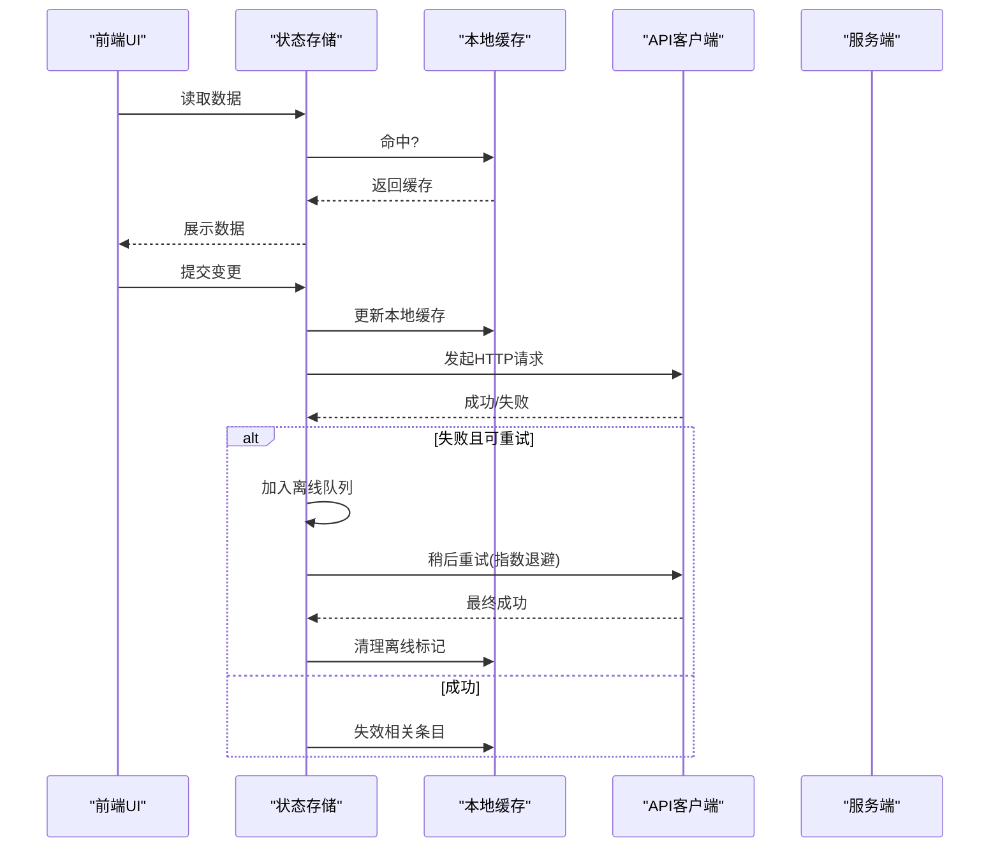
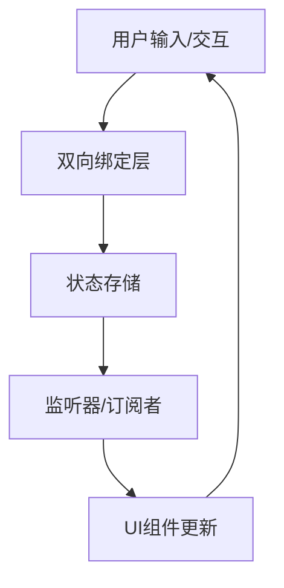
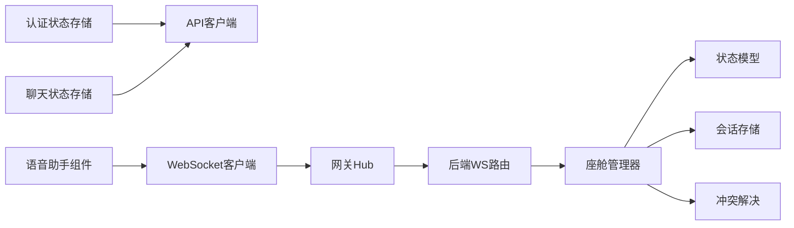

# 状态同步机制

<cite>
**本文引用的文件**   
- [frontend_design/src/lib/api.ts](file://frontend_design/src/lib/api.ts)
- [frontend_design/src/stores/auth-store.ts](file://frontend_design/src/stores/auth-store.ts)
- [frontend_design/src/stores/chat-store.ts](file://frontend_design/src/stores/chat-store.ts)
- [frontend_design/src/hooks/use-gps-location.ts](file://frontend_design/src/hooks/use-gps-location.ts)
- [frontend_design/src/components/vehicle/voice-assistant-bar.tsx](file://frontend_design/src/components/vehicle/voice-assistant-bar.tsx)
- [backend_design/nexus/api/websocket.py](file://backend_design/nexus/api/websocket.py)
- [backend_design/nexus/core/cockpit_manager.py](file://backend_design/nexus/core/cockpit_manager.py)
- [backend_design/nexus/models/state.py](file://backend_design/nexus/models/state.py)
- [backend_design/nexus/middleware/session_store.py](file://backend_design/nexus/middleware/session_store.py)
- [backend_design/nexus/memory/conflict.py](file://backend_design/nexus/memory/conflict.py)
- [backend_design/nexus_gate/internal/ws/hub.go](file://backend_design/nexus_gate/internal/ws/hub.go)
</cite>

## 目录
1. [简介](#简介)
2. [项目结构](#项目结构)
3. [核心组件](#核心组件)
4. [架构总览](#架构总览)
5. [详细组件分析](#详细组件分析)
6. [依赖分析](#依赖分析)
7. [性能考虑](#性能考虑)
8. [故障排查指南](#故障排查指南)
9. [结论](#结论)
10. [附录](#附录)

## 简介
本文件面向 NexusCockpit 前端应用，系统性阐述客户端状态与服务端数据的同步机制。内容覆盖实时数据同步、增量更新、冲突解决、WebSocket 连接管理、消息处理与一致性保证、缓存策略、离线处理与重试机制、双向数据绑定与监听器模式、错误处理、性能优化、内存管理与调试方法，以及与后端 API 的集成模式和最佳实践。文档以“渐进式复杂度”组织，既便于初学者快速上手，也为高级用户提供深入的技术细节。

## 项目结构
NexusCockpit 的前端基于 Next.js（React），采用模块化组织：
- 状态存储层：stores 目录集中管理全局状态（认证、聊天等）
- 业务逻辑层：hooks 提供可复用的异步与设备能力封装
- UI 组件层：components 中按功能域划分，如车辆面板、语音助手条等
- 网络与工具层：lib 提供 API 调用、事件总线、工具函数等

图表来源
- [frontend_design/src/lib/api.ts](file://frontend_design/src/lib/api.ts)
- [frontend_design/src/stores/auth-store.ts](file://frontend_design/src/stores/auth-store.ts)
- [frontend_design/src/stores/chat-store.ts](file://frontend_design/src/stores/chat-store.ts)
- [frontend_design/src/hooks/use-gps-location.ts](file://frontend_design/src/hooks/use-gps-location.ts)
- [frontend_design/src/components/vehicle/voice-assistant-bar.tsx](file://frontend_design/src/components/vehicle/voice-assistant-bar.tsx)
- [backend_design/nexus/api/websocket.py](file://backend_design/nexus/api/websocket.py)
- [backend_design/nexus/core/cockpit_manager.py](file://backend_design/nexus/core/cockpit_manager.py)
- [backend_design/nexus/models/state.py](file://backend_design/nexus/models/state.py)
- [backend_design/nexus/middleware/session_store.py](file://backend_design/nexus/middleware/session_store.py)
- [backend_design/nexus/memory/conflict.py](file://backend_design/nexus/memory/conflict.py)
- [backend_design/nexus_gate/internal/ws/hub.go](file://backend_design/nexus_gate/internal/ws/hub.go)

章节来源
- [frontend_design/src/lib/api.ts](file://frontend_design/src/lib/api.ts)
- [frontend_design/src/stores/auth-store.ts](file://frontend_design/src/stores/auth-store.ts)
- [frontend_design/src/stores/chat-store.ts](file://frontend_design/src/stores/chat-store.ts)
- [frontend_design/src/hooks/use-gps-location.ts](file://frontend_design/src/hooks/use-gps-location.ts)
- [frontend_design/src/components/vehicle/voice-assistant-bar.tsx](file://frontend_design/src/components/vehicle/voice-assistant-bar.tsx)
- [backend_design/nexus/api/websocket.py](file://backend_design/nexus/api/websocket.py)
- [backend_design/nexus/core/cockpit_manager.py](file://backend_design/nexus/core/cockpit_manager.py)
- [backend_design/nexus/models/state.py](file://backend_design/nexus/models/state.py)
- [backend_design/nexus/middleware/session_store.py](file://backend_design/nexus/middleware/session_store.py)
- [backend_design/nexus/memory/conflict.py](file://backend_design/nexus/memory/conflict.py)
- [backend_design/nexus_gate/internal/ws/hub.go](file://backend_design/nexus_gate/internal/ws/hub.go)

## 核心组件
- API 客户端：统一封装 HTTP 请求、鉴权头注入、错误码映射与重试策略，为各 store 和组件提供一致的数据访问接口。
- 认证状态存储：维护用户登录态、令牌刷新、权限校验，并在状态变更时触发相关副作用（如重定向或刷新资源）。
- 聊天状态存储：管理对话列表、消息流、发送/接收状态，支持增量追加与去重。
- GPS 定位 Hook：封装浏览器定位 API，提供位置变化订阅与节流策略，减少频繁更新带来的渲染压力。
- 语音助手组件：负责采集语音输入、上传音频片段、接收 TTS 结果并驱动 UI 反馈。

章节来源
- [frontend_design/src/lib/api.ts](file://frontend_design/src/lib/api.ts)
- [frontend_design/src/stores/auth-store.ts](file://frontend_design/src/stores/auth-store.ts)
- [frontend_design/src/stores/chat-store.ts](file://frontend_design/src/stores/chat-store.ts)
- [frontend_design/src/hooks/use-gps-location.ts](file://frontend_design/src/hooks/use-gps-location.ts)
- [frontend_design/src/components/vehicle/voice-assistant-bar.tsx](file://frontend_design/src/components/vehicle/voice-assistant-bar.tsx)

## 架构总览
整体同步路径包括两条主线：
- REST 主数据通道：用于初始化数据、批量操作与幂等写入；通过 API 客户端进行统一封装。
- WebSocket 实时通道：用于高频低延迟的状态推送（如车辆遥测、聊天消息、系统事件）；由网关 Hub 转发至后端服务，再由座舱管理器协调状态更新与冲突解决。

图表来源
- [frontend_design/src/lib/api.ts](file://frontend_design/src/lib/api.ts)
- [frontend_design/src/stores/auth-store.ts](file://frontend_design/src/stores/auth-store.ts)
- [frontend_design/src/stores/chat-store.ts](file://frontend_design/src/stores/chat-store.ts)
- [frontend_design/src/components/vehicle/voice-assistant-bar.tsx](file://frontend_design/src/components/vehicle/voice-assistant-bar.tsx)
- [backend_design/nexus/api/websocket.py](file://backend_design/nexus/api/websocket.py)
- [backend_design/nexus/core/cockpit_manager.py](file://backend_design/nexus/core/cockpit_manager.py)
- [backend_design/nexus/models/state.py](file://backend_design/nexus/models/state.py)
- [backend_design/nexus/middleware/session_store.py](file://backend_design/nexus/middleware/session_store.py)
- [backend_design/nexus/memory/conflict.py](file://backend_design/nexus/memory/conflict.py)
- [backend_design/nexus_gate/internal/ws/hub.go](file://backend_design/nexus_gate/internal/ws/hub.go)

## 详细组件分析

### 组件A：WebSocket 连接管理与会话生命周期
- 连接建立：在需要实时能力的页面或组件挂载时创建连接，携带鉴权信息（如 JWT），失败则指数退避重试。
- 心跳保活：周期性 ping/pong 维持长连接，超时自动重连。
- 断线恢复：记录最后成功序列号，重连后拉取增量快照，避免重复与丢失。
- 多实例隔离：按租户/会话维度隔离连接，避免跨会话污染。

图表来源
- [frontend_design/src/components/vehicle/voice-assistant-bar.tsx](file://frontend_design/src/components/vehicle/voice-assistant-bar.tsx)
- [backend_design/nexus/api/websocket.py](file://backend_design/nexus/api/websocket.py)
- [backend_design/nexus_gate/internal/ws/hub.go](file://backend_design/nexus_gate/internal/ws/hub.go)

章节来源
- [frontend_design/src/components/vehicle/voice-assistant-bar.tsx](file://frontend_design/src/components/vehicle/voice-assistant-bar.tsx)
- [backend_design/nexus/api/websocket.py](file://backend_design/nexus/api/websocket.py)
- [backend_design/nexus_gate/internal/ws/hub.go](file://backend_design/nexus_gate/internal/ws/hub.go)

### 组件B：消息处理与增量更新
- 消息类型：定义统一的协议字段（如类型、版本、时间戳、序列号、载荷），确保前后端契约稳定。
- 增量合并：基于序列号与时间戳进行有序合并，支持去重与冲突回滚。
- 批处理：对高频小消息进行聚合，降低渲染频率。
- 反压控制：当队列积压超过阈值时暂停消费，防止内存溢出。

图表来源
- [backend_design/nexus/models/state.py](file://backend_design/nexus/models/state.py)
- [backend_design/nexus/memory/conflict.py](file://backend_design/nexus/memory/conflict.py)

章节来源
- [backend_design/nexus/models/state.py](file://backend_design/nexus/models/state.py)
- [backend_design/nexus/memory/conflict.py](file://backend_design/nexus/memory/conflict.py)

### 组件C：冲突解决与一致性保证
- 冲突检测：比较版本号/时间戳/哈希，识别并发修改。
- 合并策略：优先最新时间戳、字段级合并、可回滚操作。
- 幂等性：所有写操作具备幂等键，避免重复执行导致状态漂移。
- 审计日志：记录关键变更轨迹，便于回溯与排障。

图表来源
- [backend_design/nexus/memory/conflict.py](file://backend_design/nexus/memory/conflict.py)
- [backend_design/nexus/models/state.py](file://backend_design/nexus/models/state.py)

章节来源
- [backend_design/nexus/memory/conflict.py](file://backend_design/nexus/memory/conflict.py)
- [backend_design/nexus/models/state.py](file://backend_design/nexus/models/state.py)

### 组件D：缓存策略、离线处理与重试机制
- 缓存分层：内存缓存（短期热点）、持久化缓存（localStorage/IndexedDB）与服务器缓存（Redis）协同。
- 失效策略：TTL、LRU、按资源粒度失效。
- 离线优先：离线时写入本地队列，在线后批量同步；冲突时提示用户或自动协商。
- 重试策略：指数退避、抖动、最大重试次数、熔断降级。

章节来源
- [frontend_design/src/lib/api.ts](file://frontend_design/src/lib/api.ts)
- [frontend_design/src/stores/auth-store.ts](file://frontend_design/src/stores/auth-store.ts)
- [frontend_design/src/stores/chat-store.ts](file://frontend_design/src/stores/chat-store.ts)

### 组件E：双向数据绑定与状态监听器
- 双向绑定：表单控件值与状态对象保持同步，变更事件驱动状态更新，状态更新反向驱动视图。
- 监听器模式：使用观察者或发布-订阅机制，将状态变更通知到相关组件，避免全量重渲染。
- 防抖与节流：对高频输入（如搜索、拖拽）进行节流，减少不必要的计算与渲染。

章节来源
- [frontend_design/src/stores/auth-store.ts](file://frontend_design/src/stores/auth-store.ts)
- [frontend_design/src/stores/chat-store.ts](file://frontend_design/src/stores/chat-store.ts)
- [frontend_design/src/hooks/use-gps-location.ts](file://frontend_design/src/hooks/use-gps-location.ts)

### 组件F：错误处理与用户体验
- 错误分类：网络错误、业务错误、权限错误、超时错误。
- 用户提示：根据错误类型给出友好提示与引导操作。
- 降级策略：关键路径不可用时切换到只读或离线模式。

章节来源
- [frontend_design/src/lib/api.ts](file://frontend_design/src/lib/api.ts)
- [frontend_design/src/stores/auth-store.ts](file://frontend_design/src/stores/auth-store.ts)

## 依赖分析
- 前端内部依赖：
  - stores 依赖 hooks 提供的设备能力与异步封装
  - components 依赖 stores 暴露的状态与动作
  - lib 被 stores 与 components 共同使用
- 前后端依赖：
  - 前端通过 API 客户端与后端 REST 路由交互
  - 前端通过 WebSocket 客户端与网关 Hub 交互，再路由到后端 WS 路由
  - 后端座舱管理器协调状态模型、会话存储与冲突解决模块

图表来源
- [frontend_design/src/stores/auth-store.ts](file://frontend_design/src/stores/auth-store.ts)
- [frontend_design/src/stores/chat-store.ts](file://frontend_design/src/stores/chat-store.ts)
- [frontend_design/src/components/vehicle/voice-assistant-bar.tsx](file://frontend_design/src/components/vehicle/voice-assistant-bar.tsx)
- [backend_design/nexus/api/websocket.py](file://backend_design/nexus/api/websocket.py)
- [backend_design/nexus/core/cockpit_manager.py](file://backend_design/nexus/core/cockpit_manager.py)
- [backend_design/nexus/models/state.py](file://backend_design/nexus/models/state.py)
- [backend_design/nexus/middleware/session_store.py](file://backend_design/nexus/middleware/session_store.py)
- [backend_design/nexus/memory/conflict.py](file://backend_design/nexus/memory/conflict.py)
- [backend_design/nexus_gate/internal/ws/hub.go](file://backend_design/nexus_gate/internal/ws/hub.go)

章节来源
- [frontend_design/src/stores/auth-store.ts](file://frontend_design/src/stores/auth-store.ts)
- [frontend_design/src/stores/chat-store.ts](file://frontend_design/src/stores/chat-store.ts)
- [frontend_design/src/components/vehicle/voice-assistant-bar.tsx](file://frontend_design/src/components/vehicle/voice-assistant-bar.tsx)
- [backend_design/nexus/api/websocket.py](file://backend_design/nexus/api/websocket.py)
- [backend_design/nexus/core/cockpit_manager.py](file://backend_design/nexus/core/cockpit_manager.py)
- [backend_design/nexus/models/state.py](file://backend_design/nexus/models/state.py)
- [backend_design/nexus/middleware/session_store.py](file://backend_design/nexus/middleware/session_store.py)
- [backend_design/nexus/memory/conflict.py](file://backend_design/nexus/memory/conflict.py)
- [backend_design/nexus_gate/internal/ws/hub.go](file://backend_design/nexus_gate/internal/ws/hub.go)

## 性能考虑
- 增量更新：仅传输差异字段，结合序列号与时间戳实现高效合并。
- 批处理与节流：对高频事件进行聚合与节流，降低渲染与网络开销。
- 缓存命中率：合理设置 TTL 与失效粒度，提升热点数据命中率。
- 内存管理：及时释放不再使用的订阅与定时器，避免内存泄漏。
- 反压与背压：监控队列长度与处理耗时，动态调整消费速率。

## 故障排查指南
- 连接问题：检查鉴权头、证书配置、防火墙与代理设置；查看心跳与重连日志。
- 消息乱序：核对序列号与时间戳，确认增量合并顺序是否正确。
- 冲突频发：审查并发写入路径与幂等键设计，必要时引入更细粒度的锁或补偿事务。
- 性能瓶颈：定位高CPU/高内存节点，分析渲染热区与网络往返时间。
- 离线同步：验证离线队列容量与重试策略，确保最终一致性。

章节来源
- [frontend_design/src/lib/api.ts](file://frontend_design/src/lib/api.ts)
- [frontend_design/src/stores/auth-store.ts](file://frontend_design/src/stores/auth-store.ts)
- [frontend_design/src/stores/chat-store.ts](file://frontend_design/src/stores/chat-store.ts)
- [backend_design/nexus/api/websocket.py](file://backend_design/nexus/api/websocket.py)
- [backend_design/nexus/core/cockpit_manager.py](file://backend_design/nexus/core/cockpit_manager.py)
- [backend_design/nexus/memory/conflict.py](file://backend_design/nexus/memory/conflict.py)

## 结论
通过 REST 与 WebSocket 双通道协作、增量合并与冲突解决、完善的缓存与离线策略，以及健壮的错误处理与性能优化手段，NexusCockpit 实现了高可用、低延迟、强一致性的状态同步机制。建议在生产环境中持续监控关键指标（连接成功率、消息延迟、冲突率、缓存命中率），并结合业务场景调优参数与策略。

## 附录
- 最佳实践清单：
  - 明确数据所有权与单一事实源
  - 为所有写操作提供幂等键
  - 使用最小必要字段进行增量更新
  - 对高频事件实施节流与批处理
  - 建立端到端的追踪ID，便于链路诊断
  - 定期演练断网与重连场景，验证恢复策略