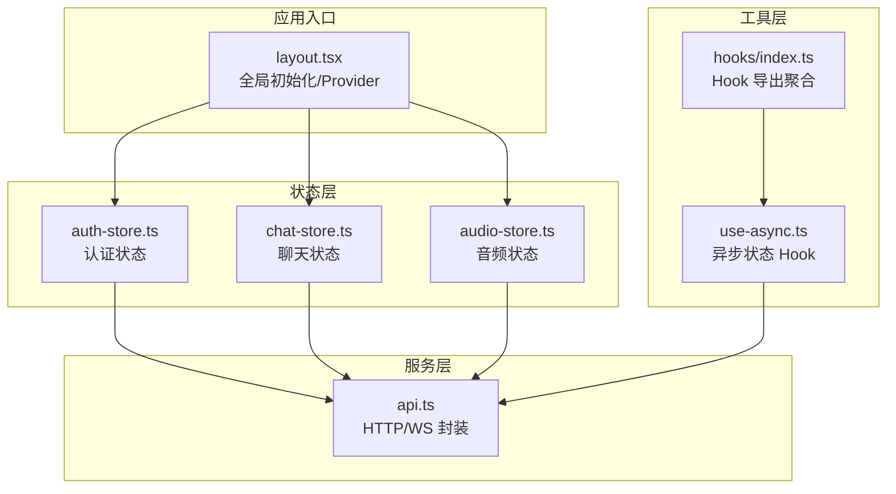
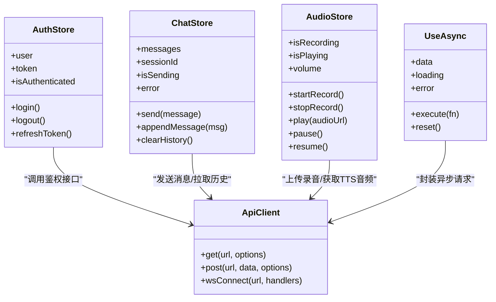
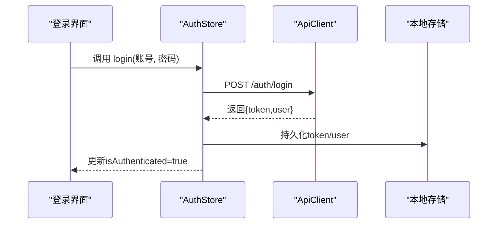
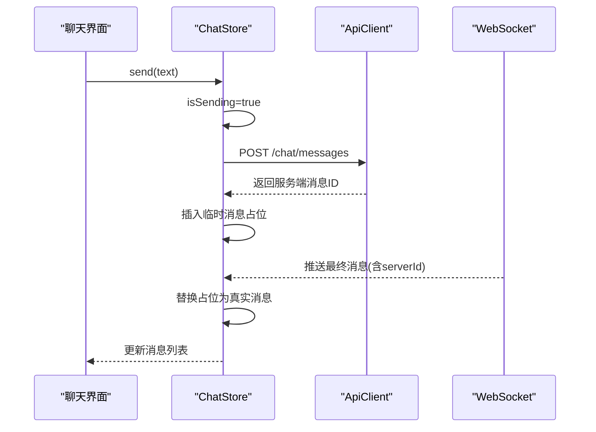
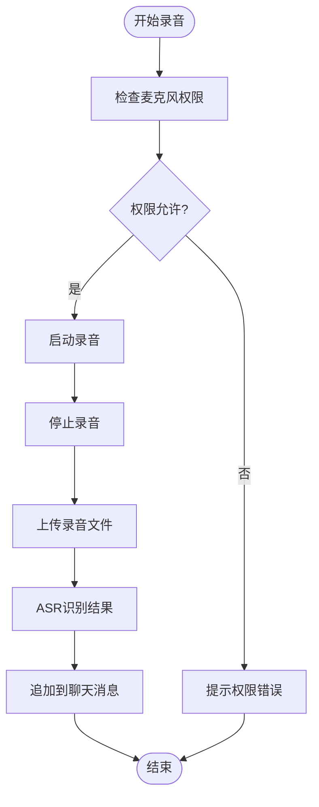
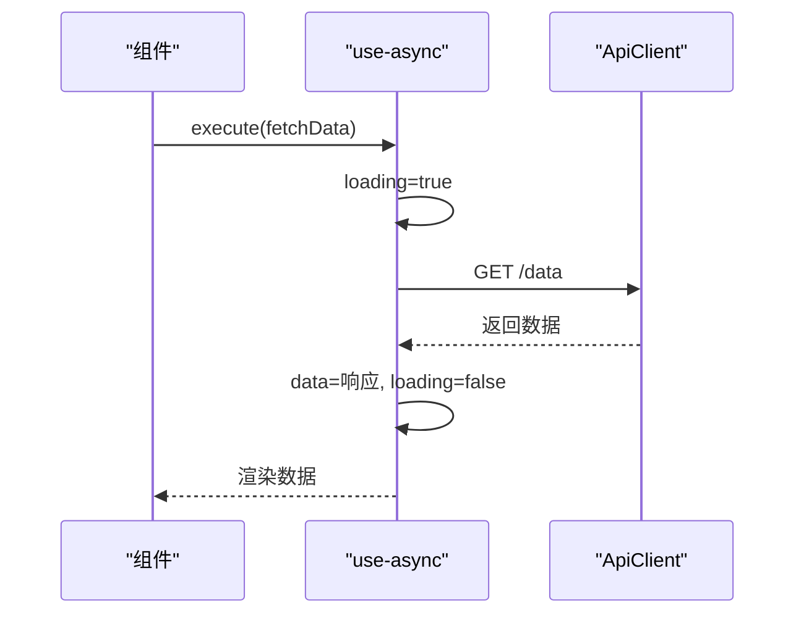
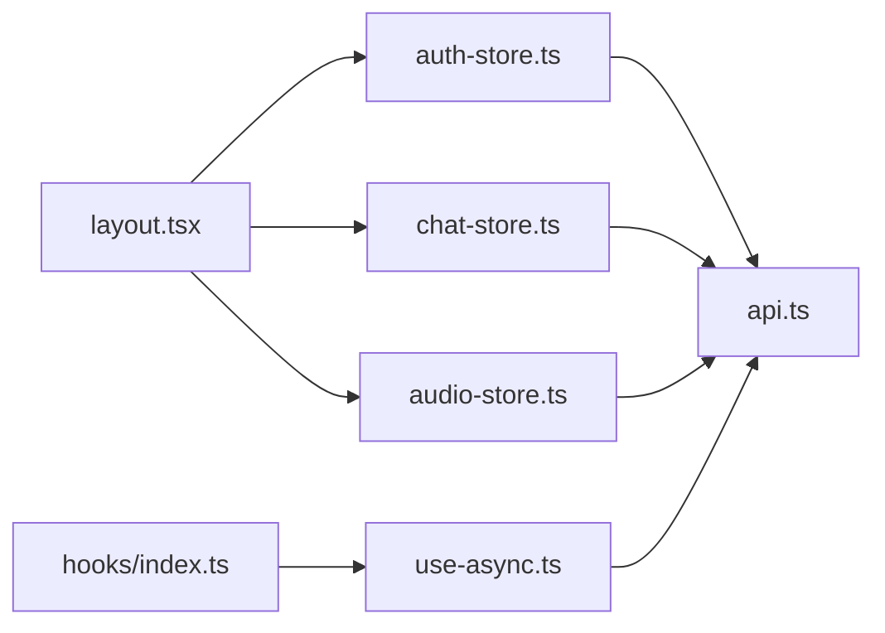

# 状态管理方案

<cite>
**本文引用的文件**   
- [frontend_design/src/stores/auth-store.ts](file://frontend_design/src/stores/auth-store.ts)
- [frontend_design/src/stores/chat-store.ts](file://frontend_design/src/stores/chat-store.ts)
- [frontend_design/src/stores/audio-store.ts](file://frontend_design/src/stores/audio-store.ts)
- [frontend_design/src/hooks/use-async.ts](file://frontend_design/src/hooks/use-async.ts)
- [frontend_design/src/hooks/index.ts](file://frontend_design/src/hooks/index.ts)
- [frontend_design/src/lib/api.ts](file://frontend_design/src/lib/api.ts)
- [frontend_design/src/app/layout.tsx](file://frontend_design/src/app/layout.tsx)
</cite>

## 目录
1. [简介](#简介)
2. [项目结构](#项目结构)
3. [核心组件](#核心组件)
4. [架构总览](#架构总览)
5. [详细组件分析](#详细组件分析)
6. [依赖关系分析](#依赖关系分析)
7. [性能考虑](#性能考虑)
8. [故障排查指南](#故障排查指南)
9. [结论](#结论)
10. [附录](#附录)

## 简介
本文件面向 NexusCockpit 前端应用，系统化阐述基于 Zustand 的全局状态管理方案。内容覆盖认证、聊天、音频等核心状态模块的设计与实现，包括状态定义、更新机制、订阅模式、本地状态与服务端同步策略、自定义 Hook（如 use-async）使用模式，以及最佳实践、性能优化与调试方法。文档旨在帮助开发者快速理解并正确使用现有状态体系，同时为后续扩展提供清晰指引。

## 项目结构
前端状态相关代码主要位于以下路径：
- 状态存储：frontend_design/src/stores
- 自定义 Hook：frontend_design/src/hooks
- 网络请求封装：frontend_design/src/lib/api.ts
- 应用入口布局：frontend_design/src/app/layout.tsx

图表来源
- [frontend_design/src/stores/auth-store.ts](file://frontend_design/src/stores/auth-store.ts)
- [frontend_design/src/stores/chat-store.ts](file://frontend_design/src/stores/chat-store.ts)
- [frontend_design/src/stores/audio-store.ts](file://frontend_design/src/stores/audio-store.ts)
- [frontend_design/src/hooks/use-async.ts](file://frontend_design/src/hooks/use-async.ts)
- [frontend_design/src/hooks/index.ts](file://frontend_design/src/hooks/index.ts)
- [frontend_design/src/lib/api.ts](file://frontend_design/src/lib/api.ts)
- [frontend_design/src/app/layout.tsx](file://frontend_design/src/app/layout.tsx)

章节来源
- [frontend_design/src/stores/auth-store.ts](file://frontend_design/src/stores/auth-store.ts)
- [frontend_design/src/stores/chat-store.ts](file://frontend_design/src/stores/chat-store.ts)
- [frontend_design/src/stores/audio-store.ts](file://frontend_design/src/stores/audio-store.ts)
- [frontend_design/src/hooks/use-async.ts](file://frontend_design/src/hooks/use-async.ts)
- [frontend_design/src/hooks/index.ts](file://frontend_design/src/hooks/index.ts)
- [frontend_design/src/lib/api.ts](file://frontend_design/src/lib/api.ts)
- [frontend_design/src/app/layout.tsx](file://frontend_design/src/app/layout.tsx)

## 核心组件
本节概述各状态模块的职责与边界，便于读者建立整体认知。

- 认证状态（auth-store）
  - 职责：维护登录态、用户信息、权限范围、会话过期时间等；提供登录、登出、刷新令牌等方法；负责与后端鉴权接口交互。
  - 持久化：通常结合浏览器本地存储进行会话恢复。
  - 副作用：在首次挂载时尝试自动登录或校验令牌有效性。

- 聊天状态（chat-store）
  - 职责：维护消息列表、会话上下文、输入状态、发送中标志、错误信息等；支持发送消息、接收服务端推送、分页加载历史。
  - 实时性：通过 WebSocket 或 SSE 接收增量消息，避免全量拉取。
  - 幂等：对重复消息去重，保证 UI 一致性。

- 音频状态（audio-store）
  - 职责：管理录音、播放、音量、静音、设备枚举、错误提示；协调 ASR/TTS 流程。
  - 资源控制：确保同一时刻仅一个音频流活跃，避免冲突。
  - 生命周期：页面卸载时释放媒体资源。

- 异步状态 Hook（use-async）
  - 职责：封装通用异步操作的状态机（pending/success/error/data），简化组件中的异步逻辑。
  - 适用场景：数据获取、表单提交、文件上传等。

章节来源
- [frontend_design/src/stores/auth-store.ts](file://frontend_design/src/stores/auth-store.ts)
- [frontend_design/src/stores/chat-store.ts](file://frontend_design/src/stores/chat-store.ts)
- [frontend_design/src/stores/audio-store.ts](file://frontend_design/src/stores/audio-store.ts)
- [frontend_design/src/hooks/use-async.ts](file://frontend_design/src/hooks/use-async.ts)

## 架构总览
Zustand 作为轻量级状态库，以“store + selector”为核心。NexusCockpit 采用多 store 拆分，按领域划分状态边界，并通过自定义 Hook 暴露统一访问点。

图表来源
- [frontend_design/src/stores/auth-store.ts](file://frontend_design/src/stores/auth-store.ts)
- [frontend_design/src/stores/chat-store.ts](file://frontend_design/src/stores/chat-store.ts)
- [frontend_design/src/stores/audio-store.ts](file://frontend_design/src/stores/audio-store.ts)
- [frontend_design/src/hooks/use-async.ts](file://frontend_design/src/hooks/use-async.ts)
- [frontend_design/src/lib/api.ts](file://frontend_design/src/lib/api.ts)

## 详细组件分析

### 认证状态（auth-store）
- 设计要点
  - 状态字段：用户信息、令牌、是否已认证、过期时间等。
  - 更新机制：登录成功后写入本地存储并更新 store；登出时清理本地存储与内存状态。
  - 订阅模式：组件按需订阅 user/token/isAuthenticated，避免无关重渲染。
  - 服务端同步：在 token 即将过期前主动刷新；失败时引导重新登录。
  - 错误处理：捕获网络异常与业务错误码，给出友好提示。

- 典型流程（登录）

图表来源
- [frontend_design/src/stores/auth-store.ts](file://frontend_design/src/stores/auth-store.ts)
- [frontend_design/src/lib/api.ts](file://frontend_design/src/lib/api.ts)

章节来源
- [frontend_design/src/stores/auth-store.ts](file://frontend_design/src/stores/auth-store.ts)
- [frontend_design/src/lib/api.ts](file://frontend_design/src/lib/api.ts)

### 聊天状态（chat-store）
- 设计要点
  - 状态字段：消息列表、当前会话 ID、发送中标志、错误信息、分页游标等。
  - 更新机制：追加新消息、标记发送中、失败回滚；支持历史分页加载。
  - 实时性：WebSocket 增量推送消息，客户端去重后合并到消息列表。
  - 错误处理：网络中断时显示重试按钮；断线重连策略。

- 典型流程（发送消息）

图表来源
- [frontend_design/src/stores/chat-store.ts](file://frontend_design/src/stores/chat-store.ts)
- [frontend_design/src/lib/api.ts](file://frontend_design/src/lib/api.ts)

章节来源
- [frontend_design/src/stores/chat-store.ts](file://frontend_design/src/stores/chat-store.ts)
- [frontend_design/src/lib/api.ts](file://frontend_design/src/lib/api.ts)

### 音频状态（audio-store）
- 设计要点
  - 状态字段：录音中/播放中标志、音量、当前音频 URL、错误提示。
  - 更新机制：开始录音/停止录音/播放/暂停/恢复；并发控制确保单一音频流。
  - 资源管理：页面卸载或切换路由时释放 MediaStream/AudioElement。
  - 错误处理：设备不可用、权限拒绝、格式不支持等场景的降级提示。

- 典型流程（录音转文本）

图表来源
- [frontend_design/src/stores/audio-store.ts](file://frontend_design/src/stores/audio-store.ts)
- [frontend_design/src/lib/api.ts](file://frontend_design/src/lib/api.ts)

章节来源
- [frontend_design/src/stores/audio-store.ts](file://frontend_design/src/stores/audio-store.ts)
- [frontend_design/src/lib/api.ts](file://frontend_design/src/lib/api.ts)

### 异步状态 Hook（use-async）
- 设计要点
  - 状态字段：data/loading/error，用于表示执行结果。
  - 更新机制：execute(fn) 触发异步函数，内部设置 loading=true，完成后根据成功/失败分支更新 data/error。
  - 复用性：可在任意组件内独立使用，避免重复样板代码。
  - 组合能力：可与 Zustand store 方法组合，形成“UI 层 Hook + 领域 Store”的分层。

- 典型用法

图表来源
- [frontend_design/src/hooks/use-async.ts](file://frontend_design/src/hooks/use-async.ts)
- [frontend_design/src/lib/api.ts](file://frontend_design/src/lib/api.ts)

章节来源
- [frontend_design/src/hooks/use-async.ts](file://frontend_design/src/hooks/use-async.ts)
- [frontend_design/src/lib/api.ts](file://frontend_design/src/lib/api.ts)

## 依赖关系分析
- 低耦合高内聚
  - 每个 store 只关注自身领域，不直接依赖其他 store。
  - 通过 api.ts 统一封装 HTTP/WebSocket 调用，降低网络层耦合。
- 订阅选择器
  - 组件通过选择器订阅最小状态片段，减少不必要重渲染。
- 入口初始化
  - layout.tsx 负责全局初始化（如恢复认证态、连接 WebSocket、注册事件监听）。

图表来源
- [frontend_design/src/app/layout.tsx](file://frontend_design/src/app/layout.tsx)
- [frontend_design/src/stores/auth-store.ts](file://frontend_design/src/stores/auth-store.ts)
- [frontend_design/src/stores/chat-store.ts](file://frontend_design/src/stores/chat-store.ts)
- [frontend_design/src/stores/audio-store.ts](file://frontend_design/src/stores/audio-store.ts)
- [frontend_design/src/hooks/index.ts](file://frontend_design/src/hooks/index.ts)
- [frontend_design/src/hooks/use-async.ts](file://frontend_design/src/hooks/use-async.ts)
- [frontend_design/src/lib/api.ts](file://frontend_design/src/lib/api.ts)

章节来源
- [frontend_design/src/app/layout.tsx](file://frontend_design/src/app/layout.tsx)
- [frontend_design/src/hooks/index.ts](file://frontend_design/src/hooks/index.ts)

## 性能考虑
- 选择器粒度
  - 将常用状态拆分为细粒度字段，组件仅订阅所需字段，避免整块状态变更导致的批量重渲染。
- 批量更新
  - 在一次事件中合并多次状态更新，减少中间渲染次数。
- 防抖与节流
  - 对高频输入（如搜索、滚动加载）使用防抖/节流，降低状态更新频率。
- 惰性加载
  - 大列表采用虚拟滚动或分页加载，避免一次性渲染过多节点。
- 资源回收
  - 音频/视频等资源在组件卸载时及时释放，防止内存泄漏。
- 缓存策略
  - 对热点数据（如用户信息、配置项）做短期缓存，减少重复请求。

[本节为通用指导，无需源码引用]

## 故障排查指南
- 常见问题定位
  - 认证失败：检查 token 是否过期、刷新流程是否触发、本地存储是否被清除。
  - 聊天消息不同步：确认 WebSocket 连接状态、消息去重逻辑、服务端推送顺序。
  - 音频无法播放：检查浏览器权限、MIME 类型、跨域策略、AudioElement 状态。
- 调试建议
  - 在关键状态变更处打印日志（注意生产环境关闭敏感信息）。
  - 使用浏览器 DevTools 的 React/Zustand 插件观察状态快照。
  - 对网络请求添加超时与重试上限，避免无限等待。
- 恢复策略
  - 断网检测与自动重连；关键操作失败时的重试与回滚。
  - 提供“重试”按钮与用户可感知的错误提示。

章节来源
- [frontend_design/src/stores/auth-store.ts](file://frontend_design/src/stores/auth-store.ts)
- [frontend_design/src/stores/chat-store.ts](file://frontend_design/src/stores/chat-store.ts)
- [frontend_design/src/stores/audio-store.ts](file://frontend_design/src/stores/audio-store.ts)
- [frontend_design/src/hooks/use-async.ts](file://frontend_design/src/hooks/use-async.ts)
- [frontend_design/src/lib/api.ts](file://frontend_design/src/lib/api.ts)

## 结论
NexusCockpit 的前端状态管理以 Zustand 为核心，围绕认证、聊天、音频三大领域构建清晰的边界与职责。通过选择器订阅、统一网络封装与通用异步 Hook，实现了高内聚、低耦合、易扩展的状态体系。配合合理的性能优化与完善的错误处理策略，能够支撑复杂交互与实时通信需求。建议在后续迭代中持续细化选择器粒度、完善监控埋点，并逐步引入更丰富的测试用例以提升稳定性。

[本节为总结性内容，无需源码引用]

## 附录
- 集成指南
  - 新增状态模块：在 stores 目录下创建新 store，定义状态与方法，并在需要处通过选择器订阅。
  - 使用 use-async：在组件中导入 Hook，调用 execute 包装异步函数，根据 loading/error/data 渲染 UI。
  - 全局初始化：在 layout.tsx 中完成必要的初始化（如恢复认证态、连接 WebSocket、注册全局事件）。
- 最佳实践清单
  - 明确状态所有权，避免跨 store 直接修改。
  - 使用选择器订阅最小必要状态。
  - 对副作用集中管理（如网络请求、定时器、事件监听）。
  - 保持方法幂等，避免重复提交导致的状态不一致。
  - 对敏感信息进行脱敏与最小化暴露。

[本节为补充说明，无需源码引用]