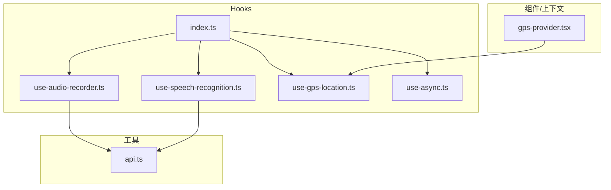
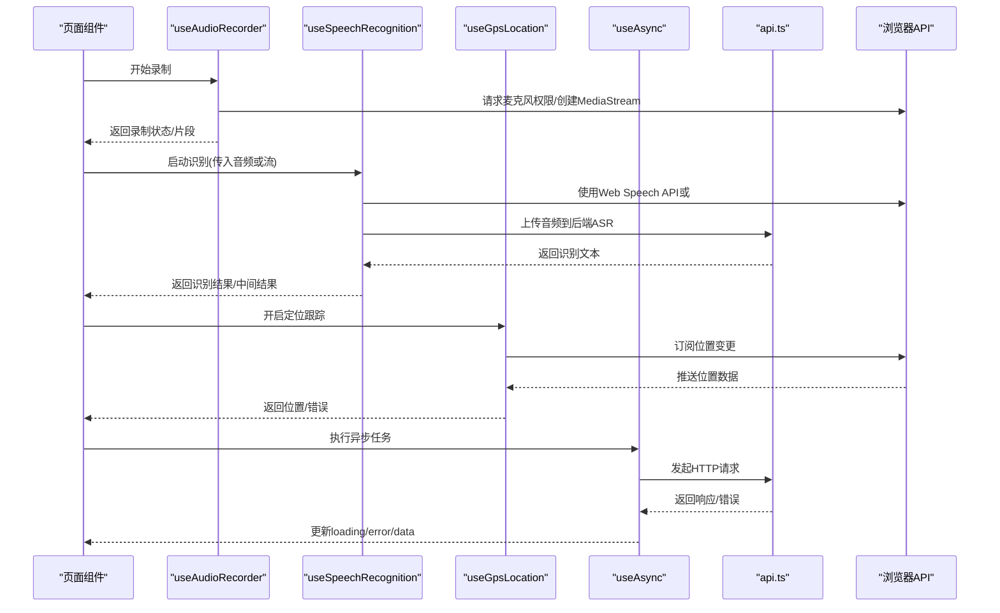
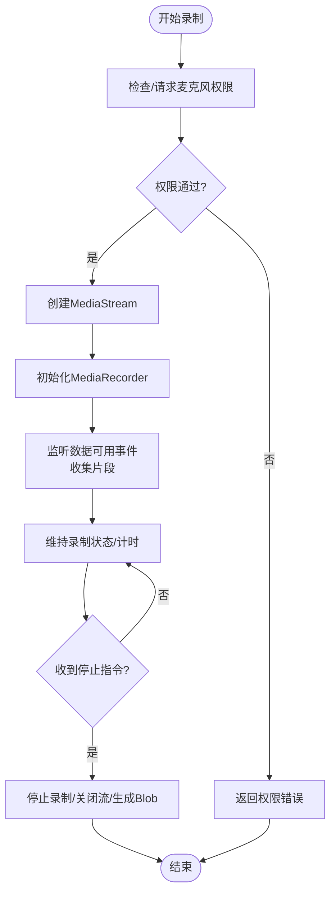
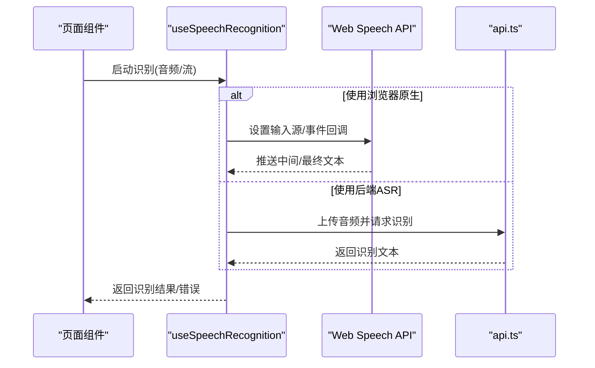
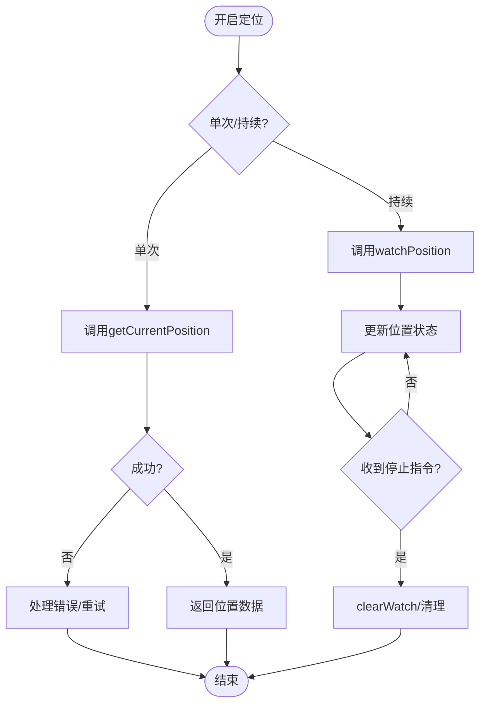
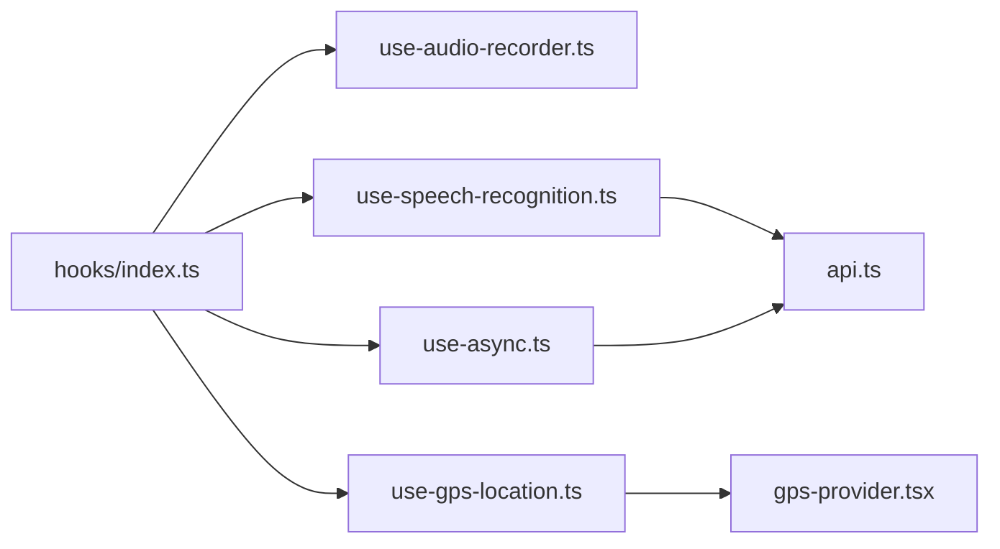

# 自定义Hook

<cite>
**本文引用的文件**   
- [frontend_design/src/hooks/use-audio-recorder.ts](file://frontend_design/src/hooks/use-audio-recorder.ts)
- [frontend_design/src/hooks/use-speech-recognition.ts](file://frontend_design/src/hooks/use-speech-recognition.ts)
- [frontend_design/src/hooks/use-gps-location.ts](file://frontend_design/src/hooks/use-gps-location.ts)
- [frontend_design/src/hooks/use-async.ts](file://frontend_design/src/hooks/use-async.ts)
- [frontend_design/src/hooks/index.ts](file://frontend_design/src/hooks/index.ts)
- [frontend_design/src/components/layout/gps-provider.tsx](file://frontend_design/src/components/layout/gps-provider.tsx)
- [frontend_design/src/lib/api.ts](file://frontend_design/src/lib/api.ts)
</cite>

## 目录
1. [简介](#简介)
2. [项目结构](#项目结构)
3. [核心组件](#核心组件)
4. [架构总览](#架构总览)
5. [详细组件分析](#详细组件分析)
6. [依赖关系分析](#依赖关系分析)
7. [性能考虑](#性能考虑)
8. [故障排查指南](#故障排查指南)
9. [结论](#结论)
10. [附录](#附录)

## 简介
本文件面向NexusCockpit前端中的自定义React Hook，聚焦以下能力：音频录制、语音识别、GPS定位与通用异步操作。文档从实现原理、状态管理、副作用与生命周期、组合使用模式、错误处理策略、浏览器API集成、设备权限与兼容性、测试与调试等方面展开，帮助读者快速理解并高效使用这些Hook。

## 项目结构
与本文相关的Hook位于前端设计目录的hooks子目录中，并通过统一入口导出；同时存在一个基于Provider的GPS上下文组件，用于在应用层共享定位状态。



图表来源
- [frontend_design/src/hooks/use-audio-recorder.ts](file://frontend_design/src/hooks/use-audio-recorder.ts)
- [frontend_design/src/hooks/use-speech-recognition.ts](file://frontend_design/src/hooks/use-speech-recognition.ts)
- [frontend_design/src/hooks/use-gps-location.ts](file://frontend_design/src/hooks/use-gps-location.ts)
- [frontend_design/src/hooks/use-async.ts](file://frontend_design/src/hooks/use-async.ts)
- [frontend_design/src/hooks/index.ts](file://frontend_design/src/hooks/index.ts)
- [frontend_design/src/components/layout/gps-provider.tsx](file://frontend_design/src/components/layout/gps-provider.tsx)
- [frontend_design/src/lib/api.ts](file://frontend_design/src/lib/api.ts)

章节来源
- [frontend_design/src/hooks/index.ts](file://frontend_design/src/hooks/index.ts)
- [frontend_design/src/components/layout/gps-provider.tsx](file://frontend_design/src/components/layout/gps-provider.tsx)

## 核心组件
本节概述四个核心Hook的职责与对外暴露的状态/方法，以及它们如何协同工作。

- useAudioRecorder（音频录制）
  - 职责：封装MediaRecorder相关能力，提供开始/停止录制、暂停/恢复、数据流与片段收集、错误与权限处理。
  - 典型状态：是否正在录制、是否已暂停、当前媒体流、已收集的音频片段、错误信息。
  - 副作用：创建/释放MediaStream与MediaRecorder实例，监听数据可用事件，清理资源。
  - 生命周期：启动时请求麦克风权限并建立流；停止时关闭流与记录器；卸载时确保资源回收。
  - 错误处理：捕获权限拒绝、设备不可用、编码不支持等异常，向上抛出或返回错误状态。
  - 输出：Blob/ArrayBuffer片段、录音时长、错误对象。

- useSpeechRecognition（语音识别）
  - 职责：封装Web Speech API或后端ASR调用，将音频转为文本，支持实时/一次性识别。
  - 典型状态：识别结果文本、中间结果、是否识别中、错误信息。
  - 副作用：初始化识别引擎、设置事件回调、与后端接口交互（如需要）。
  - 生命周期：按需启动/停止识别；组件卸载时取消进行中的识别任务。
  - 错误处理：兼容不同浏览器实现差异，处理网络错误、服务不可用、权限问题。
  - 输出：最终文本、阶段性文本、错误对象。

- useGpsLocation（GPS定位）
  - 职责：封装Geolocation API，提供单次定位与持续跟踪，支持精度阈值与超时控制。
  - 典型状态：经纬度、精度、速度、方向、时间戳、是否获取中、错误信息。
  - 副作用：订阅位置变更事件、定时器/间隔更新、清理监听器。
  - 生命周期：按需开启/关闭跟踪；组件卸载时移除监听。
  - 错误处理：处理用户拒绝、定位失败、超时、无信号等场景。
  - 输出：位置对象、错误对象。

- useAsync（通用异步）
  - 职责：统一管理Promise执行，提供loading、error、data三态，支持重试、取消与缓存。
  - 典型状态：是否进行中、错误信息、成功数据。
  - 副作用：在依赖变化时触发执行，在卸载时清理未完成的任务。
  - 生命周期：依赖项变化时重新执行；可配置防抖/节流。
  - 错误处理：统一捕获异常，提供重试机制与降级策略。
  - 输出：执行函数、状态对象、手动触发/重置方法。

章节来源
- [frontend_design/src/hooks/use-audio-recorder.ts](file://frontend_design/src/hooks/use-audio-recorder.ts)
- [frontend_design/src/hooks/use-speech-recognition.ts](file://frontend_design/src/hooks/use-speech-recognition.ts)
- [frontend_design/src/hooks/use-gps-location.ts](file://frontend_design/src/hooks/use-gps-location.ts)
- [frontend_design/src/hooks/use-async.ts](file://frontend_design/src/hooks/use-async.ts)

## 架构总览
下图展示Hook之间的协作关系以及与浏览器API和后端服务的交互路径。



图表来源
- [frontend_design/src/hooks/use-audio-recorder.ts](file://frontend_design/src/hooks/use-audio-recorder.ts)
- [frontend_design/src/hooks/use-speech-recognition.ts](file://frontend_design/src/hooks/use-speech-recognition.ts)
- [frontend_design/src/hooks/use-gps-location.ts](file://frontend_design/src/hooks/use-gps-location.ts)
- [frontend_design/src/hooks/use-async.ts](file://frontend_design/src/hooks/use-async.ts)
- [frontend_design/src/lib/api.ts](file://frontend_design/src/lib/api.ts)

## 详细组件分析

### useAudioRecorder（音频录制）
- 关键流程
  - 启动：检查并请求麦克风权限，创建MediaStream，初始化MediaRecorder，绑定ondataavailable事件收集片段。
  - 运行：维护录制状态（开始/暂停/停止），计算时长，聚合片段为Blob。
  - 停止：停止录制器，关闭流，释放资源，返回最终音频数据。
  - 错误：捕获NotAllowedError、NotFoundError、NotReadableError等，转换为统一错误对象。
- 状态与副作用
  - 状态：isRecording、isPaused、stream、chunks、error、duration。
  - 副作用：事件监听、定时器、资源释放。
- 生命周期
  - 组件卸载时自动清理流与监听器，避免内存泄漏。
- 组合使用
  - 与useSpeechRecognition配合：将录制的音频片段直接送入识别流程。
  - 与useAsync结合：将上传音频至后端的逻辑封装为异步任务。
- 浏览器兼容
  - 检测MediaRecorder与getUserMedia可用性，提供降级提示。
- 权限与安全
  - 仅在HTTPS或localhost下可用；用户授权失败时给出明确提示。



图表来源
- [frontend_design/src/hooks/use-audio-recorder.ts](file://frontend_design/src/hooks/use-audio-recorder.ts)

章节来源
- [frontend_design/src/hooks/use-audio-recorder.ts](file://frontend_design/src/hooks/use-audio-recorder.ts)

### useSpeechRecognition（语音识别）
- 关键流程
  - 初始化：根据环境选择Web Speech API或调用后端ASR接口。
  - 输入：接收音频Blob/ArrayBuffer或实时流。
  - 输出：阶段性文本与最终文本，错误信息。
  - 取消：支持中断识别，清理监听与网络请求。
- 状态与副作用
  - 状态：isRecognizing、interimText、finalText、error。
  - 副作用：事件回调、网络请求、定时器。
- 生命周期
  - 组件卸载时取消进行中的识别任务，防止内存泄漏。
- 错误处理
  - 区分浏览器不支持、网络错误、服务端错误、权限问题，提供重试与降级。
- 组合使用
  - 与useAudioRecorder联动：无缝接入录音数据。
  - 与useAsync结合：封装ASR调用为可重试的异步任务。



图表来源
- [frontend_design/src/hooks/use-speech-recognition.ts](file://frontend_design/src/hooks/use-speech-recognition.ts)
- [frontend_design/src/lib/api.ts](file://frontend_design/src/lib/api.ts)

章节来源
- [frontend_design/src/hooks/use-speech-recognition.ts](file://frontend_design/src/hooks/use-speech-recognition.ts)
- [frontend_design/src/lib/api.ts](file://frontend_design/src/lib/api.ts)

### useGpsLocation（GPS定位）
- 关键流程
  - 单次定位：调用getCurrentPosition，返回最近一次位置。
  - 持续跟踪：watchPosition订阅位置变更，按精度/时间过滤。
  - 停止：clearWatch移除监听。
- 状态与副作用
  - 状态：latitude、longitude、accuracy、speed、heading、timestamp、isLocating、error。
  - 副作用：位置监听、定时器、错误重试。
- 生命周期
  - 组件卸载时清理watch与定时器。
- 错误处理
  - 处理PERMISSION_DENIED、POSITION_UNAVAILABLE、TIMEOUT等，提供友好提示与重试策略。
- 组合使用
  - 与useAsync结合：将位置上报或地图渲染包装为异步任务。
  - 与Provider结合：通过gps-provider在应用层共享位置状态。



图表来源
- [frontend_design/src/hooks/use-gps-location.ts](file://frontend_design/src/hooks/use-gps-location.ts)

章节来源
- [frontend_design/src/hooks/use-gps-location.ts](file://frontend_design/src/hooks/use-gps-location.ts)
- [frontend_design/src/components/layout/gps-provider.tsx](file://frontend_design/src/components/layout/gps-provider.tsx)

### useAsync（通用异步）
- 关键流程
  - 执行：接受一个返回Promise的函数，在依赖变化时触发执行。
  - 状态：loading、error、data三态管理。
  - 控制：支持手动触发、取消、重试、缓存键。
- 状态与副作用
  - 状态：isLoading、error、data。
  - 副作用：清理未完成的Promise、定时器、AbortController。
- 生命周期
  - 依赖项变化时重新执行；组件卸载时取消任务。
- 错误处理
  - 统一捕获异常，提供重试次数与退避策略。
- 组合使用
  - 被其他Hook复用，例如将ASR调用、位置上报封装为异步任务。

```mermaid
classDiagram
class UseAsync {
+execute(fn, deps?)
+reset()
+retry()
+cancel()
+state : { isLoading, error, data }
}
UseAsync : "管理Promise生命周期"
```

图表来源
- [frontend_design/src/hooks/use-async.ts](file://frontend_design/src/hooks/use-async.ts)

章节来源
- [frontend_design/src/hooks/use-async.ts](file://frontend_design/src/hooks/use-async.ts)

## 依赖关系分析
- 内部依赖
  - hooks/index.ts统一导出各Hook，便于模块化管理与按需引入。
  - gps-provider.tsx基于useGpsLocation构建应用级位置上下文，供多组件共享。
- 外部依赖
  - api.ts封装HTTP请求，供useSpeechRecognition与useAsync调用。
  - 浏览器API：MediaRecorder、getUserMedia、Web Speech API、Geolocation。



图表来源
- [frontend_design/src/hooks/index.ts](file://frontend_design/src/hooks/index.ts)
- [frontend_design/src/components/layout/gps-provider.tsx](file://frontend_design/src/components/layout/gps-provider.tsx)
- [frontend_design/src/lib/api.ts](file://frontend_design/src/lib/api.ts)

章节来源
- [frontend_design/src/hooks/index.ts](file://frontend_design/src/hooks/index.ts)
- [frontend_design/src/components/layout/gps-provider.tsx](file://frontend_design/src/components/layout/gps-provider.tsx)
- [frontend_design/src/lib/api.ts](file://frontend_design/src/lib/api.ts)

## 性能考虑
- 资源管理
  - 及时关闭MediaStream与MediaRecorder，避免占用系统资源。
  - 使用AbortController取消网络请求，减少无效计算。
- 事件与定时器
  - 合理设置watchPosition的enableHighAccuracy与timeout，避免频繁刷新。
  - 对高频事件（如ondataavailable）进行节流或批量处理。
- 状态更新
  - 合并多次状态更新，避免不必要的重渲染。
  - 使用稳定的依赖数组，防止重复执行。
- 缓存与去抖
  - 对只读数据（如地理位置）做短期缓存，降低重复请求。
  - 对搜索/识别输入进行防抖，减少后端压力。

[本节为通用指导，不直接分析具体文件]

## 故障排查指南
- 常见问题
  - 权限拒绝：检查HTTPS环境与用户授权；在UI中引导用户允许权限。
  - 设备不可用：检测MediaDevices与Geolocation可用性，提供降级方案。
  - 网络错误：查看api.ts的错误分支，确认后端服务状态与重试策略。
  - 内存泄漏：确认组件卸载时清理了流、监听器与定时器。
- 调试技巧
  - 在Hook内部增加日志输出，打印关键状态与错误堆栈。
  - 使用浏览器开发者工具的Performance面板分析资源占用。
  - 针对useAsync，打印请求ID与耗时，定位慢请求。
- 回退策略
  - 当Web Speech API不可用时，切换至后端ASR。
  - 当定位失败时，提供手动输入位置或默认城市。

章节来源
- [frontend_design/src/hooks/use-audio-recorder.ts](file://frontend_design/src/hooks/use-audio-recorder.ts)
- [frontend_design/src/hooks/use-speech-recognition.ts](file://frontend_design/src/hooks/use-speech-recognition.ts)
- [frontend_design/src/hooks/use-gps-location.ts](file://frontend_design/src/hooks/use-gps-location.ts)
- [frontend_design/src/hooks/use-async.ts](file://frontend_design/src/hooks/use-async.ts)
- [frontend_design/src/lib/api.ts](file://frontend_design/src/lib/api.ts)

## 结论
上述Hook围绕浏览器原生能力与后端服务，提供了稳定、可组合的前端基础设施。通过清晰的状态管理、完善的错误处理与生命周期清理，能够在复杂业务场景中保持高可用性与良好体验。建议在实际使用中遵循本文的组合模式与优化建议，以获得最佳效果。

[本节为总结性内容，不直接分析具体文件]

## 附录
- 组合使用示例（概念性）
  - 录音+识别：useAudioRecorder采集音频，useSpeechRecognition转文本，useAsync负责上传与重试。
  - 定位+上报：useGpsLocation获取位置，useAsync定时上报至后端，gps-provider共享位置给全局组件。
- 测试建议
  - 单元测试：模拟浏览器API（MediaRecorder、Geolocation、SpeechRecognition），验证状态流转与错误分支。
  - 集成测试：端到端验证录音→识别→展示的完整链路。
  - 性能测试：监控CPU/内存占用，评估长时间录音与定位的性能表现。

[本节为补充说明，不直接分析具体文件]