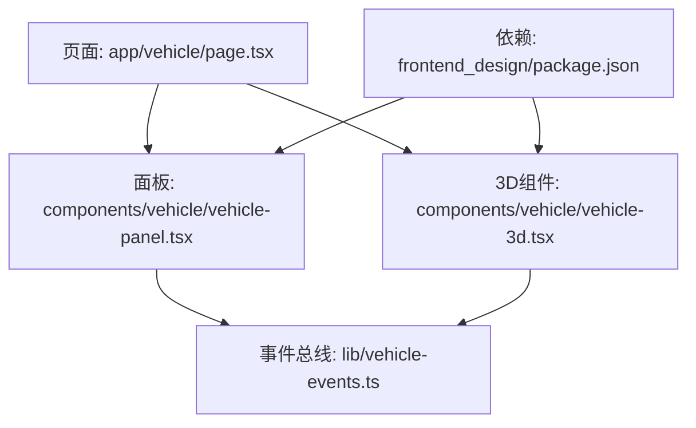
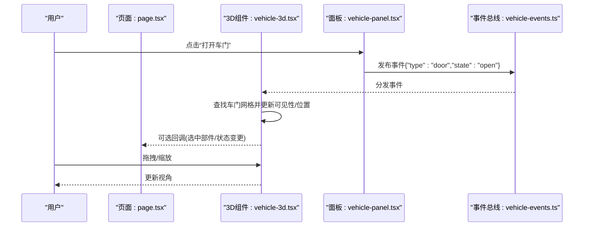
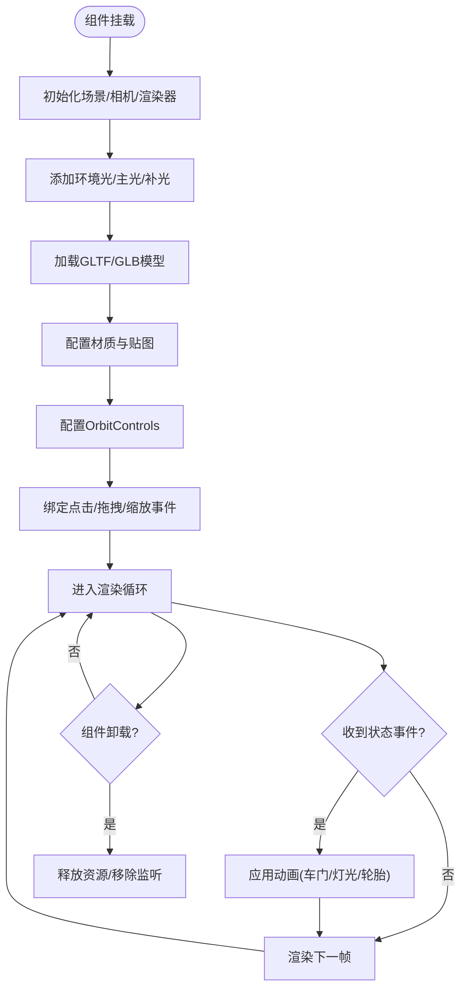
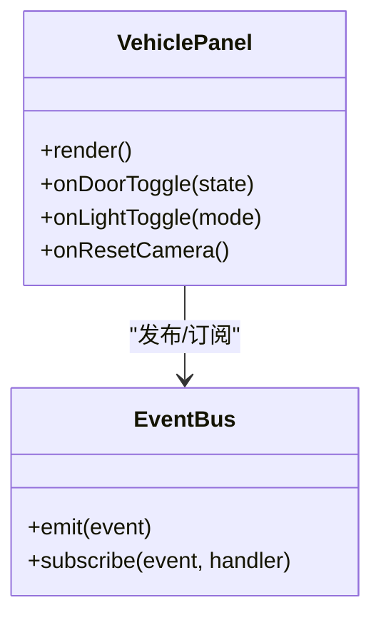
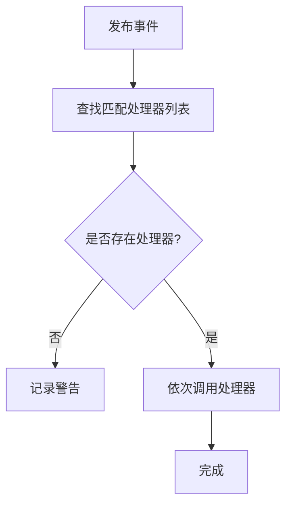
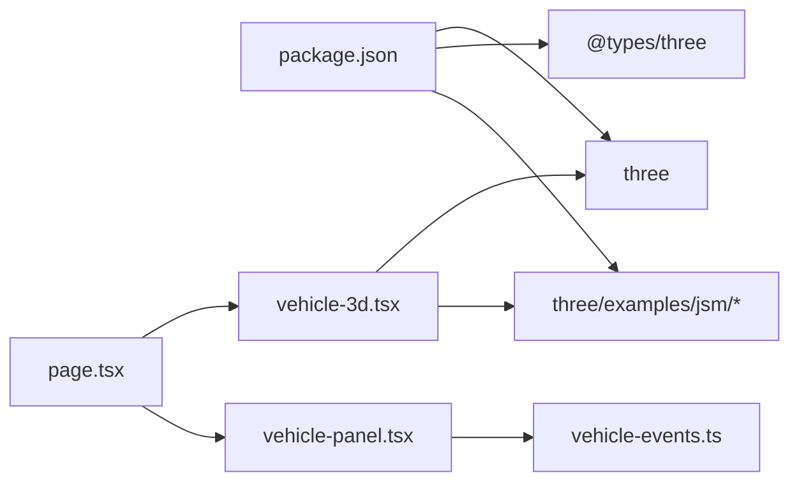

# 3D车辆模型展示

<cite>
**本文引用的文件**   
- [frontend_design/src/components/vehicle/vehicle-3d.tsx](file://frontend_design/src/components/vehicle/vehicle-3d.tsx)
- [frontend_design/src/components/vehicle/vehicle-panel.tsx](file://frontend_design/src/components/vehicle/vehicle-panel.tsx)
- [frontend_design/src/app/vehicle/page.tsx](file://frontend_design/src/app/vehicle/page.tsx)
- [frontend_design/src/lib/vehicle-events.ts](file://frontend_design/src/lib/vehicle-events.ts)
- [frontend_design/package.json](file://frontend_design/package.json)
</cite>

## 目录
1. [简介](#简介)
2. [项目结构](#项目结构)
3. [核心组件](#核心组件)
4. [架构总览](#架构总览)
5. [详细组件分析](#详细组件分析)
6. [依赖关系分析](#依赖关系分析)
7. [性能考虑](#性能考虑)
8. [故障排查指南](#故障排查指南)
9. [结论](#结论)
10. [附录](#附录)

## 简介
本文件面向NexusCockpit前端应用，聚焦“3D车辆模型展示”能力。文档围绕以下目标展开：
- 渲染技术实现：基于Three.js的3D场景、相机与控制器、材质与光照、动画系统。
- 模型加载与状态可视化：车模资源加载、车门状态、灯光控制、轮胎旋转等动态效果。
- 交互操作：点击选择、拖拽旋转、缩放查看等。
- 优化方案：几何体简化、纹理压缩、LOD等技术路径。
- 集成指南与常见问题：提供落地步骤与排障建议。

说明：当前仓库中已存在3D车辆相关的前端组件与页面入口，但未见Three.js的直接引入或具体实现代码。因此，本节与后续章节在“概念性设计”和“集成建议”层面给出可落地的方案，并在有明确源码依据的地方标注来源。

## 项目结构
与3D车辆展示直接相关的文件位于前端工程下：
- 页面入口：app/vehicle/page.tsx
- 3D组件：components/vehicle/vehicle-3d.tsx
- 控制面板：components/vehicle/vehicle-panel.tsx
- 事件总线：lib/vehicle-events.ts
- 依赖声明：package.json（用于安装Three.js及可选扩展）

图表来源
- [frontend_design/src/app/vehicle/page.tsx](file://frontend_design/src/app/vehicle/page.tsx)
- [frontend_design/src/components/vehicle/vehicle-3d.tsx](file://frontend_design/src/components/vehicle/vehicle-3d.tsx)
- [frontend_design/src/components/vehicle/vehicle-panel.tsx](file://frontend_design/src/components/vehicle/vehicle-panel.tsx)
- [frontend_design/src/lib/vehicle-events.ts](file://frontend_design/src/lib/vehicle-events.ts)
- [frontend_design/package.json](file://frontend_design/package.json)

章节来源
- [frontend_design/src/app/vehicle/page.tsx](file://frontend_design/src/app/vehicle/page.tsx)
- [frontend_design/src/components/vehicle/vehicle-3d.tsx](file://frontend_design/src/components/vehicle/vehicle-3d.tsx)
- [frontend_design/src/components/vehicle/vehicle-panel.tsx](file://frontend_design/src/components/vehicle/vehicle-panel.tsx)
- [frontend_design/src/lib/vehicle-events.ts](file://frontend_design/src/lib/vehicle-events.ts)
- [frontend_design/package.json](file://frontend_design/package.json)

## 核心组件
- 3D组件（vehicle-3d.tsx）
  - 职责：初始化Three.js场景、相机、控制器；加载GLTF/GLB车模；设置材质、光照；驱动动画（如轮胎旋转、灯光开关）；响应交互（点击、拖拽、缩放）。
  - 生命周期：挂载时创建场景与渲染器，卸载时清理资源（移除监听、释放内存）。
  - 数据流：从父组件或事件总线接收车辆状态，映射为模型子对象可见性或变换属性。
- 面板组件（vehicle-panel.tsx）
  - 职责：提供UI控件（车门开合、灯光切换、视角重置等），通过事件总线向3D组件发送指令。
- 事件总线（vehicle-events.ts）
  - 职责：轻量发布订阅机制，解耦面板与3D组件，便于跨层级通信。
- 页面（page.tsx）
  - 职责：组合3D组件与面板，承载布局与全局状态。

章节来源
- [frontend_design/src/components/vehicle/vehicle-3d.tsx](file://frontend_design/src/components/vehicle/vehicle-3d.tsx)
- [frontend_design/src/components/vehicle/vehicle-panel.tsx](file://frontend_design/src/components/vehicle/vehicle-panel.tsx)
- [frontend_design/src/lib/vehicle-events.ts](file://frontend_design/src/lib/vehicle-events.ts)
- [frontend_design/src/app/vehicle/page.tsx](file://frontend_design/src/app/vehicle/page.tsx)

## 架构总览
下图展示了3D车辆展示的整体架构与数据流向：用户通过面板触发事件，事件总线分发到3D组件，3D组件更新模型状态并驱动动画；同时，3D组件也可将交互结果（如选中部件）回传给上层。

图表来源
- [frontend_design/src/app/vehicle/page.tsx](file://frontend_design/src/app/vehicle/page.tsx)
- [frontend_design/src/components/vehicle/vehicle-3d.tsx](file://frontend_design/src/components/vehicle/vehicle-3d.tsx)
- [frontend_design/src/components/vehicle/vehicle-panel.tsx](file://frontend_design/src/components/vehicle/vehicle-panel.tsx)
- [frontend_design/src/lib/vehicle-events.ts](file://frontend_design/src/lib/vehicle-events.ts)

## 详细组件分析

### 3D组件（vehicle-3d.tsx）
- 场景初始化
  - 创建场景、透视相机、WebGL渲染器，配置抗锯齿与像素比。
  - 添加OrbitControls以实现拖拽旋转与缩放。
- 模型加载
  - 使用GLTFLoader加载GLTF/GLB车模，按名称定位车门、轮毂、灯组等子对象。
  - 对模型进行单位与坐标轴校正，必要时做居中与缩放。
- 材质与光照
  - 基础环境光+方向光/半球光，确保金属漆面与环境反射表现良好。
  - 根据车型配置PBR材质参数（粗糙度、金属度、法线贴图）。
- 动画系统
  - 使用requestAnimationFrame驱动循环，按帧更新轮胎旋转角度、车门铰链旋转、灯光强度/颜色。
  - 支持缓动函数使动作更自然。
- 交互处理
  - 射线检测实现点击选择部件，高亮显示并上报选中信息。
  - 禁用/启用控制器以配合不同交互模式。
- 资源管理
  - 组件卸载时销毁渲染器、移除控制器、释放纹理与几何体，避免内存泄漏。

图表来源
- [frontend_design/src/components/vehicle/vehicle-3d.tsx](file://frontend_design/src/components/vehicle/vehicle-3d.tsx)

章节来源
- [frontend_design/src/components/vehicle/vehicle-3d.tsx](file://frontend_design/src/components/vehicle/vehicle-3d.tsx)

### 面板组件（vehicle-panel.tsx）
- UI控件：车门开合、近光灯/远光灯/双闪、雨刮、轮胎旋转演示、视角重置等。
- 事件发布：通过事件总线发出结构化事件，包含类型、目标部件、目标状态。
- 状态同步：可选地订阅3D组件的状态回调，刷新UI指示（如指示灯）。

图表来源
- [frontend_design/src/components/vehicle/vehicle-panel.tsx](file://frontend_design/src/components/vehicle/vehicle-panel.tsx)
- [frontend_design/src/lib/vehicle-events.ts](file://frontend_design/src/lib/vehicle-events.ts)

章节来源
- [frontend_design/src/components/vehicle/vehicle-panel.tsx](file://frontend_design/src/components/vehicle/vehicle-panel.tsx)
- [frontend_design/src/lib/vehicle-events.ts](file://frontend_design/src/lib/vehicle-events.ts)

### 事件总线（vehicle-events.ts）
- 设计要点：轻量发布订阅，支持一次性订阅与批量取消。
- 事件命名规范：模块.动作.目标，例如 door.open、light.front_high、wheel.rotate。
- 错误处理：未注册处理器时记录警告，避免崩溃。

图表来源
- [frontend_design/src/lib/vehicle-events.ts](file://frontend_design/src/lib/vehicle-events.ts)

章节来源
- [frontend_design/src/lib/vehicle-events.ts](file://frontend_design/src/lib/vehicle-events.ts)

### 页面（page.tsx）
- 布局：左侧/上方放置3D画布，右侧/下方放置控制面板。
- 状态：集中持有车辆状态，作为单一事实源，供3D组件与面板共同消费。
- 集成：按需引入3D组件与面板，处理窗口尺寸变化导致的重绘。

章节来源
- [frontend_design/src/app/vehicle/page.tsx](file://frontend_design/src/app/vehicle/page.tsx)

## 依赖关系分析
- Three.js生态
  - 核心库：three
  - 加载器：@types/three（类型定义）、glTFLoader（通常随three-extras提供）
  - 控制器：OrbitControls（通常随three-extras提供）
- 构建与打包
  - Next.js默认支持ESM与静态资源导入，需确保Node版本与插件兼容。
- 包管理
  - 在package.json中添加依赖后执行安装命令，保证运行时可用。

图表来源
- [frontend_design/package.json](file://frontend_design/package.json)
- [frontend_design/src/app/vehicle/page.tsx](file://frontend_design/src/app/vehicle/page.tsx)
- [frontend_design/src/components/vehicle/vehicle-3d.tsx](file://frontend_design/src/components/vehicle/vehicle-3d.tsx)
- [frontend_design/src/components/vehicle/vehicle-panel.tsx](file://frontend_design/src/components/vehicle/vehicle-panel.tsx)
- [frontend_design/src/lib/vehicle-events.ts](file://frontend_design/src/lib/vehicle-events.ts)

章节来源
- [frontend_design/package.json](file://frontend_design/package.json)

## 性能考虑
- 模型与纹理
  - 使用GLTF/GLB格式，开启Draco压缩；纹理采用KTX2/ASTC等GPU友好格式。
  - 合理拆分模型，按部件组织节点名，便于选择性渲染与LOD切换。
- 渲染优化
  - 限制像素比（devicePixelRatio上限），降低阴影分辨率与采样次数。
  - 合并静态网格，减少draw call；对频繁更新的部件单独分层。
- 动画与计算
  - 使用增量时间步长，避免大跳帧；对复杂动画使用骨骼动画而非逐顶点更新。
  - 节流高频事件（如鼠标移动），仅在需要时更新。
- 内存管理
  - 组件卸载时显式释放纹理、几何体、材质与渲染器上下文。
  - 避免闭包引用导致GC无法回收。

[本节为通用性能建议，不直接分析具体文件]

## 故障排查指南
- 黑屏或无渲染
  - 检查是否成功创建渲染器与场景，确认容器尺寸非零。
  - 确认Three.js及相关示例模块已正确安装与导入。
- 模型不显示
  - 检查GLTF/GLB路径是否正确，服务器是否返回200。
  - 确认模型坐标系与单位，必要时进行缩放与平移。
- 交互无效
  - 确认OrbitControls已启用且未被其他事件拦截。
  - 检查射线检测的相机与屏幕坐标转换是否正确。
- 内存泄漏
  - 确认组件卸载时移除了所有事件监听与动画循环。
  - 检查是否有全局变量缓存了大型对象。
- 事件未触发
  - 确认事件总线订阅在组件挂载前已完成。
  - 检查事件命名是否与发布者一致。

章节来源
- [frontend_design/src/components/vehicle/vehicle-3d.tsx](file://frontend_design/src/components/vehicle/vehicle-3d.tsx)
- [frontend_design/src/components/vehicle/vehicle-panel.tsx](file://frontend_design/src/components/vehicle/vehicle-panel.tsx)
- [frontend_design/src/lib/vehicle-events.ts](file://frontend_design/src/lib/vehicle-events.ts)

## 结论
本方案以Next.js为宿主，结合Three.js生态实现3D车辆模型的加载、材质与光照、动画与交互。通过事件总线解耦面板与3D组件，形成清晰的数据流与职责边界。在生产环境中，应重点关注模型与纹理压缩、渲染参数调优与内存管理，以获得稳定流畅的用户体验。

[本节为总结性内容，不直接分析具体文件]

## 附录

### 集成步骤（概览）
- 安装依赖
  - 在package.json中添加three、@types/three以及需要的examples模块。
  - 执行包管理器安装命令，确保本地与CI环境一致。
- 准备模型资源
  - 导出GLTF/GLB，确保节点命名规范（如door_front_left、wheel_fl等）。
  - 将模型与贴图放入public或静态资源目录，确保可被浏览器访问。
- 接入3D组件
  - 在页面中引入3D组件与面板，传入初始状态与回调。
  - 在组件内部实现场景初始化、模型加载与动画循环。
- 联调与测试
  - 验证各交互功能（车门、灯光、轮胎旋转、视角控制）。
  - 进行性能基准测试与内存泄漏扫描。

[本节为概念性指导，不直接分析具体文件]